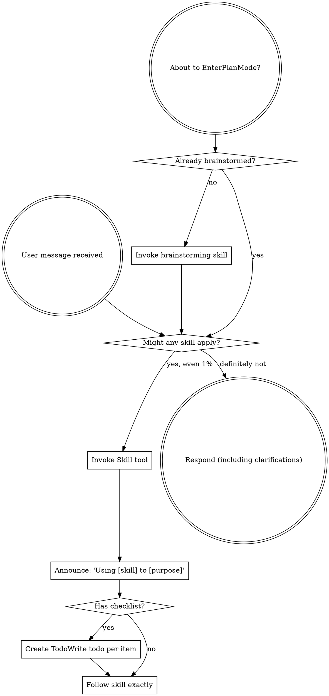

# codex advisor artifact

- Provider: codex
- Exit code: 0
- Created at: 2026-04-11T05:34:34.371Z

## Original task

reply with exactly: codex-ok

## Final prompt

reply with exactly: codex-ok

## Raw output

```text
codex-ok


OpenAI Codex v0.117.0 (research preview)
--------
workdir: C:\Users\hoo\Documents\z_cqmeng_file\local_repository\SlideTutor-AI-main
model: gpt-5.4
provider: right_code
approval: never
sandbox: danger-full-access
reasoning effort: high
reasoning summaries: none
session id: 019d7b08-860f-7713-bcec-f1e7b639ee7c
--------
user
reply with exactly: codex-ok
warning: Ignoring malformed agent role definition: agents.gsd-advisor-researcher.config_file must point to an existing file at C:\Users\qiqicute\Documents\z_cqmeng_file\local_repository\SlideTutor-AI-main\.codex\agents\gsd-advisor-researcher.toml: 系统找不到指定的路径。 (os error 3)
warning: Ignoring malformed agent role definition: agents.gsd-assumptions-analyzer.config_file must point to an existing file at C:\Users\qiqicute\Documents\z_cqmeng_file\local_repository\SlideTutor-AI-main\.codex\agents\gsd-assumptions-analyzer.toml: 系统找不到指定的路径。 (os error 3)
warning: Ignoring malformed agent role definition: agents.gsd-codebase-mapper.config_file must point to an existing file at C:\Users\qiqicute\Documents\z_cqmeng_file\local_repository\SlideTutor-AI-main\.codex\agents\gsd-codebase-mapper.toml: 系统找不到指定的路径。 (os error 3)
warning: Ignoring malformed agent role definition: agents.gsd-debugger.config_file must point to an existing file at C:\Users\qiqicute\Documents\z_cqmeng_file\local_repository\SlideTutor-AI-main\.codex\agents\gsd-debugger.toml: 系统找不到指定的路径。 (os error 3)
warning: Ignoring malformed agent role definition: agents.gsd-executor.config_file must point to an existing file at C:\Users\qiqicute\Documents\z_cqmeng_file\local_repository\SlideTutor-AI-main\.codex\agents\gsd-executor.toml: 系统找不到指定的路径。 (os error 3)
warning: Ignoring malformed agent role definition: agents.gsd-integration-checker.config_file must point to an existing file at C:\Users\qiqicute\Documents\z_cqmeng_file\local_repository\SlideTutor-AI-main\.codex\agents\gsd-integration-checker.toml: 系统找不到指定的路径。 (os error 3)
warning: Ignoring malformed agent role definition: agents.gsd-nyquist-auditor.config_file must point to an existing file at C:\Users\qiqicute\Documents\z_cqmeng_file\local_repository\SlideTutor-AI-main\.codex\agents\gsd-nyquist-auditor.toml: 系统找不到指定的路径。 (os error 3)
warning: Ignoring malformed agent role definition: agents.gsd-phase-researcher.config_file must point to an existing file at C:\Users\qiqicute\Documents\z_cqmeng_file\local_repository\SlideTutor-AI-main\.codex\agents\gsd-phase-researcher.toml: 系统找不到指定的路径。 (os error 3)
warning: Ignoring malformed agent role definition: agents.gsd-plan-checker.config_file must point to an existing file at C:\Users\qiqicute\Documents\z_cqmeng_file\local_repository\SlideTutor-AI-main\.codex\agents\gsd-plan-checker.toml: 系统找不到指定的路径。 (os error 3)
warning: Ignoring malformed agent role definition: agents.gsd-planner.config_file must point to an existing file at C:\Users\qiqicute\Documents\z_cqmeng_file\local_repository\SlideTutor-AI-main\.codex\agents\gsd-planner.toml: 系统找不到指定的路径。 (os error 3)
warning: Ignoring malformed agent role definition: agents.gsd-project-researcher.config_file must point to an existing file at C:\Users\qiqicute\Documents\z_cqmeng_file\local_repository\SlideTutor-AI-main\.codex\agents\gsd-project-researcher.toml: 系统找不到指定的路径。 (os error 3)
warning: Ignoring malformed agent role definition: agents.gsd-research-synthesizer.config_file must point to an existing file at C:\Users\qiqicute\Documents\z_cqmeng_file\local_repository\SlideTutor-AI-main\.codex\agents\gsd-research-synthesizer.toml: 系统找不到指定的路径。 (os error 3)
warning: Ignoring malformed agent role definition: agents.gsd-roadmapper.config_file must point to an existing file at C:\Users\qiqicute\Documents\z_cqmeng_file\local_repository\SlideTutor-AI-main\.codex\agents\gsd-roadmapper.toml: 系统找不到指定的路径。 (os error 3)
warning: Ignoring malformed agent role definition: agents.gsd-ui-auditor.config_file must point to an existing file at C:\Users\qiqicute\Documents\z_cqmeng_file\local_repository\SlideTutor-AI-main\.codex\agents\gsd-ui-auditor.toml: 系统找不到指定的路径。 (os error 3)
warning: Ignoring malformed agent role definition: agents.gsd-ui-checker.config_file must point to an existing file at C:\Users\qiqicute\Documents\z_cqmeng_file\local_repository\SlideTutor-AI-main\.codex\agents\gsd-ui-checker.toml: 系统找不到指定的路径。 (os error 3)
warning: Ignoring malformed agent role definition: agents.gsd-ui-researcher.config_file must point to an existing file at C:\Users\qiqicute\Documents\z_cqmeng_file\local_repository\SlideTutor-AI-main\.codex\agents\gsd-ui-researcher.toml: 系统找不到指定的路径。 (os error 3)
warning: Ignoring malformed agent role definition: agents.gsd-user-profiler.config_file must point to an existing file at C:\Users\qiqicute\Documents\z_cqmeng_file\local_repository\SlideTutor-AI-main\.codex\agents\gsd-user-profiler.toml: 系统找不到指定的路径。 (os error 3)
warning: Ignoring malformed agent role definition: agents.gsd-verifier.config_file must point to an existing file at C:\Users\qiqicute\Documents\z_cqmeng_file\local_repository\SlideTutor-AI-main\.codex\agents\gsd-verifier.toml: 系统找不到指定的路径。 (os error 3)
exec
"C:\\Windows\\System32\\WindowsPowerShell\\v1.0\\powershell.exe" -Command "Get-Content -Raw '.agents/skills/using-superpowers/SKILL.md'" in C:\Users\hoo\Documents\z_cqmeng_file\local_repository\SlideTutor-AI-main
 succeeded in 1914ms:
---
name: using-superpowers
description: Use when starting any conversation - establishes how to find and use skills, requiring Skill tool invocation before ANY response including clarifying questions
---

<SUBAGENT-STOP>
If you were dispatched as a subagent to execute a specific task, skip this skill.
</SUBAGENT-STOP>

<EXTREMELY-IMPORTANT>
If you think there is even a 1% chance a skill might apply to what you are doing, you ABSOLUTELY MUST invoke the skill.

IF A SKILL APPLIES TO YOUR TASK, YOU DO NOT HAVE A CHOICE. YOU MUST USE IT.

This is not negotiable. This is not optional. You cannot rationalize your way out of this.
</EXTREMELY-IMPORTANT>

## Instruction Priority

Superpowers skills override default system prompt behavior, but **user instructions always take precedence**:

1. **User's explicit instructions** (CLAUDE.md, GEMINI.md, AGENTS.md, direct requests) 鈥?highest priority
2. **Superpowers skills** 鈥?override default system behavior where they conflict
3. **Default system prompt** 鈥?lowest priority

If CLAUDE.md, GEMINI.md, or AGENTS.md says "don't use TDD" and a skill says "always use TDD," follow the user's instructions. The user is in control.

## How to Access Skills

**In Claude Code:** Use the `Skill` tool. When you invoke a skill, its content is loaded and presented to you鈥攆ollow it directly. Never use the Read tool on skill files.

**In Gemini CLI:** Skills activate via the `activate_skill` tool. Gemini loads skill metadata at session start and activates the full content on demand.

**In other environments:** Check your platform's documentation for how skills are loaded.

## Platform Adaptation

Skills use Claude Code tool names. Non-CC platforms: see `references/codex-tools.md` (Codex) for tool equivalents. Gemini CLI users get the tool mapping loaded automatically via GEMINI.md.

# Using Skills

## The Rule

**Invoke relevant or requested skills BEFORE any response or action.** Even a 1% chance a skill might apply means that you should invoke the skill to check. If an invoked skill turns out to be wrong for the situation, you don't need to use it.



## Red Flags

These thoughts mean STOP鈥攜ou're rationalizing:

| Thought | Reality |
|---------|---------|
| "This is just a simple question" | Questions are tasks. Check for skills. |
| "I need more context first" | Skill check comes BEFORE clarifying questions. |
| "Let me explore the codebase first" | Skills tell you HOW to explore. Check first. |
| "I can check git/files quickly" | Files lack conversation context. Check for skills. |
| "Let me gather information first" | Skills tell you HOW to gather information. |
| "This doesn't need a formal skill" | If a skill exists, use it. |
| "I remember this skill" | Skills evolve. Read current version. |
| "This doesn't count as a task" | Action = task. Check for skills. |
| "The skill is overkill" | Simple things become complex. Use it. |
| "I'll just do this one thing first" | Check BEFORE doing anything. |
| "This feels productive" | Undisciplined action wastes time. Skills prevent this. |
| "I know what that means" | Knowing the concept 鈮?using the skill. Invoke it. |

## Skill Priority

When multiple skills could apply, use this order:

1. **Process skills first** (brainstorming, debugging) - these determine HOW to approach the task
2. **Implementation skills second** (frontend-design, mcp-builder) - these guide execution

"Let's build X" 鈫?brainstorming first, then implementation skills.
"Fix this bug" 鈫?debugging first, then domain-specific skills.

## Skill Types

**Rigid** (TDD, debugging): Follow exactly. Don't adapt away discipline.

**Flexible** (patterns): Adapt principles to context.

The skill itself tells you which.

## User Instructions

Instructions say WHAT, not HOW. "Add X" or "Fix Y" doesn't mean skip workflows.


codex
codex-ok
tokens used
25,437

```

## Concise summary

Provider completed successfully. Review the raw output for details.

## Action items

- Review the response and extract decisions you want to apply.
- Capture follow-up implementation tasks if needed.
