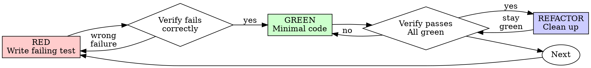
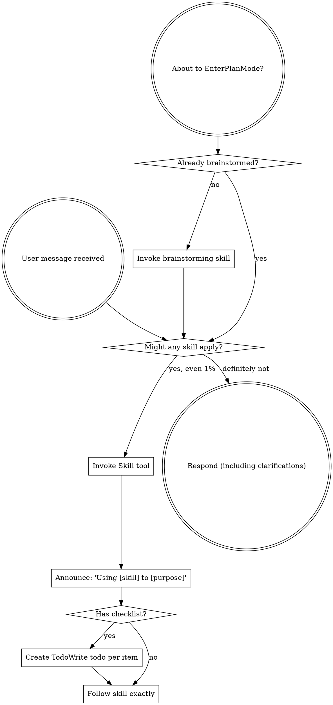
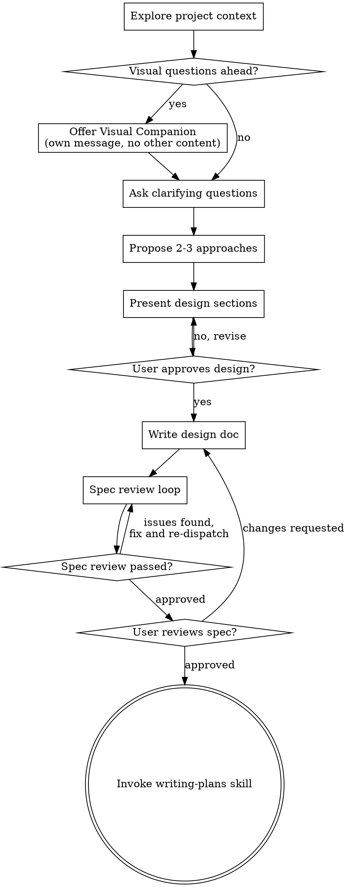

# codex advisor artifact

- Provider: codex
- Exit code: 0
- Created at: 2026-04-11T15:25:32.426Z

## Original task

请在 SlideTutor-AI 项目中实现下一项设置页优化：为 BYOK 用户在 Optional Parser / LlamaParse 区域增加申请指引、链接和简要操作说明。要求：1) 面向新手用户，告诉他们如何获取 LlamaParse API key；2) 至少包含一个明确的外部入口链接，以及 1-3 条简短步骤；3) 不把设置页做得过重，保持当前统一的 InfoTrigger / 轻量说明风格；4) 不引入新的复杂逻辑，只做前端 UI 与必要测试；5) 不影响现有 parser 配置逻辑；6) 若需要外链，使用项目中已有的外链模式；7) 修改后运行相关测试，至少覆盖 SettingsModal.test.tsx 与相关设置页测试；8) 最后输出：修改了哪些文件、用户最终会看到什么、测试是否通过。

## Final prompt

请在 SlideTutor-AI 项目中实现下一项设置页优化：为 BYOK 用户在 Optional Parser / LlamaParse 区域增加申请指引、链接和简要操作说明。要求：1) 面向新手用户，告诉他们如何获取 LlamaParse API key；2) 至少包含一个明确的外部入口链接，以及 1-3 条简短步骤；3) 不把设置页做得过重，保持当前统一的 InfoTrigger / 轻量说明风格；4) 不引入新的复杂逻辑，只做前端 UI 与必要测试；5) 不影响现有 parser 配置逻辑；6) 若需要外链，使用项目中已有的外链模式；7) 修改后运行相关测试，至少覆盖 SettingsModal.test.tsx 与相关设置页测试；8) 最后输出：修改了哪些文件、用户最终会看到什么、测试是否通过。

## Raw output

```text
已完成这项设置页优化，改动集中在这 3 个文件：

- [SettingsModal.tsx](C:/Users/hoo/Documents/z_cqmeng_file/local_repository/SlideTutor-AI-main/SlideTutor-AI/src/components/SettingsModal.tsx#L13)
- [index.ts](C:/Users/hoo/Documents/z_cqmeng_file/local_repository/SlideTutor-AI-main/SlideTutor-AI/src/lib/i18n/index.ts#L56)
- [SettingsModal.test.tsx](C:/Users/hoo/Documents/z_cqmeng_file/local_repository/SlideTutor-AI-main/SlideTutor-AI/src/components/SettingsModal.test.tsx#L432)

用户最终会看到的是：在 `My API` 的 `Optional Parser` 标题右侧 info 图标里，点开后会出现一个轻量浮层，包含：
- 一句“这是可选 parser，不配置也会走 degraded analysis”
- 一个明确入口链接 `Open LlamaCloud`
- 3 条新手步骤：注册/登录 LlamaCloud、到左侧 `API Key` 创建 key、把 `llx-...` key 粘贴回设置页

现有 parser 配置逻辑没动：`Parser Provider` 下拉、`LlamaParse API Key` 输入框、`none -> llamaparse` 的切换行为都保持原样，只补了前端说明文案和入口。

验证结果：
- `npm test -- src/components/SettingsModal.test.tsx src/components/settings/PlatformApiSection.test.tsx` 通过，`16/16` 通过
- `npm run lint` 通过
- `npm run build` 通过


OpenAI Codex v0.117.0 (research preview)
--------
workdir: C:\Users\hoo\Documents\z_cqmeng_file\local_repository\SlideTutor-AI-main
model: gpt-5.4
provider: right_code
approval: never
sandbox: danger-full-access
reasoning effort: high
reasoning summaries: none
session id: 019d7d1e-99d6-75f3-a52e-06c40f0a7a87
--------
user
请在 SlideTutor-AI 项目中实现下一项设置页优化：为 BYOK 用户在 Optional Parser / LlamaParse 区域增加申请指引、链接和简要操作说明。要求：1) 面向新手用户，告诉他们如何获取 LlamaParse API key；2) 至少包含一个明确的外部入口链接，以及 1-3 条简短步骤；3) 不把设置页做得过重，保持当前统一的 InfoTrigger / 轻量说明风格；4) 不引入新的复杂逻辑，只做前端 UI 与必要测试；5) 不影响现有 parser 配置逻辑；6) 若需要外链，使用项目中已有的外链模式；7) 修改后运行相关测试，至少覆盖 SettingsModal.test.tsx 与相关设置页测试；8) 最后输出：修改了哪些文件、用户最终会看到什么、测试是否通过。
warning: Ignoring malformed agent role definition: agents.gsd-advisor-researcher.config_file must point to an existing file at C:\Users\qiqicute\Documents\z_cqmeng_file\local_repository\SlideTutor-AI-main\.codex\agents\gsd-advisor-researcher.toml: 系统找不到指定的路径。 (os error 3)
warning: Ignoring malformed agent role definition: agents.gsd-assumptions-analyzer.config_file must point to an existing file at C:\Users\qiqicute\Documents\z_cqmeng_file\local_repository\SlideTutor-AI-main\.codex\agents\gsd-assumptions-analyzer.toml: 系统找不到指定的路径。 (os error 3)
warning: Ignoring malformed agent role definition: agents.gsd-codebase-mapper.config_file must point to an existing file at C:\Users\qiqicute\Documents\z_cqmeng_file\local_repository\SlideTutor-AI-main\.codex\agents\gsd-codebase-mapper.toml: 系统找不到指定的路径。 (os error 3)
warning: Ignoring malformed agent role definition: agents.gsd-debugger.config_file must point to an existing file at C:\Users\qiqicute\Documents\z_cqmeng_file\local_repository\SlideTutor-AI-main\.codex\agents\gsd-debugger.toml: 系统找不到指定的路径。 (os error 3)
warning: Ignoring malformed agent role definition: agents.gsd-executor.config_file must point to an existing file at C:\Users\qiqicute\Documents\z_cqmeng_file\local_repository\SlideTutor-AI-main\.codex\agents\gsd-executor.toml: 系统找不到指定的路径。 (os error 3)
warning: Ignoring malformed agent role definition: agents.gsd-integration-checker.config_file must point to an existing file at C:\Users\qiqicute\Documents\z_cqmeng_file\local_repository\SlideTutor-AI-main\.codex\agents\gsd-integration-checker.toml: 系统找不到指定的路径。 (os error 3)
warning: Ignoring malformed agent role definition: agents.gsd-nyquist-auditor.config_file must point to an existing file at C:\Users\qiqicute\Documents\z_cqmeng_file\local_repository\SlideTutor-AI-main\.codex\agents\gsd-nyquist-auditor.toml: 系统找不到指定的路径。 (os error 3)
warning: Ignoring malformed agent role definition: agents.gsd-phase-researcher.config_file must point to an existing file at C:\Users\qiqicute\Documents\z_cqmeng_file\local_repository\SlideTutor-AI-main\.codex\agents\gsd-phase-researcher.toml: 系统找不到指定的路径。 (os error 3)
warning: Ignoring malformed agent role definition: agents.gsd-plan-checker.config_file must point to an existing file at C:\Users\qiqicute\Documents\z_cqmeng_file\local_repository\SlideTutor-AI-main\.codex\agents\gsd-plan-checker.toml: 系统找不到指定的路径。 (os error 3)
warning: Ignoring malformed agent role definition: agents.gsd-planner.config_file must point to an existing file at C:\Users\qiqicute\Documents\z_cqmeng_file\local_repository\SlideTutor-AI-main\.codex\agents\gsd-planner.toml: 系统找不到指定的路径。 (os error 3)
warning: Ignoring malformed agent role definition: agents.gsd-project-researcher.config_file must point to an existing file at C:\Users\qiqicute\Documents\z_cqmeng_file\local_repository\SlideTutor-AI-main\.codex\agents\gsd-project-researcher.toml: 系统找不到指定的路径。 (os error 3)
warning: Ignoring malformed agent role definition: agents.gsd-research-synthesizer.config_file must point to an existing file at C:\Users\qiqicute\Documents\z_cqmeng_file\local_repository\SlideTutor-AI-main\.codex\agents\gsd-research-synthesizer.toml: 系统找不到指定的路径。 (os error 3)
warning: Ignoring malformed agent role definition: agents.gsd-roadmapper.config_file must point to an existing file at C:\Users\qiqicute\Documents\z_cqmeng_file\local_repository\SlideTutor-AI-main\.codex\agents\gsd-roadmapper.toml: 系统找不到指定的路径。 (os error 3)
warning: Ignoring malformed agent role definition: agents.gsd-ui-auditor.config_file must point to an existing file at C:\Users\qiqicute\Documents\z_cqmeng_file\local_repository\SlideTutor-AI-main\.codex\agents\gsd-ui-auditor.toml: 系统找不到指定的路径。 (os error 3)
warning: Ignoring malformed agent role definition: agents.gsd-ui-checker.config_file must point to an existing file at C:\Users\qiqicute\Documents\z_cqmeng_file\local_repository\SlideTutor-AI-main\.codex\agents\gsd-ui-checker.toml: 系统找不到指定的路径。 (os error 3)
warning: Ignoring malformed agent role definition: agents.gsd-ui-researcher.config_file must point to an existing file at C:\Users\qiqicute\Documents\z_cqmeng_file\local_repository\SlideTutor-AI-main\.codex\agents\gsd-ui-researcher.toml: 系统找不到指定的路径。 (os error 3)
warning: Ignoring malformed agent role definition: agents.gsd-user-profiler.config_file must point to an existing file at C:\Users\qiqicute\Documents\z_cqmeng_file\local_repository\SlideTutor-AI-main\.codex\agents\gsd-user-profiler.toml: 系统找不到指定的路径。 (os error 3)
warning: Ignoring malformed agent role definition: agents.gsd-verifier.config_file must point to an existing file at C:\Users\qiqicute\Documents\z_cqmeng_file\local_repository\SlideTutor-AI-main\.codex\agents\gsd-verifier.toml: 系统找不到指定的路径。 (os error 3)
codex
我会先按仓库要求读取相关技能与设置页代码，确认现有 `InfoTrigger` / 外链模式、测试结构和 `LlamaParse` 区域实现，再做最小 UI 改动并补测试。
exec
"C:\\Windows\\System32\\WindowsPowerShell\\v1.0\\powershell.exe" -Command 'Get-Content -Raw .agents/skills/brainstorming/SKILL.md' in C:\Users\hoo\Documents\z_cqmeng_file\local_repository\SlideTutor-AI-main
exec
"C:\\Windows\\System32\\WindowsPowerShell\\v1.0\\powershell.exe" -Command 'Get-Content -Raw .agents/skills/test-driven-development/SKILL.md' in C:\Users\hoo\Documents\z_cqmeng_file\local_repository\SlideTutor-AI-main
exec
"C:\\Windows\\System32\\WindowsPowerShell\\v1.0\\powershell.exe" -Command 'Get-Content -Raw .agents/skills/verification-before-completion/SKILL.md' in C:\Users\hoo\Documents\z_cqmeng_file\local_repository\SlideTutor-AI-main
exec
"C:\\Windows\\System32\\WindowsPowerShell\\v1.0\\powershell.exe" -Command 'Get-Content -Raw .agents/skills/using-superpowers/SKILL.md' in C:\Users\hoo\Documents\z_cqmeng_file\local_repository\SlideTutor-AI-main
 succeeded in 3591ms:
---
name: test-driven-development
description: Use when implementing any feature or bugfix, before writing implementation code
---

# Test-Driven Development (TDD)

## Overview

Write the test first. Watch it fail. Write minimal code to pass.

**Core principle:** If you didn't watch the test fail, you don't know if it tests the right thing.

**Violating the letter of the rules is violating the spirit of the rules.**

## When to Use

**Always:**
- New features
- Bug fixes
- Refactoring
- Behavior changes

**Exceptions (ask your human partner):**
- Throwaway prototypes
- Generated code
- Configuration files

Thinking "skip TDD just this once"? Stop. That's rationalization.

## The Iron Law

```
NO PRODUCTION CODE WITHOUT A FAILING TEST FIRST
```

Write code before the test? Delete it. Start over.

**No exceptions:**
- Don't keep it as "reference"
- Don't "adapt" it while writing tests
- Don't look at it
- Delete means delete

Implement fresh from tests. Period.

## Red-Green-Refactor



### RED - Write Failing Test

Write one minimal test showing what should happen.

<Good>
```typescript
test('retries failed operations 3 times', async () => {
  let attempts = 0;
  const operation = () => {
    attempts++;
    if (attempts < 3) throw new Error('fail');
    return 'success';
  };

  const result = await retryOperation(operation);

  expect(result).toBe('success');
  expect(attempts).toBe(3);
});
```
Clear name, tests real behavior, one thing
</Good>

<Bad>
```typescript
test('retry works', async () => {
  const mock = jest.fn()
    .mockRejectedValueOnce(new Error())
    .mockRejectedValueOnce(new Error())
    .mockResolvedValueOnce('success');
  await retryOperation(mock);
  expect(mock).toHaveBeenCalledTimes(3);
});
```
Vague name, tests mock not code
</Bad>

**Requirements:**
- One behavior
- Clear name
- Real code (no mocks unless unavoidable)

### Verify RED - Watch It Fail

**MANDATORY. Never skip.**

```bash
npm test path/to/test.test.ts
```

Confirm:
- Test fails (not errors)
- Failure message is expected
- Fails because feature missing (not typos)

**Test passes?** You're testing existing behavior. Fix test.

**Test errors?** Fix error, re-run until it fails correctly.

### GREEN - Minimal Code

Write simplest code to pass the test.

<Good>
```typescript
async function retryOperation<T>(fn: () => Promise<T>): Promise<T> {
  for (let i = 0; i < 3; i++) {
    try {
      return await fn();
    } catch (e) {
      if (i === 2) throw e;
    }
  }
  throw new Error('unreachable');
}
```
Just enough to pass
</Good>

<Bad>
```typescript
async function retryOperation<T>(
  fn: () => Promise<T>,
  options?: {
    maxRetries?: number;
    backoff?: 'linear' | 'exponential';
    onRetry?: (attempt: number) => void;
  }
): Promise<T> {
  // YAGNI
}
```
Over-engineered
</Bad>

Don't add features, refactor other code, or "improve" beyond the test.

### Verify GREEN - Watch It Pass

**MANDATORY.**

```bash
npm test path/to/test.test.ts
```

Confirm:
- Test passes
- Other tests still pass
- Output pristine (no errors, warnings)

**Test fails?** Fix code, not test.

**Other tests fail?** Fix now.

### REFACTOR - Clean Up

After green only:
- Remove duplication
- Improve names
- Extract helpers

Keep tests green. Don't add behavior.

### Repeat

Next failing test for next feature.

## Good Tests

| Quality | Good | Bad |
|---------|------|-----|
| **Minimal** | One thing. "and" in name? Split it. | `test('validates email and domain and whitespace')` |
| **Clear** | Name describes behavior | `test('test1')` |
| **Shows intent** | Demonstrates desired API | Obscures what code should do |

## Why Order Matters

**"I'll write tests after to verify it works"**

Tests written after code pass immediately. Passing immediately proves nothing:
- Might test wrong thing
- Might test implementation, not behavior
- Might miss edge cases you forgot
- You never saw it catch the bug

Test-first forces you to see the test fail, proving it actually tests something.

**"I already manually tested all the edge cases"**

Manual testing is ad-hoc. You think you tested everything but:
- No record of what you tested
- Can't re-run when code changes
- Easy to forget cases under pressure
- "It worked when I tried it" 鈮?comprehensive

Automated tests are systematic. They run the same way every time.

**"Deleting X hours of work is wasteful"**

Sunk cost fallacy. The time is already gone. Your choice now:
- Delete and rewrite with TDD (X more hours, high confidence)
- Keep it and add tests after (30 min, low confidence, likely bugs)

The "waste" is keeping code you can't trust. Working code without real tests is technical debt.

**"TDD is dogmatic, being pragmatic means adapting"**

TDD IS pragmatic:
- Finds bugs before commit (faster than debugging after)
- Prevents regressions (tests catch breaks immediately)
- Documents behavior (tests show how to use code)
- Enables refactoring (change freely, tests catch breaks)

"Pragmatic" shortcuts = debugging in production = slower.

**"Tests after achieve the same goals - it's spirit not ritual"**

No. Tests-after answer "What does this do?" Tests-first answer "What should this do?"

Tests-after are biased by your implementation. You test what you built, not what's required. You verify remembered edge cases, not discovered ones.

Tests-first force edge case discovery before implementing. Tests-after verify you remembered everything (you didn't).

30 minutes of tests after 鈮?TDD. You get coverage, lose proof tests work.

## Common Rationalizations

| Excuse | Reality |
|--------|---------|
| "Too simple to test" | Simple code breaks. Test takes 30 seconds. |
| "I'll test after" | Tests passing immediately prove nothing. |
| "Tests after achieve same goals" | Tests-after = "what does this do?" Tests-first = "what should this do?" |
| "Already manually tested" | Ad-hoc 鈮?systematic. No record, can't re-run. |
| "Deleting X hours is wasteful" | Sunk cost fallacy. Keeping unverified code is technical debt. |
| "Keep as reference, write tests first" | You'll adapt it. That's testing after. Delete means delete. |
| "Need to explore first" | Fine. Throw away exploration, start with TDD. |
| "Test hard = design unclear" | Listen to test. Hard to test = hard to use. |
| "TDD will slow me down" | TDD faster than debugging. Pragmatic = test-first. |
| "Manual test faster" | Manual doesn't prove edge cases. You'll re-test every change. |
| "Existing code has no tests" | You're improving it. Add tests for existing code. |

## Red Flags - STOP and Start Over

- Code before test
- Test after implementation
- Test passes immediately
- Can't explain why test failed
- Tests added "later"
- Rationalizing "just this once"
- "I already manually tested it"
- "Tests after achieve the same purpose"
- "It's about spirit not ritual"
- "Keep as reference" or "adapt existing code"
- "Already spent X hours, deleting is wasteful"
- "TDD is dogmatic, I'm being pragmatic"
- "This is different because..."

**All of these mean: Delete code. Start over with TDD.**

## Example: Bug Fix

**Bug:** Empty email accepted

**RED**
```typescript
test('rejects empty email', async () => {
  const result = await submitForm({ email: '' });
  expect(result.error).toBe('Email required');
});
```

**Verify RED**
```bash
$ npm test
FAIL: expected 'Email required', got undefined
```

**GREEN**
```typescript
function submitForm(data: FormData) {
  if (!data.email?.trim()) {
    return { error: 'Email required' };
  }
  // ...
}
```

**Verify GREEN**
```bash
$ npm test
PASS
```

**REFACTOR**
Extract validation for multiple fields if needed.

## Verification Checklist

Before marking work complete:

- [ ] Every new function/method has a test
- [ ] Watched each test fail before implementing
- [ ] Each test failed for expected reason (feature missing, not typo)
- [ ] Wrote minimal code to pass each test
- [ ] All tests pass
- [ ] Output pristine (no errors, warnings)
- [ ] Tests use real code (mocks only if unavoidable)
- [ ] Edge cases and errors covered

Can't check all boxes? You skipped TDD. Start over.

## When Stuck

| Problem | Solution |
|---------|----------|
| Don't know how to test | Write wished-for API. Write assertion first. Ask your human partner. |
| Test too complicated | Design too complicated. Simplify interface. |
| Must mock everything | Code too coupled. Use dependency injection. |
| Test setup huge | Extract helpers. Still complex? Simplify design. |

## Debugging Integration

Bug found? Write failing test reproducing it. Follow TDD cycle. Test proves fix and prevents regression.

Never fix bugs without a test.

## Testing Anti-Patterns

When adding mocks or test utilities, read @testing-anti-patterns.md to avoid common pitfalls:
- Testing mock behavior instead of real behavior
- Adding test-only methods to production classes
- Mocking without understanding dependencies

## Final Rule

```
Production code 鈫?test exists and failed first
Otherwise 鈫?not TDD
```

No exceptions without your human partner's permission.


 succeeded in 3764ms:
---
name: verification-before-completion
description: Use when about to claim work is complete, fixed, or passing, before committing or creating PRs - requires running verification commands and confirming output before making any success claims; evidence before assertions always
---

# Verification Before Completion

## Overview

Claiming work is complete without verification is dishonesty, not efficiency.

**Core principle:** Evidence before claims, always.

**Violating the letter of this rule is violating the spirit of this rule.**

## The Iron Law

```
NO COMPLETION CLAIMS WITHOUT FRESH VERIFICATION EVIDENCE
```

If you haven't run the verification command in this message, you cannot claim it passes.

## The Gate Function

```
BEFORE claiming any status or expressing satisfaction:

1. IDENTIFY: What command proves this claim?
2. RUN: Execute the FULL command (fresh, complete)
3. READ: Full output, check exit code, count failures
4. VERIFY: Does output confirm the claim?
   - If NO: State actual status with evidence
   - If YES: State claim WITH evidence
5. ONLY THEN: Make the claim

Skip any step = lying, not verifying
```

## Common Failures

| Claim | Requires | Not Sufficient |
|-------|----------|----------------|
| Tests pass | Test command output: 0 failures | Previous run, "should pass" |
| Linter clean | Linter output: 0 errors | Partial check, extrapolation |
| Build succeeds | Build command: exit 0 | Linter passing, logs look good |
| Bug fixed | Test original symptom: passes | Code changed, assumed fixed |
| Regression test works | Red-green cycle verified | Test passes once |
| Agent completed | VCS diff shows changes | Agent reports "success" |
| Requirements met | Line-by-line checklist | Tests passing |

## Red Flags - STOP

- Using "should", "probably", "seems to"
- Expressing satisfaction before verification ("Great!", "Perfect!", "Done!", etc.)
- About to commit/push/PR without verification
- Trusting agent success reports
- Relying on partial verification
- Thinking "just this once"
- Tired and wanting work over
- **ANY wording implying success without having run verification**

## Rationalization Prevention

| Excuse | Reality |
|--------|---------|
| "Should work now" | RUN the verification |
| "I'm confident" | Confidence 鈮?evidence |
| "Just this once" | No exceptions |
| "Linter passed" | Linter 鈮?compiler |
| "Agent said success" | Verify independently |
| "I'm tired" | Exhaustion 鈮?excuse |
| "Partial check is enough" | Partial proves nothing |
| "Different words so rule doesn't apply" | Spirit over letter |

## Key Patterns

**Tests:**
```
鉁?[Run test command] [See: 34/34 pass] "All tests pass"
鉂?"Should pass now" / "Looks correct"
```

**Regression tests (TDD Red-Green):**
```
鉁?Write 鈫?Run (pass) 鈫?Revert fix 鈫?Run (MUST FAIL) 鈫?Restore 鈫?Run (pass)
鉂?"I've written a regression test" (without red-green verification)
```

**Build:**
```
鉁?[Run build] [See: exit 0] "Build passes"
鉂?"Linter passed" (linter doesn't check compilation)
```

**Requirements:**
```
鉁?Re-read plan 鈫?Create checklist 鈫?Verify each 鈫?Report gaps or completion
鉂?"Tests pass, phase complete"
```

**Agent delegation:**
```
鉁?Agent reports success 鈫?Check VCS diff 鈫?Verify changes 鈫?Report actual state
鉂?Trust agent report
```

## Why This Matters

From 24 failure memories:
- your human partner said "I don't believe you" - trust broken
- Undefined functions shipped - would crash
- Missing requirements shipped - incomplete features
- Time wasted on false completion 鈫?redirect 鈫?rework
- Violates: "Honesty is a core value. If you lie, you'll be replaced."

## When To Apply

**ALWAYS before:**
- ANY variation of success/completion claims
- ANY expression of satisfaction
- ANY positive statement about work state
- Committing, PR creation, task completion
- Moving to next task
- Delegating to agents

**Rule applies to:**
- Exact phrases
- Paraphrases and synonyms
- Implications of success
- ANY communication suggesting completion/correctness

## The Bottom Line

**No shortcuts for verification.**

Run the command. Read the output. THEN claim the result.

This is non-negotiable.


 succeeded in 3724ms:
---
name: using-superpowers
description: Use when starting any conversation - establishes how to find and use skills, requiring Skill tool invocation before ANY response including clarifying questions
---

<SUBAGENT-STOP>
If you were dispatched as a subagent to execute a specific task, skip this skill.
</SUBAGENT-STOP>

<EXTREMELY-IMPORTANT>
If you think there is even a 1% chance a skill might apply to what you are doing, you ABSOLUTELY MUST invoke the skill.

IF A SKILL APPLIES TO YOUR TASK, YOU DO NOT HAVE A CHOICE. YOU MUST USE IT.

This is not negotiable. This is not optional. You cannot rationalize your way out of this.
</EXTREMELY-IMPORTANT>

## Instruction Priority

Superpowers skills override default system prompt behavior, but **user instructions always take precedence**:

1. **User's explicit instructions** (CLAUDE.md, GEMINI.md, AGENTS.md, direct requests) 鈥?highest priority
2. **Superpowers skills** 鈥?override default system behavior where they conflict
3. **Default system prompt** 鈥?lowest priority

If CLAUDE.md, GEMINI.md, or AGENTS.md says "don't use TDD" and a skill says "always use TDD," follow the user's instructions. The user is in control.

## How to Access Skills

**In Claude Code:** Use the `Skill` tool. When you invoke a skill, its content is loaded and presented to you鈥攆ollow it directly. Never use the Read tool on skill files.

**In Gemini CLI:** Skills activate via the `activate_skill` tool. Gemini loads skill metadata at session start and activates the full content on demand.

**In other environments:** Check your platform's documentation for how skills are loaded.

## Platform Adaptation

Skills use Claude Code tool names. Non-CC platforms: see `references/codex-tools.md` (Codex) for tool equivalents. Gemini CLI users get the tool mapping loaded automatically via GEMINI.md.

# Using Skills

## The Rule

**Invoke relevant or requested skills BEFORE any response or action.** Even a 1% chance a skill might apply means that you should invoke the skill to check. If an invoked skill turns out to be wrong for the situation, you don't need to use it.



## Red Flags

These thoughts mean STOP鈥攜ou're rationalizing:

| Thought | Reality |
|---------|---------|
| "This is just a simple question" | Questions are tasks. Check for skills. |
| "I need more context first" | Skill check comes BEFORE clarifying questions. |
| "Let me explore the codebase first" | Skills tell you HOW to explore. Check first. |
| "I can check git/files quickly" | Files lack conversation context. Check for skills. |
| "Let me gather information first" | Skills tell you HOW to gather information. |
| "This doesn't need a formal skill" | If a skill exists, use it. |
| "I remember this skill" | Skills evolve. Read current version. |
| "This doesn't count as a task" | Action = task. Check for skills. |
| "The skill is overkill" | Simple things become complex. Use it. |
| "I'll just do this one thing first" | Check BEFORE doing anything. |
| "This feels productive" | Undisciplined action wastes time. Skills prevent this. |
| "I know what that means" | Knowing the concept 鈮?using the skill. Invoke it. |

## Skill Priority

When multiple skills could apply, use this order:

1. **Process skills first** (brainstorming, debugging) - these determine HOW to approach the task
2. **Implementation skills second** (frontend-design, mcp-builder) - these guide execution

"Let's build X" 鈫?brainstorming first, then implementation skills.
"Fix this bug" 鈫?debugging first, then domain-specific skills.

## Skill Types

**Rigid** (TDD, debugging): Follow exactly. Don't adapt away discipline.

**Flexible** (patterns): Adapt principles to context.

The skill itself tells you which.

## User Instructions

Instructions say WHAT, not HOW. "Add X" or "Fix Y" doesn't mean skip workflows.


 succeeded in 3924ms:
---
name: brainstorming
description: "You MUST use this before any creative work - creating features, building components, adding functionality, or modifying behavior. Explores user intent, requirements and design before implementation."
---

# Brainstorming Ideas Into Designs

Help turn ideas into fully formed designs and specs through natural collaborative dialogue.

Start by understanding the current project context, then ask questions one at a time to refine the idea. Once you understand what you're building, present the design and get user approval.

<HARD-GATE>
Do NOT invoke any implementation skill, write any code, scaffold any project, or take any implementation action until you have presented a design and the user has approved it. This applies to EVERY project regardless of perceived simplicity.
</HARD-GATE>

## Anti-Pattern: "This Is Too Simple To Need A Design"

Every project goes through this process. A todo list, a single-function utility, a config change 鈥?all of them. "Simple" projects are where unexamined assumptions cause the most wasted work. The design can be short (a few sentences for truly simple projects), but you MUST present it and get approval.

## Checklist

You MUST create a task for each of these items and complete them in order:

1. **Explore project context** 鈥?check files, docs, recent commits
2. **Offer visual companion** (if topic will involve visual questions) 鈥?this is its own message, not combined with a clarifying question. See the Visual Companion section below.
3. **Ask clarifying questions** 鈥?one at a time, understand purpose/constraints/success criteria
4. **Propose 2-3 approaches** 鈥?with trade-offs and your recommendation
5. **Present design** 鈥?in sections scaled to their complexity, get user approval after each section
6. **Write design doc** 鈥?save to `docs/superpowers/specs/YYYY-MM-DD-<topic>-design.md` and commit
7. **Spec review loop** 鈥?dispatch spec-document-reviewer subagent with precisely crafted review context (never your session history); fix issues and re-dispatch until approved (max 3 iterations, then surface to human)
8. **User reviews written spec** 鈥?ask user to review the spec file before proceeding
9. **Transition to implementation** 鈥?invoke writing-plans skill to create implementation plan

## Process Flow



**The terminal state is invoking writing-plans.** Do NOT invoke frontend-design, mcp-builder, or any other implementation skill. The ONLY skill you invoke after brainstorming is writing-plans.

## The Process

**Understanding the idea:**

- Check out the current project state first (files, docs, recent commits)
- Before asking detailed questions, assess scope: if the request describes multiple independent subsystems (e.g., "build a platform with chat, file storage, billing, and analytics"), flag this immediately. Don't spend questions refining details of a project that needs to be decomposed first.
- If the project is too large for a single spec, help the user decompose into sub-projects: what are the independent pieces, how do they relate, what order should they be built? Then brainstorm the first sub-project through the normal design flow. Each sub-project gets its own spec 鈫?plan 鈫?implementation cycle.
- For appropriately-scoped projects, ask questions one at a time to refine the idea
- Prefer multiple choice questions when possible, but open-ended is fine too
- Only one question per message - if a topic needs more exploration, break it into multiple questions
- Focus on understanding: purpose, constraints, success criteria

**Exploring approaches:**

- Propose 2-3 different approaches with trade-offs
- Present options conversationally with your recommendation and reasoning
- Lead with your recommended option and explain why

**Presenting the design:**

- Once you believe you understand what you're building, present the design
- Scale each section to its complexity: a few sentences if straightforward, up to 200-300 words if nuanced
- Ask after each section whether it looks right so far
- Cover: architecture, components, data flow, error handling, testing
- Be ready to go back and clarify if something doesn't make sense

**Design for isolation and clarity:**

- Break the system into smaller units that each have one clear purpose, communicate through well-defined interfaces, and can be understood and tested independently
- For each unit, you should be able to answer: what does it do, how do you use it, and what does it depend on?
- Can someone understand what a unit does without reading its internals? Can you change the internals without breaking consumers? If not, the boundaries need work.
- Smaller, well-bounded units are also easier for you to work with - you reason better about code you can hold in context at once, and your edits are more reliable when files are focused. When a file grows large, that's often a signal that it's doing too much.

**Working in existing codebases:**

- Explore the current structure before proposing changes. Follow existing patterns.
- Where existing code has problems that affect the work (e.g., a file that's grown too large, unclear boundaries, tangled responsibilities), include targeted improvements as part of the design - the way a good developer improves code they're working in.
- Don't propose unrelated refactoring. Stay focused on what serves the current goal.

## After the Design

**Documentation:**

- Write the validated design (spec) to `docs/superpowers/specs/YYYY-MM-DD-<topic>-design.md`
  - (User preferences for spec location override this default)
- Use elements-of-style:writing-clearly-and-concisely skill if available
- Commit the design document to git

**Spec Review Loop:**
After writing the spec document:

1. Dispatch spec-document-reviewer subagent (see spec-document-reviewer-prompt.md)
2. If Issues Found: fix, re-dispatch, repeat until Approved
3. If loop exceeds 3 iterations, surface to human for guidance

**User Review Gate:**
After the spec review loop passes, ask the user to review the written spec before proceeding:

> "Spec written and committed to `<path>`. Please review it and let me know if you want to make any changes before we start writing out the implementation plan."

Wait for the user's response. If they request changes, make them and re-run the spec review loop. Only proceed once the user approves.

**Implementation:**

- Invoke the writing-plans skill to create a detailed implementation plan
- Do NOT invoke any other skill. writing-plans is the next step.

## Key Principles

- **One question at a time** - Don't overwhelm with multiple questions
- **Multiple choice preferred** - Easier to answer than open-ended when possible
- **YAGNI ruthlessly** - Remove unnecessary features from all designs
- **Explore alternatives** - Always propose 2-3 approaches before settling
- **Incremental validation** - Present design, get approval before moving on
- **Be flexible** - Go back and clarify when something doesn't make sense

## Visual Companion

A browser-based companion for showing mockups, diagrams, and visual options during brainstorming. Available as a tool 鈥?not a mode. Accepting the companion means it's available for questions that benefit from visual treatment; it does NOT mean every question goes through the browser.

**Offering the companion:** When you anticipate that upcoming questions will involve visual content (mockups, layouts, diagrams), offer it once for consent:
> "Some of what we're working on might be easier to explain if I can show it to you in a web browser. I can put together mockups, diagrams, comparisons, and other visuals as we go. This feature is still new and can be token-intensive. Want to try it? (Requires opening a local URL)"

**This offer MUST be its own message.** Do not combine it with clarifying questions, context summaries, or any other content. The message should contain ONLY the offer above and nothing else. Wait for the user's response before continuing. If they decline, proceed with text-only brainstorming.

**Per-question decision:** Even after the user accepts, decide FOR EACH QUESTION whether to use the browser or the terminal. The test: **would the user understand this better by seeing it than reading it?**

- **Use the browser** for content that IS visual 鈥?mockups, wireframes, layout comparisons, architecture diagrams, side-by-side visual designs
- **Use the terminal** for content that is text 鈥?requirements questions, conceptual choices, tradeoff lists, A/B/C/D text options, scope decisions

A question about a UI topic is not automatically a visual question. "What does personality mean in this context?" is a conceptual question 鈥?use the terminal. "Which wizard layout works better?" is a visual question 鈥?use the browser.

If they agree to the companion, read the detailed guide before proceeding:
`skills/brainstorming/visual-companion.md`


codex
我会用 `brainstorming` 做一次最小设计收敛，但不额外打断流程；这个需求边界已经足够清楚，接下来直接按 TDD 先锁定测试，再做轻量 UI 增补。
按现有设置页样式做最小增量：先找出现有 LlamaParse 区域、InfoTrigger 和外链模式，再先写/改测试让它失败，随后实现 UI 并跑相关验证。
  → 定位 SettingsModal 与 Optional Parser / LlamaParse、InfoTrigger、外链写法和现有测试
  • 先补充 SettingsModal 相关测试，覆盖申请指引链接与简短步骤
  • 实现轻量说明 UI，保持 parser 配置逻辑不变
  • 运行相关测试并核对结果
exec
"C:\\Windows\\System32\\WindowsPowerShell\\v1.0\\powershell.exe" -Command 'rg --files | rg "SettingsModal|settings|parser|llamaparse|InfoTrigger"' in C:\Users\hoo\Documents\z_cqmeng_file\local_repository\SlideTutor-AI-main
exec
"C:\\Windows\\System32\\WindowsPowerShell\\v1.0\\powershell.exe" -Command 'git status --short' in C:\Users\hoo\Documents\z_cqmeng_file\local_repository\SlideTutor-AI-main
exec
"C:\\Windows\\System32\\WindowsPowerShell\\v1.0\\powershell.exe" -Command 'rg -n "LlamaParse|Optional Parser|InfoTrigger|SettingsModal" src test tests .' in C:\Users\hoo\Documents\z_cqmeng_file\local_repository\SlideTutor-AI-main
2026-04-11T15:18:21.074104Z ERROR codex_core::tools::router: error=Exit code: 1
Wall time: 3.3 seconds
Total output lines: 366
Output:
.\.planning\STATE.md:47:- Latest completed phase: 08 Parser Reliability and LlamaParse BYOK
.\.planning\STATE.md:58:- `My API` should support parser BYOK now, starting with `LlamaParse`.
.\.planning\STATE.md:61:- Phase 08 landed as three plans: parser quota removal, `LlamaParse` BYOK wiring, and parser error-taxonomy hardening.
.\.planning\STATE.md:78:- Run deployed/manual verification for `My API` with `LlamaParse` configured and then removed, confirming the degraded no-parser fallback still works.
.\.planning\STATE.md:90:- Phase 8 executed and completed: Parser Reliability and LlamaParse BYOK.
.\.planning\ROADMAP.md:11:- [x] **Phase 8: Parser Reliability and LlamaParse BYOK** - Stabilize the live parser path, remove misleading parser quota behavior, and add a dedicated parser BYOK path for `My API`.
.\.planning\ROADMAP.md:106:### Phase 8: Parser Reliability and LlamaParse BYOK
.\.planning\ROADMAP.md:107:**Goal**: Remove misleading parser quota behavior from the live product, harden the Volcengine platform parser path, and add `LlamaParse` as the first dedicated parser BYOK provider for `My API` without breaking degraded fallback.
.\.planning\ROADMAP.md:112:  2. `My API` no longer borrows the platform parser; users can configure `LlamaParse`, and if no parser is configured the existing no-parser degraded analysis still works.
.\.planning\ROADMAP.md:116:- [x] 08-02-PLAN.md - Add optional parser BYOK settings for `My API` and implement the first `LlamaParse` adapter without breaking degraded fallback. (COMPLETED)
.\.planning\ROADMAP.md:134:- [x] Plan and execute Phase 08 to remove misleading parser limits, harden the Volcengine platform parser path, and add `LlamaParse` for `My API`.
.\.planning\ROADMAP.md:150:| 8. Parser Reliability and LlamaParse BYOK | 3/3 | Completed | 2026-04-09 |
.\.planning\ROADMAP.md:154:### Phase 8: Parser Reliability and LlamaParse BYOK
.\.planning\ROADMAP.md:156:**Goal**: Remove misleading parser quota behavior from the live product, harden the Volcengine platform parser path, and add `LlamaParse` as the first dedicated parser BYOK provider for `My API` without breaking degraded fallback.
.\.planning\ROADMAP.md:161:  2. `My API` no longer borrows the platform parser; users can configure `LlamaParse`, and if no parser is configured the existing no-parser degraded analysis still works.
.\.planning\ROADMAP.md:167:- [x] 08-02-PLAN.md - Add optional parser BYOK settings for `My API` and implement the first `LlamaParse` adapter without breaking degraded fallback.
.\.planning\REQUIREMENTS.md:23:- [x] **PARSE-06**: `My API` must support optional parser BYOK through a dedicated parser configuration path, starting with `LlamaParse`.
.\.planning\REQUIREMENTS.md:55:- [ ] When should the product support a second parser BYOK provider beyond `LlamaParse`?
.\.planning\REQUIREMENTS.md:61:- [x] `My API` parser BYOK is now in scope and starts with `LlamaParse`.
.\.planning\PROJECT.md:26:- [x] **Parser BYOK for My API**: `LlamaParse` can now be configured independently for `My API`, while no-parser degraded analysis remains available.
.\.planning\PROJECT.md:54:| `My API` parser BYOK is now in scope and starts with `LlamaParse` | Needed to separate product boundaries cleanly while keeping parser setup realistic for users who want it. | Locked |
.\.claude\settings.local.json:63:      "Bash(npm --prefix \"C:/Users/hoo/Documents/z_cqmeng_file/local_repository/SlideTutor-AI-main/SlideTutor-AI\" test -- src/components/SettingsModal.test.tsx src/components/settings/PlatformApiSection.test.tsx)",
.\.claude\settings.local.json:65:      "Bash(git -C \"C:/Users/hoo/Documents/z_cqmeng_file/local_repository/SlideTutor-AI-main/SlideTutor-AI\" diff -- \"src/components/ui/InfoTrigger.tsx\" \"src/components/settings/PlatformApiSection.tsx\" \"src/components/SettingsModal.tsx\" \"src/components/SettingsModal.test.tsx\" \"src/components/settings/PlatformApiSection.test.tsx\")",
.\.claude\settings.local.json:67:      "Bash(git -C \"C:/Users/hoo/Documents/z_cqmeng_file/local_repository/SlideTutor-AI-main/SlideTutor-AI\" add \"src/components/ui/InfoTrigger.tsx\" \"src/components/settings/PlatformApiSection.tsx\" \"src/components/SettingsModal.tsx\" \"src/components/SettingsModal.test.tsx\" \"src/components/settings/PlatformApiSection.test.tsx\")",
.\.claude\settings.local.json:69:      "Bash(gemini -p --approval-mode yolo --model flash \"修复当前设置页信息收纳改动后的两个前端 bug。你在仓库 C:/Users/hoo/Documents/z_cqmeng_file/local_repository/SlideTutor-AI-main/SlideTutor-AI 中工作。相关文件：src/components/ui/InfoTrigger.tsx、src/components/settings/PlatformApiSection.tsx、src/components/SettingsModal.tsx。已知回归：1）Access Mode 区域界面直接渲染出字符串 // ... buttons ...，这是错误残留，需删除并确保按钮区域正常显示；2）InfoTrigger 浮层在设置弹窗顶部发生遮挡/越界，需修复弹层定位与可见性，使其在设置弹窗内显示完整且不遮挡标题区域。要求：优先最小修复，不扩散范围；保持统一设计语言；修改后运行测试 npm test -- src/components/SettingsModal.test.tsx src/components/settings/PlatformApiSection.test.tsx；最后输出修改点摘要。\")",
.\.claude\settings.local.json:70:      "Bash(gemini --prompt \"修复当前设置页信息收纳改动后的两个前端 bug。你在仓库 C:/Users/hoo/Documents/z_cqmeng_file/local_repository/SlideTutor-AI-main/SlideTutor-AI 中工作。相关文件：src/components/ui/InfoTrigger.tsx、src/components/settings/PlatformApiSection.tsx、src/components/SettingsModal.tsx。请主动使用可用的设计/UI skills 来保持设计一致性。已知回归：1）Access Mode 区域界面直接渲染出字符串 // ... buttons ...，这是错误残留，需删除并确保按钮区域正常显示；2）InfoTrigger 浮层在设置弹窗顶部发生遮挡/越界，需修复弹层定位与可见性，使其在设置弹窗内显示完整且不遮挡标题区域。要求：优先最小修复，不扩散范围；保持统一设计语言；修改后运行测试 npm test -- src/components/SettingsModal.test.tsx src/components/settings/PlatformApiSection.test.tsx；最后输出修改点摘要。\" --approval-mode yolo --model flash)",
.\.claude\settings.local.json:71:      "Bash(git -C \"C:/Users/hoo/Documents/z_cqmeng_file/local_repository/SlideTutor-AI-main/SlideTutor-AI\" diff -- \"src/components/ui/InfoTrigger.tsx\" \"src/components/settings/PlatformApiSection.tsx\" \"src/components/SettingsModal.tsx\")",
.\.claude\settings.local.json:72:      "Bash(git -C \"C:/Users/hoo/Documents/z_cqmeng_file/local_repository/SlideTutor-AI-main/SlideTutor-AI\" add \"src/components/SettingsModal.tsx\" \"src/components/settings/PlatformApiSection.tsx\" \"src/components/ui/InfoTrigger.tsx\")",
.\.claude\settings.local.json:73:      "Bash(npm --prefix \"C:/Users/hoo/Documents/z_cqmeng_file/local_repository/SlideTutor-AI-main/SlideTutor-AI\" test -- src/components/SettingsModal.test.tsx src/components/settings/PlatformApiSection.test.tsx src/lib/auth/clerk.test.tsx)",
.\.claude\settings.local.json:74:      "Bash(git -C \"C:/Users/hoo/Documents/z_cqmeng_file/local_repository/SlideTutor-AI-main/SlideTutor-AI\" diff -- \"src/lib/auth/clerk.tsx\" \"src/components/settings/PlatformApiSection.tsx\" \"src/components/settings/PlatformApiSection.test.tsx\" \"src/components/SettingsModal.test.tsx\" \"src/lib/auth/clerk.test.tsx\")",
.\.claude\settings.local.json:75:      "Bash(git -C \"C:/Users/hoo/Documents/z_cqmeng_file/local_repository/SlideTutor-AI-main/SlideTutor-AI\" add \"src/lib/auth/clerk.tsx\" \"src/components/settings/PlatformApiSection.tsx\" \"src/components/settings/PlatformApiSection.test.tsx\" \"src/components/SettingsModal.test.tsx\" \"src/lib/auth/clerk.test.tsx\")",
.\.claude\settings.local.json:76:      "Bash(gemini --prompt \"请只对当前设置页中的 Platform Account 区域做前端视觉与布局打磨，不改业务逻辑。工作目录是 C:/Users/hoo/Documents/z_cqmeng_file/local_repository/SlideTutor-AI-main/SlideTutor-AI。当前这块已经具备：显示登录邮箱、Sign in/Sign out、Credits balance、Buy Credits，并且相关逻辑和测试已通过。你的任务只做视觉 refinement。请主动使用设计/UI skills（如 ui-ux-pro-max、frontend-design 或同类能力）。必须遵守以下约束：1）只改 Platform Account 这个区块；2）不要改 auth 逻辑、状态流、测试语义和最小闭环行为；3）不要扩成账户中心；4）不要加头像系统、用户名系统、复杂装饰；5）与现有 SettingsModal 风格统一；6）保留统一 InfoTrigger 设计语言。请采纳以下审核意见：A. 可以把区块打磨成更像轻量状态卡片，而不是普通表单块；B. 账号信息区和 credits 区可以有轻微层次分区；C. Sign out 保持轻量二级按钮，不要抢视觉中心；D. 邮箱必须单行截断，避免破坏布局；E. 不建议把标题改成 SlideTutor Account，优先保留 Platform Account；F. Credits 的命名可在 Platform Account 下微调，但不要引入更复杂的信息结构。修改后请运行测试：npm test -- src/components/SettingsModal.test.tsx src/components/settings/PlatformApiSection.test.tsx src/lib/auth/clerk.test.tsx。最后输出：1）修改了哪些文件；2）设计上具体改了什么；3）测试是否通过。\" --approval-mode yolo --model flash)",
.\.claude\settings.local.json:77:      "Bash(git -C \"C:/Users/hoo/Documents/z_cqmeng_file/local_repository/SlideTutor-AI-main/SlideTutor-AI\" diff -- \"src/components/settings/PlatformApiSection.tsx\" \"src/components/SettingsModal.test.tsx\")",
.\.claude\settings.local.json:78:      "Bash(git -C \"C:/Users/hoo/Documents/z_cqmeng_file/local_repository/SlideTutor-AI-main/SlideTutor-AI\" add \"src/components/settings/PlatformApiSection.tsx\" \"src/components/SettingsModal.test.tsx\")",
.\.claude\settings.local.json:82:      "Bash(gemini --prompt \"修复上一轮 Platform Account 视觉打磨引入的回归。工作目录：C:/Users/hoo/Documents/z_cqmeng_file/local_repository/SlideTutor-AI-main/SlideTutor-AI。问题：`Credits balance` 行的 InfoTrigger 浮层与 `Buy Credits` 按钮发生遮挡。用户要求把这一处改回来，也就是去掉这次视觉改动引入的遮挡，优先最小修复，不要回退账号区其它已经认可的设计优化。约束：1）只修复这个 overlap regression；2）保持统一 InfoTrigger 设计语言；3）不要改 auth 逻辑；4）不要扩散到 application language；5）修改后运行测试 `npm test -- src/components/SettingsModal.test.tsx src/components/settings/PlatformApiSection.test.tsx src/lib/auth/clerk.test.tsx`。最后输出：改了哪些文件、如何修复遮挡、测试是否通过。\" --approval-mode yolo --model flash)",
.\.claude\settings.local.json:83:      "Bash(gemini --prompt \"修复当前 Platform Account 区域里的一个被误判的问题。请注意：这不是 modal 顶部裁切问题，也不是单纯 top/bottom placement 方向问题。真正的问题是局部布局冲突。准确描述如下：`Credits balance` 的 InfoTrigger 和 `Buy Credits` 按钮现在位于同一条横向布局中。popover 打开后，因为右侧空间不足，浮层的右侧区域与 `Buy Credits` 按钮区域发生重叠/遮挡，用户看到的是 info 面板被按钮压住或截断。也就是说，问题本质是 credits 这一处 popover 的局部空间分配与布局不匹配，而不是全局 InfoTrigger 的上下方向逻辑。请只做最小修复，不回退整个 Platform Account 视觉打磨。优先思路应该是修复这一个 trigger 在当前 row 内的布局关系，例如：调整 credits 区和按钮区的相对布局、改变该 trigger 的局部对齐方式、或让该 popover 在这一个场景下避开按钮列；但不要粗暴回退整个卡片设计。保持统一 InfoTrigger 设计语言，不改 auth 逻辑，不扩散到 application language。工作目录：C:/Users/hoo/Documents/z_cqmeng_file/local_repository/SlideTutor-AI-main/SlideTutor-AI。修改后运行测试：npm test -- src/components/SettingsModal.test.tsx src/components/settings/PlatformApiSection.test.tsx src/lib/auth/clerk.test.tsx。最后输出：1）你如何理解这个 bug；2）改了哪些文件；3）如何避免了 credits popover 与 Buy Credits 的重叠；4）测试是否通过。\" --approval-mode yolo --model flash)",
.\.claude\settings.local.json:84:      "Bash(git -C \"C:/Users/hoo/Documents/z_cqmeng_file/local_repository/SlideTutor-AI-main/SlideTutor-AI\" diff -- \"src/components/ui/InfoTrigger.tsx\" \"src/components/settings/PlatformApiSection.tsx\")",
.\.claude\settings.local.json:85:      "Bash(git -C \"C:/Users/hoo/Documents/z_cqmeng_file/local_repository/SlideTutor-AI-main/SlideTutor-AI\" add \"src/components/ui/InfoTrigger.tsx\" \"src/components/settings/PlatformApiSection.tsx\")",
.\.claude\settings.local.json:86:      "Bash(npm --prefix \"C:/Users/hoo/Documents/z_cqmeng_file/local_repository/SlideTutor-AI-main/SlideTutor-AI\" test -- src/store/uiStore.test.ts src/components/SettingsModal.test.tsx src/components/settings/PlatformApiSection.test.tsx src/lib/auth/clerk.test.tsx)",
.\.claude\settings.local.json:87:      "Bash(npm --prefix \"C:/Users/hoo/Documents/z_cqmeng_file/local_repository/SlideTutor-AI-main/SlideTutor-AI\" test -- src/store/uiStore.test.ts src/components/SettingsModal.test.tsx)",
.\.claude\settings.local.json:88:      "Bash(git -C \"C:/Users/hoo/Documents/z_cqmeng_file/local_repository/SlideTutor-AI-main/SlideTutor-AI\" diff -- \"src/store/uiStore.ts\" \"src/store/uiStore.test.ts\" \"src/components/SettingsModal.tsx\" \"src/components/SettingsModal.test.tsx\" \"src/components/settings/PlatformApiSection.tsx\" \"src/lib/i18n/settingsText.ts\")",
.\.claude\settings.local.json:89:      "Bash(git -C \"C:/Users/hoo/Documents/z_cqmeng_file/local_repository/SlideTutor-AI-main/SlideTutor-AI\" add \"src/store/uiStore.ts\" \"src/store/uiStore.test.ts\" \"src/components/SettingsModal.tsx\" \"src/components/SettingsModal.test.tsx\" \"src/components/settings/PlatformApiSection.tsx\" \"src/lib/i18n/settingsText.ts\")",
.\.claude\settings.local.json:92:      "Bash(InfoTrigger)",
.\.claude\settings.local.json:94:      "Bash(src/components/ui/InfoTrigger.tsx)",
.\.claude\settings.local.json:98:      "Bash(git -C \"C:/Users/hoo/Documents/z_cqmeng_file/local_repository/SlideTutor-AI-main/SlideTutor-AI\" diff -- \"src/lib/i18n\" \"src/components/SettingsModal.tsx\" \"src/components/SettingsModal.test.tsx\" \"src/components/settings/PlatformApiSection.tsx\" \"src/components/Header/AppHeader.tsx\" \"src/App.tsx\" \"src/store/uiStore.ts\" \"src/store/uiStore.test.ts\")",
.\.claude\settings.local.json:99:      "Bash(git -C \"C:/Users/hoo/Documents/z_cqmeng_file/local_repository/SlideTutor-AI-main/SlideTutor-AI\" add \"src/App.tsx\" \"src/App.test.tsx\" \"src/components/Header/AppHeader.tsx\" \"src/components/Header/AppHeader.test.tsx\" \"src/components/SettingsModal.tsx\" \"src/components/SettingsModal.test.tsx\" \"src/components/settings/PlatformApiSection.tsx\" \"src/store/uiStore.ts\" \"src/store/uiStore.test.ts\" \"src/lib/i18n/index.ts\" \"src/lib/i18n/settingsText.ts\")"
.\docs\superpowers\plans\2026-04-05-phase-06-platform-api-credit-implementation.md:63:- Modify: `SlideTutor-AI/src/components/SettingsModal.tsx`
.\docs\superpowers\plans\2026-04-05-phase-06-platform-api-credit-implementation.md:65:- Modify: `SlideTutor-AI/src/components/SettingsModal.test.tsx`
.\docs\superpowers\plans\2026-04-05-phase-06-platform-api-credit-implementation.md:472:- Modify: `SlideTutor-AI/src/components/SettingsModal.tsx`
.\docs\superpowers\plans\2026-04-05-phase-06-platform-api-credit-implementation.md:473:- Modify: `SlideTutor-AI/src/components/SettingsModal.test.tsx`
.\docs\superpowers\plans\2026-04-05-phase-06-platform-api-credit-implementation.md:493:Run: `cd SlideTutor-AI && npm test -- src/components/SettingsModal.test.tsx src/lib/platformAccess/pricing.test.ts`
.\docs\superpowers\plans\2026-04-05-phase-06-platform-api-credit-implementation.md:500:- Split the AI tab so `SettingsModal.tsx` stops growing.
.\docs\superpowers\plans\2026-04-05-phase-06-platform-api-credit-implementation.md:512:Run: `cd SlideTutor-AI && npm test -- src/components/SettingsModal.test.tsx src/lib/platformAccess/pricing.test.ts`
.\docs\superpowers\plans\2026-04-05-phase-06-platform-api-credit-implementation.md:519:git add SlideTutor-AI/src/lib/platformAccess/pricing.ts SlideTutor-AI/src/lib/platformAccess/pricing.test.ts SlideTutor-AI/src/components/settings/PlatformApiSection.tsx SlideTutor-AI/src/components/settings/BuyCreditsDialog.tsx SlideTutor-AI/src/components/CreditsRequiredDialog.tsx SlideTutor-AI/src/components/SettingsModal.tsx SlideTutor-AI/src/components/SettingsModal.test.tsx SlideTutor-AI/src/App.tsx
.\docs\superpowers\plans\2026-04-05-phase-06-platform-api-credit-implementation.md:762:npm test -- src/store/uiStore.test.ts src/lib/api/apiClient.test.ts src/components/SettingsModal.test.tsx src/lib/platformAccess/pricing.test.ts
.\docs\superpowers\plans\2026-04-05-phase-06-platform-api-credit-implementation.md:805:- Keep new UI logic out of `SettingsModal.tsx` as much as possible by extracting dedicated subcomponents.
.\docs\frontend\data-flow.md:71:- `My API` may optionally configure `LlamaParse`.
.\docs\frontend\data-flow.md:83:6. if `access.mode = "byok"` and parser config is present, backend calls `LlamaParse`
.\docs\frontend\data-flow.md:84:7. if `LlamaParse` succeeds, backend injects normalized `layoutBlocks`
.\docs\frontend\data-flow.md:85:8. if `LlamaParse` fails or times out, backend returns `BYOK_PARSER_FAILED` or `BYOK_PARSER_TIMEOUT`
.\docs\frontend\data-flow.md:94:- `BYOK_PARSER_FAILED`: `LlamaParse` failed on the `My API` path
.\docs\frontend\data-flow.md:95:- `BYOK_PARSER_TIMEOUT`: `LlamaParse` exceeded the bounded poll budget
.\docs\frontend\architecture.md:11:### Progressive Disclosure via InfoTrigger
.\docs\frontend\architecture.md:16:- `src/components/ui/InfoTrigger.tsx`: A reusable component that encapsulates supplemental information behind an info icon.
.\docs\frontend\architecture.md:55:`SettingsModal.tsx` no longer treats the AI tab as BYOK-only configuration.
.\docs\frontend\architecture.md:531:- parser quota is visible only inside `SettingsModal`
.\docs\frontend\architecture.md:567:- `SettingsModal.tsx` reads exact parser usage such as `7/10`
.\.planning\phases\09-model-capability-registry-and-parameter-hardening\09-03-SUMMARY.md:30:- `npm test -- api/lib/modelCapabilityProbe.test.ts src/store/uiStore.test.ts src/lib/api/apiClient.test.ts src/components/SettingsModal.test.tsx`
.\docs\discuss\phases\08-parser-reliability-and-llamaparse-byok-brief.md:1:# Phase 08 Brief: Parser Reliability and LlamaParse BYOK
.\docs\discuss\phases\08-parser-reliability-and-llamaparse-byok-brief.md:11:- Change Summary: 基于 Phase 07 之后的深度讨论，下一阶段不再延续“平台 parser 每日配额 + BYOK 借用平台 parser”的旧思路，而是同时完成两件事：一是把现有 Volcengine 平台 parser 收敛为真正可用、可解释、低摩擦的稳定路径；二是立即为 `My API` 增加 `LlamaParse` 作为独立 parser BYOK 路径。
.\docs\discuss\phases\08-parser-reliability-and-llamaparse-byok-brief.md:18:- `My API` 不再借平台 parser，而是正式支持用户配置自己的 `LlamaParse`
.\docs\discuss\phases\08-parser-reliability-and-llamaparse-byok-brief.md:35:- 后续接入 `LlamaParse` 时，不得不在旧的 parser access 逻辑上继续打补丁
.\docs\discuss\phases\08-parser-reliability-and-llamaparse-byok-brief.md:47:- 为 `My API` 增加独立 parser 配置能力，首个 provider 锁定为 `LlamaParse`
.\docs\discuss\phases\08-parser-reliabil…11063 tokens truncated…s missing.</action>
.\.planning\phases\08-parser-reliability-and-llamaparse-byok\08-02-PLAN.md:134:    - `rg -n "api.cloud.llamaindex.ai/api/v2/parse/upload|api.cloud.llamaindex.ai/api/v2/parse/\\{job_id\\}|cost_effective|latest" SlideTutor-AI/api/lib/parser/llamaparseProvider.ts` finds the official `LlamaParse` API v2 flow.
.\.planning\phases\08-parser-reliability-and-llamaparse-byok\08-02-PLAN.md:142:  <done>`My API` has a dedicated `LlamaParse` parser BYOK path with bounded polling, normalized output, and preserved degraded fallback when parser BYOK is absent.</done>
.\.planning\phases\08-parser-reliability-and-llamaparse-byok\08-02-PLAN.md:148:Run `npm test -- src/store/uiStore.test.ts src/components/SettingsModal.test.tsx src/lib/api/apiClient.test.ts api/lib/parser/llamaparseProvider.test.ts api/lib/generateService.platform.test.ts` and `npm run lint`.
.\.planning\phases\08-parser-reliability-and-llamaparse-byok\08-02-PLAN.md:152:`My API` users can opt into `LlamaParse` cleanly, the adapter hides provider-specific async behavior, and explain still works in degraded mode when no parser BYOK is configured.
.\.planning\phases\08-parser-reliability-and-llamaparse-byok\08-01-SUMMARY.md:22:- `SlideTutor-AI/src/components/SettingsModal.tsx`
.\.planning\phases\08-parser-reliability-and-llamaparse-byok\08-01-SUMMARY.md:33:- `npm test -- api/parserAccess.test.ts api/parserUsage.test.ts api/lib/generateService.platform.test.ts src/lib/api/apiClient.test.ts src/components/SettingsModal.test.tsx src/hooks/useSlideAnalysis.test.ts src/hooks/useFollowUp.test.ts`
.\SlideTutor-AI\src\components\ui\InfoTrigger.tsx:4:interface InfoTriggerProps {
.\SlideTutor-AI\src\components\ui\InfoTrigger.tsx:11:export const InfoTrigger: React.FC<InfoTriggerProps> = ({ 
.\.planning\phases\08-parser-reliability-and-llamaparse-byok\08-01-PLAN.md:16:  - SlideTutor-AI/src/components/SettingsModal.tsx
.\.planning\phases\08-parser-reliability-and-llamaparse-byok\08-01-PLAN.md:17:  - SlideTutor-AI/src/components/SettingsModal.test.tsx
.\.planning\phases\08-parser-reliability-and-llamaparse-byok\08-01-PLAN.md:28:    - "`My API` requests no longer read platform parser quota semantics before `LlamaParse` is added."
.\.planning\phases\08-parser-reliability-and-llamaparse-byok\08-01-PLAN.md:35:    - path: "SlideTutor-AI/src/components/SettingsModal.tsx"
.\.planning\phases\08-parser-reliability-and-llamaparse-byok\08-01-PLAN.md:48:    - from: "SlideTutor-AI/src/components/SettingsModal.tsx"
.\.planning\phases\08-parser-reliability-and-llamaparse-byok\08-01-PLAN.md:82:@SlideTutor-AI/src/components/SettingsModal.tsx
.\.planning\phases\08-parser-reliability-and-llamaparse-byok\08-01-PLAN.md:83:@SlideTutor-AI/src/components/SettingsModal.test.tsx
.\.planning\phases\08-parser-reliability-and-llamaparse-byok\08-01-PLAN.md:123:  <files>SlideTutor-AI/src/lib/api/apiClient.ts, SlideTutor-AI/src/lib/api/apiClient.test.ts, SlideTutor-AI/src/components/SettingsModal.tsx, SlideTutor-AI/src/components/SettingsModal.test.tsx, SlideTutor-AI/src/hooks/useSlideAnalysis.ts, SlideTutor-AI/src/hooks/useSlideAnalysis.test.ts, SlideTutor-AI/src/hooks/useFollowUp.ts</files>
.\.planning\phases\08-parser-reliability-and-llamaparse-byok\08-01-PLAN.md:127:    - SlideTutor-AI/src/components/SettingsModal.tsx
.\.planning\phases\08-parser-reliability-and-llamaparse-byok\08-01-PLAN.md:128:    - SlideTutor-AI/src/components/SettingsModal.test.tsx
.\.planning\phases\08-parser-reliability-and-llamaparse-byok\08-01-PLAN.md:141:  <action>Delete the public parser-usage UI dependency by removing `getParserUsageSummary()` consumption from `SlideTutor-AI/src/components/SettingsModal.tsx` and, if it becomes unused, remove or narrow the helper export from `SlideTutor-AI/src/lib/api/apiClient.ts`. In `SlideTutor-AI/src/hooks/useSlideAnalysis.ts` and `SlideTutor-AI/src/hooks/useFollowUp.ts`, replace the current string-matched `429` / `quota` fallback with code-driven handling from `readApiError(...)`. Use concrete branches such as: `GENERATE_RATE_LIMITED -> "Request rate limit reached. Please retry shortly."`, `PLATFORM_PARSER_UNAVAILABLE -> "Platform document parsing is temporarily unavailable."`, and preserve explicit provider-region errors already normalized by the backend. Update `SlideTutor-AI/src/lib/api/apiClient.test.ts`, `SlideTutor-AI/src/components/SettingsModal.test.tsx`, and `SlideTutor-AI/src/hooks/useSlideAnalysis.test.ts` so the removed parser-usage UI and new code-driven error copy are covered directly.</action>
.\.planning\phases\08-parser-reliability-and-llamaparse-byok\08-01-PLAN.md:143:    - `rg -n "getParserUsageSummary|ParserUsageSummaryResponse|parserUsage" SlideTutor-AI/src/components/SettingsModal.tsx SlideTutor-AI/src/lib/api/apiClient.ts` returns no user-facing settings dependency, or only a non-UI/internal helper if intentionally retained.
.\.planning\phases\08-parser-reliability-and-llamaparse-byok\08-01-PLAN.md:148:    <automated>npm test -- src/lib/api/apiClient.test.ts src/components/SettingsModal.test.tsx src/hooks/useSlideAnalysis.test.ts</automated>
.\.planning\phases\08-parser-reliability-and-llamaparse-byok\08-01-PLAN.md:156:Run `npm test -- api/parserAccess.test.ts api/parserUsage.test.ts api/lib/generateService.platform.test.ts src/lib/api/apiClient.test.ts src/components/SettingsModal.test.tsx src/hooks/useSlideAnalysis.test.ts` and `npm run lint`.
.\SlideTutor-AI\src\components\SettingsModal.tsx:11:import { InfoTrigger } from './ui/InfoTrigger';
.\SlideTutor-AI\src\components\SettingsModal.tsx:13:interface SettingsModalProps {
.\SlideTutor-AI\src\components\SettingsModal.tsx:25:export const SettingsModal: React.FC<SettingsModalProps> = ({
.\SlideTutor-AI\src\components\SettingsModal.tsx:276:            <InfoTrigger placement="bottom" content={aiText.myApiCredentialsHelp} />
.\SlideTutor-AI\src\components\SettingsModal.tsx:406:              <InfoTrigger content={aiText.optionalParserHelp} />
.\SlideTutor-AI\src\components\SettingsModal.tsx:426:                <option value="llamaparse">LlamaParse</option>
.\SlideTutor-AI\src\components\SettingsModal.test.tsx:9:import { SettingsModal } from './SettingsModal';
.\SlideTutor-AI\src\components\SettingsModal.test.tsx:34:describe('SettingsModal BYOK settings', () => {
.\SlideTutor-AI\src\components\SettingsModal.test.tsx:106:      <SettingsModal
.\SlideTutor-AI\src\components\SettingsModal.test.tsx:129:      <SettingsModal
.\SlideTutor-AI\src\components\SettingsModal.test.tsx:159:      <SettingsModal
.\SlideTutor-AI\src\components\SettingsModal.test.tsx:182:      <SettingsModal
.\SlideTutor-AI\src\components\SettingsModal.test.tsx:213:      <SettingsModal
.\SlideTutor-AI\src\components\SettingsModal.test.tsx:244:      <SettingsModal
.\SlideTutor-AI\src\components\SettingsModal.test.tsx:286:      <SettingsModal
.\SlideTutor-AI\src\components\SettingsModal.test.tsx:321:      <SettingsModal
.\SlideTutor-AI\src\components\SettingsModal.test.tsx:343:      <SettingsModal
.\SlideTutor-AI\src\components\SettingsModal.test.tsx:362:      <SettingsModal
.\SlideTutor-AI\src\components\SettingsModal.test.tsx:376:      <SettingsModal
.\SlideTutor-AI\src\components\SettingsModal.test.tsx:395:  it('shows optional parser settings for My API with LlamaParse as the current provider option', () => {
.\SlideTutor-AI\src\components\SettingsModal.test.tsx:414:      <SettingsModal
.\SlideTutor-AI\src\components\SettingsModal.test.tsx:429:    expect(screen.getByLabelText(/LlamaParse API Key/i)).toBeInTheDocument();
.\SlideTutor-AI\src\components\settings\PlatformApiSection.tsx:8:import { InfoTrigger } from '../ui/InfoTrigger';
.\SlideTutor-AI\src\components\settings\PlatformApiSection.tsx:102:        <InfoTrigger
.\SlideTutor-AI\src\components\settings\PlatformApiSection.tsx:178:              <InfoTrigger
.\.planning\phases\07-china-user-operational-fit\07-VALIDATION.md:24:| **Quick run command** | `npm test -- api/lib/generateService.platform.test.ts src/lib/api/apiClient.test.ts src/components/SettingsModal.test.tsx src/components/settings/PlatformApiSection.test.tsx` |
.\.planning\phases\07-china-user-operational-fit\07-VALIDATION.md:26:| **Full phase command** | `npm test -- api/lib/generateService.platform.test.ts src/lib/api/apiClient.test.ts src/components/SettingsModal.test.tsx src/components/settings/PlatformApiSection.test.tsx && npm run test:workers -- test/workers/credits-balance.worker.test.ts test/workers/recharge.worker.test.ts test/workers/security-observability.worker.test.ts && npm run lint` |
.\.planning\phases\07-china-user-operational-fit\07-VALIDATION.md:35:| 07-01-02 | 01 | CN-01, CN-03 | component | `npm test -- src/components/SettingsModal.test.tsx src/components/settings/PlatformApiSection.test.tsx` | pending |
.\.planning\phases\07-china-user-operational-fit\07-RESEARCH.md:200:| Quick run command | `npm test -- api/lib/generateService.platform.test.ts src/lib/api/apiClient.test.ts src/components/SettingsModal.test.tsx src/components/settings/PlatformApiSection.test.tsx` |
.\.planning\phases\07-china-user-operational-fit\07-RESEARCH.md:202:| Full phase command | `npm test -- api/lib/generateService.platform.test.ts src/lib/api/apiClient.test.ts src/components/SettingsModal.test.tsx src/components/settings/PlatformApiSection.test.tsx && npm run test:workers -- test/workers/credits-balance.worker.test.ts test/workers/recharge.worker.test.ts test/workers/security-observability.worker.test.ts && npm run lint` |
.\.planning\phases\07-china-user-operational-fit\07-CONTEXT.md:86:- `SlideTutor-AI/src/components/SettingsModal.tsx` - Current AI settings surface.
.\.planning\phases\07-china-user-operational-fit\07-01-PLAN.md:11:  - SlideTutor-AI/src/components/SettingsModal.tsx
.\.planning\phases\07-china-user-operational-fit\07-01-PLAN.md:12:  - SlideTutor-AI/src/components/SettingsModal.test.tsx
.\.planning\phases\07-china-user-operational-fit\07-01-PLAN.md:70:  <files>SlideTutor-AI/src/components/SettingsModal.tsx, SlideTutor-AI/src/components/SettingsModal.test.tsx, SlideTutor-AI/src/components/settings/PlatformApiSection.tsx, SlideTutor-AI/src/components/settings/PlatformApiSection.test.tsx, docs/user_guide/access-modes.md</files>
.\.planning\phases\07-china-user-operational-fit\07-01-PLAN.md:72:    - SlideTutor-AI/src/components/SettingsModal.tsx
.\.planning\phases\07-china-user-operational-fit\07-01-PLAN.md:73:    - SlideTutor-AI/src/components/SettingsModal.test.tsx
.\.planning\phases\07-china-user-operational-fit\07-01-PLAN.md:85:  <action>Update `SlideTutor-AI/src/components/settings/PlatformApiSection.tsx` and, if needed, `SlideTutor-AI/src/components/SettingsModal.tsx` with one concise note that model/provider availability can vary by region and that users can either choose another `My API` provider or use `Platform API` if their current provider is unavailable. Keep the note short and do not force a recommendation. Add `SlideTutor-AI/src/components/settings/PlatformApiSection.test.tsx` and extend `SlideTutor-AI/src/components/SettingsModal.test.tsx` to cover the new copy. Create `docs/user_guide/access-modes.md` that explains `My API` vs `Platform API`, local credential storage, platform-managed parser ownership, and the fact that Gemini availability should not be assumed for China-based users.</action>
.\.planning\phases\07-china-user-operational-fit\07-01-PLAN.md:87:    - `rg -n "availability can vary by region|another My API provider|Platform API" SlideTutor-AI/src/components/settings/PlatformApiSection.tsx SlideTutor-AI/src/components/SettingsModal.tsx` finds the new low-noise guidance.
.\.planning\phases\07-china-user-operational-fit\07-01-PLAN.md:90:    - `npm test -- src/components/SettingsModal.test.tsx src/components/settings/PlatformApiSection.test.tsx` exits 0.
.\.planning\phases\07-china-user-operational-fit\07-01-PLAN.md:93:    <automated>npm test -- src/components/SettingsModal.test.tsx src/components/settings/PlatformApiSection.test.tsx</automated>
.\.planning\phases\07-china-user-operational-fit\07-01-PLAN.md:101:Run `npm test -- api/lib/generateService.platform.test.ts src/lib/api/apiClient.test.ts src/components/SettingsModal.test.tsx src/components/settings/PlatformApiSection.test.tsx` and `npm run lint`.
.\SlideTutor-AI\src\App.tsx:15:import { SettingsModal } from './components/SettingsModal';
.\SlideTutor-AI\src\App.tsx:443:      <SettingsModal 
.\SlideTutor-AI\src\App.test.tsx:49:vi.mock('./components/SettingsModal', () => ({
.\SlideTutor-AI\src\App.test.tsx:50:  SettingsModal: vi.fn(() => null),
.\SlideTutor-AI\src\lib\i18n\index.ts:186:        optionalParser: 'Optional Parser',
.\SlideTutor-AI\src\lib\i18n\index.ts:190:        llamaParseApiKey: 'LlamaParse API Key',
.\SlideTutor-AI\src\lib\i18n\index.ts:334:        llamaParseApiKey: 'LlamaParse API Key',
.\.planning\phases\05-parser-bootstrap-and-provider-abstraction\05-02-PLAN.md:12:  - SlideTutor-AI/src/components/SettingsModal.tsx
.\.planning\phases\05-parser-bootstrap-and-provider-abstraction\05-02-PLAN.md:14:  - SlideTutor-AI/src/components/SettingsModal.test.tsx
.\.planning\phases\05-parser-bootstrap-and-provider-abstraction\05-02-PLAN.md:35:    - path: "SlideTutor-AI/src/components/SettingsModal.tsx"
.\.planning\phases\05-parser-bootstrap-and-provider-abstraction\05-02-PLAN.md:66:@SlideTutor-AI/src/components/SettingsModal.tsx
.\.planning\phases\05-parser-bootstrap-and-provider-abstraction\05-02-PLAN.md:75:  <files>SlideTutor-AI/src/lib/api/apiClient.ts, SlideTutor-AI/src/components/SettingsModal.tsx, SlideTutor-AI/src/components/SettingsModal.test.tsx</files>
.\.planning\phases\05-parser-bootstrap-and-provider-abstraction\05-02-PLAN.md:78:    - SlideTutor-AI/src/components/SettingsModal.tsx
.\.planning\phases\05-parser-bootstrap-and-provider-abstraction\05-02-PLAN.md:79:    - SlideTutor-AI/src/components/SettingsModal.test.tsx
.\.planning\phases\05-parser-bootstrap-and-provider-abstraction\05-02-PLAN.md:88:  <action>Add a small API helper in `SlideTutor-AI/src/lib/api/apiClient.ts` for `GET /api/parser-usage` that returns `{ used, remaining, limit }`. Update `SlideTutor-AI/src/components/SettingsModal.tsx` so the AI Settings area fetches this summary when the modal is open on the `ai` tab, then renders a lightweight row labeled `Document Parsing` with exact numeric text like `7/10`. Keep the row inside the existing AI Settings content and do not add any always-visible quota banner near the main Analyze flow. Extend `SlideTutor-AI/src/components/SettingsModal.test.tsx` to assert the exact `Document Parsing` copy, exact `7/10` format, and absence of `Azure` product copy.</action>
.\.planning\phases\05-parser-bootstrap-and-provider-abstraction\05-02-PLAN.md:91:    - `rg -n "Document Parsing|7/10|parser usage" SlideTutor-AI/src/components/SettingsModal.tsx` finds the exact usage row content in AI Settings.
.\.planning\phases\05-parser-bootstrap-and-provider-abstraction\05-02-PLAN.md:92:    - `rg -n "Document Parsing|7/10|Azure" SlideTutor-AI/src/components/SettingsModal.test.tsx` finds assertions for product wording and exact usage formatting.
.\.planning\phases\05-parser-bootstrap-and-provider-abstraction\05-02-PLAN.md:95:    <automated>npm test -- src/components/SettingsModal.test.tsx</automated>
.\.planning\phases\05-parser-bootstrap-and-provider-abstraction\05-02-PLAN.md:159:Run `npm test -- src/components/SettingsModal.test.tsx src/hooks/useSlideAnalysis.test.ts src/components/CanvasTutor.test.tsx` and then `npm test && npm run test:workers`.
.\SlideTutor-AI\src\lib\api\apiClient.test.ts:235:  it('attaches parser byok access only when LlamaParse is configured locally', async () => {
.\.planning\phases\04-byok-first-access-layer\04-01-SUMMARY.md:11:- Exposed BYOK configuration UI in `SlideTutor-AI/src/components/SettingsModal.tsx`
.\.planning\phases\04-byok-first-access-layer\04-01-SUMMARY.md:15:- `npm test -- src/store/uiStore.test.ts src/lib/api/apiClient.test.ts src/components/SettingsModal.test.tsx`
.\.planning\phases\04-byok-first-access-layer\04-01-PLAN.md:11:  - SlideTutor-AI/src/components/SettingsModal.tsx
.\.planning\phases\04-byok-first-access-layer\04-01-PLAN.md:29:    - path: "SlideTutor-AI/src/components/SettingsModal.tsx"
.\.planning\phases\04-byok-first-access-layer\04-01-PLAN.md:53:  <files>SlideTutor-AI/src/components/SettingsModal.tsx, SlideTutor-AI/src/config/models.ts</files>
.\.planning\phases\03-minimal-cloudflare-migration\03-03-SUMMARY.md:31:    - SlideTutor-AI/src/components/SettingsModal.tsx
.\.planning\phases\03-minimal-cloudflare-migration\03-03-SUMMARY.md:74:- Updated feedback UI error handling in `SlideTutor-AI/src/components/SettingsModal.tsx` so users can see route-specific delivery failures.
.\.planning\phases\03-minimal-cloudflare-migration\03-03-SUMMARY.md:88:- `SlideTutor-AI/src/components/SettingsModal.tsx` - surfaces route-specific feedback submission errors.
.\.planning\phases\03-minimal-cloudflare-migration\03-03-PLAN.md:12:  - SlideTutor-AI/src/components/SettingsModal.tsx
.\.planning\phases\03-minimal-cloudflare-migration\03-03-PLAN.md:49:    - from: "SlideTutor-AI/src/components/SettingsModal.tsx"
.\.planning\phases\03-minimal-cloudflare-migration\03-03-PLAN.md:84:@SlideTutor-AI/src/components/SettingsModal.tsx
.\.planning\phases\03-minimal-cloudflare-migration\03-03-PLAN.md:92:From `SlideTutor-AI/src/components/SettingsModal.tsx`:
.\.planning\phases\03-minimal-cloudflare-migration\03-03-PLAN.md:143:  <files>SlideTutor-AI/src/components/SettingsModal.tsx, SlideTutor-AI/src/worker/lib/notifications.ts, SlideTutor-AI/src/worker/routes/generate.ts, SlideTutor-AI/src/worker/routes/feedback.ts, SlideTutor-AI/src/worker/index.ts, SlideTutor-AI/.env.example, SlideTutor-AI/README.md, docs/security/token-authentication.md</files>
.\.planning\phases\03-minimal-cloudflare-migration\03-03-PLAN.md:145:    - SlideTutor-AI/src/components/SettingsModal.tsx
.\.planning\phases\03-minimal-cloudflare-migration\03-03-PLAN.md:157:  <action>Create `SlideTutor-AI/src/worker/lib/notifications.ts` as a Cloudflare-compatible notification adapter that sends feedback and malicious-alert emails through an HTTP-based provider configured by Worker env vars rather than Node SMTP transport. Create `SlideTutor-AI/src/worker/routes/feedback.ts` as a Worker route that validates the existing feedback payload, uses that notification adapter, and returns the same successful JSON contract expected by the UI. Update `SlideTutor-AI/src/worker/routes/generate.ts` so the existing malicious-intent alert behavior uses the same adapter instead of the old Nodemailer/SMTP path. Update `SlideTutor-AI/src/worker/index.ts` to route `/api/feedback` through that handler. Update `SlideTutor-AI/src/components/SettingsModal.tsx` so the feedback tab shows clear route-specific Worker errors if delivery fails, but keeps the success flow when delivery succeeds. Remove SMTP-first deployment guidance from `SlideTutor-AI/.env.example`, `SlideTutor-AI/README.md`, and `docs/security/token-authentication.md`; replace it with the Worker-era notification env inventory and keep token-auth and critical-path API guidance intact.</action>
.\.planning\phases\03-minimal-cloudflare-migration\03-03-PLAN.md:159:    - `rg -n "/api/feedback" SlideTutor-AI/src/worker/index.ts SlideTutor-AI/src/worker/routes/feedback.ts SlideTutor-AI/src/components/SettingsModal.tsx` finds the Cloudflare-side route plus the explicit UI handling.
.\.planning\phases\03-minimal-cloudflare-migration\03-03-PLAN.md:161:    - `rg -n "Submission failed|Feedback sent successfully|error" SlideTutor-AI/src/components/SettingsModal.tsx SlideTutor-AI/src/worker/routes/feedback.ts` finds explicit Worker success/error handling instead of a migration deferral stub.
rg: src: 系统找不到指定的文件。 (os error 2)
rg: test: 系统找不到指定的文件。 (os error 2)
rg: tests: 系统找不到指定的文件。 (os error 2)

 exited 1 in 3302ms:
.\.planning\STATE.md:47:- Latest completed phase: 08 Parser Reliability and LlamaParse BYOK
.\.planning\STATE.md:58:- `My API` should support parser BYOK now, starting with `LlamaParse`.
.\.planning\STATE.md:61:- Phase 08 landed as three plans: parser quota removal, `LlamaParse` BYOK wiring, and parser error-taxonomy hardening.
.\.planning\STATE.md:78:- Run deployed/manual verification for `My API` with `LlamaParse` configured and then removed, confirming the degraded no-parser fallback still works.
.\.planning\STATE.md:90:- Phase 8 executed and completed: Parser Reliability and LlamaParse BYOK.
.\.planning\ROADMAP.md:11:- [x] **Phase 8: Parser Reliability and LlamaParse BYOK** - Stabilize the live parser path, remove misleading parser quota behavior, and add a dedicated parser BYOK path for `My API`.
.\.planning\ROADMAP.md:106:### Phase 8: Parser Reliability and LlamaParse BYOK
.\.planning\ROADMAP.md:107:**Goal**: Remove misleading parser quota behavior from the live product, harden the Volcengine platform parser path, and add `LlamaParse` as the first dedicated parser BYOK provider for `My API` without breaking degraded fallback.
.\.planning\ROADMAP.md:112:  2. `My API` no longer borrows the platform parser; users can configure `LlamaParse`, and if no parser is configured the existing no-parser degraded analysis still works.
.\.planning\ROADMAP.md:116:- [x] 08-02-PLAN.md - Add optional parser BYOK settings for `My API` and implement the first `LlamaParse` adapter without breaking degraded fallback. (COMPLETED)
.\.planning\ROADMAP.md:134:- [x] Plan and execute Phase 08 to remove misleading parser limits, harden the Volcengine platform parser path, and add `LlamaParse` for `My API`.
.\.planning\ROADMAP.md:150:| 8. Parser Reliability and LlamaParse BYOK | 3/3 | Completed | 2026-04-09 |
.\.planning\ROADMAP.md:154:### Phase 8: Parser Reliability and LlamaParse BYOK
.\.planning\ROADMAP.md:156:**Goal**: Remove misleading parser quota behavior from the live product, harden the Volcengine platform parser path, and add `LlamaParse` as the first dedicated parser BYOK provider for `My API` without breaking degraded fallback.
.\.planning\ROADMAP.md:161:  2. `My API` no longer borrows the platform parser; users can configure `LlamaParse`, and if no parser is configured the existing no-parser degraded analysis still works.
.\.planning\ROADMAP.md:167:- [x] 08-02-PLAN.md - Add optional parser BYOK settings for `My API` and implement the first `LlamaParse` adapter without breaking degraded fallback.
.\.planning\REQUIREMENTS.md:23:- [x] **PARSE-06**: `My API` must support optional parser BYOK through a dedicated parser configuration path, starting with `LlamaParse`.
.\.planning\REQUIREMENTS.md:55:- [ ] When should the product support a second parser BYOK provider beyond `LlamaParse`?
.\.planning\REQUIREMENTS.md:61:- [x] `My API` parser BYOK is now in scope and starts with `LlamaParse`.
.\.planning\PROJECT.md:26:- [x] **Parser BYOK for My API**: `LlamaParse` can now be configured independently for `My API`, while no-parser degraded analysis remains available.
.\.planning\PROJECT.md:54:| `My API` parser BYOK is now in scope and starts with `LlamaParse` | Needed to separate product boundaries cleanly while keeping parser setup realistic for users who want it. | Locked |
.\.claude\settings.local.json:63:      "Bash(npm --prefix \"C:/Users/hoo/Documents/z_cqmeng_file/local_repository/SlideTutor-AI-main/SlideTutor-AI\" test -- src/components/SettingsModal.test.tsx src/components/settings/PlatformApiSection.test.tsx)",
.\.claude\settings.local.json:65:      "Bash(git -C \"C:/Users/hoo/Documents/z_cqmeng_file/local_repository/SlideTutor-AI-main/SlideTutor-AI\" diff -- \"src/components/ui/InfoTrigger.tsx\" \"src/components/settings/PlatformApiSection.tsx\" \"src/components/SettingsModal.tsx\" \"src/components/SettingsModal.test.tsx\" \"src/components/settings/PlatformApiSection.test.tsx\")",
.\.claude\settings.local.json:67:      "Bash(git -C \"C:/Users/hoo/Documents/z_cqmeng_file/local_repository/SlideTutor-AI-main/SlideTutor-AI\" add \"src/components/ui/InfoTrigger.tsx\" \"src/components/settings/PlatformApiSection.tsx\" \"src/components/SettingsModal.tsx\" \"src/components/SettingsModal.test.tsx\" \"src/components/settings/PlatformApiSection.test.tsx\")",
.\.claude\settings.local.json:69:      "Bash(gemini -p --approval-mode yolo --model flash \"修复当前设置页信息收纳改动后的两个前端 bug。你在仓库 C:/Users/hoo/Documents/z_cqmeng_file/local_repository/SlideTutor-AI-main/SlideTutor-AI 中工作。相关文件：src/components/ui/InfoTrigger.tsx、src/components/settings/PlatformApiSection.tsx、src/components/SettingsModal.tsx。已知回归：1）Access Mode 区域界面直接渲染出字符串 // ... buttons ...，这是错误残留，需删除并确保按钮区域正常显示；2）InfoTrigger 浮层在设置弹窗顶部发生遮挡/越界，需修复弹层定位与可见性，使其在设置弹窗内显示完整且不遮挡标题区域。要求：优先最小修复，不扩散范围；保持统一设计语言；修改后运行测试 npm test -- src/components/SettingsModal.test.tsx src/components/settings/PlatformApiSection.test.tsx；最后输出修改点摘要。\")",
.\.claude\settings.local.json:70:      "Bash(gemini --prompt \"修复当前设置页信息收纳改动后的两个前端 bug。你在仓库 C:/Users/hoo/Documents/z_cqmeng_file/local_repository/SlideTutor-AI-main/SlideTutor-AI 中工作。相关文件：src/components/ui/InfoTrigger.tsx、src/components/settings/PlatformApiSection.tsx、src/components/SettingsModal.tsx。请主动使用可用的设计/UI skills 来保持设计一致性。已知回归：1）Access Mode 区域界面直接渲染出字符串 // ... buttons ...，这是错误残留，需删除并确保按钮区域正常显示；2）InfoTrigger 浮层在设置弹窗顶部发生遮挡/越界，需修复弹层定位与可见性，使其在设置弹窗内显示完整且不遮挡标题区域。要求：优先最小修复，不扩散范围；保持统一设计语言；修改后运行测试 npm test -- src/components/SettingsModal.test.tsx src/components/settings/PlatformApiSection.test.tsx；最后输出修改点摘要。\" --approval-mode yolo --model flash)",
.\.claude\settings.local.json:71:      "Bash(git -C \"C:/Users/hoo/Documents/z_cqmeng_file/local_repository/SlideTutor-AI-main/SlideTutor-AI\" diff -- \"src/components/ui/InfoTrigger.tsx\" \"src/components/settings/PlatformApiSection.tsx\" \"src/components/SettingsModal.tsx\")",
.\.claude\settings.local.json:72:      "Bash(git -C \"C:/Users/hoo/Documents/z_cqmeng_file/local_repository/SlideTutor-AI-main/SlideTutor-AI\" add \"src/components/SettingsModal.tsx\" \"src/components/settings/PlatformApiSection.tsx\" \"src/components/ui/InfoTrigger.tsx\")",
.\.claude\settings.local.json:73:      "Bash(npm --prefix \"C:/Users/hoo/Documents/z_cqmeng_file/local_repository/SlideTutor-AI-main/SlideTutor-AI\" test -- src/components/SettingsModal.test.tsx src/components/settings/PlatformApiSection.test.tsx src/lib/auth/clerk.test.tsx)",
.\.claude\settings.local.json:74:      "Bash(git -C \"C:/Users/hoo/Documents/z_cqmeng_file/local_repository/SlideTutor-AI-main/SlideTutor-AI\" diff -- \"src/lib/auth/clerk.tsx\" \"src/components/settings/PlatformApiSection.tsx\" \"src/components/settings/PlatformApiSection.test.tsx\" \"src/components/SettingsModal.test.tsx\" \"src/lib/auth/clerk.test.tsx\")",
.\.claude\settings.local.json:75:      "Bash(git -C \"C:/Users/hoo/Documents/z_cqmeng_file/local_repository/SlideTutor-AI-main/SlideTutor-AI\" add \"src/lib/auth/clerk.tsx\" \"src/components/settings/PlatformApiSection.tsx\" \"src/components/settings/PlatformApiSection.test.tsx\" \"src/components/SettingsModal.test.tsx\" \"src/lib/auth/clerk.test.tsx\")",
.\.claude\settings.local.json:76:      "Bash(gemini --prompt \"请只对当前设置页中的 Platform Account 区域做前端视觉与布局打磨，不改业务逻辑。工作目录是 C:/Users/hoo/Documents/z_cqmeng_file/local_repository/SlideTutor-AI-main/SlideTutor-AI。当前这块已经具备：显示登录邮箱、Sign in/Sign out、Credits balance、Buy Credits，并且相关逻辑和测试已通过。你的任务只做视觉 refinement。请主动使用设计/UI skills（如 ui-ux-pro-max、frontend-design 或同类能力）。必须遵守以下约束：1）只改 Platform Account 这个区块；2）不要改 auth 逻辑、状态流、测试语义和最小闭环行为；3）不要扩成账户中心；4）不要加头像系统、用户名系统、复杂装饰；5）与现有 SettingsModal 风格统一；6）保留统一 InfoTrigger 设计语言。请采纳以下审核意见：A. 可以把区块打磨成更像轻量状态卡片，而不是普通表单块；B. 账号信息区和 credits 区可以有轻微层次分区；C. Sign out 保持轻量二级按钮，不要抢视觉中心；D. 邮箱必须单行截断，避免破坏布局；E. 不建议把标题改成 SlideTutor Account，优先保留 Platform Account；F. Credits 的命名可在 Platform Account 下微调，但不要引入更复杂的信息结构。修改后请运行测试：npm test -- src/components/SettingsModal.test.tsx src/components/settings/PlatformApiSection.test.tsx src/lib/auth/clerk.test.tsx。最后输出：1）修改了哪些文件；2）设计上具体改了什么；3）测试是否通过。\" --approval-mode yolo --model flash)",
.\.claude\settings.local.json:77:      "Bash(git -C \"C:/Users/hoo/Documents/z_cqmeng_file/local_repository/SlideTutor-AI-main/SlideTutor-AI\" diff -- \"src/components/settings/PlatformApiSection.tsx\" \"src/components/SettingsModal.test.tsx\")",
.\.claude\settings.local.json:78:      "Bash(git -C \"C:/Users/hoo/Documents/z_cqmeng_file/local_repository/SlideTutor-AI-main/SlideTutor-AI\" add \"src/components/settings/PlatformApiSection.tsx\" \"src/components/SettingsModal.test.tsx\")",
.\.claude\settings.local.json:82:      "Bash(gemini --prompt \"修复上一轮 Platform Account 视觉打磨引入的回归。工作目录：C:/Users/hoo/Documents/z_cqmeng_file/local_repository/SlideTutor-AI-main/SlideTutor-AI。问题：`Credits balance` 行的 InfoTrigger 浮层与 `Buy Credits` 按钮发生遮挡。用户要求把这一处改回来，也就是去掉这次视觉改动引入的遮挡，优先最小修复，不要回退账号区其它已经认可的设计优化。约束：1）只修复这个 overlap regression；2）保持统一 InfoTrigger 设计语言；3）不要改 auth 逻辑；4）不要扩散到 application language；5）修改后运行测试 `npm test -- src/components/SettingsModal.test.tsx src/components/settings/PlatformApiSection.test.tsx src/lib/auth/clerk.test.tsx`。最后输出：改了哪些文件、如何修复遮挡、测试是否通过。\" --approval-mode yolo --model flash)",
.\.claude\settings.local.json:83:      "Bash(gemini --prompt \"修复当前 Platform Account 区域里的一个被误判的问题。请注意：这不是 modal 顶部裁切问题，也不是单纯 top/bottom placement 方向问题。真正的问题是局部布局冲突。准确描述如下：`Credits balance` 的 InfoTrigger 和 `Buy Credits` 按钮现在位于同一条横向布局中。popover 打开后，因为右侧空间不足，浮层的右侧区域与 `Buy Credits` 按钮区域发生重叠/遮挡，用户看到的是 info 面板被按钮压住或截断。也就是说，问题本质是 credits 这一处 popover 的局部空间分配与布局不匹配，而不是全局 InfoTrigger 的上下方向逻辑。请只做最小修复，不回退整个 Platform Account 视觉打磨。优先思路应该是修复这一个 trigger 在当前 row 内的布局关系，例如：调整 credits 区和按钮区的相对布局、改变该 trigger 的局部对齐方式、或让该 popover 在这一个场景下避开按钮列；但不要粗暴回退整个卡片设计。保持统一 InfoTrigger 设计语言，不改 auth 逻辑，不扩散到 application language。工作目录：C:/Users/hoo/Documents/z_cqmeng_file/local_repository/SlideTutor-AI-main/SlideTutor-AI。修改后运行测试：npm test -- src/components/SettingsModal.test.tsx src/components/settings/PlatformApiSection.test.tsx src/lib/auth/clerk.test.tsx。最后输出：1）你如何理解这个 bug；2）改了哪些文件；3）如何避免了 credits popover 与 Buy Credits 的重叠；4）测试是否通过。\" --approval-mode yolo --model flash)",
.\.claude\settings.local.json:84:      "Bash(git -C \"C:/Users/hoo/Documents/z_cqmeng_file/local_repository/SlideTutor-AI-main/SlideTutor-AI\" diff -- \"src/components/ui/InfoTrigger.tsx\" \"src/components/settings/PlatformApiSection.tsx\")",
.\.claude\settings.local.json:85:      "Bash(git -C \"C:/Users/hoo/Documents/z_cqmeng_file/local_repository/SlideTutor-AI-main/SlideTutor-AI\" add \"src/components/ui/InfoTrigger.tsx\" \"src/components/settings/PlatformApiSection.tsx\")",
.\.claude\settings.local.json:86:      "Bash(npm --prefix \"C:/Users/hoo/Documents/z_cqmeng_file/local_repository/SlideTutor-AI-main/SlideTutor-AI\" test -- src/store/uiStore.test.ts src/components/SettingsModal.test.tsx src/components/settings/PlatformApiSection.test.tsx src/lib/auth/clerk.test.tsx)",
.\.claude\settings.local.json:87:      "Bash(npm --prefix \"C:/Users/hoo/Documents/z_cqmeng_file/local_repository/SlideTutor-AI-main/SlideTutor-AI\" test -- src/store/uiStore.test.ts src/components/SettingsModal.test.tsx)",
.\.claude\settings.local.json:88:      "Bash(git -C \"C:/Users/hoo/Documents/z_cqmeng_file/local_repository/SlideTutor-AI-main/SlideTutor-AI\" diff -- \"src/store/uiStore.ts\" \"src/store/uiStore.test.ts\" \"src/components/SettingsModal.tsx\" \"src/components/SettingsModal.test.tsx\" \"src/components/settings/PlatformApiSection.tsx\" \"src/lib/i18n/settingsText.ts\")",
.\.claude\settings.local.json:89:      "Bash(git -C \"C:/Users/hoo/Documents/z_cqmeng_file/local_repository/SlideTutor-AI-main/SlideTutor-AI\" add \"src/store/uiStore.ts\" \"src/store/uiStore.test.ts\" \"src/components/SettingsModal.tsx\" \"src/components/SettingsModal.test.tsx\" \"src/components/settings/PlatformApiSection.tsx\" \"src/lib/i18n/settingsText.ts\")",
.\.claude\settings.local.json:92:      "Bash(InfoTrigger)",
.\.claude\settings.local.json:94:      "Bash(src/components/ui/InfoTrigger.tsx)",
.\.claude\settings.local.json:98:      "Bash(git -C \"C:/Users/hoo/Documents/z_cqmeng_file/local_repository/SlideTutor-AI-main/SlideTutor-AI\" diff -- \"src/lib/i18n\" \"src/components/SettingsModal.tsx\" \"src/components/SettingsModal.test.tsx\" \"src/components/settings/PlatformApiSection.tsx\" \"src/components/Header/AppHeader.tsx\" \"src/App.tsx\" \"src/store/uiStore.ts\" \"src/store/uiStore.test.ts\")",
.\.claude\settings.local.json:99:      "Bash(git -C \"C:/Users/hoo/Documents/z_cqmeng_file/local_repository/SlideTutor-AI-main/SlideTutor-AI\" add \"src/App.tsx\" \"src/App.test.tsx\" \"src/components/Header/AppHeader.tsx\" \"src/components/Header/AppHeader.test.tsx\" \"src/components/SettingsModal.tsx\" \"src/components/SettingsModal.test.tsx\" \"src/components/settings/PlatformApiSection.tsx\" \"src/store/uiStore.ts\" \"src/store/uiStore.test.ts\" \"src/lib/i18n/index.ts\" \"src/lib/i18n/settingsText.ts\")"
.\docs\superpowers\plans\2026-04-05-phase-06-platform-api-credit-implementation.md:63:- Modify: `SlideTutor-AI/src/components/SettingsModal.tsx`
.\docs\superpowers\plans\2026-04-05-phase-06-platform-api-credit-implementation.md:65:- Modify: `SlideTutor-AI/src/components/SettingsModal.test.tsx`
.\docs\superpowers\plans\2026-04-05-phase-06-platform-api-credit-implementation.md:472:- Modify: `SlideTutor-AI/src/components/SettingsModal.tsx`
.\docs\superpowers\plans\2026-04-05-phase-06-platform-api-credit-implementation.md:473:- Modify: `SlideTutor-AI/src/components/SettingsModal.test.tsx`
.\docs\superpowers\plans\2026-04-05-phase-06-platform-api-credit-implementation.md:493:Run: `cd SlideTutor-AI && npm test -- src/components/SettingsModal.test.tsx src/lib/platformAccess/pricing.test.ts`
.\docs\superpowers\plans\2026-04-05-phase-06-platform-api-credit-implementation.md:500:- Split the AI tab so `SettingsModal.tsx` stops growing.
.\docs\superpowers\plans\2026-04-05-phase-06-platform-api-credit-implementation.md:512:Run: `cd SlideTutor-AI && npm test -- src/components/SettingsModal.test.tsx src/lib/platformAccess/pricing.test.ts`
.\docs\superpowers\plans\2026-04-05-phase-06-platform-api-credit-implementation.md:519:git add SlideTutor-AI/src/lib/platformAccess/pricing.ts SlideTutor-AI/src/lib/platformAccess/pricing.test.ts SlideTutor-AI/src/components/settings/PlatformApiSection.tsx SlideTutor-AI/src/components/settings/BuyCreditsDialog.tsx SlideTutor-AI/src/components/CreditsRequiredDialog.tsx SlideTutor-AI/src/components/SettingsModal.tsx SlideTutor-AI/src/components/SettingsModal.test.tsx SlideTutor-AI/src/App.tsx
.\docs\superpowers\plans\2026-04-05-phase-06-platform-api-credit-implementation.md:762:npm test -- src/store/uiStore.test.ts src/lib/api/apiClient.test.ts src/components/SettingsModal.test.tsx src/lib/platformAccess/pricing.test.ts
.\docs\superpowers\plans\2026-04-05-phase-06-platform-api-credit-implementation.md:805:- Keep new UI logic out of `SettingsModal.tsx` as much as possible by extracting dedicated subcomponents.
.\docs\frontend\data-flow.md:71:- `My API` may optionally configure `LlamaParse`.
.\docs\frontend\data-flow.md:83:6. if `access.mode = "byok"` and parser config is present, backend calls `LlamaParse`
.\docs\frontend\data-flow.md:84:7. if `LlamaParse` succeeds, backend injects normalized `layoutBlocks`
.\docs\frontend\data-flow.md:85:8. if `LlamaParse` fails or times out, backend returns `BYOK_PARSER_FAILED` or `BYOK_PARSER_TIMEOUT`
.\docs\frontend\data-flow.md:94:- `BYOK_PARSER_FAILED`: `LlamaParse` failed on the `My API` path
.\docs\frontend\data-flow.md:95:- `BYOK_PARSER_TIMEOUT`: `LlamaParse` exceeded the bounded poll budget
.\docs\frontend\architecture.md:11:### Progressive Disclosure via InfoTrigger
.\docs\frontend\architecture.md:16:- `src/components/ui/InfoTrigger.tsx`: A reusable component that encapsulates supplemental information behind an info icon.
.\docs\frontend\architecture.md:55:`SettingsModal.tsx` no longer treats the AI tab as BYOK-only configuration.
.\docs\frontend\architecture.md:531:- parser quota is visible only inside `SettingsModal`
.\docs\frontend\architecture.md:567:- `SettingsModal.tsx` reads exact parser usage such as `7/10`
.\.planning\phases\09-model-capability-registry-and-parameter-hardening\09-03-SUMMARY.md:30:- `npm test -- api/lib/modelCapabilityProbe.test.ts src/store/uiStore.test.ts src/lib/api/apiClient.test.ts src/components/SettingsModal.test.tsx`
.\docs\discuss\phases\08-parser-reliability-and-llamaparse-byok-brief.md:1:# Phase 08 Brief: Parser Reliability and LlamaParse BYOK
.\docs\discuss\phases\08-parser-reliability-and-llamaparse-byok-brief.md:11:- Change Summary: 基于 Phase 07 之后的深度讨论，下一阶段不再延续“平台 parser 每日配额 + BYOK 借用平台 parser”的旧思路，而是同时完成两件事：一是把现有 Volcengine 平台 parser 收敛为真正可用、可解释、低摩擦的稳定路径；二是立即为 `My API` 增加 `LlamaParse` 作为独立 parser BYOK 路径。
.\docs\discuss\phases\08-parser-reliability-and-llamaparse-byok-brief.md:18:- `My API` 不再借平台 parser，而是正式支持用户配置自己的 `LlamaParse`
.\docs\discuss\phases\08-parser-reliability-and-llamaparse-byok-brief.md:35:- 后续接入 `LlamaParse` 时，不得不在旧的 parser access 逻辑上继续打补丁
.\docs\discuss\phases\08-parser-reliability-and-llamaparse-byok-brief.md:47:- 为 `My API` 增加独立 parser 配置能力，首个 provider 锁定为 `LlamaParse`
.\docs\discuss\phases\08-parser-reliability-and-llamaparse-byok-brief.md:48:- 在后端增加 `LlamaParse` parser provider / adapter
.\docs\discuss\phases\08-parser-reliability-and-llamaparse-byok-brief.md:49:- 将 `LlamaParse` 输出按现有主链路需要归一化到 `LayoutBlock[]` 或可兼容的最小结构
.\docs\discuss\phases\08-parser-reliability-and-llamaparse-byok-brief.md:55:- 替换平台 parser provider，不把 `Volcengine` 换成 `LlamaParse`
.\docs\discuss\phases\08-parser-reliability-and-llamaparse-byok-brief.md:75:- `My API` 现在就接入 `LlamaParse`，不再“以后再说”
.\docs\discuss\phases\08-parser-reliability-and-llamaparse-byok-brief.md:83:- 相对于 `project-brief.md` 和旧的 Phase 05 讨论记录中“parser BYOK 继续 deferred / MinerU 仅作后续候选”的表述，本 phase 明确例外为：parser BYOK 不再延后，且首个正式接入对象改为 `LlamaParse`。
.\docs\discuss\phases\08-parser-reliability-and-llamaparse-byok-brief.md:88:- 可以自主决定 `LlamaParse` 结果归一化到 `LayoutBlock[]` 的最小映射策略，只要 explain 主链路不被迫整体重写
.\docs\discuss\phases\08-parser-reliability-and-llamaparse-byok-brief.md:97:- `My API` 用户可以配置 `LlamaParse` 并在 explain 主链路中实际使用
.\docs\discuss\phases\08-parser-reliability-and-llamaparse-byok-brief.md:98:- 未配置 `LlamaParse` 的 `My API` 用户仍然可以正常走“无 parser 的降级分析”
.\docs\discuss\phases\08-parser-reliability-and-llamaparse-byok-brief.md:108:- 任何为 `LlamaParse` 增加的结构都应当保持可插拔，避免把 parser BYOK 逻辑焊死在单一 provider 细节上
.\docs\discuss\phases\08-parser-reliability-and-llamaparse-byok-brief.md:131:- `LlamaParse` 的结构化结果中，`items` / `metadata` 是否能稳定提供足够直接的数值坐标字段，以无损映射到当前 `LayoutBlock[]`
.\docs\discuss\phases\08-parser-reliability-and-llamaparse-byok-brief.md:144:- Requires replanning because the old Phase 05 assumptions are no longer valid for the live product: parser quota is no longer a desired product behavior, parser BYOK is no longer deferred, and the next parser phase now combines Volcengine hardening with immediate `LlamaParse` BYOK integration.
.\SlideTutor-AI\api\lib\parser\llamaparseProvider.ts:9:type LlamaParseJobStatus =
.\SlideTutor-AI\api\lib\parser\llamaparseProvider.ts:200:function normalizeLlamaParseResponse(payload: Record<string, unknown>) {
.\SlideTutor-AI\api\lib\parser\llamaparseProvider.ts:239:    throw new Error('LlamaParse upload response did not include a job id.');
.\SlideTutor-AI\api\lib\parser\llamaparseProvider.ts:245:function getJobStatus(payload: Record<string, unknown>): LlamaParseJobStatus {
.\SlideTutor-AI\api\lib\parser\llamaparseProvider.ts:247:    return (payload.job as Record<string, unknown>).status as LlamaParseJobStatus;
.\SlideTutor-AI\api\lib\parser\llamaparseProvider.ts:251:    return payload.status as LlamaParseJobStatus;
.\SlideTutor-AI\api\lib\parser\llamaparseProvider.ts:264:    'LlamaParse failed to parse the uploaded page.';
.\SlideTutor-AI\api\lib\parser\llamaparseProvider.ts:269:export class LlamaParseProviderError extends Error {
.\SlideTutor-AI\api\lib\parser\llamaparseProvider.ts:274:    this.name = 'LlamaParseProviderError';
.\SlideTutor-AI\api\lib\parser\llamaparseProvider.ts:279:export function createLlamaParseParserProvider(deps?: {
.\SlideTutor-AI\api\lib\parser\llamaparseProvider.ts:294:        throw new LlamaParseProviderError('LlamaParse API key is required.', 'LLAMAPARSE_FAILED');
.\SlideTutor-AI\api\lib\parser\llamaparseProvider.ts:316:        throw new LlamaParseProviderError(
.\SlideTutor-AI\api\lib\parser\llamaparseProvider.ts:317:          `LlamaParse upload failed: ${uploadResponse.status} ${await uploadResponse.text()}`,
.\SlideTutor-AI\api\lib\parser\llamaparseProvider.ts:337:          throw new LlamaParseProviderError(
.\SlideTutor-AI\api\lib\parser\llamaparseProvider.ts:338:            `LlamaParse status check failed: ${statusResponse.status} ${await statusResponse.text()}`,
.\SlideTutor-AI\api\lib\parser\llamaparseProvider.ts:348:            layoutBlocks: normalizeLlamaParseResponse(statusPayload),
.\SlideTutor-AI\api\lib\parser\llamaparseProvider.ts:353:          throw new LlamaParseProviderError(getFailureMessage(statusPayload), 'LLAMAPARSE_FAILED');
.\SlideTutor-AI\api\lib\parser\llamaparseProvider.ts:361:      throw new LlamaParseProviderError('LlamaParse job timed out.', 'LLAMAPARSE_TIMEOUT');
.\.planning\phases\09-model-capability-registry-and-parameter-hardening\09-02-SUMMARY.md:24:- `SlideTutor-AI/src/components/SettingsModal.tsx`
.\.planning\phases\09-model-capability-registry-and-parameter-hardening\09-02-SUMMARY.md:29:- `npm test -- api/lib/modelCapabilityProbe.test.ts src/store/uiStore.test.ts src/lib/api/apiClient.test.ts src/components/SettingsModal.test.tsx`
.\SlideTutor-AI\api\lib\parser\llamaparseProvider.test.ts:5:import { createLlamaParseParserProvider } from './llamaparseProvider.js';
.\SlideTutor-AI\api\lib\parser\llamaparseProvider.test.ts:31:              text: 'Hello from LlamaParse',
.\SlideTutor-AI\api\lib\parser\llamaparseProvider.test.ts:35:          markdown: '# Hello from LlamaParse',
.\SlideTutor-AI\api\lib\parser\llamaparseProvider.test.ts:39:    const provider = createLlamaParseParserProvider({
.\SlideTutor-AI\api\lib\parser\llamaparseProvider.test.ts:77:        text: 'Hello from LlamaParse',
.\SlideTutor-AI\api\lib\parser\llamaparseProvider.test.ts:103:    const provider = createLlamaParseParserProvider({
.\SlideTutor-AI\api\lib\parser\llamaparseProvider.test.ts:157:    const provider = createLlamaParseParserProvider({
.\SlideTutor-AI\api\lib\parser\llamaparseProvider.test.ts:191:    const provider = createLlamaParseParserProvider({
.\SlideTutor-AI\api\lib\parser\llamaparseProvider.test.ts:223:    const provider = createLlamaParseParserProvider({
.\.planning\phases\09-model-capability-registry-and-parameter-hardening\09-02-PLAN.md:18:  - SlideTutor-AI/src/components/SettingsModal.tsx
.\.planning\phases\09-model-capability-registry-and-parameter-hardening\09-02-PLAN.md:19:  - SlideTutor-AI/src/components/SettingsModal.test.tsx
.\.planning\phases\09-model-capability-registry-and-parameter-hardening\09-02-PLAN.md:36:    - from: "SlideTutor-AI/src/components/SettingsModal.tsx"
.\.planning\phases\09-model-capability-registry-and-parameter-hardening\09-02-PLAN.md:69:@SlideTutor-AI/src/components/SettingsModal.tsx
.\.planning\phases\09-model-capability-registry-and-parameter-hardening\09-02-PLAN.md:104:  <files>SlideTutor-AI/src/config/models.ts, SlideTutor-AI/src/store/uiStore.ts, SlideTutor-AI/src/store/uiStore.test.ts, SlideTutor-AI/src/lib/api/apiClient.ts, SlideTutor-AI/src/lib/api/apiClient.test.ts, SlideTutor-AI/src/components/SettingsModal.tsx, SlideTutor-AI/src/components/SettingsModal.test.tsx</files>
.\.planning\phases\09-model-capability-registry-and-parameter-hardening\09-02-PLAN.md:111:    - SlideTutor-AI/src/components/SettingsModal.tsx
.\.planning\phases\09-model-capability-registry-and-parameter-hardening\09-02-PLAN.md:112:    - SlideTutor-AI/src/components/SettingsModal.test.tsx
.\.planning\phases\09-model-capability-registry-and-parameter-hardening\09-02-PLAN.md:120:  <action>Extend the BYOK settings shape in `SlideTutor-AI/src/config/models.ts` and `SlideTutor-AI/src/store/uiStore.ts` with persisted capability-check metadata that includes concrete fields for `status`, `checkedAt`, `lastErrorCode`, and a capability-summary snapshot. Do not add time-based TTL or `expiresAt` logic in the first version. In `SlideTutor-AI/src/lib/api/apiClient.ts`, add a concrete client helper for `POST /api/model-capability-check`, and call it from `SlideTutor-AI/src/components/SettingsModal.tsx` when BYOK model settings are saved. Use explicit UI states such as `Checking model compatibility…`, `Model is ready`, and `This model cannot be used with SlideTutor right now.` Keep runtime failure-to-status fallback out of this plan; that boundary belongs to runtime hardening work in Plan 09-03. Update `SlideTutor-AI/src/store/uiStore.test.ts`, `SlideTutor-AI/src/lib/api/apiClient.test.ts`, and `SlideTutor-AI/src/components/SettingsModal.test.tsx` to cover save-time checks and persisted status metadata.</action>
.\.planning\phases\09-model-capability-registry-and-parameter-hardening\09-02-PLAN.md:123:    - `rg -n "model-capability-check|Checking model compatibility|Model is ready|cannot be used with SlideTutor right now" SlideTutor-AI/src/lib/api/apiClient.ts SlideTutor-AI/src/components/SettingsModal.tsx` finds the save-time check and minimal UX states.
.\.planning\phases\09-model-capability-registry-and-parameter-hardening\09-02-PLAN.md:124:    - `npm test -- src/store/uiStore.test.ts src/lib/api/apiClient.test.ts src/components/SettingsModal.test.tsx` exits 0.
.\.planning\phases\09-model-capability-registry-and-parameter-hardening\09-02-PLAN.md:127:    <automated>npm test -- src/store/uiStore.test.ts src/lib/api/apiClient.test.ts src/components/SettingsModal.test.tsx</automated>
.\.planning\phases\09-model-capability-registry-and-parameter-hardening\09-02-PLAN.md:135:Run `npm test -- api/lib/modelCapabilityProbe.test.ts src/store/uiStore.test.ts src/lib/api/apiClient.test.ts src/components/SettingsModal.test.tsx` and `npm run lint`.
.\docs\changelog\CHANGELOG_TECH.md:10:**What**: Implemented a **Progressive Disclosure** pattern in the AI Settings page. Added a reusable `InfoTrigger` component to encapsulate help text and pricing details behind interactive info icons.
.\docs\changelog\CHANGELOG_TECH.md:16:- **New Component**: `src/components/ui/InfoTrigger.tsx` is now available for cross-project help/info patterns.
.\docs\changelog\CHANGELOG_TECH.md:18:- **Tests Updated**: `SettingsModal.test.tsx` and `PlatformApiSection.test.tsx` now verify the presence of info triggers rather than static text.
.\docs\changelog\CHANGELOG_TECH.md:21:- `src/components/ui/InfoTrigger.tsx` (New)
.\docs\changelog\CHANGELOG_TECH.md:22:- `src/components/SettingsModal.tsx`
.\docs\changelog\CHANGELOG_TECH.md:24:- `src/components/SettingsModal.test.tsx`
.\docs\changelog\CHANGELOG_TECH.md:81:**Files**: `SlideTutor-AI/api/lib/modelCapabilities.ts`, `SlideTutor-AI/api/lib/modelCapabilityProbe.ts`, `SlideTutor-AI/api/lib/structuredOutputConfig.ts`, `SlideTutor-AI/api/lib/generateService.ts`, `SlideTutor-AI/api/lib/geminiStreamDiagnostics.ts`, `SlideTutor-AI/src/worker/routes/model-capability-check.ts`, `SlideTutor-AI/src/config/models.ts`, `SlideTutor-AI/src/store/uiStore.ts`, `SlideTutor-AI/src/lib/api/apiClient.ts`, `SlideTutor-AI/src/components/SettingsModal.tsx`, `SlideTutor-AI/src/lib/ai/artifacts.ts`, `SlideTutor-AI/src/hooks/useSlideAnalysis.ts`, `docs/backend/platform-model-configuration.md`, `docs/backend/api-design.md`, `docs/frontend/data-flow.md`
.\docs\changelog\CHANGELOG_TECH.md:182:**Files**: `SlideTutor-AI/src/lib/auth/clerk.tsx`, `SlideTutor-AI/src/lib/auth/clerk.test.tsx`, `SlideTutor-AI/src/components/settings/PlatformApiSection.tsx`, `SlideTutor-AI/src/components/SettingsModal.test.tsx`, `SlideTutor-AI/vite.config.ts`, `docs/frontend/architecture.md`, `docs/architecture/deployment.md`
.\docs\changelog\CHANGELOG_TECH.md:214:**Files**: `SlideTutor-AI/src/lib/auth/clerk.tsx`, `SlideTutor-AI/src/lib/api/apiClient.ts`, `SlideTutor-AI/src/lib/platformAccess/pricing.ts`, `SlideTutor-AI/src/store/uiStore.ts`, `SlideTutor-AI/src/components/SettingsModal.tsx`, `SlideTutor-AI/src/components/settings/PlatformApiSection.tsx`, `SlideTutor-AI/src/components/settings/BuyCreditsDialog.tsx`, `SlideTutor-AI/src/components/CreditsRequiredDialog.tsx`, `SlideTutor-AI/src/App.tsx`, `SlideTutor-AI/src/hooks/useSlideAnalysis.ts`, `SlideTutor-AI/src/hooks/useFollowUp.ts`, `SlideTutor-AI/src/hooks/useQuiz.ts`, `SlideTutor-AI/src/hooks/useChunkRegenerate.ts`, `SlideTutor-AI/api/lib/platformAccess/service.ts`, `SlideTutor-AI/api/lib/platformAccess/store.ts`, `SlideTutor-AI/api/lib/platformAccess/paymentAdapter.ts`, `SlideTutor-AI/api/lib/platformAccess/mockPaymentAdapter.ts`, `SlideTutor-AI/api/lib/generateService.ts`, `SlideTutor-AI/src/worker/routes/generate.ts`, `SlideTutor-AI/src/worker/routes/credits-balance.ts`, `SlideTutor-AI/src/worker/routes/recharge-intent.ts`, `SlideTutor-AI/src/worker/routes/payment-webhook.ts`, `SlideTutor-AI/src/worker/index.ts`, `SlideTutor-AI/migrations/002_platform_access_credits.sql`, `SlideTutor-AI/.env.example`, `SlideTutor-AI/wrangler.jsonc`, `docs/backend/api-design.md`, `docs/frontend/architecture.md`, `docs/frontend/data-flow.md`
.\docs\changelog\CHANGELOG_TECH.md:230:**Files**: `SlideTutor-AI/api/lib/parser/provider.ts`, `SlideTutor-AI/api/lib/parser/azureProvider.ts`, `SlideTutor-AI/api/lib/parser/usageStore.ts`, `SlideTutor-AI/api/lib/parser/accessService.ts`, `SlideTutor-AI/api/lib/generateService.ts`, `SlideTutor-AI/src/worker/routes/generate.ts`, `SlideTutor-AI/src/worker/routes/parse.ts`, `SlideTutor-AI/src/worker/routes/parser-usage.ts`, `SlideTutor-AI/src/worker/index.ts`, `SlideTutor-AI/src/hooks/useSlideAnalysis.ts`, `SlideTutor-AI/src/components/SettingsModal.tsx`, `SlideTutor-AI/src/components/CanvasTutor.tsx`, `SlideTutor-AI/wrangler.jsonc`, `SlideTutor-AI/migrations/001_parser_usage_daily.sql`, `SlideTutor-AI/README.md`, `docs/backend/api-design.md`, `docs/frontend/architecture.md`, `docs/frontend/data-flow.md`
.\docs\changelog\CHANGELOG_TECH.md:246:**Files**: `SlideTutor-AI/src/config/models.ts`, `SlideTutor-AI/src/store/uiStore.ts`, `SlideTutor-AI/src/components/SettingsModal.tsx`, `SlideTutor-AI/src/lib/api/apiClient.ts`, `SlideTutor-AI/api/lib/env.ts`, `SlideTutor-AI/api/lib/generateService.ts`, `SlideTutor-AI/src/store/uiStore.test.ts`, `SlideTutor-AI/src/lib/api/apiClient.test.ts`, `SlideTutor-AI/src/components/SettingsModal.test.tsx`, `SlideTutor-AI/api/security.test.ts`, `SlideTutor-AI/test/workers/generate-stream.worker.test.ts`, `SlideTutor-AI/README.md`, `docs/backend/api-design.md`, `docs/frontend/architecture.md`, `docs/frontend/data-flow.md`
.\docs\changelog\CHANGELOG_TECH.md:262:**Files**: `SlideTutor-AI/src/worker/routes/feedback.ts`, `SlideTutor-AI/src/worker/lib/notifications.ts`, `SlideTutor-AI/src/worker/index.ts`, `SlideTutor-AI/src/worker/routes/generate.ts`, `SlideTutor-AI/src/components/SettingsModal.tsx`, `SlideTutor-AI/package.json`, `SlideTutor-AI/src/main.tsx`, `SlideTutor-AI/.env.example`, `SlideTutor-AI/README.md`, `docs/architecture/deployment.md`, `docs/backend/api-design.md`, `docs/security/token-authentication.md`
.\docs\changelog\CHANGELOG_TECH.md:419:- Global theme state (`uiStore.ts`) and UI components (`ThemeToggle`, `SettingsModal`) updated.
.\docs\changelog\CHANGELOG_TECH.md:422:**Files**: `SlideTutor-AI/src/index.css`, `SlideTutor-AI/src/store/uiStore.ts`, `SlideTutor-AI/src/components/ThemeToggle.tsx`, `SlideTutor-AI/src/components/SettingsModal.tsx`, `SlideTutor-AI/index.html`
.\docs\changelog\CHANGELOG_TECH.md:437:**Files**: `SlideTutor-AI/src/index.css`, `SlideTutor-AI/src/store/uiStore.ts`, `SlideTutor-AI/src/components/ThemeToggle.tsx`, `SlideTutor-AI/src/components/SettingsModal.tsx`, `SlideTutor-AI/index.html`, `docs/frontend/architecture.md`
.\docs\changelog\CHANGELOG_TECH.md:577:- 设置界面 (`SettingsModal`) 现在提供所有四种主题（Light, Eyecare, Morning Mist, Rainy）的详细描述。
.\docs\changelog\CHANGELOG_TECH.md:580:**Files**: `src/store/uiStore.ts`, `src/components/ThemeToggle.tsx`, `src/components/SettingsModal.tsx`, `docs/frontend/architecture.md`
.\docs\changelog\CHANGELOG_TECH.md:746:## [2026-04-09] Completed Phase 08 Parser Reliability and LlamaParse BYOK
.\docs\changelog\CHANGELOG_TECH.md:748:**What**: Removed the old user-visible parser quota behavior, stopped `My API` from borrowing the platform parser, added persisted `LlamaParse` parser BYOK settings, introduced a dedicated `LlamaParse` adapter with bounded polling and normalized `LayoutBlock[]` output, and split parser failures into distinct route, platform-parser, and BYOK-parser error classes. The settings UI now exposes parser BYOK only for `My API`, while `Platform API` keeps the platform-managed `Volcengine` parser path.
.\docs\changelog\CHANGELOG_TECH.md:754:- `My API` users can opt into `LlamaParse` cleanly or stay on degraded no-parser analysis
.\docs\changelog\CHANGELOG_TECH.md:757:**Files**: `SlideTutor-AI/api/lib/parser/accessService.ts`, `SlideTutor-AI/api/lib/parser/volcengineProvider.ts`, `SlideTutor-AI/api/lib/parser/llamaparseProvider.ts`, `SlideTutor-AI/api/lib/generateService.ts`, `SlideTutor-AI/src/worker/routes/generate.ts`, `SlideTutor-AI/src/components/SettingsModal.tsx`, `SlideTutor-AI/src/lib/api/apiClient.ts`, `SlideTutor-AI/src/config/models.ts`, `SlideTutor-AI/src/store/uiStore.ts`, `docs/backend/api-design.md`, `docs/frontend/data-flow.md`, `docs/backend/platform-model-configuration.md`
.\SlideTutor-AI\api\lib\generateService.ts:14:import { createLlamaParseParserProvider, LlamaParseProviderError } from './parser/llamaparseProvider.js';
.\SlideTutor-AI\api\lib\generateService.ts:241:  if (error instanceof LlamaParseProviderError && error.code === 'LLAMAPARSE_TIMEOUT') {
.\SlideTutor-AI\api\lib\generateService.ts:402:        const parsed = await createLlamaParseParserProvider().analyzePage({
.\SlideTutor-AI\api\lib\generateService.platform.test.ts:15:  createLlamaParseParserProviderMock,
.\SlideTutor-AI\api\lib\generateService.platform.test.ts:17:  LlamaParseProviderErrorMock,
.\SlideTutor-AI\api\lib\generateService.platform.test.ts:30:  createLlamaParseParserProviderMock: vi.fn(),
.\SlideTutor-AI\api\lib\generateService.platform.test.ts:32:  LlamaParseProviderErrorMock: class LlamaParseProviderError extends Error {
.\SlideTutor-AI\api\lib\generateService.platform.test.ts:37:      this.name = 'LlamaParseProviderError';
.\SlideTutor-AI\api\lib\generateService.platform.test.ts:57:  createLlamaParseParserProvider: createLlamaParseParserProviderMock,
.\SlideTutor-AI\api\lib\generateService.platform.test.ts:58:  LlamaParseProviderError: LlamaParseProviderErrorMock,
.\SlideTutor-AI\api\lib\generateService.platform.test.ts:126:    createLlamaParseParserProviderMock.mockReturnValue({
.\SlideTutor-AI\api\lib\generateService.platform.test.ts:131:      layoutBlocks: [{ id: 'llx_1', type: 'text', text: 'LlamaParse text', bbox: [0, 0, 1000, 1000] }],
.\SlideTutor-AI\api\lib\generateService.platform.test.ts:286:  it('uses LlamaParse for My API explain requests when parser byok is configured', async () => {
.\SlideTutor-AI\api\lib\generateService.platform.test.ts:315:    expect(createLlamaParseParserProviderMock).toHaveBeenCalledTimes(1);
.\SlideTutor-AI\api\lib\generateService.platform.test.ts:327:  it('surfaces a stable byok parser error when LlamaParse fails', async () => {
.\SlideTutor-AI\api\lib\generateService.platform.test.ts:328:    llamaparseAnalyzePageMock.mockRejectedValueOnce(new Error('LlamaParse upstream failed'));
.\SlideTutor-AI\api\lib\generateService.platform.test.ts:363:  it('surfaces a stable byok parser timeout when LlamaParse exceeds the poll budget', async () => {
.\SlideTutor-AI\api\lib\generateService.platform.test.ts:365:      new LlamaParseProviderErrorMock('LlamaParse timed out', 'LLAMAPARSE_TIMEOUT'),
.\docs\backend\README.md:23:先看 [api-design.md](api-design.md)，再看 [platform-model-configuration.md](platform-model-configuration.md)，确认 `Platform API` 的平台托管解析、`My API` 的可选 `LlamaParse`，以及 `ROUTE_RATE_LIMITED` / `PLATFORM_PARSER_*` / `BYOK_PARSER_*` 的边界。
.\docs\backend\platform-model-configuration.md:19:- 前端设置页：[SlideTutor-AI/src/components/SettingsModal.tsx](/c:/Users/hoo/Documents/z_cqmeng_file/local_repository/SlideTutor-AI-main/SlideTutor-AI/src/components/SettingsModal.tsx)
.\docs\backend\platform-model-configuration.md:156:再改 [SettingsModal.tsx](/c:/Users/hoo/Documents/z_cqmeng_file/local_repository/SlideTutor-AI-main/SlideTutor-AI/src/components/SettingsModal.tsx#L357)：
.\docs\backend\platform-model-configuration.md:244:- [SettingsModal.tsx](/c:/Users/hoo/Documents/z_cqmeng_file/local_repository/SlideTutor-AI-main/SlideTutor-AI/src/components/SettingsModal.tsx#L288)
.\docs\backend\platform-model-configuration.md:285:2. 运行 `npm test -- src/lib/api/apiClient.test.ts src/components/SettingsModal.test.tsx api/lib/generateService.platform.test.ts`
.\docs\backend\platform-model-configuration.md:304:- `My API` may optionally configure `LlamaParse`.
.\docs\backend\api-design.md:223:- if `My API` enables `LlamaParse`, parser failures use `BYOK_PARSER_FAILED` or `BYOK_PARSER_TIMEOUT`.
.\docs\backend\api-design.md:244:- `My API` explain requests use `LlamaParse` only when parser BYOK is configured.
.\.planning\phases\08-parser-reliability-and-llamaparse-byok\08-VALIDATION.md:13:> Per-phase validation contract for parser boundary cleanup, `LlamaParse` BYOK integration, and parser error normalization.
.\.planning\phases\08-parser-reliability-and-llamaparse-byok\08-VALIDATION.md:26:| **Frontend/settings command** | `npm test -- src/store/uiStore.test.ts src/components/SettingsModal.test.tsx src/hooks/useSlideAnalysis.test.ts src/hooks/useFollowUp.test.ts` |
.\.planning\phases\08-parser-reliability-and-llamaparse-byok\08-VALIDATION.md:27:| **Full phase command** | `npm test -- api/parserAccess.test.ts api/parserUsage.test.ts api/lib/parser/volcengineProvider.test.ts api/lib/parser/llamaparseProvider.test.ts api/lib/generateService.platform.test.ts src/lib/api/apiClient.test.ts src/store/uiStore.test.ts src/components/SettingsModal.test.tsx src/hooks/useSlideAnalysis.test.ts src/hooks/useFollowUp.test.ts && npm run test:workers -- test/workers/parse-route.worker.test.ts test/workers/generate-stream.worker.test.ts test/workers/security-observability.worker.test.ts && npm run lint` |
.\.planning\phases\08-parser-reliability-and-llamaparse-byok\08-VALIDATION.md:36:| 08-01-02 | 01 | PARSE-05, PARSE-07 | client/hooks/settings | `npm test -- src/lib/api/apiClient.test.ts src/components/SettingsModal.test.tsx src/hooks/useSlideAnalysis.test.ts src/hooks/useFollowUp.test.ts` | green |
.\.planning\phases\08-parser-reliability-and-llamaparse-byok\08-VALIDATION.md:37:| 08-02-01 | 02 | PARSE-06 | settings schema + persistence | `npm test -- src/store/uiStore.test.ts src/components/SettingsModal.test.tsx` | green |
.\.planning\phases\08-parser-reliability-and-llamaparse-byok\08-VALIDATION.md:40:| 08-03-02 | 03 | PARSE-05, PARSE-06, PARSE-07 | static docs contract | `rg -n "Volcengine|LlamaParse|Platform API|My API|degraded|ROUTE_RATE_LIMITED|PLATFORM_PARSER|BYOK_PARSER" docs/backend/api-design.md docs/frontend/data-flow.md docs/backend/platform-model-configuration.md docs/changelog/CHANGELOG_TECH.md` | green |
.\.planning\phases\08-parser-reliability-and-llamaparse-byok\08-VALIDATION.md:46:- [x] `SlideTutor-AI/api/lib/parser/llamaparseProvider.test.ts` was created with the `LlamaParse` adapter.
.\.planning\phases\08-parser-reliability-and-llamaparse-byok\08-VALIDATION.md:57:| A `My API` user can add `LlamaParse`, run analyze, and still fall back to degraded analysis when parser config is removed | PARSE-06 | crosses settings, backend, and live parser behavior | Configure parser BYOK, run analyze once, remove parser config, run analyze again, and confirm the second flow degrades instead of breaking. |
.\.planning\phases\08-parser-reliability-and-llamaparse-byok\08-RESEARCH.md:1:# Phase 08: Parser Reliability and LlamaParse BYOK - Research
.\.planning\phases\08-parser-reliability-and-llamaparse-byok\08-RESEARCH.md:16:- The first `My API` parser BYOK provider is `LlamaParse`.
.\.planning\phases\08-parser-reliability-and-llamaparse-byok\08-RESEARCH.md:27:- Add `LlamaParse` through a modular provider/adapter path rather than hardwiring provider-specific logic into the old platform parser access flow.
.\.planning\phases\08-parser-reliability-and-llamaparse-byok\08-RESEARCH.md:42:- The exact `LlamaParse` result normalization may be chosen pragmatically if it preserves the current explain-chain contract and avoids forcing a whole-pipeline rewrite.
.\.planning\phases\08-parser-reliability-and-llamaparse-byok\08-RESEARCH.md:46:- additional parser BYOK providers beyond `LlamaParse`
.\.planning\phases\08-parser-reliability-and-llamaparse-byok\08-RESEARCH.md:59:| PARSE-06 | `My API` must support optional parser BYOK through a dedicated parser configuration path, starting with `LlamaParse`. | Add parser configuration to persisted BYOK settings, extend backend access resolution to pass parser credentials/config, and isolate `LlamaParse` in its own provider/adapter path. |
.\.planning\phases\08-parser-reliability-and-llamaparse-byok\08-RESEARCH.md:75:   `usageStore.ts` hard-codes a `10/day` platform parser allowance, `accessService.ts` enforces it for both direct parse and integrated explain, and `SettingsModal.tsx` / `apiClient.ts` still surface parser-usage UI.
.\.planning\phases\08-parser-reliability-and-llamaparse-byok\08-RESEARCH.md:85:`LlamaParse` is structurally suitable for `My API` parser BYOK because the official cloud API already exposes a dedicated parse API, job status/polling, and structured/spatial outputs. But it is **not** a drop-in replacement for the current synchronous `Volcengine` page parser:
.\.planning\phases\08-parser-reliability-and-llamaparse-byok\08-RESEARCH.md:94:- one plan for adding persisted `My API` parser configuration plus the `LlamaParse` provider path
.\.planning\phases\08-parser-reliability-and-llamaparse-byok\08-RESEARCH.md:106:| `LlamaParse` Cloud API v2 | `My API` parser BYOK provider | Official API supports parse upload/job flow plus structured and spatial outputs, making it the best current parser BYOK candidate. |
.\.planning\phases\08-parser-reliability-and-llamaparse-byok\08-RESEARCH.md:123:#### `LlamaParse`
.\.planning\phases\08-parser-reliability-and-llamaparse-byok\08-RESEARCH.md:135:- `My API` with parser config -> user-managed `LlamaParse`
.\.planning\phases\08-parser-reliability-and-llamaparse-byok\08-RESEARCH.md:148:**Planning implication:** `LlamaParse` integration should normalize results server-side. If full coordinate fidelity is not available or is unstable, define the minimum viable block shape explicitly and test it.
.\.planning\phases\08-parser-reliability-and-llamaparse-byok\08-RESEARCH.md:165:### Pattern 4: Isolate `LlamaParse` async behavior behind a provider adapter
.\.planning\phases\08-parser-reliability-and-llamaparse-byok\08-RESEARCH.md:167:**What:** `LlamaParse` should not force the rest of the pipeline to know about job IDs, polling, or provider-specific output retrieval.
.\.planning\phases\08-parser-reliability-and-llamaparse-byok\08-RESEARCH.md:186:| Future-proofing | large provider marketplace abstraction | smallest viable provider seam for `Volcengine` + `LlamaParse` | This phase needs maintainability, not a framework. |
.\.planning\phases\08-parser-reliability-and-llamaparse-byok\08-RESEARCH.md:195:| Frontend parser UX | `SettingsModal.tsx` fetches `/api/parser-usage`; `apiClient.ts` exposes parser-usage API; hooks still contain hard-coded quota/rate-limit copy | Remove or repurpose quota UX and align hook messages to real error codes. |
.\.planning\phases\08-parser-reliability-and-llamaparse-byok\08-RESEARCH.md:203:**What goes wrong:** The D1 limit is deleted, but `/api/parser-usage`, `SettingsModal`, and frontend copy still imply a parser allowance product.
.\.planning\phases\08-parser-reliability-and-llamaparse-byok\08-RESEARCH.md:207:### Pitfall 2: Adding `LlamaParse` inside the old platform parser service
.\.planning\phases\08-parser-reliability-and-llamaparse-byok\08-RESEARCH.md:219:### Pitfall 4: Underestimating `LlamaParse` latency semantics
.\.planning\phases\08-parser-reliability-and-llamaparse-byok\08-RESEARCH.md:225:### Pitfall 5: Assuming `LlamaParse` block geometry matches `Volcengine`
.\.planning\phases\08-parser-reliability-and-llamaparse-byok\08-RESEARCH.md:241:| Frontend/settings command | `npm test -- src/lib/api/apiClient.test.ts src/store/uiStore.test.ts src/components/SettingsModal.test.tsx src/hooks/useSlideAnalysis.test.ts` |
.\.planning\phases\08-parser-reliability-and-llamaparse-byok\08-RESEARCH.md:246:- [ ] No `LlamaParse` adapter tests exist yet; Phase 08 should add provider-specific tests before wiring the live path.
.\.planning\phases\08-parser-reliability-and-llamaparse-byok\08-RESEARCH.md:257:### Recommended Plan 08-02: Persisted `My API` parser configuration + `LlamaParse` adapter
.\.planning\phases\08-parser-reliability-and-llamaparse-byok\08-RESEARCH.md:260:- Implement a `LlamaParse` provider or dedicated BYOK-parser service with polling/backoff/timeout and normalized output.
.\.planning\phases\08-parser-reliability-and-llamaparse-byok\08-RESEARCH.md:279:- `SlideTutor-AI/src/components/SettingsModal.tsx`
.\.planning\phases\08-parser-reliability-and-llamaparse-byok\08-RESEARCH.md:288:- LlamaParse API v2 guide: `https://developers.llamaindex.ai/python/cloud/llamaparse/api-v2-guide/`
.\.planning\phases\08-parser-reliability-and-llamaparse-byok\08-RESEARCH.md:301:- `LlamaParse` provider-fit confidence: MEDIUM-HIGH
.\.planning\phases\08-parser-reliability-and-llamaparse-byok\08-RESEARCH.md:302:- Exact `LlamaParse` -> `LayoutBlock[]` normalization confidence: MEDIUM
.\.planning\phases\08-parser-reliability-and-llamaparse-byok\08-CONTEXT.md:1:# Phase 08: Parser Reliability and LlamaParse BYOK - Context
.\.planning\phases\08-parser-reliability-and-llamaparse-byok\08-CONTEXT.md:17:- add a dedicated parser BYOK path for `My API`, with `LlamaParse` as the first provider
.\.planning\phases\08-parser-reliability-and-llamaparse-byok\08-CONTEXT.md:38:- The first `My API` parser BYOK provider is `LlamaParse`.
.\.planning\phases\08-parser-reliability-and-llamaparse-byok\08-CONTEXT.md:49:- Add `LlamaParse` through a modular provider/adapter path rather than hardwiring provider-specific logic into the old platform parser access flow.
.\.planning\phases\08-parser-reliability-and-llamaparse-byok\08-CONTEXT.md:61:- The exact `LlamaParse` result normalization may be chosen pragmatically if it preserves the current explain-chain contract and avoids forcing a whole-pipeline rewrite.
.\.planning\phases\08-parser-reliability-and-llamaparse-byok\08-CONTEXT.md:89:- `SlideTutor-AI/src/components/SettingsModal.tsx` - Existing settings surface that may host parser BYOK configuration.
.\.planning\phases\08-parser-reliability-and-llamaparse-byok\08-CONTEXT.md:100:- `https://developers.llamaindex.ai/python/cloud/llamaparse/api-v2-guide/` - `LlamaParse` API shape.
.\.planning\phases\08-parser-reliability-and-llamaparse-byok\08-CONTEXT.md:101:- `https://developers.llamaindex.ai/python/cloud/general/rate_limits/` - `LlamaParse` rate-limit reference.
.\.planning\phases\08-parser-reliability-and-llamaparse-byok\08-CONTEXT.md:102:- `https://developers.llamaindex.ai/python/cloud/general/pricing/` - `LlamaParse` pricing reference.
.\.planning\phases\08-parser-reliability-and-llamaparse-byok\08-CONTEXT.md:111:- `My API` parser BYOK should be implemented now, not deferred, and the chosen first provider is `LlamaParse`, not `MinerU`.
.\.planning\phases\08-parser-reliability-and-llamaparse-byok\08-CONTEXT.md:112:- `LlamaParse` is acceptable on the `My API` path even if its latency model differs from `Volcengine`, because `My API` users explicitly opt into their own parser setup.
.\.planning\phases\08-parser-reliability-and-llamaparse-byok\08-CONTEXT.md:120:- additional parser BYOK providers beyond `LlamaParse`
.\.planning\phases\08-parser-reliability-and-llamaparse-byok\08-03-SUMMARY.md:29:- `npm test -- api/lib/parser/volcengineProvider.test.ts api/parserAccess.test.ts api/lib/generateService.platform.test.ts api/lib/parser/llamaparseProvider.test.ts src/lib/api/apiClient.test.ts src/components/SettingsModal.test.tsx src/store/uiStore.test.ts src/hooks/useSlideAnalysis.test.ts src/hooks/useFollowUp.test.ts`
.\.planning\phases\08-parser-reliability-and-llamaparse-byok\08-03-SUMMARY.md:32:- `rg -n "Volcengine|LlamaParse|Platform API|My API|degraded|ROUTE_RATE_LIMITED|PLATFORM_PARSER|BYOK_PARSER" docs/backend/api-design.md docs/frontend/data-flow.md docs/backend/platform-model-configuration.md docs/changelog/CHANGELOG_TECH.md`
.\.planning\phases\08-parser-reliability-and-llamaparse-byok\08-03-PLAN.md:32:    - "Repo docs describe the final parser ownership model clearly: `Platform API` uses Volcengine, `My API` may use `LlamaParse`, and unconfigured `My API` falls back to degraded analysis."
.\.planning\phases\08-parser-reliability-and-llamaparse-byok\08-03-PLAN.md:39:      provides: "Final parser contract documentation after quota cleanup and `LlamaParse` BYOK integration."
.\.planning\phases\08-parser-reliability-and-llamaparse-byok\08-03-PLAN.md:166:    - SlideTutor-AI/src/components/SettingsModal.tsx
.\.planning\phases\08-parser-reliability-and-llamaparse-byok\08-03-PLAN.md:173:    - Docs clearly state that `My API` may use `LlamaParse` or intentionally fall back to degraded no-parser analysis.
.\.planning\phases\08-parser-reliability-and-llamaparse-byok\08-03-PLAN.md:175:  <action>Update `docs/backend/api-design.md`, `docs/frontend/data-flow.md`, and `docs/backend/platform-model-configuration.md` so the final Phase 08 parser system is explicit: `Platform API` uses platform-managed `Volcengine`, `Platform API` users do not configure parser providers, `My API` may optionally supply `LlamaParse`, and no parser config still means degraded no-parser analysis rather than hidden platform borrowing. Remove stale references to `/api/parser-usage`, `10/day`, parser trials, and the old quota-based hosted-analyze wording. Document the final error taxonomy with separate route limiter, platform parser, and BYOK parser/provider codes. Add a concise `docs/changelog/CHANGELOG_TECH.md` entry summarizing the parser policy cleanup, `LlamaParse` BYOK addition, and Volcengine hardening.</action>
.\.planning\phases\08-parser-reliability-and-llamaparse-byok\08-03-PLAN.md:177:    - `rg -n "Volcengine|LlamaParse|Platform API|My API|degraded|ROUTE_RATE_LIMITED|PLATFORM_PARSER|BYOK_PARSER" docs/backend/api-design.md docs/frontend/data-flow.md docs/backend/platform-model-configuration.md docs/changelog/CHANGELOG_TECH.md` finds the final parser-boundary contract.
.\.planning\phases\08-parser-reliability-and-llamaparse-byok\08-03-PLAN.md:181:    <automated>rg -n "Volcengine|LlamaParse|Platform API|My API|degraded|ROUTE_RATE_LIMITED|PLATFORM_PARSER|BYOK_PARSER" docs/backend/api-design.md docs/frontend/data-flow.md docs/backend/platform-model-configuration.md docs/changelog/CHANGELOG_TECH.md</automated>
.\.planning\phases\08-parser-reliability-and-llamaparse-byok\08-03-PLAN.md:189:Run `npm test -- api/lib/parser/volcengineProvider.test.ts api/parserAccess.test.ts api/lib/generateService.platform.test.ts`, `npm run test:workers -- test/workers/parse-route.worker.test.ts test/workers/security-observability.worker.test.ts`, and `rg -n "Volcengine|LlamaParse|Platform API|My API|degraded|ROUTE_RATE_LIMITED|PLATFORM_PARSER|BYOK_PARSER" docs/backend/api-design.md docs/frontend/data-flow.md docs/backend/platform-model-configuration.md docs/changelog/CHANGELOG_TECH.md`.
.\.planning\phases\08-parser-reliability-and-llamaparse-byok\08-03-PLAN.md:193:Phase 08 ends with a stable parser split that future work can trust: Volcengine remains the hardened platform parser, `LlamaParse` is the dedicated `My API` parser BYOK path, degraded no-parser analysis remains intentional, and the docs/tests express those boundaries clearly.
.\.planning\phases\08-parser-reliability-and-llamaparse-byok\08-02-SUMMARY.md:5:- Added optional parser BYOK settings for `My API`, starting with `LlamaParse`.
.\.planning\phases\08-parser-reliability-and-llamaparse-byok\08-02-SUMMARY.md:6:- Implemented a dedicated `LlamaParse` adapter with upload, bounded polling, timeout handling, and `LayoutBlock[]` normalization.
.\.planning\phases\08-parser-reliability-and-llamaparse-byok\08-02-SUMMARY.md:7:- Wired `My API` explain requests to use `LlamaParse` only when parser config is present, while preserving the degraded no-parser fallback when it is absent.
.\.planning\phases\08-parser-reliability-and-llamaparse-byok\08-02-SUMMARY.md:15:- `SlideTutor-AI/src/components/SettingsModal.tsx`
.\.planning\phases\08-parser-reliability-and-llamaparse-byok\08-02-SUMMARY.md:17:  - exposed `LlamaParse` as the first parser provider
.\.planning\phases\08-parser-reliability-and-llamaparse-byok\08-02-SUMMARY.md:29:  - calls `LlamaParse` only for BYOK requests with parser config
.\.planning\phases\08-parser-reliability-and-llamaparse-byok\08-02-SUMMARY.md:34:- `npm test -- src/store/uiStore.test.ts src/components/SettingsModal.test.tsx src/lib/api/apiClient.test.ts api/lib/parser/llamaparseProvider.test.ts api/lib/generateService.platform.test.ts`
.\.planning\phases\08-parser-reliability-and-llamaparse-byok\08-02-PLAN.md:12:  - SlideTutor-AI/src/components/SettingsModal.tsx
.\.planning\phases\08-parser-reliability-and-llamaparse-byok\08-02-PLAN.md:13:  - SlideTutor-AI/src/components/SettingsModal.test.tsx
.\.planning\phases\08-parser-reliability-and-llamaparse-byok\08-02-PLAN.md:27:    - "`LlamaParse` is integrated through a dedicated adapter path rather than inside the old platform parser quota service."
.\.planning\phases\08-parser-reliability-and-llamaparse-byok\08-02-PLAN.md:33:      provides: "Dedicated `LlamaParse` parser adapter with upload, polling, and result normalization."
.\.planning\phases\08-parser-reliability-and-llamaparse-byok\08-02-PLAN.md:35:      provides: "Explain-chain wiring that uses `LlamaParse` for `My API` only when parser BYOK is configured."
.\.planning\phases\08-parser-reliability-and-llamaparse-byok\08-02-PLAN.md:48:      pattern: "createLlamaParse"
.\.planning\phases\08-parser-reliability-and-llamaparse-byok\08-02-PLAN.md:52:Add a dedicated parser BYOK path for `My API`, starting with `LlamaParse`, while preserving the degraded no-parser fallback.
.\.planning\phases\08-parser-reliability-and-llamaparse-byok\08-02-PLAN.md:54:Purpose: let BYOK users bring their own parser cleanly instead of borrowing the platform parser, with a minimal settings surface and a provider adapter that contains `LlamaParse`-specific polling and normalization.
.\.planning\phases\08-parser-reliability-and-llamaparse-byok\08-02-PLAN.md:55:Output: persisted parser BYOK settings, `LlamaParse` adapter/tests, and explain-chain integration that only uses parser BYOK when configured.
.\.planning\phases\08-parser-reliability-and-llamaparse-byok\08-02-PLAN.md:74:@SlideTutor-AI/src/components/SettingsModal.tsx
.\.planning\phases\08-parser-reliability-and-llamaparse-byok\08-02-PLAN.md:75:@SlideTutor-AI/src/components/SettingsModal.test.tsx
.\.planning\phases\08-parser-reliability-and-llamaparse-byok\08-02-PLAN.md:87:  <files>SlideTutor-AI/src/config/models.ts, SlideTutor-AI/src/store/uiStore.ts, SlideTutor-AI/src/store/uiStore.test.ts, SlideTutor-AI/src/components/SettingsModal.tsx, SlideTutor-AI/src/components/SettingsModal.test.tsx, SlideTutor-AI/src/lib/api/apiClient.ts, SlideTutor-AI/api/lib/env.ts</files>
.\.planning\phases\08-parser-reliability-and-llamaparse-byok\08-02-PLAN.md:92:    - SlideTutor-AI/src/components/SettingsModal.tsx
.\.planning\phases\08-parser-reliability-and-llamaparse-byok\08-02-PLAN.md:93:    - SlideTutor-AI/src/components/SettingsModal.test.tsx
.\.planning\phases\08-parser-reliability-and-llamaparse-byok\08-02-PLAN.md:104:  <action>Extend `AiAccessSettings` in `SlideTutor-AI/src/config/models.ts` with a dedicated parser section shaped as `parser: { providerId: 'none' | 'llamaparse'; apiKey: string }`. Update normalization defaults so `providerId: 'none'` and an empty API key are the baseline. Persist this shape through `SlideTutor-AI/src/store/uiStore.ts` and add direct normalization/persistence coverage in `SlideTutor-AI/src/store/uiStore.test.ts`. In `SlideTutor-AI/src/components/SettingsModal.tsx`, add a minimal `My API` parser block with one provider option (`LlamaParse`) and an API key input plus concrete helper copy: `Optional. If omitted, SlideTutor uses no-parser degraded analysis.` Update `SlideTutor-AI/src/components/SettingsModal.test.tsx` to cover the new parser UI and persistence. Extend the BYOK request payload in `SlideTutor-AI/src/lib/api/apiClient.ts` and `SlideTutor-AI/api/lib/env.ts` so BYOK access can carry `parser: { providerId: 'llamaparse', apiKey: string }` only when `providerId !== 'none'` and the API key is non-empty.</action>
.\.planning\phases\08-parser-reliability-and-llamaparse-byok\08-02-PLAN.md:107:    - `rg -n "Optional\\. If omitted, SlideTutor uses no-parser degraded analysis\\.|LlamaParse" SlideTutor-AI/src/components/SettingsModal.tsx` finds the new parser BYOK UI copy.
.\.planning\phases\08-parser-reliability-and-llamaparse-byok\08-02-PLAN.md:108:    - `rg -n "parser" SlideTutor-AI/src/lib/api/apiClient.ts SlideTutor-AI/src/store/uiStore.test.ts SlideTutor-AI/src/components/SettingsModal.test.tsx` finds payload, persistence, and UI coverage.
.\.planning\phases\08-parser-reliability-and-llamaparse-byok\08-02-PLAN.md:111:    <automated>npm test -- src/store/uiStore.test.ts src/components/SettingsModal.test.tsx src/lib/api/apiClient.test.ts</automated>
.\.planning\phases\08-parser-reliability-and-llamaparse-byok\08-02-PLAN.md:113:  <done>The repo has one explicit, persisted parser BYOK setting for `My API`, and requests can carry `LlamaParse` credentials without changing `Platform API` behavior.</done>
.\.planning\phases\08-parser-reliability-and-llamaparse-byok\08-02-PLAN.md:117:  <name>Task 2: Implement a dedicated `LlamaParse` adapter and wire it into the explain chain</name>
.\.planning\phases\08-parser-reliability-and-llamaparse-byok\08-02-PLAN.md:128:    - `My API` requests with parser BYOK configured call `LlamaParse` instead of platform parsing.
.\.planning\phases\08-parser-reliability-and-llamaparse-byok\08-02-PLAN.md:129:    - The `LlamaParse` adapter encapsulates upload, polling, timeout, and result normalization.
.\.planning\phases\08-parser-reliability-and-llamaparse-byok\08-02-PLAN.md:130:    - If `LlamaParse` is not configured, `My API` explain remains degraded instead of failing because the platform parser is unavailable.
.\.planning\phases\08-parser-reliability-and-llamaparse-byok\08-02-PLAN.md:132:  <action>Create `SlideTutor-AI/api/lib/parser/llamaparseProvider.ts` as a dedicated adapter that uses the official cloud API v2 flow: `POST https://api.cloud.llamaindex.ai/api/v2/parse/upload` with multipart `file` plus JSON `configuration` containing `{ \"tier\": \"cost_effective\", \"version\": \"latest\" }`, then poll `GET https://api.cloud.llamaindex.ai/api/v2/parse/{job_id}?expand=items,metadata,markdown` until the returned `job.status` is `COMPLETED`, `FAILED`, or a bounded timeout is reached. Use a concrete poll budget of 12 attempts with a 2-second delay between attempts. Extend `SlideTutor-AI/api/lib/parser/provider.ts` only as much as needed to pass parser-BYOK config into the adapter. Normalize `LlamaParse` results into the existing explain-chain contract by mapping structured items to `LayoutBlock[]` when coordinates are present; if item geometry is absent or unusable, fall back to one synthetic page block with the page markdown/text and bbox `[0, 0, 1000, 1000]` so the explain pipeline still receives a stable block list. In `SlideTutor-AI/api/lib/generateService.ts`, call the `LlamaParse` adapter only for BYOK requests that include parser config, return degraded analysis when the parser config is absent, and emit explicit BYOK parser error codes when the provider fails or times out. Add `SlideTutor-AI/api/lib/parser/llamaparseProvider.test.ts` and extend `SlideTutor-AI/api/lib/generateService.platform.test.ts` to cover upload request shape, polling completion, timeout/failure paths, and the degraded fallback when parser config is missing.</action>
.\.planning\phases\08-parser-reliability-and-llamaparse-byok\08-02-PLAN.md:134:    - `rg -n "api.cloud.llamaindex.ai/api/v2/parse/upload|api.cloud.llamaindex.ai/api/v2/parse/\\{job_id\\}|cost_effective|latest" SlideTutor-AI/api/lib/parser/llamaparseProvider.ts` finds the official `LlamaParse` API v2 flow.
.\.planning\phases\08-parser-reliability-and-llamaparse-byok\08-02-PLAN.md:142:  <done>`My API` has a dedicated `LlamaParse` parser BYOK path with bounded polling, normalized output, and preserved degraded fallback when parser BYOK is absent.</done>
.\.planning\phases\08-parser-reliability-and-llamaparse-byok\08-02-PLAN.md:148:Run `npm test -- src/store/uiStore.test.ts src/components/SettingsModal.test.tsx src/lib/api/apiClient.test.ts api/lib/parser/llamaparseProvider.test.ts api/lib/generateService.platform.test.ts` and `npm run lint`.
.\.planning\phases\08-parser-reliability-and-llamaparse-byok\08-02-PLAN.md:152:`My API` users can opt into `LlamaParse` cleanly, the adapter hides provider-specific async behavior, and explain still works in degraded mode when no parser BYOK is configured.
.\.planning\phases\08-parser-reliability-and-llamaparse-byok\08-01-SUMMARY.md:22:- `SlideTutor-AI/src/components/SettingsModal.tsx`
.\.planning\phases\08-parser-reliability-and-llamaparse-byok\08-01-SUMMARY.md:33:- `npm test -- api/parserAccess.test.ts api/parserUsage.test.ts api/lib/generateService.platform.test.ts src/lib/api/apiClient.test.ts src/components/SettingsModal.test.tsx src/hooks/useSlideAnalysis.test.ts src/hooks/useFollowUp.test.ts`
.\SlideTutor-AI\src\components\ui\InfoTrigger.tsx:4:interface InfoTriggerProps {
.\SlideTutor-AI\src\components\ui\InfoTrigger.tsx:11:export const InfoTrigger: React.FC<InfoTriggerProps> = ({ 
.\.planning\phases\08-parser-reliability-and-llamaparse-byok\08-01-PLAN.md:16:  - SlideTutor-AI/src/components/SettingsModal.tsx
.\.planning\phases\08-parser-reliability-and-llamaparse-byok\08-01-PLAN.md:17:  - SlideTutor-AI/src/components/SettingsModal.test.tsx
.\.planning\phases\08-parser-reliability-and-llamaparse-byok\08-01-PLAN.md:28:    - "`My API` requests no longer read platform parser quota semantics before `LlamaParse` is added."
.\.planning\phases\08-parser-reliability-and-llamaparse-byok\08-01-PLAN.md:35:    - path: "SlideTutor-AI/src/components/SettingsModal.tsx"
.\.planning\phases\08-parser-reliability-and-llamaparse-byok\08-01-PLAN.md:48:    - from: "SlideTutor-AI/src/components/SettingsModal.tsx"
.\.planning\phases\08-parser-reliability-and-llamaparse-byok\08-01-PLAN.md:82:@SlideTutor-AI/src/components/SettingsModal.tsx
.\.planning\phases\08-parser-reliability-and-llamaparse-byok\08-01-PLAN.md:83:@SlideTutor-AI/src/components/SettingsModal.test.tsx
.\.planning\phases\08-parser-reliability-and-llamaparse-byok\08-01-PLAN.md:123:  <files>SlideTutor-AI/src/lib/api/apiClient.ts, SlideTutor-AI/src/lib/api/apiClient.test.ts, SlideTutor-AI/src/components/SettingsModal.tsx, SlideTutor-AI/src/components/SettingsModal.test.tsx, SlideTutor-AI/src/hooks/useSlideAnalysis.ts, SlideTutor-AI/src/hooks/useSlideAnalysis.test.ts, SlideTutor-AI/src/hooks/useFollowUp.ts</files>
.\.planning\phases\08-parser-reliability-and-llamaparse-byok\08-01-PLAN.md:127:    - SlideTutor-AI/src/components/SettingsModal.tsx
.\.planning\phases\08-parser-reliability-and-llamaparse-byok\08-01-PLAN.md:128:    - SlideTutor-AI/src/components/SettingsModal.test.tsx
.\.planning\phases\08-parser-reliability-and-llamaparse-byok\08-01-PLAN.md:141:  <action>Delete the public parser-usage UI dependency by removing `getParserUsageSummary()` consumption from `SlideTutor-AI/src/components/SettingsModal.tsx` and, if it becomes unused, remove or narrow the helper export from `SlideTutor-AI/src/lib/api/apiClient.ts`. In `SlideTutor-AI/src/hooks/useSlideAnalysis.ts` and `SlideTutor-AI/src/hooks/useFollowUp.ts`, replace the current string-matched `429` / `quota` fallback with code-driven handling from `readApiError(...)`. Use concrete branches such as: `GENERATE_RATE_LIMITED -> "Request rate limit reached. Please retry shortly."`, `PLATFORM_PARSER_UNAVAILABLE -> "Platform document parsing is temporarily unavailable."`, and preserve explicit provider-region errors already normalized by the backend. Update `SlideTutor-AI/src/lib/api/apiClient.test.ts`, `SlideTutor-AI/src/components/SettingsModal.test.tsx`, and `SlideTutor-AI/src/hooks/useSlideAnalysis.test.ts` so the removed parser-usage UI and new code-driven error copy are covered directly.</action>
.\.planning\phases\08-parser-reliability-and-llamaparse-byok\08-01-PLAN.md:143:    - `rg -n "getParserUsageSummary|ParserUsageSummaryResponse|parserUsage" SlideTutor-AI/src/components/SettingsModal.tsx SlideTutor-AI/src/lib/api/apiClient.ts` returns no user-facing settings dependency, or only a non-UI/internal helper if intentionally retained.
.\.planning\phases\08-parser-reliability-and-llamaparse-byok\08-01-PLAN.md:148:    <automated>npm test -- src/lib/api/apiClient.test.ts src/components/SettingsModal.test.tsx src/hooks/useSlideAnalysis.test.ts</automated>
.\.planning\phases\08-parser-reliability-and-llamaparse-byok\08-01-PLAN.md:156:Run `npm test -- api/parserAccess.test.ts api/parserUsage.test.ts api/lib/generateService.platform.test.ts src/lib/api/apiClient.test.ts src/components/SettingsModal.test.tsx src/hooks/useSlideAnalysis.test.ts` and `npm run lint`.
.\SlideTutor-AI\src\components\SettingsModal.tsx:11:import { InfoTrigger } from './ui/InfoTrigger';
.\SlideTutor-AI\src\components\SettingsModal.tsx:13:interface SettingsModalProps {
.\SlideTutor-AI\src\components\SettingsModal.tsx:25:export const SettingsModal: React.FC<SettingsModalProps> = ({
.\SlideTutor-AI\src\components\SettingsModal.tsx:276:            <InfoTrigger placement="bottom" content={aiText.myApiCredentialsHelp} />
.\SlideTutor-AI\src\components\SettingsModal.tsx:406:              <InfoTrigger content={aiText.optionalParserHelp} />
.\SlideTutor-AI\src\components\SettingsModal.tsx:426:                <option value="llamaparse">LlamaParse</option>
.\SlideTutor-AI\src\components\SettingsModal.test.tsx:9:import { SettingsModal } from './SettingsModal';
.\SlideTutor-AI\src\components\SettingsModal.test.tsx:34:describe('SettingsModal BYOK settings', () => {
.\SlideTutor-AI\src\components\SettingsModal.test.tsx:106:      <SettingsModal
.\SlideTutor-AI\src\components\SettingsModal.test.tsx:129:      <SettingsModal
.\SlideTutor-AI\src\components\SettingsModal.test.tsx:159:      <SettingsModal
.\SlideTutor-AI\src\components\SettingsModal.test.tsx:182:      <SettingsModal
.\SlideTutor-AI\src\components\SettingsModal.test.tsx:213:      <SettingsModal
.\SlideTutor-AI\src\components\SettingsModal.test.tsx:244:      <SettingsModal
.\SlideTutor-AI\src\components\SettingsModal.test.tsx:286:      <SettingsModal
.\SlideTutor-AI\src\components\SettingsModal.test.tsx:321:      <SettingsModal
.\SlideTutor-AI\src\components\SettingsModal.test.tsx:343:      <SettingsModal
.\SlideTutor-AI\src\components\SettingsModal.test.tsx:362:      <SettingsModal
.\SlideTutor-AI\src\components\SettingsModal.test.tsx:376:      <SettingsModal
.\SlideTutor-AI\src\components\SettingsModal.test.tsx:395:  it('shows optional parser settings for My API with LlamaParse as the current provider option', () => {
.\SlideTutor-AI\src\components\SettingsModal.test.tsx:414:      <SettingsModal
.\SlideTutor-AI\src\components\SettingsModal.test.tsx:429:    expect(screen.getByLabelText(/LlamaParse API Key/i)).toBeInTheDocument();
.\SlideTutor-AI\src\components\settings\PlatformApiSection.tsx:8:import { InfoTrigger } from '../ui/InfoTrigger';
.\SlideTutor-AI\src\components\settings\PlatformApiSection.tsx:102:        <InfoTrigger
.\SlideTutor-AI\src\components\settings\PlatformApiSection.tsx:178:              <InfoTrigger
.\.planning\phases\07-china-user-operational-fit\07-VALIDATION.md:24:| **Quick run command** | `npm test -- api/lib/generateService.platform.test.ts src/lib/api/apiClient.test.ts src/components/SettingsModal.test.tsx src/components/settings/PlatformApiSection.test.tsx` |
.\.planning\phases\07-china-user-operational-fit\07-VALIDATION.md:26:| **Full phase command** | `npm test -- api/lib/generateService.platform.test.ts src/lib/api/apiClient.test.ts src/components/SettingsModal.test.tsx src/components/settings/PlatformApiSection.test.tsx && npm run test:workers -- test/workers/credits-balance.worker.test.ts test/workers/recharge.worker.test.ts test/workers/security-observability.worker.test.ts && npm run lint` |
.\.planning\phases\07-china-user-operational-fit\07-VALIDATION.md:35:| 07-01-02 | 01 | CN-01, CN-03 | component | `npm test -- src/components/SettingsModal.test.tsx src/components/settings/PlatformApiSection.test.tsx` | pending |
.\.planning\phases\07-china-user-operational-fit\07-RESEARCH.md:200:| Quick run command | `npm test -- api/lib/generateService.platform.test.ts src/lib/api/apiClient.test.ts src/components/SettingsModal.test.tsx src/components/settings/PlatformApiSection.test.tsx` |
.\.planning\phases\07-china-user-operational-fit\07-RESEARCH.md:202:| Full phase command | `npm test -- api/lib/generateService.platform.test.ts src/lib/api/apiClient.test.ts src/components/SettingsModal.test.tsx src/components/settings/PlatformApiSection.test.tsx && npm run test:workers -- test/workers/credits-balance.worker.test.ts test/workers/recharge.worker.test.ts test/workers/security-observability.worker.test.ts && npm run lint` |
.\.planning\phases\07-china-user-operational-fit\07-CONTEXT.md:86:- `SlideTutor-AI/src/components/SettingsModal.tsx` - Current AI settings surface.
.\.planning\phases\07-china-user-operational-fit\07-01-PLAN.md:11:  - SlideTutor-AI/src/components/SettingsModal.tsx
.\.planning\phases\07-china-user-operational-fit\07-01-PLAN.md:12:  - SlideTutor-AI/src/components/SettingsModal.test.tsx
.\.planning\phases\07-china-user-operational-fit\07-01-PLAN.md:70:  <files>SlideTutor-AI/src/components/SettingsModal.tsx, SlideTutor-AI/src/components/SettingsModal.test.tsx, SlideTutor-AI/src/components/settings/PlatformApiSection.tsx, SlideTutor-AI/src/components/settings/PlatformApiSection.test.tsx, docs/user_guide/access-modes.md</files>
.\.planning\phases\07-china-user-operational-fit\07-01-PLAN.md:72:    - SlideTutor-AI/src/components/SettingsModal.tsx
.\.planning\phases\07-china-user-operational-fit\07-01-PLAN.md:73:    - SlideTutor-AI/src/components/SettingsModal.test.tsx
.\.planning\phases\07-china-user-operational-fit\07-01-PLAN.md:85:  <action>Update `SlideTutor-AI/src/components/settings/PlatformApiSection.tsx` and, if needed, `SlideTutor-AI/src/components/SettingsModal.tsx` with one concise note that model/provider availability can vary by region and that users can either choose another `My API` provider or use `Platform API` if their current provider is unavailable. Keep the note short and do not force a recommendation. Add `SlideTutor-AI/src/components/settings/PlatformApiSection.test.tsx` and extend `SlideTutor-AI/src/components/SettingsModal.test.tsx` to cover the new copy. Create `docs/user_guide/access-modes.md` that explains `My API` vs `Platform API`, local credential storage, platform-managed parser ownership, and the fact that Gemini availability should not be assumed for China-based users.</action>
.\.planning\phases\07-china-user-operational-fit\07-01-PLAN.md:87:    - `rg -n "availability can vary by region|another My API provider|Platform API" SlideTutor-AI/src/components/settings/PlatformApiSection.tsx SlideTutor-AI/src/components/SettingsModal.tsx` finds the new low-noise guidance.
.\.planning\phases\07-china-user-operational-fit\07-01-PLAN.md:90:    - `npm test -- src/components/SettingsModal.test.tsx src/components/settings/PlatformApiSection.test.tsx` exits 0.
.\.planning\phases\07-china-user-operational-fit\07-01-PLAN.md:93:    <automated>npm test -- src/components/SettingsModal.test.tsx src/components/settings/PlatformApiSection.test.tsx</automated>
.\.planning\phases\07-china-user-operational-fit\07-01-PLAN.md:101:Run `npm test -- api/lib/generateService.platform.test.ts src/lib/api/apiClient.test.ts src/components/SettingsModal.test.tsx src/components/settings/PlatformApiSection.test.tsx` and `npm run lint`.
.\SlideTutor-AI\src\App.tsx:15:import { SettingsModal } from './components/SettingsModal';
.\SlideTutor-AI\src\App.tsx:443:      <SettingsModal 
.\SlideTutor-AI\src\App.test.tsx:49:vi.mock('./components/SettingsModal', () => ({
.\SlideTutor-AI\src\App.test.tsx:50:  SettingsModal: vi.fn(() => null),
.\SlideTutor-AI\src\lib\i18n\index.ts:186:        optionalParser: 'Optional Parser',
.\SlideTutor-AI\src\lib\i18n\index.ts:190:        llamaParseApiKey: 'LlamaParse API Key',
.\SlideTutor-AI\src\lib\i18n\index.ts:334:        llamaParseApiKey: 'LlamaParse API Key',
.\.planning\phases\05-parser-bootstrap-and-provider-abstraction\05-02-PLAN.md:12:  - SlideTutor-AI/src/components/SettingsModal.tsx
.\.planning\phases\05-parser-bootstrap-and-provider-abstraction\05-02-PLAN.md:14:  - SlideTutor-AI/src/components/SettingsModal.test.tsx
.\.planning\phases\05-parser-bootstrap-and-provider-abstraction\05-02-PLAN.md:35:    - path: "SlideTutor-AI/src/components/SettingsModal.tsx"
.\.planning\phases\05-parser-bootstrap-and-provider-abstraction\05-02-PLAN.md:66:@SlideTutor-AI/src/components/SettingsModal.tsx
.\.planning\phases\05-parser-bootstrap-and-provider-abstraction\05-02-PLAN.md:75:  <files>SlideTutor-AI/src/lib/api/apiClient.ts, SlideTutor-AI/src/components/SettingsModal.tsx, SlideTutor-AI/src/components/SettingsModal.test.tsx</files>
.\.planning\phases\05-parser-bootstrap-and-provider-abstraction\05-02-PLAN.md:78:    - SlideTutor-AI/src/components/SettingsModal.tsx
.\.planning\phases\05-parser-bootstrap-and-provider-abstraction\05-02-PLAN.md:79:    - SlideTutor-AI/src/components/SettingsModal.test.tsx
.\.planning\phases\05-parser-bootstrap-and-provider-abstraction\05-02-PLAN.md:88:  <action>Add a small API helper in `SlideTutor-AI/src/lib/api/apiClient.ts` for `GET /api/parser-usage` that returns `{ used, remaining, limit }`. Update `SlideTutor-AI/src/components/SettingsModal.tsx` so the AI Settings area fetches this summary when the modal is open on the `ai` tab, then renders a lightweight row labeled `Document Parsing` with exact numeric text like `7/10`. Keep the row inside the existing AI Settings content and do not add any always-visible quota banner near the main Analyze flow. Extend `SlideTutor-AI/src/components/SettingsModal.test.tsx` to assert the exact `Document Parsing` copy, exact `7/10` format, and absence of `Azure` product copy.</action>
.\.planning\phases\05-parser-bootstrap-and-provider-abstraction\05-02-PLAN.md:91:    - `rg -n "Document Parsing|7/10|parser usage" SlideTutor-AI/src/components/SettingsModal.tsx` finds the exact usage row content in AI Settings.
.\.planning\phases\05-parser-bootstrap-and-provider-abstraction\05-02-PLAN.md:92:    - `rg -n "Document Parsing|7/10|Azure" SlideTutor-AI/src/components/SettingsModal.test.tsx` finds assertions for product wording and exact usage formatting.
.\.planning\phases\05-parser-bootstrap-and-provider-abstraction\05-02-PLAN.md:95:    <automated>npm test -- src/components/SettingsModal.test.tsx</automated>
.\.planning\phases\05-parser-bootstrap-and-provider-abstraction\05-02-PLAN.md:159:Run `npm test -- src/components/SettingsModal.test.tsx src/hooks/useSlideAnalysis.test.ts src/components/CanvasTutor.test.tsx` and then `npm test && npm run test:workers`.
.\SlideTutor-AI\src\lib\api\apiClient.test.ts:235:  it('attaches parser byok access only when LlamaParse is configured locally', async () => {
.\.planning\phases\04-byok-first-access-layer\04-01-SUMMARY.md:11:- Exposed BYOK configuration UI in `SlideTutor-AI/src/components/SettingsModal.tsx`
.\.planning\phases\04-byok-first-access-layer\04-01-SUMMARY.md:15:- `npm test -- src/store/uiStore.test.ts src/lib/api/apiClient.test.ts src/components/SettingsModal.test.tsx`
.\.planning\phases\04-byok-first-access-layer\04-01-PLAN.md:11:  - SlideTutor-AI/src/components/SettingsModal.tsx
.\.planning\phases\04-byok-first-access-layer\04-01-PLAN.md:29:    - path: "SlideTutor-AI/src/components/SettingsModal.tsx"
.\.planning\phases\04-byok-first-access-layer\04-01-PLAN.md:53:  <files>SlideTutor-AI/src/components/SettingsModal.tsx, SlideTutor-AI/src/config/models.ts</files>
.\.planning\phases\03-minimal-cloudflare-migration\03-03-SUMMARY.md:31:    - SlideTutor-AI/src/components/SettingsModal.tsx
.\.planning\phases\03-minimal-cloudflare-migration\03-03-SUMMARY.md:74:- Updated feedback UI error handling in `SlideTutor-AI/src/components/SettingsModal.tsx` so users can see route-specific delivery failures.
.\.planning\phases\03-minimal-cloudflare-migration\03-03-SUMMARY.md:88:- `SlideTutor-AI/src/components/SettingsModal.tsx` - surfaces route-specific feedback submission errors.
.\.planning\phases\03-minimal-cloudflare-migration\03-03-PLAN.md:12:  - SlideTutor-AI/src/components/SettingsModal.tsx
.\.planning\phases\03-minimal-cloudflare-migration\03-03-PLAN.md:49:    - from: "SlideTutor-AI/src/components/SettingsModal.tsx"
.\.planning\phases\03-minimal-cloudflare-migration\03-03-PLAN.md:84:@SlideTutor-AI/src/components/SettingsModal.tsx
.\.planning\phases\03-minimal-cloudflare-migration\03-03-PLAN.md:92:From `SlideTutor-AI/src/components/SettingsModal.tsx`:
.\.planning\phases\03-minimal-cloudflare-migration\03-03-PLAN.md:143:  <files>SlideTutor-AI/src/components/SettingsModal.tsx, SlideTutor-AI/src/worker/lib/notifications.ts, SlideTutor-AI/src/worker/routes/generate.ts, SlideTutor-AI/src/worker/routes/feedback.ts, SlideTutor-AI/src/worker/index.ts, SlideTutor-AI/.env.example, SlideTutor-AI/README.md, docs/security/token-authentication.md</files>
.\.planning\phases\03-minimal-cloudflare-migration\03-03-PLAN.md:145:    - SlideTutor-AI/src/components/SettingsModal.tsx
.\.planning\phases\03-minimal-cloudflare-migration\03-03-PLAN.md:157:  <action>Create `SlideTutor-AI/src/worker/lib/notifications.ts` as a Cloudflare-compatible notification adapter that sends feedback and malicious-alert emails through an HTTP-based provider configured by Worker env vars rather than Node SMTP transport. Create `SlideTutor-AI/src/worker/routes/feedback.ts` as a Worker route that validates the existing feedback payload, uses that notification adapter, and returns the same successful JSON contract expected by the UI. Update `SlideTutor-AI/src/worker/routes/generate.ts` so the existing malicious-intent alert behavior uses the same adapter instead of the old Nodemailer/SMTP path. Update `SlideTutor-AI/src/worker/index.ts` to route `/api/feedback` through that handler. Update `SlideTutor-AI/src/components/SettingsModal.tsx` so the feedback tab shows clear route-specific Worker errors if delivery fails, but keeps the success flow when delivery succeeds. Remove SMTP-first deployment guidance from `SlideTutor-AI/.env.example`, `SlideTutor-AI/README.md`, and `docs/security/token-authentication.md`; replace it with the Worker-era notification env inventory and keep token-auth and critical-path API guidance intact.</action>
.\.planning\phases\03-minimal-cloudflare-migration\03-03-PLAN.md:159:    - `rg -n "/api/feedback" SlideTutor-AI/src/worker/index.ts SlideTutor-AI/src/worker/routes/feedback.ts SlideTutor-AI/src/components/SettingsModal.tsx` finds the Cloudflare-side route plus the explicit UI handling.
.\.planning\phases\03-minimal-cloudflare-migration\03-03-PLAN.md:161:    - `rg -n "Submission failed|Feedback sent successfully|error" SlideTutor-AI/src/components/SettingsModal.tsx SlideTutor-AI/src/worker/routes/feedback.ts` finds explicit Worker success/error handling instead of a migration deferral stub.
rg: src: 系统找不到指定的文件。 (os error 2)
rg: test: 系统找不到指定的文件。 (os error 2)
rg: tests: 系统找不到指定的文件。 (os error 2)

 succeeded in 3306ms:
SlideTutor-AI\src\worker\routes\parser-usage.ts
SlideTutor-AI\migrations\parser\001_parser_usage_daily.sql
SlideTutor-AI\src\components\SettingsModal.test.tsx
SlideTutor-AI\src\components\ui\InfoTrigger.tsx
SlideTutor-AI\src\components\settings\PlatformApiSection.tsx
SlideTutor-AI\src\components\settings\PlatformApiSection.test.tsx
SlideTutor-AI\src\components\settings\BuyCreditsDialog.tsx
SlideTutor-AI\src\components\SettingsModal.tsx
.claude\settings.local.json
.claude\settings.json
SlideTutor-AI\api\parserUsage.test.ts
SlideTutor-AI\api\parserAccess.test.ts
.gemini\settings.json
docs\discuss\phases\08-parser-reliability-and-llamaparse-byok-brief.md
docs\discuss\phases\05-parser-bootstrap-and-provider-abstraction-brief.md
.planning\phases\08-parser-reliability-and-llamaparse-byok\08-02-PLAN.md
.planning\phases\08-parser-reliability-and-llamaparse-byok\08-01-SUMMARY.md
.planning\phases\08-parser-reliability-and-llamaparse-byok\08-01-PLAN.md
.planning\phases\08-parser-reliability-and-llamaparse-byok\08-VALIDATION.md
.planning\phases\08-parser-reliability-and-llamaparse-byok\08-RESEARCH.md
.planning\phases\08-parser-reliability-and-llamaparse-byok\08-CONTEXT.md
.planning\phases\08-parser-reliability-and-llamaparse-byok\08-03-SUMMARY.md
.planning\phases\08-parser-reliability-and-llamaparse-byok\08-03-PLAN.md
.planning\phases\08-parser-reliability-and-llamaparse-byok\08-02-SUMMARY.md
.planning\phases\05-parser-bootstrap-and-provider-abstraction\05-VALIDATION.md
.gemini\commands\gsd\settings.toml
.planning\phases\05-parser-bootstrap-and-provider-abstraction\05-03-PLAN.md
.planning\phases\05-parser-bootstrap-and-provider-abstraction\05-02-PLAN.md
.planning\phases\05-parser-bootstrap-and-provider-abstraction\05-01-PLAN.md
.planning\phases\05-parser-bootstrap-and-provider-abstraction\05-CONTEXT.md
.planning\phases\05-parser-bootstrap-and-provider-abstraction\05-03-SUMMARY.md
.planning\phases\05-parser-bootstrap-and-provider-abstraction\05-RESEARCH.md
.gemini\get-shit-done\workflows\settings.md
.claude\gsd-local-patches\get-shit-done\workflows\settings.md
SlideTutor-AI\api\lib\parser\volcengineProvider.ts
SlideTutor-AI\api\lib\parser\volcengineProvider.test.ts
SlideTutor-AI\api\lib\parser\usageStore.ts
SlideTutor-AI\api\lib\parser\provider.ts
SlideTutor-AI\api\lib\parser\llamaparseProvider.ts
SlideTutor-AI\api\lib\parser\llamaparseProvider.test.ts
SlideTutor-AI\api\lib\parser\accessService.ts
.codex\get-shit-done\workflows\settings.md
.claude\gsd-local-patches\commands\gsd\settings.md
.codex\skills\gsd-settings\SKILL.md
.claude\get-shit-done\workflows\settings.md
.claude\commands\gsd\settings.md

 succeeded in 3324ms:
 M .claude/settings.local.json
 M .omc/project-memory.json
 M .omc/state/agent-replay-81e23f1c-7e34-4369-9701-f16c181ecdd8.jsonl
 M .omc/state/idle-notif-cooldown.json
 M .omc/state/last-tool-error.json
 M SlideTutor-AI
?? .omc/artifacts/ask/codex-slidetutor-ai-i18n-1-applicationlanguage-ui-outputlanguage-a-2026-04-11T14-54-48-295Z.md
?? .omc/artifacts/ask/codex-slidetutor-ai-i18n-applicationlanguage-slide-tutor-app-langu-2026-04-11T14-12-53-959Z.md
?? .omc/artifacts/ask/gemini-platform-account-sign-in-sign-out-credits-balance-buy-credit-2026-04-11T09-04-27-739Z.md
?? .omc/sessions/79de6375-04b7-4ec4-948d-58ecba28c9d2.json
?? .omc/state/mission-state.json
?? .omc/state/subagent-tracking.json
?? .omx/

codex
我已经定位到实际前端代码在 `SlideTutor-AI/` 子目录下；下一步会读设置页与 i18n 文案，确认外链写法后先改测试，让新增引导先以失败状态落地。
exec
"C:\\Windows\\System32\\WindowsPowerShell\\v1.0\\powershell.exe" -Command 'rg --files -g AGENTS.md' in C:\Users\hoo\Documents\z_cqmeng_file\local_repository\SlideTutor-AI-main
exec
"C:\\Windows\\System32\\WindowsPowerShell\\v1.0\\powershell.exe" -Command 'Get-Content -Raw SlideTutor-AI/src/components/SettingsModal.tsx' in C:\Users\hoo\Documents\z_cqmeng_file\local_repository\SlideTutor-AI-main
exec
"C:\\Windows\\System32\\WindowsPowerShell\\v1.0\\powershell.exe" -Command 'Get-Content -Raw SlideTutor-AI/src/components/SettingsModal.test.tsx' in C:\Users\hoo\Documents\z_cqmeng_file\local_repository\SlideTutor-AI-main
exec
"C:\\Windows\\System32\\WindowsPowerShell\\v1.0\\powershell.exe" -Command 'Get-Content -Raw SlideTutor-AI/src/lib/i18n/index.ts' in C:\Users\hoo\Documents\z_cqmeng_file\local_repository\SlideTutor-AI-main
 succeeded in 3298ms:
AGENTS.md
.agents\skills\vercel-react-best-practices\AGENTS.md

 succeeded in 3285ms:
import React, { useEffect, useState } from 'react';
import { AlertCircle, CheckCircle2, Cpu, Info, Loader2, MessageSquare, Palette, Upload, X } from 'lucide-react';

import { MODEL_CONFIG, type OpenAiCompatibleEndpointPreset, type ProviderId, type SelectedModel, getOpenAiCompatibleBaseURL } from '../config/models';
import { checkModelCapability } from '../lib/api/apiClient';
import { APPLICATION_LANGUAGE_OPTIONS, OUTPUT_LANGUAGE_OPTIONS, getUIText } from '../lib/i18n';
import { useUiStore } from '../store/uiStore';
import { BuyCreditsDialog } from './settings/BuyCreditsDialog';
import { PlatformApiSection } from './settings/PlatformApiSection';
import { ThemeToggle } from './ThemeToggle';
import { InfoTrigger } from './ui/InfoTrigger';

interface SettingsModalProps {
  isOpen: boolean;
  onClose: () => void;
  selectedModel: SelectedModel;
  setSelectedModel: (model: SelectedModel) => void;
  outputLanguage: string;
  setOutputLanguage: (lang: string) => void;
  isBuyCreditsDialogOpen?: boolean;
  onOpenBuyCredits?: () => void;
  onCloseBuyCredits?: () => void;
}

export const SettingsModal: React.FC<SettingsModalProps> = ({
  isOpen,
  onClose,
  selectedModel,
  setSelectedModel,
  outputLanguage,
  setOutputLanguage,
  isBuyCreditsDialogOpen,
  onOpenBuyCredits,
  onCloseBuyCredits,
}) => {
  const activeTab = useUiStore((state) => state.settingsTab);
  const setActiveTab = useUiStore((state) => state.setSettingsTab);
  const aiAccess = useUiStore((state) => state.aiAccess);
  const accessMode = useUiStore((state) => state.accessMode);
  const applicationLanguage = useUiStore((state) => state.applicationLanguage);
  const setApplicationLanguage = useUiStore((state) => state.setApplicationLanguage);
  const modelCapabilityCheck = useUiStore((state) => state.modelCapabilityCheck);
  const setAiAccess = useUiStore((state) => state.setAiAccess);
  const setModelCapabilityCheck = useUiStore((state) => state.setModelCapabilityCheck);

  const [feedbackType, setFeedbackType] = useState<'suggestion' | 'bug' | null>(null);
  const [feedbackReason, setFeedbackReason] = useState('');
  const [feedbackImages, setFeedbackImages] = useState<string[]>([]);
  const [contactAgreed, setContactAgreed] = useState(false);
  const [userEmail, setUserEmail] = useState('');
  const [errors, setErrors] = useState<Record<string, string>>({});
  const [isSubmitting, setIsSubmitting] = useState(false);
  const [submitStatus, setSubmitStatus] = useState<'idle' | 'success' | 'error'>('idle');
  const [submitErrorMessage, setSubmitErrorMessage] = useState('Failed to submit feedback. Please try again later.');
  const [localBuyCreditsDialogOpen, setLocalBuyCreditsDialogOpen] = useState(false);

  const buyCreditsDialogOpen = isBuyCreditsDialogOpen ?? localBuyCreditsDialogOpen;
  const openBuyCreditsDialog = onOpenBuyCredits ?? (() => setLocalBuyCreditsDialogOpen(true));
  const closeBuyCreditsDialog = onCloseBuyCredits ?? (() => setLocalBuyCreditsDialogOpen(false));

  const text = getUIText(applicationLanguage).settingsModal;
  const aiText = text.ai;
  const appearanceText = text.appearance;
  const aboutText = text.about;
  const feedbackText = text.feedback;

  const selectedEndpointPreset =
    selectedModel.providerId === 'openai-compatible' ? selectedModel.endpointPreset || 'qwen' : undefined;

  const selectedModelValue =
    selectedModel.providerId === 'openai-compatible'
      ? `openai-compatible|${selectedEndpointPreset}|${selectedModel.modelId}`
      : `gemini|default|${selectedModel.modelId}`;

  const updateOpenAiAccess = (updater: (current: typeof aiAccess.openAiCompatible) => typeof aiAccess.openAiCompatible) => {
    setAiAccess({ ...aiAccess, openAiCompatible: updater(aiAccess.openAiCompatible) });
  };

  const updateParserAccess = (updater: (current: typeof aiAccess.parser) => typeof aiAccess.parser) => {
    setAiAccess({ ...aiAccess, parser: updater(aiAccess.parser) });
  };

  const handleModelSelectionChange = (rawValue: string) => {
    const [providerId, endpointPresetValue, modelId] = rawValue.split('|');
    if (providerId === 'openai-compatible') {
      const endpointPreset = endpointPresetValue as OpenAiCompatibleEndpointPreset;
      setSelectedModel({ providerId: 'openai-compatible', endpointPreset, modelId });
      updateOpenAiAccess((current) => ({
        ...current,
        endpointPreset,
        baseURL: endpointPreset === 'custom' ? current.baseURL : getOpenAiCompatibleBaseURL(endpointPreset),
      }));
      return;
    }
    setSelectedModel({ providerId: providerId as ProviderId, modelId });
  };

  const byokConfigReady =
    accessMode === 'byok' &&
    (selectedModel.providerId === 'gemini'
      ? aiAccess.gemini.apiKey.trim().length > 0
      : aiAccess.openAiCompatible.apiKey.trim().length > 0 && aiAccess.openAiCompatible.baseURL.trim().length > 0);

  useEffect(() => {
    if (!isOpen || accessMode !== 'byok' || !byokConfigReady) return;
    let cancelled = false;
    const selection = {
      providerId: selectedModel.providerId,
      modelId: selectedModel.modelId,
      endpointPreset: selectedModel.providerId === 'openai-compatible' ? selectedEndpointPreset : undefined,
    };
    setModelCapabilityCheck({
      status: 'checking',
      checkedAt: null,
      lastErrorCode: null,
      capabilitySummary: null,
      selection,
    });
    const timeoutId = window.setTimeout(() => {
      checkModelCapability(selection)
        .then((result) => {
          if (!cancelled) setModelCapabilityCheck({ ...result, selection });
        })
        .catch(() => {
          if (!cancelled) {
            setModelCapabilityCheck({
              status: 'pending',
              checkedAt: null,
              lastErrorCode: 'MODEL_CAPABILITY_CHECK_FAILED',
              capabilitySummary: null,
              selection,
            });
          }
        });
    }, 150);
    return () => {
      cancelled = true;
      window.clearTimeout(timeoutId);
    };
  }, [
    accessMode,
    aiAccess.gemini.apiKey,
    aiAccess.openAiCompatible.apiKey,
    aiAccess.openAiCompatible.baseURL,
    byokConfigReady,
    isOpen,
    selectedEndpointPreset,
    selectedModel.modelId,
    selectedModel.providerId,
    setModelCapabilityCheck,
  ]);

  const handleImageUpload = (event: React.ChangeEvent<HTMLInputElement>) => {
    const files = event.target.files;
    if (!files) return;
    const nextErrors = { ...errors };
    delete nextErrors.images;
    if (feedbackImages.length + files.length > 3) {
      nextErrors.images = feedbackText.errors.uploadLimit;
      setErrors(nextErrors);
      return;
    }
    let hasError = false;
    Array.from(files).forEach((file) => {
      if (!['image/jpeg', 'image/png', 'image/gif'].includes(file.type)) {
        nextErrors.images = feedbackText.errors.unsupportedImageType;
        hasError = true;
        return;
      }
      if (file.size > 5 * 1024 * 1024) {
        nextErrors.images = feedbackText.errors.imageTooLarge;
        hasError = true;
        return;
      }
      const reader = new FileReader();
      reader.onload = (readerEvent) => {
        if (readerEvent.target?.result) {
          setFeedbackImages((prev) => [...prev, readerEvent.target!.result as string]);
        }
      };
      reader.readAsDataURL(file);
    });
    if (hasError) setErrors(nextErrors);
  };

  const removeImage = (index: number) => {
    setFeedbackImages((prev) => prev.filter((_, imageIndex) => imageIndex !== index));
  };

  const validateFeedback = () => {
    const nextErrors: Record<string, string> = {};
    if (!feedbackType) nextErrors.type = feedbackText.errors.typeRequired;
    if (!feedbackReason.trim()) nextErrors.reason = feedbackText.errors.reasonRequired;
    if (contactAgreed) {
      if (!userEmail.trim()) nextErrors.email = feedbackText.errors.emailRequired;
      else if (!/^[^\s@]+@[^\s@]+\.[^\s@]+$/.test(userEmail)) nextErrors.email = feedbackText.errors.emailInvalid;
    }
    setErrors(nextErrors);
    return Object.keys(nextErrors).length === 0;
  };

  const submitFeedback = async () => {
    if (!validateFeedback()) return;
    setIsSubmitting(true);
    setSubmitStatus('idle');
    setSubmitErrorMessage('Failed to submit feedback. Please try again later.');
    try {
      const response = await fetch('/api/feedback', {
        method: 'POST',
        headers: { 'Content-Type': 'application/json' },
        body: JSON.stringify({
          type: feedbackType === 'suggestion' ? 'Suggestion' : 'Bug',
          reason: feedbackReason,
          images: feedbackImages,
          contactAgreed,
          email: userEmail,
        }),
      });
      if (!response.ok) {
        const errorData = await response.json().catch(() => ({}));
        throw new Error(errorData.error || 'Submission failed');
      }
      setSubmitStatus('success');
      setTimeout(() => {
        onClose();
        setFeedbackType(null);
        setFeedbackReason('');
        setFeedbackImages([]);
        setContactAgreed(false);
        setUserEmail('');
        setSubmitStatus('idle');
      }, 2000);
    } catch (error) {
      console.error('Feedback error:', error);
      setSubmitErrorMessage(error instanceof Error ? error.message : 'Failed to submit feedback. Please try again later.');
      setSubmitStatus('error');
    } finally {
      setIsSubmitting(false);
    }
  };

  if (!isOpen) return null;

  const renderAiContent = () => (
    <div className="space-y-6">
      <h3 className="text-lg font-medium text-text-primary mb-4">{aiText.sectionTitle}</h3>

      <PlatformApiSection onOpenBuyCredits={openBuyCreditsDialog} />

      <div className="space-y-3">
        <label className="block text-sm font-medium text-text-secondary">{aiText.selectModel}</label>
        <select
          value={selectedModelValue}
          onChange={(event) => handleModelSelectionChange(event.target.value)}
          className="w-full bg-bg-surface border border-border-subtle text-text-primary rounded-lg focus:ring-stone-500 focus:border-stone-500 block p-2.5"
        >
          {MODEL_CONFIG.providers.map((provider) => (
            <optgroup key={provider.id} label={provider.name}>
              {provider.models.map((model) => (
                <option
                  key={model.id}
                  value={`${provider.id}|${provider.id === 'openai-compatible' ? model.endpointPreset : 'default'}|${model.id}`}
                >
                  {model.name}
                </option>
              ))}
            </optgroup>
          ))}
        </select>
      </div>

      {accessMode === 'byok' && (
        <div className="rounded-xl border border-border-subtle bg-bg-surface p-4 space-y-4">
          <div className="flex items-center gap-2">
            <h4 className="font-medium text-text-primary">{aiText.myApiCredentials}</h4>
            <InfoTrigger placement="bottom" content={aiText.myApiCredentialsHelp} />
          </div>

          {selectedModel.providerId === 'gemini' ? (
            <div className="space-y-2">
              <label htmlFor="gemini-api-key" className="block text-sm font-medium text-text-secondary">
                {aiText.geminiApiKey}
              </label>
              <input
                id="gemini-api-key"
                type="password"
                autoComplete="off"
                value={aiAccess.gemini.apiKey}
                onChange={(event) =>
                  setAiAccess({
                    ...aiAccess,
                    gemini: {
                      apiKey: event.target.value,
                    },
                  })
                }
                placeholder="AIza..."
                className="w-full bg-bg-base border border-border-subtle text-text-primary rounded-lg p-2.5"
              />
            </div>
          ) : (
            <div className="space-y-4">
              <div className="space-y-2">
                <label htmlFor="openai-endpoint-preset" className="block text-sm font-medium text-text-secondary">
                  {aiText.endpointPreset}
                </label>
                <select
                  id="openai-endpoint-preset"
                  value={selectedEndpointPreset}
                  onChange={(event) => {
                    const nextPreset = event.target.value as OpenAiCompatibleEndpointPreset;
                    const nextModelId =
                      nextPreset === 'custom' ? 'custom-openai-model' : selectedModel.modelId;

                    setSelectedModel({
                      providerId: 'openai-compatible',
                      endpointPreset: nextPreset,
                      modelId: nextModelId,
                    });

                    updateOpenAiAccess((current) => ({
                      ...current,
                      endpointPreset: nextPreset,
                      baseURL:
                        nextPreset === 'custom'
                          ? current.baseURL
                          : getOpenAiCompatibleBaseURL(nextPreset),
                    }));
                  }}
                  className="w-full bg-bg-base border border-border-subtle text-text-primary rounded-lg p-2.5"
                >
                  <option value="qwen">{aiText.qwenPreset}</option>
                  <option value="doubao">{aiText.doubaoPreset}</option>
                  <option value="custom">{aiText.customOpenAiCompatible}</option>
                </select>
              </div>

              <div className="space-y-2">
                <label htmlFor="openai-api-key" className="block text-sm font-medium text-text-secondary">
                  {aiText.openAiCompatibleApiKey}
                </label>
                <input
                  id="openai-api-key"
                  type="password"
                  autoComplete="off"
                  value={aiAccess.openAiCompatible.apiKey}
                  onChange={(event) =>
                    updateOpenAiAccess((current) => ({
                      ...current,
                      apiKey: event.target.value,
                    }))
                  }
                  placeholder="sk-... or provider token"
                  className="w-full bg-bg-base border border-border-subtle text-text-primary rounded-lg p-2.5"
                />
              </div>

              <div className="space-y-2">
                <label htmlFor="openai-base-url" className="block text-sm font-medium text-text-secondary">
                  {aiText.baseUrl}
                </label>
                <input
                  id="openai-base-url"
                  type="url"
                  autoComplete="off"
                  value={aiAccess.openAiCompatible.baseURL}
                  onChange={(event) =>
                    updateOpenAiAccess((current) => ({
                      ...current,
                      baseURL: event.target.value,
                    }))
                  }
                  placeholder="https://your-provider.example/v1"
                  className="w-full bg-bg-base border border-border-subtle text-text-primary rounded-lg p-2.5"
                />
              </div>

              {selectedEndpointPreset === 'custom' && (
                <div className="space-y-2">
                  <label htmlFor="openai-model-id" className="block text-sm font-medium text-text-secondary">
                    {aiText.modelId}
                  </label>
                  <input
                    id="openai-model-id"
                    type="text"
                    autoComplete="off"
                    value={selectedModel.modelId === 'custom-openai-model' ? '' : selectedModel.modelId}
                    onChange={(event) =>
                      setSelectedModel({
                        providerId: 'openai-compatible',
                        endpointPreset: 'custom',
                        modelId: event.target.value || 'custom-openai-model',
                      })
                    }
                    placeholder="gpt-4.1-mini or provider-specific model id"
                    className="w-full bg-bg-base border border-border-subtle text-text-primary rounded-lg p-2.5"
                  />
                </div>
              )}
            </div>
          )}

          <div className="space-y-4 rounded-lg border border-border-subtle bg-bg-base p-4">
            <div className="flex items-center gap-2">
              <h5 className="font-medium text-text-primary">{aiText.optionalParser}</h5>
              <InfoTrigger content={aiText.optionalParserHelp} />
            </div>

            <div className="space-y-2">
              <label htmlFor="parser-provider" className="block text-sm font-medium text-text-secondary">
                {aiText.parserProvider}
              </label>
              <select
                id="parser-provider"
                value={aiAccess.parser.providerId}
                onChange={(event) =>
                  updateParserAccess((current) => ({
                    ...current,
                    providerId: event.target.value === 'llamaparse' ? 'llamaparse' : 'none',
                    apiKey: event.target.value === 'llamaparse' ? current.apiKey : '',
                  }))
                }
                className="w-full bg-bg-surface border border-border-subtle text-text-primary rounded-lg p-2.5"
              >
                <option value="none">{aiText.noParserDegraded}</option>
                <option value="llamaparse">LlamaParse</option>
              </select>
            </div>

            {aiAccess.parser.providerId === 'llamaparse' && (
              <div className="space-y-2">
                <label htmlFor="llamaparse-api-key" className="block text-sm font-medium text-text-secondary">
                  {aiText.llamaParseApiKey}
                </label>
                <input
                  id="llamaparse-api-key"
                  type="password"
                  autoComplete="off"
                  value={aiAccess.parser.apiKey}
                  onChange={(event) =>
                    updateParserAccess((current) => ({
                      ...current,
                      apiKey: event.target.value,
                    }))
                  }
                  placeholder="llx-..."
                  className="w-full bg-bg-surface border border-border-subtle text-text-primary rounded-lg p-2.5"
                />
              </div>
            )}
          </div>

          {byokConfigReady && (
            <div className="rounded-lg border border-border-subtle bg-bg-base p-4 text-sm">
              {modelCapabilityCheck.status === 'checking' && (
                <p className="text-text-secondary">{aiText.checkingCompatibility}</p>
              )}
              {modelCapabilityCheck.status === 'usable' && (
                <p className="text-text-primary">{aiText.modelReady}</p>
              )}
              {modelCapabilityCheck.status === 'unusable' && (
                <p className="text-red-600">{aiText.modelUnusable}</p>
              )}
              {modelCapabilityCheck.status === 'pending' && (
                <p className="text-text-muted">{aiText.compatibilityPending}</p>
              )}
              {modelCapabilityCheck.status === 'stale' && (
                <p className="text-text-muted">{aiText.compatibilityStale}</p>
              )}
            </div>
          )}
        </div>
      )}

      <div className="space-y-3">
        <label className="block text-sm font-medium text-text-secondary">{aiText.outputLanguage}</label>
        <select
          value={outputLanguage}
          onChange={(event) => setOutputLanguage(event.target.value)}
          className="w-full bg-bg-surface border border-border-subtle text-text-primary rounded-lg focus:ring-stone-500 focus:border-stone-500 block p-2.5"
        >
          {OUTPUT_LANGUAGE_OPTIONS.map((option) => (
            <option key={option.value} value={option.value}>
              {option.label}
            </option>
          ))}
        </select>
        <p className="text-xs text-text-muted mt-1">{aiText.outputLanguageHelp}</p>
      </div>
    </div>
  );
  const renderAppearanceContent = () => (
    <div className="space-y-6">
      <h3 className="text-lg font-medium text-text-primary mb-4">{appearanceText.sectionTitle}</h3>
      <div className="space-y-3 p-4 bg-bg-surface rounded-xl border border-border-subtle">
        <label className="block text-sm font-medium text-text-secondary">
          {appearanceText.applicationLanguage}
        </label>
        <select
          value={applicationLanguage}
          onChange={(event) => setApplicationLanguage(event.target.value as any)}
          className="w-full bg-bg-base border border-border-subtle text-text-primary rounded-lg focus:ring-stone-500 focus:border-stone-500 block p-2.5"
        >
          {APPLICATION_LANGUAGE_OPTIONS.map((option) => (
            <option key={option.value} value={option.value}>
              {option.label}
            </option>
          ))}
        </select>
        <p className="text-sm text-text-muted">{appearanceText.applicationLanguageHelp}</p>
      </div>
      <div className="flex items-center justify-between p-4 bg-bg-surface rounded-xl border border-border-subtle">
        <div>
          <h4 className="font-medium text-text-primary">{appearanceText.themeMode}</h4>
          <p className="text-sm text-text-muted">{appearanceText.themeModeHelp}</p>
        </div>
        <ThemeToggle />
      </div>
    </div>
  );

  const renderAboutContent = () => (
    <div className="space-y-6">
      <h3 className="text-lg font-medium text-text-primary mb-4">{aboutText.sectionTitle}</h3>
      <div className="prose prose-sm text-text-secondary">
        <p>{aboutText.intro}</p>
        <h4 className="text-text-primary font-medium mt-4 mb-2">{aboutText.coreFeaturesTitle}</h4>
        <ul className="list-disc pl-5 space-y-1">
          {aboutText.coreFeatures.map((feature) => (
            <li key={feature}>{feature}</li>
          ))}
        </ul>
        <h4 className="text-text-primary font-medium mt-4 mb-2">{aboutText.basicUsageTitle}</h4>
        <ol className="list-decimal pl-5 space-y-1">
          {aboutText.basicUsage.map((step) => (
            <li key={step}>{step}</li>
          ))}
        </ol>
        <h4 className="text-text-primary font-medium mt-4 mb-2">{aboutText.joinUsTitle}</h4>
        <p>
          {aboutText.joinUsBody}{' '}
          <a href="mailto:cutemengqiqi@gmail.com" className="text-text-secondary hover:underline">
            cutemengqiqi@gmail.com
          </a>
          .
        </p>
      </div>
    </div>
  );

  const renderFeedbackContent = () => (
    <div className="space-y-5">
      <h3 className="text-lg font-medium text-text-primary mb-2">{feedbackText.sectionTitle}</h3>

      {submitStatus === 'success' ? (
        <div className="bg-green-50 border border-green-200 rounded-xl p-6 text-center">
          <CheckCircle2 className="w-12 h-12 text-green-500 mx-auto mb-3" />
          <h4 className="text-lg font-medium text-green-800 mb-1">{feedbackText.successTitle}</h4>
          <p className="text-green-600">{feedbackText.successMessage}</p>
        </div>
      ) : (
        <div className="space-y-4">
          {submitStatus === 'error' && (
            <div className="bg-red-50 border border-red-200 rounded-lg p-3 flex items-start gap-2 text-red-700 text-sm">
              <AlertCircle className="w-5 h-5 shrink-0" />
              <p>{submitErrorMessage}</p>
            </div>
          )}

          <div>
            <label className="block text-sm font-medium text-text-secondary mb-2">
              {feedbackText.typeLabel} <span className="text-red-500">*</span>
            </label>
            <div className="flex gap-4">
              <label className="flex items-center gap-2 cursor-pointer">
                <input
                  type="radio"
                  name="feedbackType"
                  value="suggestion"
                  checked={feedbackType === 'suggestion'}
                  onChange={() => setFeedbackType('suggestion')}
                  className="text-stone-600 focus:ring-stone-500"
                />
                <span className="text-sm text-text-secondary">{feedbackText.suggestion}</span>
              </label>
              <label className="flex items-center gap-2 cursor-pointer">
                <input
                  type="radio"
                  name="feedbackType"
                  value="bug"
                  checked={feedbackType === 'bug'}
                  onChange={() => setFeedbackType('bug')}
                  className="text-stone-600 focus:ring-stone-500"
                />
                <span className="text-sm text-text-secondary">{feedbackText.bug}</span>
              </label>
            </div>
            {errors.type && <p className="text-red-500 text-xs mt-1">{errors.type}</p>}
          </div>

          <div>
            <label className="block text-sm font-medium text-text-secondary mb-2">
              {feedbackText.detailLabel} <span className="text-red-500">*</span>
            </label>
            <textarea
              value={feedbackReason}
              onChange={(event) => setFeedbackReason(event.target.value)}
              placeholder={feedbackText.detailPlaceholder}
              className={`w-full bg-bg-surface border ${
                errors.reason
                  ? 'border-red-300 focus:ring-red-500 focus:border-red-500'
                  : 'border-border-subtle focus:ring-stone-500 focus:border-stone-500'
              } text-text-primary rounded-lg p-3 min-h-[120px] resize-y`}
            />
            {errors.reason && <p className="text-red-500 text-xs mt-1">{errors.reason}</p>}
          </div>

          <div>
            <label className="block text-sm font-medium text-text-secondary mb-2">
              {feedbackText.screenshotsLabel}
            </label>
            <div className="flex flex-wrap gap-3">
              {feedbackImages.map((image, index) => (
                <div
                  key={`${image}-${index}`}
                  className="relative w-20 h-20 rounded-lg border border-border-subtle overflow-hidden group"
                >
                  
                  <button
                    onClick={() => removeImage(index)}
                    className="absolute top-1 right-1 bg-black/50 text-white rounded-full p-0.5 opacity-0 group-hover:opacity-100 transition-opacity"
                  >
                    <X className="w-3 h-3" />
                  </button>
                </div>
              ))}
              {feedbackImages.length < 3 && (
                <label className="w-20 h-20 rounded-lg border-2 border-dashed border-stone-300 flex flex-col items-center justify-center text-stone-400 hover:text-stone-500 hover:border-stone-300 hover:bg-bg-surface cursor-pointer transition-colors">
                  <Upload className="w-5 h-5 mb-1" />
                  <span className="text-[10px]">{feedbackText.upload}</span>
                  <input
                    type="file"
                    accept="image/jpeg,image/png,image/gif"
                    multiple
                    className="hidden"
                    onChange={handleImageUpload}
                  />
                </label>
              )}
            </div>
            {errors.images && <p className="text-red-500 text-xs mt-1">{errors.images}</p>}
          </div>

          <div>
            <label className="flex items-center gap-2 cursor-pointer">
              <input
                type="checkbox"
                checked={contactAgreed}
                onChange={(event) => setContactAgreed(event.target.checked)}
                className="rounded text-stone-600 focus:ring-stone-500"
              />
              <span className="text-sm text-text-secondary">{feedbackText.contactAgreement}</span>
            </label>
          </div>

          {contactAgreed && (
            <div>
              <label className="block text-sm font-medium text-text-secondary mb-2">
                {feedbackText.emailLabel} <span className="text-red-500">*</span>
              </label>
              <input
                type="email"
                value={userEmail}
                onChange={(event) => setUserEmail(event.target.value)}
                placeholder={feedbackText.emailPlaceholder}
                className={`w-full bg-bg-surface border ${
                  errors.email
                    ? 'border-red-300 focus:ring-red-500 focus:border-red-500'
                    : 'border-border-subtle focus:ring-stone-500 focus:border-stone-500'
                } text-text-primary rounded-lg p-2.5`}
              />
              {errors.email && <p className="text-red-500 text-xs mt-1">{errors.email}</p>}
            </div>
          )}

          <div className="flex justify-end gap-3 pt-4 border-t border-border-subtle">
            <button
              onClick={onClose}
              disabled={isSubmitting}
              className="px-4 py-2 text-sm font-medium text-text-secondary bg-bg-base border border-border-strong rounded-lg hover:bg-bg-surface disabled:opacity-50"
            >
              {feedbackText.cancel}
            </button>
            <button
              onClick={submitFeedback}
              disabled={isSubmitting}
              className="px-4 py-2 text-sm font-medium text-stone-50 bg-stone-800 rounded-lg hover:bg-stone-900 flex items-center gap-2 disabled:opacity-50"
            >
              {isSubmitting ? (
                <>
                  <Loader2 className="w-4 h-4 animate-spin" />
                  {feedbackText.submitting}
                </>
              ) : (
                feedbackText.submit
              )}
            </button>
          </div>
        </div>
      )}
    </div>
  );

  return (
    <div className="fixed inset-0 bg-black/50 backdrop-blur-sm flex items-center justify-center z-50 p-4">
      <div className="bg-bg-elevated rounded-xl shadow-xl w-full max-w-2xl max-h-[90vh] flex flex-col overflow-hidden border border-border-subtle">
        <div className="flex items-center justify-between px-6 py-4 border-b border-border-subtle shrink-0">
          <h2 className="text-xl font-semibold text-text-primary">{text.modalTitle}</h2>
          <button
            onClick={onClose}
            className="text-text-muted hover:text-text-secondary p-1 rounded-md hover:bg-bg-surface transition-colors"
          >
            <X className="w-5 h-5" />
          </button>
        </div>

        <div className="flex flex-1 overflow-hidden">
          <div className="w-56 bg-bg-surface border-r border-border-subtle p-4 space-y-2 shrink-0 overflow-y-auto">
            <button
              onClick={() => setActiveTab('ai')}
              className={`w-full flex items-center gap-2 px-3 py-2 rounded-lg text-sm font-medium whitespace-nowrap transition-colors ${
                activeTab === 'ai' ? 'bg-bg-base text-text-primary' : 'text-text-secondary hover:bg-bg-base'
              }`}
            >
              <Cpu className="w-4 h-4 shrink-0" />
              {text.tabs.ai}
            </button>
            <button
              onClick={() => setActiveTab('appearance')}
              className={`w-full flex items-center gap-2 px-3 py-2 rounded-lg text-sm font-medium whitespace-nowrap transition-colors ${
                activeTab === 'appearance'
                  ? 'bg-bg-base text-text-primary'
                  : 'text-text-secondary hover:bg-bg-base'
              }`}
            >
              <Palette className="w-4 h-4 shrink-0" />
              {text.tabs.appearance}
            </button>
            <button
              onClick={() => setActiveTab('about')}
              className={`w-full flex items-center gap-2 px-3 py-2 rounded-lg text-sm font-medium whitespace-nowrap transition-colors ${
                activeTab === 'about' ? 'bg-bg-base text-text-primary' : 'text-text-secondary hover:bg-bg-base'
              }`}
            >
              <Info className="w-4 h-4 shrink-0" />
              {text.tabs.about}
            </button>
            <button
              onClick={() => setActiveTab('feedback')}
              className={`w-full flex items-center gap-2 px-3 py-2 rounded-lg text-sm font-medium whitespace-nowrap transition-colors ${
                activeTab === 'feedback'
                  ? 'bg-bg-base text-text-primary'
                  : 'text-text-secondary hover:bg-bg-base'
              }`}
            >
              <MessageSquare className="w-4 h-4 shrink-0" />
              {text.tabs.feedback}
            </button>
          </div>

          <div className="flex-1 p-6 overflow-y-auto">
            {activeTab === 'ai' && renderAiContent()}
            {activeTab === 'appearance' && renderAppearanceContent()}
            {activeTab === 'about' && renderAboutContent()}
            {activeTab === 'feedback' && renderFeedbackContent()}
          </div>
        </div>
      </div>
      <BuyCreditsDialog isOpen={buyCreditsDialogOpen} onClose={closeBuyCreditsDialog} />
    </div>
  );
};


 succeeded in 2924ms:
import { fireEvent, render, screen, waitFor } from '@testing-library/react';
import { beforeEach, describe, expect, it, vi } from 'vitest';

vi.mock('../lib/db', () => ({
  getSetting: vi.fn(),
  setSetting: vi.fn(),
}));

import { SettingsModal } from './SettingsModal';
import { useUiStore } from '../store/uiStore';

const {
  getHostedCreditsBalanceMock,
  createRechargeIntentMock,
  checkModelCapabilityMock,
  usePlatformAuthMock,
} = vi.hoisted(() => ({
  getHostedCreditsBalanceMock: vi.fn(),
  createRechargeIntentMock: vi.fn(),
  checkModelCapabilityMock: vi.fn(),
  usePlatformAuthMock: vi.fn(),
}));

vi.mock('../lib/api/apiClient', () => ({
  getHostedCreditsBalance: getHostedCreditsBalanceMock,
  createRechargeIntent: createRechargeIntentMock,
  checkModelCapability: checkModelCapabilityMock,
}));

vi.mock('../lib/auth/clerk', () => ({
  usePlatformAuth: usePlatformAuthMock,
}));

describe('SettingsModal BYOK settings', () => {
  beforeEach(() => {
    vi.restoreAllMocks();
    getHostedCreditsBalanceMock.mockResolvedValue({
      balance: 10,
      starterCredits: 10,
      currency: 'credits',
    });
    createRechargeIntentMock.mockResolvedValue({
      orderId: 'ord_123',
      amountRmb: 1,
      credits: 30,
      provider: 'mock',
      checkoutUrl: 'https://mock-pay.local/ord_123',
    });
    checkModelCapabilityMock.mockResolvedValue({
      status: 'usable',
      checkedAt: '2026-04-10T12:00:00.000Z',
      lastErrorCode: null,
      capabilitySummary: {
        structuredOutput: true,
        streaming: true,
        vision: true,
        thinking: false,
      },
    });
    usePlatformAuthMock.mockReturnValue({
      isAvailable: true,
      isLoaded: true,
      isSignedIn: true,
      userEmail: 'learner@example.com',
      getPlatformSessionToken: vi.fn(async () => 'platform-session-token'),
      requirePlatformSignIn: vi.fn(async () => {}),
      signOut: vi.fn(async () => {}),
    });

    useUiStore.setState({
      settingsTab: 'ai',
      accessMode: 'byok',
      modelCapabilityCheck: {
        status: 'pending',
        checkedAt: null,
        lastErrorCode: null,
        capabilitySummary: null,
        selection: null,
      },
      hostedCreditsBalance: null,
      insufficientCreditsDialog: null,
      aiAccess: {
        gemini: {
          apiKey: '',
        },
        openAiCompatible: {
          apiKey: '',
          baseURL: 'https://dashscope.aliyuncs.com/compatible-mode/v1',
          endpointPreset: 'qwen',
        },
        parser: {
          providerId: 'none',
          apiKey: '',
        },
      },
      applicationLanguage: 'en',
    } as any);
  });

  it('shows application language in appearance and keeps output language in ai settings', () => {
    useUiStore.setState({
      applicationLanguage: 'zh-CN',
    } as any);

    render(
      <SettingsModal
        isOpen
        onClose={vi.fn()}
        selectedModel={{
          providerId: 'gemini',
          modelId: 'gemini-2.5-flash',
        }}
        setSelectedModel={vi.fn()}
        outputLanguage="English"
        setOutputLanguage={vi.fn()}
      />
    );

    expect(screen.getByText('璁剧疆')).toBeInTheDocument();
    expect(screen.getByText('AI 璁剧疆')).toBeInTheDocument();
    expect(screen.getByText('杈撳嚭璇█')).toBeInTheDocument();

    fireEvent.click(screen.getByRole('button', { name: /澶栬/i }));
    expect(screen.getByText('鐣岄潰璇█')).toBeInTheDocument();
  });

  it('switches settings copy at runtime when application language changes without changing output language', () => {
    render(
      <SettingsModal
        isOpen
        onClose={vi.fn()}
        selectedModel={{
          providerId: 'gemini',
          modelId: 'gemini-2.5-flash',
        }}
        setSelectedModel={vi.fn()}
        outputLanguage="English"
        setOutputLanguage={vi.fn()}
      />
    );

    expect(screen.getByText('Settings')).toBeInTheDocument();
    fireEvent.click(screen.getByRole('button', { name: /Appearance/i }));

    fireEvent.change(screen.getByDisplayValue('English'), {
      target: { value: 'zh-CN' },
    });

    expect(screen.getByText('璁剧疆')).toBeInTheDocument();
    expect(screen.getByText('鐣岄潰璇█')).toBeInTheDocument();

    fireEvent.click(screen.getByRole('button', { name: /AI 璁剧疆/i }));
    expect(screen.getByText('杈撳嚭璇█')).toBeInTheDocument();
    expect(screen.getByDisplayValue('English')).toBeInTheDocument();
  });

  it('shows neutral My API / Platform API choices without a recommended label', () => {
    render(
      <SettingsModal
        isOpen
        onClose={vi.fn()}
        selectedModel={{
          providerId: 'gemini',
          modelId: 'gemini-2.5-flash',
        }}
        setSelectedModel={vi.fn()}
        outputLanguage="English"
        setOutputLanguage={vi.fn()}
      />
    );

    expect(screen.getByText('My API')).toBeInTheDocument();
    expect(screen.getByText('Platform API')).toBeInTheDocument();
  });

  it('shows hosted balance rendering when platform mode is selected', async () => {
    useUiStore.setState({
      accessMode: 'platform',
    } as any);

    render(
      <SettingsModal
        isOpen
        onClose={vi.fn()}
        selectedModel={{
          providerId: 'gemini',
          modelId: 'gemini-2.5-flash',
        }}
        setSelectedModel={vi.fn()}
        outputLanguage="English"
        setOutputLanguage={vi.fn()}
      />
    );

    await waitFor(() => {
      expect(screen.getByText('Credits balance')).toBeInTheDocument();
      expect(screen.getByText('10 credits')).toBeInTheDocument();
    });
  });

  it('shows an explicit auth-loading hint instead of silently ignoring Platform API clicks', async () => {
    usePlatformAuthMock.mockReturnValue({
      isAvailable: true,
      isLoaded: false,
      isSignedIn: false,
      userEmail: null,
      getPlatformSessionToken: vi.fn(async () => null),
      requirePlatformSignIn: vi.fn(async () => {}),
      signOut: vi.fn(async () => {}),
    });

    render(
      <SettingsModal
        isOpen
        onClose={vi.fn()}
        selectedModel={{
          providerId: 'gemini',
          modelId: 'gemini-2.5-flash',
        }}
        setSelectedModel={vi.fn()}
        outputLanguage="English"
        setOutputLanguage={vi.fn()}
      />
    );

    fireEvent.click(screen.getByRole('button', { name: /Platform API/i }));

    expect(await screen.findByText(/platform sign-in is still loading/i)).toBeInTheDocument();
    expect(useUiStore.getState().accessMode).toBe('byok');
  });

  it('keeps the app in My API mode when platform sign-in is unavailable on this deployment', async () => {
    usePlatformAuthMock.mockReturnValue({
      isAvailable: false,
      isLoaded: true,
      isSignedIn: false,
      userEmail: null,
      getPlatformSessionToken: vi.fn(async () => null),
      requirePlatformSignIn: vi.fn(async () => {}),
      signOut: vi.fn(async () => {}),
    });

    render(
      <SettingsModal
        isOpen
        onClose={vi.fn()}
        selectedModel={{
          providerId: 'gemini',
          modelId: 'gemini-2.5-flash',
        }}
        setSelectedModel={vi.fn()}
        outputLanguage="English"
        setOutputLanguage={vi.fn()}
      />
    );

    fireEvent.click(screen.getByRole('button', { name: /Platform API/i }));

    expect(await screen.findByText(/temporarily unavailable/i)).toBeInTheDocument();
    expect(useUiStore.getState().accessMode).toBe('byok');
  });

  it('shows checking and ready states for BYOK compatibility checks', async () => {
    checkModelCapabilityMock.mockImplementation(
      () =>
        new Promise((resolve) => {
          setTimeout(
            () =>
              resolve({
                status: 'usable',
                checkedAt: '2026-04-10T12:00:00.000Z',
                lastErrorCode: null,
                capabilitySummary: {
                  structuredOutput: true,
                  streaming: true,
                  vision: true,
                  thinking: false,
                },
              }),
            0,
          );
        }),
    );

    render(
      <SettingsModal
        isOpen
        onClose={vi.fn()}
        selectedModel={{
          providerId: 'gemini',
          modelId: 'gemini-2.5-flash',
        }}
        setSelectedModel={vi.fn()}
        outputLanguage="English"
        setOutputLanguage={vi.fn()}
      />
    );

    fireEvent.change(screen.getByLabelText(/Gemini API Key/i), {
      target: { value: 'gemini-user-key' },
    });

    expect(await screen.findByText(/Checking model compatibility/i)).toBeInTheDocument();
    expect(await screen.findByText(/Model is ready/i)).toBeInTheDocument();
  });

  it('shows an unusable message when the compatibility check fails the product baseline', async () => {
    checkModelCapabilityMock.mockResolvedValueOnce({
      status: 'unusable',
      checkedAt: '2026-04-10T12:00:00.000Z',
      lastErrorCode: 'MODEL_NOT_ELIGIBLE',
      capabilitySummary: {
        structuredOutput: false,
        streaming: true,
        vision: true,
        thinking: false,
      },
    });

    render(
      <SettingsModal
        isOpen
        onClose={vi.fn()}
        selectedModel={{
          providerId: 'gemini',
          modelId: 'gemini-2.5-flash',
        }}
        setSelectedModel={vi.fn()}
        outputLanguage="English"
        setOutputLanguage={vi.fn()}
      />
    );

    fireEvent.change(screen.getByLabelText(/Gemini API Key/i), {
      target: { value: 'gemini-user-key' },
    });

    expect(await screen.findByText(/cannot be used with SlideTutor right now/i)).toBeInTheDocument();
  });

  it('shows gemini-specific byok fields without the openai-compatible base url input', () => {
    render(
      <SettingsModal
        isOpen
        onClose={vi.fn()}
        selectedModel={{
          providerId: 'gemini',
          modelId: 'gemini-2.5-flash',
        }}
        setSelectedModel={vi.fn()}
        outputLanguage="English"
        setOutputLanguage={vi.fn()}
      />
    );

    expect(screen.getByLabelText(/Gemini API Key/i)).toBeInTheDocument();
    expect(screen.queryByLabelText(/Base URL/i)).not.toBeInTheDocument();
  });

  it('does not break hook ordering when opening the modal after it was closed', async () => {
    const { rerender } = render(
      <SettingsModal
        isOpen={false}
        onClose={vi.fn()}
        selectedModel={{
          providerId: 'gemini',
          modelId: 'gemini-2.5-flash',
        }}
        setSelectedModel={vi.fn()}
        outputLanguage="English"
        setOutputLanguage={vi.fn()}
      />
    );

    rerender(
      <SettingsModal
        isOpen
        onClose={vi.fn()}
        selectedModel={{
          providerId: 'gemini',
          modelId: 'gemini-2.5-flash',
        }}
        setSelectedModel={vi.fn()}
        outputLanguage="English"
        setOutputLanguage={vi.fn()}
      />
    );

    await waitFor(() => {
      expect(screen.getByText('Settings')).toBeInTheDocument();
      expect(screen.getByLabelText(/Gemini API Key/i)).toBeInTheDocument();
    });
  });

  it('shows optional parser settings for My API with LlamaParse as the current provider option', () => {
    useUiStore.setState({
      aiAccess: {
        gemini: {
          apiKey: '',
        },
        openAiCompatible: {
          apiKey: '',
          baseURL: 'https://dashscope.aliyuncs.com/compatible-mode/v1',
          endpointPreset: 'qwen',
        },
        parser: {
          providerId: 'llamaparse',
          apiKey: '',
        },
      },
    } as any);

    render(
      <SettingsModal
        isOpen
        onClose={vi.fn()}
        selectedModel={{
          providerId: 'gemini',
          modelId: 'gemini-2.5-flash',
        }}
        setSelectedModel={vi.fn()}
        outputLanguage="English"
        setOutputLanguage={vi.fn()}
      />
    );

    expect(screen.getAllByLabelText(/More information/i)).toHaveLength(3);
    expect(screen.getByLabelText(/Parser Provider/i)).toBeInTheDocument();
    expect(screen.getByLabelText(/LlamaParse API Key/i)).toBeInTheDocument();
  });
});


 succeeded in 2970ms:
export const SUPPORTED_APPLICATION_LANGUAGES = ['en', 'zh-CN'] as const;

export type ApplicationLanguage = (typeof SUPPORTED_APPLICATION_LANGUAGES)[number];

export const APPLICATION_LANGUAGE_OPTIONS: Array<{
  value: ApplicationLanguage;
  label: string;
}> = [
  { value: 'en', label: 'English' },
  { value: 'zh-CN', label: '绠€浣撲腑鏂? },
];

export const OUTPUT_LANGUAGE_OPTIONS = [
  { value: 'English', label: 'English' },
  { value: 'Chinese', label: '涓枃 (Chinese)' },
  { value: 'Spanish', label: 'Espa帽ol (Spanish)' },
  { value: 'French', label: 'Fran莽ais (French)' },
  { value: 'Japanese', label: '鏃ユ湰瑾?(Japanese)' },
  { value: 'Korean', label: '頃滉淡鞏?(Korean)' },
] as const;

type UIText = {
  settingsModal: {
    modalTitle: string;
    tabs: {
      ai: string;
      appearance: string;
      about: string;
      feedback: string;
    };
    ai: {
      sectionTitle: string;
      accessMode: string;
      accessModeInfoPrimary: string;
      accessModeInfoSecondary: string;
      myApi: string;
      myApiHelp: string;
      platformApi: string;
      platformApiHelp: string;
      platformUnavailable: string;
      platformLoading: string;
      hostedCreditsLoadFailed: string;
      selectModel: string;
      myApiCredentials: string;
      myApiCredentialsHelp: string;
      geminiApiKey: string;
      endpointPreset: string;
      qwenPreset: string;
      doubaoPreset: string;
      customOpenAiCompatible: string;
      openAiCompatibleApiKey: string;
      baseUrl: string;
      modelId: string;
      optionalParser: string;
      optionalParserHelp: string;
      parserProvider: string;
      noParserDegraded: string;
      llamaParseApiKey: string;
      checkingCompatibility: string;
      modelReady: string;
      modelUnusable: string;
      compatibilityPending: string;
      compatibilityStale: string;
      outputLanguage: string;
      outputLanguageHelp: string;
      accountNotSignedIn: string;
      signIn: string;
      signOut: string;
      buyCredits: string;
      creditsBalance: string;
      platformAccount: string;
      platformCreditsUsage: string;
      signInRequiredForPlatform: string;
      usageBreakdown: {
        analyze: string;
        followUp: string;
        cardRegenerate: string;
        quizGeneration: string;
        answerAnalysis: string;
        creditsSingular: string;
        creditsPlural: string;
      };
    };
    appearance: {
      sectionTitle: string;
      applicationLanguage: string;
      applicationLanguageHelp: string;
      themeMode: string;
      themeModeHelp: string;
    };
    about: {
      sectionTitle: string;
      intro: string;
      coreFeaturesTitle: string;
      coreFeatures: string[];
      basicUsageTitle: string;
      basicUsage: string[];
      joinUsTitle: string;
      joinUsBody: string;
    };
    feedback: {
      sectionTitle: string;
      successTitle: string;
      successMessage: string;
      typeLabel: string;
      suggestion: string;
      bug: string;
      detailLabel: string;
      detailPlaceholder: string;
      screenshotsLabel: string;
      upload: string;
      contactAgreement: string;
      emailLabel: string;
      emailPlaceholder: string;
      cancel: string;
      submit: string;
      submitting: string;
      errors: {
        uploadLimit: string;
        unsupportedImageType: string;
        imageTooLarge: string;
        typeRequired: string;
        reasonRequired: string;
        emailRequired: string;
        emailInvalid: string;
      };
      screenshotAlt: (index: number) => string;
    };
  };
  appHeader: {
    toggleLibrary: string;
    uploadPdf: string;
    changePdf: string;
    feedback: string;
    settings: string;
  };
  uploadFlow: {
    dropTitle: string;
    dropDescription: string;
    confirmTitle: string;
    confirmDescription: (fileName: string) => string;
    cancel: string;
    uploadNow: string;
    invalidFileAlert: string;
    uploadFailedAlert: string;
  };
};

const uiText: Record<ApplicationLanguage, UIText> = {
  en: {
    settingsModal: {
      modalTitle: 'Settings',
      tabs: {
        ai: 'AI Settings',
        appearance: 'Appearance',
        about: 'About SlideTutor',
        feedback: 'Send Feedback',
      },
      ai: {
        sectionTitle: 'AI Model Settings',
        accessMode: 'Access Mode',
        accessModeInfoPrimary:
          'Choose whether model access comes from your browser-stored keys or your SlideTutor account credits.',
        accessModeInfoSecondary:
          'Availability can vary by region. If one My API provider is unavailable, you can choose another My API provider or Platform API.',
        myApi: 'My API',
        myApiHelp: 'Uses your local API key settings only.',
        platformApi: 'Platform API',
        platformApiHelp: 'Uses your account credits and requires sign-in.',
        platformUnavailable: 'Platform API sign-in is temporarily unavailable on this deployment.',
        platformLoading:
          'Platform sign-in is still loading. Check your Clerk publishable key or domain setup if this does not resolve shortly.',
        hostedCreditsLoadFailed: 'Failed to load hosted credits.',
        selectModel: 'Select Model',
        myApiCredentials: 'My API Credentials',
        myApiCredentialsHelp:
          'Your API settings stay in local browser storage and are only used in My API mode.',
        geminiApiKey: 'Gemini API Key',
        endpointPreset: 'Endpoint Preset',
        qwenPreset: 'Qwen (Aliyun)',
        doubaoPreset: 'Doubao (Volcengine)',
        customOpenAiCompatible: 'Custom OpenAI-Compatible',
        openAiCompatibleApiKey: 'OpenAI-Compatible API Key',
        baseUrl: 'Base URL',
        modelId: 'Model ID',
        optionalParser: 'Optional Parser',
        optionalParserHelp: 'Optional. If omitted, SlideTutor uses no-parser degraded analysis.',
        parserProvider: 'Parser Provider',
        noParserDegraded: 'No Parser (Degraded)',
        llamaParseApiKey: 'LlamaParse API Key',
        checkingCompatibility: 'Checking model compatibility...',
        modelReady: 'Model is ready',
        modelUnusable: 'This model cannot be used with SlideTutor right now.',
        compatibilityPending: 'Compatibility check pending.',
        compatibilityStale: 'Compatibility needs to be checked again.',
        outputLanguage: 'Output Language',
        outputLanguageHelp:
          'AI will use this language to generate explanations and answer questions.',
        accountNotSignedIn: 'Not signed in',
        signIn: 'Sign in',
        signOut: 'Sign out',
        buyCredits: 'Buy Credits',
        creditsBalance: 'Credits balance',
        platformAccount: 'Platform Account',
        platformCreditsUsage: 'Platform Credits Usage',
        signInRequiredForPlatform: 'Sign in required to use Platform API',
        usageBreakdown: {
          analyze: 'Analyze:',
          followUp: 'Follow-up:',
          cardRegenerate: 'Card regenerate:',
          quizGeneration: 'Quiz generation:',
          answerAnalysis: 'Answer analysis:',
          creditsSingular: 'credit',
          creditsPlural: 'credits',
        },
      },
      appearance: {
        sectionTitle: 'Appearance Settings',
        applicationLanguage: 'Application Language',
        applicationLanguageHelp:
          'This controls the interface language used across settings and core UI labels.',
        themeMode: 'Theme Mode',
        themeModeHelp:
          'Switch between light, eyecare, twilight zen, and spring meadow themes.',
      },
      about: {
        sectionTitle: 'About SlideTutor AI',
        intro:
          'SlideTutor AI is an intelligent slide learning assistant. It uses large language models to help you understand PDF presentations more efficiently.',
        coreFeaturesTitle: 'Core Features',
        coreFeatures: [
          'Smart Explanations: Analyze each slide, split knowledge points, and generate detailed explanations.',
          'Interactive Q&A: Ask the AI questions about the slide content and get instant answers.',
          'Quiz Generation: Generate quizzes for the current page to help consolidate your knowledge.',
          'Eyecare Mode: Use a softer reading palette for long study sessions.',
        ],
        basicUsageTitle: 'Basic Usage',
        basicUsage: [
          'Click the upload button in the top right corner to add your PDF presentation.',
          'Read the slides in the left panel, then click Analyze in the right panel to generate explanations.',
          'Use the top tabs in the right panel to switch between Learn and Ask You.',
          'Use follow-up questions to ask the AI about a specific knowledge point.',
        ],
        joinUsTitle: 'Join Us',
        joinUsBody:
          'This is a young project. If you are interested in building fun products, contact us at',
      },
      feedback: {
        sectionTitle: 'Send Feedback',
        successTitle: 'Feedback Submitted',
        successMessage: 'Thank you for your support and feedback!',
        typeLabel: 'Feedback Type',
        suggestion: 'Suggestion',
        bug: 'Bug',
        detailLabel: 'Detailed Description',
        detailPlaceholder: 'Please describe your suggestion or the bug you encountered in detail.',
        screenshotsLabel: 'Screenshots (Optional, up to 3)',
        upload: 'Upload',
        contactAgreement: 'Do you agree to be contacted via email regarding this feedback?',
        emailLabel: 'Email Address',
        emailPlaceholder: 'Please enter your email address',
        cancel: 'Cancel',
        submit: 'Submit',
        submitting: 'Submitting...',
        errors: {
          uploadLimit: 'You can only upload up to 3 images.',
          unsupportedImageType: 'Only JPG, PNG, and GIF formats are supported.',
          imageTooLarge: 'Each image must be smaller than 5MB.',
          typeRequired: 'Please select a feedback type.',
          reasonRequired: 'Please describe your suggestion or the bug you encountered.',
          emailRequired: 'Please enter your email address.',
          emailInvalid: 'Please enter a valid email address.',
        },
        screenshotAlt: (index) => `Screenshot ${index}`,
      },
    },
    appHeader: {
      toggleLibrary: 'Toggle Library',
      uploadPdf: 'Upload PDF',
      changePdf: 'Change PDF',
      feedback: 'Feedback',
      settings: 'Settings',
    },
    uploadFlow: {
      dropTitle: 'Drop PDF to Upload',
      dropDescription: 'Release your mouse to upload the presentation.',
      confirmTitle: 'Confirm Upload',
      confirmDescription: (fileName) =>
        `Do you want to upload "${fileName}"? This will replace your current presentation.`,
      cancel: 'Cancel',
      uploadNow: 'Upload Now',
      invalidFileAlert: 'Please upload a PDF file.',
      uploadFailedAlert: 'Failed to upload PDF. Please check if your browser storage is full.',
    },
  },
  'zh-CN': {
    settingsModal: {
      modalTitle: '璁剧疆',
      tabs: {
        ai: 'AI 璁剧疆',
        appearance: '澶栬',
        about: '鍏充簬 SlideTutor',
        feedback: '鍙嶉',
      },
      ai: {
        sectionTitle: 'AI 妯″瀷璁剧疆',
        accessMode: '鎺ュ叆鏂瑰紡',
        accessModeInfoPrimary: '閫夋嫨浣跨敤娴忚鍣ㄦ湰鍦颁繚瀛樼殑瀵嗛挜锛岃繕鏄娇鐢?SlideTutor 璐﹀彿棰濆害璁块棶妯″瀷銆?,
        accessModeInfoSecondary:
          '涓嶅悓鍦板尯鐨勫彲鐢ㄦ€у彲鑳戒笉鍚屻€傚鏋滄煇涓?My API 鎻愪緵鍟嗕笉鍙敤锛屼綘鍙互鍒囨崲鍒板叾浠?My API 鎻愪緵鍟嗘垨 Platform API銆?,
        myApi: 'My API',
        myApiHelp: '鍙娇鐢ㄤ綘娴忚鍣ㄦ湰鍦颁繚瀛樼殑 API 璁剧疆銆?,
        platformApi: 'Platform API',
        platformApiHelp: '浣跨敤浣犵殑璐﹀彿棰濆害锛屽苟涓旈渶瑕佸厛鐧诲綍銆?,
        platformUnavailable: '褰撳墠閮ㄧ讲鏆傛椂鏃犳硶浣跨敤 Platform API 鐧诲綍銆?,
        platformLoading:
          'Platform 鐧诲綍鑳藉姏浠嶅湪鍔犺浇涓€傚鏋滈暱鏃堕棿鏈仮澶嶏紝璇锋鏌?Clerk 鍙戝竷瀵嗛挜鎴栧煙鍚嶉厤缃€?,
        hostedCreditsLoadFailed: '鍔犺浇骞冲彴棰濆害澶辫触銆?,
        selectModel: '閫夋嫨妯″瀷',
        myApiCredentials: '鎴戠殑 API 鍑嵁',
        myApiCredentialsHelp: '杩欎簺 API 璁剧疆鍙繚瀛樺湪褰撳墠娴忚鍣紝骞朵笖鍙細鍦?My API 妯″紡涓嬩娇鐢ㄣ€?,
        geminiApiKey: 'Gemini API Key',
        endpointPreset: '绔偣棰勮',
        qwenPreset: 'Qwen锛堥樋閲屼簯锛?,
        doubaoPreset: 'Doubao锛堢伀灞卞紩鎿庯級',
        customOpenAiCompatible: '鑷畾涔?OpenAI 鍏煎绔偣',
        openAiCompatibleApiKey: 'OpenAI-Compatible API Key',
        baseUrl: 'Base URL',
        modelId: 'Model ID',
        optionalParser: '鍙€夎В鏋愬櫒',
        optionalParserHelp: '鍙€夛紱濡傛灉涓嶉厤缃紝SlideTutor 浼氫娇鐢ㄦ棤瑙ｆ瀽鍣ㄧ殑闄嶇骇鍒嗘瀽娴佺▼銆?,
        parserProvider: '瑙ｆ瀽鍣ㄦ彁渚涘晢',
        noParserDegraded: '涓嶄娇鐢ㄨВ鏋愬櫒锛堥檷绾э級',
        llamaParseApiKey: 'LlamaParse API Key',
        checkingCompatibility: '姝ｅ湪妫€鏌ユā鍨嬪吋瀹规€?..',
        modelReady: '妯″瀷宸插氨缁?,
        modelUnusable: '褰撳墠杩欎釜妯″瀷鏆傛椂鏃犳硶鐢ㄤ簬 SlideTutor銆?,
        compatibilityPending: '鍏煎鎬ф鏌ュ緟鎵ц銆?,
        compatibilityStale: '鍏煎鎬ч渶瑕侀噸鏂版鏌ャ€?,
        outputLanguage: '杈撳嚭璇█',
        outputLanguageHelp: 'AI 灏嗕娇鐢ㄨ繖涓瑷€鐢熸垚璁茶В鍐呭骞跺洖绛旈棶棰樸€?,
        accountNotSignedIn: '鏈櫥褰?,
        signIn: '鐧诲綍',
        signOut: '閫€鍑虹櫥褰?,
        buyCredits: '璐拱棰濆害',
        creditsBalance: '棰濆害浣欓',
        platformAccount: '骞冲彴璐﹀彿',
        platformCreditsUsage: '骞冲彴棰濆害璇存槑',
        signInRequiredForPlatform: '浣跨敤 Platform API 鍓嶉渶瑕佸厛鐧诲綍',
        usageBreakdown: {
          analyze: '鍒嗘瀽锛?,
          followUp: '杩介棶锛?,
          cardRegenerate: '鍗＄墖閲嶇敓鎴愶細',
          quizGeneration: '娴嬮獙鐢熸垚锛?,
          answerAnalysis: '绛旀鍒嗘瀽锛?,
          creditsSingular: '棰濆害',
          creditsPlural: '棰濆害',
        },
      },
      appearance: {
        sectionTitle: '澶栬璁剧疆',
        applicationLanguage: '鐣岄潰璇█',
        applicationLanguageHelp: '鍙帶鍒剁晫闈㈡枃妗堬紝涓嶅奖鍝?AI 杈撳嚭璇█銆?,
        themeMode: '涓婚妯″紡',
        themeModeHelp: '鍦?light銆乪yecare銆乼wilight zen 鍜?spring meadow 涔嬮棿鍒囨崲銆?,
      },
      about: {
        sectionTitle: '鍏充簬 SlideTutor AI',
        intro:
          'SlideTutor AI 鏄竴涓櫤鑳藉够鐏墖瀛︿範鍔╂墜锛岀粨鍚堝ぇ璇█妯″瀷鑳藉姏锛屽府鍔╀綘鏇撮珮鏁堝湴鐞嗚В鍜屽涔?PDF 婕旂ず鏂囩銆?,
        coreFeaturesTitle: '鏍稿績鑳藉姏',
        coreFeatures: [
          '鏅鸿兘璁茶В锛氳嚜鍔ㄥ垎鏋愭瘡椤靛唴瀹癸紝鎷嗗垎鐭ヨ瘑鐐瑰苟鐢熸垚璇︾粏璁茶В銆?,
          '浜や簰闂瓟锛氬洿缁曞够鐏墖鍐呭鍚?AI 鎻愰棶骞跺嵆鏃惰幏寰楀洖绛斻€?,
          '娴嬮獙鐢熸垚锛氶拡瀵瑰綋鍓嶉〉鑷姩鐢熸垚娴嬮獙锛屽府鍔╁珐鍥虹煡璇嗐€?,
          '鎶ょ溂妯″紡锛氭彁渚涙洿鏌斿拰鐨勯槄璇婚厤鑹诧紝閫傚悎闀挎椂闂村涔犮€?,
        ],
        basicUsageTitle: '鍩烘湰鐢ㄦ硶',
        basicUsage: [
          '鐐瑰嚮鍙充笂瑙掍笂浼犳寜閽紝瀵煎叆 PDF 婕旂ず鏂囩銆?,
          '鍦ㄥ乏渚ч槄璇诲够鐏墖锛屽湪鍙充晶鐐瑰嚮 Analyze 鐢熸垚璁茶В銆?,
          '浣跨敤鍙充晶椤堕儴鏍囩椤靛湪 Learn 鍜?Ask You 涔嬮棿鍒囨崲銆?,
          '閫氳繃 follow-up 缁х画鍚?AI 杩介棶鍏蜂綋鐭ヨ瘑鐐广€?,
        ],
        joinUsTitle: '鍔犲叆鎴戜滑',
        joinUsBody: '杩欐槸涓€涓繕鍦ㄦ垚闀夸腑鐨勯」鐩€傚鏋滀綘涔熸兂涓€璧峰仛鏈夎叮鐨勪骇鍝侊紝娆㈣繋鑱旂郴',
      },
      feedback: {
        sectionTitle: '鍙嶉',
        successTitle: '鍙嶉宸叉彁浜?,
        successMessage: '鎰熻阿浣犵殑鏀寔涓庡弽棣堬紒',
        typeLabel: '鍙嶉绫诲瀷',
        suggestion: '寤鸿',
        bug: '闂',
        detailLabel: '璇︾粏鎻忚堪',
        detailPlaceholder: '璇峰敖閲忚缁嗘弿杩颁綘鐨勫缓璁紝鎴栦綘閬囧埌鐨勯棶棰樸€?,
        screenshotsLabel: '鎴浘锛堝彲閫夛紝鏈€澶?3 寮狅級',
        upload: '涓婁紶',
        contactAgreement: '鏄惁鍚屾剰鎴戜滑閫氳繃閭灏辫繖鏉″弽棣堢户缁仈绯讳綘锛?,
        emailLabel: '閭鍦板潃',
        emailPlaceholder: '璇疯緭鍏ヤ綘鐨勯偖绠卞湴鍧€',
        cancel: '鍙栨秷',
        submit: '鎻愪氦',
        submitting: '鎻愪氦涓?..',
        errors: {
          uploadLimit: '鏈€澶氬彧鑳戒笂浼?3 寮犲浘鐗囥€?,
          unsupportedImageType: '浠呮敮鎸?JPG銆丳NG 鍜?GIF 鏍煎紡銆?,
          imageTooLarge: '姣忓紶鍥剧墖蹇呴』灏忎簬 5MB銆?,
          typeRequired: '璇烽€夋嫨鍙嶉绫诲瀷銆?,
          reasonRequired: '璇峰～鍐欎綘鐨勫缓璁紝鎴栨弿杩颁綘閬囧埌鐨勯棶棰樸€?,
          emailRequired: '璇疯緭鍏ラ偖绠卞湴鍧€銆?,
          emailInvalid: '璇疯緭鍏ユ湁鏁堢殑閭鍦板潃銆?,
        },
        screenshotAlt: (index) => `鎴浘 ${index}`,
      },
    },
    appHeader: {
      toggleLibrary: '鍒囨崲璧勬枡搴?,
      uploadPdf: '涓婁紶 PDF',
      changePdf: '鏇存崲 PDF',
      feedback: '鍙嶉',
      settings: '璁剧疆',
    },
    uploadFlow: {
      dropTitle: '鎷栨嫿 PDF 浠ヤ笂浼?,
      dropDescription: '鏉惧紑榧犳爣浠ヤ笂浼犳紨绀烘枃绋?,
      confirmTitle: '纭涓婁紶',
      confirmDescription: (fileName) =>
        `鏄惁涓婁紶 鈥?{fileName}鈥濓紵杩欎細鏇挎崲浣犲綋鍓嶇殑婕旂ず鏂囩銆俙,
      cancel: '鍙栨秷',
      uploadNow: '绔嬪嵆涓婁紶',
      invalidFileAlert: '璇蜂笂浼?PDF 鏂囦欢銆?,
      uploadFailedAlert: '涓婁紶 PDF 澶辫触銆傝妫€鏌ユ祻瑙堝櫒瀛樺偍绌洪棿鏄惁宸叉弧銆?,
    },
  },
};

export function getDefaultApplicationLanguage(locale?: string): ApplicationLanguage {
  const candidate = (locale ?? globalThis.navigator?.language ?? 'en').toLowerCase();
  return candidate.startsWith('zh') ? 'zh-CN' : 'en';
}

export function normalizeApplicationLanguage(
  language: unknown,
  fallback: ApplicationLanguage = getDefaultApplicationLanguage(),
): ApplicationLanguage {
  return SUPPORTED_APPLICATION_LANGUAGES.includes(language as ApplicationLanguage)
    ? (language as ApplicationLanguage)
    : fallback;
}

export function getUIText(language: unknown): UIText {
  return uiText[normalizeApplicationLanguage(language, 'en')];
}


exec
"C:\\Windows\\System32\\WindowsPowerShell\\v1.0\\powershell.exe" -Command "rg -n \"target=\\\"_blank\\\"|rel=\\\"noopener|https://|http://\" SlideTutor-AI/src" in C:\Users\hoo\Documents\z_cqmeng_file\local_repository\SlideTutor-AI-main
exec
"C:\\Windows\\System32\\WindowsPowerShell\\v1.0\\powershell.exe" -Command 'Get-Content -Raw SlideTutor-AI/src/components/ui/InfoTrigger.tsx' in C:\Users\hoo\Documents\z_cqmeng_file\local_repository\SlideTutor-AI-main
exec
"C:\\Windows\\System32\\WindowsPowerShell\\v1.0\\powershell.exe" -Command 'Get-Content -Raw SlideTutor-AI/src/components/settings/PlatformApiSection.test.tsx' in C:\Users\hoo\Documents\z_cqmeng_file\local_repository\SlideTutor-AI-main
2026-04-11T15:19:04.265548Z ERROR codex_core::tools::router: error=Exit code: 1
Wall time: 2.6 seconds
Output:
The string is missing the terminator: ".
    + CategoryInfo          : ParserError: (:) [], ParentContainsErrorRecordException
    + FullyQualifiedErrorId : TerminatorExpectedAtEndOfString
 

 exited 1 in 2551ms:
The string is missing the terminator: ".
    + CategoryInfo          : ParserError: (:) [], ParentContainsErrorRecordException
    + FullyQualifiedErrorId : TerminatorExpectedAtEndOfString
 

 succeeded in 2463ms:
import { fireEvent, render, screen } from '@testing-library/react';
import { beforeEach, describe, expect, it, vi } from 'vitest';

import { PlatformApiSection } from './PlatformApiSection';
import { useUiStore } from '../../store/uiStore';

const {
  getHostedCreditsBalanceMock,
  usePlatformAuthMock,
} = vi.hoisted(() => ({
  getHostedCreditsBalanceMock: vi.fn(),
  usePlatformAuthMock: vi.fn(),
}));

vi.mock('../../lib/api/apiClient', () => ({
  getHostedCreditsBalance: getHostedCreditsBalanceMock,
}));

vi.mock('../../lib/auth/clerk', () => ({
  usePlatformAuth: usePlatformAuthMock,
}));

describe('PlatformApiSection', () => {
  beforeEach(() => {
    vi.restoreAllMocks();
    getHostedCreditsBalanceMock.mockResolvedValue({
      balance: 10,
      starterCredits: 10,
      currency: 'credits',
    });
    usePlatformAuthMock.mockReturnValue({
      isAvailable: true,
      isLoaded: true,
      isSignedIn: false,
      userEmail: null,
      getPlatformSessionToken: vi.fn(async () => null),
      requirePlatformSignIn: vi.fn(async () => {}),
      signOut: vi.fn(async () => {}),
    });

    useUiStore.setState({
      accessMode: 'byok',
      hostedCreditsBalance: null,
    } as any);
  });

  it('shows info trigger for access mode availability notes', () => {
    render(<PlatformApiSection onOpenBuyCredits={vi.fn()} />);

    expect(screen.getByLabelText(/More information/i)).toBeInTheDocument();
  });

  it('shows account email and sign out when platform mode is signed in', async () => {
    useUiStore.setState({
      accessMode: 'platform',
      hostedCreditsBalance: {
        balance: 10,
        starterCredits: 10,
        currency: 'credits',
      },
    } as any);
    usePlatformAuthMock.mockReturnValue({
      isAvailable: true,
      isLoaded: true,
      isSignedIn: true,
      userEmail: 'learner@example.com',
      getPlatformSessionToken: vi.fn(async () => 'platform-session-token'),
      requirePlatformSignIn: vi.fn(async () => {}),
      signOut: vi.fn(async () => {}),
    });

    render(<PlatformApiSection onOpenBuyCredits={vi.fn()} />);

    expect(await screen.findByText('Platform Account')).toBeInTheDocument();
    expect(screen.getByText('learner@example.com')).toBeInTheDocument();
    expect(screen.getByRole('button', { name: /sign out/i })).toBeInTheDocument();
  });

  it('shows sign in CTA and not signed in state when platform mode is not signed in', async () => {
    useUiStore.setState({
      accessMode: 'platform',
      hostedCreditsBalance: {
        balance: 10,
        starterCredits: 10,
        currency: 'credits',
      },
    } as any);

    render(<PlatformApiSection onOpenBuyCredits={vi.fn()} />);

    expect(await screen.findByText('Platform Account')).toBeInTheDocument();
    expect(screen.getByText('Not signed in')).toBeInTheDocument();
    expect(screen.getByRole('button', { name: /sign in/i })).toBeInTheDocument();
  });

  it('uses sign in CTA when signed out and sign out CTA when signed in', async () => {
    const requirePlatformSignIn = vi.fn(async () => {});
    const signOut = vi.fn(async () => {});

    useUiStore.setState({
      accessMode: 'platform',
      hostedCreditsBalance: {
        balance: 10,
        starterCredits: 10,
        currency: 'credits',
      },
    } as any);

    usePlatformAuthMock.mockReturnValue({
      isAvailable: true,
      isLoaded: true,
      isSignedIn: false,
      userEmail: null,
      getPlatformSessionToken: vi.fn(async () => null),
      requirePlatformSignIn,
      signOut,
    });

    const { rerender } = render(<PlatformApiSection onOpenBuyCredits={vi.fn()} />);

    fireEvent.click(await screen.findByRole('button', { name: /sign in/i }));
    expect(requirePlatformSignIn).toHaveBeenCalledTimes(1);
    expect(signOut).not.toHaveBeenCalled();

    usePlatformAuthMock.mockReturnValue({
      isAvailable: true,
      isLoaded: true,
      isSignedIn: true,
      userEmail: 'learner@example.com',
      getPlatformSessionToken: vi.fn(async () => 'platform-session-token'),
      requirePlatformSignIn,
      signOut,
    });

    rerender(<PlatformApiSection onOpenBuyCredits={vi.fn()} />);
    fireEvent.click(screen.getByRole('button', { name: /sign out/i }));
    expect(signOut).toHaveBeenCalledTimes(1);
  });
});


 succeeded in 2462ms:
import React, { useState, useRef, useEffect } from 'react';
import { Info } from 'lucide-react';

interface InfoTriggerProps {
  content: React.ReactNode;
  className?: string;
  placement?: 'top' | 'bottom';
  align?: 'start' | 'center' | 'end';
}

export const InfoTrigger: React.FC<InfoTriggerProps> = ({ 
  content, 
  className = '', 
  placement = 'top',
  align = 'center'
}) => {
  const [isOpen, setIsOpen] = useState(false);
  const containerRef = useRef<HTMLDivElement>(null);
  const timeoutRef = useRef<NodeJS.Timeout | null>(null);

  const isTop = placement === 'top';
  
  const alignClass = align === 'start' ? 'left-0' : align === 'end' ? 'right-0' : 'left-1/2 -translate-x-1/2';
  const arrowClass = align === 'start' ? 'left-2' : align === 'end' ? 'right-2' : 'left-1/2 -translate-x-1/2';

  const handleMouseEnter = () => {
    if (timeoutRef.current) clearTimeout(timeoutRef.current);
    setIsOpen(true);
  };

  const handleMouseLeave = () => {
    timeoutRef.current = setTimeout(() => {
      setIsOpen(false);
    }, 200);
  };

  const toggleOpen = (e: React.MouseEvent) => {
    e.stopPropagation();
    setIsOpen(!isOpen);
  };

  useEffect(() => {
    const handleClickOutside = (event: MouseEvent) => {
      if (containerRef.current && !containerRef.current.contains(event.target as Node)) {
        setIsOpen(false);
      }
    };

    if (isOpen) {
      document.addEventListener('mousedown', handleClickOutside);
    }
    return () => {
      document.removeEventListener('mousedown', handleClickOutside);
    };
  }, [isOpen]);

  return (
    <div 
      ref={containerRef}
      className={`relative inline-flex items-center align-middle ${className}`}
      onMouseEnter={handleMouseEnter}
      onMouseLeave={handleMouseLeave}
    >
      <button
        type="button"
        onClick={toggleOpen}
        className="text-text-muted hover:text-text-primary transition-colors p-0.5 rounded-full focus:outline-none"
        aria-label="More information"
      >
        <Info className="w-3.5 h-3.5" />
      </button>

      {isOpen && (
        <div 
          className={`absolute z-50 ${isTop ? 'bottom-full mb-2' : 'top-full mt-2'} ${alignClass} w-64 p-3 bg-white/95 dark:bg-stone-900/95 backdrop-blur-md border border-border-subtle shadow-xl rounded-xl text-xs leading-relaxed text-text-secondary animate-in fade-in zoom-in duration-200`}
          onClick={(e) => e.stopPropagation()}
        >
          {content}
          <div className={`absolute ${isTop ? '-bottom-1' : '-top-1'} ${arrowClass} w-2 h-2 bg-white dark:bg-stone-900 border-${isTop ? 'b' : 't'} border-${isTop ? 'r' : 'l'} border-border-subtle rotate-45`} />
        </div>
      )}
    </div>
  );
};


codex
我已经确认这块目前只在 `SettingsModal` 内实现，`InfoTrigger` 支持直接传 React 节点，所以可以继续保持轻量浮层风格，不需要新组件或新逻辑。
exec
"C:\\Windows\\System32\\WindowsPowerShell\\v1.0\\powershell.exe" -Command "rg -n 'target=\"_blank\"|rel=\"noopener|https://|http://' SlideTutor-AI/src" in C:\Users\hoo\Documents\z_cqmeng_file\local_repository\SlideTutor-AI-main
exec
"C:\\Windows\\System32\\WindowsPowerShell\\v1.0\\powershell.exe" -Command 'rg -n "LlamaParse|llamaparse|optionalParserHelp|myApiCredentialsHelp" SlideTutor-AI/src/lib/i18n/index.ts SlideTutor-AI/src/components' in C:\Users\hoo\Documents\z_cqmeng_file\local_repository\SlideTutor-AI-main
 succeeded in 4334ms:
SlideTutor-AI/src/lib/i18n/index.ts:45:      myApiCredentialsHelp: string;
SlideTutor-AI/src/lib/i18n/index.ts:55:      optionalParserHelp: string;
SlideTutor-AI/src/lib/i18n/index.ts:176:        myApiCredentialsHelp:
SlideTutor-AI/src/lib/i18n/index.ts:187:        optionalParserHelp: 'Optional. If omitted, SlideTutor uses no-parser degraded analysis.',
SlideTutor-AI/src/lib/i18n/index.ts:190:        llamaParseApiKey: 'LlamaParse API Key',
SlideTutor-AI/src/lib/i18n/index.ts:321:        myApiCredentialsHelp: '这些 API 设置只保存在当前浏览器，并且只会在 My API 模式下使用。',
SlideTutor-AI/src/lib/i18n/index.ts:331:        optionalParserHelp: '可选；如果不配置，SlideTutor 会使用无解析器的降级分析流程。',
SlideTutor-AI/src/lib/i18n/index.ts:334:        llamaParseApiKey: 'LlamaParse API Key',
SlideTutor-AI/src/components\SettingsModal.test.tsx:395:  it('shows optional parser settings for My API with LlamaParse as the current provider option', () => {
SlideTutor-AI/src/components\SettingsModal.test.tsx:407:          providerId: 'llamaparse',
SlideTutor-AI/src/components\SettingsModal.test.tsx:429:    expect(screen.getByLabelText(/LlamaParse API Key/i)).toBeInTheDocument();
SlideTutor-AI/src/components\SettingsModal.tsx:276:            <InfoTrigger placement="bottom" content={aiText.myApiCredentialsHelp} />
SlideTutor-AI/src/components\SettingsModal.tsx:406:              <InfoTrigger content={aiText.optionalParserHelp} />
SlideTutor-AI/src/components\SettingsModal.tsx:419:                    providerId: event.target.value === 'llamaparse' ? 'llamaparse' : 'none',
SlideTutor-AI/src/components\SettingsModal.tsx:420:                    apiKey: event.target.value === 'llamaparse' ? current.apiKey : '',
SlideTutor-AI/src/components\SettingsModal.tsx:426:                <option value="llamaparse">LlamaParse</option>
SlideTutor-AI/src/components\SettingsModal.tsx:430:            {aiAccess.parser.providerId === 'llamaparse' && (
SlideTutor-AI/src/components\SettingsModal.tsx:432:                <label htmlFor="llamaparse-api-key" className="block text-sm font-medium text-text-secondary">
SlideTutor-AI/src/components\SettingsModal.tsx:436:                  id="llamaparse-api-key"

 succeeded in 4352ms:
README.md:4:
SlideTutor-AI\.env.example:2:APP_URL="https://slidetutor.ai"
GEMINI.md:7:- **Production-First Testing:** When performing UAT or feature validation, prioritize automated testing against the live production deployment at `https://www.slidetutor-ai.com/api/generate` whenever feasible.
SlideTutor-AI\package-lock.json:66:      "resolved": "https://registry.npmjs.org/@adobe/css-tools/-/css-tools-4.4.4.tgz",
SlideTutor-AI\package-lock.json:73:      "resolved": "https://registry.npmjs.org/@asamuzakjp/css-color/-/css-color-5.0.1.tgz",
SlideTutor-AI\package-lock.json:90:      "resolved": "https://registry.npmjs.org/lru-cache/-/lru-cache-11.2.7.tgz",
SlideTutor-AI\package-lock.json:100:      "resolved": "https://registry.npmjs.org/@asamuzakjp/dom-selector/-/dom-selector-7.0.4.tgz",
SlideTutor-AI\package-lock.json:117:      "resolved": "https://registry.npmjs.org/lru-cache/-/lru-cache-11.2.7.tgz",
SlideTutor-AI\package-lock.json:127:      "resolved": "https://registry.npmjs.org/@asamuzakjp/nwsapi/-/nwsapi-2.3.9.tgz",
SlideTutor-AI\package-lock.json:134:      "resolved": "https://registry.npmjs.org/@babel/code-frame/-/code-frame-7.29.0.tgz",
SlideTutor-AI\package-lock.json:148:      "resolved": "https://registry.npmjs.org/@babel/compat-data/-/compat-data-7.29.0.tgz",
SlideTutor-AI\package-lock.json:157:      "resolved": "https://registry.npmjs.org/@babel/core/-/core-7.29.0.tgz",
SlideTutor-AI\package-lock.json:182:        "url": "https://opencollective.com/babel"
SlideTutor-AI\package-lock.json:187:      "resolved": "https://registry.npmjs.org/@babel/generator/-/generator-7.29.1.tgz",
SlideTutor-AI\package-lock.json:203:      "resolved": "https://registry.npmjs.org/@babel/helper-compilation-targets/-/helper-compilation-targets-7.28.6.tgz",
SlideTutor-AI\package-lock.json:219:      "resolved": "https://registry.npmjs.org/@babel/helper-globals/-/helper-globals-7.28.0.tgz",
SlideTutor-AI\package-lock.json:228:      "resolved": "https://registry.npmjs.org/@babel/helper-module-imports/-/helper-module-imports-7.28.6.tgz",
SlideTutor-AI\package-lock.json:241:      "resolved": "https://registry.npmjs.org/@babel/helper-module-transforms/-/helper-module-transforms-7.28.6.tgz",
SlideTutor-AI\package-lock.json:258:      "resolved": "https://registry.npmjs.org/@babel/helper-plugin-utils/-/helper-plugin-utils-7.28.6.tgz",
SlideTutor-AI\package-lock.json:267:      "resolved": "https://registry.npmjs.org/@babel/helper-string-parser/-/helper-string-parser-7.27.1.tgz",
SlideTutor-AI\package-lock.json:276:      "resolved": "https://registry.npmjs.org/@babel/helper-validator-identifier/-/helper-validator-identifier-7.28.5.tgz",
SlideTutor-AI\package-lock.json:285:      "resolved": "https://registry.npmjs.org/@babel/helper-validator-option/-/helper-validator-option-7.27.1.tgz",
SlideTutor-AI\package-lock.json:294:      "resolved": "https://registry.npmjs.org/@babel/helpers/-/helpers-7.29.2.tgz",
SlideTutor-AI\package-lock.json:307:      "resolved": "https://registry.npmjs.org/@babel/parser/-/parser-7.29.2.tgz",
SlideTutor-AI\package-lock.json:322:      "resolved": "https://registry.npmjs.org/@babel/plugin-transform-react-jsx-self/-/plugin-transform-react-jsx-self-7.27.1.tgz",
SlideTutor-AI\package-lock.json:337:      "resolved": "https://registry.npmjs.org/@babel/plugin-transform-react-jsx-source/-/plugin-transform-react-jsx-source-7.27.1.tgz",
SlideTutor-AI\package-lock.json:352:      "resolved": "https://registry.npmjs.org/@babel/runtime/-/runtime-7.29.2.tgz",
SlideTutor-AI\package-lock.json:362:      "resolved": "https://registry.npmjs.org/@babel/template/-/template-7.28.6.tgz",
SlideTutor-AI\package-lock.json:376:      "resolved": "https://registry.npmjs.org/@babel/traverse/-/traverse-7.29.0.tgz",
SlideTutor-AI\package-lock.json:394:      "resolved": "https://registry.npmjs.org/@babel/types/-/types-7.29.0.tgz",
SlideTutor-AI\package-lock.json:407:      "resolved": "https://registry.npmjs.org/@bramus/specificity/-/specificity-2.4.2.tgz",
SlideTutor-AI\package-lock.json:420:      "resolved": "https://registry.npmjs.org/@clerk/backend/-/backend-3.2.4.tgz",
SlideTutor-AI\package-lock.json:434:      "resolved": "https://registry.npmjs.org/@clerk/clerk-react/-/clerk-react-5.61.4.tgz",
SlideTutor-AI\package-lock.json:451:      "resolved": "https://registry.npmjs.org/@clerk/shared/-/shared-3.47.3.tgz",
SlideTutor-AI\package-lock.json:481:      "resolved": "https://registry.npmjs.org/csstype/-/csstype-3.1.3.tgz",
SlideTutor-AI\package-lock.json:487:      "resolved": "https://registry.npmjs.org/std-env/-/std-env-3.10.0.tgz",
SlideTutor-AI\package-lock.json:493:      "resolved": "https://registry.npmjs.org/@clerk/shared/-/shared-4.4.0.tgz",
SlideTutor-AI\package-lock.json:522:      "resolved": "https://registry.npmjs.org/std-env/-/std-env-3.10.0.tgz",
SlideTutor-AI\package-lock.json:528:      "resolved": "https://registry.npmjs.org/@cloudflare/kv-asset-handler/-/kv-asset-handler-0.4.2.tgz",
SlideTutor-AI\package-lock.json:538:      "resolved": "https://registry.npmjs.org/@cloudflare/unenv-preset/-/unenv-preset-2.16.0.tgz",
SlideTutor-AI\package-lock.json:554:      "resolved": "https://registry.npmjs.org/@cloudflare/vite-plugin/-/vite-plugin-1.31.0.tgz",
SlideTutor-AI\package-lock.json:572:      "resolved": "https://registry.npmjs.org/ws/-/ws-8.18.0.tgz",
SlideTutor-AI\package-lock.json:594:      "resolved": "https://registry.npmjs.org/@cloudflare/vitest-pool-workers/-/vitest-pool-workers-0.14.1.tgz",
SlideTutor-AI\package-lock.json:613:      "resolved": "https://registry.npmjs.org/@esbuild/aix-ppc64/-/aix-ppc64-0.27.3.tgz",
SlideTutor-AI\package-lock.json:630:      "resolved": "https://registry.npmjs.org/@esbuild/android-arm/-/android-arm-0.27.3.tgz",
SlideTutor-AI\package-lock.json:647:      "resolved": "https://registry.npmjs.org/@esbuild/android-arm64/-/android-arm64-0.27.3.tgz",
SlideTutor-AI\package-lock.json:664:      "resolved": "https://registry.npmjs.org/@esbuild/android-x64/-/android-x64-0.27.3.tgz",
SlideTutor-AI\package-lock.json:681:      "resolved": "https://registry.npmjs.org/@esbuild/darwin-arm64/-/darwin-arm64-0.27.3.tgz",
SlideTutor-AI\package-lock.json:698:      "resolved": "https://registry.npmjs.org/@esbuild/darwin-x64/-/darwin-x64-0.27.3.tgz",
SlideTutor-AI\package-lock.json:715:      "resolved": "https://registry.npmjs.org/@esbuild/freebsd-arm64/-/freebsd-arm64-0.27.3.tgz",
SlideTutor-AI\package-lock.json:732:      "resolved": "https://registry.npmjs.org/@esbuild/freebsd-x64/-/freebsd-x64-0.27.3.tgz",
SlideTutor-AI\package-lock.json:749:      "resolved": "https://registry.npmjs.org/@esbuild/linux-arm/-/linux-arm-0.27.3.tgz",
SlideTutor-AI\package-lock.json:766:      "resolved": "https://registry.npmjs.org/@esbuild/linux-arm64/-/linux-arm64-0.27.3.tgz",
SlideTutor-AI\package-lock.json:783:      "resolved": "https://registry.npmjs.org/@esbuild/linux-ia32/-/linux-ia32-0.27.3.tgz",
SlideTutor-AI\package-lock.json:800:      "resolved": "https://registry.npmjs.org/@esbuild/linux-loong64/-/linux-loong64-0.27.3.tgz",
SlideTutor-AI\package-lock.json:817:      "resolved": "https://registry.npmjs.org/@esbuild/linux-mips64el/-/linux-mips64el-0.27.3.tgz",
SlideTutor-AI\package-lock.json:834:      "resolved": "https://registry.npmjs.org/@esbuild/linux-ppc64/-/linux-ppc64-0.27.3.tgz",
SlideTutor-AI\package-lock.json:851:      "resolved": "https://registry.npmjs.org/@esbuild/linux-riscv64/-/linux-riscv64-0.27.3.tgz",
SlideTutor-AI\package-lock.json:868:      "resolved": "https://registry.npmjs.org/@esbuild/linux-s390x/-/linux-s390x-0.27.3.tgz",
SlideTutor-AI\package-lock.json:885:      "resolved": "https://registry.npmjs.org/@esbuild/linux-x64/-/linux-x64-0.27.3.tgz",
SlideTutor-AI\package-lock.json:902:      "resolved": "https://registry.npmjs.org/@esbuild/netbsd-arm64/-/netbsd-arm64-0.27.3.tgz",
SlideTutor-AI\package-lock.json:919:      "resolved": "https://registry.npmjs.org/@esbuild/netbsd-x64/-/netbsd-x64-0.27.3.tgz",
SlideTutor-AI\package-lock.json:936:      "resolved": "https://registry.npmjs.org/@esbuild/openbsd-arm64/-/openbsd-arm64-0.27.3.tgz",
SlideTutor-AI\package-lock.json:953:      "resolved": "https://registry.npmjs.org/@esbuild/openbsd-x64/-/openbsd-x64-0.27.3.tgz",
SlideTutor-AI\package-lock.json:970:      "resolved": "https://registry.npmjs.org/@esbuild/openharmony-arm64/-/openharmony-arm64-0.27.3.tgz",
SlideTutor-AI\package-lock.json:987:      "resolved": "https://registry.npmjs.org/@esbuild/sunos-x64/-/sunos-x64-0.27.3.tgz",
SlideTutor-AI\package-lock.json:1004:      "resolved": "https://registry.npmjs.org/@esbuild/win32-arm64/-/win32-arm64-0.27.3.tgz",
SlideTutor-AI\package-lock.json:1021:      "resolved": "https://registry.npmjs.org/@esbuild/win32-ia32/-/win32-ia32-0.27.3.tgz",
SlideTutor-AI\package-lock.json:1038:      "resolved": "https://registry.npmjs.org/@esbuild/win32-x64/-/win32-x64-0.27.3.tgz",
SlideTutor-AI\package-lock.json:1055:      "resolved": "https://registry.npmjs.org/esbuild/-/esbuild-0.27.3.tgz",
SlideTutor-AI\package-lock.json:1097:      "resolved": "https://registry.npmjs.org/@cloudflare/workerd-darwin-64/-/workerd-darwin-64-1.20260401.1.tgz",
SlideTutor-AI\package-lock.json:1114:      "resolved": "https://registry.npmjs.org/@cloudflare/workerd-darwin-arm64/-/workerd-darwin-arm64-1.20260401.1.tgz",
SlideTutor-AI\package-lock.json:1131:      "resolved": "https://registry.npmjs.org/@cloudflare/workerd-linux-64/-/workerd-linux-64-1.20260401.1.tgz",
SlideTutor-AI\package-lock.json:1148:      "resolved": "https://registry.npmjs.org/@cloudflare/workerd-linux-arm64/-/workerd-linux-arm64-1.20260401.1.tgz",
SlideTutor-AI\package-lock.json:1165:      "resolved": "https://registry.npmjs.org/@cloudflare/workerd-windows-64/-/workerd-windows-64-1.20260401.1.tgz",
SlideTutor-AI\package-lock.json:1182:      "resolved": "https://registry.npmjs.org/@cloudflare/workers-types/-/workers-types-4.20260404.1.tgz",
SlideTutor-AI\package-lock.json:1189:      "resolved": "https://registry.npmjs.org/@cspotcode/source-map-support/-/source-map-support-0.8.1.tgz",
SlideTutor-AI\package-lock.json:1202:      "resolved": "https://registry.npmjs.org/@jridgewell/trace-mapping/-/trace-mapping-0.3.9.tgz",
SlideTutor-AI\package-lock.json:1213:      "resolved": "https://registry.npmjs.org/@csstools/color-helpers/-/color-helpers-6.0.2.tgz",
SlideTutor-AI\package-lock.json:1219:          "url": "https://github.com/sponsors/csstools"
SlideTutor-AI\package-lock.json:1223:          "url": "https://opencollective.com/csstools"
SlideTutor-AI\package-lock.json:1233:      "resolved": "https://registry.npmjs.org/@csstools/css-calc/-/css-calc-3.1.1.tgz",
SlideTutor-AI\package-lock.json:1239:          "url": "https://github.com/sponsors/csstools"
SlideTutor-AI\package-lock.json:1243:          "url": "https://opencollective.com/csstools"
SlideTutor-AI\package-lock.json:1257:      "resolved": "https://registry.npmjs.org/@csstools/css-color-parser/-/css-color-parser-4.0.2.tgz",
SlideTutor-AI\package-lock.json:1263:          "url": "https://github.com/sponsors/csstools"
SlideTutor-AI\package-lock.json:1267:          "url": "https://opencollective.com/csstools"
SlideTutor-AI\package-lock.json:1285:      "resolved": "https://registry.npmjs.org/@csstools/css-parser-algorithms/-/css-parser-algorithms-4.0.0.tgz",
SlideTutor-AI\package-lock.json:1291:          "url": "https://github.com/sponsors/csstools"
SlideTutor-AI\package-lock.json:1295:          "url": "https://opencollective.com/csstools"
SlideTutor-AI\package-lock.json:1308:      "resolved": "https://registry.npmjs.org/@csstools/css-syntax-patches-for-csstree/-/css-syntax-patches-for-csstree-1.1.1.tgz",
SlideTutor-AI\package-lock.json:1314:          "url": "https://github.com/sponsors/csstools"
SlideTutor-AI\package-lock.json:1318:          "url": "https://opencollective.com/csstools"
SlideTutor-AI\package-lock.json:1333:      "resolved": "https://registry.npmjs.org/@csstools/css-tokenizer/-/css-tokenizer-4.0.0.tgz",
SlideTutor-AI\package-lock.json:1339:          "url": "https://github.com/sponsors/csstools"
SlideTutor-AI\package-lock.json:1343:          "url": "https://opencollective.com/csstools"
SlideTutor-AI\package-lock.json:1353:      "resolved": "https://registry.npmjs.org/@emnapi/runtime/-/runtime-1.9.2.tgz",
SlideTutor-AI\package-lock.json:1363:      "resolved": "https://registry.npmjs.org/@esbuild/aix-ppc64/-/aix-ppc64-0.27.4.tgz",
SlideTutor-AI\package-lock.json:1379:      "resolved": "https://registry.npmjs.org/@esbuild/android-arm/-/android-arm-0.27.4.tgz",
SlideTutor-AI\package-lock.json:1395:      "resolved": "https://registry.npmjs.org/@esbuild/android-arm64/-/android-arm64-0.27.4.tgz",
SlideTutor-AI\package-lock.json:1411:      "resolved": "https://registry.npmjs.org/@esbuild/android-x64/-/android-x64-0.27.4.tgz",
SlideTutor-AI\package-lock.json:1427:      "resolved": "https://registry.npmjs.org/@esbuild/darwin-arm64/-/darwin-arm64-0.27.4.tgz",
SlideTutor-AI\package-lock.json:1443:      "resolved": "https://registry.npmjs.org/@esbuild/darwin-x64/-/darwin-x64-0.27.4.tgz",
SlideTutor-AI\package-lock.json:1459:      "resolved": "https://registry.npmjs.org/@esbuild/freebsd-arm64/-/freebsd-arm64-0.27.4.tgz",
SlideTutor-AI\package-lock.json:1475:      "resolved": "https://registry.npmjs.org/@esbuild/freebsd-x64/-/freebsd-x64-0.27.4.tgz",
SlideTutor-AI\package-lock.json:1491:      "resolved": "https://registry.npmjs.org/@esbuild/linux-arm/-/linux-arm-0.27.4.tgz",
SlideTutor-AI\package-lock.json:1507:      "resolved": "https://registry.npmjs.org/@esbuild/linux-arm64/-/linux-arm64-0.27.4.tgz",
SlideTutor-AI\package-lock.json:1523:      "resolved": "https://registry.npmjs.org/@esbuild/linux-ia32/-/linux-ia32-0.27.4.tgz",
SlideTutor-AI\package-lock.json:1539:      "resolved": "https://registry.npmjs.org/@esbuild/linux-loong64/-/linux-loong64-0.27.4.tgz",
SlideTutor-AI\package-lock.json:1555:      "resolved": "https://registry.npmjs.org/@esbuild/linux-mips64el/-/linux-mips64el-0.27.4.tgz",
SlideTutor-AI\package-lock.json:1571:      "resolved": "https://registry.npmjs.org/@esbuild/linux-ppc64/-/linux-ppc64-0.27.4.tgz",
SlideTutor-AI\package-lock.json:1587:      "resolved": "https://registry.npmjs.org/@esbuild/linux-riscv64/-/linux-riscv64-0.27.4.tgz",
SlideTutor-AI\package-lock.json:1603:      "resolved": "https://registry.npmjs.org/@esbuild/linux-s390x/-/linux-s390x-0.27.4.tgz",
SlideTutor-AI\package-lock.json:1619:      "resolved": "https://registry.npmjs.org/@esbuild/linux-x64/-/linux-x64-0.27.4.tgz",
SlideTutor-AI\package-lock.json:1635:      "resolved": "https://registry.npmjs.org/@esbuild/netbsd-arm64/-/netbsd-arm64-0.27.4.tgz",
SlideTutor-AI\package-lock.json:1651:      "resolved": "https://registry.npmjs.org/@esbuild/netbsd-x64/-/netbsd-x64-0.27.4.tgz",
SlideTutor-AI\package-lock.json:1667:      "resolved": "https://registry.npmjs.org/@esbuild/openbsd-arm64/-/openbsd-arm64-0.27.4.tgz",
SlideTutor-AI\package-lock.json:1683:      "resolved": "https://registry.npmjs.org/@esbuild/openbsd-x64/-/openbsd-x64-0.27.4.tgz",
SlideTutor-AI\package-lock.json:1699:      "resolved": "https://registry.npmjs.org/@esbuild/openharmony-arm64/-/openharmony-arm64-0.27.4.tgz",
SlideTutor-AI\package-lock.json:1715:      "resolved": "https://registry.npmjs.org/@esbuild/sunos-x64/-/sunos-x64-0.27.4.tgz",
SlideTutor-AI\package-lock.json:1731:      "resolved": "https://registry.npmjs.org/@esbuild/win32-arm64/-/win32-arm64-0.27.4.tgz",
SlideTutor-AI\package-lock.json:1747:      "resolved": "https://registry.npmjs.org/@esbuild/win32-ia32/-/win32-ia32-0.27.4.tgz",
SlideTutor-AI\package-lock.json:1763:      "resolved": "https://registry.npmjs.org/@esbuild/win32-x64/-/win32-x64-0.27.4.tgz",
SlideTutor-AI\package-lock.json:1779:      "resolved": "https://registry.npmjs.org/@exodus/bytes/-/bytes-1.15.0.tgz",
SlideTutor-AI\package-lock.json:1797:      "resolved": "https://registry.npmjs.org/@google/genai/-/genai-1.46.0.tgz",
SlideTutor-AI\package-lock.json:1820:      "resolved": "https://registry.npmjs.org/@img/colour/-/colour-1.1.0.tgz",
SlideTutor-AI\package-lock.json:1830:      "resolved": "https://registry.npmjs.org/@img/sharp-darwin-arm64/-/sharp-darwin-arm64-0.34.5.tgz",
SlideTutor-AI\package-lock.json:1845:        "url": "https://opencollective.com/libvips"
SlideTutor-AI\package-lock.json:1853:      "resolved": "https://registry.npmjs.org/@img/sharp-darwin-x64/-/sharp-darwin-x64-0.34.5.tgz",
SlideTutor-AI\package-lock.json:1868:        "url": "https://opencollective.com/libvips"
SlideTutor-AI\package-lock.json:1876:      "resolved": "https://registry.npmjs.org/@img/sharp-libvips-darwin-arm64/-/sharp-libvips-darwin-arm64-1.2.4.tgz",
SlideTutor-AI\package-lock.json:1888:        "url": "https://opencollective.com/libvips"
SlideTutor-AI\package-lock.json:1893:      "resolved": "https://registry.npmjs.org/@img/sharp-libvips-darwin-x64/-/sharp-libvips-darwin-x64-1.2.4.tgz",
SlideTutor-AI\package-lock.json:1905:        "url": "https://opencollective.com/libvips"
SlideTutor-AI\package-lock.json:1910:      "resolved": "https://registry.npmjs.org/@img/sharp-libvips-linux-arm/-/sharp-libvips-linux-arm-1.2.4.tgz",
SlideTutor-AI\package-lock.json:1922:        "url": "https://opencollective.com/libvips"
SlideTutor-AI\package-lock.json:1927:      "resolved": "https://registry.npmjs.org/@img/sharp-libvips-linux-arm64/-/sharp-libvips-linux-arm64-1.2.4.tgz",
SlideTutor-AI\package-lock.json:1939:        "url": "https://opencollective.com/libvips"
SlideTutor-AI\package-lock.json:1944:      "resolved": "https://registry.npmjs.org/@img/sharp-libvips-linux-ppc64/-/sharp-libvips-linux-ppc64-1.2.4.tgz",
SlideTutor-AI\package-lock.json:1956:        "url": "https://opencollective.com/libvips"
SlideTutor-AI\package-lock.json:1961:      "resolved": "https://registry.npmjs.org/@img/sharp-libvips-linux-riscv64/-/sharp-libvips-linux-riscv64-1.2.4.tgz",
SlideTutor-AI\package-lock.json:1973:        "url": "https://opencollective.com/libvips"
SlideTutor-AI\package-lock.json:1978:      "resolved": "https://registry.npmjs.org/@img/sharp-libvips-linux-s390x/-/sharp-libvips-linux-s390x-1.2.4.tgz",
SlideTutor-AI\package-lock.json:1990:        "url": "https://opencollective.com/libvips"
SlideTutor-AI\package-lock.json:1995:      "resolved": "https://registry.npmjs.org/@img/sharp-libvips-linux-x64/-/sharp-libvips-linux-x64-1.2.4.tgz",
SlideTutor-AI\package-lock.json:2007:        "url": "https://opencollective.com/libvips"
SlideTutor-AI\package-lock.json:2012:      "resolved": "https://registry.npmjs.org/@img/sharp-libvips-linuxmusl-arm64/-/sharp-libvips-linuxmusl-arm64-1.2.4.tgz",
SlideTutor-AI\package-lock.json:2024:        "url": "https://opencollective.com/libvips"
SlideTutor-AI\package-lock.json:2029:      "resolved": "https://registry.npmjs.org/@img/sharp-libvips-linuxmusl-x64/-/sharp-libvips-linuxmusl-x64-1.2.4.tgz",
SlideTutor-AI\package-lock.json:2041:        "url": "https://opencollective.com/libvips"
SlideTutor-AI\package-lock.json:2046:      "resolved": "https://registry.npmjs.org/@img/sharp-linux-arm/-/sharp-linux-arm-0.34.5.tgz",
SlideTutor-AI\package-lock.json:2061:        "url": "https://opencollective.com/libvips"
SlideTutor-AI\package-lock.json:2069:      "resolved": "https://registry.npmjs.org/@img/sharp-linux-arm64/-/sharp-linux-arm64-0.34.5.tgz",
SlideTutor-AI\package-lock.json:2084:        "url": "https://opencollective.com/libvips"
SlideTutor-AI\package-lock.json:2092:      "resolved": "https://registry.npmjs.org/@img/sharp-linux-ppc64/-/sharp-linux-ppc64-0.34.5.tgz",
SlideTutor-AI\package-lock.json:2107:        "url": "https://opencollective.com/libvips"
SlideTutor-AI\package-lock.json:2115:      "resolved": "https://registry.npmjs.org/@img/sharp-linux-riscv64/-/sharp-linux-riscv64-0.34.5.tgz",
SlideTutor-AI\package-lock.json:2130:        "url": "https://opencollective.com/libvips"
SlideTutor-AI\package-lock.json:2138:      "resolved": "https://registry.npmjs.org/@img/sharp-linux-s390x/-/sharp-linux-s390x-0.34.5.tgz",
SlideTutor-AI\package-lock.json:2153:        "url": "https://opencollective.com/libvips"
SlideTutor-AI\package-lock.json:2161:      "resolved": "https://registry.npmjs.org/@img/sharp-linux-x64/-/sharp-linux-x64-0.34.5.tgz",
SlideTutor-AI\package-lock.json:2176:        "url": "https://opencollective.com/libvips"
SlideTutor-AI\package-lock.json:2184:      "resolved": "https://registry.npmjs.org/@img/sharp-linuxmusl-arm64/-/sharp-linuxmusl-arm64-0.34.5.tgz",
SlideTutor-AI\package-lock.json:2199:        "url": "https://opencollective.com/libvips"
SlideTutor-AI\package-lock.json:2207:      "resolved": "https://registry.npmjs.org/@img/sharp-linuxmusl-x64/-/sharp-linuxmusl-x64-0.34.5.tgz",
SlideTutor-AI\package-lock.json:2222:        "url": "https://opencollective.com/libvips"
SlideTutor-AI\package-lock.json:2230:      "resolved": "https://registry.npmjs.org/@img/sharp-wasm32/-/sharp-wasm32-0.34.5.tgz",
SlideTutor-AI\package-lock.json:2245:        "url": "https://opencollective.com/libvips"
SlideTutor-AI\package-lock.json:2250:      "resolved": "https://registry.npmjs.org/@img/sharp-win32-arm64/-/sharp-win32-arm64-0.34.5.tgz",
SlideTutor-AI\package-lock.json:2265:        "url": "https://opencollective.com/libvips"
SlideTutor-AI\package-lock.json:2270:      "resolved": "https://registry.npmjs.org/@img/sharp-win32-ia32/-/sharp-win32-ia32-0.34.5.tgz",
SlideTutor-AI\package-lock.json:2285:        "url": "https://opencollective.com/libvips"
SlideTutor-AI\package-lock.json:2290:      "resolved": "https://registry.npmjs.org/@img/sharp-win32-x64/-/sharp-win32-x64-0.34.5.tgz",
SlideTutor-AI\package-lock.json:2305:        "url": "https://opencollective.com/libvips"
SlideTutor-AI\package-lock.json:2310:      "resolved": "https://registry.npmjs.org/@jridgewell/gen-mapping/-/gen-mapping-0.3.13.tgz",
SlideTutor-AI\package-lock.json:2320:      "resolved": "https://registry.npmjs.org/@jridgewell/remapping/-/remapping-2.3.5.tgz",
SlideTutor-AI\package-lock.json:2330:      "resolved": "https://registry.npmjs.org/@jridgewell/resolve-uri/-/resolve-uri-3.1.2.tgz",
SlideTutor-AI\package-lock.json:2339:      "resolved": "https://registry.npmjs.org/@jridgewell/sourcemap-codec/-/sourcemap-codec-1.5.5.tgz",
SlideTutor-AI\package-lock.json:2345:      "resolved": "https://registry.npmjs.org/@jridgewell/trace-mapping/-/trace-mapping-0.3.31.tgz",
SlideTutor-AI\package-lock.json:2355:      "resolved": "https://registry.npmjs.org/@napi-rs/canvas/-/canvas-0.1.97.tgz",
SlideTutor-AI\package-lock.json:2367:        "url": "https://github.com/sponsors/Brooooooklyn"
SlideTutor-AI\package-lock.json:2385:      "resolved": "https://registry.npmjs.org/@napi-rs/canvas-android-arm64/-/canvas-android-arm64-0.1.97.tgz",
SlideTutor-AI\package-lock.json:2400:        "url": "https://github.com/sponsors/Brooooooklyn"
SlideTutor-AI\package-lock.json:2405:      "resolved": "https://registry.npmjs.org/@napi-rs/canvas-darwin-arm64/-/canvas-darwin-arm64-0.1.97.tgz",
SlideTutor-AI\package-lock.json:2420:        "url": "https://github.com/sponsors/Brooooooklyn"
SlideTutor-AI\package-lock.json:2425:      "resolved": "https://registry.npmjs.org/@napi-rs/canvas-darwin-x64/-/canvas-darwin-x64-0.1.97.tgz",
SlideTutor-AI\package-lock.json:2440:        "url": "https://github.com/sponsors/Brooooooklyn"
SlideTutor-AI\package-lock.json:2445:      "resolved": "https://registry.npmjs.org/@napi-rs/canvas-linux-arm-gnueabihf/-/canvas-linux-arm-gnueabihf-0.1.97.tgz",
SlideTutor-AI\package-lock.json:2460:        "url": "https://github.com/sponsors/Brooooooklyn"
SlideTutor-AI\package-lock.json:2465:      "resolved": "https://registry.npmjs.org/@napi-rs/canvas-linux-arm64-gnu/-/canvas-linux-arm64-gnu-0.1.97.tgz",
SlideTutor-AI\package-lock.json:2480:        "url": "https://github.com/sponsors/Brooooooklyn"
SlideTutor-AI\package-lock.json:2485:      "resolved": "https://registry.npmjs.org/@napi-rs/canvas-linux-arm64-musl/-/canvas-linux-arm64-musl-0.1.97.tgz",
SlideTutor-AI\package-lock.json:2500:        "url": "https://github.com/sponsors/Brooooooklyn"
SlideTutor-AI\package-lock.json:2505:      "resolved": "https://registry.npmjs.org/@napi-rs/canvas-linux-riscv64-gnu/-/canvas-linux-riscv64-gnu-0.1.97.tgz",
SlideTutor-AI\package-lock.json:2520:        "url": "https://github.com/sponsors/Brooooooklyn"
SlideTutor-AI\package-lock.json:2525:      "resolved": "https://registry.npmjs.org/@napi-rs/canvas-linux-x64-gnu/-/canvas-linux-x64-gnu-0.1.97.tgz",
SlideTutor-AI\package-lock.json:2540:        "url": "https://github.com/sponsors/Brooooooklyn"
SlideTutor-AI\package-lock.json:2545:      "resolved": "https://registry.npmjs.org/@napi-rs/canvas-linux-x64-musl/-/canvas-linux-x64-musl-0.1.97.tgz",
SlideTutor-AI\package-lock.json:2560:        "url": "https://github.com/sponsors/Brooooooklyn"
SlideTutor-AI\package-lock.json:2565:      "resolved": "https://registry.npmjs.org/@napi-rs/canvas-win32-arm64-msvc/-/canvas-win32-arm64-msvc-0.1.97.tgz",
SlideTutor-AI\package-lock.json:2580:        "url": "https://github.com/sponsors/Brooooooklyn"
SlideTutor-AI\package-lock.json:2585:      "resolved": "https://registry.npmjs.org/@napi-rs/canvas-win32-x64-msvc/-/canvas-win32-x64-msvc-0.1.97.tgz",
SlideTutor-AI\package-lock.json:2600:        "url": "https://github.com/sponsors/Brooooooklyn"
SlideTutor-AI\package-lock.json:2605:      "resolved": "https://registry.npmjs.org/@poppinss/colors/-/colors-4.1.6.tgz",
SlideTutor-AI\package-lock.json:2615:      "resolved": "https://registry.npmjs.org/@poppinss/dumper/-/dumper-0.6.5.tgz",
SlideTutor-AI\package-lock.json:2627:      "resolved": "https://registry.npmjs.org/@poppinss/exception/-/exception-1.2.3.tgz",
SlideTutor-AI\package-lock.json:2634:      "resolved": "https://registry.npmjs.org/@protobufjs/aspromise/-/aspromise-1.1.2.tgz",
SlideTutor-AI\package-lock.json:2640:      "resolved": "https://registry.npmjs.org/@protobufjs/base64/-/base64-1.1.2.tgz",
SlideTutor-AI\package-lock.json:2646:      "resolved": "https://registry.npmjs.org/@protobufjs/codegen/-/codegen-2.0.4.tgz",
SlideTutor-AI\package-lock.json:2652:      "resolved": "https://registry.npmjs.org/@protobufjs/eventemitter/-/eventemitter-1.1.0.tgz",
SlideTutor-AI\package-lock.json:2658:      "resolved": "https://registry.npmjs.org/@protobufjs/fetch/-/fetch-1.1.0.tgz",
SlideTutor-AI\package-lock.json:2668:      "resolved": "https://registry.npmjs.org/@protobufjs/float/-/float-1.0.2.tgz",
SlideTutor-AI\package-lock.json:2674:      "resolved": "https://registry.npmjs.org/@protobufjs/inquire/-/inquire-1.1.0.tgz",
SlideTutor-AI\package-lock.json:2680:      "resolved": "https://registry.npmjs.org/@protobufjs/path/-/path-1.1.2.tgz",
SlideTutor-AI\package-lock.json:2686:      "resolved": "https://registry.npmjs.org/@protobufjs/pool/-/pool-1.1.0.tgz",
SlideTutor-AI\package-lock.json:2692:      "resolved": "https://registry.npmjs.org/@protobufjs/utf8/-/utf8-1.1.0.tgz",
SlideTutor-AI\package-lock.json:2698:      "resolved": "https://registry.npmjs.org/@rolldown/pluginutils/-/pluginutils-1.0.0-rc.3.tgz",
SlideTutor-AI\package-lock.json:2704:      "resolved": "https://registry.npmjs.org/@rollup/rollup-android-arm-eabi/-/rollup-android-arm-eabi-4.60.0.tgz",
SlideTutor-AI\package-lock.json:2717:      "resolved": "https://registry.npmjs.org/@rollup/rollup-android-arm64/-/rollup-android-arm64-4.60.0.tgz",
SlideTutor-AI\package-lock.json:2730:      "resolved": "https://registry.npmjs.org/@rollup/rollup-darwin-arm64/-/rollup-darwin-arm64-4.60.0.tgz",
SlideTutor-AI\package-lock.json:2743:      "resolved": "https://registry.npmjs.org/@rollup/rollup-darwin-x64/-/rollup-darwin-x64-4.60.0.tgz",
SlideTutor-AI\package-lock.json:2756:      "resolved": "https://registry.npmjs.org/@rollup/rollup-freebsd-arm64/-/rollup-freebsd-arm64-4.60.0.tgz",
SlideTutor-AI\package-lock.json:2769:      "resolved": "https://registry.npmjs.org/@rollup/rollup-freebsd-x64/-/rollup-freebsd-x64-4.60.0.tgz",
SlideTutor-AI\package-lock.json:2782:      "resolved": "https://registry.npmjs.org/@rollup/rollup-linux-arm-gnueabihf/-/rollup-linux-arm-gnueabihf-4.60.0.tgz",
SlideTutor-AI\package-lock.json:2795:      "resolved": "https://registry.npmjs.org/@rollup/rollup-linux-arm-musleabihf/-/rollup-linux-arm-musleabihf-4.60.0.tgz",
SlideTutor-AI\package-lock.json:2808:      "resolved": "https://registry.npmjs.org/@rollup/rollup-linux-arm64-gnu/-/rollup-linux-arm64-gnu-4.60.0.tgz",
SlideTutor-AI\package-lock.json:2821:      "resolved": "https://registry.npmjs.org/@rollup/rollup-linux-arm64-musl/-/rollup-linux-arm64-musl-4.60.0.tgz",
SlideTutor-AI\package-lock.json:2834:      "resolved": "https://registry.npmjs.org/@rollup/rollup-linux-loong64-gnu/-/rollup-linux-loong64-gnu-4.60.0.tgz",
SlideTutor-AI\package-lock.json:2847:      "resolved": "https://registry.npmjs.org/@rollup/rollup-linux-loong64-musl/-/rollup-linux-loong64-musl-4.60.0.tgz",
SlideTutor-AI\package-lock.json:2860:      "resolved": "https://registry.npmjs.org/@rollup/rollup-linux-ppc64-gnu/-/rollup-linux-ppc64-gnu-4.60.0.tgz",
SlideTutor-AI\package-lock.json:2873:      "resolved": "https://registry.npmjs.org/@rollup/rollup-linux-ppc64-musl/-/rollup-linux-ppc64-musl-4.60.0.tgz",
SlideTutor-AI\package-lock.json:2886:      "resolved": "https://registry.npmjs.org/@rollup/rollup-linux-riscv64-gnu/-/rollup-linux-riscv64-gnu-4.60.0.tgz",
SlideTutor-AI\package-lock.json:2899:      "resolved": "https://registry.npmjs.org/@rollup/rollup-linux-riscv64-musl/-/rollup-linux-riscv64-musl-4.60.0.tgz",
SlideTutor-AI\package-lock.json:2912:      "resolved": "https://registry.npmjs.org/@rollup/rollup-linux-s390x-gnu/-/rollup-linux-s390x-gnu-4.60.0.tgz",
SlideTutor-AI\package-lock.json:2925:      "resolved": "https://registry.npmjs.org/@rollup/rollup-linux-x64-gnu/-/rollup-linux-x64-gnu-4.60.0.tgz",
SlideTutor-AI\package-lock.json:2938:      "resolved": "https://registry.npmjs.org/@rollup/rollup-linux-x64-musl/-/rollup-linux-x64-musl-4.60.0.tgz",
SlideTutor-AI\package-lock.json:2951:      "resolved": "https://registry.npmjs.org/@rollup/rollup-openbsd-x64/-/rollup-openbsd-x64-4.60.0.tgz",
SlideTutor-AI\package-lock.json:2964:      "resolved": "https://registry.npmjs.org/@rollup/rollup-openharmony-arm64/-/rollup-openharmony-arm64-4.60.0.tgz",
SlideTutor-AI\package-lock.json:2977:      "resolved": "https://registry.npmjs.org/@rollup/rollup-win32-arm64-msvc/-/rollup-win32-arm64-msvc-4.60.0.tgz",
SlideTutor-AI\package-lock.json:2990:      "resolved": "https://registry.npmjs.org/@rollup/rollup-win32-ia32-msvc/-/rollup-win32-ia32-msvc-4.60.0.tgz",
SlideTutor-AI\package-lock.json:3003:      "resolved": "https://registry.npmjs.org/@rollup/rollup-win32-x64-gnu/-/rollup-win32-x64-gnu-4.60.0.tgz",
SlideTutor-AI\package-lock.json:3016:      "resolved": "https://registry.npmjs.org/@rollup/rollup-win32-x64-msvc/-/rollup-win32-x64-msvc-4.60.0.tgz",
SlideTutor-AI\package-lock.json:3029:      "resolved": "https://registry.npmjs.org/@sindresorhus/is/-/is-7.2.0.tgz",
SlideTutor-AI\package-lock.json:3037:        "url": "https://github.com/sindresorhus/is?sponsor=1"
SlideTutor-AI\package-lock.json:3042:      "resolved": "https://registry.npmjs.org/@speed-highlight/core/-/core-1.2.15.tgz",
SlideTutor-AI\package-lock.json:3049:      "resolved": "https://registry.npmjs.org/@stablelib/base64/-/base64-1.0.1.tgz",
SlideTutor-AI\package-lock.json:3055:      "resolved": "https://registry.npmjs.org/@standard-schema/spec/-/spec-1.1.0.tgz",
SlideTutor-AI\package-lock.json:3062:      "resolved": "https://registry.npmjs.org/@tailwindcss/node/-/node-4.2.2.tgz",
SlideTutor-AI\package-lock.json:3077:      "resolved": "https://registry.npmjs.org/@tailwindcss/oxide/-/oxide-4.2.2.tgz",
SlideTutor-AI\package-lock.json:3100:      "resolved": "https://registry.npmjs.org/@tailwindcss/oxide-android-arm64/-/oxide-android-arm64-4.2.2.tgz",
SlideTutor-AI\package-lock.json:3116:      "resolved": "https://registry.npmjs.org/@tailwindcss/oxide-darwin-arm64/-/oxide-darwin-arm64-4.2.2.tgz",
SlideTutor-AI\package-lock.json:3132:      "resolved": "https://registry.npmjs.org/@tailwindcss/oxide-darwin-x64/-/oxide-darwin-x64-4.2.2.tgz",
SlideTutor-AI\package-lock.json:3148:      "resolved": "https://registry.npmjs.org/@tailwindcss/oxide-freebsd-x64/-/oxide-freebsd-x64-4.2.2.tgz",
SlideTutor-AI\package-lock.json:3164:      "resolved": "https://registry.npmjs.org/@tailwindcss/oxide-linux-arm-gnueabihf/-/oxide-linux-arm-gnueabihf-4.2.2.tgz",
SlideTutor-AI\package-lock.json:3180:      "resolved": "https://registry.npmjs.org/@tailwindcss/oxide-linux-arm64-gnu/-/oxide-linux-arm64-gnu-4.2.2.tgz",
SlideTutor-AI\package-lock.json:3196:      "resolved": "https://registry.npmjs.org/@tailwindcss/oxide-linux-arm64-musl/-/oxide-linux-arm64-musl-4.2.2.tgz",
SlideTutor-AI\package-lock.json:3212:      "resolved": "https://registry.npmjs.org/@tailwindcss/oxide-linux-x64-gnu/-/oxide-linux-x64-gnu-4.2.2.tgz",
SlideTutor-AI\package-lock.json:3228:      "resolved": "https://registry.npmjs.org/@tailwindcss/oxide-linux-x64-musl/-/oxide-linux-x64-musl-4.2.2.tgz",
SlideTutor-AI\package-lock.json:3244:      "resolved": "https://registry.npmjs.org/@tailwindcss/oxide-wasm32-wasi/-/oxide-wasm32-wasi-4.2.2.tgz",
SlideTutor-AI\package-lock.json:3273:      "resolved": "https://registry.npmjs.org/@tailwindcss/oxide-win32-arm64-msvc/-/oxide-win32-arm64-msvc-4.2.2.tgz",
SlideTutor-AI\package-lock.json:3289:      "resolved": "https://registry.npmjs.org/@tailwindcss/oxide-win32-x64-msvc/-/oxide-win32-x64-msvc-4.2.2.tgz",
SlideTutor-AI\package-lock.json:3305:      "resolved": "https://registry.npmjs.org/@tailwindcss/vite/-/vite-4.2.2.tgz",
SlideTutor-AI\package-lock.json:3319:      "resolved": "https://registry.npmjs.org/@tanstack/query-core/-/query-core-5.90.16.tgz",
SlideTutor-AI\package-lock.json:3324:        "url": "https://github.com/sponsors/tannerlinsley"
SlideTutor-AI\package-lock.json:3329:      "resolved": "https://registry.npmjs.org/@testing-library/dom/-/dom-10.4.1.tgz",
SlideTutor-AI\package-lock.json:3350:      "resolved": "https://registry.npmjs.org/@testing-library/jest-dom/-/jest-dom-6.9.1.tgz",
SlideTutor-AI\package-lock.json:3370:      "resolved": "https://registry.npmjs.org/dom-accessibility-api/-/dom-accessibility-api-0.6.3.tgz",
SlideTutor-AI\package-lock.json:3377:      "resolved": "https://registry.npmjs.org/@testing-library/react/-/react-16.3.2.tgz",
SlideTutor-AI\package-lock.json:3405:      "resolved": "https://registry.npmjs.org/@types/aria-query/-/aria-query-5.0.4.tgz",
SlideTutor-AI\package-lock.json:3413:      "resolved": "https://registry.npmjs.org/@types/babel__core/-/babel__core-7.20.5.tgz",
SlideTutor-AI\package-lock.json:3426:      "resolved": "https://registry.npmjs.org/@types/babel__generator/-/babel__generator-7.27.0.tgz",
SlideTutor-AI\package-lock.json:3435:      "resolved": "https://registry.npmjs.org/@types/babel__template/-/babel__template-7.4.4.tgz",
SlideTutor-AI\package-lock.json:3445:      "resolved": "https://registry.npmjs.org/@types/babel__traverse/-/babel__traverse-7.28.0.tgz",
SlideTutor-AI\package-lock.json:3454:      "resolved": "https://registry.npmjs.org/@types/body-parser/-/body-parser-1.19.6.tgz",
SlideTutor-AI\package-lock.json:3465:      "resolved": "https://registry.npmjs.org/@types/chai/-/chai-5.2.3.tgz",
SlideTutor-AI\package-lock.json:3476:      "resolved": "https://registry.npmjs.org/@types/connect/-/connect-3.4.38.tgz",
SlideTutor-AI\package-lock.json:3486:      "resolved": "https://registry.npmjs.org/@types/cors/-/cors-2.8.19.tgz",
SlideTutor-AI\package-lock.json:3496:      "resolved": "https://registry.npmjs.org/@types/d3-color/-/d3-color-3.1.3.tgz",
SlideTutor-AI\package-lock.json:3502:      "resolved": "https://registry.npmjs.org/@types/d3-drag/-/d3-drag-3.0.7.tgz",
SlideTutor-AI\package-lock.json:3511:      "resolved": "https://registry.npmjs.org/@types/d3-interpolate/-/d3-interpolate-3.0.4.tgz",
SlideTutor-AI\package-lock.json:3520:      "resolved": "https://registry.npmjs.org/@types/d3-selection/-/d3-selection-3.0.11.tgz",
SlideTutor-AI\package-lock.json:3526:      "resolved": "https://registry.npmjs.org/@types/d3-transition/-/d3-transition-3.0.9.tgz",
SlideTutor-AI\package-lock.json:3535:      "resolved": "https://registry.npmjs.org/@types/d3-zoom/-/d3-zoom-3.0.8.tgz",
SlideTutor-AI\package-lock.json:3545:      "resolved": "https://registry.npmjs.org/@types/dagre/-/dagre-0.7.54.tgz",
SlideTutor-AI\package-lock.json:3552:      "resolved": "https://registry.npmjs.org/@types/debug/-/debug-4.1.13.tgz",
SlideTutor-AI\package-lock.json:3561:      "resolved": "https://registry.npmjs.org/@types/deep-eql/-/deep-eql-4.0.2.tgz",
SlideTutor-AI\package-lock.json:3568:      "resolved": "https://registry.npmjs.org/@types/estree/-/estree-1.0.8.tgz",
SlideTutor-AI\package-lock.json:3574:      "resolved": "https://registry.npmjs.org/@types/estree-jsx/-/estree-jsx-1.0.5.tgz",
SlideTutor-AI\package-lock.json:3583:      "resolved": "https://registry.npmjs.org/@types/express/-/express-4.17.25.tgz",
SlideTutor-AI\package-lock.json:3596:      "resolved": "https://registry.npmjs.org/@types/express-rate-limit/-/express-rate-limit-5.1.3.tgz",
SlideTutor-AI\package-lock.json:3606:      "resolved": "https://registry.npmjs.org/@types/express-serve-static-core/-/express-serve-static-core-4.19.8.tgz",
SlideTutor-AI\package-lock.json:3619:      "resolved": "https://registry.npmjs.org/@types/hast/-/hast-3.0.4.tgz",
SlideTutor-AI\package-lock.json:3628:      "resolved": "https://registry.npmjs.org/@types/http-errors/-/http-errors-2.0.5.tgz",
SlideTutor-AI\package-lock.json:3635:      "resolved": "https://registry.npmjs.org/@types/katex/-/katex-0.16.8.tgz",
SlideTutor-AI\package-lock.json:3641:      "resolved": "https://registry.npmjs.org/@types/mdast/-/mdast-4.0.4.tgz",
SlideTutor-AI\package-lock.json:3650:      "resolved": "https://registry.npmjs.org/@types/mime/-/mime-1.3.5.tgz",
SlideTutor-AI\package-lock.json:3657:      "resolved": "https://registry.npmjs.org/@types/ms/-/ms-2.1.0.tgz",
SlideTutor-AI\package-lock.json:3663:      "resolved": "https://registry.npmjs.org/@types/node/-/node-22.19.15.tgz",
SlideTutor-AI\package-lock.json:3672:      "resolved": "https://registry.npmjs.org/@types/nodemailer/-/nodemailer-7.0.11.tgz",
SlideTutor-AI\package-lock.json:3682:      "resolved": "https://registry.npmjs.org/@types/qs/-/qs-6.15.0.tgz",
SlideTutor-AI\package-lock.json:3689:      "resolved": "https://registry.npmjs.org/@types/range-parser/-/range-parser-1.2.7.tgz",
SlideTutor-AI\package-lock.json:3696:      "resolved": "https://registry.npmjs.org/@types/react/-/react-19.2.14.tgz",
SlideTutor-AI\package-lock.json:3706:      "resolved": "https://registry.npmjs.org/@types/retry/-/retry-0.12.0.tgz",
SlideTutor-AI\package-lock.json:3712:      "resolved": "https://registry.npmjs.org/@types/send/-/send-1.2.1.tgz",
SlideTutor-AI\package-lock.json:3722:      "resolved": "https://registry.npmjs.org/@types/serve-static/-/serve-static-1.15.10.tgz",
SlideTutor-AI\package-lock.json:3734:      "resolved": "https://registry.npmjs.org/@types/send/-/send-0.17.6.tgz",
SlideTutor-AI\package-lock.json:3745:      "resolved": "https://registry.npmjs.org/@types/unist/-/unist-3.0.3.tgz",
SlideTutor-AI\package-lock.json:3751:      "resolved": "https://registry.npmjs.org/@types/uuid/-/uuid-10.0.0.tgz",
SlideTutor-AI\package-lock.json:3758:      "resolved": "https://registry.npmjs.org/@ungap/structured-clone/-/structured-clone-1.3.0.tgz",
SlideTutor-AI\package-lock.json:3764:      "resolved": "https://registry.npmjs.org/@vitejs/plugin-react/-/plugin-react-5.2.0.tgz",
SlideTutor-AI\package-lock.json:3784:      "resolved": "https://registry.npmjs.org/@vitest/expect/-/expect-4.1.2.tgz",
SlideTutor-AI\package-lock.json:3797:        "url": "https://opencollective.com/vitest"
SlideTutor-AI\package-lock.json:3802:      "resolved": "https://registry.npmjs.org/@vitest/mocker/-/mocker-4.1.2.tgz",
SlideTutor-AI\package-lock.json:3812:        "url": "https://opencollective.com/vitest"
SlideTutor-AI\package-lock.json:3829:      "resolved": "https://registry.npmjs.org/@vitest/pretty-format/-/pretty-format-4.1.2.tgz",
SlideTutor-AI\package-lock.json:3837:        "url": "https://opencollective.com/vitest"
SlideTutor-AI\package-lock.json:3842:      "resolved": "https://registry.npmjs.org/@vitest/runner/-/runner-4.1.2.tgz",
SlideTutor-AI\package-lock.json:3851:        "url": "https://opencollective.com/vitest"
SlideTutor-AI\package-lock.json:3856:      "resolved": "https://registry.npmjs.org/@vitest/snapshot/-/snapshot-4.1.2.tgz",
SlideTutor-AI\package-lock.json:3867:        "url": "https://opencollective.com/vitest"
SlideTutor-AI\package-lock.json:3872:      "resolved": "https://registry.npmjs.org/@vitest/spy/-/spy-4.1.2.tgz",
SlideTutor-AI\package-lock.json:3877:        "url": "https://opencollective.com/vitest"
SlideTutor-AI\package-lock.json:3882:      "resolved": "https://registry.npmjs.org/@vitest/utils/-/utils-4.1.2.tgz",
SlideTutor-AI\package-lock.json:3892:        "url": "https://opencollective.com/vitest"
SlideTutor-AI\package-lock.json:3897:      "resolved": "https://registry.npmjs.org/@xyflow/react/-/react-12.10.1.tgz",
SlideTutor-AI\package-lock.json:3912:      "resolved": "https://registry.npmjs.org/zustand/-/zustand-4.5.7.tgz",
SlideTutor-AI\package-lock.json:3940:      "resolved": "https://registry.npmjs.org/@xyflow/system/-/system-0.0.75.tgz",
SlideTutor-AI\package-lock.json:3957:      "resolved": "https://registry.npmjs.org/accepts/-/accepts-1.3.8.tgz",
SlideTutor-AI\package-lock.json:3970:      "resolved": "https://registry.npmjs.org/agent-base/-/agent-base-7.1.4.tgz",
SlideTutor-AI\package-lock.json:3979:      "resolved": "https://registry.npmjs.org/ansi-regex/-/ansi-regex-5.0.1.tgz",
SlideTutor-AI\package-lock.json:3990:      "resolved": "https://registry.npmjs.org/ansi-styles/-/ansi-styles-5.2.0.tgz",
SlideTutor-AI\package-lock.json:3999:        "url": "https://github.com/chalk/ansi-styles?sponsor=1"
SlideTutor-AI\package-lock.json:4004:      "resolved": "https://registry.npmjs.org/aria-query/-/aria-query-5.3.0.tgz",
SlideTutor-AI\package-lock.json:4014:      "resolved": "https://registry.npmjs.org/array-flatten/-/array-flatten-1.1.1.tgz",
SlideTutor-AI\package-lock.json:4020:      "resolved": "https://registry.npmjs.org/assertion-error/-/assertion-error-2.0.1.tgz",
SlideTutor-AI\package-lock.json:4030:      "resolved": "https://registry.npmjs.org/autoprefixer/-/autoprefixer-10.4.27.tgz",
SlideTutor-AI\package-lock.json:4036:          "url": "https://opencollective.com/postcss/"
SlideTutor-AI\package-lock.json:4040:          "url": "https://tidelift.com/funding/github/npm/autoprefixer"
SlideTutor-AI\package-lock.json:4044:          "url": "https://github.com/sponsors/ai"
SlideTutor-AI\package-lock.json:4067:      "resolved": "https://registry.npmjs.org/bail/-/bail-2.0.2.tgz",
SlideTutor-AI\package-lock.json:4072:        "url": "https://github.com/sponsors/wooorm"
SlideTutor-AI\package-lock.json:4077:      "resolved": "https://registry.npmjs.org/base64-js/-/base64-js-1.5.1.tgz",
SlideTutor-AI\package-lock.json:4082:          "url": "https://github.com/sponsors/feross"
SlideTutor-AI\package-lock.json:4086:          "url": "https://www.patreon.com/feross"
SlideTutor-AI\package-lock.json:4090:          "url": "https://feross.org/support"
SlideTutor-AI\package-lock.json:4097:      "resolved": "https://registry.npmjs.org/baseline-browser-mapping/-/baseline-browser-mapping-2.10.10.tgz",
SlideTutor-AI\package-lock.json:4109:      "resolved": "https://registry.npmjs.org/better-sqlite3/-/better-sqlite3-12.8.0.tgz",
SlideTutor-AI\package-lock.json:4123:      "resolved": "https://registry.npmjs.org/bidi-js/-/bidi-js-1.0.3.tgz",
SlideTutor-AI\package-lock.json:4133:      "resolved": "https://registry.npmjs.org/bignumber.js/-/bignumber.js-9.3.1.tgz",
SlideTutor-AI\package-lock.json:4142:      "resolved": "https://registry.npmjs.org/bindings/-/bindings-1.5.0.tgz",
SlideTutor-AI\package-lock.json:4151:      "resolved": "https://registry.npmjs.org/bl/-/bl-4.1.0.tgz",
SlideTutor-AI\package-lock.json:4162:      "resolved": "https://registry.npmjs.org/blake3-wasm/-/blake3-wasm-2.1.5.tgz",
SlideTutor-AI\package-lock.json:4169:      "resolved": "https://registry.npmjs.org/body-parser/-/body-parser-1.20.4.tgz",
SlideTutor-AI\package-lock.json:4193:      "resolved": "https://registry.npmjs.org/debug/-/debug-2.6.9.tgz",
SlideTutor-AI\package-lock.json:4202:      "resolved": "https://registry.npmjs.org/ms/-/ms-2.0.0.tgz",
SlideTutor-AI\package-lock.json:4208:      "resolved": "https://registry.npmjs.org/browserslist/-/browserslist-4.28.1.tgz",
SlideTutor-AI\package-lock.json:4213:          "url": "https://opencollective.com/browserslist"
SlideTutor-AI\package-lock.json:4217:          "url": "https://tidelift.com/funding/github/npm/browserslist"
SlideTutor-AI\package-lock.json:4221:          "url": "https://github.com/sponsors/ai"
SlideTutor-AI\package-lock.json:4241:      "resolved": "https://registry.npmjs.org/buffer/-/buffer-5.7.1.tgz",
SlideTutor-AI\package-lock.json:4246:          "url": "https://github.com/sponsors/feross"
SlideTutor-AI\package-lock.json:4250:          "url": "https://www.patreon.com/feross"
SlideTutor-AI\package-lock.json:4254:          "url": "https://feross.org/support"
SlideTutor-AI\package-lock.json:4265:      "resolved": "https://registry.npmjs.org/buffer-equal-constant-time/-/buffer-equal-constant-time-1.0.1.tgz",
SlideTutor-AI\package-lock.json:4271:      "resolved": "https://registry.npmjs.org/bytes/-/bytes-3.1.2.tgz",
SlideTutor-AI\package-lock.json:4280:      "resolved": "https://registry.npmjs.org/call-bind-apply-helpers/-/call-bind-apply-helpers-1.0.2.tgz",
SlideTutor-AI\package-lock.json:4293:      "resolved": "https://registry.npmjs.org/call-bound/-/call-bound-1.0.4.tgz",
SlideTutor-AI\package-lock.json:4304:        "url": "https://github.com/sponsors/ljharb"
SlideTutor-AI\package-lock.json:4309:      "resolved": "https://registry.npmjs.org/caniuse-lite/-/caniuse-lite-1.0.30001781.tgz",
SlideTutor-AI\package-lock.json:4314:          "url": "https://opencollective.com/browserslist"
SlideTutor-AI\package-lock.json:4318:          "url": "https://tidelift.com/funding/github/npm/caniuse-lite"
SlideTutor-AI\package-lock.json:4322:          "url": "https://github.com/sponsors/ai"
SlideTutor-AI\package-lock.json:4329:      "resolved": "https://registry.npmjs.org/ccount/-/ccount-2.0.1.tgz",
SlideTutor-AI\package-lock.json:4334:        "url": "https://github.com/sponsors/wooorm"
SlideTutor-AI\package-lock.json:4339:      "resolved": "https://registry.npmjs.org/chai/-/chai-6.2.2.tgz",
SlideTutor-AI\package-lock.json:4349:      "resolved": "https://registry.npmjs.org/character-entities/-/character-entities-2.0.2.tgz",
SlideTutor-AI\package-lock.json:4354:        "url": "https://github.com/sponsors/wooorm"
SlideTutor-AI\package-lock.json:4359:      "resolved": "https://registry.npmjs.org/character-entities-html4/-/character-entities-html4-2.1.0.tgz",
SlideTutor-AI\package-lock.json:4364:        "url": "https://github.com/sponsors/wooorm"
SlideTutor-AI\package-lock.json:4369:      "resolved": "https://registry.npmjs.org/character-entities-legacy/-/character-entities-legacy-3.0.0.tgz",
SlideTutor-AI\package-lock.json:4374:        "url": "https://github.com/sponsors/wooorm"
SlideTutor-AI\package-lock.json:4379:      "resolved": "https://registry.npmjs.org/character-reference-invalid/-/character-reference-invalid-2.0.1.tgz",
SlideTutor-AI\package-lock.json:4384:        "url": "https://github.com/sponsors/wooorm"
SlideTutor-AI\package-lock.json:4389:      "resolved": "https://registry.npmjs.org/chownr/-/chownr-1.1.4.tgz",
SlideTutor-AI\package-lock.json:4395:      "resolved": "https://registry.npmjs.org/cjs-module-lexer/-/cjs-module-lexer-1.4.3.tgz",
SlideTutor-AI\package-lock.json:4402:      "resolved": "https://registry.npmjs.org/classcat/-/classcat-5.0.5.tgz",
SlideTutor-AI\package-lock.json:4408:      "resolved": "https://registry.npmjs.org/clsx/-/clsx-2.1.1.tgz",
SlideTutor-AI\package-lock.json:4417:      "resolved": "https://registry.npmjs.org/comma-separated-tokens/-/comma-separated-tokens-2.0.3.tgz",
SlideTutor-AI\package-lock.json:4422:        "url": "https://github.com/sponsors/wooorm"
SlideTutor-AI\package-lock.json:4427:      "resolved": "https://registry.npmjs.org/commander/-/commander-8.3.0.tgz",
SlideTutor-AI\package-lock.json:4436:      "resolved": "https://registry.npmjs.org/content-disposition/-/content-disposition-0.5.4.tgz",
SlideTutor-AI\package-lock.json:4448:      "resolved": "https://registry.npmjs.org/content-type/-/content-type-1.0.5.tgz",
SlideTutor-AI\package-lock.json:4457:      "resolved": "https://registry.npmjs.org/convert-source-map/-/convert-source-map-2.0.0.tgz",
SlideTutor-AI\package-lock.json:4463:      "resolved": "https://registry.npmjs.org/cookie/-/cookie-0.7.2.tgz",
SlideTutor-AI\package-lock.json:4472:      "resolved": "https://registry.npmjs.org/cookie-signature/-/cookie-signature-1.0.7.tgz",
SlideTutor-AI\package-lock.json:4478:      "resolved": "https://registry.npmjs.org/cors/-/cors-2.8.6.tgz",
SlideTutor-AI\package-lock.json:4490:        "url": "https://opencollective.com/express"
SlideTutor-AI\package-lock.json:4495:      "resolved": "https://registry.npmjs.org/css-tree/-/css-tree-3.2.1.tgz",
SlideTutor-AI\package-lock.json:4509:      "resolved": "https://registry.npmjs.org/css.escape/-/css.escape-1.5.1.tgz",
SlideTutor-AI\package-lock.json:4516:      "resolved": "https://registry.npmjs.org/csstype/-/csstype-3.2.3.tgz",
SlideTutor-AI\package-lock.json:4523:      "resolved": "https://registry.npmjs.org/d3-color/-/d3-color-3.1.0.tgz",
SlideTutor-AI\package-lock.json:4532:      "resolved": "https://registry.npmjs.org/d3-dispatch/-/d3-dispatch-3.0.1.tgz",
SlideTutor-AI\package-lock.json:4541:      "resolved": "https://registry.npmjs.org/d3-drag/-/d3-drag-3.0.0.tgz",
SlideTutor-AI\package-lock.json:4554:      "resolved": "https://registry.npmjs.org/d3-ease/-/d3-ease-3.0.1.tgz",
SlideTutor-AI\package-lock.json:4563:      "resolved": "https://registry.npmjs.org/d3-interpolate/-/d3-interpolate-3.0.1.tgz",
SlideTutor-AI\package-lock.json:4575:      "resolved": "https://registry.npmjs.org/d3-selection/-/d3-selection-3.0.0.tgz",
SlideTutor-AI\package-lock.json:4584:      "resolved": "https://registry.npmjs.org/d3-timer/-/d3-timer-3.0.1.tgz",
SlideTutor-AI\package-lock.json:4593:      "resolved": "https://registry.npmjs.org/d3-transition/-/d3-transition-3.0.1.tgz",
SlideTutor-AI\package-lock.json:4612:      "resolved": "https://registry.npmjs.org/d3-zoom/-/d3-zoom-3.0.0.tgz",
SlideTutor-AI\package-lock.json:4628:      "resolved": "https://registry.npmjs.org/dagre/-/dagre-0.8.5.tgz",
SlideTutor-AI\package-lock.json:4638:      "resolved": "https://registry.npmjs.org/data-uri-to-buffer/-/data-uri-to-buffer-4.0.1.tgz",
SlideTutor-AI\package-lock.json:4647:      "resolved": "https://registry.npmjs.org/data-urls/-/data-urls-7.0.0.tgz",
SlideTutor-AI\package-lock.json:4661:      "resolved": "https://registry.npmjs.org/debug/-/debug-4.4.3.tgz",
SlideTutor-AI\package-lock.json:4678:      "resolved": "https://registry.npmjs.org/decimal.js/-/decimal.js-10.6.0.tgz",
SlideTutor-AI\package-lock.json:4685:      "resolved": "https://registry.npmjs.org/decode-named-character-reference/-/decode-named-character-reference-1.3.0.tgz",
SlideTutor-AI\package-lock.json:4693:        "url": "https://github.com/sponsors/wooorm"
SlideTutor-AI\package-lock.json:4698:      "resolved": "https://registry.npmjs.org/decompress-response/-/decompress-response-6.0.0.tgz",
SlideTutor-AI\package-lock.json:4708:        "url": "https://github.com/sponsors/sindresorhus"
SlideTutor-AI\package-lock.json:4713:      "resolved": "https://registry.npmjs.org/deep-extend/-/deep-extend-0.6.0.tgz",
SlideTutor-AI\package-lock.json:4722:      "resolved": "https://registry.npmjs.org/depd/-/depd-2.0.0.tgz",
SlideTutor-AI\package-lock.json:4731:      "resolved": "https://registry.npmjs.org/dequal/-/dequal-2.0.3.tgz",
SlideTutor-AI\package-lock.json:4740:      "resolved": "https://registry.npmjs.org/destroy/-/destroy-1.2.0.tgz",
SlideTutor-AI\package-lock.json:4750:      "resolved": "https://registry.npmjs.org/detect-libc/-/detect-libc-2.1.2.tgz",
SlideTutor-AI\package-lock.json:4759:      "resolved": "https://registry.npmjs.org/devlop/-/devlop-1.1.0.tgz",
SlideTutor-AI\package-lock.json:4767:        "url": "https://github.com/sponsors/wooorm"
SlideTutor-AI\package-lock.json:4772:      "resolved": "https://registry.npmjs.org/dom-accessibility-api/-/dom-accessibility-api-0.5.16.tgz",
SlideTutor-AI\package-lock.json:4780:      "resolved": "https://registry.npmjs.org/dotenv/-/dotenv-17.3.1.tgz",
SlideTutor-AI\package-lock.json:4787:        "url": "https://dotenvx.com"
SlideTutor-AI\package-lock.json:4792:      "resolved": "https://registry.npmjs.org/dunder-proto/-/dunder-proto-1.0.1.tgz",
SlideTutor-AI\package-lock.json:4806:      "resolved": "https://registry.npmjs.org/ecdsa-sig-formatter/-/ecdsa-sig-formatter-1.0.11.tgz",
SlideTutor-AI\package-lock.json:4815:      "resolved": "https://registry.npmjs.org/ee-first/-/ee-first-1.1.1.tgz",
SlideTutor-AI\package-lock.json:4821:      "resolved": "https://registry.npmjs.org/electron-to-chromium/-/electron-to-chromium-1.5.325.tgz",
SlideTutor-AI\package-lock.json:4827:      "resolved": "https://registry.npmjs.org/encodeurl/-/encodeurl-2.0.0.tgz",
SlideTutor-AI\package-lock.json:4836:      "resolved": "https://registry.npmjs.org/end-of-stream/-/end-of-stream-1.4.5.tgz",
SlideTutor-AI\package-lock.json:4845:      "resolved": "https://registry.npmjs.org/enhanced-resolve/-/enhanced-resolve-5.20.1.tgz",
SlideTutor-AI\package-lock.json:4858:      "resolved": "https://registry.npmjs.org/entities/-/entities-6.0.1.tgz",
SlideTutor-AI\package-lock.json:4865:        "url": "https://github.com/fb55/entities?sponsor=1"
SlideTutor-AI\package-lock.json:4870:      "resolved": "https://registry.npmjs.org/error-stack-parser-es/-/error-stack-parser-es-1.0.5.tgz",
SlideTutor-AI\package-lock.json:4875:        "url": "https://github.com/sponsors/antfu"
SlideTutor-AI\package-lock.json:4880:      "resolved": "https://registry.npmjs.org/es-define-property/-/es-define-property-1.0.1.tgz",
SlideTutor-AI\package-lock.json:4889:      "resolved": "https://registry.npmjs.org/es-errors/-/es-errors-1.3.0.tgz",
SlideTutor-AI\package-lock.json:4898:      "resolved": "https://registry.npmjs.org/es-module-lexer/-/es-module-lexer-2.0.0.tgz",
SlideTutor-AI\package-lock.json:4905:      "resolved": "https://registry.npmjs.org/es-object-atoms/-/es-object-atoms-1.1.1.tgz",
SlideTutor-AI\package-lock.json:4917:      "resolved": "https://registry.npmjs.org/esbuild/-/esbuild-0.27.4.tgz",
SlideTutor-AI\package-lock.json:4959:      "resolved": "https://registry.npmjs.org/escalade/-/escalade-3.2.0.tgz",
SlideTutor-AI\package-lock.json:4968:      "resolved": "https://registry.npmjs.org/escape-html/-/escape-html-1.0.3.tgz",
SlideTutor-AI\package-lock.json:4974:      "resolved": "https://registry.npmjs.org/estree-util-is-identifier-name/-/estree-util-is-identifier-name-3.0.0.tgz",
SlideTutor-AI\package-lock.json:4979:        "url": "https://opencollective.com/unified"
SlideTutor-AI\package-lock.json:4984:      "resolved": "https://registry.npmjs.org/estree-walker/-/estree-walker-3.0.3.tgz",
SlideTutor-AI\package-lock.json:4994:      "resolved": "https://registry.npmjs.org/etag/-/etag-1.8.1.tgz",
SlideTutor-AI\package-lock.json:5003:      "resolved": "https://registry.npmjs.org/expand-template/-/expand-template-2.0.3.tgz",
SlideTutor-AI\package-lock.json:5012:      "resolved": "https://registry.npmjs.org/expect-type/-/expect-type-1.3.0.tgz",
SlideTutor-AI\package-lock.json:5022:      "resolved": "https://registry.npmjs.org/express/-/express-4.22.1.tgz",
SlideTutor-AI\package-lock.json:5063:        "url": "https://opencollective.com/express"
SlideTutor-AI\package-lock.json:5068:      "resolved": "https://registry.npmjs.org/express-rate-limit/-/express-rate-limit-8.3.1.tgz",
SlideTutor-AI\package-lock.json:5078:        "url": "https://github.com/sponsors/express-rate-limit"
SlideTutor-AI\package-lock.json:5086:      "resolved": "https://registry.npmjs.org/debug/-/debug-2.6.9.tgz",
SlideTutor-AI\package-lock.json:5095:      "resolved": "https://registry.npmjs.org/ms/-/ms-2.0.0.tgz",
SlideTutor-AI\package-lock.json:5101:      "resolved": "https://registry.npmjs.org/extend/-/extend-3.0.2.tgz",
SlideTutor-AI\package-lock.json:5107:      "resolved": "https://registry.npmjs.org/fast-sha256/-/fast-sha256-1.3.0.tgz",
SlideTutor-AI\package-lock.json:5113:      "resolved": "https://registry.npmjs.org/fdir/-/fdir-6.5.0.tgz",
SlideTutor-AI\package-lock.json:5130:      "resolved": "https://registry.npmjs.org/fetch-blob/-/fetch-blob-3.2.0.tgz",
SlideTutor-AI\package-lock.json:5135:          "url": "https://github.com/sponsors/jimmywarting"
SlideTutor-AI\package-lock.json:5139:          "url": "https://paypal.me/jimmywarting"
SlideTutor-AI\package-lock.json:5153:      "resolved": "https://registry.npmjs.org/file-uri-to-path/-/file-uri-to-path-1.0.0.tgz",
SlideTutor-AI\package-lock.json:5159:      "resolved": "https://registry.npmjs.org/finalhandler/-/finalhandler-1.3.2.tgz",
SlideTutor-AI\package-lock.json:5177:      "resolved": "https://registry.npmjs.org/debug/-/debug-2.6.9.tgz",
SlideTutor-AI\package-lock.json:5186:      "resolved": "https://registry.npmjs.org/ms/-/ms-2.0.0.tgz",
SlideTutor-AI\package-lock.json:5192:      "resolved": "https://registry.npmjs.org/formdata-polyfill/-/formdata-polyfill-4.0.10.tgz",
SlideTutor-AI\package-lock.json:5204:      "resolved": "https://registry.npmjs.org/forwarded/-/forwarded-0.2.0.tgz",
SlideTutor-AI\package-lock.json:5213:      "resolved": "https://registry.npmjs.org/fraction.js/-/fraction.js-5.3.4.tgz",
SlideTutor-AI\package-lock.json:5222:        "url": "https://github.com/sponsors/rawify"
SlideTutor-AI\package-lock.json:5227:      "resolved": "https://registry.npmjs.org/framer-motion/-/framer-motion-12.38.0.tgz",
SlideTutor-AI\package-lock.json:5254:      "resolved": "https://registry.npmjs.org/fresh/-/fresh-0.5.2.tgz",
SlideTutor-AI\package-lock.json:5263:      "resolved": "https://registry.npmjs.org/fs-constants/-/fs-constants-1.0.0.tgz",
SlideTutor-AI\package-lock.json:5269:      "resolved": "https://registry.npmjs.org/fsevents/-/fsevents-2.3.3.tgz",
SlideTutor-AI\package-lock.json:5283:      "resolved": "https://registry.npmjs.org/function-bind/-/function-bind-1.1.2.tgz",
SlideTutor-AI\package-lock.json:5287:        "url": "https://github.com/sponsors/ljharb"
SlideTutor-AI\package-lock.json:5292:      "resolved": "https://registry.npmjs.org/gaxios/-/gaxios-7.1.4.tgz",
SlideTutor-AI\package-lock.json:5306:      "resolved": "https://registry.npmjs.org/gcp-metadata/-/gcp-metadata-8.1.2.tgz",
SlideTutor-AI\package-lock.json:5320:      "resolved": "https://registry.npmjs.org/gensync/-/gensync-1.0.0-beta.2.tgz",
SlideTutor-AI\package-lock.json:5329:      "resolved": "https://registry.npmjs.org/get-intrinsic/-/get-intrinsic-1.3.0.tgz",
SlideTutor-AI\package-lock.json:5348:        "url": "https://github.com/sponsors/ljharb"
SlideTutor-AI\package-lock.json:5353:      "resolved": "https://registry.npmjs.org/get-proto/-/get-proto-1.0.1.tgz",
SlideTutor-AI\package-lock.json:5366:      "resolved": "https://registry.npmjs.org/get-tsconfig/-/get-tsconfig-4.13.7.tgz",
SlideTutor-AI\package-lock.json:5374:        "url": "https://github.com/privatenumber/get-tsconfig?sponsor=1"
SlideTutor-AI\package-lock.json:5379:      "resolved": "https://registry.npmjs.org/github-from-package/-/github-from-package-0.0.0.tgz",
SlideTutor-AI\package-lock.json:5385:      "resolved": "https://registry.npmjs.org/glob-to-regexp/-/glob-to-regexp-0.4.1.tgz",
SlideTutor-AI\package-lock.json:5391:      "resolved": "https://registry.npmjs.org/google-auth-library/-/google-auth-library-10.6.2.tgz",
SlideTutor-AI\package-lock.json:5408:      "resolved": "https://registry.npmjs.org/google-logging-utils/-/google-logging-utils-1.1.3.tgz",
SlideTutor-AI\package-lock.json:5417:      "resolved": "https://registry.npmjs.org/gopd/-/gopd-1.2.0.tgz",
SlideTutor-AI\package-lock.json:5424:        "url": "https://github.com/sponsors/ljharb"
SlideTutor-AI\package-lock.json:5429:      "resolved": "https://registry.npmjs.org/graceful-fs/-/graceful-fs-4.2.11.tgz",
SlideTutor-AI\package-lock.json:5435:      "resolved": "https://registry.npmjs.org/graphlib/-/graphlib-2.1.8.tgz",
SlideTutor-AI\package-lock.json:5444:      "resolved": "https://registry.npmjs.org/has-symbols/-/has-symbols-1.1.0.tgz",
SlideTutor-AI\package-lock.json:5451:        "url": "https://github.com/sponsors/ljharb"
SlideTutor-AI\package-lock.json:5456:      "resolved": "https://registry.npmjs.org/hasown/-/hasown-2.0.2.tgz",
SlideTutor-AI\package-lock.json:5468:      "resolved": "https://registry.npmjs.org/hast-util-from-dom/-/hast-util-from-dom-5.0.1.tgz",
SlideTutor-AI\package-lock.json:5478:        "url": "https://opencollective.com/unified"
SlideTutor-AI\package-lock.json:5483:      "resolved": "https://registry.npmjs.org/hast-util-from-html/-/hast-util-from-html-2.0.3.tgz",
SlideTutor-AI\package-lock.json:5496:        "url": "https://opencollective.com/unified"
SlideTutor-AI\package-lock.json:5501:      "resolved": "https://registry.npmjs.org/hast-util-from-html-isomorphic/-/hast-util-from-html-isomorphic-2.0.0.tgz",
SlideTutor-AI\package-lock.json:5512:        "url": "https://opencollective.com/unified"
SlideTutor-AI\package-lock.json:5517:      "resolved": "https://registry.npmjs.org/parse5/-/parse5-7.3.0.tgz",
SlideTutor-AI\package-lock.json:5524:        "url": "https://github.com/inikulin/parse5?sponsor=1"
SlideTutor-AI\package-lock.json:5529:      "resolved": "https://registry.npmjs.org/hast-util-from-parse5/-/hast-util-from-parse5-8.0.3.tgz",
SlideTutor-AI\package-lock.json:5544:        "url": "https://opencollective.com/unified"
SlideTutor-AI\package-lock.json:5549:      "resolved": "https://registry.npmjs.org/hast-util-is-element/-/hast-util-is-element-3.0.0.tgz",
SlideTutor-AI\package-lock.json:5557:        "url": "https://opencollective.com/unified"
SlideTutor-AI\package-lock.json:5562:      "resolved": "https://registry.npmjs.org/hast-util-parse-selector/-/hast-util-parse-selector-4.0.0.tgz",
SlideTutor-AI\package-lock.json:5570:        "url": "https://opencollective.com/unified"
SlideTutor-AI\package-lock.json:5575:      "resolved": "https://registry.npmjs.org/hast-util-to-jsx-runtime/-/hast-util-to-jsx-runtime-2.3.6.tgz",
SlideTutor-AI\package-lock.json:5597:        "url": "https://opencollective.com/unified"
SlideTutor-AI\package-lock.json:5602:      "resolved": "https://registry.npmjs.org/hast-util-to-text/-/hast-util-to-text-4.0.2.tgz",
SlideTutor-AI\package-lock.json:5613:        "url": "https://opencollective.com/unified"
SlideTutor-AI\package-lock.json:5618:      "resolved": "https://registry.npmjs.org/hast-util-whitespace/-/hast-util-whitespace-3.0.0.tgz",
SlideTutor-AI\package-lock.json:5626:        "url": "https://opencollective.com/unified"
SlideTutor-AI\package-lock.json:5631:      "resolved": "https://registry.npmjs.org/hastscript/-/hastscript-9.0.1.tgz",
SlideTutor-AI\package-lock.json:5643:        "url": "https://opencollective.com/unified"
SlideTutor-AI\package-lock.json:5648:      "resolved": "https://registry.npmjs.org/helmet/-/helmet-8.1.0.tgz",
SlideTutor-AI\package-lock.json:5657:      "resolved": "https://registry.npmjs.org/html-encoding-sniffer/-/html-encoding-sniffer-6.0.0.tgz",
SlideTutor-AI\package-lock.json:5670:      "resolved": "https://registry.npmjs.org/html-url-attributes/-/html-url-attributes-3.0.1.tgz",
SlideTutor-AI\package-lock.json:5675:        "url": "https://opencollective.com/unified"
SlideTutor-AI\package-lock.json:5680:      "resolved": "https://registry.npmjs.org/http-errors/-/http-errors-2.0.1.tgz",
SlideTutor-AI\package-lock.json:5695:        "url": "https://opencollective.com/express"
SlideTutor-AI\package-lock.json:5700:      "resolved": "https://registry.npmjs.org/https-proxy-agent/-/https-proxy-agent-7.0.6.tgz",
SlideTutor-AI\package-lock.json:5713:      "resolved": "https://registry.npmjs.org/iconv-lite/-/iconv-lite-0.4.24.tgz",
SlideTutor-AI\package-lock.json:5725:      "resolved": "https://registry.npmjs.org/ieee754/-/ieee754-1.2.1.tgz",
SlideTutor-AI\package-lock.json:5730:          "url": "https://github.com/sponsors/feross"
SlideTutor-AI\package-lock.json:5734:          "url": "https://www.patreon.com/feross"
SlideTutor-AI\package-lock.json:5738:          "url": "https://feross.org/support"
SlideTutor-AI\package-lock.json:5745:      "resolved": "https://registry.npmjs.org/indent-string/-/indent-string-4.0.0.tgz",
SlideTutor-AI\package-lock.json:5755:      "resolved": "https://registry.npmjs.org/inherits/-/inherits-2.0.4.tgz",
SlideTutor-AI\package-lock.json:5761:      "resolved": "https://registry.npmjs.org/ini/-/ini-1.3.8.tgz",
SlideTutor-AI\package-lock.json:5767:      "resolved": "https://registry.npmjs.org/inline-style-parser/-/inline-style-parser-0.2.7.tgz",
SlideTutor-AI\package-lock.json:5773:      "resolved": "https://registry.npmjs.org/ip-address/-/ip-address-10.1.0.tgz",
SlideTutor-AI\package-lock.json:5782:      "resolved": "https://registry.npmjs.org/ipaddr.js/-/ipaddr.js-1.9.1.tgz",
SlideTutor-AI\package-lock.json:5791:      "resolved": "https://registry.npmjs.org/is-alphabetical/-/is-alphabetical-2.0.1.tgz",
SlideTutor-AI\package-lock.json:5796:        "url": "https://github.com/sponsors/wooorm"
SlideTutor-AI\package-lock.json:5801:      "resolved": "https://registry.npmjs.org/is-alphanumerical/-/is-alphanumerical-2.0.1.tgz",
SlideTutor-AI\package-lock.json:5810:        "url": "https://github.com/sponsors/wooorm"
SlideTutor-AI\package-lock.json:5815:      "resolved": "https://registry.npmjs.org/is-decimal/-/is-decimal-2.0.1.tgz",
SlideTutor-AI\package-lock.json:5820:        "url": "https://github.com/sponsors/wooorm"
SlideTutor-AI\package-lock.json:5825:      "resolved": "https://registry.npmjs.org/is-hexadecimal/-/is-hexadecimal-2.0.1.tgz",
SlideTutor-AI\package-lock.json:5830:        "url": "https://github.com/sponsors/wooorm"
SlideTutor-AI\package-lock.json:5835:      "resolved": "https://registry.npmjs.org/is-plain-obj/-/is-plain-obj-4.1.0.tgz",
SlideTutor-AI\package-lock.json:5842:        "url": "https://github.com/sponsors/sindresorhus"
SlideTutor-AI\package-lock.json:5847:      "resolved": "https://registry.npmjs.org/is-potential-custom-element-name/-/is-potential-custom-element-name-1.0.1.tgz",
SlideTutor-AI\package-lock.json:5854:      "resolved": "https://registry.npmjs.org/jiti/-/jiti-2.6.1.tgz",
SlideTutor-AI\package-lock.json:5863:      "resolved": "https://registry.npmjs.org/js-cookie/-/js-cookie-3.0.5.tgz",
SlideTutor-AI\package-lock.json:5872:      "resolved": "https://registry.npmjs.org/js-tokens/-/js-tokens-4.0.0.tgz",
SlideTutor-AI\package-lock.json:5878:      "resolved": "https://registry.npmjs.org/jsdom/-/jsdom-29.0.1.tgz",
SlideTutor-AI\package-lock.json:5919:      "resolved": "https://registry.npmjs.org/lru-cache/-/lru-cache-11.2.7.tgz",
SlideTutor-AI\package-lock.json:5929:      "resolved": "https://registry.npmjs.org/jsesc/-/jsesc-3.1.0.tgz",
SlideTutor-AI\package-lock.json:5941:      "resolved": "https://registry.npmjs.org/json-bigint/-/json-bigint-1.0.0.tgz",
SlideTutor-AI\package-lock.json:5950:      "resolved": "https://registry.npmjs.org/json5/-/json5-2.2.3.tgz",
SlideTutor-AI\package-lock.json:5962:      "resolved": "https://registry.npmjs.org/jwa/-/jwa-2.0.1.tgz",
SlideTutor-AI\package-lock.json:5973:      "resolved": "https://registry.npmjs.org/jws/-/jws-4.0.1.tgz",
SlideTutor-AI\package-lock.json:5983:      "resolved": "https://registry.npmjs.org/katex/-/katex-0.16.43.tgz",
SlideTutor-AI\package-lock.json:5986:        "https://opencollective.com/katex",
SlideTutor-AI\package-lock.json:5987:        "https://github.com/sponsors/katex"
SlideTutor-AI\package-lock.json:5999:      "resolved": "https://registry.npmjs.org/kleur/-/kleur-4.1.5.tgz",
SlideTutor-AI\package-lock.json:6009:      "resolved": "https://registry.npmjs.org/lightningcss/-/lightningcss-1.32.0.tgz",
SlideTutor-AI\package-lock.json:6020:        "url": "https://opencollective.com/parcel"
SlideTutor-AI\package-lock.json:6038:      "resolved": "https://registry.npmjs.org/lightningcss-android-arm64/-/lightningcss-android-arm64-1.32.0.tgz",
SlideTutor-AI\package-lock.json:6053:        "url": "https://opencollective.com/parcel"
SlideTutor-AI\package-lock.json:6058:      "resolved": "https://registry.npmjs.org/lightningcss-darwin-arm64/-/lightningcss-darwin-arm64-1.32.0.tgz",
SlideTutor-AI\package-lock.json:6073:        "url": "https://opencollective.com/parcel"
SlideTutor-AI\package-lock.json:6078:      "resolved": "https://registry.npmjs.org/lightningcss-darwin-x64/-/lightningcss-darwin-x64-1.32.0.tgz",
SlideTutor-AI\package-lock.json:6093:        "url": "https://opencollective.com/parcel"
SlideTutor-AI\package-lock.json:6098:      "resolved": "https://registry.npmjs.org/lightningcss-freebsd-x64/-/lightningcss-freebsd-x64-1.32.0.tgz",
SlideTutor-AI\package-lock.json:6113:        "url": "https://opencollective.com/parcel"
SlideTutor-AI\package-lock.json:6118:      "resolved": "https://registry.npmjs.org/lightningcss-linux-arm-gnueabihf/-/lightningcss-linux-arm-gnueabihf-1.32.0.tgz",
SlideTutor-AI\package-lock.json:6133:        "url": "https://opencollective.com/parcel"
SlideTutor-AI\package-lock.json:6138:      "resolved": "https://registry.npmjs.org/lightningcss-linux-arm64-gnu/-/lightningcss-linux-arm64-gnu-1.32.0.tgz",
SlideTutor-AI\package-lock.json:6153:        "url": "https://opencollective.com/parcel"
SlideTutor-AI\package-lock.json:6158:      "resolved": "https://registry.npmjs.org/lightningcss-linux-arm64-musl/-/lightningcss-linux-arm64-musl-1.32.0.tgz",
SlideTutor-AI\package-lock.json:6173:        "url": "https://opencollective.com/parcel"
SlideTutor-AI\package-lock.json:6178:      "resolved": "https://registry.npmjs.org/lightningcss-linux-x64-gnu/-/lightningcss-linux-x64-gnu-1.32.0.tgz",
SlideTutor-AI\package-lock.json:6193:        "url": "https://opencollective.com/parcel"
SlideTutor-AI\package-lock.json:6198:      "resolved": "https://registry.npmjs.org/lightningcss-linux-x64-musl/-/lightningcss-linux-x64-musl-1.32.0.tgz",
SlideTutor-AI\package-lock.json:6213:        "url": "https://opencollective.com/parcel"
SlideTutor-AI\package-lock.json:6218:      "resolved": "https://registry.npmjs.org/lightningcss-win32-arm64-msvc/-/lightningcss-win32-arm64-msvc-1.32.0.tgz",
SlideTutor-AI\package-lock.json:6233:        "url": "https://opencollective.com/parcel"
SlideTutor-AI\package-lock.json:6238:      "resolved": "https://registry.npmjs.org/lightningcss-win32-x64-msvc/-/lightningcss-win32-x64-msvc-1.32.0.tgz",
SlideTutor-AI\package-lock.json:6253:        "url": "https://opencollective.com/parcel"
SlideTutor-AI\package-lock.json:6258:      "resolved": "https://registry.npmjs.org/lodash/-/lodash-4.17.23.tgz",
SlideTutor-AI\package-lock.json:6264:      "resolved": "https://registry.npmjs.org/long/-/long-5.3.2.tgz",
SlideTutor-AI\package-lock.json:6270:      "resolved": "https://registry.npmjs.org/longest-streak/-/longest-streak-3.1.0.tgz",
SlideTutor-AI\package-lock.json:6275:        "url": "https://github.com/sponsors/wooorm"
SlideTutor-AI\package-lock.json:6280:      "resolved": "https://registry.npmjs.org/lru-cache/-/lru-cache-5.1.1.tgz",
SlideTutor-AI\package-lock.json:6289:      "resolved": "https://registry.npmjs.org/lucide-react/-/lucide-react-0.546.0.tgz",
SlideTutor-AI\package-lock.json:6298:      "resolved": "https://registry.npmjs.org/lz-string/-/lz-string-1.5.0.tgz",
SlideTutor-AI\package-lock.json:6309:      "resolved": "https://registry.npmjs.org/magic-string/-/magic-string-0.30.21.tgz",
SlideTutor-AI\package-lock.json:6318:      "resolved": "https://registry.npmjs.org/math-intrinsics/-/math-intrinsics-1.1.0.tgz",
SlideTutor-AI\package-lock.json:6327:      "resolved": "https://registry.npmjs.org/mdast-util-from-markdown/-/mdast-util-from-markdown-2.0.3.tgz",
SlideTutor-AI\package-lock.json:6346:        "url": "https://opencollective.com/unified"
SlideTutor-AI\package-lock.json:6351:      "resolved": "https://registry.npmjs.org/mdast-util-math/-/mdast-util-math-3.0.0.tgz",
SlideTutor-AI\package-lock.json:6365:        "url": "https://opencollective.com/unified"
SlideTutor-AI\package-lock.json:6370:      "resolved": "https://registry.npmjs.org/mdast-util-mdx-expression/-/mdast-util-mdx-expression-2.0.1.tgz",
SlideTutor-AI\package-lock.json:6383:        "url": "https://opencollective.com/unified"
SlideTutor-AI\package-lock.json:6388:      "resolved": "https://registry.npmjs.org/mdast-util-mdx-jsx/-/mdast-util-mdx-jsx-3.2.0.tgz",
SlideTutor-AI\package-lock.json:6407:        "url": "https://opencollective.com/unified"
SlideTutor-AI\package-lock.json:6412:      "resolved": "https://registry.npmjs.org/mdast-util-mdxjs-esm/-/mdast-util-mdxjs-esm-2.0.1.tgz",
SlideTutor-AI\package-lock.json:6425:        "url": "https://opencollective.com/unified"
SlideTutor-AI\package-lock.json:6430:      "resolved": "https://registry.npmjs.org/mdast-util-phrasing/-/mdast-util-phrasing-4.1.0.tgz",
SlideTutor-AI\package-lock.json:6439:        "url": "https://opencollective.com/unified"
SlideTutor-AI\package-lock.json:6444:      "resolved": "https://registry.npmjs.org/mdast-util-to-hast/-/mdast-util-to-hast-13.2.1.tgz",
SlideTutor-AI\package-lock.json:6460:        "url": "https://opencollective.com/unified"
SlideTutor-AI\package-lock.json:6465:      "resolved": "https://registry.npmjs.org/mdast-util-to-markdown/-/mdast-util-to-markdown-2.1.2.tgz",
SlideTutor-AI\package-lock.json:6481:        "url": "https://opencollective.com/unified"
SlideTutor-AI\package-lock.json:6486:      "resolved": "https://registry.npmjs.org/mdast-util-to-string/-/mdast-util-to-string-4.0.0.tgz",
SlideTutor-AI\package-lock.json:6494:        "url": "https://opencollective.com/unified"
SlideTutor-AI\package-lock.json:6499:      "resolved": "https://registry.npmjs.org/mdn-data/-/mdn-data-2.27.1.tgz",
SlideTutor-AI\package-lock.json:6506:      "resolved": "https://registry.npmjs.org/media-typer/-/media-typer-0.3.0.tgz",
SlideTutor-AI\package-lock.json:6515:      "resolved": "https://registry.npmjs.org/merge-descriptors/-/merge-descriptors-1.0.3.tgz",
SlideTutor-AI\package-lock.json:6519:        "url": "https://github.com/sponsors/sindresorhus"
SlideTutor-AI\package-lock.json:6524:      "resolved": "https://registry.npmjs.org/methods/-/methods-1.1.2.tgz",
SlideTutor-AI\package-lock.json:6533:      "resolved": "https://registry.npmjs.org/micromark/-/micromark-4.0.2.tgz",
SlideTutor-AI\package-lock.json:6538:          "url": "https://github.com/sponsors/unifiedjs"
SlideTutor-AI\package-lock.json:6542:          "url": "https://opencollective.com/unified"
SlideTutor-AI\package-lock.json:6568:      "resolved": "https://registry.npmjs.org/micromark-core-commonmark/-/micromark-core-commonmark-2.0.3.tgz",
SlideTutor-AI\package-lock.json:6573:          "url": "https://github.com/sponsors/unifiedjs"
SlideTutor-AI\package-lock.json:6577:          "url": "https://opencollective.com/unified"
SlideTutor-AI\package-lock.json:6602:      "resolved": "https://registry.npmjs.org/micromark-extension-math/-/micromark-extension-math-3.1.0.tgz",
SlideTutor-AI\package-lock.json:6616:        "url": "https://opencollective.com/unified"
SlideTutor-AI\package-lock.json:6621:      "resolved": "https://registry.npmjs.org/micromark-factory-destination/-/micromark-factory-destination-2.0.1.tgz",
SlideTutor-AI\package-lock.json:6626:          "url": "https://github.com/sponsors/unifiedjs"
SlideTutor-AI\package-lock.json:6630:          "url": "https://opencollective.com/unified"
SlideTutor-AI\package-lock.json:6642:      "resolved": "https://registry.npmjs.org/micromark-factory-label/-/micromark-factory-label-2.0.1.tgz",
SlideTutor-AI\package-lock.json:6647:          "url": "https://github.com/sponsors/unifiedjs"
SlideTutor-AI\package-lock.json:6651:          "url": "https://opencollective.com/unified"
SlideTutor-AI\package-lock.json:6664:      "resolved": "https://registry.npmjs.org/micromark-factory-space/-/micromark-factory-space-2.0.1.tgz",
SlideTutor-AI\package-lock.json:6669:          "url": "https://github.com/sponsors/unifiedjs"
SlideTutor-AI\package-lock.json:6673:          "url": "https://opencollective.com/unified"
SlideTutor-AI\package-lock.json:6684:      "resolved": "https://registry.npmjs.org/micromark-factory-title/-/micromark-factory-title-2.0.1.tgz",
SlideTutor-AI\package-lock.json:6689:          "url": "https://github.com/sponsors/unifiedjs"
SlideTutor-AI\package-lock.json:6693:          "url": "https://opencollective.com/unified"
SlideTutor-AI\package-lock.json:6706:      "resolved": "https://registry.npmjs.org/micromark-factory-whitespace/-/micromark-factory-whitespace-2.0.1.tgz",
SlideTutor-AI\package-lock.json:6711:          "url": "https://github.com/sponsors/unifiedjs"
SlideTutor-AI\package-lock.json:6715:          "url": "https://opencollective.com/unified"
SlideTutor-AI\package-lock.json:6728:      "resolved": "https://registry.npmjs.org/micromark-util-character/-/micromark-util-character-2.1.1.tgz",
SlideTutor-AI\package-lock.json:6733:          "url": "https://github.com/sponsors/unifiedjs"
SlideTutor-AI\package-lock.json:6737:          "url": "https://opencollective.com/unified"
SlideTutor-AI\package-lock.json:6748:      "resolved": "https://registry.npmjs.org/micromark-util-chunked/-/micromark-util-chunked-2.0.1.tgz",
SlideTutor-AI\package-lock.json:6753:          "url": "https://github.com/sponsors/unifiedjs"
SlideTutor-AI\package-lock.json:6757:          "url": "https://opencollective.com/unified"
SlideTutor-AI\package-lock.json:6767:      "resolved": "https://registry.npmjs.org/micromark-util-classify-character/-/micromark-util-classify-character-2.0.1.tgz",
SlideTutor-AI\package-lock.json:6772:          "url": "https://github.com/sponsors/unifiedjs"
SlideTutor-AI\package-lock.json:6776:          "url": "https://opencollective.com/unified"
SlideTutor-AI\package-lock.json:6788:      "resolved": "https://registry.npmjs.org/micromark-util-combine-extensions/-/micromark-util-combine-extensions-2.0.1.tgz",
SlideTutor-AI\package-lock.json:6793:          "url": "https://github.com/sponsors/unifiedjs"
SlideTutor-AI\package-lock.json:6797:          "url": "https://opencollective.com/unified"
SlideTutor-AI\package-lock.json:6808:      "resolved": "https://registry.npmjs.org/micromark-util-decode-numeric-character-reference/-/micromark-util-decode-numeric-character-reference-2.0.2.tgz",
SlideTutor-AI\package-lock.json:6813:          "url": "https://github.com/sponsors/unifiedjs"
SlideTutor-AI\package-lock.json:6817:          "url": "https://opencollective.com/unified"
SlideTutor-AI\package-lock.json:6827:      "resolved": "https://registry.npmjs.org/micromark-util-decode-string/-/micromark-util-decode-string-2.0.1.tgz",
SlideTutor-AI\package-lock.json:6832:          "url": "https://github.com/sponsors/unifiedjs"
SlideTutor-AI\package-lock.json:6836:          "url": "https://opencollective.com/unified"
SlideTutor-AI\package-lock.json:6849:      "resolved": "https://registry.npmjs.org/micromark-util-encode/-/micromark-util-encode-2.0.1.tgz",
SlideTutor-AI\package-lock.json:6854:          "url": "https://github.com/sponsors/unifiedjs"
SlideTutor-AI\package-lock.json:6858:          "url": "https://opencollective.com/unified"
SlideTutor-AI\package-lock.json:6865:      "resolved": "https://registry.npmjs.org/micromark-util-html-tag-name/-/micromark-util-html-tag-name-2.0.1.tgz",
SlideTutor-AI\package-lock.json:6870:          "url": "https://github.com/sponsors/unifiedjs"
SlideTutor-AI\package-lock.json:6874:          "url": "https://opencollective.com/unified"
SlideTutor-AI\package-lock.json:6881:      "resolved": "https://registry.npmjs.org/micromark-util-normalize-identifier/-/micromark-util-normalize-identifier-2.0.1.tgz",
SlideTutor-AI\package-lock.json:6886:          "url": "https://github.com/sponsors/unifiedjs"
SlideTutor-AI\package-lock.json:6890:          "url": "https://opencollective.com/unified"
SlideTutor-AI\package-lock.json:6900:      "resolved": "https://registry.npmjs.org/micromark-util-resolve-all/-/micromark-util-resolve-all-2.0.1.tgz",
SlideTutor-AI\package-lock.json:6905:          "url": "https://github.com/sponsors/unifiedjs"
SlideTutor-AI\package-lock.json:6909:          "url": "https://opencollective.com/unified"
SlideTutor-AI\package-lock.json:6919:      "resolved": "https://registry.npmjs.org/micromark-util-sanitize-uri/-/micromark-util-sanitize-uri-2.0.1.tgz",
SlideTutor-AI\package-lock.json:6924:          "url": "https://github.com/sponsors/unifiedjs"
SlideTutor-AI\package-lock.json:6928:          "url": "https://opencollective.com/unified"
SlideTutor-AI\package-lock.json:6940:      "resolved": "https://registry.npmjs.org/micromark-util-subtokenize/-/micromark-util-subtokenize-2.1.0.tgz",
SlideTutor-AI\package-lock.json:6945:          "url": "https://github.com/sponsors/unifiedjs"
SlideTutor-AI\package-lock.json:6949:          "url": "https://opencollective.com/unified"
SlideTutor-AI\package-lock.json:6962:      "resolved": "https://registry.npmjs.org/micromark-util-symbol/-/micromark-util-symbol-2.0.1.tgz",
SlideTutor-AI\package-lock.json:6967:          "url": "https://github.com/sponsors/unifiedjs"
SlideTutor-AI\package-lock.json:6971:          "url": "https://opencollective.com/unified"
SlideTutor-AI\package-lock.json:6978:      "resolved": "https://registry.npmjs.org/micromark-util-types/-/micromark-util-types-2.0.2.tgz",
SlideTutor-AI\package-lock.json:6983:          "url": "https://github.com/sponsors/unifiedjs"
SlideTutor-AI\package-lock.json:6987:          "url": "https://opencollective.com/unified"
SlideTutor-AI\package-lock.json:6994:      "resolved": "https://registry.npmjs.org/mime/-/mime-1.6.0.tgz",
SlideTutor-AI\package-lock.json:7006:      "resolved": "https://registry.npmjs.org/mime-db/-/mime-db-1.52.0.tgz",
SlideTutor-AI\package-lock.json:7015:      "resolved": "https://registry.npmjs.org/mime-types/-/mime-types-2.1.35.tgz",
SlideTutor-AI\package-lock.json:7027:      "resolved": "https://registry.npmjs.org/mimic-response/-/mimic-response-3.1.0.tgz",
SlideTutor-AI\package-lock.json:7034:        "url": "https://github.com/sponsors/sindresorhus"
SlideTutor-AI\package-lock.json:7039:      "resolved": "https://registry.npmjs.org/min-indent/-/min-indent-1.0.1.tgz",
SlideTutor-AI\package-lock.json:7049:      "resolved": "https://registry.npmjs.org/miniflare/-/miniflare-4.20260401.0.tgz",
SlideTutor-AI\package-lock.json:7070:      "resolved": "https://registry.npmjs.org/undici/-/undici-7.24.4.tgz",
SlideTutor-AI\package-lock.json:7080:      "resolved": "https://registry.npmjs.org/ws/-/ws-8.18.0.tgz",
SlideTutor-AI\package-lock.json:7102:      "resolved": "https://registry.npmjs.org/minimist/-/minimist-1.2.8.tgz",
SlideTutor-AI\package-lock.json:7106:        "url": "https://github.com/sponsors/ljharb"
SlideTutor-AI\package-lock.json:7111:      "resolved": "https://registry.npmjs.org/mkdirp-classic/-/mkdirp-classic-0.5.3.tgz",
SlideTutor-AI\package-lock.json:7117:      "resolved": "https://registry.npmjs.org/motion/-/motion-12.38.0.tgz",
SlideTutor-AI\package-lock.json:7143:      "resolved": "https://registry.npmjs.org/motion-dom/-/motion-dom-12.38.0.tgz",
SlideTutor-AI\package-lock.json:7152:      "resolved": "https://registry.npmjs.org/motion-utils/-/motion-utils-12.36.0.tgz",
SlideTutor-AI\package-lock.json:7158:      "resolved": "https://registry.npmjs.org/ms/-/ms-2.1.3.tgz",
SlideTutor-AI\package-lock.json:7164:      "resolved": "https://registry.npmjs.org/nanoid/-/nanoid-3.3.11.tgz",
SlideTutor-AI\package-lock.json:7169:          "url": "https://github.com/sponsors/ai"
SlideTutor-AI\package-lock.json:7182:      "resolved": "https://registry.npmjs.org/napi-build-utils/-/napi-build-utils-2.0.0.tgz",
SlideTutor-AI\package-lock.json:7188:      "resolved": "https://registry.npmjs.org/negotiator/-/negotiator-0.6.3.tgz",
SlideTutor-AI\package-lock.json:7197:      "resolved": "https://registry.npmjs.org/node-abi/-/node-abi-3.89.0.tgz",
SlideTutor-AI\package-lock.json:7209:      "resolved": "https://registry.npmjs.org/semver/-/semver-7.7.4.tgz",
SlideTutor-AI\package-lock.json:7221:      "resolved": "https://registry.npmjs.org/node-domexception/-/node-domexception-1.0.0.tgz",
SlideTutor-AI\package-lock.json:7227:          "url": "https://github.com/sponsors/jimmywarting"
SlideTutor-AI\package-lock.json:7231:          "url": "https://paypal.me/jimmywarting"
SlideTutor-AI\package-lock.json:7241:      "resolved": "https://registry.npmjs.org/node-fetch/-/node-fetch-3.3.2.tgz",
SlideTutor-AI\package-lock.json:7254:        "url": "https://opencollective.com/node-fetch"
SlideTutor-AI\package-lock.json:7259:      "resolved": "https://registry.npmjs.org/node-readable-to-web-readable-stream/-/node-readable-to-web-readable-stream-0.4.2.tgz",
SlideTutor-AI\package-lock.json:7266:      "resolved": "https://registry.npmjs.org/node-releases/-/node-releases-2.0.36.tgz",
SlideTutor-AI\package-lock.json:7272:      "resolved": "https://registry.npmjs.org/nodemailer/-/nodemailer-8.0.4.tgz",
SlideTutor-AI\package-lock.json:7281:      "resolved": "https://registry.npmjs.org/object-assign/-/object-assign-4.1.1.tgz",
SlideTutor-AI\package-lock.json:7290:      "resolved": "https://registry.npmjs.org/object-inspect/-/object-inspect-1.13.4.tgz",
SlideTutor-AI\package-lock.json:7297:        "url": "https://github.com/sponsors/ljharb"
SlideTutor-AI\package-lock.json:7302:      "resolved": "https://registry.npmjs.org/obug/-/obug-2.1.1.tgz",
SlideTutor-AI\package-lock.json:7306:        "https://github.com/sponsors/sxzz",
SlideTutor-AI\package-lock.json:7307:        "https://opencollective.com/debug"
SlideTutor-AI\package-lock.json:7313:      "resolved": "https://registry.npmjs.org/on-finished/-/on-finished-2.4.1.tgz",
SlideTutor-AI\package-lock.json:7325:      "resolved": "https://registry.npmjs.org/once/-/once-1.4.0.tgz",
SlideTutor-AI\package-lock.json:7334:      "resolved": "https://registry.npmjs.org/openai/-/openai-6.33.0.tgz",
SlideTutor-AI\package-lock.json:7355:      "resolved": "https://registry.npmjs.org/p-retry/-/p-retry-4.6.2.tgz",
SlideTutor-AI\package-lock.json:7368:      "resolved": "https://registry.npmjs.org/parse-entities/-/parse-entities-4.0.2.tgz",
SlideTutor-AI\package-lock.json:7382:        "url": "https://github.com/sponsors/wooorm"
SlideTutor-AI\package-lock.json:7387:      "resolved": "https://registry.npmjs.org/@types/unist/-/unist-2.0.11.tgz",
SlideTutor-AI\package-lock.json:7393:      "resolved": "https://registry.npmjs.org/parse5/-/parse5-8.0.0.tgz",
SlideTutor-AI\package-lock.json:7401:        "url": "https://github.com/inikulin/parse5?sponsor=1"
SlideTutor-AI\package-lock.json:7406:      "resolved": "https://registry.npmjs.org/parseurl/-/parseurl-1.3.3.tgz",
SlideTutor-AI\package-lock.json:7415:      "resolved": "https://registry.npmjs.org/path-to-regexp/-/path-to-regexp-0.1.12.tgz",
SlideTutor-AI\package-lock.json:7421:      "resolved": "https://registry.npmjs.org/pathe/-/pathe-2.0.3.tgz",
SlideTutor-AI\package-lock.json:7428:      "resolved": "https://registry.npmjs.org/pdfjs-dist/-/pdfjs-dist-5.5.207.tgz",
SlideTutor-AI\package-lock.json:7441:      "resolved": "https://registry.npmjs.org/picocolors/-/picocolors-1.1.1.tgz",
SlideTutor-AI\package-lock.json:7447:      "resolved": "https://registry.npmjs.org/picomatch/-/picomatch-4.0.4.tgz",
SlideTutor-AI\package-lock.json:7454:        "url": "https://github.com/sponsors/jonschlinkert"
SlideTutor-AI\package-lock.json:7459:      "resolved": "https://registry.npmjs.org/postcss/-/postcss-8.5.8.tgz",
SlideTutor-AI\package-lock.json:7464:          "url": "https://opencollective.com/postcss/"
SlideTutor-AI\package-lock.json:7468:          "url": "https://tidelift.com/funding/github/npm/postcss"
SlideTutor-AI\package-lock.json:7472:          "url": "https://github.com/sponsors/ai"
SlideTutor-AI\package-lock.json:7487:      "resolved": "https://registry.npmjs.org/postcss-value-parser/-/postcss-value-parser-4.2.0.tgz",
SlideTutor-AI\package-lock.json:7494:      "resolved": "https://registry.npmjs.org/prebuild-install/-/prebuild-install-7.1.3.tgz",
SlideTutor-AI\package-lock.json:7521:      "resolved": "https://registry.npmjs.org/pretty-format/-/pretty-format-27.5.1.tgz",
SlideTutor-AI\package-lock.json:7537:      "resolved": "https://registry.npmjs.org/property-information/-/property-information-7.1.0.tgz",
SlideTutor-AI\package-lock.json:7542:        "url": "https://github.com/sponsors/wooorm"
SlideTutor-AI\package-lock.json:7547:      "resolved": "https://registry.npmjs.org/protobufjs/-/protobufjs-7.5.4.tgz",
SlideTutor-AI\package-lock.json:7571:      "resolved": "https://registry.npmjs.org/proxy-addr/-/proxy-addr-2.0.7.tgz",
SlideTutor-AI\package-lock.json:7584:      "resolved": "https://registry.npmjs.org/pump/-/pump-3.0.4.tgz",
SlideTutor-AI\package-lock.json:7594:      "resolved": "https://registry.npmjs.org/punycode/-/punycode-2.3.1.tgz",
SlideTutor-AI\package-lock.json:7604:      "resolved": "https://registry.npmjs.org/qs/-/qs-6.14.2.tgz",
SlideTutor-AI\package-lock.json:7614:        "url": "https://github.com/sponsors/ljharb"
SlideTutor-AI\package-lock.json:7619:      "resolved": "https://registry.npmjs.org/range-parser/-/range-parser-1.2.1.tgz",
SlideTutor-AI\package-lock.json:7628:      "resolved": "https://registry.npmjs.org/raw-body/-/raw-body-2.5.3.tgz",
SlideTutor-AI\package-lock.json:7643:      "resolved": "https://registry.npmjs.org/rc/-/rc-1.2.8.tgz",
SlideTutor-AI\package-lock.json:7658:      "resolved": "https://registry.npmjs.org/react/-/react-19.2.4.tgz",
SlideTutor-AI\package-lock.json:7667:      "resolved": "https://registry.npmjs.org/react-dom/-/react-dom-19.2.4.tgz",
SlideTutor-AI\package-lock.json:7679:      "resolved": "https://registry.npmjs.org/react-is/-/react-is-17.0.2.tgz",
SlideTutor-AI\package-lock.json:7687:      "resolved": "https://registry.npmjs.org/react-markdown/-/react-markdown-10.1.0.tgz",
SlideTutor-AI\package-lock.json:7705:        "url": "https://opencollective.com/unified"
SlideTutor-AI\package-lock.json:7714:      "resolved": "https://registry.npmjs.org/react-refresh/-/react-refresh-0.18.0.tgz",
SlideTutor-AI\package-lock.json:7723:      "resolved": "https://registry.npmjs.org/readable-stream/-/readable-stream-3.6.2.tgz",
SlideTutor-AI\package-lock.json:7737:      "resolved": "https://registry.npmjs.org/redent/-/redent-3.0.0.tgz",
SlideTutor-AI\package-lock.json:7751:      "resolved": "https://registry.npmjs.org/rehype-katex/-/rehype-katex-7.0.1.tgz",
SlideTutor-AI\package-lock.json:7765:        "url": "https://opencollective.com/unified"
SlideTutor-AI\package-lock.json:7770:      "resolved": "https://registry.npmjs.org/remark-math/-/remark-math-6.0.0.tgz",
SlideTutor-AI\package-lock.json:7781:        "url": "https://opencollective.com/unified"
SlideTutor-AI\package-lock.json:7786:      "resolved": "https://registry.npmjs.org/remark-parse/-/remark-parse-11.0.0.tgz",
SlideTutor-AI\package-lock.json:7797:        "url": "https://opencollective.com/unified"
SlideTutor-AI\package-lock.json:7802:      "resolved": "https://registry.npmjs.org/remark-rehype/-/remark-rehype-11.1.2.tgz",
SlideTutor-AI\package-lock.json:7814:        "url": "https://opencollective.com/unified"
SlideTutor-AI\package-lock.json:7819:      "resolved": "https://registry.npmjs.org/require-from-string/-/require-from-string-2.0.2.tgz",
SlideTutor-AI\package-lock.json:7829:      "resolved": "https://registry.npmjs.org/resolve-pkg-maps/-/resolve-pkg-maps-1.0.0.tgz",
SlideTutor-AI\package-lock.json:7834:        "url": "https://github.com/privatenumber/resolve-pkg-maps?sponsor=1"
SlideTutor-AI\package-lock.json:7839:      "resolved": "https://registry.npmjs.org/retry/-/retry-0.13.1.tgz",
SlideTutor-AI\package-lock.json:7848:      "resolved": "https://registry.npmjs.org/rollup/-/rollup-4.60.0.tgz",
SlideTutor-AI\package-lock.json:7892:      "resolved": "https://registry.npmjs.org/safe-buffer/-/safe-buffer-5.2.1.tgz",
SlideTutor-AI\package-lock.json:7897:          "url": "https://github.com/sponsors/feross"
SlideTutor-AI\package-lock.json:7901:          "url": "https://www.patreon.com/feross"
SlideTutor-AI\package-lock.json:7905:          "url": "https://feross.org/support"
SlideTutor-AI\package-lock.json:7912:      "resolved": "https://registry.npmjs.org/safer-buffer/-/safer-buffer-2.1.2.tgz",
SlideTutor-AI\package-lock.json:7918:      "resolved": "https://registry.npmjs.org/saxes/-/saxes-6.0.0.tgz",
SlideTutor-AI\package-lock.json:7931:      "resolved": "https://registry.npmjs.org/scheduler/-/scheduler-0.27.0.tgz",
SlideTutor-AI\package-lock.json:7937:      "resolved": "https://registry.npmjs.org/semver/-/semver-6.3.1.tgz",
SlideTutor-AI\package-lock.json:7946:      "resolved": "https://registry.npmjs.org/send/-/send-0.19.2.tgz",
SlideTutor-AI\package-lock.json:7970:      "resolved": "https://registry.npmjs.org/debug/-/debug-2.6.9.tgz",
SlideTutor-AI\package-lock.json:7979:      "resolved": "https://registry.npmjs.org/ms/-/ms-2.0.0.tgz",
SlideTutor-AI\package-lock.json:7985:      "resolved": "https://registry.npmjs.org/serve-static/-/serve-static-1.16.3.tgz",
SlideTutor-AI\package-lock.json:8000:      "resolved": "https://registry.npmjs.org/setprototypeof/-/setprototypeof-1.2.0.tgz",
SlideTutor-AI\package-lock.json:8006:      "resolved": "https://registry.npmjs.org/sharp/-/sharp-0.34.5.tgz",
SlideTutor-AI\package-lock.json:8020:        "url": "https://opencollective.com/libvips"
SlideTutor-AI\package-lock.json:8051:      "resolved": "https://registry.npmjs.org/semver/-/semver-7.7.4.tgz",
SlideTutor-AI\package-lock.json:8064:      "resolved": "https://registry.npmjs.org/side-channel/-/side-channel-1.1.0.tgz",
SlideTutor-AI\package-lock.json:8078:        "url": "https://github.com/sponsors/ljharb"
SlideTutor-AI\package-lock.json:8083:      "resolved": "https://registry.npmjs.org/side-channel-list/-/side-channel-list-1.0.0.tgz",
SlideTutor-AI\package-lock.json:8094:        "url": "https://github.com/sponsors/ljharb"
SlideTutor-AI\package-lock.json:8099:      "resolved": "https://registry.npmjs.org/side-channel-map/-/side-channel-map-1.0.1.tgz",
SlideTutor-AI\package-lock.json:8112:        "url": "https://github.com/sponsors/ljharb"
SlideTutor-AI\package-lock.json:8117:      "resolved": "https://registry.npmjs.org/side-channel-weakmap/-/side-channel-weakmap-1.0.2.tgz",
SlideTutor-AI\package-lock.json:8131:        "url": "https://github.com/sponsors/ljharb"
SlideTutor-AI\package-lock.json:8136:      "resolved": "https://registry.npmjs.org/siginfo/-/siginfo-2.0.0.tgz",
SlideTutor-AI\package-lock.json:8143:      "resolved": "https://registry.npmjs.org/simple-concat/-/simple-concat-1.0.1.tgz",
SlideTutor-AI\package-lock.json:8148:          "url": "https://github.com/sponsors/feross"
SlideTutor-AI\package-lock.json:8152:          "url": "https://www.patreon.com/feross"
SlideTutor-AI\package-lock.json:8156:          "url": "https://feross.org/support"
SlideTutor-AI\package-lock.json:8163:      "resolved": "https://registry.npmjs.org/simple-get/-/simple-get-4.0.1.tgz",
SlideTutor-AI\package-lock.json:8168:          "url": "https://github.com/sponsors/feross"
SlideTutor-AI\package-lock.json:8172:          "url": "https://www.patreon.com/feross"
SlideTutor-AI\package-lock.json:8176:          "url": "https://feross.org/support"
SlideTutor-AI\package-lock.json:8188:      "resolved": "https://registry.npmjs.org/source-map-js/-/source-map-js-1.2.1.tgz",
SlideTutor-AI\package-lock.json:8197:      "resolved": "https://registry.npmjs.org/space-separated-tokens/-/space-separated-tokens-2.0.2.tgz",
SlideTutor-AI\package-lock.json:8202:        "url": "https://github.com/sponsors/wooorm"
SlideTutor-AI\package-lock.json:8207:      "resolved": "https://registry.npmjs.org/stackback/-/stackback-0.0.2.tgz",
SlideTutor-AI\package-lock.json:8214:      "resolved": "https://registry.npmjs.org/standardwebhooks/-/standardwebhooks-1.0.0.tgz",
SlideTutor-AI\package-lock.json:8224:      "resolved": "https://registry.npmjs.org/statuses/-/statuses-2.0.2.tgz",
SlideTutor-AI\package-lock.json:8233:      "resolved": "https://registry.npmjs.org/std-env/-/std-env-4.0.0.tgz",
SlideTutor-AI\package-lock.json:8240:      "resolved": "https://registry.npmjs.org/string_decoder/-/string_decoder-1.3.0.tgz",
SlideTutor-AI\package-lock.json:8249:      "resolved": "https://registry.npmjs.org/stringify-entities/-/stringify-entities-4.0.4.tgz",
SlideTutor-AI\package-lock.json:8258:        "url": "https://github.com/sponsors/wooorm"
SlideTutor-AI\package-lock.json:8263:      "resolved": "https://registry.npmjs.org/strip-indent/-/strip-indent-3.0.0.tgz",
SlideTutor-AI\package-lock.json:8276:      "resolved": "https://registry.npmjs.org/strip-json-comments/-/strip-json-comments-2.0.1.tgz",
SlideTutor-AI\package-lock.json:8285:      "resolved": "https://registry.npmjs.org/style-to-js/-/style-to-js-1.1.21.tgz",
SlideTutor-AI\package-lock.json:8294:      "resolved": "https://registry.npmjs.org/style-to-object/-/style-to-object-1.0.14.tgz",
SlideTutor-AI\package-lock.json:8303:      "resolved": "https://registry.npmjs.org/supports-color/-/supports-color-10.2.2.tgz",
SlideTutor-AI\package-lock.json:8311:        "url": "https://github.com/chalk/supports-color?sponsor=1"
SlideTutor-AI\package-lock.json:8316:      "resolved": "https://registry.npmjs.org/swr/-/swr-2.3.4.tgz",
SlideTutor-AI\package-lock.json:8329:      "resolved": "https://registry.npmjs.org/symbol-tree/-/symbol-tree-3.2.4.tgz",
SlideTutor-AI\package-lock.json:8336:      "resolved": "https://registry.npmjs.org/tailwind-merge/-/tailwind-merge-3.5.0.tgz",
SlideTutor-AI\package-lock.json:8341:        "url": "https://github.com/sponsors/dcastil"
SlideTutor-AI\package-lock.json:8346:      "resolved": "https://registry.npmjs.org/tailwindcss/-/tailwindcss-4.2.2.tgz",
SlideTutor-AI\package-lock.json:8352:      "resolved": "https://registry.npmjs.org/tapable/-/tapable-2.3.2.tgz",
SlideTutor-AI\package-lock.json:8360:        "url": "https://opencollective.com/webpack"
SlideTutor-AI\package-lock.json:8365:      "resolved": "https://registry.npmjs.org/tar-fs/-/tar-fs-2.1.4.tgz",
SlideTutor-AI\package-lock.json:8377:      "resolved": "https://registry.npmjs.org/tar-stream/-/tar-stream-2.2.0.tgz",
SlideTutor-AI\package-lock.json:8393:      "resolved": "https://registry.npmjs.org/tinybench/-/tinybench-2.9.0.tgz",
SlideTutor-AI\package-lock.json:8400:      "resolved": "https://registry.npmjs.org/tinyexec/-/tinyexec-1.0.4.tgz",
SlideTutor-AI\package-lock.json:8410:      "resolved": "https://registry.npmjs.org/tinyglobby/-/tinyglobby-0.2.15.tgz",
SlideTutor-AI\package-lock.json:8421:        "url": "https://github.com/sponsors/SuperchupuDev"
SlideTutor-AI\package-lock.json:8426:      "resolved": "https://registry.npmjs.org/tinyrainbow/-/tinyrainbow-3.1.0.tgz",
SlideTutor-AI\package-lock.json:8436:      "resolved": "https://registry.npmjs.org/tldts/-/tldts-7.0.27.tgz",
SlideTutor-AI\package-lock.json:8449:      "resolved": "https://registry.npmjs.org/tldts-core/-/tldts-core-7.0.27.tgz",
SlideTutor-AI\package-lock.json:8456:      "resolved": "https://registry.npmjs.org/toidentifier/-/toidentifier-1.0.1.tgz",
SlideTutor-AI\package-lock.json:8465:      "resolved": "https://registry.npmjs.org/tough-cookie/-/tough-cookie-6.0.1.tgz",
SlideTutor-AI\package-lock.json:8478:      "resolved": "https://registry.npmjs.org/tr46/-/tr46-6.0.0.tgz",
SlideTutor-AI\package-lock.json:8491:      "resolved": "https://registry.npmjs.org/trim-lines/-/trim-lines-3.0.1.tgz",
SlideTutor-AI\package-lock.json:8496:        "url": "https://github.com/sponsors/wooorm"
SlideTutor-AI\package-lock.json:8501:      "resolved": "https://registry.npmjs.org/trough/-/trough-2.2.0.tgz",
SlideTutor-AI\package-lock.json:8506:        "url": "https://github.com/sponsors/wooorm"
SlideTutor-AI\package-lock.json:8511:      "resolved": "https://registry.npmjs.org/tslib/-/tslib-2.8.1.tgz",
SlideTutor-AI\package-lock.json:8517:      "resolved": "https://registry.npmjs.org/tsx/-/tsx-4.21.0.tgz",
SlideTutor-AI\package-lock.json:8537:      "resolved": "https://registry.npmjs.org/tunnel-agent/-/tunnel-agent-0.6.0.tgz",
SlideTutor-AI\package-lock.json:8549:      "resolved": "https://registry.npmjs.org/type-is/-/type-is-1.6.18.tgz",
SlideTutor-AI\package-lock.json:8562:      "resolved": "https://registry.npmjs.org/typescript/-/typescript-5.8.3.tgz",
SlideTutor-AI\package-lock.json:8576:      "resolved": "https://registry.npmjs.org/undici/-/undici-7.24.6.tgz",
SlideTutor-AI\package-lock.json:8586:      "resolved": "https://registry.npmjs.org/undici-types/-/undici-types-6.21.0.tgz",
SlideTutor-AI\package-lock.json:8592:      "resolved": "https://registry.npmjs.org/unenv/-/unenv-2.0.0-rc.24.tgz",
SlideTutor-AI\package-lock.json:8602:      "resolved": "https://registry.npmjs.org/unified/-/unified-11.0.5.tgz",
SlideTutor-AI\package-lock.json:8616:        "url": "https://opencollective.com/unified"
SlideTutor-AI\package-lock.json:8621:      "resolved": "https://registry.npmjs.org/unist-util-find-after/-/unist-util-find-after-5.0.0.tgz",
SlideTutor-AI\package-lock.json:8630:        "url": "https://opencollective.com/unified"
SlideTutor-AI\package-lock.json:8635:      "resolved": "https://registry.npmjs.org/unist-util-is/-/unist-util-is-6.0.1.tgz",
SlideTutor-AI\package-lock.json:8643:        "url": "https://opencollective.com/unified"
SlideTutor-AI\package-lock.json:8648:      "resolved": "https://registry.npmjs.org/unist-util-position/-/unist-util-position-5.0.0.tgz",
SlideTutor-AI\package-lock.json:8656:        "url": "https://opencollective.com/unified"
SlideTutor-AI\package-lock.json:8661:      "resolved": "https://registry.npmjs.org/unist-util-remove-position/-/unist-util-remove-position-5.0.0.tgz",
SlideTutor-AI\package-lock.json:8670:        "url": "https://opencollective.com/unified"
SlideTutor-AI\package-lock.json:8675:      "resolved": "https://registry.npmjs.org/unist-util-stringify-position/-/unist-util-stringify-position-4.0.0.tgz",
SlideTutor-AI\package-lock.json:8683:        "url": "https://opencollective.com/unified"
SlideTutor-AI\package-lock.json:8688:      "resolved": "https://registry.npmjs.org/unist-util-visit/-/unist-util-visit-5.1.0.tgz",
SlideTutor-AI\package-lock.json:8698:        "url": "https://opencollective.com/unified"
SlideTutor-AI\package-lock.json:8703:      "resolved": "https://registry.npmjs.org/unist-util-visit-parents/-/unist-util-visit-parents-6.0.2.tgz",
SlideTutor-AI\package-lock.json:8712:        "url": "https://opencollective.com/unified"
SlideTutor-AI\package-lock.json:8717:      "resolved": "https://registry.npmjs.org/unpipe/-/unpipe-1.0.0.tgz",
SlideTutor-AI\package-lock.json:8726:      "resolved": "https://registry.npmjs.org/update-browserslist-db/-/update-browserslist-db-1.2.3.tgz",
SlideTutor-AI\package-lock.json:8731:          "url": "https://opencollective.com/browserslist"
SlideTutor-AI\package-lock.json:8735:          "url": "https://tidelift.com/funding/github/npm/browserslist"
SlideTutor-AI\package-lock.json:8739:          "url": "https://github.com/sponsors/ai"
SlideTutor-AI\package-lock.json:8756:      "resolved": "https://registry.npmjs.org/use-sync-external-store/-/use-sync-external-store-1.6.0.tgz",
SlideTutor-AI\package-lock.json:8765:      "resolved": "https://registry.npmjs.org/util-deprecate/-/util-deprecate-1.0.2.tgz",
SlideTutor-AI\package-lock.json:8771:      "resolved": "https://registry.npmjs.org/utils-merge/-/utils-merge-1.0.1.tgz",
SlideTutor-AI\package-lock.json:8780:      "resolved": "https://registry.npmjs.org/uuid/-/uuid-13.0.0.tgz",
SlideTutor-AI\package-lock.json:8783:        "https://github.com/sponsors/broofa",
SlideTutor-AI\package-lock.json:8784:        "https://github.com/sponsors/ctavan"
SlideTutor-AI\package-lock.json:8793:      "resolved": "https://registry.npmjs.org/vary/-/vary-1.1.2.tgz",
SlideTutor-AI\package-lock.json:8802:      "resolved": "https://registry.npmjs.org/vfile/-/vfile-6.0.3.tgz",
SlideTutor-AI\package-lock.json:8811:        "url": "https://opencollective.com/unified"
SlideTutor-AI\package-lock.json:8816:      "resolved": "https://registry.npmjs.org/vfile-location/-/vfile-location-5.0.3.tgz",
SlideTutor-AI\package-lock.json:8825:        "url": "https://opencollective.com/unified"
SlideTutor-AI\package-lock.json:8830:      "resolved": "https://registry.npmjs.org/vfile-message/-/vfile-message-4.0.3.tgz",
SlideTutor-AI\package-lock.json:8839:        "url": "https://opencollective.com/unified"
SlideTutor-AI\package-lock.json:8844:      "resolved": "https://registry.npmjs.org/vite/-/vite-6.4.1.tgz",
SlideTutor-AI\package-lock.json:8862:        "url": "https://github.com/vitejs/vite?sponsor=1"
SlideTutor-AI\package-lock.json:8918:      "resolved": "https://registry.npmjs.org/@esbuild/aix-ppc64/-/aix-ppc64-0.25.12.tgz",
SlideTutor-AI\package-lock.json:8934:      "resolved": "https://registry.npmjs.org/@esbuild/android-arm/-/android-arm-0.25.12.tgz",
SlideTutor-AI\package-lock.json:8950:      "resolved": "https://registry.npmjs.org/@esbuild/android-arm64/-/android-arm64-0.25.12.tgz",
SlideTutor-AI\package-lock.json:8966:      "resolved": "https://registry.npmjs.org/@esbuild/android-x64/-/android-x64-0.25.12.tgz",
SlideTutor-AI\package-lock.json:8982:      "resolved": "https://registry.npmjs.org/@esbuild/darwin-arm64/-/darwin-arm64-0.25.12.tgz",
SlideTutor-AI\package-lock.json:8998:      "resolved": "https://registry.npmjs.org/@esbuild/darwin-x64/-/darwin-x64-0.25.12.tgz",
SlideTutor-AI\package-lock.json:9014:      "resolved": "https://registry.npmjs.org/@esbuild/freebsd-arm64/-/freebsd-arm64-0.25.12.tgz",
SlideTutor-AI\package-lock.json:9030:      "resolved": "https://registry.npmjs.org/@esbuild/freebsd-x64/-/freebsd-x64-0.25.12.tgz",
SlideTutor-AI\package-lock.json:9046:      "resolved": "https://registry.npmjs.org/@esbuild/linux-arm/-/linux-arm-0.25.12.tgz",
SlideTutor-AI\package-lock.json:9062:      "resolved": "https://registry.npmjs.org/@esbuild/linux-arm64/-/linux-arm64-0.25.12.tgz",
SlideTutor-AI\package-lock.json:9078:      "resolved": "https://registry.npmjs.org/@esbuild/linux-ia32/-/linux-ia32-0.25.12.tgz",
SlideTutor-AI\package-lock.json:9094:      "resolved": "https://registry.npmjs.org/@esbuild/linux-loong64/-/linux-loong64-0.25.12.tgz",
SlideTutor-AI\package-lock.json:9110:      "resolved": "https://registry.npmjs.org/@esbuild/linux-mips64el/-/linux-mips64el-0.25.12.tgz",
SlideTutor-AI\package-lock.json:9126:      "resolved": "https://registry.npmjs.org/@esbuild/linux-ppc64/-/linux-ppc64-0.25.12.tgz",
SlideTutor-AI\package-lock.json:9142:      "resolved": "https://registry.npmjs.org/@esbuild/linux-riscv64/-/linux-riscv64-0.25.12.tgz",
SlideTutor-AI\package-lock.json:9158:      "resolved": "https://registry.npmjs.org/@esbuild/linux-s390x/-/linux-s390x-0.25.12.tgz",
SlideTutor-AI\package-lock.json:9174:      "resolved": "https://registry.npmjs.org/@esbuild/linux-x64/-/linux-x64-0.25.12.tgz",
SlideTutor-AI\package-lock.json:9190:      "resolved": "https://registry.npmjs.org/@esbuild/netbsd-arm64/-/netbsd-arm64-0.25.12.tgz",
SlideTutor-AI\package-lock.json:9206:      "resolved": "https://registry.npmjs.org/@esbuild/netbsd-x64/-/netbsd-x64-0.25.12.tgz",
SlideTutor-AI\package-lock.json:9222:      "resolved": "https://registry.npmjs.org/@esbuild/openbsd-arm64/-/openbsd-arm64-0.25.12.tgz",
SlideTutor-AI\package-lock.json:9238:      "resolved": "https://registry.npmjs.org/@esbuild/openbsd-x64/-/openbsd-x64-0.25.12.tgz",
SlideTutor-AI\package-lock.json:9254:      "resolved": "https://registry.npmjs.org/@esbuild/openharmony-arm64/-/openharmony-arm64-0.25.12.tgz",
SlideTutor-AI\package-lock.json:9270:      "resolved": "https://registry.npmjs.org/@esbuild/sunos-x64/-/sunos-x64-0.25.12.tgz",
SlideTutor-AI\package-lock.json:9286:      "resolved": "https://registry.npmjs.org/@esbuild/win32-arm64/-/win32-arm64-0.25.12.tgz",
SlideTutor-AI\package-lock.json:9302:      "resolved": "https://registry.npmjs.org/@esbuild/win32-ia32/-/win32-ia32-0.25.12.tgz",
SlideTutor-AI\package-lock.json:9318:      "resolved": "https://registry.npmjs.org/@esbuild/win32-x64/-/win32-x64-0.25.12.tgz",
SlideTutor-AI\package-lock.json:9334:      "resolved": "https://registry.npmjs.org/esbuild/-/esbuild-0.25.12.tgz",
SlideTutor-AI\package-lock.json:9375:      "resolved": "https://registry.npmjs.org/vitest/-/vitest-4.1.2.tgz",
SlideTutor-AI\package-lock.json:9408:        "url": "https://opencollective.com/vitest"
SlideTutor-AI\package-lock.json:9457:      "resolved": "https://registry.npmjs.org/w3c-xmlserializer/-/w3c-xmlserializer-5.0.0.tgz",
SlideTutor-AI\package-lock.json:9470:      "resolved": "https://registry.npmjs.org/web-namespaces/-/web-namespaces-2.0.1.tgz",
SlideTutor-AI\package-lock.json:9475:        "url": "https://github.com/sponsors/wooorm"
SlideTutor-AI\package-lock.json:9480:      "resolved": "https://registry.npmjs.org/web-streams-polyfill/-/web-streams-polyfill-3.3.3.tgz",
SlideTutor-AI\package-lock.json:9489:      "resolved": "https://registry.npmjs.org/webidl-conversions/-/webidl-conversions-8.0.1.tgz",
SlideTutor-AI\package-lock.json:9499:      "resolved": "https://registry.npmjs.org/whatwg-mimetype/-/whatwg-mimetype-5.0.0.tgz",
SlideTutor-AI\package-lock.json:9509:      "resolved": "https://registry.npmjs.org/whatwg-url/-/whatwg-url-16.0.1.tgz",
SlideTutor-AI\package-lock.json:9524:      "resolved": "https://registry.npmjs.org/why-is-node-running/-/why-is-node-running-2.3.0.tgz",
SlideTutor-AI\package-lock.json:9541:      "resolved": "https://registry.npmjs.org/workerd/-/workerd-1.20260401.1.tgz",
SlideTutor-AI\package-lock.json:9562:      "resolved": "https://registry.npmjs.org/wrangler/-/wrangler-4.80.0.tgz",
SlideTutor-AI\package-lock.json:9597:      "resolved": "https://registry.npmjs.org/@esbuild/aix-ppc64/-/aix-ppc64-0.27.3.tgz",
SlideTutor-AI\package-lock.json:9614:      "resolved": "https://registry.npmjs.org/@esbuild/android-arm/-/android-arm-0.27.3.tgz",
SlideTutor-AI\package-lock.json:9631:      "resolved": "https://registry.npmjs.org/@esbuild/android-arm64/-/android-arm64-0.27.3.tgz",
SlideTutor-AI\package-lock.json:9648:      "resolved": "https://registry.npmjs.org/@esbuild/android-x64/-/android-x64-0.27.3.tgz",
SlideTutor-AI\package-lock.json:9665:      "resolved": "https://registry.npmjs.org/@esbuild/darwin-arm64/-/darwin-arm64-0.27.3.tgz",
SlideTutor-AI\package-lock.json:9682:      "resolved": "https://registry.npmjs.org/@esbuild/darwin-x64/-/darwin-x64-0.27.3.tgz",
SlideTutor-AI\package-lock.json:9699:      "resolved": "https://registry.npmjs.org/@esbuild/freebsd-arm64/-/freebsd-arm64-0.27.3.tgz",
SlideTutor-AI\package-lock.json:9716:      "resolved": "https://registry.npmjs.org/@esbuild/freebsd-x64/-/freebsd-x64-0.27.3.tgz",
SlideTutor-AI\package-lock.json:9733:      "resolved": "https://registry.npmjs.org/@esbuild/linux-arm/-/linux-arm-0.27.3.tgz",
SlideTutor-AI\package-lock.json:9750:      "resolved": "https://registry.npmjs.org/@esbuild/linux-arm64/-/linux-arm64-0.27.3.tgz",
SlideTutor-AI\package-lock.json:9767:      "resolved": "https://registry.npmjs.org/@esbuild/linux-ia32/-/linux-ia32-0.27.3.tgz",
SlideTutor-AI\package-lock.json:9784:      "resolved": "https://registry.npmjs.org/@esbuild/linux-loong64/-/linux-loong64-0.27.3.tgz",
SlideTutor-AI\package-lock.json:9801:      "resolved": "https://registry.npmjs.org/@esbuild/linux-mips64el/-/linux-mips64el-0.27.3.tgz",
SlideTutor-AI\package-lock.json:9818:      "resolved": "https://registry.npmjs.org/@esbuild/linux-ppc64/-/linux-ppc64-0.27.3.tgz",
SlideTutor-AI\package-lock.json:9835:      "resolved": "https://registry.npmjs.org/@esbuild/linux-riscv64/-/linux-riscv64-0.27.3.tgz",
SlideTutor-AI\package-lock.json:9852:      "resolved": "https://registry.npmjs.org/@esbuild/linux-s390x/-/linux-s390x-0.27.3.tgz",
SlideTutor-AI\package-lock.json:9869:      "resolved": "https://registry.npmjs.org/@esbuild/linux-x64/-/linux-x64-0.27.3.tgz",
SlideTutor-AI\package-lock.json:9886:      "resolved": "https://registry.npmjs.org/@esbuild/netbsd-arm64/-/netbsd-arm64-0.27.3.tgz",
SlideTutor-AI\package-lock.json:9903:      "resolved": "https://registry.npmjs.org/@esbuild/netbsd-x64/-/netbsd-x64-0.27.3.tgz",
SlideTutor-AI\package-lock.json:9920:      "resolved": "https://registry.npmjs.org/@esbuild/openbsd-arm64/-/openbsd-arm64-0.27.3.tgz",
SlideTutor-AI\package-lock.json:9937:      "resolved": "https://registry.npmjs.org/@esbuild/openbsd-x64/-/openbsd-x64-0.27.3.tgz",
SlideTutor-AI\package-lock.json:9954:      "resolved": "https://registry.npmjs.org/@esbuild/openharmony-arm64/-/openharmony-arm64-0.27.3.tgz",
SlideTutor-AI\package-lock.json:9971:      "resolved": "https://registry.npmjs.org/@esbuild/sunos-x64/-/sunos-x64-0.27.3.tgz",
SlideTutor-AI\package-lock.json:9988:      "resolved": "https://registry.npmjs.org/@esbuild/win32-arm64/-/win32-arm64-0.27.3.tgz",
SlideTutor-AI\package-lock.json:10005:      "resolved": "https://registry.npmjs.org/@esbuild/win32-ia32/-/win32-ia32-0.27.3.tgz",
SlideTutor-AI\package-lock.json:10022:      "resolved": "https://registry.npmjs.org/@esbuild/win32-x64/-/win32-x64-0.27.3.tgz",
SlideTutor-AI\package-lock.json:10039:      "resolved": "https://registry.npmjs.org/esbuild/-/esbuild-0.27.3.tgz",
SlideTutor-AI\package-lock.json:10081:      "resolved": "https://registry.npmjs.org/path-to-regexp/-/path-to-regexp-6.3.0.tgz",
SlideTutor-AI\package-lock.json:10088:      "resolved": "https://registry.npmjs.org/wrappy/-/wrappy-1.0.2.tgz",
SlideTutor-AI\package-lock.json:10094:      "resolved": "https://registry.npmjs.org/ws/-/ws-8.20.0.tgz",
SlideTutor-AI\package-lock.json:10115:      "resolved": "https://registry.npmjs.org/xml-name-validator/-/xml-name-validator-5.0.0.tgz",
SlideTutor-AI\package-lock.json:10125:      "resolved": "https://registry.npmjs.org/xmlchars/-/xmlchars-2.2.0.tgz",
SlideTutor-AI\package-lock.json:10132:      "resolved": "https://registry.npmjs.org/yallist/-/yallist-3.1.1.tgz",
SlideTutor-AI\package-lock.json:10138:      "resolved": "https://registry.npmjs.org/youch/-/youch-4.1.0-beta.10.tgz",
SlideTutor-AI\package-lock.json:10152:      "resolved": "https://registry.npmjs.org/youch-core/-/youch-core-0.3.3.tgz",
SlideTutor-AI\package-lock.json:10163:      "resolved": "https://registry.npmjs.org/cookie/-/cookie-1.1.1.tgz",
SlideTutor-AI\package-lock.json:10172:        "url": "https://opencollective.com/express"
SlideTutor-AI\package-lock.json:10177:      "resolved": "https://registry.npmjs.org/zod/-/zod-3.25.76.tgz",
SlideTutor-AI\package-lock.json:10182:        "url": "https://github.com/sponsors/colinhacks"
SlideTutor-AI\package-lock.json:10187:      "resolved": "https://registry.npmjs.org/zustand/-/zustand-5.0.12.tgz",
SlideTutor-AI\package-lock.json:10216:      "resolved": "https://registry.npmjs.org/zwitch/-/zwitch-2.0.4.tgz",
SlideTutor-AI\package-lock.json:10221:        "url": "https://github.com/sponsors/wooorm"
SlideTutor-AI\api\security.test.ts:38:      endpoint: 'https://visual.volcengineapi.com',
SlideTutor-AI\api\security.test.ts:101:            baseURL: 'https://dashscope.aliyuncs.com/compatible-mode/v1',
SlideTutor-AI\api\security.test.ts:109:      baseURL: 'https://dashscope.aliyuncs.com/compatible-mode/v1',
SlideTutor-AI\api\security.test.ts:128:      baseURL: 'https://ark.cn-beijing.volces.com/api/v3',
SlideTutor-AI\api\security.test.ts:158:        appUrl: 'https://slidetutor.ai',
SlideTutor-AI\api\security.test.ts:166:        origin: 'https://www.slidetutor.ai',
SlideTutor-AI\api\security.test.ts:168:        appUrl: 'https://slidetutor.ai',
SlideTutor-AI\api\security.test.ts:176:        origin: 'https://attacker.example',
SlideTutor-AI\api\security.test.ts:178:        appUrl: 'https://slidetutor.ai',
SlideTutor-AI\api\security.test.ts:188:        origin: 'https://attacker.example',
SlideTutor-AI\api\security.test.ts:200:        origin: 'https://attacker.example',
SlideTutor-AI\api\security.test.ts:202:        appUrl: 'https://slidetutor.ai',
SlideTutor-AI\api\lib\env.ts:27:  qwen: 'https://dashscope.aliyuncs.com/compatible-mode/v1',
SlideTutor-AI\api\lib\env.ts:28:  doubao: 'https://ark.cn-beijing.volces.com/api/v3',
SlideTutor-AI\api\lib\env.ts:82:    endpoint: 'https://visual.volcengineapi.com',
SlideTutor-AI\api\lib\generateService.platform.test.ts:640:            baseURL: 'https://example.com/v1',
SlideTutor-AI\test\workers\spa-routing.worker.test.ts:21:      new Request('https://example.com/api/get-token'),
SlideTutor-AI\test\workers\spa-routing.worker.test.ts:37:      new Request('https://example.com/api/feedback', {
SlideTutor-AI\test\workers\spa-routing.worker.test.ts:59:      new Request('https://example.com/api/get-token'),
SlideTutor-AI\test\workers\spa-routing.worker.test.ts:81:      new Request('https://example.com/library'),
SlideTutor-AI\test\workers\security-observability.worker.test.ts:33:    const cfRequest = new Request('https://example.com/api/generate', {
SlideTutor-AI\test\workers\security-observability.worker.test.ts:42:    const forwardedRequest = new Request('https://example.com/api/generate', {
SlideTutor-AI\test\workers\security-observability.worker.test.ts:50:    const realIpRequest = new Request('https://example.com/api/generate', {
SlideTutor-AI\test\workers\security-observability.worker.test.ts:110:      new Request('https://example.com/api/parse', {
SlideTutor-AI\test\workers\security-observability.worker.test.ts:145:      new Request('https://example.com/api/parser-usage', {
SlideTutor-AI\test\workers\security-observability.worker.test.ts:172:      new Request('https://example.com/api/generate', {
SlideTutor-AI\test\workers\security-observability.worker.test.ts:176:          origin: 'https://attacker.example',
SlideTutor-AI\test\workers\security-observability.worker.test.ts:194:        APP_URL: 'https://slidetutor.ai',
SlideTutor-AI\test\workers\security-observability.worker.test.ts:218:      new Request('https://example.com/api/generate', {
SlideTutor-AI\test\workers\security-observability.worker.test.ts:222:          origin: 'https://slidetutor.ai',
SlideTutor-AI\test\workers\security-observability.worker.test.ts:240:        APP_URL: 'https://slidetutor.ai',
SlideTutor-AI\test\workers\recharge.worker.test.ts:76:      new Request('https://example.com/api/recharge-intent', {
SlideTutor-AI\test\workers\recharge.worker.test.ts:110:      new Request('https://example.com/api/recharge-intent', {
SlideTutor-AI\test\workers\recharge.worker.test.ts:121:        APP_URL: 'https://www.slidetutor-ai.com',
SlideTutor-AI\test\workers\recharge.worker.test.ts:136:      checkoutUrl: expect.stringContaining('https://zpayz.cn/submit.php'),
SlideTutor-AI\test\workers\recharge.worker.test.ts:161:      new Request('https://example.com/api/payment-webhook', {
SlideTutor-AI\test\workers\recharge.worker.test.ts:172:        APP_URL: 'https://www.slidetutor-ai.com',
SlideTutor-AI\test\workers\recharge.worker.test.ts:225:      new Request(`https://example.com/api/payment-webhook?${query.toString()}`, {
SlideTutor-AI\test\workers\recharge.worker.test.ts:229:        APP_URL: 'https://www.slidetutor-ai.com',
SlideTutor-AI\test\workers\recharge.worker.test.ts:244:      new Request('https://example.com/api/payment-webhook', {
SlideTutor-AI\test\workers\recharge.worker.test.ts:262:        APP_URL: 'https://www.slidetutor-ai.com',
SlideTutor-AI\test\workers\platform-generate.worker.test.ts:68:      new Request('https://example.com/api/generate', {
SlideTutor-AI\test\workers\platform-generate.worker.test.ts:72:          origin: 'https://slidetutor.ai',
SlideTutor-AI\test\workers\platform-generate.worker.test.ts:88:        APP_URL: 'https://slidetutor.ai',
SlideTutor-AI\test\workers\platform-generate.worker.test.ts:120:      new Request('https://example.com/api/generate', {
SlideTutor-AI\test\workers\platform-generate.worker.test.ts:124:          origin: 'https://slidetutor.ai',
SlideTutor-AI\test\workers\platform-generate.worker.test.ts:141:        APP_URL: 'https://slidetutor.ai',
SlideTutor-AI\test\workers\parse-route.worker.test.ts:42:      new Request('https://example.com/api/parser-usage', {
SlideTutor-AI\test\workers\parse-route.worker.test.ts:71:      new Request('https://example.com/api/parse', {
SlideTutor-AI\test\workers\parse-route.worker.test.ts:75:          origin: 'https://slidetutor.ai',
SlideTutor-AI\test\workers\parse-route.worker.test.ts:83:        APP_URL: 'https://slidetutor.ai',
SlideTutor-AI\test\workers\generate-stream.worker.test.ts:47:      new Request('https://example.com/api/generate', {
SlideTutor-AI\test\workers\generate-stream.worker.test.ts:51:          origin: 'https://slidetutor.ai',
SlideTutor-AI\test\workers\generate-stream.worker.test.ts:71:        APP_URL: 'https://slidetutor.ai',
SlideTutor-AI\test\workers\generate-stream.worker.test.ts:99:      new Request('https://example.com/api/generate', {
SlideTutor-AI\test\workers\generate-stream.worker.test.ts:103:          origin: 'https://slidetutor.ai',
SlideTutor-AI\test\workers\generate-stream.worker.test.ts:113:            baseURL: 'https://dashscope.aliyuncs.com/compatible-mode/v1',
SlideTutor-AI\test\workers\generate-stream.worker.test.ts:130:        APP_URL: 'https://slidetutor.ai',
SlideTutor-AI\test\workers\generate-stream.worker.test.ts:151:          baseURL: 'https://dashscope.aliyuncs.com/compatible-mode/v1',
SlideTutor-AI\test\workers\generate-stream.worker.test.ts:158:          APP_URL: 'https://slidetutor.ai',
SlideTutor-AI\test\workers\feedback.worker.test.ts:43:      new Request('https://example.com/api/feedback', {
SlideTutor-AI\test\workers\feedback.worker.test.ts:80:      new Request('https://example.com/api/feedback', {
.planning\phases\09-model-capability-registry-and-parameter-hardening\09-CONTEXT.md:132:- `https://ai.google.dev/gemini-api/docs/thinking` - Gemini thinking controls and concepts.
.planning\phases\09-model-capability-registry-and-parameter-hardening\09-CONTEXT.md:133:- `https://ai.google.dev/gemini-api/docs/structured-output` - Gemini structured-output contract.
.planning\phases\09-model-capability-registry-and-parameter-hardening\09-CONTEXT.md:134:- `https://platform.openai.com/docs/guides/structured-outputs` - OpenAI structured-output reference.
SlideTutor-AI\test\workers\credits-balance.worker.test.ts:54:      new Request('https://example.com/api/credits/balance', {
SlideTutor-AI\test\workers\credits-balance.worker.test.ts:78:      new Request('https://example.com/api/credits/balance', {
.planning\phases\03-minimal-cloudflare-migration\03-RESEARCH.md:154:// Source: https://developers.cloudflare.com/workers/static-assets/routing/single-page-application/
.planning\phases\03-minimal-cloudflare-migration\03-RESEARCH.md:174:// https://developers.cloudflare.com/workers/runtime-apis/streams/
.planning\phases\03-minimal-cloudflare-migration\03-RESEARCH.md:195:// Source: https://developers.cloudflare.com/workers/runtime-apis/streams/
.planning\phases\03-minimal-cloudflare-migration\03-RESEARCH.md:213:// https://developers.cloudflare.com/workers/configuration/secrets/
.planning\phases\03-minimal-cloudflare-migration\03-RESEARCH.md:323:// https://developers.cloudflare.com/workers/static-assets/routing/single-page-application/
.planning\phases\03-minimal-cloudflare-migration\03-RESEARCH.md:338:// https://developers.cloudflare.com/workers/observability/logs/workers-logs/
.planning\phases\03-minimal-cloudflare-migration\03-RESEARCH.md:350:// https://developers.cloudflare.com/workers/observability/traces/
.planning\phases\03-minimal-cloudflare-migration\03-RESEARCH.md:369:// https://developers.cloudflare.com/workers/runtime-apis/bindings/rate-limit/
.planning\phases\03-minimal-cloudflare-migration\03-RESEARCH.md:458:- Cloudflare Workers Vite plugin: https://developers.cloudflare.com/workers/vite-plugin/ - Vite-native Worker development and deployment model
.planning\phases\03-minimal-cloudflare-migration\03-RESEARCH.md:459:- Cloudflare Workers Static Assets: https://developers.cloudflare.com/workers/static-assets/ - Single deploy unit for SPA assets + Worker code
.planning\phases\03-minimal-cloudflare-migration\03-RESEARCH.md:460:- Cloudflare Workers SPA routing: https://developers.cloudflare.com/workers/static-assets/routing/single-page-application/ - `assets.directory`, `not_found_handling`, navigation behavior
.planning\phases\03-minimal-cloudflare-migration\03-RESEARCH.md:461:- Cloudflare Workers migration guide from Vercel: https://developers.cloudflare.com/workers/static-assets/migration-guides/vercel-to-workers/ - current migration steps and custom-domain notes
.planning\phases\03-minimal-cloudflare-migration\03-RESEARCH.md:462:- Cloudflare Workers secrets: https://developers.cloudflare.com/workers/configuration/secrets/ - Worker secrets, `.dev.vars` / `.env`, secret commands
.planning\phases\03-minimal-cloudflare-migration\03-RESEARCH.md:463:- Cloudflare Workers Node.js compatibility: https://developers.cloudflare.com/workers/runtime-apis/nodejs/ - `nodejs_compat` behavior
.planning\phases\03-minimal-cloudflare-migration\03-RESEARCH.md:464:- Cloudflare Workers `process.env`: https://developers.cloudflare.com/workers/runtime-apis/nodejs/process/ - `process.env` population rules with Node compatibility
.planning\phases\03-minimal-cloudflare-migration\03-RESEARCH.md:465:- Cloudflare Workers Streams: https://developers.cloudflare.com/workers/runtime-apis/streams/ - response streaming patterns
.planning\phases\03-minimal-cloudflare-migration\03-RESEARCH.md:466:- Cloudflare Workers Rate Limiting binding: https://developers.cloudflare.com/workers/runtime-apis/bindings/rate-limit/ - locality, accuracy, monitoring semantics
.planning\phases\03-minimal-cloudflare-migration\03-RESEARCH.md:467:- Cloudflare Workers Logs: https://developers.cloudflare.com/workers/observability/logs/workers-logs/ - enabling logs and log limits
.planning\phases\03-minimal-cloudflare-migration\03-RESEARCH.md:468:- Cloudflare Workers Traces: https://developers.cloudflare.com/workers/observability/traces/ - tracing config and pricing state
.planning\phases\03-minimal-cloudflare-migration\03-RESEARCH.md:469:- Cloudflare Workers Vitest integration: https://developers.cloudflare.com/workers/testing/vitest-integration/ - official Worker-runtime testing approach
.planning\phases\03-minimal-cloudflare-migration\03-RESEARCH.md:470:- Cloudflare Workers testing overview: https://developers.cloudflare.com/workers/testing/ - testing comparison matrix
.planning\phases\03-minimal-cloudflare-migration\03-RESEARCH.md:471:- Cloudflare Workers TCP sockets: https://developers.cloudflare.com/workers/runtime-apis/tcp-sockets/ - SMTP-related limitations
.planning\phases\03-minimal-cloudflare-migration\03-RESEARCH.md:472:- OpenAI Node SDK README: https://github.com/openai/openai-node - confirms Cloudflare Workers support
.planning\phases\03-minimal-cloudflare-migration\03-RESEARCH.md:473:- Google Gen AI SDK README: https://github.com/googleapis/js-genai - browser/server initialization model and current SDK guidance
.planning\phases\03-minimal-cloudflare-migration\03-RESEARCH.md:477:- Cloudflare Vite plugin GA changelog: https://developers.cloudflare.com/changelog/post/2025-04-08-vite-plugin/ - timing and maturity signal for adopting the plugin
.planning\phases\03-minimal-cloudflare-migration\03-RESEARCH.md:478:- Cloudflare Web Analytics: https://developers.cloudflare.com/web-analytics/get-started/ - frontend analytics replacement path
.planning\phases\03-minimal-cloudflare-migration\03-RESEARCH.md:479:- Cloudflare Pages Web Analytics guide: https://developers.cloudflare.com/pages/how-to/web-analytics/ - one-click analytics on Cloudflare-hosted frontends
.agents\skills\brainstorming\scripts\frame-template.html:199:    <h1><a href="https://github.com/obra/superpowers" style="color: inherit; text-decoration: none;">Superpowers Brainstorming</a></h1>
docs\superpowers\plans\2026-04-05-phase-06-platform-api-credit-implementation.md:713:  "checkoutUrl": "https://..."
SlideTutor-AI\api\lib\platformAccess\zpayAdapter.ts:11:const ZPAY_SUBMIT_URL = 'https://zpayz.cn/submit.php';
SlideTutor-AI\api\lib\platformAccess\zpayAdapter.ts:27:      : 'https://slidetutor.ai';
SlideTutor-AI\api\lib\platformAccess\zpayAdapter.test.ts:25:        APP_URL: 'https://www.slidetutor-ai.com',
SlideTutor-AI\api\lib\platformAccess\zpayAdapter.test.ts:43:      notify_url: 'https://www.slidetutor-ai.com/api/payment-webhook',
SlideTutor-AI\api\lib\platformAccess\zpayAdapter.test.ts:44:      return_url: 'https://www.slidetutor-ai.com',
SlideTutor-AI\api\lib\platformAccess\zpayAdapter.test.ts:77:    const request = new Request('https://www.slidetutor-ai.com/api/payment-webhook', {
SlideTutor-AI\api\lib\platformAccess\zpayAdapter.test.ts:104:    const request = new Request('https://www.slidetutor-ai.com/api/payment-webhook', {
.claude\skills\design-dna\references\generation-guide.md:105:- Load via CDN: `https://cdn.jsdelivr.net/npm/three@latest/build/three.module.js`
.claude\skills\design-dna\references\generation-guide.md:185:<script type="importmap">{"imports":{"three":"https://cdn.jsdelivr.net/npm/three@latest/build/three.module.js"}}</script>
.claude\skills\design-dna\references\generation-guide.md:188:<script src="https://cdn.jsdelivr.net/npm/gsap@latest/dist/gsap.min.js"></script>
.claude\skills\design-dna\references\generation-guide.md:191:<script src="https://cdn.jsdelivr.net/npm/lottie-web@latest/build/player/lottie.min.js"></script>
.planning\phases\08-parser-reliability-and-llamaparse-byok\08-RESEARCH.md:288:- LlamaParse API v2 guide: `https://developers.llamaindex.ai/python/cloud/llamaparse/api-v2-guide/`
.planning\phases\08-parser-reliability-and-llamaparse-byok\08-RESEARCH.md:289:- LlamaCloud rate limits: `https://developers.llamaindex.ai/python/cloud/general/rate_limits/`
.planning\phases\08-parser-reliability-and-llamaparse-byok\08-RESEARCH.md:290:- LlamaCloud pricing: `https://developers.llamaindex.ai/python/cloud/general/pricing/`
.planning\phases\05-parser-bootstrap-and-provider-abstraction\05-RESEARCH.md:417:- Official Volcengine OCRPdf docs: `https://www.volcengine.com/docs/86081/1804817?lang=zh`
.planning\phases\05-parser-bootstrap-and-provider-abstraction\05-RESEARCH.md:419:- Official Volcengine document-parse overview / pricing docs: `https://www.volcengine.com/docs/86081/1804813`
.planning\phases\05-parser-bootstrap-and-provider-abstraction\05-RESEARCH.md:421:- Official Volcengine SDK overview: `https://www.volcengine.com/docs/6369/156029`
.planning\phases\05-parser-bootstrap-and-provider-abstraction\05-RESEARCH.md:423:- Official Volcengine signing references: `https://www.volcengine.com/docs/6369/67268` and `https://www.volcengine.com/docs/6369/67269`
.claude\skills\design-dna\README.zh-TW.md:13:- 已安裝 [Node.js](https://nodejs.org/) 環境
.claude\skills\design-dna\README.zh-TW.md:37:git clone https://github.com/zanwei/design-dna.git
.claude\skills\design-dna\README.zh-TW.md:65:流程一覽（GitHub 會渲染下方 [Mermaid](https://github.blog/news-insights/product-news/github-now-supports-mermaid-diagrams-in-markdown/) 圖）：
.claude\skills\design-dna\README.zh-TW.md:93:符合 [Agent Skills 規範](https://agentskills.io)。可透過 [`skills` CLI](https://github.com/vercel-labs/skills) 安裝到所有[支援的代理人](https://github.com/vercel-labs/skills#supported-agents)，包括 Cursor、Claude Code、Codex、GitHub Copilot 等 [40+ 款](https://github.com/vercel-labs/skills#supported-agents)。
.agents\skills\writing-skills\anthropic-best-practices.md:13:The [context window](https://platform.claude.com/docs/en/build-with-claude/context-windows) is a public good. Your Skill shares the context window with everything else Claude needs to know, including:
.agents\skills\writing-skills\anthropic-best-practices.md:249:
.agents\skills\writing-skills\anthropic-best-practices.md:253:
.agents\skills\writing-skills\anthropic-best-practices.md:919:
.planning\phases\08-parser-reliability-and-llamaparse-byok\08-CONTEXT.md:100:- `https://developers.llamaindex.ai/python/cloud/llamaparse/api-v2-guide/` - `LlamaParse` API shape.
.planning\phases\08-parser-reliability-and-llamaparse-byok\08-CONTEXT.md:101:- `https://developers.llamaindex.ai/python/cloud/general/rate_limits/` - `LlamaParse` rate-limit reference.
.planning\phases\08-parser-reliability-and-llamaparse-byok\08-CONTEXT.md:102:- `https://developers.llamaindex.ai/python/cloud/general/pricing/` - `LlamaParse` pricing reference.
.claude\skills\design-dna\README.zh-CN.md:13:- 已安装 [Node.js](https://nodejs.org/) 环境
.claude\skills\design-dna\README.zh-CN.md:37:git clone https://github.com/zanwei/design-dna.git
.claude\skills\design-dna\README.zh-CN.md:65:流程一览（GitHub 会渲染下方 [Mermaid](https://github.blog/news-insights/product-news/github-now-supports-mermaid-diagrams-in-markdown/) 图）：
.claude\skills\design-dna\README.zh-CN.md:93:符合 [Agent Skills 规范](https://agentskills.io)。可通过 [`skills` CLI](https://github.com/vercel-labs/skills) 安装到所有[支持的智能体](https://github.com/vercel-labs/skills#supported-agents)，包括 Cursor、Claude Code、Codex、GitHub Copilot 等 [40+ 款](https://github.com/vercel-labs/skills#supported-agents)。
.claude\skills\design-dna\README.md:9:
.claude\skills\design-dna\README.md:12:https://github.com/user-attachments/assets/00e0a28d-42ce-4a08-a0c0-1ecf8b9f7e97
.claude\skills\design-dna\README.md:17:https://github.com/user-attachments/assets/80793608-930d-42ca-951f-eb21ac188d54
.claude\skills\design-dna\README.md:19:https://github.com/user-attachments/assets/cd4cba94-cd2c-480f-8efa-4ac86e00ae1f
.claude\skills\design-dna\README.md:23:- [Node.js](https://nodejs.org/) environment installed
.claude\skills\design-dna\README.md:47:git clone https://github.com/zanwei/design-dna.git
.claude\skills\design-dna\README.md:75:Pipeline at a glance ([Mermaid](https://github.blog/news-insights/product-news/github-now-supports-mermaid-diagrams-in-markdown/) renders on GitHub):
.claude\skills\design-dna\README.md:103:Follows the [Agent Skills specification](https://agentskills.io). Installable via [`skills` CLI](https://github.com/vercel-labs/skills) to all [supported agents](https://github.com/vercel-labs/skills#supported-agents) including Cursor, Claude Code, Codex, GitHub Copilot, and [39 more](https://github.com/vercel-labs/skills#supported-agents).
.agents\skills\mcp-builder\SKILL.md:41:Start with the sitemap to find relevant pages: `https://modelcontextprotocol.io/sitemap.xml`
.agents\skills\mcp-builder\SKILL.md:43:Then fetch specific pages with `.md` suffix for markdown format (e.g., `https://modelcontextprotocol.io/specification/draft.md`).
.agents\skills\mcp-builder\SKILL.md:61:- **TypeScript SDK**: Use WebFetch to load `https://raw.githubusercontent.com/modelcontextprotocol/typescript-sdk/main/README.md`
.agents\skills\mcp-builder\SKILL.md:65:- **Python SDK**: Use WebFetch to load `https://raw.githubusercontent.com/modelcontextprotocol/python-sdk/main/README.md`
.agents\skills\mcp-builder\SKILL.md:203:- **MCP Protocol**: Start with sitemap at `https://modelcontextprotocol.io/sitemap.xml`, then fetch specific pages with `.md` suffix
.agents\skills\mcp-builder\SKILL.md:212:- **Python SDK**: Fetch from `https://raw.githubusercontent.com/modelcontextprotocol/python-sdk/main/README.md`
.agents\skills\mcp-builder\SKILL.md:213:- **TypeScript SDK**: Fetch from `https://raw.githubusercontent.com/modelcontextprotocol/typescript-sdk/main/README.md`
.claude\skills\design-dna\README.ko.md:13:- [Node.js](https://nodejs.org/) 환경이 설치되어 있을 것
.claude\skills\design-dna\README.ko.md:37:git clone https://github.com/zanwei/design-dna.git
.claude\skills\design-dna\README.ko.md:65:흐름 개요(GitHub는 아래 [Mermaid](https://github.blog/news-insights/product-news/github-now-supports-mermaid-diagrams-in-markdown/) 다이어그램을 렌더링합니다):
.claude\skills\design-dna\README.ko.md:93:[Agent Skills 사양](https://agentskills.io)을 따릅니다. [`skills` CLI](https://github.com/vercel-labs/skills)로 [지원 에이전트](https://github.com/vercel-labs/skills#supported-agents) 전체에 설치할 수 있습니다. Cursor, Claude Code, Codex, GitHub Copilot 등 [40종 이상](https://github.com/vercel-labs/skills#supported-agents)을 지원합니다.
.planning\phases\08-parser-reliability-and-llamaparse-byok\08-02-PLAN.md:132:  <action>Create `SlideTutor-AI/api/lib/parser/llamaparseProvider.ts` as a dedicated adapter that uses the official cloud API v2 flow: `POST https://api.cloud.llamaindex.ai/api/v2/parse/upload` with multipart `file` plus JSON `configuration` containing `{ \"tier\": \"cost_effective\", \"version\": \"latest\" }`, then poll `GET https://api.cloud.llamaindex.ai/api/v2/parse/{job_id}?expand=items,metadata,markdown` until the returned `job.status` is `COMPLETED`, `FAILED`, or a bounded timeout is reached. Use a concrete poll budget of 12 attempts with a 2-second delay between attempts. Extend `SlideTutor-AI/api/lib/parser/provider.ts` only as much as needed to pass parser-BYOK config into the adapter. Normalize `LlamaParse` results into the existing explain-chain contract by mapping structured items to `LayoutBlock[]` when coordinates are present; if item geometry is absent or unusable, fall back to one synthetic page block with the page markdown/text and bbox `[0, 0, 1000, 1000]` so the explain pipeline still receives a stable block list. In `SlideTutor-AI/api/lib/generateService.ts`, call the `LlamaParse` adapter only for BYOK requests that include parser config, return degraded analysis when the parser config is absent, and emit explicit BYOK parser error codes when the provider fails or times out. Add `SlideTutor-AI/api/lib/parser/llamaparseProvider.test.ts` and extend `SlideTutor-AI/api/lib/generateService.platform.test.ts` to cover upload request shape, polling completion, timeout/failure paths, and the degraded fallback when parser config is missing.</action>
.claude\skills\design-dna\README.ja.md:13:- [Node.js](https://nodejs.org/) 環境がインストールされていること
.claude\skills\design-dna\README.ja.md:37:git clone https://github.com/zanwei/design-dna.git
.claude\skills\design-dna\README.ja.md:65:フロー概要（GitHub は以下の [Mermaid](https://github.blog/news-insights/product-news/github-now-supports-mermaid-diagrams-in-markdown/) 図をレンダリングできます）：
.claude\skills\design-dna\README.ja.md:93:[Agent Skills 仕様](https://agentskills.io) に準拠。[`skills` CLI](https://github.com/vercel-labs/skills) から、[対応エージェント](https://github.com/vercel-labs/skills#supported-agents) すべてにインストール可能です。Cursor、Claude Code、Codex、GitHub Copilot など [40 種類以上](https://github.com/vercel-labs/skills#supported-agents) に対応しています。
.planning\phases\05-parser-bootstrap-and-provider-abstraction\05-03-PLAN.md:117:  <action>Create a new Volcengine-backed parser implementation in `SlideTutor-AI/api/lib/parser/volcengineProvider.ts`. Use the documented endpoint `https://visual.volcengineapi.com`, request action `OCRPdf`, version `2021-08-23`, body field `version=v3`, and the `image_base64` path first because the current SlideTutor parser flow already works on single-page image payloads. Read parser credentials through new env helpers in `SlideTutor-AI/api/lib/env.ts`, using explicit Volcengine secrets such as `VOLCENGINE_ACCESS_KEY_ID` and `VOLCENGINE_SECRET_ACCESS_KEY`; update `SlideTutor-AI/.env.example` to expose only the new parser secrets and remove Azure parser env guidance as the live default. In `volcengineProvider`, normalize `textblocks` into the existing `LayoutBlock[]` contract by mapping `table` to `table`, `image` and `cap` to `figure`, and the remaining supported labels (`title`, `author`, `sec`, `para`, `header`, `foot`, `fnote`) to `text`. Convert `norm_box` into the current bbox order `[top, left, bottom, right]` scaled to `0..1000`. Add `SlideTutor-AI/api/lib/parser/volcengineProvider.test.ts` to cover label mapping, bbox normalization, empty-text fallbacks for table/figure-like blocks, and any `norm_box` shape normalization needed to handle object-style coordinates safely.</action>
.claude\skills\design-dna\README.es.md:13:- Entorno [Node.js](https://nodejs.org/) instalado
.claude\skills\design-dna\README.es.md:37:git clone https://github.com/zanwei/design-dna.git
.claude\skills\design-dna\README.es.md:65:Visión general del flujo (GitHub renderiza el diagrama [Mermaid](https://github.blog/news-insights/product-news/github-now-supports-mermaid-diagrams-in-markdown/) siguiente):
.claude\skills\design-dna\README.es.md:93:Cumple la [especificación Agent Skills](https://agentskills.io). Instalable con la [CLI `skills`](https://github.com/vercel-labs/skills) en todos los [agentes compatibles](https://github.com/vercel-labs/skills#supported-agents), incluidos Cursor, Claude Code, Codex, GitHub Copilot y [más de 40](https://github.com/vercel-labs/skills#supported-agents).
SlideTutor-AI\api\lib\platformAccess\mockPaymentAdapter.ts:13:      : 'https://slidetutor.ai';
.agents\skills\mcp-builder\scripts\evaluation.py:315:  python evaluation.py -t sse -u https://example.com/mcp -H "Authorization: Bearer token" eval.xml
.agents\skills\mcp-builder\scripts\evaluation.py:318:  python evaluation.py -t http -u https://example.com/mcp -m claude-3-5-sonnet-20241022 eval.xml
SlideTutor-AI\api\lib\parser\volcengineProvider.ts:28:const VOLCENGINE_ENDPOINT = 'https://visual.volcengineapi.com';
SlideTutor-AI\src\worker\lib\notifications.ts:93:  const response = await fetch('https://api.resend.com/emails', {
SlideTutor-AI\api\lib\parser\volcengineProvider.test.ts:48:    expect(String(url)).toBe('https://visual.volcengineapi.com/?Action=OCRPdf&Version=2021-08-23');
.planning\phases\07-china-user-operational-fit\07-RESEARCH.md:214:- Official Google AI available-regions page: `https://ai.google.dev/gemini-api/docs/available-regions`
.agents\skills\mcp-builder\reference\python_mcp_server.md:43:`https://raw.githubusercontent.com/modelcontextprotocol/python-sdk/main/README.md`
.agents\skills\mcp-builder\reference\python_mcp_server.md:353:API_BASE_URL = "https://api.example.com/v1"
.agents\skills\mcp-builder\reference\node_mcp_server.md:601:const API_BASE_URL = "https://api.example.com/v1";
SlideTutor-AI\api\lib\parser\llamaparseProvider.ts:17:const LLAMAPARSE_UPLOAD_URL = 'https://api.cloud.llamaindex.ai/api/v2/parse/upload';
SlideTutor-AI\api\lib\parser\llamaparseProvider.ts:18:const LLAMAPARSE_STATUS_URL_PREFIX = 'https://api.cloud.llamaindex.ai/api/v2/parse/';
SlideTutor-AI\api\lib\parser\llamaparseProvider.test.ts:54:    expect(fetchMock.mock.calls[0]?.[0]).toBe('https://api.cloud.llamaindex.ai/api/v2/parse/upload');
SlideTutor-AI\api\lib\parser\llamaparseProvider.test.ts:56:      'https://api.cloud.llamaindex.ai/api/v2/parse/job_123?expand=items,metadata,markdown',
docs\operations\china-operator-checklist.md:143:- `checkoutUrl` points to `https://zpayz.cn/submit.php?...`
.codex\agents\gsd-project-researcher.toml:127:mcp__firecrawl__scrape with url: "https://docs.example.com/guide"
.agents\skills\mcp-builder\reference\evaluation.md:456:  -u https://example.com/mcp \
.agents\skills\mcp-builder\reference\evaluation.md:469:  -u https://example.com/mcp \
docs\operations\china-operational-fit-report.md:19:- App URL: `https://www.slidetutor-ai.com`
.codex\agents\gsd-project-researcher.md:135:mcp__firecrawl__scrape with url: "https://docs.example.com/guide"
.codex\get-shit-done\workflows\update.md:293:[View full changelog](https://github.com/gsd-build/get-shit-done/blob/main/CHANGELOG.md)
.codex\agents\gsd-planner.toml:721:**DO:** Automate everything before checkpoint, be specific ("Visit https://myapp.vercel.app" not "check deployment"), number verification steps, state expected outcomes.
.codex\agents\gsd-planner.md:729:**DO:** Automate everything before checkpoint, be specific ("Visit https://myapp.vercel.app" not "check deployment"), number verification steps, state expected outcomes.
.codex\agents\gsd-phase-researcher.toml:150:mcp__firecrawl__scrape with url: "https://docs.example.com/guide"
SlideTutor-AI\src\store\uiStore.test.ts:31:          baseURL: 'https://dashscope.aliyuncs.com/compatible-mode/v1',
SlideTutor-AI\src\store\uiStore.test.ts:173:        baseURL: 'https://dashscope.aliyuncs.com/compatible-mode/v1',
SlideTutor-AI\src\store\uiStore.test.ts:188:        baseURL: 'https://dashscope.aliyuncs.com/compatible-mode/v1',
SlideTutor-AI\src\store\uiStore.test.ts:205:        baseURL: 'https://dashscope.aliyuncs.com/compatible-mode/v1',
SlideTutor-AI\src\store\uiStore.test.ts:220:        baseURL: 'https://dashscope.aliyuncs.com/compatible-mode/v1',
SlideTutor-AI\src\store\uiStore.test.ts:290:        baseURL: 'https://dashscope.aliyuncs.com/compatible-mode/v1',
SlideTutor-AI\src\store\uiStore.test.ts:314:            baseURL: 'https://dashscope.aliyuncs.com/compatible-mode/v1',
.codex\agents\gsd-phase-researcher.md:158:mcp__firecrawl__scrape with url: "https://docs.example.com/guide"
.codex\get-shit-done\workflows\review.md:33:- gemini: https://github.com/google-gemini/gemini-cli
.codex\get-shit-done\workflows\review.md:34:- codex: https://github.com/openai/codex
.codex\get-shit-done\workflows\review.md:35:- claude: https://github.com/anthropics/claude-code
docs\discuss\phases\09-model-capability-registry-and-parameter-hardening-brief.md:158:- `https://ai.google.dev/gemini-api/docs/thinking`
docs\discuss\phases\09-model-capability-registry-and-parameter-hardening-brief.md:159:- `https://ai.google.dev/gemini-api/docs/structured-output`
docs\discuss\phases\09-model-capability-registry-and-parameter-hardening-brief.md:160:- `https://platform.openai.com/docs/guides/structured-outputs`
docs\discuss\phases\08-parser-reliability-and-llamaparse-byok-brief.md:125:- `https://developers.llamaindex.ai/python/cloud/llamaparse/api-v2-guide/`
docs\discuss\phases\08-parser-reliability-and-llamaparse-byok-brief.md:126:- `https://developers.llamaindex.ai/python/cloud/general/rate_limits/`
docs\discuss\phases\08-parser-reliability-and-llamaparse-byok-brief.md:127:- `https://developers.llamaindex.ai/python/cloud/general/pricing/`
docs\backend\api-design.md:44:    "baseURL": "https://provider.example/v1",
docs\backend\api-design.md:131:  "checkoutUrl": "https://zpayz.cn/submit.php?..."
docs\backend\api-design.md:207:    "baseURL": "https://provider.example/v1",
SlideTutor-AI\src\lib\api\apiClient.test.ts:286:          baseURL: 'https://dashscope.aliyuncs.com/compatible-mode/v1',
SlideTutor-AI\src\lib\api\apiClient.test.ts:305:      baseURL: 'https://dashscope.aliyuncs.com/compatible-mode/v1',
SlideTutor-AI\src\lib\api\apiClient.test.ts:349:          baseURL: 'https://dashscope.aliyuncs.com/compatible-mode/v1',
SlideTutor-AI\src\config\models.ts:80:    baseURL: 'https://dashscope.aliyuncs.com/compatible-mode/v1',
SlideTutor-AI\src\config\models.ts:84:    baseURL: 'https://ark.cn-beijing.volces.com/api/v3',
.gemini\get-shit-done\workflows\update.md:293:[View full changelog](https://github.com/gsd-build/get-shit-done/blob/main/CHANGELOG.md)
.claude\gsd-local-patches\get-shit-done\workflows\update.md:293:[View full changelog](https://github.com/gsd-build/get-shit-done/blob/main/CHANGELOG.md)
SlideTutor-AI\src\lib\ai\__snapshots__\prompts.test.ts.snap:1:// Vitest Snapshot v1, https://vitest.dev/guide/snapshot.html
SlideTutor-AI\src\index.css:1:@import url('https://fonts.googleapis.com/css2?family=Plus+Jakarta+Sans:ital,wght@0,300..800;1,300..800&family=Lora:ital,wght@0,400;0,500;0,600;1,400&family=Playfair+Display:ital,wght@0,400;0,500;0,600;0,700;1,400&display=swap');
.claude\gsd-local-patches\get-shit-done\workflows\review.md:33:- gemini: https://github.com/google-gemini/gemini-cli
.claude\gsd-local-patches\get-shit-done\workflows\review.md:34:- codex: https://github.com/openai/codex
.claude\gsd-local-patches\get-shit-done\workflows\review.md:35:- claude: https://github.com/anthropics/claude-code
.gemini\get-shit-done\workflows\review.md:33:- gemini: https://github.com/google-gemini/gemini-cli
.gemini\get-shit-done\workflows\review.md:34:- codex: https://github.com/openai/codex
.gemini\get-shit-done\workflows\review.md:35:- claude: https://github.com/anthropics/claude-code
.agents\skills\ckm-design\SKILL.md:295:export GEMINI_API_KEY="your-key"  # https://aistudio.google.com/apikey
.agents\skills\vercel-react-best-practices\rules\_template.md:28:Reference: [Link to documentation or resource](https://example.com)
.agents\skills\vercel-react-best-practices\rules\server-hoist-static-io.md:140:**With Vercel's [Fluid Compute](https://vercel.com/docs/fluid-compute):** Module-level caching is especially effective because multiple concurrent requests share the same function instance. The static assets stay loaded in memory across requests without cold start penalties.
.agents\skills\design-dna\references\generation-guide.md:105:- Load via CDN: `https://cdn.jsdelivr.net/npm/three@latest/build/three.module.js`
.agents\skills\design-dna\references\generation-guide.md:185:<script type="importmap">{"imports":{"three":"https://cdn.jsdelivr.net/npm/three@latest/build/three.module.js"}}</script>
.agents\skills\design-dna\references\generation-guide.md:188:<script src="https://cdn.jsdelivr.net/npm/gsap@latest/dist/gsap.min.js"></script>
.agents\skills\design-dna\references\generation-guide.md:191:<script src="https://cdn.jsdelivr.net/npm/lottie-web@latest/build/player/lottie.min.js"></script>
.codex\get-shit-done\templates\user-setup.md:90:        details: "URL: https://[your-domain]/api/webhooks/stripe, Events: checkout.session.completed, customer.subscription.*"
.codex\get-shit-done\templates\user-setup.md:140:  - URL: https://dashboard.stripe.com/register
.codex\get-shit-done\templates\user-setup.md:147:  - Endpoint URL: `https://[your-domain]/api/webhooks/stripe`
.codex\get-shit-done\templates\user-setup.md:215:  - URL: https://supabase.com/dashboard/new
.codex\get-shit-done\templates\user-setup.md:268:  - URL: https://signup.sendgrid.com/
.agents\skills\vercel-react-best-practices\rules\server-cache-react.md:76:Reference: [React.cache documentation](https://react.dev/reference/react/cache)
.agents\skills\design-dna\README.zh-TW.md:13:- 已安裝 [Node.js](https://nodejs.org/) 環境
.agents\skills\design-dna\README.zh-TW.md:37:git clone https://github.com/zanwei/design-dna.git
.agents\skills\design-dna\README.zh-TW.md:65:流程一覽（GitHub 會渲染下方 [Mermaid](https://github.blog/news-insights/product-news/github-now-supports-mermaid-diagrams-in-markdown/) 圖）：
.agents\skills\design-dna\README.zh-TW.md:93:符合 [Agent Skills 規範](https://agentskills.io)。可透過 [`skills` CLI](https://github.com/vercel-labs/skills) 安裝到所有[支援的代理人](https://github.com/vercel-labs/skills#supported-agents)，包括 Cursor、Claude Code、Codex、GitHub Copilot 等 [40+ 款](https://github.com/vercel-labs/skills#supported-agents)。
.agents\skills\design-dna\README.zh-CN.md:13:- 已安装 [Node.js](https://nodejs.org/) 环境
.agents\skills\design-dna\README.zh-CN.md:37:git clone https://github.com/zanwei/design-dna.git
.agents\skills\design-dna\README.zh-CN.md:65:流程一览（GitHub 会渲染下方 [Mermaid](https://github.blog/news-insights/product-news/github-now-supports-mermaid-diagrams-in-markdown/) 图）：
.agents\skills\design-dna\README.zh-CN.md:93:符合 [Agent Skills 规范](https://agentskills.io)。可通过 [`skills` CLI](https://github.com/vercel-labs/skills) 安装到所有[支持的智能体](https://github.com/vercel-labs/skills#supported-agents)，包括 Cursor、Claude Code、Codex、GitHub Copilot 等 [40+ 款](https://github.com/vercel-labs/skills#supported-agents)。
.agents\skills\design-dna\README.md:9:
.agents\skills\design-dna\README.md:12:https://github.com/user-attachments/assets/00e0a28d-42ce-4a08-a0c0-1ecf8b9f7e97
.agents\skills\design-dna\README.md:17:https://github.com/user-attachments/assets/80793608-930d-42ca-951f-eb21ac188d54
.agents\skills\design-dna\README.md:19:https://github.com/user-attachments/assets/cd4cba94-cd2c-480f-8efa-4ac86e00ae1f
.agents\skills\design-dna\README.md:23:- [Node.js](https://nodejs.org/) environment installed
.agents\skills\design-dna\README.md:47:git clone https://github.com/zanwei/design-dna.git
.agents\skills\design-dna\README.md:75:Pipeline at a glance ([Mermaid](https://github.blog/news-insights/product-news/github-now-supports-mermaid-diagrams-in-markdown/) renders on GitHub):
.agents\skills\design-dna\README.md:103:Follows the [Agent Skills specification](https://agentskills.io). Installable via [`skills` CLI](https://github.com/vercel-labs/skills) to all [supported agents](https://github.com/vercel-labs/skills#supported-agents) including Cursor, Claude Code, Codex, GitHub Copilot, and [39 more](https://github.com/vercel-labs/skills#supported-agents).
.agents\skills\vercel-react-best-practices\rules\server-cache-lru.md:37:**With Vercel's [Fluid Compute](https://vercel.com/docs/fluid-compute):** LRU caching is especially effective because multiple concurrent requests can share the same function instance and cache. This means the cache persists across requests without needing external storage like Redis.
.agents\skills\vercel-react-best-practices\rules\server-cache-lru.md:41:Reference: [https://github.com/isaacs/node-lru-cache](https://github.com/isaacs/node-lru-cache)
.agents\skills\design-dna\README.ko.md:13:- [Node.js](https://nodejs.org/) 환경이 설치되어 있을 것
.agents\skills\design-dna\README.ko.md:37:git clone https://github.com/zanwei/design-dna.git
.agents\skills\design-dna\README.ko.md:65:흐름 개요(GitHub는 아래 [Mermaid](https://github.blog/news-insights/product-news/github-now-supports-mermaid-diagrams-in-markdown/) 다이어그램을 렌더링합니다):
.agents\skills\design-dna\README.ko.md:93:[Agent Skills 사양](https://agentskills.io)을 따릅니다. [`skills` CLI](https://github.com/vercel-labs/skills)로 [지원 에이전트](https://github.com/vercel-labs/skills#supported-agents) 전체에 설치할 수 있습니다. Cursor, Claude Code, Codex, GitHub Copilot 등 [40종 이상](https://github.com/vercel-labs/skills#supported-agents)을 지원합니다.
.agents\skills\ckm-slides\references\html-template.md:14:    <script src="https://cdn.jsdelivr.net/npm/chart.js@4.4.1/dist/chart.umd.min.js"></script>
.agents\skills\ckm-slides\references\html-template.md:278:<div class="slide slide-with-bg" style="background-image: url('https://images.pexels.com/...')">
SlideTutor-AI\src\hooks\useChunkRegenerate.test.ts:103:          baseURL: 'https://dashscope.aliyuncs.com/compatible-mode/v1',
.agents\skills\design-dna\README.ja.md:13:- [Node.js](https://nodejs.org/) 環境がインストールされていること
.agents\skills\design-dna\README.ja.md:37:git clone https://github.com/zanwei/design-dna.git
.agents\skills\design-dna\README.ja.md:65:フロー概要（GitHub は以下の [Mermaid](https://github.blog/news-insights/product-news/github-now-supports-mermaid-diagrams-in-markdown/) 図をレンダリングできます）：
.agents\skills\design-dna\README.ja.md:93:[Agent Skills 仕様](https://agentskills.io) に準拠。[`skills` CLI](https://github.com/vercel-labs/skills) から、[対応エージェント](https://github.com/vercel-labs/skills#supported-agents) すべてにインストール可能です。Cursor、Claude Code、Codex、GitHub Copilot など [40 種類以上](https://github.com/vercel-labs/skills#supported-agents) に対応しています。
.agents\skills\design-dna\README.es.md:13:- Entorno [Node.js](https://nodejs.org/) instalado
.agents\skills\design-dna\README.es.md:37:git clone https://github.com/zanwei/design-dna.git
.agents\skills\design-dna\README.es.md:65:Visión general del flujo (GitHub renderiza el diagrama [Mermaid](https://github.blog/news-insights/product-news/github-now-supports-mermaid-diagrams-in-markdown/) siguiente):
.agents\skills\design-dna\README.es.md:93:Cumple la [especificación Agent Skills](https://agentskills.io). Instalable con la [CLI `skills`](https://github.com/vercel-labs/skills) en todos los [agentes compatibles](https://github.com/vercel-labs/skills#supported-agents), incluidos Cursor, Claude Code, Codex, GitHub Copilot y [más de 40](https://github.com/vercel-labs/skills#supported-agents).
.agents\skills\vercel-react-best-practices\rules\server-auth-actions.md:96:Reference: [https://nextjs.org/docs/app/guides/authentication](https://nextjs.org/docs/app/guides/authentication)
.agents\skills\vercel-react-best-practices\rules\server-after-nonblocking.md:73:Reference: [https://nextjs.org/docs/app/api-reference/functions/after](https://nextjs.org/docs/app/api-reference/functions/after)
SlideTutor-AI\src\components\SettingsModal.tsx:373:                  placeholder="https://your-provider.example/v1"
SlideTutor-AI\src\components\SettingsModal.test.tsx:47:      checkoutUrl: 'https://mock-pay.local/ord_123',
SlideTutor-AI\src\components\SettingsModal.test.tsx:88:          baseURL: 'https://dashscope.aliyuncs.com/compatible-mode/v1',
SlideTutor-AI\src\components\SettingsModal.test.tsx:403:          baseURL: 'https://dashscope.aliyuncs.com/compatible-mode/v1',
.agents\skills\ckm-design-system\templates\design-tokens-starter.json:2:  "$schema": "https://design-tokens.org/schema.json",
.agents\skills\vercel-react-best-practices\rules\rerender-move-effect-to-event.md:45:Reference: [Should this code move to an event handler?](https://react.dev/learn/removing-effect-dependencies#should-this-code-move-to-an-event-handler)
.agents\skills\ckm-design-system\SKILL.md:190:<script src="https://cdn.jsdelivr.net/npm/chart.js@4.4.1/dist/chart.umd.min.js"></script>
.agents\skills\vercel-react-best-practices\rules\rerender-memo.md:44:**Note:** If your project has [React Compiler](https://react.dev/learn/react-compiler) enabled, manual memoization with `memo()` and `useMemo()` is not necessary. The compiler automatically optimizes re-renders.
.agents\skills\ckm-ui-styling\SKILL.md:17:- shadcn/ui: https://ui.shadcn.com/llms.txt
.agents\skills\ckm-ui-styling\SKILL.md:18:- Tailwind CSS: https://tailwindcss.com/docs
.agents\skills\ckm-ui-styling\SKILL.md:319:- shadcn/ui Docs: https://ui.shadcn.com
.agents\skills\ckm-ui-styling\SKILL.md:320:- Tailwind CSS Docs: https://tailwindcss.com
.agents\skills\ckm-ui-styling\SKILL.md:321:- Radix UI: https://radix-ui.com
.agents\skills\ckm-ui-styling\SKILL.md:322:- Tailwind UI: https://tailwindui.com
.agents\skills\ckm-ui-styling\SKILL.md:323:- Headless UI: https://headlessui.com
.agents\skills\ckm-ui-styling\SKILL.md:324:- v0 (AI UI Generator): https://v0.dev
.claude\gsd-local-patches\get-shit-done\templates\user-setup.md:90:        details: "URL: https://[your-domain]/api/webhooks/stripe, Events: checkout.session.completed, customer.subscription.*"
.claude\gsd-local-patches\get-shit-done\templates\user-setup.md:140:  - URL: https://dashboard.stripe.com/register
.claude\gsd-local-patches\get-shit-done\templates\user-setup.md:147:  - Endpoint URL: `https://[your-domain]/api/webhooks/stripe`
.claude\gsd-local-patches\get-shit-done\templates\user-setup.md:215:  - URL: https://supabase.com/dashboard/new
.claude\gsd-local-patches\get-shit-done\templates\user-setup.md:268:  - URL: https://signup.sendgrid.com/
.agents\skills\vercel-react-best-practices\rules\rerender-functional-setstate.md:74:**Note:** If your project has [React Compiler](https://react.dev/learn/react-compiler) enabled, the compiler can automatically optimize some cases, but functional updates are still recommended for correctness and to prevent stale closure bugs.
.claude\gsd-local-patches\get-shit-done\bin\lib\commands.cjs:473:      `https://api.search.brave.com/res/v1/web/search?${params}`,
.agents\skills\vercel-react-best-practices\rules\rerender-derived-state-no-effect.md:40:References: [You Might Not Need an Effect](https://react.dev/learn/you-might-not-need-an-effect)
.agents\skills\vercel-react-best-practices\rules\rendering-usetransition-loading.md:75:Reference: [useTransition](https://react.dev/reference/react/useTransition)
.agents\skills\vercel-react-best-practices\rules\rendering-script-defer-async.md:26:        <script src="https://example.com/analytics.js" />
.agents\skills\vercel-react-best-practices\rules\rendering-script-defer-async.md:43:        <script src="https://example.com/analytics.js" async />
.agents\skills\vercel-react-best-practices\rules\rendering-script-defer-async.md:61:      <Script src="https://example.com/analytics.js" strategy="afterInteractive" />
.agents\skills\vercel-react-best-practices\rules\rendering-script-defer-async.md:68:Reference: [MDN - Script element](https://developer.mozilla.org/en-US/docs/Web/HTML/Element/script#defer)
.agents\skills\vercel-react-best-practices\rules\rendering-resource-hints.md:27:  prefetchDNS('https://analytics.example.com')
.agents\skills\vercel-react-best-practices\rules\rendering-resource-hints.md:28:  preconnect('https://api.example.com')
.agents\skills\vercel-react-best-practices\rules\rendering-resource-hints.md:85:Reference: [React DOM Resource Preloading APIs](https://react.dev/reference/react-dom#resource-preloading-apis)
.agents\skills\vercel-react-best-practices\rules\rendering-hoist-jsx.md:46:**Note:** If your project has [React Compiler](https://react.dev/learn/react-compiler) enabled, the compiler automatically hoists static JSX elements and optimizes component re-renders, making manual hoisting unnecessary.
.agents\skills\ckm-design-system\scripts\generate-slide.py:32:    <link rel="preconnect" href="https://fonts.googleapis.com">
.agents\skills\ckm-design-system\scripts\generate-slide.py:33:    <link href="https://fonts.googleapis.com/css2?family=Space+Grotesk:wght@500;600;700&family=Inter:wght@400;500;600&family=JetBrains+Mono:wght@400&display=swap" rel="stylesheet">
.agents\skills\ckm-design-system\scripts\fetch-background.py:144:        'https://images.pexels.com/photos/3861969/pexels-photo-3861969.jpeg?auto=compress&cs=tinysrgb&w=1920',
.agents\skills\ckm-design-system\scripts\fetch-background.py:145:        'https://images.pexels.com/photos/2582937/pexels-photo-2582937.jpeg?auto=compress&cs=tinysrgb&w=1920',
.agents\skills\ckm-design-system\scripts\fetch-background.py:146:        'https://images.pexels.com/photos/1089438/pexels-photo-1089438.jpeg?auto=compress&cs=tinysrgb&w=1920',
.agents\skills\ckm-design-system\scripts\fetch-background.py:149:        'https://images.pexels.com/photos/3183150/pexels-photo-3183150.jpeg?auto=compress&cs=tinysrgb&w=1920',
.agents\skills\ckm-design-system\scripts\fetch-background.py:150:        'https://images.pexels.com/photos/3182812/pexels-photo-3182812.jpeg?auto=compress&cs=tinysrgb&w=1920',
.agents\skills\ckm-design-system\scripts\fetch-background.py:151:        'https://images.pexels.com/photos/3184291/pexels-photo-3184291.jpeg?auto=compress&cs=tinysrgb&w=1920',
.agents\skills\ckm-design-system\scripts\fetch-background.py:154:        'https://images.pexels.com/photos/3184418/pexels-photo-3184418.jpeg?auto=compress&cs=tinysrgb&w=1920',
.agents\skills\ckm-design-system\scripts\fetch-background.py:155:        'https://images.pexels.com/photos/3184338/pexels-photo-3184338.jpeg?auto=compress&cs=tinysrgb&w=1920',
.agents\skills\ckm-design-system\scripts\fetch-background.py:156:        'https://images.pexels.com/photos/3182773/pexels-photo-3182773.jpeg?auto=compress&cs=tinysrgb&w=1920',
.agents\skills\ckm-design-system\scripts\fetch-background.py:159:        'https://images.pexels.com/photos/3184465/pexels-photo-3184465.jpeg?auto=compress&cs=tinysrgb&w=1920',
.agents\skills\ckm-design-system\scripts\fetch-background.py:160:        'https://images.pexels.com/photos/1181622/pexels-photo-1181622.jpeg?auto=compress&cs=tinysrgb&w=1920',
.agents\skills\ckm-design-system\scripts\fetch-background.py:163:        'https://images.pexels.com/photos/3184339/pexels-photo-3184339.jpeg?auto=compress&cs=tinysrgb&w=1920',
.agents\skills\ckm-design-system\scripts\fetch-background.py:164:        'https://images.pexels.com/photos/3184298/pexels-photo-3184298.jpeg?auto=compress&cs=tinysrgb&w=1920',
.agents\skills\ckm-design-system\scripts\fetch-background.py:167:        'https://images.pexels.com/photos/3760529/pexels-photo-3760529.jpeg?auto=compress&cs=tinysrgb&w=1920',
.agents\skills\ckm-design-system\scripts\fetch-background.py:168:        'https://images.pexels.com/photos/897817/pexels-photo-897817.jpeg?auto=compress&cs=tinysrgb&w=1920',
.agents\skills\ckm-design-system\scripts\fetch-background.py:171:        'https://images.pexels.com/photos/3184292/pexels-photo-3184292.jpeg?auto=compress&cs=tinysrgb&w=1920',
.agents\skills\ckm-design-system\scripts\fetch-background.py:172:        'https://images.pexels.com/photos/3184644/pexels-photo-3184644.jpeg?auto=compress&cs=tinysrgb&w=1920',
.agents\skills\ckm-design-system\scripts\fetch-background.py:175:        'https://images.pexels.com/photos/2582937/pexels-photo-2582937.jpeg?auto=compress&cs=tinysrgb&w=1920',
.agents\skills\ckm-design-system\scripts\fetch-background.py:176:        'https://images.pexels.com/photos/1089438/pexels-photo-1089438.jpeg?auto=compress&cs=tinysrgb&w=1920',
.agents\skills\ckm-design-system\scripts\fetch-background.py:179:        'https://images.pexels.com/photos/3184360/pexels-photo-3184360.jpeg?auto=compress&cs=tinysrgb&w=1920',
.agents\skills\ckm-design-system\scripts\fetch-background.py:180:        'https://images.pexels.com/photos/3184287/pexels-photo-3184287.jpeg?auto=compress&cs=tinysrgb&w=1920',
.agents\skills\ckm-design-system\scripts\fetch-background.py:183:        'https://images.pexels.com/photos/1181675/pexels-photo-1181675.jpeg?auto=compress&cs=tinysrgb&w=1920',
.agents\skills\ckm-design-system\scripts\fetch-background.py:184:        'https://images.pexels.com/photos/3861958/pexels-photo-3861958.jpeg?auto=compress&cs=tinysrgb&w=1920',
.agents\skills\ckm-design-system\scripts\fetch-background.py:197:    return f"https://www.pexels.com/search/{urllib.parse.quote(keywords)}/"
.codex\get-shit-done\templates\phase-prompt.md:529:        details: "URL: https://[your-domain]/api/webhooks/stripe"
.agents\skills\ckm-ui-styling\scripts\requirements.txt:13:#   - Node.js 18+: https://nodejs.org/
.agents\skills\ckm-design\references\social-photos-design.md:94:  <link href="https://fonts.googleapis.com/css2?family={FONT}&display=swap" rel="stylesheet">
.agents\skills\ckm-design\references\slides-html-template.md:14:    <script src="https://cdn.jsdelivr.net/npm/chart.js@4.4.1/dist/chart.umd.min.js"></script>
.agents\skills\ckm-design\references\slides-html-template.md:278:<div class="slide slide-with-bg" style="background-image: url('https://images.pexels.com/...')">
.agents\skills\vercel-react-best-practices\rules\js-min-max-loop.md:82:This works for small arrays, but can be slower or just throw an error for very large arrays due to spread operator limitations. Maximal array length is approximately 124000 in Chrome 143 and 638000 in Safari 18; exact numbers may vary - see [the fiddle](https://jsfiddle.net/qw1jabsx/4/). Use the loop approach for reliability.
.agents\skills\ckm-ui-styling\references\shadcn-theming.md:220:Use shadcn/ui theme generator: https://ui.shadcn.com/themes
.agents\skills\ckm-ui-styling\references\shadcn-components.md:411:  <AvatarImage src="https://github.com/shadcn.png" />
.agents\skills\vercel-react-best-practices\rules\js-cache-function-results.md:80:Reference: [How we made the Vercel Dashboard twice as fast](https://vercel.com/blog/how-we-made-the-vercel-dashboard-twice-as-fast)
.agents\skills\vercel-react-best-practices\rules\js-batch-dom-css.md:107:See [this gist](https://gist.github.com/paulirish/5d52fb081b3570c81e3a) and [CSS Triggers](https://csstriggers.com/) for more information on layout-forcing operations.
.claude\gsd-local-patches\get-shit-done\templates\phase-prompt.md:529:        details: "URL: https://[your-domain]/api/webhooks/stripe"
.agents\skills\vercel-react-best-practices\rules\client-swr-dedup.md:56:Reference: [https://swr.vercel.app](https://swr.vercel.app)
.codex\get-shit-done\references\checkpoints.md:428:    Get it from: https://platform.openai.com/api-keys
.codex\get-shit-done\references\checkpoints.md:541:- Be specific: "Visit https://myapp.vercel.app" not "check deployment"
.agents\skills\ckm-ui-styling\canvas-fonts\BigShoulders-OFL.txt:1:Copyright 2019 The Big Shoulders Project Authors (https://github.com/xotypeco/big_shoulders)
.agents\skills\ckm-ui-styling\canvas-fonts\BigShoulders-OFL.txt:5:https://openfontlicense.org
.agents\skills\ckm-ui-styling\canvas-fonts\ArsenalSC-OFL.txt:5:https://openfontlicense.org
.agents\skills\ckm-ui-styling\canvas-fonts\BricolageGrotesque-OFL.txt:1:Copyright 2022 The Bricolage Grotesque Project Authors (https://github.com/ateliertriay/bricolage)
.agents\skills\ckm-ui-styling\canvas-fonts\BricolageGrotesque-OFL.txt:5:https://openfontlicense.org
.agents\skills\ckm-ui-styling\canvas-fonts\Boldonse-OFL.txt:1:Copyright 2024 The Boldonse Project Authors (https://github.com/googlefonts/boldonse)
.agents\skills\ckm-ui-styling\canvas-fonts\Boldonse-OFL.txt:5:https://openfontlicense.org
.claude\get-shit-done\workflows\update.md:442:[View full changelog](https://github.com/gsd-build/get-shit-done/blob/main/CHANGELOG.md)
.agents\skills\ckm-brand\templates\brand-guidelines-starter.md:86:<link rel="preconnect" href="https://fonts.googleapis.com">
.agents\skills\ckm-brand\templates\brand-guidelines-starter.md:87:<link href="https://fonts.googleapis.com/css2?family=Inter:wght@400;500;600;700&display=swap" rel="stylesheet">
.gemini\get-shit-done\templates\user-setup.md:90:        details: "URL: https://[your-domain]/api/webhooks/stripe, Events: checkout.session.completed, customer.subscription.*"
.gemini\get-shit-done\templates\user-setup.md:140:  - URL: https://dashboard.stripe.com/register
.gemini\get-shit-done\templates\user-setup.md:147:  - Endpoint URL: `https://[your-domain]/api/webhooks/stripe`
.gemini\get-shit-done\templates\user-setup.md:215:  - URL: https://supabase.com/dashboard/new
.gemini\get-shit-done\templates\user-setup.md:268:  - URL: https://signup.sendgrid.com/
.agents\skills\ckm-ui-styling\canvas-fonts\EricaOne-OFL.txt:6:https://openfontlicense.org
.agents\skills\ckm-ui-styling\canvas-fonts\DMMono-OFL.txt:1:Copyright 2020 The DM Mono Project Authors (https://www.github.com/googlefonts/dm-mono)
.agents\skills\ckm-ui-styling\canvas-fonts\DMMono-OFL.txt:5:https://openfontlicense.org
.agents\skills\ckm-ui-styling\canvas-fonts\InstrumentSans-OFL.txt:1:Copyright 2022 The Instrument Sans Project Authors (https://github.com/Instrument/instrument-sans)
.agents\skills\ckm-ui-styling\canvas-fonts\InstrumentSans-OFL.txt:5:https://openfontlicense.org
.agents\skills\ckm-ui-styling\canvas-fonts\IBMPlexMono-OFL.txt:5:https://openfontlicense.org
.agents\skills\ckm-ui-styling\canvas-fonts\CrimsonPro-OFL.txt:1:Copyright 2018 The Crimson Pro Project Authors (https://github.com/Fonthausen/CrimsonPro)
.agents\skills\ckm-ui-styling\canvas-fonts\CrimsonPro-OFL.txt:5:https://openfontlicense.org
.agents\skills\ckm-ui-styling\canvas-fonts\Italiana-OFL.txt:5:https://openfontlicense.org
.agents\skills\ckm-ui-styling\canvas-fonts\GeistMono-OFL.txt:1:Copyright 2024 The Geist Project Authors (https://github.com/vercel/geist-font.git)
.agents\skills\ckm-ui-styling\canvas-fonts\GeistMono-OFL.txt:5:https://openfontlicense.org
.agents\skills\ckm-ui-styling\canvas-fonts\Gloock-OFL.txt:1:Copyright 2022 The Gloock Project Authors (https://github.com/duartp/gloock)
.agents\skills\ckm-ui-styling\canvas-fonts\Gloock-OFL.txt:5:https://openfontlicense.org
.agents\skills\ckm-ui-styling\canvas-fonts\JetBrainsMono-OFL.txt:1:Copyright 2020 The JetBrains Mono Project Authors (https://github.com/JetBrains/JetBrainsMono)
.agents\skills\ckm-ui-styling\canvas-fonts\JetBrainsMono-OFL.txt:5:https://openfontlicense.org
.agents\skills\vercel-react-best-practices\rules\bundle-barrel-imports.md:59:Reference: [How we optimized package imports in Next.js](https://vercel.com/blog/how-we-optimized-package-imports-in-next-js)
.agents\skills\ckm-ui-styling\canvas-fonts\Jura-OFL.txt:1:Copyright 2019 The Jura Project Authors (https://github.com/ossobuffo/jura)
.agents\skills\ckm-ui-styling\canvas-fonts\Jura-OFL.txt:5:https://openfontlicense.org
.agents\skills\ckm-ui-styling\canvas-fonts\LibreBaskerville-OFL.txt:1:Copyright 2012 The Libre Baskerville Project Authors (https://github.com/impallari/Libre-Baskerville) with Reserved Font Name Libre Baskerville.
.agents\skills\ckm-ui-styling\canvas-fonts\LibreBaskerville-OFL.txt:5:https://openfontlicense.org
.agents\skills\ckm-ui-styling\canvas-fonts\Lora-OFL.txt:1:Copyright 2011 The Lora Project Authors (https://github.com/cyrealtype/Lora-Cyrillic), with Reserved Font Name "Lora".
.agents\skills\ckm-ui-styling\canvas-fonts\Lora-OFL.txt:5:https://openfontlicense.org
.claude\gsd-local-patches\get-shit-done\references\checkpoints.md:428:    Get it from: https://platform.openai.com/api-keys
.claude\gsd-local-patches\get-shit-done\references\checkpoints.md:541:- Be specific: "Visit https://myapp.vercel.app" not "check deployment"
.claude\get-shit-done\workflows\review.md:37:- gemini: https://github.com/google-gemini/gemini-cli
.claude\get-shit-done\workflows\review.md:38:- codex: https://github.com/openai/codex
.claude\get-shit-done\workflows\review.md:39:- claude: https://github.com/anthropics/claude-code
.claude\get-shit-done\workflows\review.md:40:- opencode: https://opencode.ai (leverages GitHub Copilot subscription models)
.agents\skills\vercel-react-best-practices\rules\async-dependencies.md:51:Reference: [https://github.com/shuding/better-all](https://github.com/shuding/better-all)
.codex\get-shit-done\bin\lib\commands.cjs:473:      `https://api.search.brave.com/res/v1/web/search?${params}`,
.agents\skills\ckm-brand\references\color-palette-management.md:183:- [Coolors](https://coolors.co) - Palette generation
.agents\skills\ckm-brand\references\color-palette-management.md:184:- [WebAIM Contrast Checker](https://webaim.org/resources/contrastchecker/)
.agents\skills\ckm-brand\references\color-palette-management.md:185:- [Tailwind Color Reference](https://tailwindcss.com/docs/customizing-colors)
.agents\skills\ckm-brand\references\color-palette-management.md:186:- [Color Hunt](https://colorhunt.co) - Curated palettes
.agents\skills\vercel-react-best-practices\rules\advanced-init-once.md:42:Reference: [Initializing the application](https://react.dev/learn/you-might-not-need-an-effect#initializing-the-application)
.agents\skills\vercel-react-best-practices\README.md:84:Reference: [Link](https://example.com)
.agents\skills\vercel-react-best-practices\README.md:123:Originally created by [@shuding](https://x.com/shuding) at [Vercel](https://vercel.com).
.agents\skills\ckm-brand\references\typography-specifications.md:22:<link rel="preconnect" href="https://fonts.googleapis.com">
.agents\skills\ckm-brand\references\typography-specifications.md:23:<link href="https://fonts.googleapis.com/css2?family=Inter:wght@400;500;600;700&display=swap" rel="stylesheet">
.claude\gsd-local-patches\commands\gsd\join-discord.md:15:**Invite link:** https://discord.gg/gsd
.agents\skills\vercel-react-best-practices\AGENTS.md:223:Reference: [https://github.com/shuding/better-all](https://github.com/shuding/better-all)
.agents\skills\vercel-react-best-practices\AGENTS.md:442:Reference: [https://vercel.com/blog/how-we-optimized-package-imports-in-next-js](https://vercel.com/blog/how-we-optimized-package-imports-in-next-js)
.agents\skills\vercel-react-best-practices\AGENTS.md:689:Reference: [https://nextjs.org/docs/app/guides/authentication](https://nextjs.org/docs/app/guides/authentication)
.agents\skills\vercel-react-best-practices\AGENTS.md:783:**With Vercel's [Fluid Compute](https://vercel.com/docs/fluid-compute):** LRU caching is especially effective because multiple concurrent requests can share the same function instance and cache. This means the cache persists across requests without needing external storage like Redis.
.agents\skills\vercel-react-best-practices\AGENTS.md:787:Reference: [https://github.com/isaacs/node-lru-cache](https://github.com/isaacs/node-lru-cache)
.agents\skills\vercel-react-best-practices\AGENTS.md:825:**With Vercel's [Fluid Compute](https://vercel.com/docs/fluid-compute):** Module-level caching is especially effective because multiple concurrent requests share the same function instance. The static assets stay loaded in memory across requests without cold start penalties.
.agents\skills\vercel-react-best-practices\AGENTS.md:1006:Reference: [https://react.dev/reference/react/cache](https://react.dev/reference/react/cache)
.agents\skills\vercel-react-best-practices\AGENTS.md:1080:Reference: [https://nextjs.org/docs/app/api-reference/functions/after](https://nextjs.org/docs/app/api-reference/functions/after)
.agents\skills\vercel-react-best-practices\AGENTS.md:1254:Reference: [https://swr.vercel.app](https://swr.vercel.app)
.agents\skills\vercel-react-best-practices\AGENTS.md:1365:Reference: [https://react.dev/learn/you-might-not-need-an-effect](https://react.dev/learn/you-might-not-need-an-effect)
.agents\skills\vercel-react-best-practices\AGENTS.md:1584:**Note:** If your project has [React Compiler](https://react.dev/learn/react-compiler) enabled, manual memoization with `memo()` and `useMemo()` is not necessary. The compiler automatically optimizes re-renders.
.agents\skills\vercel-react-best-practices\AGENTS.md:1666:Reference: [https://react.dev/learn/removing-effect-dependencies#should-this-code-move-to-an-event-handler](https://react.dev/learn/removing-effect-dependencies#should-this-code-move-to-an-event-handler)
.agents\skills\vercel-react-best-practices\AGENTS.md:1769:**Note:** If your project has [React Compiler](https://react.dev/learn/react-compiler) enabled, the compiler can automatically optimize some cases, but functional updates are still recommended for correctness and to prevent stale closure bugs.
.agents\skills\vercel-react-best-practices\AGENTS.md:2055:**Note:** If your project has [React Compiler](https://react.dev/learn/react-compiler) enabled, the compiler automatically hoists static JSX elements and optimizes component re-renders, making manual hoisting unnecessary.
.agents\skills\vercel-react-best-practices\AGENTS.md:2226:        <script src="https://example.com/analytics.js" />
.agents\skills\vercel-react-best-practices\AGENTS.md:2243:      <Script src="https://example.com/analytics.js" strategy="afterInteractive" />
.agents\skills\vercel-react-best-practices\AGENTS.md:2252:Reference: [https://developer.mozilla.org/en-US/docs/Web/HTML/Element/script#defer](https://developer.mozilla.org/en-US/docs/Web/HTML/Element/script#defer)
.agents\skills\vercel-react-best-practices\AGENTS.md:2314:  prefetchDNS('https://analytics.example.com')
.agents\skills\vercel-react-best-practices\AGENTS.md:2315:  preconnect('https://api.example.com')
.agents\skills\vercel-react-best-practices\AGENTS.md:2379:Reference: [https://react.dev/reference/react-dom#resource-preloading-apis](https://react.dev/reference/react-dom#resource-preloading-apis)
.agents\skills\vercel-react-best-practices\AGENTS.md:2453:Reference: [https://react.dev/reference/react/useTransition](https://react.dev/reference/react/useTransition)
.agents\skills\vercel-react-best-practices\AGENTS.md:2549:See [this gist](https://gist.github.com/paulirish/5d52fb081b3570c81e3a) and [CSS Triggers](https://csstriggers.com/) for more information on layout-forcing operations.
.agents\skills\vercel-react-best-practices\AGENTS.md:2683:Reference: [https://vercel.com/blog/how-we-made-the-vercel-dashboard-twice-as-fast](https://vercel.com/blog/how-we-made-the-vercel-dashboard-twice-as-fast)
.agents\skills\vercel-react-best-practices\AGENTS.md:3048:This works for small arrays, but can be slower or just throw an error for very large arrays due to spread operator limitations. Maximal array length is approximately 124000 in Chrome 143 and 638000 in Safari 18; exact numbers may vary - see [the fiddle](https://jsfiddle.net/qw1jabsx/4/). Use the loop approach for reliability.
.agents\skills\vercel-react-best-practices\AGENTS.md:3171:Reference: [https://react.dev/learn/you-might-not-need-an-effect#initializing-the-application](https://react.dev/learn/you-might-not-need-an-effect#initializing-the-application)
.agents\skills\vercel-react-best-practices\AGENTS.md:3248:1. [https://react.dev](https://react.dev)
.agents\skills\vercel-react-best-practices\AGENTS.md:3249:2. [https://nextjs.org](https://nextjs.org)
.agents\skills\vercel-react-best-practices\AGENTS.md:3250:3. [https://swr.vercel.app](https://swr.vercel.app)
.agents\skills\vercel-react-best-practices\AGENTS.md:3251:4. [https://github.com/shuding/better-all](https://github.com/shuding/better-all)
.agents\skills\vercel-react-best-practices\AGENTS.md:3252:5. [https://github.com/isaacs/node-lru-cache](https://github.com/isaacs/node-lru-cache)
.agents\skills\vercel-react-best-practices\AGENTS.md:3253:6. [https://vercel.com/blog/how-we-optimized-package-imports-in-next-js](https://vercel.com/blog/how-we-optimized-package-imports-in-next-js)
.agents\skills\vercel-react-best-practices\AGENTS.md:3254:7. [https://vercel.com/blog/how-we-made-the-vercel-dashboard-twice-as-fast](https://vercel.com/blog/how-we-made-the-vercel-dashboard-twice-as-fast)
.agents\skills\technical-blog-writing\SKILL.md:9:Write developer-focused technical blog posts via [inference.sh](https://inference.sh) CLI.
.agents\skills\technical-blog-writing\SKILL.md:13:> Requires inference.sh CLI (`infsh`). [Install instructions](https://raw.githubusercontent.com/inference-sh/skills/refs/heads/main/cli-install.md)
.agents\skills\ckm-ui-styling\canvas-fonts\Silkscreen-OFL.txt:1:Copyright 2001 The Silkscreen Project Authors (https://github.com/googlefonts/silkscreen)
.agents\skills\ckm-ui-styling\canvas-fonts\Silkscreen-OFL.txt:5:https://openfontlicense.org
.agents\skills\ckm-ui-styling\canvas-fonts\PoiretOne-OFL.txt:5:https://openfontlicense.org
.agents\skills\ckm-ui-styling\canvas-fonts\Outfit-OFL.txt:1:Copyright 2021 The Outfit Project Authors (https://github.com/Outfitio/Outfit-Fonts)
.agents\skills\ckm-ui-styling\canvas-fonts\Outfit-OFL.txt:5:https://openfontlicense.org
.gemini\get-shit-done\templates\phase-prompt.md:529:        details: "URL: https://[your-domain]/api/webhooks/stripe"
.agents\skills\ckm-ui-styling\canvas-fonts\NationalPark-OFL.txt:1:Copyright 2025 The National Park Project Authors (https://github.com/benhoepner/National-Park)
.agents\skills\ckm-ui-styling\canvas-fonts\NationalPark-OFL.txt:5:https://openfontlicense.org
.agents\skills\ckm-ui-styling\canvas-fonts\PixelifySans-OFL.txt:1:Copyright 2021 The Pixelify Sans Project Authors (https://github.com/eifetx/Pixelify-Sans)
.agents\skills\ckm-ui-styling\canvas-fonts\PixelifySans-OFL.txt:5:https://openfontlicense.org
.agents\skills\ckm-ui-styling\canvas-fonts\RedHatMono-OFL.txt:1:Copyright 2024 The Red Hat Project Authors (https://github.com/RedHatOfficial/RedHatFont)
.agents\skills\ckm-ui-styling\canvas-fonts\RedHatMono-OFL.txt:5:https://openfontlicense.org
.agents\skills\ckm-ui-styling\canvas-fonts\NothingYouCouldDo-OFL.txt:5:https://openfontlicense.org
.agents\skills\ckm-ui-styling\canvas-fonts\SmoochSans-OFL.txt:1:Copyright 2016 The Smooch Sans Project Authors (https://github.com/googlefonts/smooch-sans)
.agents\skills\ckm-ui-styling\canvas-fonts\SmoochSans-OFL.txt:5:https://openfontlicense.org
.agents\skills\ckm-ui-styling\canvas-fonts\Tektur-OFL.txt:1:Copyright 2023 The Tektur Project Authors (https://www.github.com/hyvyys/Tektur)
.agents\skills\ckm-ui-styling\canvas-fonts\Tektur-OFL.txt:5:https://openfontlicense.org
.agents\skills\ckm-ui-styling\canvas-fonts\YoungSerif-OFL.txt:1:Copyright 2023 The Young Serif Project Authors (https://github.com/noirblancrouge/YoungSerif)
.agents\skills\ckm-ui-styling\canvas-fonts\YoungSerif-OFL.txt:5:https://openfontlicense.org
.agents\skills\ckm-ui-styling\canvas-fonts\WorkSans-OFL.txt:1:Copyright 2019 The Work Sans Project Authors (https://github.com/weiweihuanghuang/Work-Sans)
.agents\skills\ckm-ui-styling\canvas-fonts\WorkSans-OFL.txt:5:https://openfontlicense.org
.codex\skills\gsd-join-discord\SKILL.md:57:**Invite link:** https://discord.gg/gsd
.gemini\get-shit-done\references\checkpoints.md:428:    Get it from: https://platform.openai.com/api-keys
.gemini\get-shit-done\references\checkpoints.md:541:- Be specific: "Visit https://myapp.vercel.app" not "check deployment"
.gemini\agents\gsd-phase-researcher.md:165:mcp__firecrawl__scrape with url: "https://docs.example.com/guide"
.claude\gsd-local-patches\agents\gsd-phase-researcher.md:159:mcp__firecrawl__scrape with url: "https://docs.example.com/guide"
.claude\gsd-local-patches\agents\gsd-planner.md:730:**DO:** Automate everything before checkpoint, be specific ("Visit https://myapp.vercel.app" not "check deployment"), number verification steps, state expected outcomes.
.claude\gsd-local-patches\agents\gsd-project-researcher.md:136:mcp__firecrawl__scrape with url: "https://docs.example.com/guide"
.gemini\agents\gsd-project-researcher.md:142:mcp__firecrawl__scrape with url: "https://docs.example.com/guide"
.gemini\commands\gsd\join-discord.toml:2:prompt = "<objective>\nDisplay the Discord invite link for the GSD community server.\n</objective>\n\n<output>\n# Join the GSD Discord\n\nConnect with other GSD users, get help, share what you're building, and stay updated.\n\n**Invite link:** https://discord.gg/gsd\n\nClick the link or paste it into your browser to join.\n</output>"
.gemini\agents\gsd-planner.md:735:**DO:** Automate everything before checkpoint, be specific ("Visit https://myapp.vercel.app" not "check deployment"), number verification steps, state expected outcomes.
.gemini\get-shit-done\bin\lib\commands.cjs:473:      `https://api.search.brave.com/res/v1/web/search?${params}`,
.claude\get-shit-done\bin\lib\commands.cjs:501:      `https://api.search.brave.com/res/v1/web/search?${params}`,
.claude\get-shit-done\templates\phase-prompt.md:529:        details: "URL: https://[your-domain]/api/webhooks/stripe"
.claude\get-shit-done\templates\user-setup.md:90:        details: "URL: https://[your-domain]/api/webhooks/stripe, Events: checkout.session.completed, customer.subscription.*"
.claude\get-shit-done\templates\user-setup.md:140:  - URL: https://dashboard.stripe.com/register
.claude\get-shit-done\templates\user-setup.md:147:  - Endpoint URL: `https://[your-domain]/api/webhooks/stripe`
.claude\get-shit-done\templates\user-setup.md:215:  - URL: https://supabase.com/dashboard/new
.claude\get-shit-done\templates\user-setup.md:268:  - URL: https://signup.sendgrid.com/
.claude\agents\gsd-phase-researcher.md:166:mcp__firecrawl__scrape with url: "https://docs.example.com/guide"
.claude\agents\gsd-planner.md:793:**DO:** Automate everything before checkpoint, be specific ("Visit https://myapp.vercel.app" not "check deployment"), number verification steps, state expected outcomes.
.claude\agents\gsd-project-researcher.md:136:mcp__firecrawl__scrape with url: "https://docs.example.com/guide"
.claude\get-shit-done\references\checkpoints.md:428:    Get it from: https://platform.openai.com/api-keys
.claude\get-shit-done\references\checkpoints.md:541:- Be specific: "Visit https://myapp.vercel.app" not "check deployment"
.claude\get-shit-done\references\thinking-models-debug.md:5:Source: Curated from [thinking-partner](https://github.com/mattnowdev/thinking-partner) model catalog (150+ models). Selected for direct applicability to GSD debugging workflow.
.claude\commands\gsd\join-discord.md:16:**Invite link:** https://discord.gg/mYgfVNfA2r
.claude\get-shit-done\references\thinking-models-execution.md:5:Source: Curated from [thinking-partner](https://github.com/mattnowdev/thinking-partner) model catalog (150+ models). Selected for direct applicability to GSD execution workflow.
.claude\get-shit-done\references\thinking-models-planning.md:5:Source: Curated from [thinking-partner](https://github.com/mattnowdev/thinking-partner) model catalog (150+ models). Selected for direct applicability to GSD planning workflow.
.claude\get-shit-done\references\thinking-models-verification.md:5:Source: Curated from [thinking-partner](https://github.com/mattnowdev/thinking-partner) model catalog (150+ models). Selected for direct applicability to GSD verification workflow.
.claude\get-shit-done\references\thinking-models-research.md:5:Source: Curated from [thinking-partner](https://github.com/mattnowdev/thinking-partner) model catalog (150+ models). Selected for direct applicability to GSD research workflow.

exec
"C:\\Windows\\System32\\WindowsPowerShell\\v1.0\\powershell.exe" -Command "rg -n \"href=\" SlideTutor-AI/src --glob '"'!**/package-lock.json'"'" in C:\Users\hoo\Documents\z_cqmeng_file\local_repository\SlideTutor-AI-main
exec
"C:\\Windows\\System32\\WindowsPowerShell\\v1.0\\powershell.exe" -Command "rg -n \"target=\\\"_blank\\\"|rel=\\\"noopener|rel=\\\"noreferrer\" SlideTutor-AI/src" in C:\Users\hoo\Documents\z_cqmeng_file\local_repository\SlideTutor-AI-main
exec
"C:\\Windows\\System32\\WindowsPowerShell\\v1.0\\powershell.exe" -Command 'Get-Content -Raw SlideTutor-AI/src/components/settings/PlatformApiSection.tsx' in C:\Users\hoo\Documents\z_cqmeng_file\local_repository\SlideTutor-AI-main
 succeeded in 4358ms:
import { useEffect, useState } from 'react';

import { getHostedCreditsBalance } from '../../lib/api/apiClient';
import { usePlatformAuth } from '../../lib/auth/clerk';
import { getUIText } from '../../lib/i18n';
import { PLATFORM_ACTION_PRICING } from '../../lib/platformAccess/pricing';
import { useUiStore } from '../../store/uiStore';
import { InfoTrigger } from '../ui/InfoTrigger';

type PlatformApiSectionProps = {
  onOpenBuyCredits: () => void;
};

export function PlatformApiSection({ onOpenBuyCredits }: PlatformApiSectionProps) {
  const accessMode = useUiStore((state) => state.accessMode);
  const applicationLanguage = useUiStore((state) => state.applicationLanguage);
  const setAccessMode = useUiStore((state) => state.setAccessMode);
  const hostedCreditsBalance = useUiStore((state) => state.hostedCreditsBalance);
  const setHostedCreditsBalance = useUiStore((state) => state.setHostedCreditsBalance);
  const {
    isAvailable,
    isLoaded,
    isSignedIn,
    userEmail,
    requirePlatformSignIn,
    signOut,
  } = usePlatformAuth();
  const [balanceError, setBalanceError] = useState<string | null>(null);
  const [authStatusMessage, setAuthStatusMessage] = useState<string | null>(null);
  const text = getUIText(applicationLanguage).settingsModal.ai;
  const usageText = text.usageBreakdown;

  useEffect(() => {
    if (isAvailable || accessMode !== 'platform') {
      return;
    }

    setAccessMode('byok');
    setAuthStatusMessage(text.platformUnavailable);
  }, [accessMode, isAvailable, setAccessMode, text.platformUnavailable]);

  useEffect(() => {
    if (accessMode !== 'platform' || !isSignedIn) {
      return;
    }

    let cancelled = false;

    getHostedCreditsBalance()
      .then((balance) => {
        if (cancelled) {
          return;
        }

        setHostedCreditsBalance(balance);
        setBalanceError(null);
      })
      .catch(() => {
        if (cancelled) {
          return;
        }

        setBalanceError(text.hostedCreditsLoadFailed);
      });

    return () => {
      cancelled = true;
    };
  }, [accessMode, isSignedIn, setHostedCreditsBalance, text.hostedCreditsLoadFailed]);

  const handleModeChange = async (nextMode: 'byok' | 'platform') => {
    if (nextMode === 'byok') {
      setAuthStatusMessage(null);
      setAccessMode('byok');
      return;
    }

    if (!isAvailable) {
      setAuthStatusMessage(text.platformUnavailable);
      return;
    }

    if (!isLoaded) {
      setAuthStatusMessage(text.platformLoading);
      return;
    }

    if (!isSignedIn) {
      setAuthStatusMessage(null);
      await requirePlatformSignIn();
      return;
    }

    setAuthStatusMessage(null);
    setAccessMode('platform');
  };

  return (
    <section className="rounded-xl border border-border-subtle bg-bg-surface p-4 space-y-4">
      <div className="flex items-center gap-2">
        <h4 className="font-medium text-text-primary">{text.accessMode}</h4>
        <InfoTrigger
          placement="bottom"
          content={
            <div className="space-y-2">
              <p>{text.accessModeInfoPrimary}</p>
              <p>{text.accessModeInfoSecondary}</p>
            </div>
          }
        />
      </div>

      <div className="grid grid-cols-2 gap-3">
        <button
          type="button"
          onClick={() => {
            void handleModeChange('byok');
          }}
          className={`rounded-lg border px-4 py-3 text-left transition-colors ${
            accessMode === 'byok'
              ? 'border-stone-700 bg-stone-50 text-stone-950'
              : 'border-border-subtle bg-bg-base text-text-secondary hover:bg-bg-surface'
          }`}
        >
          <div className="font-medium">{text.myApi}</div>
          <div className="mt-1 text-xs text-text-muted">{text.myApiHelp}</div>
        </button>
        <button
          type="button"
          onClick={() => {
            void handleModeChange('platform');
          }}
          className={`rounded-lg border px-4 py-3 text-left transition-colors ${
            accessMode === 'platform'
              ? 'border-stone-700 bg-stone-50 text-stone-950'
              : 'border-border-subtle bg-bg-base text-text-secondary hover:bg-bg-surface'
          }`}
        >
          <div className="font-medium">{text.platformApi}</div>
          <div className="mt-1 text-xs text-text-muted">{text.platformApiHelp}</div>
        </button>
      </div>

      {authStatusMessage && <p className="text-sm text-amber-700">{authStatusMessage}</p>}

      {accessMode === 'platform' && (
        <div className="space-y-0 rounded-xl border border-border-subtle bg-bg-base transition-all duration-200">
          <div className="px-4 py-3 flex items-center justify-between gap-4 bg-bg-surface/30 rounded-t-xl">
            <div className="min-w-0 flex-1">
              <div className="text-[11px] uppercase tracking-wider font-semibold text-text-muted mb-0.5">
                {text.platformAccount}
              </div>
              <div
                className="text-sm text-text-primary truncate font-medium"
                title={isSignedIn && userEmail ? userEmail : undefined}
              >
                {isSignedIn && userEmail ? userEmail : text.accountNotSignedIn}
              </div>
            </div>
            <button
              type="button"
              onClick={() => {
                void (isSignedIn ? signOut() : requirePlatformSignIn());
              }}
              className="shrink-0 px-2.5 py-1.5 text-xs font-medium text-text-muted hover:text-text-primary hover:bg-bg-surface rounded-md border border-transparent hover:border-border-subtle transition-all"
            >
              {isSignedIn ? text.signOut : text.signIn}
            </button>
          </div>

          <div className="h-[1px] bg-border-subtle/50 mx-4" />

          <div className="px-4 py-4 flex flex-col gap-2 relative z-10">
            <div className="flex items-center gap-1.5">
              <div className="text-[11px] uppercase tracking-wider font-semibold text-text-muted">
                {text.creditsBalance}
              </div>
              <InfoTrigger
                placement="bottom"
                align="start"
                content={
                  <div className="space-y-1.5">
                    <p className="font-semibold mb-1 border-b border-border-subtle pb-1">
                      {text.platformCreditsUsage}
                    </p>
                    <div className="flex justify-between gap-4">
                      <span>{usageText.analyze}</span>
                      <span className="font-medium">
                        {PLATFORM_ACTION_PRICING.analyze} {usageText.creditsPlural}
                      </span>
                    </div>
                    <div className="flex justify-between gap-4">
                      <span>{usageText.followUp}</span>
                      <span className="font-medium">
                        {PLATFORM_ACTION_PRICING.followup} {usageText.creditsSingular}
                      </span>
                    </div>
                    <div className="flex justify-between gap-4">
                      <span>{usageText.cardRegenerate}</span>
                      <span className="font-medium">
                        {PLATFORM_ACTION_PRICING.card_regenerate} {usageText.creditsSingular}
                      </span>
                    </div>
                    <div className="flex justify-between gap-4">
                      <span>{usageText.quizGeneration}</span>
                      <span className="font-medium">
                        {PLATFORM_ACTION_PRICING.generate_questions} {usageText.creditsSingular}
                      </span>
                    </div>
                    <div className="flex justify-between gap-4">
                      <span>{usageText.answerAnalysis}</span>
                      <span className="font-medium">
                        {PLATFORM_ACTION_PRICING.evaluate_answers} {usageText.creditsSingular}
                      </span>
                    </div>
                  </div>
                }
              />
            </div>
            <div className="flex items-end justify-between gap-4">
              <div className="text-2xl font-bold tracking-tight text-text-primary">
                {hostedCreditsBalance ? (
                  <>
                    <span className="sr-only">
                      {hostedCreditsBalance.balance} {usageText.creditsPlural}
                    </span>
                    <span className="flex items-baseline gap-1" aria-hidden="true">
                      {hostedCreditsBalance.balance}
                      <span className="text-[10px] font-bold text-text-muted uppercase tracking-wider">
                        {usageText.creditsPlural}
                      </span>
                    </span>
                  </>
                ) : (
                  '--'
                )}
              </div>
              <button
                type="button"
                onClick={onOpenBuyCredits}
                className="h-10 px-4 rounded-lg bg-stone-900 text-stone-50 text-sm font-semibold hover:bg-stone-800 active:scale-[0.98] transition-all shadow-sm flex items-center justify-center shrink-0"
              >
                {text.buyCredits}
              </button>
            </div>
          </div>

          {(balanceError || !isSignedIn) && (
            <div className="px-4 pb-3 space-y-1">
              {!isSignedIn && (
                <p className="text-[11px] text-amber-700 flex items-center gap-1">
                  {text.signInRequiredForPlatform}
                </p>
              )}
              {balanceError && (
                <p className="text-[11px] text-red-600 flex items-center gap-1">
                  {balanceError}
                </p>
              )}
            </div>
          )}
        </div>
      )}
    </section>
  );
}


 succeeded in 4598ms:
SlideTutor-AI/src\components\SettingsModal.tsx:542:          <a href="mailto:cutemengqiqi@gmail.com" className="text-text-secondary hover:underline">

 exited 1 in 4560ms:
rel=\noreferrer : The module 'rel=' could not be loaded. For more information, run 'Import-Module rel='.
At line:2 char:41
+ rg -n "target=\"_blank\"|rel=\"noopener|rel=\"noreferrer" SlideTutor- ...
+                                         ~~~~~~~~~~~~~~~~~
    + CategoryInfo          : ObjectNotFound: (rel=\noreferrer:String) [], CommandNotFoundException
    + FullyQualifiedErrorId : CouldNotAutoLoadModule
 

2026-04-11T15:19:32.767015Z ERROR codex_core::tools::router: error=Exit code: 1
Wall time: 4.6 seconds
Output:
rel=\noreferrer : The module 'rel=' could not be loaded. For more information, run 'Import-Module rel='.
At line:2 char:41
+ rg -n "target=\"_blank\"|rel=\"noopener|rel=\"noreferrer" SlideTutor- ...
+                                         ~~~~~~~~~~~~~~~~~
    + CategoryInfo          : ObjectNotFound: (rel=\noreferrer:String) [], CommandNotFoundException
    + FullyQualifiedErrorId : CouldNotAutoLoadModule
 

web search: 
web search: official LlamaParse API key get started LlamaCloud docs
web search: 
web search: site:docs.cloud.llamaindex.ai API key LlamaCloud Web UI key
web search: 
web search: https://docs.cloud.llamaindex.ai/
web search: 
web search: https://developers.llamaindex.ai/python/cloud/general/api_key/
codex
我现在开始按 TDD 先改测试：会先让 `SettingsModal` 断言新增的 LlamaParse 申请入口和 3 步说明，从而明确 UI 目标，再实现最小前端改动。
apply patch
patch: completed
C:\Users\hoo\Documents\z_cqmeng_file\local_repository\SlideTutor-AI-main\SlideTutor-AI\src\components\SettingsModal.test.tsx
diff --git a/src/components/SettingsModal.test.tsx b/src/components/SettingsModal.test.tsx
index 4c319d6d1c6a4662a41eb8332234fa38dbf45a41..96dc08f5ffbc3e7f541f07bcf857de29dd63bef9
--- a/src/components/SettingsModal.test.tsx
+++ b/src/components/SettingsModal.test.tsx
@@ -428,4 +428,48 @@
     expect(screen.getByLabelText(/Parser Provider/i)).toBeInTheDocument();
     expect(screen.getByLabelText(/LlamaParse API Key/i)).toBeInTheDocument();
   });
+
+  it('shows a lightweight LlamaParse API key guide for new BYOK users', () => {
+    useUiStore.setState({
+      aiAccess: {
+        gemini: {
+          apiKey: '',
+        },
+        openAiCompatible: {
+          apiKey: '',
+          baseURL: 'https://dashscope.aliyuncs.com/compatible-mode/v1',
+          endpointPreset: 'qwen',
+        },
+        parser: {
+          providerId: 'llamaparse',
+          apiKey: '',
+        },
+      },
+    } as any);
+
+    render(
+      <SettingsModal
+        isOpen
+        onClose={vi.fn()}
+        selectedModel={{
+          providerId: 'gemini',
+          modelId: 'gemini-2.5-flash',
+        }}
+        setSelectedModel={vi.fn()}
+        outputLanguage="English"
+        setOutputLanguage={vi.fn()}
+      />
+    );
+
+    fireEvent.click(screen.getAllByLabelText(/More information/i)[2]);
+
+    expect(screen.getByText(/Get a LlamaParse key/i)).toBeInTheDocument();
+    expect(screen.getByRole('link', { name: /Open LlamaCloud/i })).toHaveAttribute(
+      'href',
+      'https://cloud.llamaindex.ai',
+    );
+    expect(screen.getByText(/Sign in or create a LlamaCloud account/i)).toBeInTheDocument();
+    expect(screen.getByText(/open API Key in the left sidebar/i)).toBeInTheDocument();
+    expect(screen.getByText(/paste the copied llx-/i)).toBeInTheDocument();
+  });
 });

diff --git a/src/components/SettingsModal.test.tsx b/src/components/SettingsModal.test.tsx
index 4c319d6d1c6a4662a41eb8332234fa38dbf45a41..96dc08f5ffbc3e7f541f07bcf857de29dd63bef9
--- a/src/components/SettingsModal.test.tsx
+++ b/src/components/SettingsModal.test.tsx
@@ -428,4 +428,48 @@
     expect(screen.getByLabelText(/Parser Provider/i)).toBeInTheDocument();
     expect(screen.getByLabelText(/LlamaParse API Key/i)).toBeInTheDocument();
   });
+
+  it('shows a lightweight LlamaParse API key guide for new BYOK users', () => {
+    useUiStore.setState({
+      aiAccess: {
+        gemini: {
+          apiKey: '',
+        },
+        openAiCompatible: {
+          apiKey: '',
+          baseURL: 'https://dashscope.aliyuncs.com/compatible-mode/v1',
+          endpointPreset: 'qwen',
+        },
+        parser: {
+          providerId: 'llamaparse',
+          apiKey: '',
+        },
+      },
+    } as any);
+
+    render(
+      <SettingsModal
+        isOpen
+        onClose={vi.fn()}
+        selectedModel={{
+          providerId: 'gemini',
+          modelId: 'gemini-2.5-flash',
+        }}
+        setSelectedModel={vi.fn()}
+        outputLanguage="English"
+        setOutputLanguage={vi.fn()}
+      />
+    );
+
+    fireEvent.click(screen.getAllByLabelText(/More information/i)[2]);
+
+    expect(screen.getByText(/Get a LlamaParse key/i)).toBeInTheDocument();
+    expect(screen.getByRole('link', { name: /Open LlamaCloud/i })).toHaveAttribute(
+      'href',
+      'https://cloud.llamaindex.ai',
+    );
+    expect(screen.getByText(/Sign in or create a LlamaCloud account/i)).toBeInTheDocument();
+    expect(screen.getByText(/open API Key in the left sidebar/i)).toBeInTheDocument();
+    expect(screen.getByText(/paste the copied llx-/i)).toBeInTheDocument();
+  });
 });

exec
"C:\\Windows\\System32\\WindowsPowerShell\\v1.0\\powershell.exe" -Command 'npm test -- src/components/SettingsModal.test.tsx' in C:\Users\hoo\Documents\z_cqmeng_file\local_repository\SlideTutor-AI-main\SlideTutor-AI
2026-04-11T15:21:08.548260Z ERROR codex_core::tools::router: error=Exit code: 1
Wall time: 9.1 seconds
Output:

> react-example@0.0.0 test
> vitest run src/components/SettingsModal.test.tsx


 RUN  v4.1.2 C:/Users/hoo/Documents/z_cqmeng_file/local_repository/SlideTutor-AI-main/SlideTutor-AI

 ❯ src/components/SettingsModal.test.tsx (12 tests | 1 failed) 979ms
     × shows a lightweight LlamaParse API key guide for new BYOK users 31ms

 Test Files  1 failed (1)
      Tests  1 failed | 11 passed (12)
   Start at  23:21:03
   Duration  4.21s (transform 188ms, setup 154ms, import 375ms, tests 979ms, environment 2.51s)


⎯⎯⎯⎯⎯⎯⎯ Failed Tests 1 ⎯⎯⎯⎯⎯⎯⎯

 FAIL  src/components/SettingsModal.test.tsx > SettingsModal BYOK settings > shows a lightweight LlamaParse API key guide for new BYOK users
TestingLibraryElementError: Unable to find an element with the text: /Get a LlamaParse key/i. This could be because the text is broken up by multiple elements. In this case, you can provide a function for your text matcher to make your matcher more flexible.

Ignored nodes: comments, script, style
<body>
  <div>
    <div
      class="fixed inset-0 bg-black/50 backdrop-blur-sm flex items-center justify-center z-50 p-4"
    >
      <div
        class="bg-bg-elevated rounded-xl shadow-xl w-full max-w-2xl max-h-[90vh] flex flex-col overflow-hidden border border-border-subtle"
      >
        <div
          class="flex items-center justify-between px-6 py-4 border-b border-border-subtle shrink-0"
        >
          <h2
            class="text-xl font-semibold text-text-primary"
          >
            Settings
          </h2>
          <button
            class="text-text-muted hover:text-text-secondary p-1 rounded-md hover:bg-bg-surface transition-colors"
          >
            <svg
              aria-hidden="true"
              class="lucide lucide-x w-5 h-5"
              fill="none"
              height="24"
              stroke="currentColor"
              stroke-linecap="round"
              stroke-linejoin="round"
              stroke-width="2"
              viewBox="0 0 24 24"
              width="24"
              xmlns="http://www.w3.org/2000/svg"
            >
              <path
                d="M18 6 6 18"
              />
              <path
                d="m6 6 12 12"
              />
            </svg>
          </button>
        </div>
        <div
          class="flex flex-1 overflow-hidden"
        >
          <div
            class="w-56 bg-bg-surface border-r border-border-subtle p-4 space-y-2 shrink-0 overflow-y-auto"
          >
            <button
              class="w-full flex items-center gap-2 px-3 py-2 rounded-lg text-sm font-medium whitespace-nowrap transition-colors bg-bg-base text-text-primary"
            >
              <svg
                aria-hidden="true"
                class="lucide lucide-cpu w-4 h-4 shrink-0"
                fill="none"
                height="24"
                stroke="currentColor"
                stroke-linecap="round"
                stroke-linejoin="round"
                stroke-width="2"
                viewBox="0 0 24 24"
                width="24"
                xmlns="http://www.w3.org/2000/svg"
              >
                <path
                  d="M12 20v2"
                />
                <path
                  d="M12 2v2"
                />
                <path
                  d="M17 20v2"
                />
                <path
                  d="M17 2v2"
                />
                <path
                  d="M2 12h2"
                />
                <path
                  d="M2 17h2"
                />
                <path
                  d="M2 7h2"
                />
                <path
                  d="M20 12h2"
                />
                <path
                  d="M20 17h2"
                />
                <path
                  d="M20 7h2"
                />
                <path
                  d="M7 20v2"
                />
                <path
                  d="M7 2v2"
                />
                <rect
                  height="16"
                  rx="2"
                  width="16"
                  x="4"
                  y="4"
                />
                <rect
                  height="8"
                  rx="1"
                  width="8"
                  x="8"
                  y="8"
                />
              </svg>
              AI Settings
            </button>
            <button
              class="w-full flex items-center gap-2 px-3 py-2 rounded-lg text-sm font-medium whitespace-nowrap transition-colors text-text-secondary hover:bg-bg-base"
            >
              <svg
                aria-hidden="true"
                class="lucide lucide-palette w-4 h-4 shrink-0"
                fill="none"
                height="24"
                stroke="currentColor"
                stroke-linecap="round"
                stroke-linejoin="round"
                stroke-width="2"
                viewBox="0 0 24 24"
                width="24"
                xmlns="http://www.w3.org/2000/svg"
              >
                <path
                  d="M12 22a1 1 0 0 1 0-20 10 9 0 0 1 10 9 5 5 0 0 1-5 5h-2.25a1.75 1.75 0 0 0-1.4 2.8l.3.4a1.75 1.75 0 0 1-1.4 2.8z"
                />
                <circle
                  cx="13.5"
                  cy="6.5"
                  fill="currentColor"
                  r=".5"
                />
                <circle
                  cx="17.5"
                  cy="10.5"
                  fill="currentColor"
                  r=".5"
                />
                <circle
                  cx="6.5"
                  cy="12.5"
                  fill="currentColor"
                  r=".5"
     ...
 ❯ Object.getElementError node_modules/@testing-library/dom/dist/config.js:37:19
 ❯ node_modules/@testing-library/dom/dist/query-helpers.js:76:38
 ❯ node_modules/@testing-library/dom/dist/query-helpers.js:52:17
 ❯ node_modules/@testing-library/dom/dist/query-helpers.js:95:19
 ❯ src/components/SettingsModal.test.tsx:466:19
    464|     fireEvent.click(screen.getAllByLabelText(/More information/i)[2]);
    465|
    466|     expect(screen.getByText(/Get a LlamaParse key/i)).toBeInTheDocumen…
       |                   ^
    467|     expect(screen.getByRole('link', { name: /Open LlamaCloud/i })).toH…
    468|       'href',

⎯⎯⎯⎯⎯⎯⎯⎯⎯⎯⎯⎯⎯⎯⎯⎯⎯⎯⎯⎯⎯⎯⎯⎯[1/1]⎯


 exited 1 in 9108ms:

> react-example@0.0.0 test
> vitest run src/components/SettingsModal.test.tsx


 RUN  v4.1.2 C:/Users/hoo/Documents/z_cqmeng_file/local_repository/SlideTutor-AI-main/SlideTutor-AI

 ❯ src/components/SettingsModal.test.tsx (12 tests | 1 failed) 979ms
     × shows a lightweight LlamaParse API key guide for new BYOK users 31ms

 Test Files  1 failed (1)
      Tests  1 failed | 11 passed (12)
   Start at  23:21:03
   Duration  4.21s (transform 188ms, setup 154ms, import 375ms, tests 979ms, environment 2.51s)


⎯⎯⎯⎯⎯⎯⎯ Failed Tests 1 ⎯⎯⎯⎯⎯⎯⎯

 FAIL  src/components/SettingsModal.test.tsx > SettingsModal BYOK settings > shows a lightweight LlamaParse API key guide for new BYOK users
TestingLibraryElementError: Unable to find an element with the text: /Get a LlamaParse key/i. This could be because the text is broken up by multiple elements. In this case, you can provide a function for your text matcher to make your matcher more flexible.

Ignored nodes: comments, script, style
<body>
  <div>
    <div
      class="fixed inset-0 bg-black/50 backdrop-blur-sm flex items-center justify-center z-50 p-4"
    >
      <div
        class="bg-bg-elevated rounded-xl shadow-xl w-full max-w-2xl max-h-[90vh] flex flex-col overflow-hidden border border-border-subtle"
      >
        <div
          class="flex items-center justify-between px-6 py-4 border-b border-border-subtle shrink-0"
        >
          <h2
            class="text-xl font-semibold text-text-primary"
          >
            Settings
          </h2>
          <button
            class="text-text-muted hover:text-text-secondary p-1 rounded-md hover:bg-bg-surface transition-colors"
          >
            <svg
              aria-hidden="true"
              class="lucide lucide-x w-5 h-5"
              fill="none"
              height="24"
              stroke="currentColor"
              stroke-linecap="round"
              stroke-linejoin="round"
              stroke-width="2"
              viewBox="0 0 24 24"
              width="24"
              xmlns="http://www.w3.org/2000/svg"
            >
              <path
                d="M18 6 6 18"
              />
              <path
                d="m6 6 12 12"
              />
            </svg>
          </button>
        </div>
        <div
          class="flex flex-1 overflow-hidden"
        >
          <div
            class="w-56 bg-bg-surface border-r border-border-subtle p-4 space-y-2 shrink-0 overflow-y-auto"
          >
            <button
              class="w-full flex items-center gap-2 px-3 py-2 rounded-lg text-sm font-medium whitespace-nowrap transition-colors bg-bg-base text-text-primary"
            >
              <svg
                aria-hidden="true"
                class="lucide lucide-cpu w-4 h-4 shrink-0"
                fill="none"
                height="24"
                stroke="currentColor"
                stroke-linecap="round"
                stroke-linejoin="round"
                stroke-width="2"
                viewBox="0 0 24 24"
                width="24"
                xmlns="http://www.w3.org/2000/svg"
              >
                <path
                  d="M12 20v2"
                />
                <path
                  d="M12 2v2"
                />
                <path
                  d="M17 20v2"
                />
                <path
                  d="M17 2v2"
                />
                <path
                  d="M2 12h2"
                />
                <path
                  d="M2 17h2"
                />
                <path
                  d="M2 7h2"
                />
                <path
                  d="M20 12h2"
                />
                <path
                  d="M20 17h2"
                />
                <path
                  d="M20 7h2"
                />
                <path
                  d="M7 20v2"
                />
                <path
                  d="M7 2v2"
                />
                <rect
                  height="16"
                  rx="2"
                  width="16"
                  x="4"
                  y="4"
                />
                <rect
                  height="8"
                  rx="1"
                  width="8"
                  x="8"
                  y="8"
                />
              </svg>
              AI Settings
            </button>
            <button
              class="w-full flex items-center gap-2 px-3 py-2 rounded-lg text-sm font-medium whitespace-nowrap transition-colors text-text-secondary hover:bg-bg-base"
            >
              <svg
                aria-hidden="true"
                class="lucide lucide-palette w-4 h-4 shrink-0"
                fill="none"
                height="24"
                stroke="currentColor"
                stroke-linecap="round"
                stroke-linejoin="round"
                stroke-width="2"
                viewBox="0 0 24 24"
                width="24"
                xmlns="http://www.w3.org/2000/svg"
              >
                <path
                  d="M12 22a1 1 0 0 1 0-20 10 9 0 0 1 10 9 5 5 0 0 1-5 5h-2.25a1.75 1.75 0 0 0-1.4 2.8l.3.4a1.75 1.75 0 0 1-1.4 2.8z"
                />
                <circle
                  cx="13.5"
                  cy="6.5"
                  fill="currentColor"
                  r=".5"
                />
                <circle
                  cx="17.5"
                  cy="10.5"
                  fill="currentColor"
                  r=".5"
                />
                <circle
                  cx="6.5"
                  cy="12.5"
                  fill="currentColor"
                  r=".5"
     ...
 ❯ Object.getElementError node_modules/@testing-library/dom/dist/config.js:37:19
 ❯ node_modules/@testing-library/dom/dist/query-helpers.js:76:38
 ❯ node_modules/@testing-library/dom/dist/query-helpers.js:52:17
 ❯ node_modules/@testing-library/dom/dist/query-helpers.js:95:19
 ❯ src/components/SettingsModal.test.tsx:466:19
    464|     fireEvent.click(screen.getAllByLabelText(/More information/i)[2]);
    465|
    466|     expect(screen.getByText(/Get a LlamaParse key/i)).toBeInTheDocumen…
       |                   ^
    467|     expect(screen.getByRole('link', { name: /Open LlamaCloud/i })).toH…
    468|       'href',

⎯⎯⎯⎯⎯⎯⎯⎯⎯⎯⎯⎯⎯⎯⎯⎯⎯⎯⎯⎯⎯⎯⎯⎯[1/1]⎯


diff --git a/src/components/SettingsModal.test.tsx b/src/components/SettingsModal.test.tsx
index 4c319d6d1c6a4662a41eb8332234fa38dbf45a41..96dc08f5ffbc3e7f541f07bcf857de29dd63bef9
--- a/src/components/SettingsModal.test.tsx
+++ b/src/components/SettingsModal.test.tsx
@@ -428,4 +428,48 @@
     expect(screen.getByLabelText(/Parser Provider/i)).toBeInTheDocument();
     expect(screen.getByLabelText(/LlamaParse API Key/i)).toBeInTheDocument();
   });
+
+  it('shows a lightweight LlamaParse API key guide for new BYOK users', () => {
+    useUiStore.setState({
+      aiAccess: {
+        gemini: {
+          apiKey: '',
+        },
+        openAiCompatible: {
+          apiKey: '',
+          baseURL: 'https://dashscope.aliyuncs.com/compatible-mode/v1',
+          endpointPreset: 'qwen',
+        },
+        parser: {
+          providerId: 'llamaparse',
+          apiKey: '',
+        },
+      },
+    } as any);
+
+    render(
+      <SettingsModal
+        isOpen
+        onClose={vi.fn()}
+        selectedModel={{
+          providerId: 'gemini',
+          modelId: 'gemini-2.5-flash',
+        }}
+        setSelectedModel={vi.fn()}
+        outputLanguage="English"
+        setOutputLanguage={vi.fn()}
+      />
+    );
+
+    fireEvent.click(screen.getAllByLabelText(/More information/i)[2]);
+
+    expect(screen.getByText(/Get a LlamaParse key/i)).toBeInTheDocument();
+    expect(screen.getByRole('link', { name: /Open LlamaCloud/i })).toHaveAttribute(
+      'href',
+      'https://cloud.llamaindex.ai',
+    );
+    expect(screen.getByText(/Sign in or create a LlamaCloud account/i)).toBeInTheDocument();
+    expect(screen.getByText(/open API Key in the left sidebar/i)).toBeInTheDocument();
+    expect(screen.getByText(/paste the copied llx-/i)).toBeInTheDocument();
+  });
 });

codex
我现在开始实现 UI：只扩展现有 `InfoTrigger` 内容和 i18n 文案，不碰 parser 状态、存储或提交逻辑。
2026-04-11T15:21:42.611912Z ERROR codex_core::tools::router: error=apply_patch verification failed: Failed to find expected lines in C:\Users\hoo\Documents\z_cqmeng_file\local_repository\SlideTutor-AI-main\SlideTutor-AI\src\lib\i18n\index.ts:
        modelId: 'Model ID',
        optionalParser: '鍙€夎В鏋愬櫒',
        optionalParserHelp: '鍙€夛紱濡傛灉涓嶉厤缃紝SlideTutor 浼氫娇鐢ㄦ棤瑙ｆ瀽鍣ㄧ殑闄嶇骇鍒嗘瀽娴佺▼銆?',
        parserProvider: '瑙ｆ瀽鍣ㄦ彁渚涘晢',
        noParserDegraded: '涓嶄娇鐢ㄨВ鏋愬櫒锛堥檷绾э級',
        llamaParseApiKey: 'LlamaParse API Key',
diff --git a/src/components/SettingsModal.test.tsx b/src/components/SettingsModal.test.tsx
index 4c319d6d1c6a4662a41eb8332234fa38dbf45a41..96dc08f5ffbc3e7f541f07bcf857de29dd63bef9
--- a/src/components/SettingsModal.test.tsx
+++ b/src/components/SettingsModal.test.tsx
@@ -428,4 +428,48 @@
     expect(screen.getByLabelText(/Parser Provider/i)).toBeInTheDocument();
     expect(screen.getByLabelText(/LlamaParse API Key/i)).toBeInTheDocument();
   });
+
+  it('shows a lightweight LlamaParse API key guide for new BYOK users', () => {
+    useUiStore.setState({
+      aiAccess: {
+        gemini: {
+          apiKey: '',
+        },
+        openAiCompatible: {
+          apiKey: '',
+          baseURL: 'https://dashscope.aliyuncs.com/compatible-mode/v1',
+          endpointPreset: 'qwen',
+        },
+        parser: {
+          providerId: 'llamaparse',
+          apiKey: '',
+        },
+      },
+    } as any);
+
+    render(
+      <SettingsModal
+        isOpen
+        onClose={vi.fn()}
+        selectedModel={{
+          providerId: 'gemini',
+          modelId: 'gemini-2.5-flash',
+        }}
+        setSelectedModel={vi.fn()}
+        outputLanguage="English"
+        setOutputLanguage={vi.fn()}
+      />
+    );
+
+    fireEvent.click(screen.getAllByLabelText(/More information/i)[2]);
+
+    expect(screen.getByText(/Get a LlamaParse key/i)).toBeInTheDocument();
+    expect(screen.getByRole('link', { name: /Open LlamaCloud/i })).toHaveAttribute(
+      'href',
+      'https://cloud.llamaindex.ai',
+    );
+    expect(screen.getByText(/Sign in or create a LlamaCloud account/i)).toBeInTheDocument();
+    expect(screen.getByText(/open API Key in the left sidebar/i)).toBeInTheDocument();
+    expect(screen.getByText(/paste the copied llx-/i)).toBeInTheDocument();
+  });
 });

exec
"C:\\Windows\\System32\\WindowsPowerShell\\v1.0\\powershell.exe" -Command 'Select-String -Path SlideTutor-AI/src/lib/i18n/index.ts -Pattern "optionalParser:" -Context 0,6' in C:\Users\hoo\Documents\z_cqmeng_file\local_repository\SlideTutor-AI-main
exec
"C:\\Windows\\System32\\WindowsPowerShell\\v1.0\\powershell.exe" -Command 'Select-String -Path SlideTutor-AI/src/lib/i18n/index.ts -Pattern "optionalParserHelp:" -Context 2,6' in C:\Users\hoo\Documents\z_cqmeng_file\local_repository\SlideTutor-AI-main
 succeeded in 2994ms:

> SlideTutor-AI\src\lib\i18n\index.ts:54:      optionalParser: string;
  SlideTutor-AI\src\lib\i18n\index.ts:55:      optionalParserHelp: string;
  SlideTutor-AI\src\lib\i18n\index.ts:56:      parserProvider: string;
  SlideTutor-AI\src\lib\i18n\index.ts:57:      noParserDegraded: string;
  SlideTutor-AI\src\lib\i18n\index.ts:58:      llamaParseApiKey: string;
  SlideTutor-AI\src\lib\i18n\index.ts:59:      checkingCompatibility: string;
  SlideTutor-AI\src\lib\i18n\index.ts:60:      modelReady: string;
> SlideTutor-AI\src\lib\i18n\index.ts:186:        optionalParser: 'Optional Parser',
  SlideTutor-AI\src\lib\i18n\index.ts:187:        optionalParserHelp: 'Optional. If omitted, SlideTutor uses no-parser 
degraded analysis.',
  SlideTutor-AI\src\lib\i18n\index.ts:188:        parserProvider: 'Parser Provider',
  SlideTutor-AI\src\lib\i18n\index.ts:189:        noParserDegraded: 'No Parser (Degraded)',
  SlideTutor-AI\src\lib\i18n\index.ts:190:        llamaParseApiKey: 'LlamaParse API Key',
  SlideTutor-AI\src\lib\i18n\index.ts:191:        checkingCompatibility: 'Checking model compatibility...',
  SlideTutor-AI\src\lib\i18n\index.ts:192:        modelReady: 'Model is ready',
> SlideTutor-AI\src\lib\i18n\index.ts:330:        optionalParser: '可选解析器',
  SlideTutor-AI\src\lib\i18n\index.ts:331:        optionalParserHelp: '可选；如果不配置，SlideTutor 会使用无解析器的降级分析流程。',
  SlideTutor-AI\src\lib\i18n\index.ts:332:        parserProvider: '解析器提供商',
  SlideTutor-AI\src\lib\i18n\index.ts:333:        noParserDegraded: '不使用解析器（降级）',
  SlideTutor-AI\src\lib\i18n\index.ts:334:        llamaParseApiKey: 'LlamaParse API Key',
  SlideTutor-AI\src\lib\i18n\index.ts:335:        checkingCompatibility: '正在检查模型兼容性...',
  SlideTutor-AI\src\lib\i18n\index.ts:336:        modelReady: '模型已就绪',


 succeeded in 2824ms:

  SlideTutor-AI\src\lib\i18n\index.ts:53:      modelId: string;
  SlideTutor-AI\src\lib\i18n\index.ts:54:      optionalParser: string;
> SlideTutor-AI\src\lib\i18n\index.ts:55:      optionalParserHelp: string;
  SlideTutor-AI\src\lib\i18n\index.ts:56:      parserProvider: string;
  SlideTutor-AI\src\lib\i18n\index.ts:57:      noParserDegraded: string;
  SlideTutor-AI\src\lib\i18n\index.ts:58:      llamaParseApiKey: string;
  SlideTutor-AI\src\lib\i18n\index.ts:59:      checkingCompatibility: string;
  SlideTutor-AI\src\lib\i18n\index.ts:60:      modelReady: string;
  SlideTutor-AI\src\lib\i18n\index.ts:61:      modelUnusable: string;
  SlideTutor-AI\src\lib\i18n\index.ts:185:        modelId: 'Model ID',
  SlideTutor-AI\src\lib\i18n\index.ts:186:        optionalParser: 'Optional Parser',
> SlideTutor-AI\src\lib\i18n\index.ts:187:        optionalParserHelp: 'Optional. If omitted, SlideTutor uses no-parser 
degraded analysis.',
  SlideTutor-AI\src\lib\i18n\index.ts:188:        parserProvider: 'Parser Provider',
  SlideTutor-AI\src\lib\i18n\index.ts:189:        noParserDegraded: 'No Parser (Degraded)',
  SlideTutor-AI\src\lib\i18n\index.ts:190:        llamaParseApiKey: 'LlamaParse API Key',
  SlideTutor-AI\src\lib\i18n\index.ts:191:        checkingCompatibility: 'Checking model compatibility...',
  SlideTutor-AI\src\lib\i18n\index.ts:192:        modelReady: 'Model is ready',
  SlideTutor-AI\src\lib\i18n\index.ts:193:        modelUnusable: 'This model cannot be used with SlideTutor right now.'
,
  SlideTutor-AI\src\lib\i18n\index.ts:329:        modelId: 'Model ID',
  SlideTutor-AI\src\lib\i18n\index.ts:330:        optionalParser: '可选解析器',
> SlideTutor-AI\src\lib\i18n\index.ts:331:        optionalParserHelp: '可选；如果不配置，SlideTutor 会使用无解析器的降级分析流程。',
  SlideTutor-AI\src\lib\i18n\index.ts:332:        parserProvider: '解析器提供商',
  SlideTutor-AI\src\lib\i18n\index.ts:333:        noParserDegraded: '不使用解析器（降级）',
  SlideTutor-AI\src\lib\i18n\index.ts:334:        llamaParseApiKey: 'LlamaParse API Key',
  SlideTutor-AI\src\lib\i18n\index.ts:335:        checkingCompatibility: '正在检查模型兼容性...',
  SlideTutor-AI\src\lib\i18n\index.ts:336:        modelReady: '模型已就绪',
  SlideTutor-AI\src\lib\i18n\index.ts:337:        modelUnusable: '当前这个模型暂时无法用于 SlideTutor。',


diff --git a/src/components/SettingsModal.test.tsx b/src/components/SettingsModal.test.tsx
index 4c319d6d1c6a4662a41eb8332234fa38dbf45a41..96dc08f5ffbc3e7f541f07bcf857de29dd63bef9
--- a/src/components/SettingsModal.test.tsx
+++ b/src/components/SettingsModal.test.tsx
@@ -428,4 +428,48 @@
     expect(screen.getByLabelText(/Parser Provider/i)).toBeInTheDocument();
     expect(screen.getByLabelText(/LlamaParse API Key/i)).toBeInTheDocument();
   });
+
+  it('shows a lightweight LlamaParse API key guide for new BYOK users', () => {
+    useUiStore.setState({
+      aiAccess: {
+        gemini: {
+          apiKey: '',
+        },
+        openAiCompatible: {
+          apiKey: '',
+          baseURL: 'https://dashscope.aliyuncs.com/compatible-mode/v1',
+          endpointPreset: 'qwen',
+        },
+        parser: {
+          providerId: 'llamaparse',
+          apiKey: '',
+        },
+      },
+    } as any);
+
+    render(
+      <SettingsModal
+        isOpen
+        onClose={vi.fn()}
+        selectedModel={{
+          providerId: 'gemini',
+          modelId: 'gemini-2.5-flash',
+        }}
+        setSelectedModel={vi.fn()}
+        outputLanguage="English"
+        setOutputLanguage={vi.fn()}
+      />
+    );
+
+    fireEvent.click(screen.getAllByLabelText(/More information/i)[2]);
+
+    expect(screen.getByText(/Get a LlamaParse key/i)).toBeInTheDocument();
+    expect(screen.getByRole('link', { name: /Open LlamaCloud/i })).toHaveAttribute(
+      'href',
+      'https://cloud.llamaindex.ai',
+    );
+    expect(screen.getByText(/Sign in or create a LlamaCloud account/i)).toBeInTheDocument();
+    expect(screen.getByText(/open API Key in the left sidebar/i)).toBeInTheDocument();
+    expect(screen.getByText(/paste the copied llx-/i)).toBeInTheDocument();
+  });
 });

apply patch
patch: completed
C:\Users\hoo\Documents\z_cqmeng_file\local_repository\SlideTutor-AI-main\SlideTutor-AI\src\lib\i18n\index.ts
diff --git a/src/components/SettingsModal.test.tsx b/src/components/SettingsModal.test.tsx
index 4c319d6d1c6a4662a41eb8332234fa38dbf45a41..96dc08f5ffbc3e7f541f07bcf857de29dd63bef9
--- a/src/components/SettingsModal.test.tsx
+++ b/src/components/SettingsModal.test.tsx
@@ -428,4 +428,48 @@
     expect(screen.getByLabelText(/Parser Provider/i)).toBeInTheDocument();
     expect(screen.getByLabelText(/LlamaParse API Key/i)).toBeInTheDocument();
   });
+
+  it('shows a lightweight LlamaParse API key guide for new BYOK users', () => {
+    useUiStore.setState({
+      aiAccess: {
+        gemini: {
+          apiKey: '',
+        },
+        openAiCompatible: {
+          apiKey: '',
+          baseURL: 'https://dashscope.aliyuncs.com/compatible-mode/v1',
+          endpointPreset: 'qwen',
+        },
+        parser: {
+          providerId: 'llamaparse',
+          apiKey: '',
+        },
+      },
+    } as any);
+
+    render(
+      <SettingsModal
+        isOpen
+        onClose={vi.fn()}
+        selectedModel={{
+          providerId: 'gemini',
+          modelId: 'gemini-2.5-flash',
+        }}
+        setSelectedModel={vi.fn()}
+        outputLanguage="English"
+        setOutputLanguage={vi.fn()}
+      />
+    );
+
+    fireEvent.click(screen.getAllByLabelText(/More information/i)[2]);
+
+    expect(screen.getByText(/Get a LlamaParse key/i)).toBeInTheDocument();
+    expect(screen.getByRole('link', { name: /Open LlamaCloud/i })).toHaveAttribute(
+      'href',
+      'https://cloud.llamaindex.ai',
+    );
+    expect(screen.getByText(/Sign in or create a LlamaCloud account/i)).toBeInTheDocument();
+    expect(screen.getByText(/open API Key in the left sidebar/i)).toBeInTheDocument();
+    expect(screen.getByText(/paste the copied llx-/i)).toBeInTheDocument();
+  });
 });
diff --git a/src/lib/i18n/index.ts b/src/lib/i18n/index.ts
index 8f9cd5dc127c752f6319a742eb6f324be0145451..be2a4e79934f0cce490fcd0d5f715ef48a00feba
--- a/src/lib/i18n/index.ts
+++ b/src/lib/i18n/index.ts
@@ -53,6 +53,9 @@
       modelId: string;
       optionalParser: string;
       optionalParserHelp: string;
+      optionalParserGuideTitle: string;
+      optionalParserGuideLinkLabel: string;
+      optionalParserGuideSteps: string[];
       parserProvider: string;
       noParserDegraded: string;
       llamaParseApiKey: string;
@@ -185,6 +188,13 @@
         modelId: 'Model ID',
         optionalParser: 'Optional Parser',
         optionalParserHelp: 'Optional. If omitted, SlideTutor uses no-parser degraded analysis.',
+        optionalParserGuideTitle: 'Get a LlamaParse key',
+        optionalParserGuideLinkLabel: 'Open LlamaCloud',
+        optionalParserGuideSteps: [
+          'Sign in or create a LlamaCloud account.',
+          'Open API Key in the left sidebar and generate a new key.',
+          'Copy the llx- key and paste it here.',
+        ],
         parserProvider: 'Parser Provider',
         noParserDegraded: 'No Parser (Degraded)',
         llamaParseApiKey: 'LlamaParse API Key',
@@ -329,6 +339,13 @@
         modelId: 'Model ID',
         optionalParser: '可选解析器',
         optionalParserHelp: '可选；如果不配置，SlideTutor 会使用无解析器的降级分析流程。',
+        optionalParserGuideTitle: '获取 LlamaParse Key',
+        optionalParserGuideLinkLabel: '打开 LlamaCloud',
+        optionalParserGuideSteps: [
+          '先注册或登录 LlamaCloud 账号。',
+          '在左侧边栏打开 API Key，并创建新的 key。',
+          '复制 llx- 开头的 key，粘贴到这里。',
+        ],
         parserProvider: '解析器提供商',
         noParserDegraded: '不使用解析器（降级）',
         llamaParseApiKey: 'LlamaParse API Key',

diff --git a/src/components/SettingsModal.test.tsx b/src/components/SettingsModal.test.tsx
index 4c319d6d1c6a4662a41eb8332234fa38dbf45a41..96dc08f5ffbc3e7f541f07bcf857de29dd63bef9
--- a/src/components/SettingsModal.test.tsx
+++ b/src/components/SettingsModal.test.tsx
@@ -428,4 +428,48 @@
     expect(screen.getByLabelText(/Parser Provider/i)).toBeInTheDocument();
     expect(screen.getByLabelText(/LlamaParse API Key/i)).toBeInTheDocument();
   });
+
+  it('shows a lightweight LlamaParse API key guide for new BYOK users', () => {
+    useUiStore.setState({
+      aiAccess: {
+        gemini: {
+          apiKey: '',
+        },
+        openAiCompatible: {
+          apiKey: '',
+          baseURL: 'https://dashscope.aliyuncs.com/compatible-mode/v1',
+          endpointPreset: 'qwen',
+        },
+        parser: {
+          providerId: 'llamaparse',
+          apiKey: '',
+        },
+      },
+    } as any);
+
+    render(
+      <SettingsModal
+        isOpen
+        onClose={vi.fn()}
+        selectedModel={{
+          providerId: 'gemini',
+          modelId: 'gemini-2.5-flash',
+        }}
+        setSelectedModel={vi.fn()}
+        outputLanguage="English"
+        setOutputLanguage={vi.fn()}
+      />
+    );
+
+    fireEvent.click(screen.getAllByLabelText(/More information/i)[2]);
+
+    expect(screen.getByText(/Get a LlamaParse key/i)).toBeInTheDocument();
+    expect(screen.getByRole('link', { name: /Open LlamaCloud/i })).toHaveAttribute(
+      'href',
+      'https://cloud.llamaindex.ai',
+    );
+    expect(screen.getByText(/Sign in or create a LlamaCloud account/i)).toBeInTheDocument();
+    expect(screen.getByText(/open API Key in the left sidebar/i)).toBeInTheDocument();
+    expect(screen.getByText(/paste the copied llx-/i)).toBeInTheDocument();
+  });
 });
diff --git a/src/lib/i18n/index.ts b/src/lib/i18n/index.ts
index 8f9cd5dc127c752f6319a742eb6f324be0145451..be2a4e79934f0cce490fcd0d5f715ef48a00feba
--- a/src/lib/i18n/index.ts
+++ b/src/lib/i18n/index.ts
@@ -53,6 +53,9 @@
       modelId: string;
       optionalParser: string;
       optionalParserHelp: string;
+      optionalParserGuideTitle: string;
+      optionalParserGuideLinkLabel: string;
+      optionalParserGuideSteps: string[];
       parserProvider: string;
       noParserDegraded: string;
       llamaParseApiKey: string;
@@ -185,6 +188,13 @@
         modelId: 'Model ID',
         optionalParser: 'Optional Parser',
         optionalParserHelp: 'Optional. If omitted, SlideTutor uses no-parser degraded analysis.',
+        optionalParserGuideTitle: 'Get a LlamaParse key',
+        optionalParserGuideLinkLabel: 'Open LlamaCloud',
+        optionalParserGuideSteps: [
+          'Sign in or create a LlamaCloud account.',
+          'Open API Key in the left sidebar and generate a new key.',
+          'Copy the llx- key and paste it here.',
+        ],
         parserProvider: 'Parser Provider',
         noParserDegraded: 'No Parser (Degraded)',
         llamaParseApiKey: 'LlamaParse API Key',
@@ -329,6 +339,13 @@
         modelId: 'Model ID',
         optionalParser: '可选解析器',
         optionalParserHelp: '可选；如果不配置，SlideTutor 会使用无解析器的降级分析流程。',
+        optionalParserGuideTitle: '获取 LlamaParse Key',
+        optionalParserGuideLinkLabel: '打开 LlamaCloud',
+        optionalParserGuideSteps: [
+          '先注册或登录 LlamaCloud 账号。',
+          '在左侧边栏打开 API Key，并创建新的 key。',
+          '复制 llx- 开头的 key，粘贴到这里。',
+        ],
         parserProvider: '解析器提供商',
         noParserDegraded: '不使用解析器（降级）',
         llamaParseApiKey: 'LlamaParse API Key',

apply patch
patch: completed
C:\Users\hoo\Documents\z_cqmeng_file\local_repository\SlideTutor-AI-main\SlideTutor-AI\src\components\SettingsModal.tsx
diff --git a/src/components/SettingsModal.test.tsx b/src/components/SettingsModal.test.tsx
index 4c319d6d1c6a4662a41eb8332234fa38dbf45a41..96dc08f5ffbc3e7f541f07bcf857de29dd63bef9
--- a/src/components/SettingsModal.test.tsx
+++ b/src/components/SettingsModal.test.tsx
@@ -428,4 +428,48 @@
     expect(screen.getByLabelText(/Parser Provider/i)).toBeInTheDocument();
     expect(screen.getByLabelText(/LlamaParse API Key/i)).toBeInTheDocument();
   });
+
+  it('shows a lightweight LlamaParse API key guide for new BYOK users', () => {
+    useUiStore.setState({
+      aiAccess: {
+        gemini: {
+          apiKey: '',
+        },
+        openAiCompatible: {
+          apiKey: '',
+          baseURL: 'https://dashscope.aliyuncs.com/compatible-mode/v1',
+          endpointPreset: 'qwen',
+        },
+        parser: {
+          providerId: 'llamaparse',
+          apiKey: '',
+        },
+      },
+    } as any);
+
+    render(
+      <SettingsModal
+        isOpen
+        onClose={vi.fn()}
+        selectedModel={{
+          providerId: 'gemini',
+          modelId: 'gemini-2.5-flash',
+        }}
+        setSelectedModel={vi.fn()}
+        outputLanguage="English"
+        setOutputLanguage={vi.fn()}
+      />
+    );
+
+    fireEvent.click(screen.getAllByLabelText(/More information/i)[2]);
+
+    expect(screen.getByText(/Get a LlamaParse key/i)).toBeInTheDocument();
+    expect(screen.getByRole('link', { name: /Open LlamaCloud/i })).toHaveAttribute(
+      'href',
+      'https://cloud.llamaindex.ai',
+    );
+    expect(screen.getByText(/Sign in or create a LlamaCloud account/i)).toBeInTheDocument();
+    expect(screen.getByText(/open API Key in the left sidebar/i)).toBeInTheDocument();
+    expect(screen.getByText(/paste the copied llx-/i)).toBeInTheDocument();
+  });
 });
diff --git a/src/components/SettingsModal.tsx b/src/components/SettingsModal.tsx
index 58a93bd4c43d0dfa45a4c8000132e8bca76abf2f..afc5fd820bd4fbb6459fda74dce03a6fd12c646e
--- a/src/components/SettingsModal.tsx
+++ b/src/components/SettingsModal.tsx
@@ -10,6 +10,8 @@
 import { ThemeToggle } from './ThemeToggle';
 import { InfoTrigger } from './ui/InfoTrigger';
 
+const LLAMA_CLOUD_URL = 'https://cloud.llamaindex.ai';
+
 interface SettingsModalProps {
   isOpen: boolean;
   onClose: () => void;
@@ -403,7 +405,24 @@
           <div className="space-y-4 rounded-lg border border-border-subtle bg-bg-base p-4">
             <div className="flex items-center gap-2">
               <h5 className="font-medium text-text-primary">{aiText.optionalParser}</h5>
-              <InfoTrigger content={aiText.optionalParserHelp} />
+              <InfoTrigger
+                content={
+                  <div className="space-y-2">
+                    <p>{aiText.optionalParserHelp}</p>
+                    <div className="space-y-1.5">
+                      <p className="font-medium text-text-primary">{aiText.optionalParserGuideTitle}</p>
+                      <a href={LLAMA_CLOUD_URL} className="text-text-primary hover:underline">
+                        {aiText.optionalParserGuideLinkLabel}
+                      </a>
+                      <ol className="list-decimal pl-4 space-y-1">
+                        {aiText.optionalParserGuideSteps.map((step) => (
+                          <li key={step}>{step}</li>
+                        ))}
+                      </ol>
+                    </div>
+                  </div>
+                }
+              />
             </div>
 
             <div className="space-y-2">
diff --git a/src/lib/i18n/index.ts b/src/lib/i18n/index.ts
index 8f9cd5dc127c752f6319a742eb6f324be0145451..be2a4e79934f0cce490fcd0d5f715ef48a00feba
--- a/src/lib/i18n/index.ts
+++ b/src/lib/i18n/index.ts
@@ -53,6 +53,9 @@
       modelId: string;
       optionalParser: string;
       optionalParserHelp: string;
+      optionalParserGuideTitle: string;
+      optionalParserGuideLinkLabel: string;
+      optionalParserGuideSteps: string[];
       parserProvider: string;
       noParserDegraded: string;
       llamaParseApiKey: string;
@@ -185,6 +188,13 @@
         modelId: 'Model ID',
         optionalParser: 'Optional Parser',
         optionalParserHelp: 'Optional. If omitted, SlideTutor uses no-parser degraded analysis.',
+        optionalParserGuideTitle: 'Get a LlamaParse key',
+        optionalParserGuideLinkLabel: 'Open LlamaCloud',
+        optionalParserGuideSteps: [
+          'Sign in or create a LlamaCloud account.',
+          'Open API Key in the left sidebar and generate a new key.',
+          'Copy the llx- key and paste it here.',
+        ],
         parserProvider: 'Parser Provider',
         noParserDegraded: 'No Parser (Degraded)',
         llamaParseApiKey: 'LlamaParse API Key',
@@ -329,6 +339,13 @@
         modelId: 'Model ID',
         optionalParser: '可选解析器',
         optionalParserHelp: '可选；如果不配置，SlideTutor 会使用无解析器的降级分析流程。',
+        optionalParserGuideTitle: '获取 LlamaParse Key',
+        optionalParserGuideLinkLabel: '打开 LlamaCloud',
+        optionalParserGuideSteps: [
+          '先注册或登录 LlamaCloud 账号。',
+          '在左侧边栏打开 API Key，并创建新的 key。',
+          '复制 llx- 开头的 key，粘贴到这里。',
+        ],
         parserProvider: '解析器提供商',
         noParserDegraded: '不使用解析器（降级）',
         llamaParseApiKey: 'LlamaParse API Key',

diff --git a/src/components/SettingsModal.test.tsx b/src/components/SettingsModal.test.tsx
index 4c319d6d1c6a4662a41eb8332234fa38dbf45a41..96dc08f5ffbc3e7f541f07bcf857de29dd63bef9
--- a/src/components/SettingsModal.test.tsx
+++ b/src/components/SettingsModal.test.tsx
@@ -428,4 +428,48 @@
     expect(screen.getByLabelText(/Parser Provider/i)).toBeInTheDocument();
     expect(screen.getByLabelText(/LlamaParse API Key/i)).toBeInTheDocument();
   });
+
+  it('shows a lightweight LlamaParse API key guide for new BYOK users', () => {
+    useUiStore.setState({
+      aiAccess: {
+        gemini: {
+          apiKey: '',
+        },
+        openAiCompatible: {
+          apiKey: '',
+          baseURL: 'https://dashscope.aliyuncs.com/compatible-mode/v1',
+          endpointPreset: 'qwen',
+        },
+        parser: {
+          providerId: 'llamaparse',
+          apiKey: '',
+        },
+      },
+    } as any);
+
+    render(
+      <SettingsModal
+        isOpen
+        onClose={vi.fn()}
+        selectedModel={{
+          providerId: 'gemini',
+          modelId: 'gemini-2.5-flash',
+        }}
+        setSelectedModel={vi.fn()}
+        outputLanguage="English"
+        setOutputLanguage={vi.fn()}
+      />
+    );
+
+    fireEvent.click(screen.getAllByLabelText(/More information/i)[2]);
+
+    expect(screen.getByText(/Get a LlamaParse key/i)).toBeInTheDocument();
+    expect(screen.getByRole('link', { name: /Open LlamaCloud/i })).toHaveAttribute(
+      'href',
+      'https://cloud.llamaindex.ai',
+    );
+    expect(screen.getByText(/Sign in or create a LlamaCloud account/i)).toBeInTheDocument();
+    expect(screen.getByText(/open API Key in the left sidebar/i)).toBeInTheDocument();
+    expect(screen.getByText(/paste the copied llx-/i)).toBeInTheDocument();
+  });
 });
diff --git a/src/components/SettingsModal.tsx b/src/components/SettingsModal.tsx
index 58a93bd4c43d0dfa45a4c8000132e8bca76abf2f..afc5fd820bd4fbb6459fda74dce03a6fd12c646e
--- a/src/components/SettingsModal.tsx
+++ b/src/components/SettingsModal.tsx
@@ -10,6 +10,8 @@
 import { ThemeToggle } from './ThemeToggle';
 import { InfoTrigger } from './ui/InfoTrigger';
 
+const LLAMA_CLOUD_URL = 'https://cloud.llamaindex.ai';
+
 interface SettingsModalProps {
   isOpen: boolean;
   onClose: () => void;
@@ -403,7 +405,24 @@
           <div className="space-y-4 rounded-lg border border-border-subtle bg-bg-base p-4">
             <div className="flex items-center gap-2">
               <h5 className="font-medium text-text-primary">{aiText.optionalParser}</h5>
-              <InfoTrigger content={aiText.optionalParserHelp} />
+              <InfoTrigger
+                content={
+                  <div className="space-y-2">
+                    <p>{aiText.optionalParserHelp}</p>
+                    <div className="space-y-1.5">
+                      <p className="font-medium text-text-primary">{aiText.optionalParserGuideTitle}</p>
+                      <a href={LLAMA_CLOUD_URL} className="text-text-primary hover:underline">
+                        {aiText.optionalParserGuideLinkLabel}
+                      </a>
+                      <ol className="list-decimal pl-4 space-y-1">
+                        {aiText.optionalParserGuideSteps.map((step) => (
+                          <li key={step}>{step}</li>
+                        ))}
+                      </ol>
+                    </div>
+                  </div>
+                }
+              />
             </div>
 
             <div className="space-y-2">
diff --git a/src/lib/i18n/index.ts b/src/lib/i18n/index.ts
index 8f9cd5dc127c752f6319a742eb6f324be0145451..be2a4e79934f0cce490fcd0d5f715ef48a00feba
--- a/src/lib/i18n/index.ts
+++ b/src/lib/i18n/index.ts
@@ -53,6 +53,9 @@
       modelId: string;
       optionalParser: string;
       optionalParserHelp: string;
+      optionalParserGuideTitle: string;
+      optionalParserGuideLinkLabel: string;
+      optionalParserGuideSteps: string[];
       parserProvider: string;
       noParserDegraded: string;
       llamaParseApiKey: string;
@@ -185,6 +188,13 @@
         modelId: 'Model ID',
         optionalParser: 'Optional Parser',
         optionalParserHelp: 'Optional. If omitted, SlideTutor uses no-parser degraded analysis.',
+        optionalParserGuideTitle: 'Get a LlamaParse key',
+        optionalParserGuideLinkLabel: 'Open LlamaCloud',
+        optionalParserGuideSteps: [
+          'Sign in or create a LlamaCloud account.',
+          'Open API Key in the left sidebar and generate a new key.',
+          'Copy the llx- key and paste it here.',
+        ],
         parserProvider: 'Parser Provider',
         noParserDegraded: 'No Parser (Degraded)',
         llamaParseApiKey: 'LlamaParse API Key',
@@ -329,6 +339,13 @@
         modelId: 'Model ID',
         optionalParser: '可选解析器',
         optionalParserHelp: '可选；如果不配置，SlideTutor 会使用无解析器的降级分析流程。',
+        optionalParserGuideTitle: '获取 LlamaParse Key',
+        optionalParserGuideLinkLabel: '打开 LlamaCloud',
+        optionalParserGuideSteps: [
+          '先注册或登录 LlamaCloud 账号。',
+          '在左侧边栏打开 API Key，并创建新的 key。',
+          '复制 llx- 开头的 key，粘贴到这里。',
+        ],
         parserProvider: '解析器提供商',
         noParserDegraded: '不使用解析器（降级）',
         llamaParseApiKey: 'LlamaParse API Key',

codex
第一轮实现已落下：现在 `Optional Parser` 的浮层会承载申请入口和 3 步说明。接下来先跑 `SettingsModal.test.tsx` 确认红转绿，再补跑相关设置页测试。
exec
"C:\\Windows\\System32\\WindowsPowerShell\\v1.0\\powershell.exe" -Command 'npm test -- src/components/SettingsModal.test.tsx' in C:\Users\hoo\Documents\z_cqmeng_file\local_repository\SlideTutor-AI-main\SlideTutor-AI
exec
"C:\\Windows\\System32\\WindowsPowerShell\\v1.0\\powershell.exe" -Command 'Get-Content -Raw .agents/skills/vercel-react-best-practices/SKILL.md' in C:\Users\hoo\Documents\z_cqmeng_file\local_repository\SlideTutor-AI-main
 succeeded in 3033ms:
---
name: vercel-react-best-practices
description: React and Next.js performance optimization guidelines from Vercel Engineering. This skill should be used when writing, reviewing, or refactoring React/Next.js code to ensure optimal performance patterns. Triggers on tasks involving React components, Next.js pages, data fetching, bundle optimization, or performance improvements.
license: MIT
metadata:
  author: vercel
  version: "1.0.0"
---

# Vercel React Best Practices

Comprehensive performance optimization guide for React and Next.js applications, maintained by Vercel. Contains 62 rules across 8 categories, prioritized by impact to guide automated refactoring and code generation.

## When to Apply

Reference these guidelines when:
- Writing new React components or Next.js pages
- Implementing data fetching (client or server-side)
- Reviewing code for performance issues
- Refactoring existing React/Next.js code
- Optimizing bundle size or load times

## Rule Categories by Priority

| Priority | Category | Impact | Prefix |
|----------|----------|--------|--------|
| 1 | Eliminating Waterfalls | CRITICAL | `async-` |
| 2 | Bundle Size Optimization | CRITICAL | `bundle-` |
| 3 | Server-Side Performance | HIGH | `server-` |
| 4 | Client-Side Data Fetching | MEDIUM-HIGH | `client-` |
| 5 | Re-render Optimization | MEDIUM | `rerender-` |
| 6 | Rendering Performance | MEDIUM | `rendering-` |
| 7 | JavaScript Performance | LOW-MEDIUM | `js-` |
| 8 | Advanced Patterns | LOW | `advanced-` |

## Quick Reference

### 1. Eliminating Waterfalls (CRITICAL)

- `async-defer-await` - Move await into branches where actually used
- `async-parallel` - Use Promise.all() for independent operations
- `async-dependencies` - Use better-all for partial dependencies
- `async-api-routes` - Start promises early, await late in API routes
- `async-suspense-boundaries` - Use Suspense to stream content

### 2. Bundle Size Optimization (CRITICAL)

- `bundle-barrel-imports` - Import directly, avoid barrel files
- `bundle-dynamic-imports` - Use next/dynamic for heavy components
- `bundle-defer-third-party` - Load analytics/logging after hydration
- `bundle-conditional` - Load modules only when feature is activated
- `bundle-preload` - Preload on hover/focus for perceived speed

### 3. Server-Side Performance (HIGH)

- `server-auth-actions` - Authenticate server actions like API routes
- `server-cache-react` - Use React.cache() for per-request deduplication
- `server-cache-lru` - Use LRU cache for cross-request caching
- `server-dedup-props` - Avoid duplicate serialization in RSC props
- `server-hoist-static-io` - Hoist static I/O (fonts, logos) to module level
- `server-serialization` - Minimize data passed to client components
- `server-parallel-fetching` - Restructure components to parallelize fetches
- `server-after-nonblocking` - Use after() for non-blocking operations

### 4. Client-Side Data Fetching (MEDIUM-HIGH)

- `client-swr-dedup` - Use SWR for automatic request deduplication
- `client-event-listeners` - Deduplicate global event listeners
- `client-passive-event-listeners` - Use passive listeners for scroll
- `client-localstorage-schema` - Version and minimize localStorage data

### 5. Re-render Optimization (MEDIUM)

- `rerender-defer-reads` - Don't subscribe to state only used in callbacks
- `rerender-memo` - Extract expensive work into memoized components
- `rerender-memo-with-default-value` - Hoist default non-primitive props
- `rerender-dependencies` - Use primitive dependencies in effects
- `rerender-derived-state` - Subscribe to derived booleans, not raw values
- `rerender-derived-state-no-effect` - Derive state during render, not effects
- `rerender-functional-setstate` - Use functional setState for stable callbacks
- `rerender-lazy-state-init` - Pass function to useState for expensive values
- `rerender-simple-expression-in-memo` - Avoid memo for simple primitives
- `rerender-move-effect-to-event` - Put interaction logic in event handlers
- `rerender-transitions` - Use startTransition for non-urgent updates
- `rerender-use-ref-transient-values` - Use refs for transient frequent values
- `rerender-no-inline-components` - Don't define components inside components

### 6. Rendering Performance (MEDIUM)

- `rendering-animate-svg-wrapper` - Animate div wrapper, not SVG element
- `rendering-content-visibility` - Use content-visibility for long lists
- `rendering-hoist-jsx` - Extract static JSX outside components
- `rendering-svg-precision` - Reduce SVG coordinate precision
- `rendering-hydration-no-flicker` - Use inline script for client-only data
- `rendering-hydration-suppress-warning` - Suppress expected mismatches
- `rendering-activity` - Use Activity component for show/hide
- `rendering-conditional-render` - Use ternary, not && for conditionals
- `rendering-usetransition-loading` - Prefer useTransition for loading state
- `rendering-resource-hints` - Use React DOM resource hints for preloading
- `rendering-script-defer-async` - Use defer or async on script tags

### 7. JavaScript Performance (LOW-MEDIUM)

- `js-batch-dom-css` - Group CSS changes via classes or cssText
- `js-index-maps` - Build Map for repeated lookups
- `js-cache-property-access` - Cache object properties in loops
- `js-cache-function-results` - Cache function results in module-level Map
- `js-cache-storage` - Cache localStorage/sessionStorage reads
- `js-combine-iterations` - Combine multiple filter/map into one loop
- `js-length-check-first` - Check array length before expensive comparison
- `js-early-exit` - Return early from functions
- `js-hoist-regexp` - Hoist RegExp creation outside loops
- `js-min-max-loop` - Use loop for min/max instead of sort
- `js-set-map-lookups` - Use Set/Map for O(1) lookups
- `js-tosorted-immutable` - Use toSorted() for immutability
- `js-flatmap-filter` - Use flatMap to map and filter in one pass

### 8. Advanced Patterns (LOW)

- `advanced-event-handler-refs` - Store event handlers in refs
- `advanced-init-once` - Initialize app once per app load
- `advanced-use-latest` - useLatest for stable callback refs

## How to Use

Read individual rule files for detailed explanations and code examples:

```
rules/async-parallel.md
rules/bundle-barrel-imports.md
```

Each rule file contains:
- Brief explanation of why it matters
- Incorrect code example with explanation
- Correct code example with explanation
- Additional context and references

## Full Compiled Document

For the complete guide with all rules expanded: `AGENTS.md`


2026-04-11T15:22:55.380597Z ERROR codex_core::tools::router: error=Exit code: 1
Wall time: 8.2 seconds
Output:

> react-example@0.0.0 test
> vitest run src/components/SettingsModal.test.tsx


 RUN  v4.1.2 C:/Users/hoo/Documents/z_cqmeng_file/local_repository/SlideTutor-AI-main/SlideTutor-AI

 ❯ src/components/SettingsModal.test.tsx (12 tests | 1 failed) 819ms
     × shows a lightweight LlamaParse API key guide for new BYOK users 28ms

 Test Files  1 failed (1)
      Tests  1 failed | 11 passed (12)
   Start at  23:22:52
   Duration  2.44s (transform 216ms, setup 82ms, import 390ms, tests 819ms, environment 865ms)


⎯⎯⎯⎯⎯⎯⎯ Failed Tests 1 ⎯⎯⎯⎯⎯⎯⎯

 FAIL  src/components/SettingsModal.test.tsx > SettingsModal BYOK settings > shows a lightweight LlamaParse API key guide for new BYOK users
TestingLibraryElementError: Unable to find an element with the text: /paste the copied llx-/i. This could be because the text is broken up by multiple elements. In this case, you can provide a function for your text matcher to make your matcher more flexible.

Ignored nodes: comments, script, style
<body>
  <div>
    <div
      class="fixed inset-0 bg-black/50 backdrop-blur-sm flex items-center justify-center z-50 p-4"
    >
      <div
        class="bg-bg-elevated rounded-xl shadow-xl w-full max-w-2xl max-h-[90vh] flex flex-col overflow-hidden border border-border-subtle"
      >
        <div
          class="flex items-center justify-between px-6 py-4 border-b border-border-subtle shrink-0"
        >
          <h2
            class="text-xl font-semibold text-text-primary"
          >
            Settings
          </h2>
          <button
            class="text-text-muted hover:text-text-secondary p-1 rounded-md hover:bg-bg-surface transition-colors"
          >
            <svg
              aria-hidden="true"
              class="lucide lucide-x w-5 h-5"
              fill="none"
              height="24"
              stroke="currentColor"
              stroke-linecap="round"
              stroke-linejoin="round"
              stroke-width="2"
              viewBox="0 0 24 24"
              width="24"
              xmlns="http://www.w3.org/2000/svg"
            >
              <path
                d="M18 6 6 18"
              />
              <path
                d="m6 6 12 12"
              />
            </svg>
          </button>
        </div>
        <div
          class="flex flex-1 overflow-hidden"
        >
          <div
            class="w-56 bg-bg-surface border-r border-border-subtle p-4 space-y-2 shrink-0 overflow-y-auto"
          >
            <button
              class="w-full flex items-center gap-2 px-3 py-2 rounded-lg text-sm font-medium whitespace-nowrap transition-colors bg-bg-base text-text-primary"
            >
              <svg
                aria-hidden="true"
                class="lucide lucide-cpu w-4 h-4 shrink-0"
                fill="none"
                height="24"
                stroke="currentColor"
                stroke-linecap="round"
                stroke-linejoin="round"
                stroke-width="2"
                viewBox="0 0 24 24"
                width="24"
                xmlns="http://www.w3.org/2000/svg"
              >
                <path
                  d="M12 20v2"
                />
                <path
                  d="M12 2v2"
                />
                <path
                  d="M17 20v2"
                />
                <path
                  d="M17 2v2"
                />
                <path
                  d="M2 12h2"
                />
                <path
                  d="M2 17h2"
                />
                <path
                  d="M2 7h2"
                />
                <path
                  d="M20 12h2"
                />
                <path
                  d="M20 17h2"
                />
                <path
                  d="M20 7h2"
                />
                <path
                  d="M7 20v2"
                />
                <path
                  d="M7 2v2"
                />
                <rect
                  height="16"
                  rx="2"
                  width="16"
                  x="4"
                  y="4"
                />
                <rect
                  height="8"
                  rx="1"
                  width="8"
                  x="8"
                  y="8"
                />
              </svg>
              AI Settings
            </button>
            <button
              class="w-full flex items-center gap-2 px-3 py-2 rounded-lg text-sm font-medium whitespace-nowrap transition-colors text-text-secondary hover:bg-bg-base"
            >
              <svg
                aria-hidden="true"
                class="lucide lucide-palette w-4 h-4 shrink-0"
                fill="none"
                height="24"
                stroke="currentColor"
                stroke-linecap="round"
                stroke-linejoin="round"
                stroke-width="2"
                viewBox="0 0 24 24"
                width="24"
                xmlns="http://www.w3.org/2000/svg"
              >
                <path
                  d="M12 22a1 1 0 0 1 0-20 10 9 0 0 1 10 9 5 5 0 0 1-5 5h-2.25a1.75 1.75 0 0 0-1.4 2.8l.3.4a1.75 1.75 0 0 1-1.4 2.8z"
                />
                <circle
                  cx="13.5"
                  cy="6.5"
                  fill="currentColor"
                  r=".5"
                />
                <circle
                  cx="17.5"
                  cy="10.5"
                  fill="currentColor"
                  r=".5"
                />
                <circle
                  cx="6.5"
                  cy="12.5"
                  fill="currentColor"
                  r=".5"
     ...
 ❯ Object.getElementError node_modules/@testing-library/dom/dist/config.js:37:19
 ❯ node_modules/@testing-library/dom/dist/query-helpers.js:76:38
 ❯ node_modules/@testing-library/dom/dist/query-helpers.js:52:17
 ❯ node_modules/@testing-library/dom/dist/query-helpers.js:95:19
 ❯ src/components/SettingsModal.test.tsx:473:19
    471|     expect(screen.getByText(/Sign in or create a LlamaCloud account/i)…
    472|     expect(screen.getByText(/open API Key in the left sidebar/i)).toBe…
    473|     expect(screen.getByText(/paste the copied llx-/i)).toBeInTheDocume…
       |                   ^
    474|   });
    475| });

⎯⎯⎯⎯⎯⎯⎯⎯⎯⎯⎯⎯⎯⎯⎯⎯⎯⎯⎯⎯⎯⎯⎯⎯[1/1]⎯


 exited 1 in 8205ms:

> react-example@0.0.0 test
> vitest run src/components/SettingsModal.test.tsx


 RUN  v4.1.2 C:/Users/hoo/Documents/z_cqmeng_file/local_repository/SlideTutor-AI-main/SlideTutor-AI

 ❯ src/components/SettingsModal.test.tsx (12 tests | 1 failed) 819ms
     × shows a lightweight LlamaParse API key guide for new BYOK users 28ms

 Test Files  1 failed (1)
      Tests  1 failed | 11 passed (12)
   Start at  23:22:52
   Duration  2.44s (transform 216ms, setup 82ms, import 390ms, tests 819ms, environment 865ms)


⎯⎯⎯⎯⎯⎯⎯ Failed Tests 1 ⎯⎯⎯⎯⎯⎯⎯

 FAIL  src/components/SettingsModal.test.tsx > SettingsModal BYOK settings > shows a lightweight LlamaParse API key guide for new BYOK users
TestingLibraryElementError: Unable to find an element with the text: /paste the copied llx-/i. This could be because the text is broken up by multiple elements. In this case, you can provide a function for your text matcher to make your matcher more flexible.

Ignored nodes: comments, script, style
<body>
  <div>
    <div
      class="fixed inset-0 bg-black/50 backdrop-blur-sm flex items-center justify-center z-50 p-4"
    >
      <div
        class="bg-bg-elevated rounded-xl shadow-xl w-full max-w-2xl max-h-[90vh] flex flex-col overflow-hidden border border-border-subtle"
      >
        <div
          class="flex items-center justify-between px-6 py-4 border-b border-border-subtle shrink-0"
        >
          <h2
            class="text-xl font-semibold text-text-primary"
          >
            Settings
          </h2>
          <button
            class="text-text-muted hover:text-text-secondary p-1 rounded-md hover:bg-bg-surface transition-colors"
          >
            <svg
              aria-hidden="true"
              class="lucide lucide-x w-5 h-5"
              fill="none"
              height="24"
              stroke="currentColor"
              stroke-linecap="round"
              stroke-linejoin="round"
              stroke-width="2"
              viewBox="0 0 24 24"
              width="24"
              xmlns="http://www.w3.org/2000/svg"
            >
              <path
                d="M18 6 6 18"
              />
              <path
                d="m6 6 12 12"
              />
            </svg>
          </button>
        </div>
        <div
          class="flex flex-1 overflow-hidden"
        >
          <div
            class="w-56 bg-bg-surface border-r border-border-subtle p-4 space-y-2 shrink-0 overflow-y-auto"
          >
            <button
              class="w-full flex items-center gap-2 px-3 py-2 rounded-lg text-sm font-medium whitespace-nowrap transition-colors bg-bg-base text-text-primary"
            >
              <svg
                aria-hidden="true"
                class="lucide lucide-cpu w-4 h-4 shrink-0"
                fill="none"
                height="24"
                stroke="currentColor"
                stroke-linecap="round"
                stroke-linejoin="round"
                stroke-width="2"
                viewBox="0 0 24 24"
                width="24"
                xmlns="http://www.w3.org/2000/svg"
              >
                <path
                  d="M12 20v2"
                />
                <path
                  d="M12 2v2"
                />
                <path
                  d="M17 20v2"
                />
                <path
                  d="M17 2v2"
                />
                <path
                  d="M2 12h2"
                />
                <path
                  d="M2 17h2"
                />
                <path
                  d="M2 7h2"
                />
                <path
                  d="M20 12h2"
                />
                <path
                  d="M20 17h2"
                />
                <path
                  d="M20 7h2"
                />
                <path
                  d="M7 20v2"
                />
                <path
                  d="M7 2v2"
                />
                <rect
                  height="16"
                  rx="2"
                  width="16"
                  x="4"
                  y="4"
                />
                <rect
                  height="8"
                  rx="1"
                  width="8"
                  x="8"
                  y="8"
                />
              </svg>
              AI Settings
            </button>
            <button
              class="w-full flex items-center gap-2 px-3 py-2 rounded-lg text-sm font-medium whitespace-nowrap transition-colors text-text-secondary hover:bg-bg-base"
            >
              <svg
                aria-hidden="true"
                class="lucide lucide-palette w-4 h-4 shrink-0"
                fill="none"
                height="24"
                stroke="currentColor"
                stroke-linecap="round"
                stroke-linejoin="round"
                stroke-width="2"
                viewBox="0 0 24 24"
                width="24"
                xmlns="http://www.w3.org/2000/svg"
              >
                <path
                  d="M12 22a1 1 0 0 1 0-20 10 9 0 0 1 10 9 5 5 0 0 1-5 5h-2.25a1.75 1.75 0 0 0-1.4 2.8l.3.4a1.75 1.75 0 0 1-1.4 2.8z"
                />
                <circle
                  cx="13.5"
                  cy="6.5"
                  fill="currentColor"
                  r=".5"
                />
                <circle
                  cx="17.5"
                  cy="10.5"
                  fill="currentColor"
                  r=".5"
                />
                <circle
                  cx="6.5"
                  cy="12.5"
                  fill="currentColor"
                  r=".5"
     ...
 ❯ Object.getElementError node_modules/@testing-library/dom/dist/config.js:37:19
 ❯ node_modules/@testing-library/dom/dist/query-helpers.js:76:38
 ❯ node_modules/@testing-library/dom/dist/query-helpers.js:52:17
 ❯ node_modules/@testing-library/dom/dist/query-helpers.js:95:19
 ❯ src/components/SettingsModal.test.tsx:473:19
    471|     expect(screen.getByText(/Sign in or create a LlamaCloud account/i)…
    472|     expect(screen.getByText(/open API Key in the left sidebar/i)).toBe…
    473|     expect(screen.getByText(/paste the copied llx-/i)).toBeInTheDocume…
       |                   ^
    474|   });
    475| });

⎯⎯⎯⎯⎯⎯⎯⎯⎯⎯⎯⎯⎯⎯⎯⎯⎯⎯⎯⎯⎯⎯⎯⎯[1/1]⎯


diff --git a/src/components/SettingsModal.test.tsx b/src/components/SettingsModal.test.tsx
index 4c319d6d1c6a4662a41eb8332234fa38dbf45a41..96dc08f5ffbc3e7f541f07bcf857de29dd63bef9
--- a/src/components/SettingsModal.test.tsx
+++ b/src/components/SettingsModal.test.tsx
@@ -428,4 +428,48 @@
     expect(screen.getByLabelText(/Parser Provider/i)).toBeInTheDocument();
     expect(screen.getByLabelText(/LlamaParse API Key/i)).toBeInTheDocument();
   });
+
+  it('shows a lightweight LlamaParse API key guide for new BYOK users', () => {
+    useUiStore.setState({
+      aiAccess: {
+        gemini: {
+          apiKey: '',
+        },
+        openAiCompatible: {
+          apiKey: '',
+          baseURL: 'https://dashscope.aliyuncs.com/compatible-mode/v1',
+          endpointPreset: 'qwen',
+        },
+        parser: {
+          providerId: 'llamaparse',
+          apiKey: '',
+        },
+      },
+    } as any);
+
+    render(
+      <SettingsModal
+        isOpen
+        onClose={vi.fn()}
+        selectedModel={{
+          providerId: 'gemini',
+          modelId: 'gemini-2.5-flash',
+        }}
+        setSelectedModel={vi.fn()}
+        outputLanguage="English"
+        setOutputLanguage={vi.fn()}
+      />
+    );
+
+    fireEvent.click(screen.getAllByLabelText(/More information/i)[2]);
+
+    expect(screen.getByText(/Get a LlamaParse key/i)).toBeInTheDocument();
+    expect(screen.getByRole('link', { name: /Open LlamaCloud/i })).toHaveAttribute(
+      'href',
+      'https://cloud.llamaindex.ai',
+    );
+    expect(screen.getByText(/Sign in or create a LlamaCloud account/i)).toBeInTheDocument();
+    expect(screen.getByText(/open API Key in the left sidebar/i)).toBeInTheDocument();
+    expect(screen.getByText(/paste the copied llx-/i)).toBeInTheDocument();
+  });
 });
diff --git a/src/components/SettingsModal.tsx b/src/components/SettingsModal.tsx
index 58a93bd4c43d0dfa45a4c8000132e8bca76abf2f..afc5fd820bd4fbb6459fda74dce03a6fd12c646e
--- a/src/components/SettingsModal.tsx
+++ b/src/components/SettingsModal.tsx
@@ -10,6 +10,8 @@
 import { ThemeToggle } from './ThemeToggle';
 import { InfoTrigger } from './ui/InfoTrigger';
 
+const LLAMA_CLOUD_URL = 'https://cloud.llamaindex.ai';
+
 interface SettingsModalProps {
   isOpen: boolean;
   onClose: () => void;
@@ -403,7 +405,24 @@
           <div className="space-y-4 rounded-lg border border-border-subtle bg-bg-base p-4">
             <div className="flex items-center gap-2">
               <h5 className="font-medium text-text-primary">{aiText.optionalParser}</h5>
-              <InfoTrigger content={aiText.optionalParserHelp} />
+              <InfoTrigger
+                content={
+                  <div className="space-y-2">
+                    <p>{aiText.optionalParserHelp}</p>
+                    <div className="space-y-1.5">
+                      <p className="font-medium text-text-primary">{aiText.optionalParserGuideTitle}</p>
+                      <a href={LLAMA_CLOUD_URL} className="text-text-primary hover:underline">
+                        {aiText.optionalParserGuideLinkLabel}
+                      </a>
+                      <ol className="list-decimal pl-4 space-y-1">
+                        {aiText.optionalParserGuideSteps.map((step) => (
+                          <li key={step}>{step}</li>
+                        ))}
+                      </ol>
+                    </div>
+                  </div>
+                }
+              />
             </div>
 
             <div className="space-y-2">
diff --git a/src/lib/i18n/index.ts b/src/lib/i18n/index.ts
index 8f9cd5dc127c752f6319a742eb6f324be0145451..be2a4e79934f0cce490fcd0d5f715ef48a00feba
--- a/src/lib/i18n/index.ts
+++ b/src/lib/i18n/index.ts
@@ -53,6 +53,9 @@
       modelId: string;
       optionalParser: string;
       optionalParserHelp: string;
+      optionalParserGuideTitle: string;
+      optionalParserGuideLinkLabel: string;
+      optionalParserGuideSteps: string[];
       parserProvider: string;
       noParserDegraded: string;
       llamaParseApiKey: string;
@@ -185,6 +188,13 @@
         modelId: 'Model ID',
         optionalParser: 'Optional Parser',
         optionalParserHelp: 'Optional. If omitted, SlideTutor uses no-parser degraded analysis.',
+        optionalParserGuideTitle: 'Get a LlamaParse key',
+        optionalParserGuideLinkLabel: 'Open LlamaCloud',
+        optionalParserGuideSteps: [
+          'Sign in or create a LlamaCloud account.',
+          'Open API Key in the left sidebar and generate a new key.',
+          'Copy the llx- key and paste it here.',
+        ],
         parserProvider: 'Parser Provider',
         noParserDegraded: 'No Parser (Degraded)',
         llamaParseApiKey: 'LlamaParse API Key',
@@ -329,6 +339,13 @@
         modelId: 'Model ID',
         optionalParser: '可选解析器',
         optionalParserHelp: '可选；如果不配置，SlideTutor 会使用无解析器的降级分析流程。',
+        optionalParserGuideTitle: '获取 LlamaParse Key',
+        optionalParserGuideLinkLabel: '打开 LlamaCloud',
+        optionalParserGuideSteps: [
+          '先注册或登录 LlamaCloud 账号。',
+          '在左侧边栏打开 API Key，并创建新的 key。',
+          '复制 llx- 开头的 key，粘贴到这里。',
+        ],
         parserProvider: '解析器提供商',
         noParserDegraded: '不使用解析器（降级）',
         llamaParseApiKey: 'LlamaParse API Key',

codex
`SettingsModal` 现在只剩一处文案断言不匹配，不是逻辑问题。我会把英文步骤文案收敛到更直白的“复制后粘贴到这里”，然后继续跑完整相关测试。
apply patch
patch: completed
C:\Users\hoo\Documents\z_cqmeng_file\local_repository\SlideTutor-AI-main\SlideTutor-AI\src\lib\i18n\index.ts
diff --git a/src/components/SettingsModal.test.tsx b/src/components/SettingsModal.test.tsx
index 4c319d6d1c6a4662a41eb8332234fa38dbf45a41..96dc08f5ffbc3e7f541f07bcf857de29dd63bef9
--- a/src/components/SettingsModal.test.tsx
+++ b/src/components/SettingsModal.test.tsx
@@ -428,4 +428,48 @@
     expect(screen.getByLabelText(/Parser Provider/i)).toBeInTheDocument();
     expect(screen.getByLabelText(/LlamaParse API Key/i)).toBeInTheDocument();
   });
+
+  it('shows a lightweight LlamaParse API key guide for new BYOK users', () => {
+    useUiStore.setState({
+      aiAccess: {
+        gemini: {
+          apiKey: '',
+        },
+        openAiCompatible: {
+          apiKey: '',
+          baseURL: 'https://dashscope.aliyuncs.com/compatible-mode/v1',
+          endpointPreset: 'qwen',
+        },
+        parser: {
+          providerId: 'llamaparse',
+          apiKey: '',
+        },
+      },
+    } as any);
+
+    render(
+      <SettingsModal
+        isOpen
+        onClose={vi.fn()}
+        selectedModel={{
+          providerId: 'gemini',
+          modelId: 'gemini-2.5-flash',
+        }}
+        setSelectedModel={vi.fn()}
+        outputLanguage="English"
+        setOutputLanguage={vi.fn()}
+      />
+    );
+
+    fireEvent.click(screen.getAllByLabelText(/More information/i)[2]);
+
+    expect(screen.getByText(/Get a LlamaParse key/i)).toBeInTheDocument();
+    expect(screen.getByRole('link', { name: /Open LlamaCloud/i })).toHaveAttribute(
+      'href',
+      'https://cloud.llamaindex.ai',
+    );
+    expect(screen.getByText(/Sign in or create a LlamaCloud account/i)).toBeInTheDocument();
+    expect(screen.getByText(/open API Key in the left sidebar/i)).toBeInTheDocument();
+    expect(screen.getByText(/paste the copied llx-/i)).toBeInTheDocument();
+  });
 });
diff --git a/src/components/SettingsModal.tsx b/src/components/SettingsModal.tsx
index 58a93bd4c43d0dfa45a4c8000132e8bca76abf2f..afc5fd820bd4fbb6459fda74dce03a6fd12c646e
--- a/src/components/SettingsModal.tsx
+++ b/src/components/SettingsModal.tsx
@@ -10,6 +10,8 @@
 import { ThemeToggle } from './ThemeToggle';
 import { InfoTrigger } from './ui/InfoTrigger';
 
+const LLAMA_CLOUD_URL = 'https://cloud.llamaindex.ai';
+
 interface SettingsModalProps {
   isOpen: boolean;
   onClose: () => void;
@@ -403,7 +405,24 @@
           <div className="space-y-4 rounded-lg border border-border-subtle bg-bg-base p-4">
             <div className="flex items-center gap-2">
               <h5 className="font-medium text-text-primary">{aiText.optionalParser}</h5>
-              <InfoTrigger content={aiText.optionalParserHelp} />
+              <InfoTrigger
+                content={
+                  <div className="space-y-2">
+                    <p>{aiText.optionalParserHelp}</p>
+                    <div className="space-y-1.5">
+                      <p className="font-medium text-text-primary">{aiText.optionalParserGuideTitle}</p>
+                      <a href={LLAMA_CLOUD_URL} className="text-text-primary hover:underline">
+                        {aiText.optionalParserGuideLinkLabel}
+                      </a>
+                      <ol className="list-decimal pl-4 space-y-1">
+                        {aiText.optionalParserGuideSteps.map((step) => (
+                          <li key={step}>{step}</li>
+                        ))}
+                      </ol>
+                    </div>
+                  </div>
+                }
+              />
             </div>
 
             <div className="space-y-2">
diff --git a/src/lib/i18n/index.ts b/src/lib/i18n/index.ts
index 8f9cd5dc127c752f6319a742eb6f324be0145451..406b951ada306bc8eb0894cbe6553a71e7eb2c3f
--- a/src/lib/i18n/index.ts
+++ b/src/lib/i18n/index.ts
@@ -53,6 +53,9 @@
       modelId: string;
       optionalParser: string;
       optionalParserHelp: string;
+      optionalParserGuideTitle: string;
+      optionalParserGuideLinkLabel: string;
+      optionalParserGuideSteps: string[];
       parserProvider: string;
       noParserDegraded: string;
       llamaParseApiKey: string;
@@ -185,6 +188,13 @@
         modelId: 'Model ID',
         optionalParser: 'Optional Parser',
         optionalParserHelp: 'Optional. If omitted, SlideTutor uses no-parser degraded analysis.',
+        optionalParserGuideTitle: 'Get a LlamaParse key',
+        optionalParserGuideLinkLabel: 'Open LlamaCloud',
+        optionalParserGuideSteps: [
+          'Sign in or create a LlamaCloud account.',
+          'Open API Key in the left sidebar and generate a new key.',
+          'Paste the copied llx- key here.',
+        ],
         parserProvider: 'Parser Provider',
         noParserDegraded: 'No Parser (Degraded)',
         llamaParseApiKey: 'LlamaParse API Key',
@@ -329,6 +339,13 @@
         modelId: 'Model ID',
         optionalParser: '可选解析器',
         optionalParserHelp: '可选；如果不配置，SlideTutor 会使用无解析器的降级分析流程。',
+        optionalParserGuideTitle: '获取 LlamaParse Key',
+        optionalParserGuideLinkLabel: '打开 LlamaCloud',
+        optionalParserGuideSteps: [
+          '先注册或登录 LlamaCloud 账号。',
+          '在左侧边栏打开 API Key，并创建新的 key。',
+          '复制 llx- 开头的 key，粘贴到这里。',
+        ],
         parserProvider: '解析器提供商',
         noParserDegraded: '不使用解析器（降级）',
         llamaParseApiKey: 'LlamaParse API Key',

diff --git a/src/components/SettingsModal.test.tsx b/src/components/SettingsModal.test.tsx
index 4c319d6d1c6a4662a41eb8332234fa38dbf45a41..96dc08f5ffbc3e7f541f07bcf857de29dd63bef9
--- a/src/components/SettingsModal.test.tsx
+++ b/src/components/SettingsModal.test.tsx
@@ -428,4 +428,48 @@
     expect(screen.getByLabelText(/Parser Provider/i)).toBeInTheDocument();
     expect(screen.getByLabelText(/LlamaParse API Key/i)).toBeInTheDocument();
   });
+
+  it('shows a lightweight LlamaParse API key guide for new BYOK users', () => {
+    useUiStore.setState({
+      aiAccess: {
+        gemini: {
+          apiKey: '',
+        },
+        openAiCompatible: {
+          apiKey: '',
+          baseURL: 'https://dashscope.aliyuncs.com/compatible-mode/v1',
+          endpointPreset: 'qwen',
+        },
+        parser: {
+          providerId: 'llamaparse',
+          apiKey: '',
+        },
+      },
+    } as any);
+
+    render(
+      <SettingsModal
+        isOpen
+        onClose={vi.fn()}
+        selectedModel={{
+          providerId: 'gemini',
+          modelId: 'gemini-2.5-flash',
+        }}
+        setSelectedModel={vi.fn()}
+        outputLanguage="English"
+        setOutputLanguage={vi.fn()}
+      />
+    );
+
+    fireEvent.click(screen.getAllByLabelText(/More information/i)[2]);
+
+    expect(screen.getByText(/Get a LlamaParse key/i)).toBeInTheDocument();
+    expect(screen.getByRole('link', { name: /Open LlamaCloud/i })).toHaveAttribute(
+      'href',
+      'https://cloud.llamaindex.ai',
+    );
+    expect(screen.getByText(/Sign in or create a LlamaCloud account/i)).toBeInTheDocument();
+    expect(screen.getByText(/open API Key in the left sidebar/i)).toBeInTheDocument();
+    expect(screen.getByText(/paste the copied llx-/i)).toBeInTheDocument();
+  });
 });
diff --git a/src/components/SettingsModal.tsx b/src/components/SettingsModal.tsx
index 58a93bd4c43d0dfa45a4c8000132e8bca76abf2f..afc5fd820bd4fbb6459fda74dce03a6fd12c646e
--- a/src/components/SettingsModal.tsx
+++ b/src/components/SettingsModal.tsx
@@ -10,6 +10,8 @@
 import { ThemeToggle } from './ThemeToggle';
 import { InfoTrigger } from './ui/InfoTrigger';
 
+const LLAMA_CLOUD_URL = 'https://cloud.llamaindex.ai';
+
 interface SettingsModalProps {
   isOpen: boolean;
   onClose: () => void;
@@ -403,7 +405,24 @@
           <div className="space-y-4 rounded-lg border border-border-subtle bg-bg-base p-4">
             <div className="flex items-center gap-2">
               <h5 className="font-medium text-text-primary">{aiText.optionalParser}</h5>
-              <InfoTrigger content={aiText.optionalParserHelp} />
+              <InfoTrigger
+                content={
+                  <div className="space-y-2">
+                    <p>{aiText.optionalParserHelp}</p>
+                    <div className="space-y-1.5">
+                      <p className="font-medium text-text-primary">{aiText.optionalParserGuideTitle}</p>
+                      <a href={LLAMA_CLOUD_URL} className="text-text-primary hover:underline">
+                        {aiText.optionalParserGuideLinkLabel}
+                      </a>
+                      <ol className="list-decimal pl-4 space-y-1">
+                        {aiText.optionalParserGuideSteps.map((step) => (
+                          <li key={step}>{step}</li>
+                        ))}
+                      </ol>
+                    </div>
+                  </div>
+                }
+              />
             </div>
 
             <div className="space-y-2">
diff --git a/src/lib/i18n/index.ts b/src/lib/i18n/index.ts
index 8f9cd5dc127c752f6319a742eb6f324be0145451..406b951ada306bc8eb0894cbe6553a71e7eb2c3f
--- a/src/lib/i18n/index.ts
+++ b/src/lib/i18n/index.ts
@@ -53,6 +53,9 @@
       modelId: string;
       optionalParser: string;
       optionalParserHelp: string;
+      optionalParserGuideTitle: string;
+      optionalParserGuideLinkLabel: string;
+      optionalParserGuideSteps: string[];
       parserProvider: string;
       noParserDegraded: string;
       llamaParseApiKey: string;
@@ -185,6 +188,13 @@
         modelId: 'Model ID',
         optionalParser: 'Optional Parser',
         optionalParserHelp: 'Optional. If omitted, SlideTutor uses no-parser degraded analysis.',
+        optionalParserGuideTitle: 'Get a LlamaParse key',
+        optionalParserGuideLinkLabel: 'Open LlamaCloud',
+        optionalParserGuideSteps: [
+          'Sign in or create a LlamaCloud account.',
+          'Open API Key in the left sidebar and generate a new key.',
+          'Paste the copied llx- key here.',
+        ],
         parserProvider: 'Parser Provider',
         noParserDegraded: 'No Parser (Degraded)',
         llamaParseApiKey: 'LlamaParse API Key',
@@ -329,6 +339,13 @@
         modelId: 'Model ID',
         optionalParser: '可选解析器',
         optionalParserHelp: '可选；如果不配置，SlideTutor 会使用无解析器的降级分析流程。',
+        optionalParserGuideTitle: '获取 LlamaParse Key',
+        optionalParserGuideLinkLabel: '打开 LlamaCloud',
+        optionalParserGuideSteps: [
+          '先注册或登录 LlamaCloud 账号。',
+          '在左侧边栏打开 API Key，并创建新的 key。',
+          '复制 llx- 开头的 key，粘贴到这里。',
+        ],
         parserProvider: '解析器提供商',
         noParserDegraded: '不使用解析器（降级）',
         llamaParseApiKey: 'LlamaParse API Key',

exec
"C:\\Windows\\System32\\WindowsPowerShell\\v1.0\\powershell.exe" -Command 'npm test -- src/components/SettingsModal.test.tsx src/components/settings/PlatformApiSection.test.tsx' in C:\Users\hoo\Documents\z_cqmeng_file\local_repository\SlideTutor-AI-main\SlideTutor-AI
exec
"C:\\Windows\\System32\\WindowsPowerShell\\v1.0\\powershell.exe" -Command 'git -C SlideTutor-AI diff -- src/components/SettingsModal.tsx src/components/SettingsModal.test.tsx src/lib/i18n/index.ts' in C:\Users\hoo\Documents\z_cqmeng_file\local_repository\SlideTutor-AI-main
 succeeded in 4487ms:
diff --git a/src/components/SettingsModal.test.tsx b/src/components/SettingsModal.test.tsx
index 4c319d6..96dc08f 100644
--- a/src/components/SettingsModal.test.tsx
+++ b/src/components/SettingsModal.test.tsx
@@ -428,4 +428,48 @@ describe('SettingsModal BYOK settings', () => {
     expect(screen.getByLabelText(/Parser Provider/i)).toBeInTheDocument();
     expect(screen.getByLabelText(/LlamaParse API Key/i)).toBeInTheDocument();
   });
+
+  it('shows a lightweight LlamaParse API key guide for new BYOK users', () => {
+    useUiStore.setState({
+      aiAccess: {
+        gemini: {
+          apiKey: '',
+        },
+        openAiCompatible: {
+          apiKey: '',
+          baseURL: 'https://dashscope.aliyuncs.com/compatible-mode/v1',
+          endpointPreset: 'qwen',
+        },
+        parser: {
+          providerId: 'llamaparse',
+          apiKey: '',
+        },
+      },
+    } as any);
+
+    render(
+      <SettingsModal
+        isOpen
+        onClose={vi.fn()}
+        selectedModel={{
+          providerId: 'gemini',
+          modelId: 'gemini-2.5-flash',
+        }}
+        setSelectedModel={vi.fn()}
+        outputLanguage="English"
+        setOutputLanguage={vi.fn()}
+      />
+    );
+
+    fireEvent.click(screen.getAllByLabelText(/More information/i)[2]);
+
+    expect(screen.getByText(/Get a LlamaParse key/i)).toBeInTheDocument();
+    expect(screen.getByRole('link', { name: /Open LlamaCloud/i })).toHaveAttribute(
+      'href',
+      'https://cloud.llamaindex.ai',
+    );
+    expect(screen.getByText(/Sign in or create a LlamaCloud account/i)).toBeInTheDocument();
+    expect(screen.getByText(/open API Key in the left sidebar/i)).toBeInTheDocument();
+    expect(screen.getByText(/paste the copied llx-/i)).toBeInTheDocument();
+  });
 });
diff --git a/src/components/SettingsModal.tsx b/src/components/SettingsModal.tsx
index 58a93bd..afc5fd8 100644
--- a/src/components/SettingsModal.tsx
+++ b/src/components/SettingsModal.tsx
@@ -10,6 +10,8 @@ import { PlatformApiSection } from './settings/PlatformApiSection';
 import { ThemeToggle } from './ThemeToggle';
 import { InfoTrigger } from './ui/InfoTrigger';
 
+const LLAMA_CLOUD_URL = 'https://cloud.llamaindex.ai';
+
 interface SettingsModalProps {
   isOpen: boolean;
   onClose: () => void;
@@ -403,7 +405,24 @@ export const SettingsModal: React.FC<SettingsModalProps> = ({
           <div className="space-y-4 rounded-lg border border-border-subtle bg-bg-base p-4">
             <div className="flex items-center gap-2">
               <h5 className="font-medium text-text-primary">{aiText.optionalParser}</h5>
-              <InfoTrigger content={aiText.optionalParserHelp} />
+              <InfoTrigger
+                content={
+                  <div className="space-y-2">
+                    <p>{aiText.optionalParserHelp}</p>
+                    <div className="space-y-1.5">
+                      <p className="font-medium text-text-primary">{aiText.optionalParserGuideTitle}</p>
+                      <a href={LLAMA_CLOUD_URL} className="text-text-primary hover:underline">
+                        {aiText.optionalParserGuideLinkLabel}
+                      </a>
+                      <ol className="list-decimal pl-4 space-y-1">
+                        {aiText.optionalParserGuideSteps.map((step) => (
+                          <li key={step}>{step}</li>
+                        ))}
+                      </ol>
+                    </div>
+                  </div>
+                }
+              />
             </div>
 
             <div className="space-y-2">
diff --git a/src/lib/i18n/index.ts b/src/lib/i18n/index.ts
index 8f9cd5d..406b951 100644
--- a/src/lib/i18n/index.ts
+++ b/src/lib/i18n/index.ts
@@ -53,6 +53,9 @@ type UIText = {
       modelId: string;
       optionalParser: string;
       optionalParserHelp: string;
+      optionalParserGuideTitle: string;
+      optionalParserGuideLinkLabel: string;
+      optionalParserGuideSteps: string[];
       parserProvider: string;
       noParserDegraded: string;
       llamaParseApiKey: string;
@@ -185,6 +188,13 @@ const uiText: Record<ApplicationLanguage, UIText> = {
         modelId: 'Model ID',
         optionalParser: 'Optional Parser',
         optionalParserHelp: 'Optional. If omitted, SlideTutor uses no-parser degraded analysis.',
+        optionalParserGuideTitle: 'Get a LlamaParse key',
+        optionalParserGuideLinkLabel: 'Open LlamaCloud',
+        optionalParserGuideSteps: [
+          'Sign in or create a LlamaCloud account.',
+          'Open API Key in the left sidebar and generate a new key.',
+          'Paste the copied llx- key here.',
+        ],
         parserProvider: 'Parser Provider',
         noParserDegraded: 'No Parser (Degraded)',
         llamaParseApiKey: 'LlamaParse API Key',
@@ -329,6 +339,13 @@ const uiText: Record<ApplicationLanguage, UIText> = {
         modelId: 'Model ID',
         optionalParser: '可选解析器',
         optionalParserHelp: '可选；如果不配置，SlideTutor 会使用无解析器的降级分析流程。',
+        optionalParserGuideTitle: '获取 LlamaParse Key',
+        optionalParserGuideLinkLabel: '打开 LlamaCloud',
+        optionalParserGuideSteps: [
+          '先注册或登录 LlamaCloud 账号。',
+          '在左侧边栏打开 API Key，并创建新的 key。',
+          '复制 llx- 开头的 key，粘贴到这里。',
+        ],
         parserProvider: '解析器提供商',
         noParserDegraded: '不使用解析器（降级）',
         llamaParseApiKey: 'LlamaParse API Key',
warning: in the working copy of 'src/components/SettingsModal.test.tsx', LF will be replaced by CRLF the next time Git touches it
warning: in the working copy of 'src/components/SettingsModal.tsx', LF will be replaced by CRLF the next time Git touches it
warning: in the working copy of 'src/lib/i18n/index.ts', LF will be replaced by CRLF the next time Git touches it

 succeeded in 8619ms:

> react-example@0.0.0 test
> vitest run src/components/SettingsModal.test.tsx src/components/settings/PlatformApiSection.test.tsx


 RUN  v4.1.2 C:/Users/hoo/Documents/z_cqmeng_file/local_repository/SlideTutor-AI-main/SlideTutor-AI


 Test Files  2 passed (2)
      Tests  16 passed (16)
   Start at  23:23:30
   Duration  2.49s (transform 204ms, setup 144ms, import 507ms, tests 1.56s, environment 1.71s)


diff --git a/src/components/SettingsModal.test.tsx b/src/components/SettingsModal.test.tsx
index 4c319d6d1c6a4662a41eb8332234fa38dbf45a41..96dc08f5ffbc3e7f541f07bcf857de29dd63bef9
--- a/src/components/SettingsModal.test.tsx
+++ b/src/components/SettingsModal.test.tsx
@@ -428,4 +428,48 @@
     expect(screen.getByLabelText(/Parser Provider/i)).toBeInTheDocument();
     expect(screen.getByLabelText(/LlamaParse API Key/i)).toBeInTheDocument();
   });
+
+  it('shows a lightweight LlamaParse API key guide for new BYOK users', () => {
+    useUiStore.setState({
+      aiAccess: {
+        gemini: {
+          apiKey: '',
+        },
+        openAiCompatible: {
+          apiKey: '',
+          baseURL: 'https://dashscope.aliyuncs.com/compatible-mode/v1',
+          endpointPreset: 'qwen',
+        },
+        parser: {
+          providerId: 'llamaparse',
+          apiKey: '',
+        },
+      },
+    } as any);
+
+    render(
+      <SettingsModal
+        isOpen
+        onClose={vi.fn()}
+        selectedModel={{
+          providerId: 'gemini',
+          modelId: 'gemini-2.5-flash',
+        }}
+        setSelectedModel={vi.fn()}
+        outputLanguage="English"
+        setOutputLanguage={vi.fn()}
+      />
+    );
+
+    fireEvent.click(screen.getAllByLabelText(/More information/i)[2]);
+
+    expect(screen.getByText(/Get a LlamaParse key/i)).toBeInTheDocument();
+    expect(screen.getByRole('link', { name: /Open LlamaCloud/i })).toHaveAttribute(
+      'href',
+      'https://cloud.llamaindex.ai',
+    );
+    expect(screen.getByText(/Sign in or create a LlamaCloud account/i)).toBeInTheDocument();
+    expect(screen.getByText(/open API Key in the left sidebar/i)).toBeInTheDocument();
+    expect(screen.getByText(/paste the copied llx-/i)).toBeInTheDocument();
+  });
 });
diff --git a/src/components/SettingsModal.tsx b/src/components/SettingsModal.tsx
index 58a93bd4c43d0dfa45a4c8000132e8bca76abf2f..afc5fd820bd4fbb6459fda74dce03a6fd12c646e
--- a/src/components/SettingsModal.tsx
+++ b/src/components/SettingsModal.tsx
@@ -10,6 +10,8 @@
 import { ThemeToggle } from './ThemeToggle';
 import { InfoTrigger } from './ui/InfoTrigger';
 
+const LLAMA_CLOUD_URL = 'https://cloud.llamaindex.ai';
+
 interface SettingsModalProps {
   isOpen: boolean;
   onClose: () => void;
@@ -403,7 +405,24 @@
           <div className="space-y-4 rounded-lg border border-border-subtle bg-bg-base p-4">
             <div className="flex items-center gap-2">
               <h5 className="font-medium text-text-primary">{aiText.optionalParser}</h5>
-              <InfoTrigger content={aiText.optionalParserHelp} />
+              <InfoTrigger
+                content={
+                  <div className="space-y-2">
+                    <p>{aiText.optionalParserHelp}</p>
+                    <div className="space-y-1.5">
+                      <p className="font-medium text-text-primary">{aiText.optionalParserGuideTitle}</p>
+                      <a href={LLAMA_CLOUD_URL} className="text-text-primary hover:underline">
+                        {aiText.optionalParserGuideLinkLabel}
+                      </a>
+                      <ol className="list-decimal pl-4 space-y-1">
+                        {aiText.optionalParserGuideSteps.map((step) => (
+                          <li key={step}>{step}</li>
+                        ))}
+                      </ol>
+                    </div>
+                  </div>
+                }
+              />
             </div>
 
             <div className="space-y-2">
diff --git a/src/lib/i18n/index.ts b/src/lib/i18n/index.ts
index 8f9cd5dc127c752f6319a742eb6f324be0145451..406b951ada306bc8eb0894cbe6553a71e7eb2c3f
--- a/src/lib/i18n/index.ts
+++ b/src/lib/i18n/index.ts
@@ -53,6 +53,9 @@
       modelId: string;
       optionalParser: string;
       optionalParserHelp: string;
+      optionalParserGuideTitle: string;
+      optionalParserGuideLinkLabel: string;
+      optionalParserGuideSteps: string[];
       parserProvider: string;
       noParserDegraded: string;
       llamaParseApiKey: string;
@@ -185,6 +188,13 @@
         modelId: 'Model ID',
         optionalParser: 'Optional Parser',
         optionalParserHelp: 'Optional. If omitted, SlideTutor uses no-parser degraded analysis.',
+        optionalParserGuideTitle: 'Get a LlamaParse key',
+        optionalParserGuideLinkLabel: 'Open LlamaCloud',
+        optionalParserGuideSteps: [
+          'Sign in or create a LlamaCloud account.',
+          'Open API Key in the left sidebar and generate a new key.',
+          'Paste the copied llx- key here.',
+        ],
         parserProvider: 'Parser Provider',
         noParserDegraded: 'No Parser (Degraded)',
         llamaParseApiKey: 'LlamaParse API Key',
@@ -329,6 +339,13 @@
         modelId: 'Model ID',
         optionalParser: '可选解析器',
         optionalParserHelp: '可选；如果不配置，SlideTutor 会使用无解析器的降级分析流程。',
+        optionalParserGuideTitle: '获取 LlamaParse Key',
+        optionalParserGuideLinkLabel: '打开 LlamaCloud',
+        optionalParserGuideSteps: [
+          '先注册或登录 LlamaCloud 账号。',
+          '在左侧边栏打开 API Key，并创建新的 key。',
+          '复制 llx- 开头的 key，粘贴到这里。',
+        ],
         parserProvider: '解析器提供商',
         noParserDegraded: '不使用解析器（降级）',
         llamaParseApiKey: 'LlamaParse API Key',

codex
相关组件测试已经转绿。按照仓库约定，我还会补跑一次 `lint` 和类型检查，确认这次改动没有把设置页周边带歪。
exec
"C:\\Windows\\System32\\WindowsPowerShell\\v1.0\\powershell.exe" -Command 'Get-Content -Raw tsconfig.json' in C:\Users\hoo\Documents\z_cqmeng_file\local_repository\SlideTutor-AI-main\SlideTutor-AI
exec
"C:\\Windows\\System32\\WindowsPowerShell\\v1.0\\powershell.exe" -Command 'Get-Content -Raw package.json' in C:\Users\hoo\Documents\z_cqmeng_file\local_repository\SlideTutor-AI-main\SlideTutor-AI
 succeeded in 4265ms:
{
  "compilerOptions": {
    "target": "ES2022",
    "experimentalDecorators": true,
    "useDefineForClassFields": false,
    "module": "ESNext",
    "lib": [
      "ES2022",
      "DOM",
      "DOM.Iterable"
    ],
    "skipLibCheck": true,
    "moduleResolution": "bundler",
    "isolatedModules": true,
    "moduleDetection": "force",
    "allowJs": true,
    "jsx": "react-jsx",
    "paths": {
      "@/*": [
        "./*"
      ]
    },
    "allowImportingTsExtensions": true,
    "noEmit": true
  }
}


 succeeded in 4429ms:
{
  "name": "react-example",
  "private": true,
  "version": "0.0.0",
  "type": "module",
  "scripts": {
    "dev": "vite --host 0.0.0.0",
    "dev:cf": "vite --host 0.0.0.0",
    "dev:node": "tsx server.ts",
    "build": "vite build",
    "build:cf": "vite build",
    "preview": "vite preview",
    "deploy": "wrangler deploy",
    "deploy:cf": "wrangler deploy",
    "clean": "rm -rf dist",
    "lint": "tsc --noEmit",
    "test": "vitest run",
    "test:workers": "vitest --config vitest.worker.config.ts run"
  },
  "dependencies": {
    "@clerk/backend": "^3.2.4",
    "@clerk/clerk-react": "^5.61.4",
    "@google/genai": "^1.29.0",
    "@tailwindcss/vite": "^4.1.14",
    "@vitejs/plugin-react": "^5.0.4",
    "@xyflow/react": "^12.10.1",
    "better-sqlite3": "^12.4.1",
    "clsx": "^2.1.1",
    "cors": "^2.8.6",
    "dagre": "^0.8.5",
    "dotenv": "^17.2.3",
    "express": "^4.21.2",
    "express-rate-limit": "^8.3.1",
    "helmet": "^8.1.0",
    "katex": "^0.16.38",
    "lucide-react": "^0.546.0",
    "motion": "^12.23.24",
    "nodemailer": "^8.0.2",
    "openai": "^6.27.0",
    "pdfjs-dist": "^5.5.207",
    "react": "^19.0.0",
    "react-dom": "^19.0.0",
    "react-markdown": "^10.1.0",
    "rehype-katex": "^7.0.1",
    "remark-math": "^6.0.0",
    "tailwind-merge": "^3.5.0",
    "uuid": "^13.0.0",
    "vite": "^6.2.0",
    "zustand": "^5.0.11"
  },
  "devDependencies": {
    "@cloudflare/vite-plugin": "^1.31.0",
    "@cloudflare/vitest-pool-workers": "^0.14.1",
    "@cloudflare/workers-types": "^4.20260404.1",
    "@testing-library/jest-dom": "^6.9.1",
    "@testing-library/react": "^16.3.2",
    "@types/cors": "^2.8.19",
    "@types/dagre": "^0.7.54",
    "@types/express": "^4.17.21",
    "@types/express-rate-limit": "^5.1.3",
    "@types/node": "^22.14.0",
    "@types/nodemailer": "^7.0.11",
    "@types/uuid": "^10.0.0",
    "autoprefixer": "^10.4.21",
    "jsdom": "^29.0.0",
    "tailwindcss": "^4.1.14",
    "tsx": "^4.21.0",
    "typescript": "~5.8.2",
    "vite": "^6.2.0",
    "vitest": "^4.1.0",
    "wrangler": "^4.80.0"
  }
}


diff --git a/src/components/SettingsModal.test.tsx b/src/components/SettingsModal.test.tsx
index 4c319d6d1c6a4662a41eb8332234fa38dbf45a41..96dc08f5ffbc3e7f541f07bcf857de29dd63bef9
--- a/src/components/SettingsModal.test.tsx
+++ b/src/components/SettingsModal.test.tsx
@@ -428,4 +428,48 @@
     expect(screen.getByLabelText(/Parser Provider/i)).toBeInTheDocument();
     expect(screen.getByLabelText(/LlamaParse API Key/i)).toBeInTheDocument();
   });
+
+  it('shows a lightweight LlamaParse API key guide for new BYOK users', () => {
+    useUiStore.setState({
+      aiAccess: {
+        gemini: {
+          apiKey: '',
+        },
+        openAiCompatible: {
+          apiKey: '',
+          baseURL: 'https://dashscope.aliyuncs.com/compatible-mode/v1',
+          endpointPreset: 'qwen',
+        },
+        parser: {
+          providerId: 'llamaparse',
+          apiKey: '',
+        },
+      },
+    } as any);
+
+    render(
+      <SettingsModal
+        isOpen
+        onClose={vi.fn()}
+        selectedModel={{
+          providerId: 'gemini',
+          modelId: 'gemini-2.5-flash',
+        }}
+        setSelectedModel={vi.fn()}
+        outputLanguage="English"
+        setOutputLanguage={vi.fn()}
+      />
+    );
+
+    fireEvent.click(screen.getAllByLabelText(/More information/i)[2]);
+
+    expect(screen.getByText(/Get a LlamaParse key/i)).toBeInTheDocument();
+    expect(screen.getByRole('link', { name: /Open LlamaCloud/i })).toHaveAttribute(
+      'href',
+      'https://cloud.llamaindex.ai',
+    );
+    expect(screen.getByText(/Sign in or create a LlamaCloud account/i)).toBeInTheDocument();
+    expect(screen.getByText(/open API Key in the left sidebar/i)).toBeInTheDocument();
+    expect(screen.getByText(/paste the copied llx-/i)).toBeInTheDocument();
+  });
 });
diff --git a/src/components/SettingsModal.tsx b/src/components/SettingsModal.tsx
index 58a93bd4c43d0dfa45a4c8000132e8bca76abf2f..afc5fd820bd4fbb6459fda74dce03a6fd12c646e
--- a/src/components/SettingsModal.tsx
+++ b/src/components/SettingsModal.tsx
@@ -10,6 +10,8 @@
 import { ThemeToggle } from './ThemeToggle';
 import { InfoTrigger } from './ui/InfoTrigger';
 
+const LLAMA_CLOUD_URL = 'https://cloud.llamaindex.ai';
+
 interface SettingsModalProps {
   isOpen: boolean;
   onClose: () => void;
@@ -403,7 +405,24 @@
           <div className="space-y-4 rounded-lg border border-border-subtle bg-bg-base p-4">
             <div className="flex items-center gap-2">
               <h5 className="font-medium text-text-primary">{aiText.optionalParser}</h5>
-              <InfoTrigger content={aiText.optionalParserHelp} />
+              <InfoTrigger
+                content={
+                  <div className="space-y-2">
+                    <p>{aiText.optionalParserHelp}</p>
+                    <div className="space-y-1.5">
+                      <p className="font-medium text-text-primary">{aiText.optionalParserGuideTitle}</p>
+                      <a href={LLAMA_CLOUD_URL} className="text-text-primary hover:underline">
+                        {aiText.optionalParserGuideLinkLabel}
+                      </a>
+                      <ol className="list-decimal pl-4 space-y-1">
+                        {aiText.optionalParserGuideSteps.map((step) => (
+                          <li key={step}>{step}</li>
+                        ))}
+                      </ol>
+                    </div>
+                  </div>
+                }
+              />
             </div>
 
             <div className="space-y-2">
diff --git a/src/lib/i18n/index.ts b/src/lib/i18n/index.ts
index 8f9cd5dc127c752f6319a742eb6f324be0145451..406b951ada306bc8eb0894cbe6553a71e7eb2c3f
--- a/src/lib/i18n/index.ts
+++ b/src/lib/i18n/index.ts
@@ -53,6 +53,9 @@
       modelId: string;
       optionalParser: string;
       optionalParserHelp: string;
+      optionalParserGuideTitle: string;
+      optionalParserGuideLinkLabel: string;
+      optionalParserGuideSteps: string[];
       parserProvider: string;
       noParserDegraded: string;
       llamaParseApiKey: string;
@@ -185,6 +188,13 @@
         modelId: 'Model ID',
         optionalParser: 'Optional Parser',
         optionalParserHelp: 'Optional. If omitted, SlideTutor uses no-parser degraded analysis.',
+        optionalParserGuideTitle: 'Get a LlamaParse key',
+        optionalParserGuideLinkLabel: 'Open LlamaCloud',
+        optionalParserGuideSteps: [
+          'Sign in or create a LlamaCloud account.',
+          'Open API Key in the left sidebar and generate a new key.',
+          'Paste the copied llx- key here.',
+        ],
         parserProvider: 'Parser Provider',
         noParserDegraded: 'No Parser (Degraded)',
         llamaParseApiKey: 'LlamaParse API Key',
@@ -329,6 +339,13 @@
         modelId: 'Model ID',
         optionalParser: '可选解析器',
         optionalParserHelp: '可选；如果不配置，SlideTutor 会使用无解析器的降级分析流程。',
+        optionalParserGuideTitle: '获取 LlamaParse Key',
+        optionalParserGuideLinkLabel: '打开 LlamaCloud',
+        optionalParserGuideSteps: [
+          '先注册或登录 LlamaCloud 账号。',
+          '在左侧边栏打开 API Key，并创建新的 key。',
+          '复制 llx- 开头的 key，粘贴到这里。',
+        ],
         parserProvider: '解析器提供商',
         noParserDegraded: '不使用解析器（降级）',
         llamaParseApiKey: 'LlamaParse API Key',

exec
"C:\\Windows\\System32\\WindowsPowerShell\\v1.0\\powershell.exe" -Command 'npm run build' in C:\Users\hoo\Documents\z_cqmeng_file\local_repository\SlideTutor-AI-main\SlideTutor-AI
exec
"C:\\Windows\\System32\\WindowsPowerShell\\v1.0\\powershell.exe" -Command 'npm run lint' in C:\Users\hoo\Documents\z_cqmeng_file\local_repository\SlideTutor-AI-main\SlideTutor-AI
 succeeded in 17412ms:

> react-example@0.0.0 build
> vite build

vite v6.4.1 building SSR bundle for production...
transforming...
✓ 203 modules transformed.
rendering chunks...
Using secrets defined in .env
dist/slidetutor_ai/.vite/manifest.json      0.16 kB
dist/slidetutor_ai/.dev.vars                0.21 kB
dist/slidetutor_ai/wrangler.json            1.97 kB
dist/slidetutor_ai/index.js             1,086.23 kB
✓ built in 1.23s
vite v6.4.1 building for production...
transforming...
✓ 2388 modules transformed.
rendering chunks...
computing gzip size...
dist/client/.assetsignore                                        0.02 kB
dist/client/index.html                                           2.12 kB │ gzip:   0.79 kB
dist/client/assets/KaTeX_Size3-Regular-CTq5MqoE.woff             4.42 kB
dist/client/assets/KaTeX_Size4-Regular-Dl5lxZxV.woff2            4.93 kB
dist/client/assets/KaTeX_Size2-Regular-Dy4dx90m.woff2            5.21 kB
dist/client/assets/cursor-editorTextHighlight-kG3uUOwL.svg       5.40 kB │ gzip:   2.15 kB
dist/client/assets/KaTeX_Size1-Regular-mCD8mA8B.woff2            5.47 kB
dist/client/assets/KaTeX_Size4-Regular-BF-4gkZK.woff             5.98 kB
dist/client/assets/KaTeX_Size2-Regular-oD1tc_U0.woff             6.19 kB
dist/client/assets/KaTeX_Size1-Regular-C195tn64.woff             6.50 kB
dist/client/assets/KaTeX_Caligraphic-Regular-Di6jR-x-.woff2      6.91 kB
dist/client/assets/KaTeX_Caligraphic-Bold-Dq_IR9rO.woff2         6.91 kB
dist/client/assets/KaTeX_Size3-Regular-DgpXs0kz.ttf              7.59 kB
dist/client/assets/KaTeX_Caligraphic-Regular-CTRA-rTL.woff       7.66 kB
dist/client/assets/KaTeX_Caligraphic-Bold-BEiXGLvX.woff          7.72 kB
dist/client/assets/KaTeX_Script-Regular-D3wIWfF6.woff2           9.64 kB
dist/client/assets/KaTeX_SansSerif-Regular-DDBCnlJ7.woff2       10.34 kB
dist/client/assets/KaTeX_Size4-Regular-DWFBv043.ttf             10.36 kB
dist/client/assets/KaTeX_Script-Regular-D5yQViql.woff           10.59 kB
dist/client/assets/KaTeX_Fraktur-Regular-CTYiF6lA.woff2         11.32 kB
dist/client/assets/KaTeX_Fraktur-Bold-CL6g_b3V.woff2            11.35 kB
dist/client/assets/KaTeX_Size2-Regular-B7gKUWhC.ttf             11.51 kB
dist/client/assets/KaTeX_SansSerif-Italic-C3H0VqGB.woff2        12.03 kB
dist/client/assets/KaTeX_SansSerif-Bold-D1sUS0GD.woff2          12.22 kB
dist/client/assets/KaTeX_Size1-Regular-Dbsnue_I.ttf             12.23 kB
dist/client/assets/KaTeX_SansSerif-Regular-CS6fqUqJ.woff        12.32 kB
dist/client/assets/KaTeX_Caligraphic-Regular-wX97UBjC.ttf       12.34 kB
dist/client/assets/KaTeX_Caligraphic-Bold-ATXxdsX0.ttf          12.37 kB
dist/client/assets/KaTeX_Fraktur-Regular-Dxdc4cR9.woff          13.21 kB
dist/client/assets/KaTeX_Fraktur-Bold-BsDP51OF.woff             13.30 kB
dist/client/assets/KaTeX_Typewriter-Regular-CO6r4hn1.woff2      13.57 kB
dist/client/assets/KaTeX_SansSerif-Italic-DN2j7dab.woff         14.11 kB
dist/client/assets/KaTeX_SansSerif-Bold-DbIhKOiC.woff           14.41 kB
dist/client/assets/KaTeX_Typewriter-Regular-C0xS9mPB.woff       16.03 kB
dist/client/assets/KaTeX_Math-BoldItalic-CZnvNsCZ.woff2         16.40 kB
dist/client/assets/KaTeX_Math-Italic-t53AETM-.woff2             16.44 kB
dist/client/assets/KaTeX_Script-Regular-C5JkGWo-.ttf            16.65 kB
dist/client/assets/KaTeX_Main-BoldItalic-DxDJ3AOS.woff2         16.78 kB
dist/client/assets/KaTeX_Main-Italic-NWA7e6Wa.woff2             16.99 kB
dist/client/assets/KaTeX_Math-BoldItalic-iY-2wyZ7.woff          18.67 kB
dist/client/assets/KaTeX_Math-Italic-DA0__PXp.woff              18.75 kB
dist/client/assets/KaTeX_Main-BoldItalic-SpSLRI95.woff          19.41 kB
dist/client/assets/KaTeX_SansSerif-Regular-BNo7hRIc.ttf         19.44 kB
dist/client/assets/KaTeX_Fraktur-Regular-CB_wures.ttf           19.57 kB
dist/client/assets/KaTeX_Fraktur-Bold-BdnERNNW.ttf              19.58 kB
dist/client/assets/KaTeX_Main-Italic-BMLOBm91.woff              19.68 kB
dist/client/assets/KaTeX_SansSerif-Italic-YYjJ1zSn.ttf          22.36 kB
dist/client/assets/KaTeX_SansSerif-Bold-CFMepnvq.ttf            24.50 kB
dist/client/assets/KaTeX_Main-Bold-Cx986IdX.woff2               25.32 kB
dist/client/assets/KaTeX_Main-Regular-B22Nviop.woff2            26.27 kB
dist/client/assets/KaTeX_Typewriter-Regular-D3Ib7_Hf.ttf        27.56 kB
dist/client/assets/KaTeX_AMS-Regular-BQhdFMY1.woff2             28.08 kB
dist/client/assets/KaTeX_Main-Bold-Jm3AIy58.woff                29.91 kB
dist/client/assets/KaTeX_Main-Regular-Dr94JaBh.woff             30.77 kB
dist/client/assets/KaTeX_Math-BoldItalic-B3XSjfu4.ttf           31.20 kB
dist/client/assets/KaTeX_Math-Italic-flOr_0UB.ttf               31.31 kB
dist/client/assets/KaTeX_Main-BoldItalic-DzxPMmG6.ttf           32.97 kB
dist/client/assets/KaTeX_AMS-Regular-DMm9YOAa.woff              33.52 kB
dist/client/assets/KaTeX_Main-Italic-3WenGoN9.ttf               33.58 kB
dist/client/assets/KaTeX_Main-Bold-waoOVXN0.ttf                 51.34 kB
dist/client/assets/KaTeX_Main-Regular-ypZvNtVU.ttf              53.58 kB
dist/client/assets/KaTeX_AMS-Regular-DRggAlZN.ttf               63.63 kB
dist/client/assets/pdf.worker-2jJom06k.js                    1,253.59 kB
dist/client/assets/index-1mhepKxV.css                          370.62 kB │ gzip:  65.67 kB
dist/client/assets/index-s5i-RAy0.js                         1,495.08 kB │ gzip: 451.73 kB
✓ built in 11.52s

(!) Some chunks are larger than 500 kB after minification. Consider:
- Using dynamic import() to code-split the application
- Use build.rollupOptions.output.manualChunks to improve chunking: https://rollupjs.org/configuration-options/#output-manualchunks
- Adjust chunk size limit for this warning via build.chunkSizeWarningLimit.

 succeeded in 27751ms:

> react-example@0.0.0 lint
> tsc --noEmit


diff --git a/src/components/SettingsModal.test.tsx b/src/components/SettingsModal.test.tsx
index 4c319d6d1c6a4662a41eb8332234fa38dbf45a41..96dc08f5ffbc3e7f541f07bcf857de29dd63bef9
--- a/src/components/SettingsModal.test.tsx
+++ b/src/components/SettingsModal.test.tsx
@@ -428,4 +428,48 @@
     expect(screen.getByLabelText(/Parser Provider/i)).toBeInTheDocument();
     expect(screen.getByLabelText(/LlamaParse API Key/i)).toBeInTheDocument();
   });
+
+  it('shows a lightweight LlamaParse API key guide for new BYOK users', () => {
+    useUiStore.setState({
+      aiAccess: {
+        gemini: {
+          apiKey: '',
+        },
+        openAiCompatible: {
+          apiKey: '',
+          baseURL: 'https://dashscope.aliyuncs.com/compatible-mode/v1',
+          endpointPreset: 'qwen',
+        },
+        parser: {
+          providerId: 'llamaparse',
+          apiKey: '',
+        },
+      },
+    } as any);
+
+    render(
+      <SettingsModal
+        isOpen
+        onClose={vi.fn()}
+        selectedModel={{
+          providerId: 'gemini',
+          modelId: 'gemini-2.5-flash',
+        }}
+        setSelectedModel={vi.fn()}
+        outputLanguage="English"
+        setOutputLanguage={vi.fn()}
+      />
+    );
+
+    fireEvent.click(screen.getAllByLabelText(/More information/i)[2]);
+
+    expect(screen.getByText(/Get a LlamaParse key/i)).toBeInTheDocument();
+    expect(screen.getByRole('link', { name: /Open LlamaCloud/i })).toHaveAttribute(
+      'href',
+      'https://cloud.llamaindex.ai',
+    );
+    expect(screen.getByText(/Sign in or create a LlamaCloud account/i)).toBeInTheDocument();
+    expect(screen.getByText(/open API Key in the left sidebar/i)).toBeInTheDocument();
+    expect(screen.getByText(/paste the copied llx-/i)).toBeInTheDocument();
+  });
 });
diff --git a/src/components/SettingsModal.tsx b/src/components/SettingsModal.tsx
index 58a93bd4c43d0dfa45a4c8000132e8bca76abf2f..afc5fd820bd4fbb6459fda74dce03a6fd12c646e
--- a/src/components/SettingsModal.tsx
+++ b/src/components/SettingsModal.tsx
@@ -10,6 +10,8 @@
 import { ThemeToggle } from './ThemeToggle';
 import { InfoTrigger } from './ui/InfoTrigger';
 
+const LLAMA_CLOUD_URL = 'https://cloud.llamaindex.ai';
+
 interface SettingsModalProps {
   isOpen: boolean;
   onClose: () => void;
@@ -403,7 +405,24 @@
           <div className="space-y-4 rounded-lg border border-border-subtle bg-bg-base p-4">
             <div className="flex items-center gap-2">
               <h5 className="font-medium text-text-primary">{aiText.optionalParser}</h5>
-              <InfoTrigger content={aiText.optionalParserHelp} />
+              <InfoTrigger
+                content={
+                  <div className="space-y-2">
+                    <p>{aiText.optionalParserHelp}</p>
+                    <div className="space-y-1.5">
+                      <p className="font-medium text-text-primary">{aiText.optionalParserGuideTitle}</p>
+                      <a href={LLAMA_CLOUD_URL} className="text-text-primary hover:underline">
+                        {aiText.optionalParserGuideLinkLabel}
+                      </a>
+                      <ol className="list-decimal pl-4 space-y-1">
+                        {aiText.optionalParserGuideSteps.map((step) => (
+                          <li key={step}>{step}</li>
+                        ))}
+                      </ol>
+                    </div>
+                  </div>
+                }
+              />
             </div>
 
             <div className="space-y-2">
diff --git a/src/lib/i18n/index.ts b/src/lib/i18n/index.ts
index 8f9cd5dc127c752f6319a742eb6f324be0145451..406b951ada306bc8eb0894cbe6553a71e7eb2c3f
--- a/src/lib/i18n/index.ts
+++ b/src/lib/i18n/index.ts
@@ -53,6 +53,9 @@
       modelId: string;
       optionalParser: string;
       optionalParserHelp: string;
+      optionalParserGuideTitle: string;
+      optionalParserGuideLinkLabel: string;
+      optionalParserGuideSteps: string[];
       parserProvider: string;
       noParserDegraded: string;
       llamaParseApiKey: string;
@@ -185,6 +188,13 @@
         modelId: 'Model ID',
         optionalParser: 'Optional Parser',
         optionalParserHelp: 'Optional. If omitted, SlideTutor uses no-parser degraded analysis.',
+        optionalParserGuideTitle: 'Get a LlamaParse key',
+        optionalParserGuideLinkLabel: 'Open LlamaCloud',
+        optionalParserGuideSteps: [
+          'Sign in or create a LlamaCloud account.',
+          'Open API Key in the left sidebar and generate a new key.',
+          'Paste the copied llx- key here.',
+        ],
         parserProvider: 'Parser Provider',
         noParserDegraded: 'No Parser (Degraded)',
         llamaParseApiKey: 'LlamaParse API Key',
@@ -329,6 +339,13 @@
         modelId: 'Model ID',
         optionalParser: '可选解析器',
         optionalParserHelp: '可选；如果不配置，SlideTutor 会使用无解析器的降级分析流程。',
+        optionalParserGuideTitle: '获取 LlamaParse Key',
+        optionalParserGuideLinkLabel: '打开 LlamaCloud',
+        optionalParserGuideSteps: [
+          '先注册或登录 LlamaCloud 账号。',
+          '在左侧边栏打开 API Key，并创建新的 key。',
+          '复制 llx- 开头的 key，粘贴到这里。',
+        ],
         parserProvider: '解析器提供商',
         noParserDegraded: '不使用解析器（降级）',
         llamaParseApiKey: 'LlamaParse API Key',

最小 UI 改动和测试补齐已完成，相关验证也已跑通。
  ✓ 定位 SettingsModal 与 Optional Parser / LlamaParse、InfoTrigger、外链写法和现有测试
  ✓ 先补充 SettingsModal 相关测试，覆盖申请指引链接与简短步骤
  ✓ 实现轻量说明 UI，保持 parser 配置逻辑不变
  ✓ 运行相关测试并核对结果
diff --git a/src/components/SettingsModal.test.tsx b/src/components/SettingsModal.test.tsx
index 4c319d6d1c6a4662a41eb8332234fa38dbf45a41..96dc08f5ffbc3e7f541f07bcf857de29dd63bef9
--- a/src/components/SettingsModal.test.tsx
+++ b/src/components/SettingsModal.test.tsx
@@ -428,4 +428,48 @@
     expect(screen.getByLabelText(/Parser Provider/i)).toBeInTheDocument();
     expect(screen.getByLabelText(/LlamaParse API Key/i)).toBeInTheDocument();
   });
+
+  it('shows a lightweight LlamaParse API key guide for new BYOK users', () => {
+    useUiStore.setState({
+      aiAccess: {
+        gemini: {
+          apiKey: '',
+        },
+        openAiCompatible: {
+          apiKey: '',
+          baseURL: 'https://dashscope.aliyuncs.com/compatible-mode/v1',
+          endpointPreset: 'qwen',
+        },
+        parser: {
+          providerId: 'llamaparse',
+          apiKey: '',
+        },
+      },
+    } as any);
+
+    render(
+      <SettingsModal
+        isOpen
+        onClose={vi.fn()}
+        selectedModel={{
+          providerId: 'gemini',
+          modelId: 'gemini-2.5-flash',
+        }}
+        setSelectedModel={vi.fn()}
+        outputLanguage="English"
+        setOutputLanguage={vi.fn()}
+      />
+    );
+
+    fireEvent.click(screen.getAllByLabelText(/More information/i)[2]);
+
+    expect(screen.getByText(/Get a LlamaParse key/i)).toBeInTheDocument();
+    expect(screen.getByRole('link', { name: /Open LlamaCloud/i })).toHaveAttribute(
+      'href',
+      'https://cloud.llamaindex.ai',
+    );
+    expect(screen.getByText(/Sign in or create a LlamaCloud account/i)).toBeInTheDocument();
+    expect(screen.getByText(/open API Key in the left sidebar/i)).toBeInTheDocument();
+    expect(screen.getByText(/paste the copied llx-/i)).toBeInTheDocument();
+  });
 });
diff --git a/src/components/SettingsModal.tsx b/src/components/SettingsModal.tsx
index 58a93bd4c43d0dfa45a4c8000132e8bca76abf2f..afc5fd820bd4fbb6459fda74dce03a6fd12c646e
--- a/src/components/SettingsModal.tsx
+++ b/src/components/SettingsModal.tsx
@@ -10,6 +10,8 @@
 import { ThemeToggle } from './ThemeToggle';
 import { InfoTrigger } from './ui/InfoTrigger';
 
+const LLAMA_CLOUD_URL = 'https://cloud.llamaindex.ai';
+
 interface SettingsModalProps {
   isOpen: boolean;
   onClose: () => void;
@@ -403,7 +405,24 @@
           <div className="space-y-4 rounded-lg border border-border-subtle bg-bg-base p-4">
             <div className="flex items-center gap-2">
               <h5 className="font-medium text-text-primary">{aiText.optionalParser}</h5>
-              <InfoTrigger content={aiText.optionalParserHelp} />
+              <InfoTrigger
+                content={
+                  <div className="space-y-2">
+                    <p>{aiText.optionalParserHelp}</p>
+                    <div className="space-y-1.5">
+                      <p className="font-medium text-text-primary">{aiText.optionalParserGuideTitle}</p>
+                      <a href={LLAMA_CLOUD_URL} className="text-text-primary hover:underline">
+                        {aiText.optionalParserGuideLinkLabel}
+                      </a>
+                      <ol className="list-decimal pl-4 space-y-1">
+                        {aiText.optionalParserGuideSteps.map((step) => (
+                          <li key={step}>{step}</li>
+                        ))}
+                      </ol>
+                    </div>
+                  </div>
+                }
+              />
             </div>
 
             <div className="space-y-2">
diff --git a/src/lib/i18n/index.ts b/src/lib/i18n/index.ts
index 8f9cd5dc127c752f6319a742eb6f324be0145451..406b951ada306bc8eb0894cbe6553a71e7eb2c3f
--- a/src/lib/i18n/index.ts
+++ b/src/lib/i18n/index.ts
@@ -53,6 +53,9 @@
       modelId: string;
       optionalParser: string;
       optionalParserHelp: string;
+      optionalParserGuideTitle: string;
+      optionalParserGuideLinkLabel: string;
+      optionalParserGuideSteps: string[];
       parserProvider: string;
       noParserDegraded: string;
       llamaParseApiKey: string;
@@ -185,6 +188,13 @@
         modelId: 'Model ID',
         optionalParser: 'Optional Parser',
         optionalParserHelp: 'Optional. If omitted, SlideTutor uses no-parser degraded analysis.',
+        optionalParserGuideTitle: 'Get a LlamaParse key',
+        optionalParserGuideLinkLabel: 'Open LlamaCloud',
+        optionalParserGuideSteps: [
+          'Sign in or create a LlamaCloud account.',
+          'Open API Key in the left sidebar and generate a new key.',
+          'Paste the copied llx- key here.',
+        ],
         parserProvider: 'Parser Provider',
         noParserDegraded: 'No Parser (Degraded)',
         llamaParseApiKey: 'LlamaParse API Key',
@@ -329,6 +339,13 @@
         modelId: 'Model ID',
         optionalParser: '可选解析器',
         optionalParserHelp: '可选；如果不配置，SlideTutor 会使用无解析器的降级分析流程。',
+        optionalParserGuideTitle: '获取 LlamaParse Key',
+        optionalParserGuideLinkLabel: '打开 LlamaCloud',
+        optionalParserGuideSteps: [
+          '先注册或登录 LlamaCloud 账号。',
+          '在左侧边栏打开 API Key，并创建新的 key。',
+          '复制 llx- 开头的 key，粘贴到这里。',
+        ],
         parserProvider: '解析器提供商',
         noParserDegraded: '不使用解析器（降级）',
         llamaParseApiKey: 'LlamaParse API Key',

exec
"C:\\Windows\\System32\\WindowsPowerShell\\v1.0\\powershell.exe" -Command '$path='"'C:\\Users\\hoo\\Documents\\z_cqmeng_file\\local_repository\\SlideTutor-AI-main\\SlideTutor-AI\\src\\components\\SettingsModal.test.tsx'; Select-String -Path "'$path -Pattern '"'lightweight LlamaParse API key guide|Open LlamaCloud|paste the copied llx-' | ForEach-Object { \"{0}:{1}\" -f "'$_.LineNumber, $_.Line.Trim() }' in C:\Users\hoo\Documents\z_cqmeng_file\local_repository\SlideTutor-AI-main
exec
"C:\\Windows\\System32\\WindowsPowerShell\\v1.0\\powershell.exe" -Command '$path='"'C:\\Users\\hoo\\Documents\\z_cqmeng_file\\local_repository\\SlideTutor-AI-main\\SlideTutor-AI\\src\\components\\SettingsModal.tsx'; Select-String -Path "'$path -Pattern '"'LLAMA_CLOUD_URL|optionalParserGuideTitle|optionalParserGuideSteps|InfoTrigger' | ForEach-Object { \"{0}:{1}\" -f "'$_.LineNumber, $_.Line.Trim() }' in C:\Users\hoo\Documents\z_cqmeng_file\local_repository\SlideTutor-AI-main
exec
"C:\\Windows\\System32\\WindowsPowerShell\\v1.0\\powershell.exe" -Command '$path='"'C:\\Users\\hoo\\Documents\\z_cqmeng_file\\local_repository\\SlideTutor-AI-main\\SlideTutor-AI\\src\\lib\\i18n\\index.ts'; Select-String -Path "'$path -Pattern '"'optionalParserGuideTitle|optionalParserGuideLinkLabel|optionalParserGuideSteps' | ForEach-Object { \"{0}:{1}\" -f "'$_.LineNumber, $_.Line.Trim() }' in C:\Users\hoo\Documents\z_cqmeng_file\local_repository\SlideTutor-AI-main
exec
"C:\\Windows\\System32\\WindowsPowerShell\\v1.0\\powershell.exe" -Command 'git -C SlideTutor-AI status --short' in C:\Users\hoo\Documents\z_cqmeng_file\local_repository\SlideTutor-AI-main
 succeeded in 5664ms:
432:it('shows a lightweight LlamaParse API key guide for new BYOK users', () => {
467:expect(screen.getByRole('link', { name: /Open LlamaCloud/i })).toHaveAttribute(
473:expect(screen.getByText(/paste the copied llx-/i)).toBeInTheDocument();

 succeeded in 5665ms:
11:import { InfoTrigger } from './ui/InfoTrigger';
13:const LLAMA_CLOUD_URL = 'https://cloud.llamaindex.ai';
278:<InfoTrigger placement="bottom" content={aiText.myApiCredentialsHelp} />
408:<InfoTrigger
413:<p className="font-medium text-text-primary">{aiText.optionalParserGuideTitle}</p>
414:<a href={LLAMA_CLOUD_URL} className="text-text-primary hover:underline">
418:{aiText.optionalParserGuideSteps.map((step) => (

 succeeded in 5446ms:
 M src/components/SettingsModal.test.tsx
 M src/components/SettingsModal.tsx
 M src/lib/i18n/index.ts

 succeeded in 5684ms:
56:optionalParserGuideTitle: string;
57:optionalParserGuideLinkLabel: string;
58:optionalParserGuideSteps: string[];
191:optionalParserGuideTitle: 'Get a LlamaParse key',
192:optionalParserGuideLinkLabel: 'Open LlamaCloud',
193:optionalParserGuideSteps: [
342:optionalParserGuideTitle: '获取 LlamaParse Key',
343:optionalParserGuideLinkLabel: '打开 LlamaCloud',
344:optionalParserGuideSteps: [

diff --git a/src/components/SettingsModal.test.tsx b/src/components/SettingsModal.test.tsx
index 4c319d6d1c6a4662a41eb8332234fa38dbf45a41..96dc08f5ffbc3e7f541f07bcf857de29dd63bef9
--- a/src/components/SettingsModal.test.tsx
+++ b/src/components/SettingsModal.test.tsx
@@ -428,4 +428,48 @@
     expect(screen.getByLabelText(/Parser Provider/i)).toBeInTheDocument();
     expect(screen.getByLabelText(/LlamaParse API Key/i)).toBeInTheDocument();
   });
+
+  it('shows a lightweight LlamaParse API key guide for new BYOK users', () => {
+    useUiStore.setState({
+      aiAccess: {
+        gemini: {
+          apiKey: '',
+        },
+        openAiCompatible: {
+          apiKey: '',
+          baseURL: 'https://dashscope.aliyuncs.com/compatible-mode/v1',
+          endpointPreset: 'qwen',
+        },
+        parser: {
+          providerId: 'llamaparse',
+          apiKey: '',
+        },
+      },
+    } as any);
+
+    render(
+      <SettingsModal
+        isOpen
+        onClose={vi.fn()}
+        selectedModel={{
+          providerId: 'gemini',
+          modelId: 'gemini-2.5-flash',
+        }}
+        setSelectedModel={vi.fn()}
+        outputLanguage="English"
+        setOutputLanguage={vi.fn()}
+      />
+    );
+
+    fireEvent.click(screen.getAllByLabelText(/More information/i)[2]);
+
+    expect(screen.getByText(/Get a LlamaParse key/i)).toBeInTheDocument();
+    expect(screen.getByRole('link', { name: /Open LlamaCloud/i })).toHaveAttribute(
+      'href',
+      'https://cloud.llamaindex.ai',
+    );
+    expect(screen.getByText(/Sign in or create a LlamaCloud account/i)).toBeInTheDocument();
+    expect(screen.getByText(/open API Key in the left sidebar/i)).toBeInTheDocument();
+    expect(screen.getByText(/paste the copied llx-/i)).toBeInTheDocument();
+  });
 });
diff --git a/src/components/SettingsModal.tsx b/src/components/SettingsModal.tsx
index 58a93bd4c43d0dfa45a4c8000132e8bca76abf2f..afc5fd820bd4fbb6459fda74dce03a6fd12c646e
--- a/src/components/SettingsModal.tsx
+++ b/src/components/SettingsModal.tsx
@@ -10,6 +10,8 @@
 import { ThemeToggle } from './ThemeToggle';
 import { InfoTrigger } from './ui/InfoTrigger';
 
+const LLAMA_CLOUD_URL = 'https://cloud.llamaindex.ai';
+
 interface SettingsModalProps {
   isOpen: boolean;
   onClose: () => void;
@@ -403,7 +405,24 @@
           <div className="space-y-4 rounded-lg border border-border-subtle bg-bg-base p-4">
             <div className="flex items-center gap-2">
               <h5 className="font-medium text-text-primary">{aiText.optionalParser}</h5>
-              <InfoTrigger content={aiText.optionalParserHelp} />
+              <InfoTrigger
+                content={
+                  <div className="space-y-2">
+                    <p>{aiText.optionalParserHelp}</p>
+                    <div className="space-y-1.5">
+                      <p className="font-medium text-text-primary">{aiText.optionalParserGuideTitle}</p>
+                      <a href={LLAMA_CLOUD_URL} className="text-text-primary hover:underline">
+                        {aiText.optionalParserGuideLinkLabel}
+                      </a>
+                      <ol className="list-decimal pl-4 space-y-1">
+                        {aiText.optionalParserGuideSteps.map((step) => (
+                          <li key={step}>{step}</li>
+                        ))}
+                      </ol>
+                    </div>
+                  </div>
+                }
+              />
             </div>
 
             <div className="space-y-2">
diff --git a/src/lib/i18n/index.ts b/src/lib/i18n/index.ts
index 8f9cd5dc127c752f6319a742eb6f324be0145451..406b951ada306bc8eb0894cbe6553a71e7eb2c3f
--- a/src/lib/i18n/index.ts
+++ b/src/lib/i18n/index.ts
@@ -53,6 +53,9 @@
       modelId: string;
       optionalParser: string;
       optionalParserHelp: string;
+      optionalParserGuideTitle: string;
+      optionalParserGuideLinkLabel: string;
+      optionalParserGuideSteps: string[];
       parserProvider: string;
       noParserDegraded: string;
       llamaParseApiKey: string;
@@ -185,6 +188,13 @@
         modelId: 'Model ID',
         optionalParser: 'Optional Parser',
         optionalParserHelp: 'Optional. If omitted, SlideTutor uses no-parser degraded analysis.',
+        optionalParserGuideTitle: 'Get a LlamaParse key',
+        optionalParserGuideLinkLabel: 'Open LlamaCloud',
+        optionalParserGuideSteps: [
+          'Sign in or create a LlamaCloud account.',
+          'Open API Key in the left sidebar and generate a new key.',
+          'Paste the copied llx- key here.',
+        ],
         parserProvider: 'Parser Provider',
         noParserDegraded: 'No Parser (Degraded)',
         llamaParseApiKey: 'LlamaParse API Key',
@@ -329,6 +339,13 @@
         modelId: 'Model ID',
         optionalParser: '可选解析器',
         optionalParserHelp: '可选；如果不配置，SlideTutor 会使用无解析器的降级分析流程。',
+        optionalParserGuideTitle: '获取 LlamaParse Key',
+        optionalParserGuideLinkLabel: '打开 LlamaCloud',
+        optionalParserGuideSteps: [
+          '先注册或登录 LlamaCloud 账号。',
+          '在左侧边栏打开 API Key，并创建新的 key。',
+          '复制 llx- 开头的 key，粘贴到这里。',
+        ],
         parserProvider: '解析器提供商',
         noParserDegraded: '不使用解析器（降级）',
         llamaParseApiKey: 'LlamaParse API Key',

codex
已完成这项设置页优化，改动集中在这 3 个文件：

- [SettingsModal.tsx](C:/Users/hoo/Documents/z_cqmeng_file/local_repository/SlideTutor-AI-main/SlideTutor-AI/src/components/SettingsModal.tsx#L13)
- [index.ts](C:/Users/hoo/Documents/z_cqmeng_file/local_repository/SlideTutor-AI-main/SlideTutor-AI/src/lib/i18n/index.ts#L56)
- [SettingsModal.test.tsx](C:/Users/hoo/Documents/z_cqmeng_file/local_repository/SlideTutor-AI-main/SlideTutor-AI/src/components/SettingsModal.test.tsx#L432)

用户最终会看到的是：在 `My API` 的 `Optional Parser` 标题右侧 info 图标里，点开后会出现一个轻量浮层，包含：
- 一句“这是可选 parser，不配置也会走 degraded analysis”
- 一个明确入口链接 `Open LlamaCloud`
- 3 条新手步骤：注册/登录 LlamaCloud、到左侧 `API Key` 创建 key、把 `llx-...` key 粘贴回设置页

现有 parser 配置逻辑没动：`Parser Provider` 下拉、`LlamaParse API Key` 输入框、`none -> llamaparse` 的切换行为都保持原样，只补了前端说明文案和入口。

验证结果：
- `npm test -- src/components/SettingsModal.test.tsx src/components/settings/PlatformApiSection.test.tsx` 通过，`16/16` 通过
- `npm run lint` 通过
- `npm run build` 通过
diff --git a/src/components/SettingsModal.test.tsx b/src/components/SettingsModal.test.tsx
index 4c319d6d1c6a4662a41eb8332234fa38dbf45a41..96dc08f5ffbc3e7f541f07bcf857de29dd63bef9
--- a/src/components/SettingsModal.test.tsx
+++ b/src/components/SettingsModal.test.tsx
@@ -428,4 +428,48 @@
     expect(screen.getByLabelText(/Parser Provider/i)).toBeInTheDocument();
     expect(screen.getByLabelText(/LlamaParse API Key/i)).toBeInTheDocument();
   });
+
+  it('shows a lightweight LlamaParse API key guide for new BYOK users', () => {
+    useUiStore.setState({
+      aiAccess: {
+        gemini: {
+          apiKey: '',
+        },
+        openAiCompatible: {
+          apiKey: '',
+          baseURL: 'https://dashscope.aliyuncs.com/compatible-mode/v1',
+          endpointPreset: 'qwen',
+        },
+        parser: {
+          providerId: 'llamaparse',
+          apiKey: '',
+        },
+      },
+    } as any);
+
+    render(
+      <SettingsModal
+        isOpen
+        onClose={vi.fn()}
+        selectedModel={{
+          providerId: 'gemini',
+          modelId: 'gemini-2.5-flash',
+        }}
+        setSelectedModel={vi.fn()}
+        outputLanguage="English"
+        setOutputLanguage={vi.fn()}
+      />
+    );
+
+    fireEvent.click(screen.getAllByLabelText(/More information/i)[2]);
+
+    expect(screen.getByText(/Get a LlamaParse key/i)).toBeInTheDocument();
+    expect(screen.getByRole('link', { name: /Open LlamaCloud/i })).toHaveAttribute(
+      'href',
+      'https://cloud.llamaindex.ai',
+    );
+    expect(screen.getByText(/Sign in or create a LlamaCloud account/i)).toBeInTheDocument();
+    expect(screen.getByText(/open API Key in the left sidebar/i)).toBeInTheDocument();
+    expect(screen.getByText(/paste the copied llx-/i)).toBeInTheDocument();
+  });
 });
diff --git a/src/components/SettingsModal.tsx b/src/components/SettingsModal.tsx
index 58a93bd4c43d0dfa45a4c8000132e8bca76abf2f..afc5fd820bd4fbb6459fda74dce03a6fd12c646e
--- a/src/components/SettingsModal.tsx
+++ b/src/components/SettingsModal.tsx
@@ -10,6 +10,8 @@
 import { ThemeToggle } from './ThemeToggle';
 import { InfoTrigger } from './ui/InfoTrigger';
 
+const LLAMA_CLOUD_URL = 'https://cloud.llamaindex.ai';
+
 interface SettingsModalProps {
   isOpen: boolean;
   onClose: () => void;
@@ -403,7 +405,24 @@
           <div className="space-y-4 rounded-lg border border-border-subtle bg-bg-base p-4">
             <div className="flex items-center gap-2">
               <h5 className="font-medium text-text-primary">{aiText.optionalParser}</h5>
-              <InfoTrigger content={aiText.optionalParserHelp} />
+              <InfoTrigger
+                content={
+                  <div className="space-y-2">
+                    <p>{aiText.optionalParserHelp}</p>
+                    <div className="space-y-1.5">
+                      <p className="font-medium text-text-primary">{aiText.optionalParserGuideTitle}</p>
+                      <a href={LLAMA_CLOUD_URL} className="text-text-primary hover:underline">
+                        {aiText.optionalParserGuideLinkLabel}
+                      </a>
+                      <ol className="list-decimal pl-4 space-y-1">
+                        {aiText.optionalParserGuideSteps.map((step) => (
+                          <li key={step}>{step}</li>
+                        ))}
+                      </ol>
+                    </div>
+                  </div>
+                }
+              />
             </div>
 
             <div className="space-y-2">
diff --git a/src/lib/i18n/index.ts b/src/lib/i18n/index.ts
index 8f9cd5dc127c752f6319a742eb6f324be0145451..406b951ada306bc8eb0894cbe6553a71e7eb2c3f
--- a/src/lib/i18n/index.ts
+++ b/src/lib/i18n/index.ts
@@ -53,6 +53,9 @@
       modelId: string;
       optionalParser: string;
       optionalParserHelp: string;
+      optionalParserGuideTitle: string;
+      optionalParserGuideLinkLabel: string;
+      optionalParserGuideSteps: string[];
       parserProvider: string;
       noParserDegraded: string;
       llamaParseApiKey: string;
@@ -185,6 +188,13 @@
         modelId: 'Model ID',
         optionalParser: 'Optional Parser',
         optionalParserHelp: 'Optional. If omitted, SlideTutor uses no-parser degraded analysis.',
+        optionalParserGuideTitle: 'Get a LlamaParse key',
+        optionalParserGuideLinkLabel: 'Open LlamaCloud',
+        optionalParserGuideSteps: [
+          'Sign in or create a LlamaCloud account.',
+          'Open API Key in the left sidebar and generate a new key.',
+          'Paste the copied llx- key here.',
+        ],
         parserProvider: 'Parser Provider',
         noParserDegraded: 'No Parser (Degraded)',
         llamaParseApiKey: 'LlamaParse API Key',
@@ -329,6 +339,13 @@
         modelId: 'Model ID',
         optionalParser: '可选解析器',
         optionalParserHelp: '可选；如果不配置，SlideTutor 会使用无解析器的降级分析流程。',
+        optionalParserGuideTitle: '获取 LlamaParse Key',
+        optionalParserGuideLinkLabel: '打开 LlamaCloud',
+        optionalParserGuideSteps: [
+          '先注册或登录 LlamaCloud 账号。',
+          '在左侧边栏打开 API Key，并创建新的 key。',
+          '复制 llx- 开头的 key，粘贴到这里。',
+        ],
         parserProvider: '解析器提供商',
         noParserDegraded: '不使用解析器（降级）',
         llamaParseApiKey: 'LlamaParse API Key',

tokens used
235,808

```

## Concise summary

Provider completed successfully. Review the raw output for details.

## Action items

- Review the response and extract decisions you want to apply.
- Capture follow-up implementation tasks if needed.
