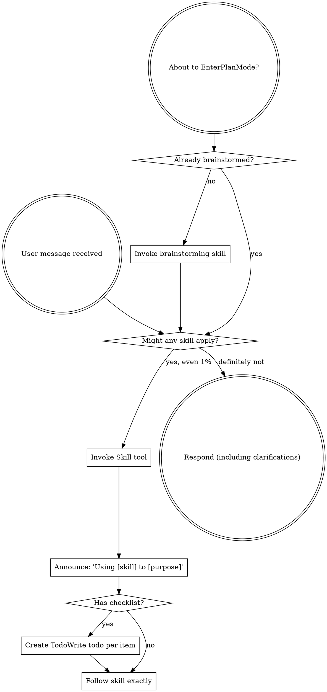

# codex advisor artifact

- Provider: codex
- Exit code: 0
- Created at: 2026-04-11T14:12:53.959Z

## Original task

为 SlideTutor-AI 的正式 i18n 第一波改造做风险评估。背景：当前项目已有 applicationLanguage 状态、slide_tutor_app_language 持久化、一个过渡性的 src/lib/i18n/settingsText.ts，以及部分 SettingsModal/PlatformApiSection 文案切换。目标是升级为正式中英双语 i18n：建立项目级轻量正式 i18n 层，第一波覆盖 SettingsModal、AppHeader、上传/确认上传主路径（App.tsx），并把 Application Language 放到 Appearance，Output Language 继续只控制 AI 输出。请重点从漏洞/风险/回归角度评估：1) UI 语言与 AI 输出语言是否会状态混淆；2) slide_tutor_app_language 与现有 slide_tutor_language 是否会持久化冲突；3) 从 settingsText.ts 迁移到正式 i18n 层时是否会引入文案缺失、key 漏映射或组件回归；4) SettingsModal / AppHeader / App.tsx 的高频文案替换会不会引发 UI 回归；5) 测试覆盖是否足够，以及建议补哪些测试。请给出面向我审阅的结构化风险评估结论，不要执行代码修改。

## Final prompt

为 SlideTutor-AI 的正式 i18n 第一波改造做风险评估。背景：当前项目已有 applicationLanguage 状态、slide_tutor_app_language 持久化、一个过渡性的 src/lib/i18n/settingsText.ts，以及部分 SettingsModal/PlatformApiSection 文案切换。目标是升级为正式中英双语 i18n：建立项目级轻量正式 i18n 层，第一波覆盖 SettingsModal、AppHeader、上传/确认上传主路径（App.tsx），并把 Application Language 放到 Appearance，Output Language 继续只控制 AI 输出。请重点从漏洞/风险/回归角度评估：1) UI 语言与 AI 输出语言是否会状态混淆；2) slide_tutor_app_language 与现有 slide_tutor_language 是否会持久化冲突；3) 从 settingsText.ts 迁移到正式 i18n 层时是否会引入文案缺失、key 漏映射或组件回归；4) SettingsModal / AppHeader / App.tsx 的高频文案替换会不会引发 UI 回归；5) 测试覆盖是否足够，以及建议补哪些测试。请给出面向我审阅的结构化风险评估结论，不要执行代码修改。

## Raw output

```text
**结论**

这次正式 i18n 第一波我会定为“中高风险，但可控”。不是因为当前状态很乱，而是因为现状已经形成了“两个语言状态 + 两套文案来源 + 一段旧迁移逻辑”的组合，稍微处理不严就会出现语义串线、持久化失配或局部 UI 回归。

我补跑了当前相关测试：`uiStore`、`SettingsModal`、`AppHeader`、`PlatformApiSection` 共 4 个测试文件，32/32 通过。现状基线是稳定的，但这些测试还不足以覆盖你这次最危险的改造面。

1. `UI 语言` 与 `AI 输出语言` 的状态混淆风险：`中`
- 好的一面是，store 已经把两者分开了：`outputLanguage` 和 `applicationLanguage` 独立存储、独立 setter、独立持久化键，这部分基础是对的。[uiStore.ts](/C:/Users/hoo/Documents/z_cqmeng_file/local_repository/SlideTutor-AI-main/SlideTutor-AI/src/store/uiStore.ts#L101) [uiStore.ts](/C:/Users/hoo/Documents/z_cqmeng_file/local_repository/SlideTutor-AI-main/SlideTutor-AI/src/store/uiStore.ts#L204) [uiStore.test.ts](/C:/Users/hoo/Documents/z_cqmeng_file/local_repository/SlideTutor-AI-main/SlideTutor-AI/src/store/uiStore.test.ts#L339)
- 但语义分离在组件层没有完全收口，已经存在“UI 文案跟着 AI 输出语言走”的实例：`CanvasTutor` 里的 `Quick Explain` / `No Quick Explain` 仍然由 `outputLanguage` 控制，而不是 `applicationLanguage`。[CanvasTutor.tsx](/C:/Users/hoo/Documents/z_cqmeng_file/local_repository/SlideTutor-AI-main/SlideTutor-AI/src/components/CanvasTutor.tsx#L687)
- 这意味着如果正式 i18n 层继续沿用泛化命名如 `language`，或在接入时把两者统一成一个 hook/state，极容易把“界面语言”和“AI 回答语言”重新混在一起。
- 审阅结论：状态模型本身可用，但第一波必须先明确契约名义。建议你在设计上把它们视为两个不同领域对象，而不是一个 `language` 的两个值。

2. `slide_tutor_app_language` 与 `slide_tutor_language` 的持久化冲突风险：`中高`
- 当前运行态没有直接 key 冲突，因为 UI 语言写 `slide_tutor_app_language`，AI 输出语言写 `slide_tutor_language`。[uiStore.ts](/C:/Users/hoo/Documents/z_cqmeng_file/local_repository/SlideTutor-AI-main/SlideTutor-AI/src/store/uiStore.ts#L205) [uiStore.ts](/C:/Users/hoo/Documents/z_cqmeng_file/local_repository/SlideTutor-AI-main/SlideTutor-AI/src/store/uiStore.ts#L215)
- 真正的风险在迁移层：现有 `migrateLocalStorageToIndexedDB()` 只迁移了 `slide_tutor_language`，没有迁移 `slide_tutor_app_language`；而且它受 `slide_tutor_migrated_v2` 一次性短路控制，后续即便补上数组，老用户也不会重新跑这段迁移。[migrate.ts](/C:/Users/hoo/Documents/z_cqmeng_file/local_repository/SlideTutor-AI-main/SlideTutor-AI/src/lib/migrate.ts#L3) [migrate.ts](/C:/Users/hoo/Documents/z_cqmeng_file/local_repository/SlideTutor-AI-main/SlideTutor-AI/src/lib/migrate.ts#L11)
- 另外，`savedAppLanguage` 读取后没有运行时 normalize/fallback，理论上只要持久化里出现了错误值，后续正式 i18n 查词就可能直接失效。[uiStore.ts](/C:/Users/hoo/Documents/z_cqmeng_file/local_repository/SlideTutor-AI-main/SlideTutor-AI/src/store/uiStore.ts#L255)
- 审阅结论：不是“键名重复”的冲突，而是“兼容与回填策略不足”的冲突。

3. 从 `settingsText.ts` 迁到正式 i18n 层的缺词、漏 key、组件回归风险：`高`
- 当前 `settingsText.ts` 的优点是结构是强类型 `Record<ApplicationLanguage, SettingsText>`，只要继续沿用这种强约束，单文件内的 key 完整性是有保护的。[settingsText.ts](/C:/Users/hoo/Documents/z_cqmeng_file/local_repository/SlideTutor-AI-main/SlideTutor-AI/src/lib/i18n/settingsText.ts#L55)
- 但它已经带有“历史残留 key”：`ai` 命名空间里还保留了 `applicationLanguage` / `applicationLanguageHelp`，同时 `appearance` 里也有一份。这会直接增加你迁移时选错 key、留死 key、错放文案的概率。[settingsText.ts](/C:/Users/hoo/Documents/z_cqmeng_file/local_repository/SlideTutor-AI-main/SlideTutor-AI/src/lib/i18n/settingsText.ts#L21) [settingsText.ts](/C:/Users/hoo/Documents/z_cqmeng_file/local_repository/SlideTutor-AI-main/SlideTutor-AI/src/lib/i18n/settingsText.ts#L74) [settingsText.ts](/C:/Users/hoo/Documents/z_cqmeng_file/local_repository/SlideTutor-AI-main/SlideTutor-AI/src/lib/i18n/settingsText.ts#L97)
- 更关键的是，`SettingsModal` 并没有真的被 `settingsText.ts` 完整覆盖。反馈成功态、反馈表单、部分 About 内容仍是内联文案或三元切换；`PlatformApiSection` 的额度说明 tooltip 也是内联切换。也就是说，“迁 settingsText” 不等于 “迁完 SettingsModal”。[SettingsModal.tsx](/C:/Users/hoo/Documents/z_cqmeng_file/local_repository/SlideTutor-AI-main/SlideTutor-AI/src/components/SettingsModal.tsx#L658) [PlatformApiSection.tsx](/C:/Users/hoo/Documents/z_cqmeng_file/local_repository/SlideTutor-AI-main/SlideTutor-AI/src/components/settings/PlatformApiSection.tsx#L189)
- 另一个高风险点是当前查文案没有 fallback：`getSettingsUIText(language)` 直接索引返回，错误 locale 会让后续 `text.xxx` 访问直接掉空。[settingsText.ts](/C:/Users/hoo/Documents/z_cqmeng_file/local_repository/SlideTutor-AI-main/SlideTutor-AI/src/lib/i18n/settingsText.ts#L160)
- 审阅结论：这部分不是低风险“抽常量”，而是一次文案源收口。若不先盘清范围，最容易出现“主结构切到了 i18n，细节岛屿仍残留/丢词”。

4. `SettingsModal / AppHeader / App.tsx` 高频文案替换引发 UI 回归的风险：`中高`
- `SettingsModal` 现有测试主要覆盖 AI/Appearance 的现状，不覆盖“运行中切换 applicationLanguage 后，整模态是否正确重渲染”，也不覆盖完整的 Feedback/About 文案切换。[SettingsModal.test.tsx](/C:/Users/hoo/Documents/z_cqmeng_file/local_repository/SlideTutor-AI-main/SlideTutor-AI/src/components/SettingsModal.test.tsx#L100)
- `AppHeader` 目前所有可见文案和 tooltip/title 都是硬编码，接入正式 i18n 后会新增状态依赖和可访问性文案变更；现有测试只校验样式类和点击行为，不校验双语渲染。[AppHeader.tsx](/C:/Users/hoo/Documents/z_cqmeng_file/local_repository/SlideTutor-AI-main/SlideTutor-AI/src/components/Header/AppHeader.tsx#L33) [AppHeader.test.tsx](/C:/Users/hoo/Documents/z_cqmeng_file/local_repository/SlideTutor-AI-main/SlideTutor-AI/src/components/Header/AppHeader.test.tsx#L29)
- `App.tsx` 的上传主路径目前全是硬编码：拖拽遮罩、确认上传弹窗、取消/确认按钮、两个 `alert`。这条链路是高频路径，但仓库里没有对应的 `App.tsx` 测试覆盖。[App.tsx](/C:/Users/hoo/Documents/z_cqmeng_file/local_repository/SlideTutor-AI-main/SlideTutor-AI/src/App.tsx#L242) [App.tsx](/C:/Users/hoo/Documents/z_cqmeng_file/local_repository/SlideTutor-AI-main/SlideTutor-AI/src/App.tsx#L289) [App.tsx](/C:/Users/hoo/Documents/z_cqmeng_file/local_repository/SlideTutor-AI-main/SlideTutor-AI/src/App.tsx#L320) [App.tsx](/C:/Users/hoo/Documents/z_cqmeng_file/local_repository/SlideTutor-AI-main/SlideTutor-AI/src/App.tsx#L329)
- 还有一个容易被低估的回归点：`useUiStore.init()` 是异步的，正式 i18n 如果依赖它做首次装载，会放大首屏语言闪动或一次错误渲染的问题。[App.tsx](/C:/Users/hoo/Documents/z_cqmeng_file/local_repository/SlideTutor-AI-main/SlideTutor-AI/src/App.tsx#L60)
- 审阅结论：`App.tsx` 是这波里最容易出“没坏逻辑，但坏体验”的地方。

5. 测试覆盖是否足够，以及建议补什么：`当前不足`
- 现有覆盖证明“当前局部实现可用”，但不足以给“正式 i18n 第一波”兜底。
- 必补测试优先级：
1. `uiStore`：验证 `applicationLanguage` 与 `outputLanguage` 双向独立，且对非法持久化值有 fallback，而不是直接信任存储值。
2. `migrate.ts`：补 `slide_tutor_app_language` 的迁移/回填测试，并覆盖“`slide_tutor_migrated_v2` 已为 true 时如何补救”的场景。
3. 字典完整性测试：对第一波覆盖范围做“en/zh 两套 locale 均存在 key”的 smoke test，防止 key 漏映射。
4. `SettingsModal`：运行时切换 `applicationLanguage`，断言 Appearance、AI、Feedback 相关文案同步刷新，同时 `outputLanguage` 的值和 AI 选项不被串改。
5. `AppHeader`：在中英两种 UI 语言下校验按钮文字和 title/aria 文案。
6. `App.tsx`：补上传主路径集成测试，至少覆盖“点击上传 -> 待确认弹窗 -> 取消/确认”和“拖拽非 PDF -> 提示文案”两条。
- 如果只能先补最小集，我会先补 1、2、6。

**最终判断**

可以做，但不建议把它当成“把 `settingsText.ts` 换成正式 i18n 框架”这么简单。对这次第一波，真正需要重点防守的是三件事：语言状态语义收口、持久化兼容策略、`App.tsx` 主路径测试。只要这三块先站稳，后续扩面到更多组件的风险会显著下降。


OpenAI Codex v0.117.0 (research preview)
--------
workdir: C:\Users\hoo\Documents\z_cqmeng_file\local_repository\SlideTutor-AI-main
model: gpt-5.4
provider: right_code
approval: never
sandbox: danger-full-access
reasoning effort: high
reasoning summaries: none
session id: 019d7cdd-8445-7aa2-926e-9c74c3a0e84e
--------
user
为 SlideTutor-AI 的正式 i18n 第一波改造做风险评估。背景：当前项目已有 applicationLanguage 状态、slide_tutor_app_language 持久化、一个过渡性的 src/lib/i18n/settingsText.ts，以及部分 SettingsModal/PlatformApiSection 文案切换。目标是升级为正式中英双语 i18n：建立项目级轻量正式 i18n 层，第一波覆盖 SettingsModal、AppHeader、上传/确认上传主路径（App.tsx），并把 Application Language 放到 Appearance，Output Language 继续只控制 AI 输出。请重点从漏洞/风险/回归角度评估：1) UI 语言与 AI 输出语言是否会状态混淆；2) slide_tutor_app_language 与现有 slide_tutor_language 是否会持久化冲突；3) 从 settingsText.ts 迁移到正式 i18n 层时是否会引入文案缺失、key 漏映射或组件回归；4) SettingsModal / AppHeader / App.tsx 的高频文案替换会不会引发 UI 回归；5) 测试覆盖是否足够，以及建议补哪些测试。请给出面向我审阅的结构化风险评估结论，不要执行代码修改。
warning: Ignoring malformed agent role definition: agents.gsd-advisor-researcher.config_file must point to an existing file at C:\Users\qiqicute\Documents\z_cqmeng_file\local_repository\SlideTutor-AI-main\.codex\agents\gsd-advisor-researcher.toml: 系统找不到指定的路径。 (os error 3)
warning: Ignoring malformed agent role definition: agents.gsd-assumptions-analyzer.config_file must point to an existing file at C:\Users\qiqicute\Documents\z_cqmeng_file\local_repository\SlideTutor-AI-main\.codex\agents\gsd-assumptions-analyzer.toml: 系统找不到指定的路径。 (os error 3)
warning: Ignoring malformed agent role definition: agents.gsd-codebase-mapper.config_file must point to an existing file at C:\Users\qiqicute\Documents\z_cqmeng_file\local_repository\SlideTutor-AI-main\.codex\agents\gsd-codebase-mapper.toml: 系统找不到指定的路径。 (os error 3)
warning: Ignoring malformed agent role definition: agents.gsd-debugger.config_file must point to an existing file at C:\Users\qiqicute\Documents\z_cqmeng_file\local_repository\SlideTutor-AI-main\.codex\agents\gsd-debugger.toml: 系统找不到指定的路径。 (os error 3)
warning: Ignoring malformed agent role definition: agents.gsd-executor.config_file must point to an existing file at C:\Users\qiqicute\Documents\z_cqmeng_file\local_repository\SlideTutor-AI-main\.codex\agents\gsd-executor.toml: 系统找不到指定的路径。 (os error 3)
warning: Ignoring malformed agent role definition: agents.gsd-integration-checker.config_file must point to an existing file at C:\Users\qiqicute\Documents\z_cqmeng_file\local_repository\SlideTutor-AI-main\.codex\agents\gsd-integration-checker.toml: 系统找不到指定的路径。 (os error 3)
warning: Ignoring malformed agent role definition: agents.gsd-nyquist-auditor.config_file must point to an existing file at C:\Users\qiqicute\Documents\z_cqmeng_file\local_repository\SlideTutor-AI-main\.codex\agents\gsd-nyquist-auditor.toml: 系统找不到指定的路径。 (os error 3)
warning: Ignoring malformed agent role definition: agents.gsd-phase-researcher.config_file must point to an existing file at C:\Users\qiqicute\Documents\z_cqmeng_file\local_repository\SlideTutor-AI-main\.codex\agents\gsd-phase-researcher.toml: 系统找不到指定的路径。 (os error 3)
warning: Ignoring malformed agent role definition: agents.gsd-plan-checker.config_file must point to an existing file at C:\Users\qiqicute\Documents\z_cqmeng_file\local_repository\SlideTutor-AI-main\.codex\agents\gsd-plan-checker.toml: 系统找不到指定的路径。 (os error 3)
warning: Ignoring malformed agent role definition: agents.gsd-planner.config_file must point to an existing file at C:\Users\qiqicute\Documents\z_cqmeng_file\local_repository\SlideTutor-AI-main\.codex\agents\gsd-planner.toml: 系统找不到指定的路径。 (os error 3)
warning: Ignoring malformed agent role definition: agents.gsd-project-researcher.config_file must point to an existing file at C:\Users\qiqicute\Documents\z_cqmeng_file\local_repository\SlideTutor-AI-main\.codex\agents\gsd-project-researcher.toml: 系统找不到指定的路径。 (os error 3)
warning: Ignoring malformed agent role definition: agents.gsd-research-synthesizer.config_file must point to an existing file at C:\Users\qiqicute\Documents\z_cqmeng_file\local_repository\SlideTutor-AI-main\.codex\agents\gsd-research-synthesizer.toml: 系统找不到指定的路径。 (os error 3)
warning: Ignoring malformed agent role definition: agents.gsd-roadmapper.config_file must point to an existing file at C:\Users\qiqicute\Documents\z_cqmeng_file\local_repository\SlideTutor-AI-main\.codex\agents\gsd-roadmapper.toml: 系统找不到指定的路径。 (os error 3)
warning: Ignoring malformed agent role definition: agents.gsd-ui-auditor.config_file must point to an existing file at C:\Users\qiqicute\Documents\z_cqmeng_file\local_repository\SlideTutor-AI-main\.codex\agents\gsd-ui-auditor.toml: 系统找不到指定的路径。 (os error 3)
warning: Ignoring malformed agent role definition: agents.gsd-ui-checker.config_file must point to an existing file at C:\Users\qiqicute\Documents\z_cqmeng_file\local_repository\SlideTutor-AI-main\.codex\agents\gsd-ui-checker.toml: 系统找不到指定的路径。 (os error 3)
warning: Ignoring malformed agent role definition: agents.gsd-ui-researcher.config_file must point to an existing file at C:\Users\qiqicute\Documents\z_cqmeng_file\local_repository\SlideTutor-AI-main\.codex\agents\gsd-ui-researcher.toml: 系统找不到指定的路径。 (os error 3)
warning: Ignoring malformed agent role definition: agents.gsd-user-profiler.config_file must point to an existing file at C:\Users\qiqicute\Documents\z_cqmeng_file\local_repository\SlideTutor-AI-main\.codex\agents\gsd-user-profiler.toml: 系统找不到指定的路径。 (os error 3)
warning: Ignoring malformed agent role definition: agents.gsd-verifier.config_file must point to an existing file at C:\Users\qiqicute\Documents\z_cqmeng_file\local_repository\SlideTutor-AI-main\.codex\agents\gsd-verifier.toml: 系统找不到指定的路径。 (os error 3)
codex
我会先核对仓库里现有 `applicationLanguage`、`slide_tutor_app_language`、`slide_tutor_language`、`settingsText.ts` 以及相关组件的实际实现，再基于代码现状做风险评估，不做改动。
exec
"C:\\Windows\\System32\\WindowsPowerShell\\v1.0\\powershell.exe" -Command 'Get-Content .agents/skills/receiving-code-review/SKILL.md' in C:\Users\hoo\Documents\z_cqmeng_file\local_repository\SlideTutor-AI-main
exec
"C:\\Windows\\System32\\WindowsPowerShell\\v1.0\\powershell.exe" -Command 'Get-Content .agents/skills/using-superpowers/SKILL.md' in C:\Users\hoo\Documents\z_cqmeng_file\local_repository\SlideTutor-AI-main
 succeeded in 2754ms:
---
name: using-superpowers
description: Use when starting any conversation - establishes how to find and use skills, requiring Skill tool invocation before ANY response including clarifying questions
---

<SUBAGENT-STOP>
If you were dispatched as a subagent to execute a specific task, skip this skill.
</SUBAGENT-STOP>

<EXTREMELY-IMPORTANT>
If you think there is even a 1% chance a skill might apply to what you are doing, you ABSOLUTELY MUST invoke the skill.

IF A SKILL APPLIES TO YOUR TASK, YOU DO NOT HAVE A CHOICE. YOU MUST USE IT.

This is not negotiable. This is not optional. You cannot rationalize your way out of this.
</EXTREMELY-IMPORTANT>

## Instruction Priority

Superpowers skills override default system prompt behavior, but **user instructions always take precedence**:

1. **User's explicit instructions** (CLAUDE.md, GEMINI.md, AGENTS.md, direct requests) 鈥?highest priority
2. **Superpowers skills** 鈥?override default system behavior where they conflict
3. **Default system prompt** 鈥?lowest priority

If CLAUDE.md, GEMINI.md, or AGENTS.md says "don't use TDD" and a skill says "always use TDD," follow the user's instructions. The user is in control.

## How to Access Skills

**In Claude Code:** Use the `Skill` tool. When you invoke a skill, its content is loaded and presented to you鈥攆ollow it directly. Never use the Read tool on skill files.

**In Gemini CLI:** Skills activate via the `activate_skill` tool. Gemini loads skill metadata at session start and activates the full content on demand.

**In other environments:** Check your platform's documentation for how skills are loaded.

## Platform Adaptation

Skills use Claude Code tool names. Non-CC platforms: see `references/codex-tools.md` (Codex) for tool equivalents. Gemini CLI users get the tool mapping loaded automatically via GEMINI.md.

# Using Skills

## The Rule

**Invoke relevant or requested skills BEFORE any response or action.** Even a 1% chance a skill might apply means that you should invoke the skill to check. If an invoked skill turns out to be wrong for the situation, you don't need to use it.



## Red Flags

These thoughts mean STOP鈥攜ou're rationalizing:

| Thought | Reality |
|---------|---------|
| "This is just a simple question" | Questions are tasks. Check for skills. |
| "I need more context first" | Skill check comes BEFORE clarifying questions. |
| "Let me explore the codebase first" | Skills tell you HOW to explore. Check first. |
| "I can check git/files quickly" | Files lack conversation context. Check for skills. |
| "Let me gather information first" | Skills tell you HOW to gather information. |
| "This doesn't need a formal skill" | If a skill exists, use it. |
| "I remember this skill" | Skills evolve. Read current version. |
| "This doesn't count as a task" | Action = task. Check for skills. |
| "The skill is overkill" | Simple things become complex. Use it. |
| "I'll just do this one thing first" | Check BEFORE doing anything. |
| "This feels productive" | Undisciplined action wastes time. Skills prevent this. |
| "I know what that means" | Knowing the concept 鈮?using the skill. Invoke it. |

## Skill Priority

When multiple skills could apply, use this order:

1. **Process skills first** (brainstorming, debugging) - these determine HOW to approach the task
2. **Implementation skills second** (frontend-design, mcp-builder) - these guide execution

"Let's build X" 鈫?brainstorming first, then implementation skills.
"Fix this bug" 鈫?debugging first, then domain-specific skills.

## Skill Types

**Rigid** (TDD, debugging): Follow exactly. Don't adapt away discipline.

**Flexible** (patterns): Adapt principles to context.

The skill itself tells you which.

## User Instructions

Instructions say WHAT, not HOW. "Add X" or "Fix Y" doesn't mean skip workflows.

 succeeded in 3372ms:
---
name: receiving-code-review
description: Use when receiving code review feedback, before implementing suggestions, especially if feedback seems unclear or technically questionable - requires technical rigor and verification, not performative agreement or blind implementation
---

# Code Review Reception

## Overview

Code review requires technical evaluation, not emotional performance.

**Core principle:** Verify before implementing. Ask before assuming. Technical correctness over social comfort.

## The Response Pattern

```
WHEN receiving code review feedback:

1. READ: Complete feedback without reacting
2. UNDERSTAND: Restate requirement in own words (or ask)
3. VERIFY: Check against codebase reality
4. EVALUATE: Technically sound for THIS codebase?
5. RESPOND: Technical acknowledgment or reasoned pushback
6. IMPLEMENT: One item at a time, test each
```

## Forbidden Responses

**NEVER:**
- "You're absolutely right!" (explicit CLAUDE.md violation)
- "Great point!" / "Excellent feedback!" (performative)
- "Let me implement that now" (before verification)

**INSTEAD:**
- Restate the technical requirement
- Ask clarifying questions
- Push back with technical reasoning if wrong
- Just start working (actions > words)

## Handling Unclear Feedback

```
IF any item is unclear:
  STOP - do not implement anything yet
  ASK for clarification on unclear items

WHY: Items may be related. Partial understanding = wrong implementation.
```

**Example:**
```
your human partner: "Fix 1-6"
You understand 1,2,3,6. Unclear on 4,5.

鉂?WRONG: Implement 1,2,3,6 now, ask about 4,5 later
鉁?RIGHT: "I understand items 1,2,3,6. Need clarification on 4 and 5 before proceeding."
```

## Source-Specific Handling

### From your human partner
- **Trusted** - implement after understanding
- **Still ask** if scope unclear
- **No performative agreement**
- **Skip to action** or technical acknowledgment

### From External Reviewers
```
BEFORE implementing:
  1. Check: Technically correct for THIS codebase?
  2. Check: Breaks existing functionality?
  3. Check: Reason for current implementation?
  4. Check: Works on all platforms/versions?
  5. Check: Does reviewer understand full context?

IF suggestion seems wrong:
  Push back with technical reasoning

IF can't easily verify:
  Say so: "I can't verify this without [X]. Should I [investigate/ask/proceed]?"

IF conflicts with your human partner's prior decisions:
  Stop and discuss with your human partner first
```

**your human partner's rule:** "External feedback - be skeptical, but check carefully"

## YAGNI Check for "Professional" Features

```
IF reviewer suggests "implementing properly":
  grep codebase for actual usage

  IF unused: "This endpoint isn't called. Remove it (YAGNI)?"
  IF used: Then implement properly
```

**your human partner's rule:** "You and reviewer both report to me. If we don't need this feature, don't add it."

## Implementation Order

```
FOR multi-item feedback:
  1. Clarify anything unclear FIRST
  2. Then implement in this order:
     - Blocking issues (breaks, security)
     - Simple fixes (typos, imports)
     - Complex fixes (refactoring, logic)
  3. Test each fix individually
  4. Verify no regressions
```

## When To Push Back

Push back when:
- Suggestion breaks existing functionality
- Reviewer lacks full context
- Violates YAGNI (unused feature)
- Technically incorrect for this stack
- Legacy/compatibility reasons exist
- Conflicts with your human partner's architectural decisions

**How to push back:**
- Use technical reasoning, not defensiveness
- Ask specific questions
- Reference working tests/code
- Involve your human partner if architectural

**Signal if uncomfortable pushing back out loud:** "Strange things are afoot at the Circle K"

## Acknowledging Correct Feedback

When feedback IS correct:
```
鉁?"Fixed. [Brief description of what changed]"
鉁?"Good catch - [specific issue]. Fixed in [location]."
鉁?[Just fix it and show in the code]

鉂?"You're absolutely right!"
鉂?"Great point!"
鉂?"Thanks for catching that!"
鉂?"Thanks for [anything]"
鉂?ANY gratitude expression
```

**Why no thanks:** Actions speak. Just fix it. The code itself shows you heard the feedback.

**If you catch yourself about to write "Thanks":** DELETE IT. State the fix instead.

## Gracefully Correcting Your Pushback

If you pushed back and were wrong:
```
鉁?"You were right - I checked [X] and it does [Y]. Implementing now."
鉁?"Verified this and you're correct. My initial understanding was wrong because [reason]. Fixing."

鉂?Long apology
鉂?Defending why you pushed back
鉂?Over-explaining
```

State the correction factually and move on.

## Common Mistakes

| Mistake | Fix |
|---------|-----|
| Performative agreement | State requirement or just act |
| Blind implementation | Verify against codebase first |
| Batch without testing | One at a time, test each |
| Assuming reviewer is right | Check if breaks things |
| Avoiding pushback | Technical correctness > comfort |
| Partial implementation | Clarify all items first |
| Can't verify, proceed anyway | State limitation, ask for direction |

## Real Examples

**Performative Agreement (Bad):**
```
Reviewer: "Remove legacy code"
鉂?"You're absolutely right! Let me remove that..."
```

**Technical Verification (Good):**
```
Reviewer: "Remove legacy code"
鉁?"Checking... build target is 10.15+, this API needs 13+. Need legacy for backward compat. Current impl has wrong bundle ID - fix it or drop pre-13 support?"
```

**YAGNI (Good):**
```
Reviewer: "Implement proper metrics tracking with database, date filters, CSV export"
鉁?"Grepped codebase - nothing calls this endpoint. Remove it (YAGNI)? Or is there usage I'm missing?"
```

**Unclear Item (Good):**
```
your human partner: "Fix items 1-6"
You understand 1,2,3,6. Unclear on 4,5.
鉁?"Understand 1,2,3,6. Need clarification on 4 and 5 before implementing."
```

## GitHub Thread Replies

When replying to inline review comments on GitHub, reply in the comment thread (`gh api repos/{owner}/{repo}/pulls/{pr}/comments/{id}/replies`), not as a top-level PR comment.

## The Bottom Line

**External feedback = suggestions to evaluate, not orders to follow.**

Verify. Question. Then implement.

No performative agreement. Technical rigor always.

codex
使用 `using-superpowers` 先做技能检查，再按代码审阅方式核实现状。现在开始定位语言状态、持久化键、过渡层和目标组件。
exec
"C:\\Windows\\System32\\WindowsPowerShell\\v1.0\\powershell.exe" -Command 'rg -n "applicationLanguage|slide_tutor_app_language|slide_tutor_language|settingsText|SettingsModal|PlatformApiSection|AppHeader|Output Language|Application Language|Appearance" src' in C:\Users\hoo\Documents\z_cqmeng_file\local_repository\SlideTutor-AI-main
exec
"C:\\Windows\\System32\\WindowsPowerShell\\v1.0\\powershell.exe" -Command 'Get-ChildItem -Recurse -File src | Select-Object -ExpandProperty FullName' in C:\Users\hoo\Documents\z_cqmeng_file\local_repository\SlideTutor-AI-main
2026-04-11T14:06:55.943207Z ERROR codex_core::tools::router: error=Exit code: 1
Wall time: 3.2 seconds
Output:
rg: src: IO error for operation on src: 系统找不到指定的文件。 (os error 2)

 exited 1 in 3161ms:
rg: src: IO error for operation on src: 系统找不到指定的文件。 (os error 2)

 succeeded in 5834ms:
codex
源码目录不在仓库根下，我先确认前端工程的实际位置，再继续追踪相关实现。
exec
"C:\\Windows\\System32\\WindowsPowerShell\\v1.0\\powershell.exe" -Command 'Get-ChildItem -Recurse -Filter package.json | Select-Object -ExpandProperty FullName' in C:\Users\hoo\Documents\z_cqmeng_file\local_repository\SlideTutor-AI-main
exec
"C:\\Windows\\System32\\WindowsPowerShell\\v1.0\\powershell.exe" -Command 'Get-ChildItem -Force' in C:\Users\hoo\Documents\z_cqmeng_file\local_repository\SlideTutor-AI-main
 succeeded in 3685ms:


    目录: C:\Users\hoo\Documents\z_cqmeng_file\local_repository\SlideTutor-AI-main


Mode                 LastWriteTime         Length Name                                                                 
----                 -------------         ------ ----                                                                 
d-----         2026/3/26      9:02                .agents                                                              
d-----         2026/4/11     22:00                .claude                                                              
d-----         2026/3/28     14:53                .codex                                                               
d-----         2026/3/28     14:53                .gemini                                                              
d--h--         2026/4/11     22:02                .git                                                                 
d-----         2026/4/11     22:05                .omc                                                                 
d-----         2026/4/10     18:41                .planning                                                            
d-----         2026/3/21     17:01                .superpowers                                                         
d-----         2026/4/10     18:33                docs                                                                 
d-----          2026/4/6     14:43                SlideTutor-AI                                                        
d-----          2026/4/7     11:06                tmp_files                                                            
-a----         2026/3/28     14:53             35 .geminiignore                                                        
-a----         2026/4/10     18:33            217 .gitignore                                                           
-a----         2026/3/28     14:53            649 AGENTS.md                                                            
-a----         2026/4/10     18:33           1350 GEMINI.md                                                            
-a----         2026/4/10     18:33           2361 README.md                                                            
-a----         2026/4/10     18:33            230 skills-lock.json                                                     


 succeeded in 3943ms:
C:\Users\hoo\Documents\z_cqmeng_file\local_repository\SlideTutor-AI-main\.claude\package.json
C:\Users\hoo\Documents\z_cqmeng_file\local_repository\SlideTutor-AI-main\.gemini\package.json
C:\Users\hoo\Documents\z_cqmeng_file\local_repository\SlideTutor-AI-main\SlideTutor-AI\package.json
C:\Users\hoo\Documents\z_cqmeng_file\local_repository\SlideTutor-AI-main\SlideTutor-AI\node_modules\.vite\deps\package.json
C:\Users\hoo\Documents\z_cqmeng_file\local_repository\SlideTutor-AI-main\SlideTutor-AI\node_modules\.vite\deps_slidetutor_ai\package.json
C:\Users\hoo\Documents\z_cqmeng_file\local_repository\SlideTutor-AI-main\SlideTutor-AI\node_modules\@adobe\css-tools\package.json
C:\Users\hoo\Documents\z_cqmeng_file\local_repository\SlideTutor-AI-main\SlideTutor-AI\node_modules\@asamuzakjp\css-color\package.json
C:\Users\hoo\Documents\z_cqmeng_file\local_repository\SlideTutor-AI-main\SlideTutor-AI\node_modules\@asamuzakjp\css-color\node_modules\lru-cache\package.json
C:\Users\hoo\Documents\z_cqmeng_file\local_repository\SlideTutor-AI-main\SlideTutor-AI\node_modules\@asamuzakjp\css-color\node_modules\lru-cache\dist\commonjs\package.json
C:\Users\hoo\Documents\z_cqmeng_file\local_repository\SlideTutor-AI-main\SlideTutor-AI\node_modules\@asamuzakjp\css-color\node_modules\lru-cache\dist\esm\package.json
C:\Users\hoo\Documents\z_cqmeng_file\local_repository\SlideTutor-AI-main\SlideTutor-AI\node_modules\@asamuzakjp\dom-selector\package.json
C:\Users\hoo\Documents\z_cqmeng_file\local_repository\SlideTutor-AI-main\SlideTutor-AI\node_modules\@asamuzakjp\dom-selector\node_modules\lru-cache\package.json
C:\Users\hoo\Documents\z_cqmeng_file\local_repository\SlideTutor-AI-main\SlideTutor-AI\node_modules\@asamuzakjp\dom-selector\node_modules\lru-cache\dist\commonjs\package.json
C:\Users\hoo\Documents\z_cqmeng_file\local_repository\SlideTutor-AI-main\SlideTutor-AI\node_modules\@asamuzakjp\dom-selector\node_modules\lru-cache\dist\esm\package.json
C:\Users\hoo\Documents\z_cqmeng_file\local_repository\SlideTutor-AI-main\SlideTutor-AI\node_modules\@asamuzakjp\nwsapi\package.json
C:\Users\hoo\Documents\z_cqmeng_file\local_repository\SlideTutor-AI-main\SlideTutor-AI\node_modules\@babel\code-frame\package.json
C:\Users\hoo\Documents\z_cqmeng_file\local_repository\SlideTutor-AI-main\SlideTutor-AI\node_modules\@babel\compat-data\package.json
C:\Users\hoo\Documents\z_cqmeng_file\local_repository\SlideTutor-AI-main\SlideTutor-AI\node_modules\@babel\core\package.json
C:\Users\hoo\Documents\z_cqmeng_file\local_repository\SlideTutor-AI-main\SlideTutor-AI\node_modules\@babel\generator\package.json
C:\Users\hoo\Documents\z_cqmeng_file\local_repository\SlideTutor-AI-main\SlideTutor-AI\node_modules\@babel\helper-compilation-targets\package.json
C:\Users\hoo\Documents\z_cqmeng_file\local_repository\SlideTutor-AI-main\SlideTutor-AI\node_modules\@babel\helper-globals\package.json
C:\Users\hoo\Documents\z_cqmeng_file\local_repository\SlideTutor-AI-main\SlideTutor-AI\node_modules\@babel\helper-module-imports\package.json
C:\Users\hoo\Documents\z_cqmeng_file\local_repository\SlideTutor-AI-main\SlideTutor-AI\node_modules\@babel\helper-module-transforms\package.json
C:\Users\hoo\Documents\z_cqmeng_file\local_repository\SlideTutor-AI-main\SlideTutor-AI\node_modules\@babel\helper-plugin-utils\package.json
C:\Users\hoo\Documents\z_cqmeng_file\local_repository\SlideTutor-AI-main\SlideTutor-AI\node_modules\@babel\helper-string-parser\package.json
C:\Users\hoo\Documents\z_cqmeng_file\local_repository\SlideTutor-AI-main\SlideTutor-AI\node_modules\@babel\helper-validator-identifier\package.json
C:\Users\hoo\Documents\z_cqmeng_file\local_repository\SlideTutor-AI-main\SlideTutor-AI\node_modules\@babel\helper-validator-option\package.json
C:\Users\hoo\Documents\z_cqmeng_file\local_repository\SlideTutor-AI-main\SlideTutor-AI\node_modules\@babel\helpers\package.json
C:\Users\hoo\Documents\z_cqmeng_file\local_repository\SlideTutor-AI-main\SlideTutor-AI\node_modules\@babel\parser\package.json
C:\Users\hoo\Documents\z_cqmeng_file\local_repository\SlideTutor-AI-main\SlideTutor-AI\node_modules\@babel\plugin-transform-react-jsx-self\package.json
C:\Users\hoo\Documents\z_cqmeng_file\local_repository\SlideTutor-AI-main\SlideTutor-AI\node_modules\@babel\plugin-transform-react-jsx-source\package.json
C:\Users\hoo\Documents\z_cqmeng_file\local_repository\SlideTutor-AI-main\SlideTutor-AI\node_modules\@babel\runtime\package.json
C:\Users\hoo\Documents\z_cqmeng_file\local_repository\SlideTutor-AI-main\SlideTutor-AI\node_modules\@babel\runtime\helpers\esm\package.json
C:\Users\hoo\Documents\z_cqmeng_file\local_repository\SlideTutor-AI-main\SlideTutor-AI\node_modules\@babel\template\package.json
C:\Users\hoo\Documents\z_cqmeng_file\local_repository\SlideTutor-AI-main\SlideTutor-AI\node_modules\@babel\traverse\package.json
C:\Users\hoo\Documents\z_cqmeng_file\local_repository\SlideTutor-AI-main\SlideTutor-AI\node_modules\@babel\types\package.json
C:\Users\hoo\Documents\z_cqmeng_file\local_repository\SlideTutor-AI-main\SlideTutor-AI\node_modules\@bramus\specificity\package.json
C:\Users\hoo\Documents\z_cqmeng_file\local_repository\SlideTutor-AI-main\SlideTutor-AI\node_modules\@clerk\backend\package.json
C:\Users\hoo\Documents\z_cqmeng_file\local_repository\SlideTutor-AI-main\SlideTutor-AI\node_modules\@clerk\backend\errors\package.json
C:\Users\hoo\Documents\z_cqmeng_file\local_repository\SlideTutor-AI-main\SlideTutor-AI\node_modules\@clerk\backend\internal\package.json
C:\Users\hoo\Documents\z_cqmeng_file\local_repository\SlideTutor-AI-main\SlideTutor-AI\node_modules\@clerk\backend\jwt\package.json
C:\Users\hoo\Documents\z_cqmeng_file\local_repository\SlideTutor-AI-main\SlideTutor-AI\node_modules\@clerk\backend\proxy\package.json
C:\Users\hoo\Documents\z_cqmeng_file\local_repository\SlideTutor-AI-main\SlideTutor-AI\node_modules\@clerk\backend\webhooks\package.json
C:\Users\hoo\Documents\z_cqmeng_file\local_repository\SlideTutor-AI-main\SlideTutor-AI\node_modules\@clerk\clerk-react\package.json
C:\Users\hoo\Documents\z_cqmeng_file\local_repository\SlideTutor-AI-main\SlideTutor-AI\node_modules\@clerk\clerk-react\errors\package.json
C:\Users\hoo\Documents\z_cqmeng_file\local_repository\SlideTutor-AI-main\SlideTutor-AI\node_modules\@clerk\clerk-react\experimental\package.json
C:\Users\hoo\Documents\z_cqmeng_file\local_repository\SlideTutor-AI-main\SlideTutor-AI\node_modules\@clerk\clerk-react\internal\package.json
C:\Users\hoo\Documents\z_cqmeng_file\local_repository\SlideTutor-AI-main\SlideTutor-AI\node_modules\@clerk\clerk-react\node_modules\@clerk\shared\package.json
C:\Users\hoo\Documents\z_cqmeng_file\local_repository\SlideTutor-AI-main\SlideTutor-AI\node_modules\@clerk\clerk-react\node_modules\@clerk\shared\apiUrlFromPublishableKey\package.json
C:\Users\hoo\Documents\z_cqmeng_file\local_repository\SlideTutor-AI-main\SlideTutor-AI\node_modules\@clerk\clerk-react\node_modules\@clerk\shared\authorization\package.json
C:\Users\hoo\Documents\z_cqmeng_file\local_repository\SlideTutor-AI-main\SlideTutor-AI\node_modules\@clerk\clerk-react\node_modules\@clerk\shared\authorization-errors\package.json
C:\Users\hoo\Documents\z_cqmeng_file\local_repository\SlideTutor-AI-main\SlideTutor-AI\node_modules\@clerk\clerk-react\node_modules\@clerk\shared\browser\package.json
C:\Users\hoo\Documents\z_cqmeng_file\local_repository\SlideTutor-AI-main\SlideTutor-AI\node_modules\@clerk\clerk-react\node_modules\@clerk\shared\clerkEventBus\package.json
C:\Users\hoo\Documents\z_cqmeng_file\local_repository\SlideTutor-AI-main\SlideTutor-AI\node_modules\@clerk\clerk-react\node_modules\@clerk\shared\color\package.json
C:\Users\hoo\Documents\z_cqmeng_file\local_repository\SlideTutor-AI-main\SlideTutor-AI\node_modules\@clerk\clerk-react\node_modules\@clerk\shared\constants\package.json
C:\Users\hoo\Documents\z_cqmeng_file\local_repository\SlideTutor-AI-main\SlideTutor-AI\node_modules\@clerk\clerk-react\node_modules\@clerk\shared\cookie\package.json
C:\Users\hoo\Documents\z_cqmeng_file\local_repository\SlideTutor-AI-main\SlideTutor-AI\node_modules\@clerk\clerk-react\node_modules\@clerk\shared\date\package.json
C:\Users\hoo\Documents\z_cqmeng_file\local_repository\SlideTutor-AI-main\SlideTutor-AI\node_modules\@clerk\clerk-react\node_modules\@clerk\shared\deprecated\package.json
C:\Users\hoo\Documents\z_cqmeng_file\local_repository\SlideTutor-AI-main\SlideTutor-AI\node_modules\@clerk\clerk-react\node_modules\@clerk\shared\deriveState\package.json
C:\Users\hoo\Documents\z_cqmeng_file\local_repository\SlideTutor-AI-main\SlideTutor-AI\node_modules\@clerk\clerk-react\node_modules\@clerk\shared\devBrowser\package.json
C:\Users\hoo\Documents\z_cqmeng_file\local_repository\SlideTutor-AI-main\SlideTutor-AI\node_modules\@clerk\clerk-react\node_modules\@clerk\shared\dom\package.json
C:\Users\hoo\Documents\z_cqmeng_file\local_repository\SlideTutor-AI-main\SlideTutor-AI\node_modules\@clerk\clerk-react\node_modules\@clerk\shared\error\package.json
C:\Users\hoo\Documents\z_cqmeng_file\local_repository\SlideTutor-AI-main\SlideTutor-AI\node_modules\@clerk\clerk-react\node_modules\@clerk\shared\eventBus\package.json
C:\Users\hoo\Documents\z_cqmeng_file\local_repository\SlideTutor-AI-main\SlideTutor-AI\node_modules\@clerk\clerk-react\node_modules\@clerk\shared\file\package.json
C:\Users\hoo\Documents\z_cqmeng_file\local_repository\SlideTutor-AI-main\SlideTutor-AI\node_modules\@clerk\clerk-react\node_modules\@clerk\shared\getEnvVariable\package.json
C:\Users\hoo\Documents\z_cqmeng_file\local_repository\SlideTutor-AI-main\SlideTutor-AI\node_modules\@clerk\clerk-react\node_modules\@clerk\shared\globs\package.json
C:\Users\hoo\Documents\z_cqmeng_file\local_repository\SlideTutor-AI-main\SlideTutor-AI\node_modules\@clerk\clerk-react\node_modules\@clerk\shared\handleValueOrFn\package.json
C:\Users\hoo\Documents\z_cqmeng_file\local_repository\SlideTutor-AI-main\SlideTutor-AI\node_modules\@clerk\clerk-react\node_modules\@clerk\shared\isomorphicAtob\package.json
C:\Users\hoo\Documents\z_cqmeng_file\local_repository\SlideTutor-AI-main\SlideTutor-AI\node_modules\@clerk\clerk-react\node_modules\@clerk\shared\isomorphicBtoa\package.json
C:\Users\hoo\Documents\z_cqmeng_file\local_repository\SlideTutor-AI-main\SlideTutor-AI\node_modules\@clerk\clerk-react\node_modules\@clerk\shared\jwtPayloadParser\package.json
C:\Users\hoo\Documents\z_cqmeng_file\local_repository\SlideTutor-AI-main\SlideTutor-AI\node_modules\@clerk\clerk-react\node_modules\@clerk\shared\keys\package.json
C:\Users\hoo\Documents\z_cqmeng_file\local_repository\SlideTutor-AI-main\SlideTutor-AI\node_modules\@clerk\clerk-react\node_modules\@clerk\shared\loadClerkJsScript\package.json
C:\Users\hoo\Documents\z_cqmeng_file\local_repository\SlideTutor-AI-main\SlideTutor-AI\node_modules\@clerk\clerk-react\node_modules\@clerk\shared\loadScript\package.json
C:\Users\hoo\Documents\z_cqmeng_file\local_repository\SlideTutor-AI-main\SlideTutor-AI\node_modules\@clerk\clerk-react\node_modules\@clerk\shared\localStorageBroadcastChannel\package.json
C:\Users\hoo\Documents\z_cqmeng_file\local_repository\SlideTutor-AI-main\SlideTutor-AI\node_modules\@clerk\clerk-react\node_modules\@clerk\shared\logger\package.json
C:\Users\hoo\Documents\z_cqmeng_file\local_repository\SlideTutor-AI-main\SlideTutor-AI\node_modules\@clerk\clerk-react\node_modules\@clerk\shared\netlifyCacheHandler\package.json
C:\Users\hoo\Documents\z_cqmeng_file\local_repository\SlideTutor-AI-main\SlideTutor-AI\node_modules\@clerk\clerk-react\node_modules\@clerk\shared\oauth\package.json
C:\Users\hoo\Documents\z_cqmeng_file\local_repository\SlideTutor-AI-main\SlideTutor-AI\node_modules\@clerk\clerk-react\node_modules\@clerk\shared\object\package.json
C:\Users\hoo\Documents\z_cqmeng_file\local_repository\SlideTutor-AI-main\SlideTutor-AI\node_modules\@clerk\clerk-react\node_modules\@clerk\shared\organization\package.json
C:\Users\hoo\Documents\z_cqmeng_file\local_repository\SlideTutor-AI-main\SlideTutor-AI\node_modules\@clerk\clerk-react\node_modules\@clerk\shared\pathMatcher\package.json
C:\Users\hoo\Documents\z_cqmeng_file\local_repository\SlideTutor-AI-main\SlideTutor-AI\node_modules\@clerk\clerk-react\node_modules\@clerk\shared\pathToRegexp\package.json
C:\Users\hoo\Documents\z_cqmeng_file\local_repository\SlideTutor-AI-main\SlideTutor-AI\node_modules\@clerk\clerk-react\node_modules\@clerk\shared\phoneCodeChannel\package.json
C:\Users\hoo\Documents\z_cqmeng_file\local_repository\SlideTutor-AI-main\SlideTutor-AI\node_modules\@clerk\clerk-react\node_modules\@clerk\shared\poller\package.json
C:\Users\hoo\Documents\z_cqmeng_file\local_repository\SlideTutor-AI-main\SlideTutor-AI\node_modules\@clerk\clerk-react\node_modules\@clerk\shared\proxy\package.json
C:\Users\hoo\Documents\z_cqmeng_file\local_repository\SlideTutor-AI-main\SlideTutor-AI\node_modules\@clerk\clerk-react\node_modules\@clerk\shared\react\package.json
C:\Users\hoo\Documents\z_cqmeng_file\local_repository\SlideTutor-AI-main\SlideTutor-AI\node_modules\@clerk\clerk-react\node_modules\@clerk\shared\retry\package.json
C:\Users\hoo\Documents\z_cqmeng_file\local_repository\SlideTutor-AI-main\SlideTutor-AI\node_modules\@clerk\clerk-react\node_modules\@clerk\shared\router\package.json
C:\Users\hoo\Documents\z_cqmeng_file\local_repository\SlideTutor-AI-main\SlideTutor-AI\node_modules\@clerk\clerk-react\node_modules\@clerk\shared\saml\package.json
C:\Users\hoo\Documents\z_cqmeng_file\local_repository\SlideTutor-AI-main\SlideTutor-AI\node_modules\@clerk\clerk-react\node_modules\@clerk\shared\telemetry\package.json
C:\Users\hoo\Documents\z_cqmeng_file\local_repository\SlideTutor-AI-main\SlideTutor-AI\node_modules\@clerk\clerk-react\node_modules\@clerk\shared\types\package.json
C:\Users\hoo\Documents\z_cqmeng_file\local_repository\SlideTutor-AI-main\SlideTutor-AI\node_modules\@clerk\clerk-react\node_modules\@clerk\shared\underscore\package.json
C:\Users\hoo\Documents\z_cqmeng_file\local_repository\SlideTutor-AI-main\SlideTutor-AI\node_modules\@clerk\clerk-react\node_modules\@clerk\shared\url\package.json
C:\Users\hoo\Documents\z_cqmeng_file\local_repository\SlideTutor-AI-main\SlideTutor-AI\node_modules\@clerk\clerk-react\node_modules\@clerk\shared\utils\package.json
C:\Users\hoo\Documents\z_cqmeng_file\local_repository\SlideTutor-AI-main\SlideTutor-AI\node_modules\@clerk\clerk-react\node_modules\@clerk\shared\versionSelector\package.json
C:\Users\hoo\Documents\z_cqmeng_file\local_repository\SlideTutor-AI-main\SlideTutor-AI\node_modules\@clerk\clerk-react\node_modules\@clerk\shared\web3\package.json
C:\Users\hoo\Documents\z_cqmeng_file\local_repository\SlideTutor-AI-main\SlideTutor-AI\node_modules\@clerk\clerk-react\node_modules\@clerk\shared\webauthn\package.json
C:\Users\hoo\Documents\z_cqmeng_file\local_repository\SlideTutor-AI-main\SlideTutor-AI\node_modules\@clerk\clerk-react\node_modules\@clerk\shared\workerTimers\package.json
C:\Users\hoo\Documents\z_cqmeng_file\local_repository\SlideTutor-AI-main\SlideTutor-AI\node_modules\@clerk\clerk-react\node_modules\csstype\package.json
C:\Users\hoo\Documents\z_cqmeng_file\local_repository\SlideTutor-AI-main\SlideTutor-AI\node_modules\@clerk\clerk-react\node_modules\std-env\package.json
C:\Users\hoo\Documents\z_cqmeng_file\local_repository\SlideTutor-AI-main\SlideTutor-AI\node_modules\@clerk\shared\package.json
C:\Users\hoo\Documents\z_cqmeng_file\local_repository\SlideTutor-AI-main\SlideTutor-AI\node_modules\@clerk\shared\node_modules\std-env\package.json
C:\Users\hoo\Documents\z_cqmeng_file\local_repository\SlideTutor-AI-main\SlideTutor-AI\node_modules\@cloudflare\kv-asset-handler\package.json
C:\Users\hoo\Documents\z_cqmeng_file\local_repository\SlideTutor-AI-main\SlideTutor-AI\node_modules\@cloudflare\unenv-preset\package.json
C:\Users\hoo\Documents\z_cqmeng_file\local_repository\SlideTutor-AI-main\SlideTutor-AI\node_modules\@cloudflare\unenv-preset\dist\runtime\polyfill\package.json
C:\Users\hoo\Documents\z_cqmeng_file\local_repository\SlideTutor-AI-main\SlideTutor-AI\node_modules\@cloudflare\vite-plugin\package.json
C:\Users\hoo\Documents\z_cqmeng_file\local_repository\SlideTutor-AI-main\SlideTutor-AI\node_modules\@cloudflare\vite-plugin\node_modules\ws\package.json
C:\Users\hoo\Documents\z_cqmeng_file\local_repository\SlideTutor-AI-main\SlideTutor-AI\node_modules\@cloudflare\vitest-pool-workers\package.json
C:\Users\hoo\Documents\z_cqmeng_file\local_repository\SlideTutor-AI-main\SlideTutor-AI\node_modules\@cloudflare\vitest-pool-workers\node_modules\@esbuild\win32-x64\package.json
C:\Users\hoo\Documents\z_cqmeng_file\local_repository\SlideTutor-AI-main\SlideTutor-AI\node_modules\@cloudflare\vitest-pool-workers\node_modules\esbuild\package.json
C:\Users\hoo\Documents\z_cqmeng_file\local_repository\SlideTutor-AI-main\SlideTutor-AI\node_modules\@cloudflare\workerd-windows-64\package.json
C:\Users\hoo\Documents\z_cqmeng_file\local_repository\SlideTutor-AI-main\SlideTutor-AI\node_modules\@cloudflare\workers-types\package.json
C:\Users\hoo\Documents\z_cqmeng_file\local_repository\SlideTutor-AI-main\SlideTutor-AI\node_modules\@cspotcode\source-map-support\package.json
C:\Users\hoo\Documents\z_cqmeng_file\local_repository\SlideTutor-AI-main\SlideTutor-AI\node_modules\@cspotcode\source-map-support\node_modules\@jridgewell\trace-mapping\package.json
C:\Users\hoo\Documents\z_cqmeng_file\local_repository\SlideTutor-AI-main\SlideTutor-AI\node_modules\@csstools\color-helpers\package.json
C:\Users\hoo\Documents\z_cqmeng_file\local_repository\SlideTutor-AI-main\SlideTutor-AI\node_modules\@csstools\css-calc\package.json
C:\Users\hoo\Documents\z_cqmeng_file\local_repository\SlideTutor-AI-main\SlideTutor-AI\node_modules\@csstools\css-color-parser\package.json
C:\Users\hoo\Documents\z_cqmeng_file\local_repository\SlideTutor-AI-main\SlideTutor-AI\node_modules\@csstools\css-parser-algorithms\package.json
C:\Users\hoo\Documents\z_cqmeng_file\local_repository\SlideTutor-AI-main\SlideTutor-AI\node_modules\@csstools\css-syntax-patches-for-csstree\package.json
C:\Users\hoo\Documents\z_cqmeng_file\local_repository\SlideTutor-AI-main\SlideTutor-AI\node_modules\@csstools\css-tokenizer\package.json
C:\Users\hoo\Documents\z_cqmeng_file\local_repository\SlideTutor-AI-main\SlideTutor-AI\node_modules\@emnapi\runtime\package.json
C:\Users\hoo\Documents\z_cqmeng_file\local_repository\SlideTutor-AI-main\SlideTutor-AI\node_modules\@esbuild\win32-x64\package.json
C:\Users\hoo\Documents\z_cqmeng_file\local_repository\SlideTutor-AI-main\SlideTutor-AI\node_modules\@exodus\bytes\package.json
C:\Users\hoo\Documents\z_cqmeng_file\local_repository\SlideTutor-AI-main\SlideTutor-AI\node_modules\@google\genai\package.json
C:\Users\hoo\Documents\z_cqmeng_file\local_repository\SlideTutor-AI-main\SlideTutor-AI\node_modules\@google\genai\node\package.json
C:\Users\hoo\Documents\z_cqmeng_file\local_repository\SlideTutor-AI-main\SlideTutor-AI\node_modules\@google\genai\web\package.json
C:\Users\hoo\Documents\z_cqmeng_file\local_repository\SlideTutor-AI-main\SlideTutor-AI\node_modules\@img\colour\package.json
C:\Users\hoo\Documents\z_cqmeng_file\local_repository\SlideTutor-AI-main\SlideTutor-AI\node_modules\@img\sharp-win32-x64\package.json
C:\Users\hoo\Documents\z_cqmeng_file\local_repository\SlideTutor-AI-main\SlideTutor-AI\node_modules\@jridgewell\gen-mapping\package.json
C:\Users\hoo\Documents\z_cqmeng_file\local_repository\SlideTutor-AI-main\SlideTutor-AI\node_modules\@jridgewell\remapping\package.json
C:\Users\hoo\Documents\z_cqmeng_file\local_repository\SlideTutor-AI-main\SlideTutor-AI\node_modules\@jridgewell\resolve-uri\package.json
C:\Users\hoo\Documents\z_cqmeng_file\local_repository\SlideTutor-AI-main\SlideTutor-AI\node_modules\@jridgewell\sourcemap-codec\package.json
C:\Users\hoo\Documents\z_cqmeng_file\local_repository\SlideTutor-AI-main\SlideTutor-AI\node_modules\@jridgewell\trace-mapping\package.json
C:\Users\hoo\Documents\z_cqmeng_file\local_repository\SlideTutor-AI-main\SlideTutor-AI\node_modules\@napi-rs\canvas\package.json
C:\Users\hoo\Documents\z_cqmeng_file\local_repository\SlideTutor-AI-main\SlideTutor-AI\node_modules\@napi-rs\canvas-win32-x64-msvc\package.json
C:\Users\hoo\Documents\z_cqmeng_file\local_repository\SlideTutor-AI-main\SlideTutor-AI\node_modules\@poppinss\colors\package.json
C:\Users\hoo\Documents\z_cqmeng_file\local_repository\SlideTutor-AI-main\SlideTutor-AI\node_modules\@poppinss\dumper\package.json
C:\Users\hoo\Documents\z_cqmeng_file\local_repository\SlideTutor-AI-main\SlideTutor-AI\node_modules\@poppinss\exception\package.json
C:\Users\hoo\Documents\z_cqmeng_file\local_repository\SlideTutor-AI-main\SlideTutor-AI\node_modules\@protobufjs\aspromise\package.json
C:\Users\hoo\Documents\z_cqmeng_file\local_repository\SlideTutor-AI-main\SlideTutor-AI\node_modules\@protobufjs\base64\package.json
C:\Users\hoo\Documents\z_cqmeng_file\local_repository\SlideTutor-AI-main\SlideTutor-AI\node_modules\@protobufjs\codegen\package.json
C:\Users\hoo\Documents\z_cqmeng_file\local_repository\SlideTutor-AI-main\SlideTutor-AI\node_modules\@protobufjs\eventemitter\package.json
C:\Users\hoo\Documents\z_cqmeng_file\local_repository\SlideTutor-AI-main\SlideTutor-AI\node_modules\@protobufjs\fetch\package.json
C:\Users\hoo\Documents\z_cqmeng_file\local_repository\SlideTutor-AI-main\SlideTutor-AI\node_modules\@protobufjs\float\package.json
C:\Users\hoo\Documents\z_cqmeng_file\local_repository\SlideTutor-AI-main\SlideTutor-AI\node_modules\@protobufjs\inquire\package.json
C:\Users\hoo\Documents\z_cqmeng_file\local_repository\SlideTutor-AI-main\SlideTutor-AI\node_modules\@protobufjs\path\package.json
C:\Users\hoo\Documents\z_cqmeng_file\local_repository\SlideTutor-AI-main\SlideTutor-AI\node_modules\@protobufjs\pool\package.json
C:\Users\hoo\Documents\z_cqmeng_file\local_repository\SlideTutor-AI-main\SlideTutor-AI\node_modules\@protobufjs\utf8\package.json
C:\Users\hoo\Documents\z_cqmeng_file\local_repository\SlideTutor-AI-main\SlideTutor-AI\node_modules\@rolldown\pluginutils\package.json
C:\Users\hoo\Documents\z_cqmeng_file\local_repository\SlideTutor-AI-main\SlideTutor-AI\node_modules\@rollup\rollup-win32-x64-gnu\package.json
C:\Users\hoo\Documents\z_cqmeng_file\local_repository\SlideTutor-AI-main\SlideTutor-AI\node_modules\@rollup\rollup-win32-x64-msvc\package.json
C:\Users\hoo\Documents\z_cqmeng_file\local_repository\SlideTutor-AI-main\SlideTutor-AI\node_modules\@sindresorhus\is\package.json
C:\Users\hoo\Documents\z_cqmeng_file\local_repository\SlideTutor-AI-main\SlideTutor-AI\node_modules\@speed-highlight\core\package.json
C:\Users\hoo\Documents\z_cqmeng_file\local_repository\SlideTutor-AI-main\SlideTutor-AI\node_modules\@speed-highlight\core\dist\node\package.json
C:\Users\hoo\Documents\z_cqmeng_file\local_repository\SlideTutor-AI-main\SlideTutor-AI\node_modules\@stablelib\base64\package.json
C:\Users\hoo\Documents\z_cqmeng_file\local_repository\SlideTutor-AI-main\SlideTutor-AI\node_modules\@standard-schema\spec\package.json
C:\Users\hoo\Documents\z_cqmeng_file\local_repository\SlideTutor-AI-main\SlideTutor-AI\node_modules\@tailwindcss\node\package.json
C:\Users\hoo\Documents\z_cqmeng_file\local_repository\SlideTutor-AI-main\SlideTutor-AI\node_modules\@tailwindcss\oxide\package.json
C:\Users\hoo\Documents\z_cqmeng_file\local_repository\SlideTutor-AI-main\SlideTutor-AI\node_modules\@tailwindcss\oxide-win32-x64-msvc\package.json
C:\Users\hoo\Documents\z_cqmeng_file\local_repository\SlideTutor-AI-main\SlideTutor-AI\node_modules\@tailwindcss\vite\package.json
C:\Users\hoo\Documents\z_cqmeng_file\local_repository\SlideTutor-AI-main\SlideTutor-AI\node_modules\@tanstack\query-core\package.json
C:\Users\hoo\Documents\z_cqmeng_file\local_repository\SlideTutor-AI-main\SlideTutor-AI\node_modules\@testing-library\dom\package.json
C:\Users\hoo\Documents\z_cqmeng_file\local_repository\SlideTutor-AI-main\SlideTutor-AI\node_modules\@testing-library\jest-dom\package.json
C:\Users\hoo\Documents\z_cqmeng_file\local_repository\SlideTutor-AI-main\SlideTutor-AI\node_modules\@testing-library\jest-dom\node_modules\dom-accessibility-api\package.json
C:\Users\hoo\Documents\z_cqmeng_file\local_repository\SlideTutor-AI-main\SlideTutor-AI\node_modules\@testing-library\react\package.json
C:\Users\hoo\Documents\z_cqmeng_file\local_repository\SlideTutor-AI-main\SlideTutor-AI\node_modules\@types\aria-query\package.json
C:\Users\hoo\Documents\z_cqmeng_file\local_repository\SlideTutor-AI-main\SlideTutor-AI\node_modules\@types\babel__core\package.json
C:\Users\hoo\Documents\z_cqmeng_file\local_repository\SlideTutor-AI-main\SlideTutor-AI\node_modules\@types\babel__generator\package.json
C:\Users\hoo\Documents\z_cqmeng_file\local_repository\SlideTutor-AI-main\SlideTutor-AI\node_modules\@types\babel__template\package.json
C:\Users\hoo\Documents\z_cqmeng_file\local_repository\SlideTutor-AI-main\SlideTutor-AI\node_modules\@types\babel__traverse\package.json
C:\Users\hoo\Documents\z_cqmeng_file\local_repository\SlideTutor-AI-main\SlideTutor-AI\node_modules\@types\body-parser\package.json
C:\Users\hoo\Documents\z_cqmeng_file\local_repository\SlideTutor-AI-main\SlideTutor-AI\node_modules\@types\chai\package.json
C:\Users\hoo\Documents\z_cqmeng_file\local_repository\SlideTutor-AI-main\SlideTutor-AI\node_modules\@types\connect\package.json
C:\Users\hoo\Documents\z_cqmeng_file\local_repository\SlideTutor-AI-main\SlideTutor-AI\node_modules\@types\cors\package.json
C:\Users\hoo\Documents\z_cqmeng_file\local_repository\SlideTutor-AI-main\SlideTutor-AI\node_modules\@types\d3-color\package.json
C:\Users\hoo\Documents\z_cqmeng_file\local_repository\SlideTutor-AI-main\SlideTutor-AI\node_modules\@types\d3-drag\package.json
C:\Users\hoo\Documents\z_cqmeng_file\local_repository\SlideTutor-AI-main\SlideTutor-AI\node_modules\@types\d3-interpolate\package.json
C:\Users\hoo\Documents\z_cqmeng_file\local_repository\SlideTutor-AI-main\SlideTutor-AI\node_modules\@types\d3-selection\package.json
C:\Users\hoo\Documents\z_cqmeng_file\local_repository\SlideTutor-AI-main\SlideTutor-AI\node_modules\@types\d3-transition\package.json
C:\Users\hoo\Documents\z_cqmeng_file\local_repository\SlideTutor-AI-main\SlideTutor-AI\node_modules\@types\d3-zoom\package.json
C:\Users\hoo\Documents\z_cqmeng_file\local_repository\SlideTutor-AI-main\SlideTutor-AI\node_modules\@types\dagre\package.json
C:\Users\hoo\Documents\z_cqmeng_file\local_repository\SlideTutor-AI-main\SlideTutor-AI\node_modules\@types\debug\package.json
C:\Users\hoo\Documents\z_cqmeng_file\local_repository\SlideTutor-AI-main\SlideTutor-AI\node_modules\@types\deep-eql\package.json
C:\Users\hoo\Documents\z_cqmeng_file\local_repository\SlideTutor-AI-main\SlideTutor-AI\node_modules\@types\estree\package.json
C:\Users\hoo\Documents\z_cqmeng_file\local_repository\SlideTutor-AI-main\SlideTutor-AI\node_modules\@types\estree-jsx\package.json
C:\Users\hoo\Documents\z_cqmeng_file\local_repository\SlideTutor-AI-main\SlideTutor-AI\node_modules\@types\express\package.json
C:\Users\hoo\Documents\z_cqmeng_file\local_repository\SlideTutor-AI-main\SlideTutor-AI\node_modules\@types\express-rate-limit\package.json
C:\Users\hoo\Documents\z_cqmeng_file\local_repository\SlideTutor-AI-main\SlideTutor-AI\node_modules\@types\express-serve-static-core\package.json
C:\Users\hoo\Documents\z_cqmeng_file\local_repository\SlideTutor-AI-main\SlideTutor-AI\node_modules\@types\hast\package.json
C:\Users\hoo\Documents\z_cqmeng_file\local_repository\SlideTutor-AI-main\SlideTutor-AI\node_modules\@types\http-errors\package.json
C:\Users\hoo\Documents\z_cqmeng_file\local_repository\SlideTutor-AI-main\SlideTutor-AI\node_modules\@types\katex\package.json
C:\Users\hoo\Documents\z_cqmeng_file\local_repository\SlideTutor-AI-main\SlideTutor-AI\node_modules\@types\mdast\package.json
C:\Users\hoo\Documents\z_cqmeng_file\local_repository\SlideTutor-AI-main\SlideTutor-AI\node_modules\@types\mime\package.json
C:\Users\hoo\Documents\z_cqmeng_file\local_repository\SlideTutor-AI-main\SlideTutor-AI\node_modules\@types\ms\package.json
C:\Users\hoo\Documents\z_cqmeng_file\local_repository\SlideTutor-AI-main\SlideTutor-AI\node_modules\@types\node\package.json
C:\Users\hoo\Documents\z_cqmeng_file\local_repository\SlideTutor-AI-main\SlideTutor-AI\node_modules\@types\nodemailer\package.json
C:\Users\hoo\Documents\z_cqmeng_file\local_repository\SlideTutor-AI-main\SlideTutor-AI\node_modules\@types\qs\package.json
C:\Users\hoo\Documents\z_cqmeng_file\local_repository\SlideTutor-AI-main\SlideTutor-AI\node_modules\@types\range-parser\package.json
C:\Users\hoo\Documents\z_cqmeng_file\local_repository\SlideTutor-AI-main\SlideTutor-AI\node_modules\@types\react\package.json
C:\Users\hoo\Documents\z_cqmeng_file\local_repository\SlideTutor-AI-main\SlideTutor-AI\node_modules\@types\retry\package.json
C:\Users\hoo\Documents\z_cqmeng_file\local_repository\SlideTutor-AI-main\SlideTutor-AI\node_modules\@types\send\package.json
C:\Users\hoo\Documents\z_cqmeng_file\local_repository\SlideTutor-AI-main\SlideTutor-AI\node_modules\@types\serve-static\package.json
C:\Users\hoo\Documents\z_cqmeng_file\local_repository\SlideTutor-AI-main\SlideTutor-AI\node_modules\@types\serve-static\node_modules\@types\send\package.json
C:\Users\hoo\Documents\z_cqmeng_file\local_repository\SlideTutor-AI-main\SlideTutor-AI\node_modules\@types\unist\package.json
C:\Users\hoo\Documents\z_cqmeng_file\local_repository\SlideTutor-AI-main\SlideTutor-AI\node_modules\@types\uuid\package.json
C:\Users\hoo\Documents\z_cqmeng_file\local_repository\SlideTutor-AI-main\SlideTutor-AI\node_modules\@ungap\structured-clone\package.json
C:\Users\hoo\Documents\z_cqmeng_file\local_repository\SlideTutor-AI-main\SlideTutor-AI\node_modules\@ungap\structured-clone\cjs\package.json
C:\Users\hoo\Documents\z_cqmeng_file\local_repository\SlideTutor-AI-main\SlideTutor-AI\node_modules\@vitejs\plugin-react\package.json
C:\Users\hoo\Documents\z_cqmeng_file\local_repository\SlideTutor-AI-main\SlideTutor-AI\node_modules\@vitest\expect\package.json
C:\Users\hoo\Documents\z_cqmeng_file\local_repository\SlideTutor-AI-main\SlideTutor-AI\node_modules\@vitest\mocker\package.json
C:\Users\hoo\Documents\z_cqmeng_file\local_repository\SlideTutor-AI-main\SlideTutor-AI\node_modules\@vitest\pretty-format\package.json
C:\Users\hoo\Documents\z_cqmeng_file\local_repository\SlideTutor-AI-main\SlideTutor-AI\node_modules\@vitest\runner\package.json
C:\Users\hoo\Documents\z_cqmeng_file\local_repository\SlideTutor-AI-main\SlideTutor-AI\node_modules\@vitest\snapshot\package.json
C:\Users\hoo\Documents\z_cqmeng_file\local_repository\SlideTutor-AI-main\SlideTutor-AI\node_modules\@vitest\spy\package.json
C:\Users\hoo\Documents\z_cqmeng_file\local_repository\SlideTutor-AI-main\SlideTutor-AI\node_modules\@vitest\utils\package.json
C:\Users\hoo\Documents\z_cqmeng_file\local_repository\SlideTutor-AI-main\SlideTutor-AI\node_modules\@xyflow\react\package.json
C:\Users\hoo\Documents\z_cqmeng_file\local_repository\SlideTutor-AI-main\SlideTutor-AI\node_modules\@xyflow\react\node_modules\zustand\package.json
C:\Users\hoo\Documents\z_cqmeng_file\local_repository\SlideTutor-AI-main\SlideTutor-AI\node_modules\@xyflow\system\package.json
C:\Users\hoo\Documents\z_cqmeng_file\local_repository\SlideTutor-AI-main\SlideTutor-AI\node_modules\accepts\package.json
C:\Users\hoo\Documents\z_cqmeng_file\local_repository\SlideTutor-AI-main\SlideTutor-AI\node_modules\agent-base\package.json
C:\Users\hoo\Documents\z_cqmeng_file\local_repository\SlideTutor-AI-main\SlideTutor-AI\node_modules\ansi-regex\package.json
C:\Users\hoo\Documents\z_cqmeng_file\local_repository\SlideTutor-AI-main\SlideTutor-AI\node_modules\ansi-styles\package.json
C:\Users\hoo\Documents\z_cqmeng_file\local_repository\SlideTutor-AI-main\SlideTutor-AI\node_modules\aria-query\package.json
C:\Users\hoo\Documents\z_cqmeng_file\local_repository\SlideTutor-AI-main\SlideTutor-AI\node_modules\array-flatten\package.json
C:\Users\hoo\Documents\z_cqmeng_file\local_repository\SlideTutor-AI-main\SlideTutor-AI\node_modules\assertion-error\package.json
C:\Users\hoo\Documents\z_cqmeng_file\local_repository\SlideTutor-AI-main\SlideTutor-AI\node_modules\autoprefixer\package.json
C:\Users\hoo\Documents\z_cqmeng_file\local_repository\SlideTutor-AI-main\SlideTutor-AI\node_modules\bail\package.json
C:\Users\hoo\Documents\z_cqmeng_file\local_repository\SlideTutor-AI-main\SlideTutor-AI\node_modules\base64-js\package.json
C:\Users\hoo\Documents\z_cqmeng_file\local_repository\SlideTutor-AI-main\SlideTutor-AI\node_modules\baseline-browser-mapping\package.json
C:\Users\hoo\Documents\z_cqmeng_file\local_repository\SlideTutor-AI-main\SlideTutor-AI\node_modules\better-sqlite3\package.json
C:\Users\hoo\Documents\z_cqmeng_file\local_repository\SlideTutor-AI-main\SlideTutor-AI\node_modules\bidi-js\package.json
C:\Users\hoo\Documents\z_cqmeng_file\local_repository\SlideTutor-AI-main\SlideTutor-AI\node_modules\bignumber.js\package.json
C:\Users\hoo\Documents\z_cqmeng_file\local_repository\SlideTutor-AI-main\SlideTutor-AI\node_modules\bindings\package.json
C:\Users\hoo\Documents\z_cqmeng_file\local_repository\SlideTutor-AI-main\SlideTutor-AI\node_modules\bl\package.json
C:\Users\hoo\Documents\z_cqmeng_file\local_repository\SlideTutor-AI-main\SlideTutor-AI\node_modules\blake3-wasm\package.json
C:\Users\hoo\Documents\z_cqmeng_file\local_repository\SlideTutor-AI-main\SlideTutor-AI\node_modules\blake3-wasm\dist\wasm\browser\package.json
C:\Users\hoo\Documents\z_cqmeng_file\local_repository\SlideTutor-AI-main\SlideTutor-AI\node_modules\blake3-wasm\dist\wasm\nodejs\package.json
C:\Users\hoo\Documents\z_cqmeng_file\local_repository\SlideTutor-AI-main\SlideTutor-AI\node_modules\blake3-wasm\dist\wasm\web\package.json
C:\Users\hoo\Documents\z_cqmeng_file\local_repository\SlideTutor-AI-main\SlideTutor-AI\node_modules\body-parser\package.json
C:\Users\hoo\Documents\z_cqmeng_file\local_repository\SlideTutor-AI-main\SlideTutor-AI\node_modules\body-parser\node_modules\debug\package.json
C:\Users\hoo\Documents\z_cqmeng_file\local_repository\SlideTutor-AI-main\SlideTutor-AI\node_modules\body-parser\node_modules\ms\package.json
C:\Users\hoo\Documents\z_cqmeng_file\local_repository\SlideTutor-AI-main\SlideTutor-AI\node_modules\browserslist\package.json
C:\Users\hoo\Documents\z_cqmeng_file\local_repository\SlideTutor-AI-main\SlideTutor-AI\node_modules\buffer\package.json
C:\Users\hoo\Documents\z_cqmeng_file\local_repository\SlideTutor-AI-main\SlideTutor-AI\node_modules\buffer-equal-constant-time\package.json
C:\Users\hoo\Documents\z_cqmeng_file\local_repository\SlideTutor-AI-main\SlideTutor-AI\node_modules\bytes\package.json
C:\Users\hoo\Documents\z_cqmeng_file\local_repository\SlideTutor-AI-main\SlideTutor-AI\node_modules\call-bind-apply-helpers\package.json
C:\Users\hoo\Documents\z_cqmeng_file\local_repository\SlideTutor-AI-main\SlideTutor-AI\node_modules\call-bound\package.json
C:\Users\hoo\Documents\z_cqmeng_file\local_repository\SlideTutor-AI-main\SlideTutor-AI\node_modules\caniuse-lite\package.json
C:\Users\hoo\Documents\z_cqmeng_file\local_repository\SlideTutor-AI-main\SlideTutor-AI\node_modules\ccount\package.json
C:\Users\hoo\Documents\z_cqmeng_file\local_repository\SlideTutor-AI-main\SlideTutor-AI\node_modules\chai\package.json
C:\Users\hoo\Documents\z_cqmeng_file\local_repository\SlideTutor-AI-main\SlideTutor-AI\node_modules\character-entities\package.json
C:\Users\hoo\Documents\z_cqmeng_file\local_repository\SlideTutor-AI-main\SlideTutor-AI\node_modules\character-entities-html4\package.json
C:\Users\hoo\Documents\z_cqmeng_file\local_repository\SlideTutor-AI-main\SlideTutor-AI\node_modules\character-entities-legacy\package.json
C:\Users\hoo\Documents\z_cqmeng_file\local_repository\SlideTutor-AI-main\SlideTutor-AI\node_modules\character-reference-invalid\package.json
C:\Users\hoo\Documents\z_cqmeng_file\local_repository\SlideTutor-AI-main\SlideTutor-AI\node_modules\chownr\package.json
C:\Users\hoo\Documents\z_cqmeng_file\local_repository\SlideTutor-AI-main\SlideTutor-AI\node_modules\cjs-module-lexer\package.json
C:\Users\hoo\Documents\z_cqmeng_file\local_repository\SlideTutor-AI-main\SlideTutor-AI\node_modules\classcat\package.json
C:\Users\hoo\Documents\z_cqmeng_file\local_repository\SlideTutor-AI-main\SlideTutor-AI\node_modules\clsx\package.json
C:\Users\hoo\Documents\z_cqmeng_file\local_repository\SlideTutor-AI-main\SlideTutor-AI\node_modules\comma-separated-tokens\package.json
C:\Users\hoo\Documents\z_cqmeng_file\local_repository\SlideTutor-AI-main\SlideTutor-AI\node_modules\commander\package.json
C:\Users\hoo\Documents\z_cqmeng_file\local_repository\SlideTutor-AI-main\SlideTutor-AI\node_modules\content-disposition\package.json
C:\Users\hoo\Documents\z_cqmeng_file\local_repository\SlideTutor-AI-main\SlideTutor-AI\node_modules\content-type\package.json
C:\Users\hoo\Documents\z_cqmeng_file\local_repository\SlideTutor-AI-main\SlideTutor-AI\node_modules\convert-source-map\package.json
C:\Users\hoo\Documents\z_cqmeng_file\local_repository\SlideTutor-AI-main\SlideTutor-AI\node_modules\cookie\package.json
C:\Users\hoo\Documents\z_cqmeng_file\local_repository\SlideTutor-AI-main\SlideTutor-AI\node_modules\cookie-signature\package.json
C:\Users\hoo\Documents\z_cqmeng_file\local_repository\SlideTutor-AI-main\SlideTutor-AI\node_modules\cors\package.json
C:\Users\hoo\Documents\z_cqmeng_file\local_repository\SlideTutor-AI-main\SlideTutor-AI\node_modules\css-tree\package.json
C:\Users\hoo\Documents\z_cqmeng_file\local_repository\SlideTutor-AI-main\SlideTutor-AI\node_modules\css.escape\package.json
C:\Users\hoo\Documents\z_cqmeng_file\local_repository\SlideTutor-AI-main\SlideTutor-AI\node_modules\csstype\package.json
C:\Users\hoo\Documents\z_cqmeng_file\local_repository\SlideTutor-AI-main\SlideTutor-AI\node_modules\d3-color\package.json
C:\Users\hoo\Documents\z_cqmeng_file\local_repository\SlideTutor-AI-main\SlideTutor-AI\node_modules\d3-dispatch\package.json
C:\Users\hoo\Documents\z_cqmeng_file\local_repository\SlideTutor-AI-main\SlideTutor-AI\node_modules\d3-drag\package.json
C:\Users\hoo\Documents\z_cqmeng_file\local_repository\SlideTutor-AI-main\SlideTutor-AI\node_modules\d3-ease\package.json
C:\Users\hoo\Documents\z_cqmeng_file\local_repository\SlideTutor-AI-main\SlideTutor-AI\node_modules\d3-interpolate\package.json
C:\Users\hoo\Documents\z_cqmeng_file\local_repository\SlideTutor-AI-main\SlideTutor-AI\node_modules\d3-selection\package.json
C:\Users\hoo\Documents\z_cqmeng_file\local_repository\SlideTutor-AI-main\SlideTutor-AI\node_modules\d3-timer\package.json
C:\Users\hoo\Documents\z_cqmeng_file\local_repository\SlideTutor-AI-main\SlideTutor-AI\node_modules\d3-transition\package.json
C:\Users\hoo\Documents\z_cqmeng_file\local_repository\SlideTutor-AI-main\SlideTutor-AI\node_modules\d3-zoom\package.json
C:\Users\hoo\Documents\z_cqmeng_file\local_repository\SlideTutor-AI-main\SlideTutor-AI\node_modules\dagre\package.json
C:\Users\hoo\Documents\z_cqmeng_file\local_repository\SlideTutor-AI-main\SlideTutor-AI\node_modules\data-uri-to-buffer\package.json
C:\Users\hoo\Documents\z_cqmeng_file\local_repository\SlideTutor-AI-main\SlideTutor-AI\node_modules\data-urls\package.json
C:\Users\hoo\Documents\z_cqmeng_file\local_repository\SlideTutor-AI-main\SlideTutor-AI\node_modules\debug\package.json
C:\Users\hoo\Documents\z_cqmeng_file\local_repository\SlideTutor-AI-main\SlideTutor-AI\node_modules\decimal.js\package.json
C:\Users\hoo\Documents\z_cqmeng_file\local_repository\SlideTutor-AI-main\SlideTutor-AI\node_modules\decode-named-character-reference\package.json
C:\Users\hoo\Documents\z_cqmeng_file\local_repository\SlideTutor-AI-main\SlideTutor-AI\node_modules\decompress-response\package.json
C:\Users\hoo\Documents\z_cqmeng_file\local_repository\SlideTutor-AI-main\SlideTutor-AI\node_modules\deep-extend\package.json
C:\Users\hoo\Documents\z_cqmeng_file\local_repository\SlideTutor-AI-main\SlideTutor-AI\node_modules\depd\package.json
C:\Users\hoo\Documents\z_cqmeng_file\local_repository\SlideTutor-AI-main\SlideTutor-AI\node_modules\dequal\package.json
C:\Users\hoo\Documents\z_cqmeng_file\local_repository\SlideTutor-AI-main\SlideTutor-AI\node_modules\destroy\package.json
C:\Users\hoo\Documents\z_cqmeng_file\local_repository\SlideTutor-AI-main\SlideTutor-AI\node_modules\detect-libc\package.json
C:\Users\hoo\Documents\z_cqmeng_file\local_repository\SlideTutor-AI-main\SlideTutor-AI\node_modules\devlop\package.json
C:\Users\hoo\Documents\z_cqmeng_file\local_repository\SlideTutor-AI-main\SlideTutor-AI\node_modules\dom-accessibility-api\package.json
C:\Users\hoo\Documents\z_cqmeng_file\local_repository\SlideTutor-AI-main\SlideTutor-AI\node_modules\dotenv\package.json
C:\Users\hoo\Documents\z_cqmeng_file\local_repository\SlideTutor-AI-main\SlideTutor-AI\node_modules\dunder-proto\package.json
C:\Users\hoo\Documents\z_cqmeng_file\local_repository\SlideTutor-AI-main\SlideTutor-AI\node_modules\ecdsa-sig-formatter\package.json
C:\Users\hoo\Documents\z_cqmeng_file\local_repository\SlideTutor-AI-main\SlideTutor-AI\node_modules\ee-first\package.json
C:\Users\hoo\Documents\z_cqmeng_file\local_repository\SlideTutor-AI-main\SlideTutor-AI\node_modules\electron-to-chromium\package.json
C:\Users\hoo\Documents\z_cqmeng_file\local_repository\SlideTutor-AI-main\SlideTutor-AI\node_modules\encodeurl\package.json
C:\Users\hoo\Documents\z_cqmeng_file\local_repository\SlideTutor-AI-main\SlideTutor-AI\node_modules\end-of-stream\package.json
C:\Users\hoo\Documents\z_cqmeng_file\local_repository\SlideTutor-AI-main\SlideTutor-AI\node_modules\enhanced-resolve\package.json
C:\Users\hoo\Documents\z_cqmeng_file\local_repository\SlideTutor-AI-main\SlideTutor-AI\node_modules\entities\package.json
C:\Users\hoo\Documents\z_cqmeng_file\local_repository\SlideTutor-AI-main\SlideTutor-AI\node_modules\entities\dist\commonjs\package.json
C:\Users\hoo\Documents\z_cqmeng_file\local_repository\SlideTutor-AI-main\SlideTutor-AI\node_modules\entities\dist\esm\package.json
C:\Users\hoo\Documents\z_cqmeng_file\local_repository\SlideTutor-AI-main\SlideTutor-AI\node_modules\error-stack-parser-es\package.json
C:\Users\hoo\Documents\z_cqmeng_file\local_repository\SlideTutor-AI-main\SlideTutor-AI\node_modules\es-define-property\package.json
C:\Users\hoo\Documents\z_cqmeng_file\local_repository\SlideTutor-AI-main\SlideTutor-AI\node_modules\es-errors\package.json
C:\Users\hoo\Documents\z_cqmeng_file\local_repository\SlideTutor-AI-main\SlideTutor-AI\node_modules\es-module-lexer\package.json
C:\Users\hoo\Documents\z_cqmeng_file\local_repository\SlideTutor-AI-main\SlideTutor-AI\node_modules\es-object-atoms\package.json
C:\Users\hoo\Documents\z_cqmeng_file\local_repository\SlideTutor-AI-main\SlideTutor-AI\node_modules\esbuild\package.json
C:\Users\hoo\Documents\z_cqmeng_file\local_repository\SlideTutor-AI-main\SlideTutor-AI\node_modules\escalade\package.json
C:\Users\hoo\Documents\z_cqmeng_file\local_repository\SlideTutor-AI-main\SlideTutor-AI\node_modules\escape-html\package.json
C:\Users\hoo\Documents\z_cqmeng_file\local_repository\SlideTutor-AI-main\SlideTutor-AI\node_modules\estree-util-is-identifier-name\package.json
C:\Users\hoo\Documents\z_cqmeng_file\local_repository\SlideTutor-AI-main\SlideTutor-AI\node_modules\estree-walker\package.json
C:\Users\hoo\Documents\z_cqmeng_file\local_repository\SlideTutor-AI-main\SlideTutor-AI\node_modules\etag\package.json
C:\Users\hoo\Documents\z_cqmeng_file\local_repository\SlideTutor-AI-main\SlideTutor-AI\node_modules\expand-template\package.json
C:\Users\hoo\Documents\z_cqmeng_file\local_repository\SlideTutor-AI-main\SlideTutor-AI\node_modules\expect-type\package.json
C:\Users\hoo\Documents\z_cqmeng_file\local_repository\SlideTutor-AI-main\SlideTutor-AI\node_modules\express\package.json
C:\Users\hoo\Documents\z_cqmeng_file\local_repository\SlideTutor-AI-main\SlideTutor-AI\node_modules\express\node_modules\debug\package.json
C:\Users\hoo\Documents\z_cqmeng_file\local_repository\SlideTutor-AI-main\SlideTutor-AI\node_modules\express\node_modules\ms\package.json
C:\Users\hoo\Documents\z_cqmeng_file\local_repository\SlideTutor-AI-main\SlideTutor-AI\node_modules\express-rate-limit\package.json
C:\Users\hoo\Documents\z_cqmeng_file\local_repository\SlideTutor-AI-main\SlideTutor-AI\node_modules\extend\package.json
C:\Users\hoo\Documents\z_cqmeng_file\local_repository\SlideTutor-AI-main\SlideTutor-AI\node_modules\fast-sha256\package.json
C:\Users\hoo\Documents\z_cqmeng_file\local_repository\SlideTutor-AI-main\SlideTutor-AI\node_modules\fdir\package.json
C:\Users\hoo\Documents\z_cqmeng_file\local_repository\SlideTutor-AI-main\SlideTutor-AI\node_modules\fetch-blob\package.json
C:\Users\hoo\Documents\z_cqmeng_file\local_repository\SlideTutor-AI-main\SlideTutor-AI\node_modules\file-uri-to-path\package.json
C:\Users\hoo\Documents\z_cqmeng_file\local_repository\SlideTutor-AI-main\SlideTutor-AI\node_modules\finalhandler\package.json
C:\Users\hoo\Documents\z_cqmeng_file\local_repository\SlideTutor-AI-main\SlideTutor-AI\node_modules\finalhandler\node_modules\debug\package.json
C:\Users\hoo\Documents\z_cqmeng_file\local_repository\SlideTutor-AI-main\SlideTutor-AI\node_modules\finalhandler\node_modules\ms\package.json
C:\Users\hoo\Documents\z_cqmeng_file\local_repository\SlideTutor-AI-main\SlideTutor-AI\node_modules\formdata-polyfill\package.json
C:\Users\hoo\Documents\z_cqmeng_file\local_repository\SlideTutor-AI-main\SlideTutor-AI\node_modules\forwarded\package.json
C:\Users\hoo\Documents\z_cqmeng_file\local_repository\SlideTutor-AI-main\SlideTutor-AI\node_modules\fraction.js\package.json
C:\Users\hoo\Documents\z_cqmeng_file\local_repository\SlideTutor-AI-main\SlideTutor-AI\node_modules\framer-motion\package.json
C:\Users\hoo\Documents\z_cqmeng_file\local_repository\SlideTutor-AI-main\SlideTutor-AI\node_modules\framer-motion\client\package.json
C:\Users\hoo\Documents\z_cqmeng_file\local_repository\SlideTutor-AI-main\SlideTutor-AI\node_modules\framer-motion\dom\package.json
C:\Users\hoo\Documents\z_cqmeng_file\local_repository\SlideTutor-AI-main\SlideTutor-AI\node_modules\framer-motion\dom\mini\package.json
C:\Users\hoo\Documents\z_cqmeng_file\local_repository\SlideTutor-AI-main\SlideTutor-AI\node_modules\framer-motion\m\package.json
C:\Users\hoo\Documents\z_cqmeng_file\local_repository\SlideTutor-AI-main\SlideTutor-AI\node_modules\framer-motion\mini\package.json
C:\Users\hoo\Documents\z_cqmeng_file\local_repository\SlideTutor-AI-main\SlideTutor-AI\node_modules\fresh\package.json
C:\Users\hoo\Documents\z_cqmeng_file\local_repository\SlideTutor-AI-main\SlideTutor-AI\node_modules\fs-constants\package.json
C:\Users\hoo\Documents\z_cqmeng_file\local_repository\SlideTutor-AI-main\SlideTutor-AI\node_modules\function-bind\package.json
C:\Users\hoo\Documents\z_cqmeng_file\local_repository\SlideTutor-AI-main\SlideTutor-AI\node_modules\gaxios\package.json
C:\Users\hoo\Documents\z_cqmeng_file\local_repository\SlideTutor-AI-main\SlideTutor-AI\node_modules\gaxios\build\esm\package.json
C:\Users\hoo\Documents\z_cqmeng_file\local_repository\SlideTutor-AI-main\SlideTutor-AI\node_modules\gcp-metadata\package.json
C:\Users\hoo\Documents\z_cqmeng_file\local_repository\SlideTutor-AI-main\SlideTutor-AI\node_modules\gensync\package.json
C:\Users\hoo\Documents\z_cqmeng_file\local_repository\SlideTutor-AI-main\SlideTutor-AI\node_modules\get-intrinsic\package.json
C:\Users\hoo\Documents\z_cqmeng_file\local_repository\SlideTutor-AI-main\SlideTutor-AI\node_modules\get-proto\package.json
C:\Users\hoo\Documents\z_cqmeng_file\local_repository\SlideTutor-AI-main\SlideTutor-AI\node_modules\get-tsconfig\package.json
C:\Users\hoo\Documents\z_cqmeng_file\local_repository\SlideTutor-AI-main\SlideTutor-AI\node_modules\github-from-package\package.json
C:\Users\hoo\Documents\z_cqmeng_file\local_repository\SlideTutor-AI-main\SlideTutor-AI\node_modules\github-from-package\example\package.json
C:\Users\hoo\Documents\z_cqmeng_file\local_repository\SlideTutor-AI-main\SlideTutor-AI\node_modules\glob-to-regexp\package.json
C:\Users\hoo\Documents\z_cqmeng_file\local_repository\SlideTutor-AI-main\SlideTutor-AI\node_modules\google-auth-library\package.json
C:\Users\hoo\Documents\z_cqmeng_file\local_repository\SlideTutor-AI-main\SlideTutor-AI\node_modules\google-logging-utils\package.json
C:\Users\hoo\Documents\z_cqmeng_file\local_repository\SlideTutor-AI-main\SlideTutor-AI\node_modules\gopd\package.json
C:\Users\hoo\Documents\z_cqmeng_file\local_repository\SlideTutor-AI-main\SlideTutor-AI\node_modules\graceful-fs\package.json
C:\Users\hoo\Documents\z_cqmeng_file\local_repository\SlideTutor-AI-main\SlideTutor-AI\node_modules\graphlib\package.json
C:\Users\hoo\Documents\z_cqmeng_file\local_repository\SlideTutor-AI-main\SlideTutor-AI\node_modules\has-symbols\package.json
C:\Users\hoo\Documents\z_cqmeng_file\local_repository\SlideTutor-AI-main\SlideTutor-AI\node_modules\hasown\package.json
C:\Users\hoo\Documents\z_cqmeng_file\local_repository\SlideTutor-AI-main\SlideTutor-AI\node_modules\hast-util-from-dom\package.json
C:\Users\hoo\Documents\z_cqmeng_file\local_repository\SlideTutor-AI-main\SlideTutor-AI\node_modules\hast-util-from-html\package.json
C:\Users\hoo\Documents\z_cqmeng_file\local_repository\SlideTutor-AI-main\SlideTutor-AI\node_modules\hast-util-from-html\node_modules\parse5\package.json
C:\Users\hoo\Documents\z_cqmeng_file\local_repository\SlideTutor-AI-main\SlideTutor-AI\node_modules\hast-util-from-html\node_modules\parse5\dist\cjs\package.json
C:\Users\hoo\Documents\z_cqmeng_file\local_repository\SlideTutor-AI-main\SlideTutor-AI\node_modules\hast-util-from-html-isomorphic\package.json
C:\Users\hoo\Documents\z_cqmeng_file\local_repository\SlideTutor-AI-main\SlideTutor-AI\node_modules\hast-util-from-parse5\package.json
C:\Users\hoo\Documents\z_cqmeng_file\local_repository\SlideTutor-AI-main\SlideTutor-AI\node_modules\hast-util-is-element\package.json
C:\Users\hoo\Documents\z_cqmeng_file\local_repository\SlideTutor-AI-main\SlideTutor-AI\node_modules\hast-util-parse-selector\package.json
C:\Users\hoo\Documents\z_cqmeng_file\local_repository\SlideTutor-AI-main\SlideTutor-AI\node_modules\hast-util-to-jsx-runtime\package.json
C:\Users\hoo\Documents\z_cqmeng_file\local_repository\SlideTutor-AI-main\SlideTutor-AI\node_modules\hast-util-to-text\package.json
C:\Users\hoo\Documents\z_cqmeng_file\local_repository\SlideTutor-AI-main\SlideTutor-AI\node_modules\hast-util-whitespace\package.json
C:\Users\hoo\Documents\z_cqmeng_file\local_repository\SlideTutor-AI-main\SlideTutor-AI\node_modules\hastscript\package.json
C:\Users\hoo\Documents\z_cqmeng_file\local_repository\SlideTutor-AI-main\SlideTutor-AI\node_modules\helmet\package.json
C:\Users\hoo\Documents\z_cqmeng_file\local_repository\SlideTutor-AI-main\SlideTutor-AI\node_modules\html-encoding-sniffer\package.json
C:\Users\hoo\Documents\z_cqmeng_file\local_repository\SlideTutor-AI-main\SlideTutor-AI\node_modules\html-url-attributes\package.json
C:\Users\hoo\Documents\z_cqmeng_file\local_repository\SlideTutor-AI-main\SlideTutor-AI\node_modules\http-errors\package.json
C:\Users\hoo\Documents\z_cqmeng_file\local_repository\SlideTutor-AI-main\SlideTutor-AI\node_modules\https-proxy-agent\package.json
C:\Users\hoo\Documents\z_cqmeng_file\local_repository\SlideTutor-AI-main\SlideTutor-AI\node_modules\iconv-lite\package.json
C:\Users\hoo\Documents\z_cqmeng_file\local_repository\SlideTutor-AI-main\SlideTutor-AI\node_modules\ieee754\package.json
C:\Users\hoo\Documents\z_cqmeng_file\local_repository\SlideTutor-AI-main\SlideTutor-AI\node_modules\indent-string\package.json
C:\Users\hoo\Documents\z_cqmeng_file\local_repository\SlideTutor-AI-main\SlideTutor-AI\node_modules\inherits\package.json
C:\Users\hoo\Documents\z_cqmeng_file\local_repository\SlideTutor-AI-main\SlideTutor-AI\node_modules\ini\package.json
C:\Users\hoo\Documents\z_cqmeng_file\local_repository\SlideTutor-AI-main\SlideTutor-AI\node_modules\inline-style-parser\package.json
C:\Users\hoo\Documents\z_cqmeng_file\local_repository\SlideTutor-AI-main\SlideTutor-AI\node_modules\ip-address\package.json
C:\Users\hoo\Documents\z_cqmeng_file\local_repository\SlideTutor-AI-main\SlideTutor-AI\node_modules\ipaddr.js\package.json
C:\Users\hoo\Documents\z_cqmeng_file\local_repository\SlideTutor-AI-main\SlideTutor-AI\node_modules\is-alphabetical\package.json
C:\Users\hoo\Documents\z_cqmeng_file\local_repository\SlideTutor-AI-main\SlideTutor-AI\node_modules\is-alphanumerical\package.json
C:\Users\hoo\Documents\z_cqmeng_file\local_repository\SlideTutor-AI-main\SlideTutor-AI\node_modules\is-decimal\package.json
C:\Users\hoo\Documents\z_cqmeng_file\local_repository\SlideTutor-AI-main\SlideTutor-AI\node_modules\is-hexadecimal\package.json
C:\Users\hoo\Documents\z_cqmeng_file\local_repository\SlideTutor-AI-main\SlideTutor-AI\node_modules\is-plain-obj\package.json
C:\Users\hoo\Documents\z_cqmeng_file\local_repository\SlideTutor-AI-main\SlideTutor-AI\node_modules\is-potential-custom-element-name\package.json
C:\Users\hoo\Documents\z_cqmeng_file\local_repository\SlideTutor-AI-main\SlideTutor-AI\node_modules\jiti\package.json
C:\Users\hoo\Documents\z_cqmeng_file\local_repository\SlideTutor-AI-main\SlideTutor-AI\node_modules\js-cookie\package.json
C:\Users\hoo\Documents\z_cqmeng_file\local_repository\SlideTutor-AI-main\SlideTutor-AI\node_modules\js-tokens\package.json
C:\Users\hoo\Documents\z_cqmeng_file\local_repository\SlideTutor-AI-main\SlideTutor-AI\node_modules\jsdom\package.json
C:\Users\hoo\Documents\z_cqmeng_file\local_repository\SlideTutor-AI-main\SlideTutor-AI\node_modules\jsdom\node_modules\lru-cache\package.json
C:\Users\hoo\Documents\z_cqmeng_file\local_repository\SlideTutor-AI-main\SlideTutor-AI\node_modules\jsdom\node_modules\lru-cache\dist\commonjs\package.json
C:\Users\hoo\Documents\z_cqmeng_file\local_repository\SlideTutor-AI-main\SlideTutor-AI\node_modules\jsdom\node_modules\lru-cache\dist\esm\package.json
C:\Users\hoo\Documents\z_cqmeng_file\local_repository\SlideTutor-AI-main\SlideTutor-AI\node_modules\jsesc\package.json
C:\Users\hoo\Documents\z_cqmeng_file\local_repository\SlideTutor-AI-main\SlideTutor-AI\node_modules\json-bigint\package.json
C:\Users\hoo\Documents\z_cqmeng_file\local_repository\SlideTutor-AI-main\SlideTutor-AI\node_modules\json5\package.json
C:\Users\hoo\Documents\z_cqmeng_file\local_repository\SlideTutor-AI-main\SlideTutor-AI\node_modules\jwa\package.json
C:\Users\hoo\Documents\z_cqmeng_file\local_repository\SlideTutor-AI-main\SlideTutor-AI\node_modules\jws\package.json
C:\Users\hoo\Documents\z_cqmeng_file\local_repository\SlideTutor-AI-main\SlideTutor-AI\node_modules\katex\package.json
C:\Users\hoo\Documents\z_cqmeng_file\local_repository\SlideTutor-AI-main\SlideTutor-AI\node_modules\kleur\package.json
C:\Users\hoo\Documents\z_cqmeng_file\local_repository\SlideTutor-AI-main\SlideTutor-AI\node_modules\lightningcss\package.json
C:\Users\hoo\Documents\z_cqmeng_file\local_repository\SlideTutor-AI-main\SlideTutor-AI\node_modules\lightningcss-win32-x64-msvc\package.json
C:\Users\hoo\Documents\z_cqmeng_file\local_repository\SlideTutor-AI-main\SlideTutor-AI\node_modules\lodash\package.json
C:\Users\hoo\Documents\z_cqmeng_file\local_repository\SlideTutor-AI-main\SlideTutor-AI\node_modules\long\package.json
C:\Users\hoo\Documents\z_cqmeng_file\local_repository\SlideTutor-AI-main\SlideTutor-AI\node_modules\long\umd\package.json
C:\Users\hoo\Documents\z_cqmeng_file\local_repository\SlideTutor-AI-main\SlideTutor-AI\node_modules\longest-streak\package.json
C:\Users\hoo\Documents\z_cqmeng_file\local_repository\SlideTutor-AI-main\SlideTutor-AI\node_modules\lru-cache\package.json
C:\Users\hoo\Documents\z_cqmeng_file\local_repository\SlideTutor-AI-main\SlideTutor-AI\node_modules\lucide-react\package.json
C:\Users\hoo\Documents\z_cqmeng_file\local_repository\SlideTutor-AI-main\SlideTutor-AI\node_modules\lz-string\package.json
C:\Users\hoo\Documents\z_cqmeng_file\local_repository\SlideTutor-AI-main\SlideTutor-AI\node_modules\magic-string\package.json
C:\Users\hoo\Documents\z_cqmeng_file\local_repository\SlideTutor-AI-main\SlideTutor-AI\node_modules\math-intrinsics\package.json
C:\Users\hoo\Documents\z_cqmeng_file\local_repository\SlideTutor-AI-main\SlideTutor-AI\node_modules\mdast-util-from-markdown\package.json
C:\Users\hoo\Documents\z_cqmeng_file\local_repository\SlideTutor-AI-main\SlideTutor-AI\node_modules\mdast-util-math\package.json
C:\Users\hoo\Documents\z_cqmeng_file\local_repository\SlideTutor-AI-main\SlideTutor-AI\node_modules\mdast-util-mdx-expression\package.json
C:\Users\hoo\Documents\z_cqmeng_file\local_repository\SlideTutor-AI-main\SlideTutor-AI\node_modules\mdast-util-mdx-jsx\package.json
C:\Users\hoo\Documents\z_cqmeng_file\local_repository\SlideTutor-AI-main\SlideTutor-AI\node_modules\mdast-util-mdxjs-esm\package.json
C:\Users\hoo\Documents\z_cqmeng_file\local_repository\SlideTutor-AI-main\SlideTutor-AI\node_modules\mdast-util-phrasing\package.json
C:\Users\hoo\Documents\z_cqmeng_file\local_repository\SlideTutor-AI-main\SlideTutor-AI\node_modules\mdast-util-to-hast\package.json
C:\Users\hoo\Documents\z_cqmeng_file\local_repository\SlideTutor-AI-main\SlideTutor-AI\node_modules\mdast-util-to-markdown\package.json
C:\Users\hoo\Documents\z_cqmeng_file\local_repository\SlideTutor-AI-main\SlideTutor-AI\node_modules\mdast-util-to-string\package.json
C:\Users\hoo\Documents\z_cqmeng_file\local_repository\SlideTutor-AI-main\SlideTutor-AI\node_modules\mdn-data\package.json
C:\Users\hoo\Documents\z_cqmeng_file\local_repository\SlideTutor-AI-main\SlideTutor-AI\node_modules\media-typer\package.json
C:\Users\hoo\Documents\z_cqmeng_file\local_repository\SlideTutor-AI-main\SlideTutor-AI\node_modules\merge-descriptors\package.json
C:\Users\hoo\Documents\z_cqmeng_file\local_repository\SlideTutor-AI-main\SlideTutor-AI\node_modules\methods\package.json
C:\Users\hoo\Documents\z_cqmeng_file\local_repository\SlideTutor-AI-main\SlideTutor-AI\node_modules\micromark\package.json
C:\Users\hoo\Documents\z_cqmeng_file\local_repository\SlideTutor-AI-main\SlideTutor-AI\node_modules\micromark-core-commonmark\package.json
C:\Users\hoo\Documents\z_cqmeng_file\local_repository\SlideTutor-AI-main\SlideTutor-AI\node_modules\micromark-extension-math\package.json
C:\Users\hoo\Documents\z_cqmeng_file\local_repository\SlideTutor-AI-main\SlideTutor-AI\node_modules\micromark-factory-destination\package.json
C:\Users\hoo\Documents\z_cqmeng_file\local_repository\SlideTutor-AI-main\SlideTutor-AI\node_modules\micromark-factory-label\package.json
C:\Users\hoo\Documents\z_cqmeng_file\local_repository\SlideTutor-AI-main\SlideTutor-AI\node_modules\micromark-factory-space\package.json
C:\Users\hoo\Documents\z_cqmeng_file\local_repository\SlideTutor-AI-main\SlideTutor-AI\node_modules\micromark-factory-title\package.json
C:\Users\hoo\Documents\z_cqmeng_file\local_repository\SlideTutor-AI-main\SlideTutor-AI\node_modules\micromark-factory-whitespace\package.json
C:\Users\hoo\Documents\z_cqmeng_file\local_repository\SlideTutor-AI-main\SlideTutor-AI\node_modules\micromark-util-character\package.json
C:\Users\hoo\Documents\z_cqmeng_file\local_repository\SlideTutor-AI-main\SlideTutor-AI\node_modules\micromark-util-chunked\package.json
C:\Users\hoo\Documents\z_cqmeng_file\local_repository\SlideTutor-AI-main\SlideTutor-AI\node_modules\micromark-util-classify-character\package.json
C:\Users\hoo\Documents\z_cqmeng_file\local_repository\SlideTutor-AI-main\SlideTutor-AI\node_modules\micromark-util-combine-extensions\package.json
C:\Users\hoo\Documents\z_cqmeng_file\local_repository\SlideTutor-AI-main\SlideTutor-AI\node_modules\micromark-util-decode-numeric-character-reference\package.json
C:\Users\hoo\Documents\z_cqmeng_file\local_repository\SlideTutor-AI-main\SlideTutor-AI\node_modules\micromark-util-decode-string\package.json
C:\Users\hoo\Documents\z_cqmeng_file\local_repository\SlideTutor-AI-main\SlideTutor-AI\node_modules\micromark-util-encode\package.json
C:\Users\hoo\Documents\z_cqmeng_file\local_repository\SlideTutor-AI-main\SlideTutor-AI\node_modules\micromark-util-html-tag-name\package.json
C:\Users\hoo\Documents\z_cqmeng_file\local_repository\SlideTutor-AI-main\SlideTutor-AI\node_modules\micromark-util-normalize-identifier\package.json
C:\Users\hoo\Documents\z_cqmeng_file\local_repository\SlideTutor-AI-main\SlideTutor-AI\node_modules\micromark-util-resolve-all\package.json
C:\Users\hoo\Documents\z_cqmeng_file\local_repository\SlideTutor-AI-main\SlideTutor-AI\node_modules\micromark-util-sanitize-uri\package.json
C:\Users\hoo\Documents\z_cqmeng_file\local_repository\SlideTutor-AI-main\SlideTutor-AI\node_modules\micromark-util-subtokenize\package.json
C:\Users\hoo\Documents\z_cqmeng_file\local_repository\SlideTutor-AI-main\SlideTutor-AI\node_modules\micromark-util-symbol\package.json
C:\Users\hoo\Documents\z_cqmeng_file\local_repository\SlideTutor-AI-main\SlideTutor-AI\node_modules\micromark-util-types\package.json
C:\Users\hoo\Documents\z_cqmeng_file\local_repository\SlideTutor-AI-main\SlideTutor-AI\node_modules\mime\package.json
C:\Users\hoo\Documents\z_cqmeng_file\local_repository\SlideTutor-AI-main\SlideTutor-AI\node_modules\mime-db\package.json
C:\Users\hoo\Documents\z_cqmeng_file\local_repository\SlideTutor-AI-main\SlideTutor-AI\node_modules\mime-types\package.json
C:\Users\hoo\Documents\z_cqmeng_file\local_repository\SlideTutor-AI-main\SlideTutor-AI\node_modules\mimic-response\package.json
C:\Users\hoo\Documents\z_cqmeng_file\local_repository\SlideTutor-AI-main\SlideTutor-AI\node_modules\min-indent\package.json
C:\Users\hoo\Documents\z_cqmeng_file\local_repository\SlideTutor-AI-main\SlideTutor-AI\node_modules\miniflare\package.json
C:\Users\hoo\Documents\z_cqmeng_file\local_repository\SlideTutor-AI-main\SlideTutor-AI\node_modules\miniflare\node_modules\undici\package.json
C:\Users\hoo\Documents\z_cqmeng_file\local_repository\SlideTutor-AI-main\SlideTutor-AI\node_modules\miniflare\node_modules\ws\package.json
C:\Users\hoo\Documents\z_cqmeng_file\local_repository\SlideTutor-AI-main\SlideTutor-AI\node_modules\minimist\package.json
C:\Users\hoo\Documents\z_cqmeng_file\local_repository\SlideTutor-AI-main\SlideTutor-AI\node_modules\mkdirp-classic\package.json
C:\Users\hoo\Documents\z_cqmeng_file\local_repository\SlideTutor-AI-main\SlideTutor-AI\node_modules\motion\package.json
C:\Users\hoo\Documents\z_cqmeng_file\local_repository\SlideTutor-AI-main\SlideTutor-AI\node_modules\motion\mini\package.json
C:\Users\hoo\Documents\z_cqmeng_file\local_repository\SlideTutor-AI-main\SlideTutor-AI\node_modules\motion\react\package.json
C:\Users\hoo\Documents\z_cqmeng_file\local_repository\SlideTutor-AI-main\SlideTutor-AI\node_modules\motion\react-client\package.json
C:\Users\hoo\Documents\z_cqmeng_file\local_repository\SlideTutor-AI-main\SlideTutor-AI\node_modules\motion\react-m\package.json
C:\Users\hoo\Documents\z_cqmeng_file\local_repository\SlideTutor-AI-main\SlideTutor-AI\node_modules\motion-dom\package.json
C:\Users\hoo\Documents\z_cqmeng_file\local_repository\SlideTutor-AI-main\SlideTutor-AI\node_modules\motion-utils\package.json
C:\Users\hoo\Documents\z_cqmeng_file\local_repository\SlideTutor-AI-main\SlideTutor-AI\node_modules\ms\package.json
C:\Users\hoo\Documents\z_cqmeng_file\local_repository\SlideTutor-AI-main\SlideTutor-AI\node_modules\nanoid\package.json
C:\Users\hoo\Documents\z_cqmeng_file\local_repository\SlideTutor-AI-main\SlideTutor-AI\node_modules\nanoid\async\package.json
C:\Users\hoo\Documents\z_cqmeng_file\local_repository\SlideTutor-AI-main\SlideTutor-AI\node_modules\nanoid\non-secure\package.json
C:\Users\hoo\Documents\z_cqmeng_file\local_repository\SlideTutor-AI-main\SlideTutor-AI\node_modules\nanoid\url-alphabet\package.json
C:\Users\hoo\Documents\z_cqmeng_file\local_repository\SlideTutor-AI-main\SlideTutor-AI\node_modules\napi-build-utils\package.json
C:\Users\hoo\Documents\z_cqmeng_file\local_repository\SlideTutor-AI-main\SlideTutor-AI\node_modules\negotiator\package.json
C:\Users\hoo\Documents\z_cqmeng_file\local_repository\SlideTutor-AI-main\SlideTutor-AI\node_modules\node-abi\package.json
C:\Users\hoo\Documents\z_cqmeng_file\local_repository\SlideTutor-AI-main\SlideTutor-AI\node_modules\node-abi\node_modules\semver\package.json
C:\Users\hoo\Documents\z_cqmeng_file\local_repository\SlideTutor-AI-main\SlideTutor-AI\node_modules\node-domexception\package.json
C:\Users\hoo\Documents\z_cqmeng_file\local_repository\SlideTutor-AI-main\SlideTutor-AI\node_modules\node-fetch\package.json
C:\Users\hoo\Documents\z_cqmeng_file\local_repository\SlideTutor-AI-main\SlideTutor-AI\node_modules\node-readable-to-web-readable-stream\package.json
C:\Users\hoo\Documents\z_cqmeng_file\local_repository\SlideTutor-AI-main\SlideTutor-AI\node_modules\node-releases\package.json
C:\Users\hoo\Documents\z_cqmeng_file\local_repository\SlideTutor-AI-main\SlideTutor-AI\node_modules\nodemailer\package.json
C:\Users\hoo\Documents\z_cqmeng_file\local_repository\SlideTutor-AI-main\SlideTutor-AI\node_modules\object-assign\package.json
C:\Users\hoo\Documents\z_cqmeng_file\local_repository\SlideTutor-AI-main\SlideTutor-AI\node_modules\object-inspect\package.json
C:\Users\hoo\Documents\z_cqmeng_file\local_repository\SlideTutor-AI-main\SlideTutor-AI\node_modules\obug\package.json
C:\Users\hoo\Documents\z_cqmeng_file\local_repository\SlideTutor-AI-main\SlideTutor-AI\node_modules\on-finished\package.json
C:\Users\hoo\Documents\z_cqmeng_file\local_repository\SlideTutor-AI-main\SlideTutor-AI\node_modules\once\package.json
C:\Users\hoo\Documents\z_cqmeng_file\local_repository\SlideTutor-AI-main\SlideTutor-AI\node_modules\openai\package.json
C:\Users\hoo\Documents\z_cqmeng_file\local_repository\SlideTutor-AI-main\SlideTutor-AI\node_modules\p-retry\package.json
C:\Users\hoo\Documents\z_cqmeng_file\local_repository\SlideTutor-AI-main\SlideTutor-AI\node_modules\parse-entities\package.json
C:\Users\hoo\Documents\z_cqmeng_file\local_repository\SlideTutor-AI-main\SlideTutor-AI\node_modules\parse-entities\node_modules\@types\unist\package.json
C:\Users\hoo\Documents\z_cqmeng_file\local_repository\SlideTutor-AI-main\SlideTutor-AI\node_modules\parse5\package.json
C:\Users\hoo\Documents\z_cqmeng_file\local_repository\SlideTutor-AI-main\SlideTutor-AI\node_modules\parseurl\package.json
C:\Users\hoo\Documents\z_cqmeng_file\local_repository\SlideTutor-AI-main\SlideTutor-AI\node_modules\path-to-regexp\package.json
C:\Users\hoo\Documents\z_cqmeng_file\local_repository\SlideTutor-AI-main\SlideTutor-AI\node_modules\pathe\package.json
C:\Users\hoo\Documents\z_cqmeng_file\local_repository\SlideTutor-AI-main\SlideTutor-AI\node_modules\pdfjs-dist\package.json
C:\Users\hoo\Documents\z_cqmeng_file\local_repository\SlideTutor-AI-main\SlideTutor-AI\node_modules\picocolors\package.json
C:\Users\hoo\Documents\z_cqmeng_file\local_repository\SlideTutor-AI-main\SlideTutor-AI\node_modules\picomatch\package.json
C:\Users\hoo\Documents\z_cqmeng_file\local_repository\SlideTutor-AI-main\SlideTutor-AI\node_modules\postcss\package.json
C:\Users\hoo\Documents\z_cqmeng_file\local_repository\SlideTutor-AI-main\SlideTutor-AI\node_modules\postcss-value-parser\package.json
C:\Users\hoo\Documents\z_cqmeng_file\local_repository\SlideTutor-AI-main\SlideTutor-AI\node_modules\prebuild-install\package.json
C:\Users\hoo\Documents\z_cqmeng_file\local_repository\SlideTutor-AI-main\SlideTutor-AI\node_modules\pretty-format\package.json
C:\Users\hoo\Documents\z_cqmeng_file\local_repository\SlideTutor-AI-main\SlideTutor-AI\node_modules\property-information\package.json
C:\Users\hoo\Documents\z_cqmeng_file\local_repository\SlideTutor-AI-main\SlideTutor-AI\node_modules\protobufjs\package.json
C:\Users\hoo\Documents\z_cqmeng_file\local_repository\SlideTutor-AI-main\SlideTutor-AI\node_modules\proxy-addr\package.json
C:\Users\hoo\Documents\z_cqmeng_file\local_repository\SlideTutor-AI-main\SlideTutor-AI\node_modules\pump\package.json
C:\Users\hoo\Documents\z_cqmeng_file\local_repository\SlideTutor-AI-main\SlideTutor-AI\node_modules\punycode\package.json
C:\Users\hoo\Documents\z_cqmeng_file\local_repository\SlideTutor-AI-main\SlideTutor-AI\node_modules\qs\package.json
C:\Users\hoo\Documents\z_cqmeng_file\local_repository\SlideTutor-AI-main\SlideTutor-AI\node_modules\range-parser\package.json
C:\Users\hoo\Documents\z_cqmeng_file\local_repository\SlideTutor-AI-main\SlideTutor-AI\node_modules\raw-body\package.json
C:\Users\hoo\Documents\z_cqmeng_file\local_repository\SlideTutor-AI-main\SlideTutor-AI\node_modules\rc\package.json
C:\Users\hoo\Documents\z_cqmeng_file\local_repository\SlideTutor-AI-main\SlideTutor-AI\node_modules\react\package.json
C:\Users\hoo\Documents\z_cqmeng_file\local_repository\SlideTutor-AI-main\SlideTutor-AI\node_modules\react-dom\package.json
C:\Users\hoo\Documents\z_cqmeng_file\local_repository\SlideTutor-AI-main\SlideTutor-AI\node_modules\react-is\package.json
C:\Users\hoo\Documents\z_cqmeng_file\local_repository\SlideTutor-AI-main\SlideTutor-AI\node_modules\react-markdown\package.json
C:\Users\hoo\Documents\z_cqmeng_file\local_repository\SlideTutor-AI-main\SlideTutor-AI\node_modules\react-refresh\package.json
C:\Users\hoo\Documents\z_cqmeng_file\local_repository\SlideTutor-AI-main\SlideTutor-AI\node_modules\readable-stream\package.json
C:\Users\hoo\Documents\z_cqmeng_file\local_repository\SlideTutor-AI-main\SlideTutor-AI\node_modules\redent\package.json
C:\Users\hoo\Documents\z_cqmeng_file\local_repository\SlideTutor-AI-main\SlideTutor-AI\node_modules\rehype-katex\package.json
C:\Users\hoo\Documents\z_cqmeng_file\local_repository\SlideTutor-AI-main\SlideTutor-AI\node_modules\remark-math\package.json
C:\Users\hoo\Documents\z_cqmeng_file\local_repository\SlideTutor-AI-main\SlideTutor-AI\node_modules\remark-parse\package.json
C:\Users\hoo\Documents\z_cqmeng_file\local_repository\SlideTutor-AI-main\SlideTutor-AI\node_modules\remark-rehype\package.json
C:\Users\hoo\Documents\z_cqmeng_file\local_repository\SlideTutor-AI-main\SlideTutor-AI\node_modules\require-from-string\package.json
C:\Users\hoo\Documents\z_cqmeng_file\local_repository\SlideTutor-AI-main\SlideTutor-AI\node_modules\resolve-pkg-maps\package.json
C:\Users\hoo\Documents\z_cqmeng_file\local_repository\SlideTutor-AI-main\SlideTutor-AI\node_modules\retry\package.json
C:\Users\hoo\Documents\z_cqmeng_file\local_repository\SlideTutor-AI-main\SlideTutor-AI\node_modules\rollup\package.json
C:\Users\hoo\Documents\z_cqmeng_file\local_repository\SlideTutor-AI-main\SlideTutor-AI\node_modules\rollup\dist\es\package.json
C:\Users\hoo\Documents\z_cqmeng_file\local_repository\SlideTutor-AI-main\SlideTutor-AI\node_modules\safe-buffer\package.json
C:\Users\hoo\Documents\z_cqmeng_file\local_repository\SlideTutor-AI-main\SlideTutor-AI\node_modules\safer-buffer\package.json
C:\Users\hoo\Documents\z_cqmeng_file\local_repository\SlideTutor-AI-main\SlideTutor-AI\node_modules\saxes\package.json
C:\Users\hoo\Documents\z_cqmeng_file\local_repository\SlideTutor-AI-main\SlideTutor-AI\node_modules\scheduler\package.json
C:\Users\hoo\Documents\z_cqmeng_file\local_repository\SlideTutor-AI-main\SlideTutor-AI\node_modules\semver\package.json
C:\Users\hoo\Documents\z_cqmeng_file\local_repository\SlideTutor-AI-main\SlideTutor-AI\node_modules\send\package.json
C:\Users\hoo\Documents\z_cqmeng_file\local_repository\SlideTutor-AI-main\SlideTutor-AI\node_modules\send\node_modules\debug\package.json
C:\Users\hoo\Documents\z_cqmeng_file\local_repository\SlideTutor-AI-main\SlideTutor-AI\node_modules\send\node_modules\debug\node_modules\ms\package.json
C:\Users\hoo\Documents\z_cqmeng_file\local_repository\SlideTutor-AI-main\SlideTutor-AI\node_modules\serve-static\package.json
C:\Users\hoo\Documents\z_cqmeng_file\local_repository\SlideTutor-AI-main\SlideTutor-AI\node_modules\setprototypeof\package.json
C:\Users\hoo\Documents\z_cqmeng_file\local_repository\SlideTutor-AI-main\SlideTutor-AI\node_modules\sharp\package.json
C:\Users\hoo\Documents\z_cqmeng_file\local_repository\SlideTutor-AI-main\SlideTutor-AI\node_modules\sharp\node_modules\semver\package.json
C:\Users\hoo\Documents\z_cqmeng_file\local_repository\SlideTutor-AI-main\SlideTutor-AI\node_modules\side-channel\package.json
C:\Users\hoo\Documents\z_cqmeng_file\local_repository\SlideTutor-AI-main\SlideTutor-AI\node_modules\side-channel-list\package.json
C:\Users\hoo\Documents\z_cqmeng_file\local_repository\SlideTutor-AI-main\SlideTutor-AI\node_modules\side-channel-map\package.json
C:\Users\hoo\Documents\z_cqmeng_file\local_repository\SlideTutor-AI-main\SlideTutor-AI\node_modules\side-channel-weakmap\package.json
C:\Users\hoo\Documents\z_cqmeng_file\local_repository\SlideTutor-AI-main\SlideTutor-AI\node_modules\siginfo\package.json
C:\Users\hoo\Documents\z_cqmeng_file\local_repository\SlideTutor-AI-main\SlideTutor-AI\node_modules\simple-concat\package.json
C:\Users\hoo\Documents\z_cqmeng_file\local_repository\SlideTutor-AI-main\SlideTutor-AI\node_modules\simple-get\package.json
C:\Users\hoo\Documents\z_cqmeng_file\local_repository\SlideTutor-AI-main\SlideTutor-AI\node_modules\source-map-js\package.json
C:\Users\hoo\Documents\z_cqmeng_file\local_repository\SlideTutor-AI-main\SlideTutor-AI\node_modules\space-separated-tokens\package.json
C:\Users\hoo\Documents\z_cqmeng_file\local_repository\SlideTutor-AI-main\SlideTutor-AI\node_modules\stackback\package.json
C:\Users\hoo\Documents\z_cqmeng_file\local_repository\SlideTutor-AI-main\SlideTutor-AI\node_modules\standardwebhooks\package.json
C:\Users\hoo\Documents\z_cqmeng_file\local_repository\SlideTutor-AI-main\SlideTutor-AI\node_modules\statuses\package.json
C:\Users\hoo\Documents\z_cqmeng_file\local_repository\SlideTutor-AI-main\SlideTutor-AI\node_modules\std-env\package.json
C:\Users\hoo\Documents\z_cqmeng_file\local_repository\SlideTutor-AI-main\SlideTutor-AI\node_modules\stringify-entities\package.json
C:\Users\hoo\Documents\z_cqmeng_file\local_repository\SlideTutor-AI-main\SlideTutor-AI\node_modules\string_decoder\package.json
C:\Users\hoo\Documents\z_cqmeng_file\local_repository\SlideTutor-AI-main\SlideTutor-AI\node_modules\strip-indent\package.json
C:\Users\hoo\Documents\z_cqmeng_file\local_repository\SlideTutor-AI-main\SlideTutor-AI\node_modules\strip-json-comments\package.json
C:\Users\hoo\Documents\z_cqmeng_file\local_repository\SlideTutor-AI-main\SlideTutor-AI\node_modules\style-to-js\package.json
C:\Users\hoo\Documents\z_cqmeng_file\local_repository\SlideTutor-AI-main\SlideTutor-AI\node_modules\style-to-object\package.json
C:\Users\hoo\Documents\z_cqmeng_file\local_repository\SlideTutor-AI-main\SlideTutor-AI\node_modules\supports-color\package.json
C:\Users\hoo\Documents\z_cqmeng_file\local_repository\SlideTutor-AI-main\SlideTutor-AI\node_modules\swr\package.json
C:\Users\hoo\Documents\z_cqmeng_file\local_repository\SlideTutor-AI-main\SlideTutor-AI\node_modules\swr\immutable\package.json
C:\Users\hoo\Documents\z_cqmeng_file\local_repository\SlideTutor-AI-main\SlideTutor-AI\node_modules\swr\infinite\package.json
C:\Users\hoo\Documents\z_cqmeng_file\local_repository\SlideTutor-AI-main\SlideTutor-AI\node_modules\swr\mutation\package.json
C:\Users\hoo\Documents\z_cqmeng_file\local_repository\SlideTutor-AI-main\SlideTutor-AI\node_modules\swr\subscription\package.json
C:\Users\hoo\Documents\z_cqmeng_file\local_repository\SlideTutor-AI-main\SlideTutor-AI\node_modules\swr\_internal\package.json
C:\Users\hoo\Documents\z_cqmeng_file\local_repository\SlideTutor-AI-main\SlideTutor-AI\node_modules\symbol-tree\package.json
C:\Users\hoo\Documents\z_cqmeng_file\local_repository\SlideTutor-AI-main\SlideTutor-AI\node_modules\tailwind-merge\package.json
C:\Users\hoo\Documents\z_cqmeng_file\local_repository\SlideTutor-AI-main\SlideTutor-AI\node_modules\tailwindcss\package.json
C:\Users\hoo\Documents\z_cqmeng_file\local_repository\SlideTutor-AI-main\SlideTutor-AI\node_modules\tapable\package.json
C:\Users\hoo\Documents\z_cqmeng_file\local_repository\SlideTutor-AI-main\SlideTutor-AI\node_modules\tar-fs\package.json
C:\Users\hoo\Documents\z_cqmeng_file\local_repository\SlideTutor-AI-main\SlideTutor-AI\node_modules\tar-stream\package.json
C:\Users\hoo\Documents\z_cqmeng_file\local_repository\SlideTutor-AI-main\SlideTutor-AI\node_modules\tinybench\package.json
C:\Users\hoo\Documents\z_cqmeng_file\local_repository\SlideTutor-AI-main\SlideTutor-AI\node_modules\tinyexec\package.json
C:\Users\hoo\Documents\z_cqmeng_file\local_repository\SlideTutor-AI-main\SlideTutor-AI\node_modules\tinyglobby\package.json
C:\Users\hoo\Documents\z_cqmeng_file\local_repository\SlideTutor-AI-main\SlideTutor-AI\node_modules\tinyrainbow\package.json
C:\Users\hoo\Documents\z_cqmeng_file\local_repository\SlideTutor-AI-main\SlideTutor-AI\node_modules\tldts\package.json
C:\Users\hoo\Documents\z_cqmeng_file\local_repository\SlideTutor-AI-main\SlideTutor-AI\node_modules\tldts-core\package.json
C:\Users\hoo\Documents\z_cqmeng_file\local_repository\SlideTutor-AI-main\SlideTutor-AI\node_modules\toidentifier\package.json
C:\Users\hoo\Documents\z_cqmeng_file\local_repository\SlideTutor-AI-main\SlideTutor-AI\node_modules\tough-cookie\package.json
C:\Users\hoo\Documents\z_cqmeng_file\local_repository\SlideTutor-AI-main\SlideTutor-AI\node_modules\tr46\package.json
C:\Users\hoo\Documents\z_cqmeng_file\local_repository\SlideTutor-AI-main\SlideTutor-AI\node_modules\trim-lines\package.json
C:\Users\hoo\Documents\z_cqmeng_file\local_repository\SlideTutor-AI-main\SlideTutor-AI\node_modules\trough\package.json
C:\Users\hoo\Documents\z_cqmeng_file\local_repository\SlideTutor-AI-main\SlideTutor-AI\node_modules\tslib\package.json
C:\Users\hoo\Documents\z_cqmeng_file\local_repository\SlideTutor-AI-main\SlideTutor-AI\node_modules\tslib\modules\package.json
C:\Users\hoo\Documents\z_cqmeng_file\local_repository\SlideTutor-AI-main\SlideTutor-AI\node_modules\tsx\package.json
C:\Users\hoo\Documents\z_cqmeng_file\local_repository\SlideTutor-AI-main\SlideTutor-AI\node_modules\tunnel-agent\package.json
C:\Users\hoo\Documents\z_cqmeng_file\local_repository\SlideTutor-AI-main\SlideTutor-AI\node_modules\type-is\package.json
C:\Users\hoo\Documents\z_cqmeng_file\local_repository\SlideTutor-AI-main\SlideTutor-AI\node_modules\typescript\package.json
C:\Users\hoo\Documents\z_cqmeng_file\local_repository\SlideTutor-AI-main\SlideTutor-AI\node_modules\undici\package.json
C:\Users\hoo\Documents\z_cqmeng_file\local_repository\SlideTutor-AI-main\SlideTutor-AI\node_modules\undici-types\package.json
C:\Users\hoo\Documents\z_cqmeng_file\local_repository\SlideTutor-AI-main\SlideTutor-AI\node_modules\unenv\package.json
C:\Users\hoo\Documents\z_cqmeng_file\local_repository\SlideTutor-AI-main\SlideTutor-AI\node_modules\unenv\dist\runtime\polyfill\package.json
C:\Users\hoo\Documents\z_cqmeng_file\local_repository\SlideTutor-AI-main\SlideTutor-AI\node_modules\unified\package.json
C:\Users\hoo\Documents\z_cqmeng_file\local_repository\SlideTutor-AI-main\SlideTutor-AI\node_modules\unist-util-find-after\package.json
C:\Users\hoo\Documents\z_cqmeng_file\local_repository\SlideTutor-AI-main\SlideTutor-AI\node_modules\unist-util-is\package.json
C:\Users\hoo\Documents\z_cqmeng_file\local_repository\SlideTutor-AI-main\SlideTutor-AI\node_modules\unist-util-position\package.json
C:\Users\hoo\Documents\z_cqmeng_file\local_repository\SlideTutor-AI-main\SlideTutor-AI\node_modules\unist-util-remove-position\package.json
C:\Users\hoo\Documents\z_cqmeng_file\local_repository\SlideTutor-AI-main\SlideTutor-AI\node_modules\unist-util-stringify-position\package.json
C:\Users\hoo\Documents\z_cqmeng_file\local_repository\SlideTutor-AI-main\SlideTutor-AI\node_modules\unist-util-visit\package.json
C:\Users\hoo\Documents\z_cqmeng_file\local_repository\SlideTutor-AI-main\SlideTutor-AI\node_modules\unist-util-visit-parents\package.json
C:\Users\hoo\Documents\z_cqmeng_file\local_repository\SlideTutor-AI-main\SlideTutor-AI\node_modules\unpipe\package.json
C:\Users\hoo\Documents\z_cqmeng_file\local_repository\SlideTutor-AI-main\SlideTutor-AI\node_modules\update-browserslist-db\package.json
C:\Users\hoo\Documents\z_cqmeng_file\local_repository\SlideTutor-AI-main\SlideTutor-AI\node_modules\use-sync-external-store\package.json
C:\Users\hoo\Documents\z_cqmeng_file\local_repository\SlideTutor-AI-main\SlideTutor-AI\node_modules\util-deprecate\package.json
C:\Users\hoo\Documents\z_cqmeng_file\local_repository\SlideTutor-AI-main\SlideTutor-AI\node_modules\utils-merge\package.json
C:\Users\hoo\Documents\z_cqmeng_file\local_repository\SlideTutor-AI-main\SlideTutor-AI\node_modules\uuid\package.json
C:\Users\hoo\Documents\z_cqmeng_file\local_repository\SlideTutor-AI-main\SlideTutor-AI\node_modules\vary\package.json
C:\Users\hoo\Documents\z_cqmeng_file\local_repository\SlideTutor-AI-main\SlideTutor-AI\node_modules\vfile\package.json
C:\Users\hoo\Documents\z_cqmeng_file\local_repository\SlideTutor-AI-main\SlideTutor-AI\node_modules\vfile-location\package.json
C:\Users\hoo\Documents\z_cqmeng_file\local_repository\SlideTutor-AI-main\SlideTutor-AI\node_modules\vfile-message\package.json
C:\Users\hoo\Documents\z_cqmeng_file\local_repository\SlideTutor-AI-main\SlideTutor-AI\node_modules\vite\package.json
C:\Users\hoo\Documents\z_cqmeng_file\local_repository\SlideTutor-AI-main\SlideTutor-AI\node_modules\vite\node_modules\@esbuild\win32-x64\package.json
C:\Users\hoo\Documents\z_cqmeng_file\local_repository\SlideTutor-AI-main\SlideTutor-AI\node_modules\vite\node_modules\esbuild\package.json
C:\Users\hoo\Documents\z_cqmeng_file\local_repository\SlideTutor-AI-main\SlideTutor-AI\node_modules\vite\types\package.json
C:\Users\hoo\Documents\z_cqmeng_file\local_repository\SlideTutor-AI-main\SlideTutor-AI\node_modules\vitest\package.json
C:\Users\hoo\Documents\z_cqmeng_file\local_repository\SlideTutor-AI-main\SlideTutor-AI\node_modules\w3c-xmlserializer\package.json
C:\Users\hoo\Documents\z_cqmeng_file\local_repository\SlideTutor-AI-main\SlideTutor-AI\node_modules\web-namespaces\package.json
C:\Users\hoo\Documents\z_cqmeng_file\local_repository\SlideTutor-AI-main\SlideTutor-AI\node_modules\web-streams-polyfill\package.json
C:\Users\hoo\Documents\z_cqmeng_file\local_repository\SlideTutor-AI-main\SlideTutor-AI\node_modules\web-streams-polyfill\es2018\package.json
C:\Users\hoo\Documents\z_cqmeng_file\local_repository\SlideTutor-AI-main\SlideTutor-AI\node_modules\web-streams-polyfill\es6\package.json
C:\Users\hoo\Documents\z_cqmeng_file\local_repository\SlideTutor-AI-main\SlideTutor-AI\node_modules\web-streams-polyfill\ponyfill\package.json
C:\Users\hoo\Documents\z_cqmeng_file\local_repository\SlideTutor-AI-main\SlideTutor-AI\node_modules\web-streams-polyfill\ponyfill\es2018\package.json
C:\Users\hoo\Documents\z_cqmeng_file\local_repository\SlideTutor-AI-main\SlideTutor-AI\node_modules\web-streams-polyfill\ponyfill\es6\package.json
C:\Users\hoo\Documents\z_cqmeng_file\local_repository\SlideTutor-AI-main\SlideTutor-AI\node_modules\webidl-conversions\package.json
C:\Users\hoo\Documents\z_cqmeng_file\local_repository\SlideTutor-AI-main\SlideTutor-AI\node_modules\whatwg-mimetype\package.json
C:\Users\hoo\Documents\z_cqmeng_file\local_repository\SlideTutor-AI-main\SlideTutor-AI\node_modules\whatwg-url\package.json
C:\Users\hoo\Documents\z_cqmeng_file\local_repository\SlideTutor-AI-main\SlideTutor-AI\node_modules\why-is-node-running\package.json
C:\Users\hoo\Documents\z_cqmeng_file\local_repository\SlideTutor-AI-main\SlideTutor-AI\node_modules\workerd\package.json
C:\Users\hoo\Documents\z_cqmeng_file\local_repository\SlideTutor-AI-main\SlideTutor-AI\node_modules\wrangler\package.json
C:\Users\hoo\Documents\z_cqmeng_file\local_repository\SlideTutor-AI-main\SlideTutor-AI\node_modules\wrangler\node_modules\@esbuild\win32-x64\package.json
C:\Users\hoo\Documents\z_cqmeng_file\local_repository\SlideTutor-AI-main\SlideTutor-AI\node_modules\wrangler\node_modules\esbuild\package.json
C:\Users\hoo\Documents\z_cqmeng_file\local_repository\SlideTutor-AI-main\SlideTutor-AI\node_modules\wrangler\node_modules\path-to-regexp\package.json
C:\Users\hoo\Documents\z_cqmeng_file\local_repository\SlideTutor-AI-main\SlideTutor-AI\node_modules\wrappy\package.json
C:\Users\hoo\Documents\z_cqmeng_file\local_repository\SlideTutor-AI-main\SlideTutor-AI\node_modules\ws\package.json
C:\Users\hoo\Documents\z_cqmeng_file\local_repository\SlideTutor-AI-main\SlideTutor-AI\node_modules\xml-name-validator\package.json
C:\Users\hoo\Documents\z_cqmeng_file\local_repository\SlideTutor-AI-main\SlideTutor-AI\node_modules\xmlchars\package.json
C:\Users\hoo\Documents\z_cqmeng_file\local_repository\SlideTutor-AI-main\SlideTutor-AI\node_modules\yallist\package.json
C:\Users\hoo\Documents\z_cqmeng_file\local_repository\SlideTutor-AI-main\SlideTutor-AI\node_modules\youch\package.json
C:\Users\hoo\Documents\z_cqmeng_file\local_repository\SlideTutor-AI-main\SlideTutor-AI\node_modules\youch\node_modules\cookie\package.json
C:\Users\hoo\Documents\z_cqmeng_file\local_repository\SlideTutor-AI-main\SlideTutor-AI\node_modules\youch-core\package.json
C:\Users\hoo\Documents\z_cqmeng_file\local_repository\SlideTutor-AI-main\SlideTutor-AI\node_modules\zod\package.json
C:\Users\hoo\Documents\z_cqmeng_file\local_repository\SlideTutor-AI-main\SlideTutor-AI\node_modules\zustand\package.json
C:\Users\hoo\Documents\z_cqmeng_file\local_repository\SlideTutor-AI-main\SlideTutor-AI\node_modules\zwitch\package.json

exec
"C:\\Windows\\System32\\WindowsPowerShell\\v1.0\\powershell.exe" -Command 'Get-ChildItem src -Recurse -File | Select-Object -ExpandProperty FullName' in C:\Users\hoo\Documents\z_cqmeng_file\local_repository\SlideTutor-AI-main\SlideTutor-AI
exec
"C:\\Windows\\System32\\WindowsPowerShell\\v1.0\\powershell.exe" -Command 'rg -n "applicationLanguage|slide_tutor_app_language|slide_tutor_language|settingsText|SettingsModal|PlatformApiSection|AppHeader|Output Language|Application Language|Appearance" src' in C:\Users\hoo\Documents\z_cqmeng_file\local_repository\SlideTutor-AI-main\SlideTutor-AI
 succeeded in 2530ms:
src\App.tsx:9:import { AppHeader } from './components/Header/AppHeader';
src\App.tsx:15:import { SettingsModal } from './components/SettingsModal';
src\App.tsx:357:      <AppHeader 
src\App.tsx:441:      <SettingsModal 
src\components\settings\PlatformApiSection.tsx:7:import { getSettingsUIText, type ApplicationLanguage } from '../../lib/i18n/settingsText';
src\components\settings\PlatformApiSection.tsx:10:type PlatformApiSectionProps = {
src\components\settings\PlatformApiSection.tsx:17:export function PlatformApiSection({ onOpenBuyCredits }: PlatformApiSectionProps) {
src\components\settings\PlatformApiSection.tsx:19:  const applicationLanguage = useUiStore((state) => state.applicationLanguage);
src\components\settings\PlatformApiSection.tsx:33:  const text = getSettingsUIText(applicationLanguage as ApplicationLanguage);
src\components\settings\PlatformApiSection.tsx:191:                    <div className="flex justify-between gap-4"><span>{applicationLanguage === 'zh-CN' ? '分析：' : 'Analyze:'}</span> <span className="font-medium">{PLATFORM_ACTION_PRICING.analyze} {applicationLanguage === 'zh-CN' ? '额度' : 'credits'}</span></div>
src\components\settings\PlatformApiSection.tsx:192:                    <div className="flex justify-between gap-4"><span>{applicationLanguage === 'zh-CN' ? '追问：' : 'Follow-up:'}</span> <span className="font-medium">{PLATFORM_ACTION_PRICING.followup} {applicationLanguage === 'zh-CN' ? '额度' : 'credit'}</span></div>
src\components\settings\PlatformApiSection.tsx:193:                    <div className="flex justify-between gap-4"><span>{applicationLanguage === 'zh-CN' ? '卡片重生成：' : 'Card regenerate:'}</span> <span className="font-medium">{PLATFORM_ACTION_PRICING.card_regenerate} {applicationLanguage === 'zh-CN' ? '额度' : 'credit'}</span></div>
src\components\settings\PlatformApiSection.tsx:194:                    <div className="flex justify-between gap-4"><span>{applicationLanguage === 'zh-CN' ? '测验生成：' : 'Quiz generation:'}</span> <span className="font-medium">{PLATFORM_ACTION_PRICING.generate_questions} {applicationLanguage === 'zh-CN' ? '额度' : 'credit'}</span></div>
src\components\settings\PlatformApiSection.tsx:195:                    <div className="flex justify-between gap-4"><span>{applicationLanguage === 'zh-CN' ? '答案分析：' : 'Answer analysis:'}</span> <span className="font-medium">{PLATFORM_ACTION_PRICING.evaluate_answers} {applicationLanguage === 'zh-CN' ? '额度' : 'credit'}</span></div>
src\components\settings\PlatformApiSection.test.tsx:4:import { PlatformApiSection } from './PlatformApiSection';
src\components\settings\PlatformApiSection.test.tsx:23:describe('PlatformApiSection', () => {
src\components\settings\PlatformApiSection.test.tsx:48:    render(<PlatformApiSection onOpenBuyCredits={vi.fn()} />);
src\components\settings\PlatformApiSection.test.tsx:72:    render(<PlatformApiSection onOpenBuyCredits={vi.fn()} />);
src\components\settings\PlatformApiSection.test.tsx:89:    render(<PlatformApiSection onOpenBuyCredits={vi.fn()} />);
src\components\settings\PlatformApiSection.test.tsx:119:    const { rerender } = render(<PlatformApiSection onOpenBuyCredits={vi.fn()} />);
src\components\settings\PlatformApiSection.test.tsx:135:    rerender(<PlatformApiSection onOpenBuyCredits={vi.fn()} />);
src\store\uiStore.ts:17:import type { ApplicationLanguage } from '../lib/i18n/settingsText';
src\store\uiStore.ts:104:  applicationLanguage: ApplicationLanguage;
src\store\uiStore.ts:205:    setSetting('slide_tutor_language', lang);
src\store\uiStore.ts:209:  applicationLanguage: (() => {
src\store\uiStore.ts:215:    setSetting('slide_tutor_app_language', lang);
src\store\uiStore.ts:216:    set({ applicationLanguage: lang });
src\store\uiStore.ts:253:    const savedLang = await getSetting<string>('slide_tutor_language', defaultLang);
src\store\uiStore.ts:255:    const savedAppLanguage = await getSetting<ApplicationLanguage>('slide_tutor_app_language', defaultAppLanguage);
src\store\uiStore.ts:272:      applicationLanguage: savedAppLanguage,
src\store\uiStore.test.ts:50:      applicationLanguage: 'en',
src\store\uiStore.test.ts:74:      if (key === 'slide_tutor_language') {
src\store\uiStore.test.ts:77:      if (key === 'slide_tutor_app_language') {
src\store\uiStore.test.ts:120:      if (key === 'slide_tutor_language') {
src\store\uiStore.test.ts:123:      if (key === 'slide_tutor_app_language') {
src\store\uiStore.test.ts:145:      if (key === 'slide_tutor_language') {
src\store\uiStore.test.ts:148:      if (key === 'slide_tutor_app_language') {
src\store\uiStore.test.ts:319:      if (key === 'slide_tutor_language') {
src\store\uiStore.test.ts:322:      if (key === 'slide_tutor_app_language') {
src\store\uiStore.test.ts:342:    expect(setSetting).toHaveBeenCalledWith('slide_tutor_app_language', 'zh-CN');
src\store\uiStore.test.ts:343:    expect(useUiStore.getState().applicationLanguage).toBe('zh-CN');
src\components\SettingsModal.tsx:5:import { PlatformApiSection } from './settings/PlatformApiSection';
src\components\SettingsModal.tsx:15:import { getSettingsUIText, type ApplicationLanguage } from '../lib/i18n/settingsText';
src\components\SettingsModal.tsx:19:interface SettingsModalProps {
src\components\SettingsModal.tsx:32:export const SettingsModal: React.FC<SettingsModalProps> = ({
src\components\SettingsModal.tsx:47:  const applicationLanguage = useUiStore(state => state.applicationLanguage);
src\components\SettingsModal.tsx:66:  const text = getSettingsUIText(applicationLanguage as ApplicationLanguage);
src\components\SettingsModal.tsx:349:                <PlatformApiSection onOpenBuyCredits={openBuyCreditsDialog} />
src\components\SettingsModal.tsx:607:                    {text.appearance.applicationLanguage}
src\components\SettingsModal.tsx:610:                    value={applicationLanguage}
src\components\SettingsModal.tsx:617:                  <p className="text-sm text-text-muted">{text.appearance.applicationLanguageHelp}</p>
src\components\SettingsModal.tsx:665:                    <h4 className="text-lg font-medium text-green-800 mb-1">{applicationLanguage === 'zh-CN' ? '反馈已提交' : 'Feedback Submitted'}</h4>
src\components\SettingsModal.tsx:666:                    <p className="text-green-600">{applicationLanguage === 'zh-CN' ? '感谢你的支持与反馈！' : 'Thank you for your support and feedback!'}</p>
src\components\SettingsModal.tsx:680:                        {applicationLanguage === 'zh-CN' ? '反馈类型' : 'Feedback Type'} <span className="text-red-500">*</span>
src\components\SettingsModal.tsx:692:                          <span className="text-sm text-text-secondary">{applicationLanguage === 'zh-CN' ? '建议' : 'Suggestion'}</span>
src\components\SettingsModal.tsx:703:                          <span className="text-sm text-text-secondary">{applicationLanguage === 'zh-CN' ? '问题' : 'Bug'}</span>
src\components\SettingsModal.tsx:794:                        {applicationLanguage === 'zh-CN' ? '取消' : 'Cancel'}
src\components\SettingsModal.tsx:804:                            {applicationLanguage === 'zh-CN' ? '提交中...' : 'Submitting...'}
src\components\SettingsModal.tsx:807:                          applicationLanguage === 'zh-CN' ? '提交' : 'Submit'
src\components\SettingsModal.test.tsx:9:import { SettingsModal } from './SettingsModal';
src\components\SettingsModal.test.tsx:34:describe('SettingsModal BYOK settings', () => {
src\components\SettingsModal.test.tsx:96:      applicationLanguage: 'en',
src\components\SettingsModal.test.tsx:102:      applicationLanguage: 'zh-CN',
src\components\SettingsModal.test.tsx:106:      <SettingsModal
src\components\SettingsModal.test.tsx:129:      <SettingsModal
src\components\SettingsModal.test.tsx:152:      <SettingsModal
src\components\SettingsModal.test.tsx:183:      <SettingsModal
src\components\SettingsModal.test.tsx:214:      <SettingsModal
src\components\SettingsModal.test.tsx:239:      <SettingsModal
src\components\SettingsModal.test.tsx:262:      <SettingsModal
src\components\SettingsModal.test.tsx:305:      <SettingsModal
src\components\SettingsModal.test.tsx:340:      <SettingsModal
src\components\SettingsModal.test.tsx:362:      <SettingsModal
src\components\SettingsModal.test.tsx:381:      <SettingsModal
src\components\SettingsModal.test.tsx:395:      <SettingsModal
src\components\SettingsModal.test.tsx:416:      <SettingsModal
src\components\SettingsModal.test.tsx:451:      <SettingsModal
src\components\Header\AppHeader.test.tsx:3:import { AppHeader } from './AppHeader';
src\components\Header\AppHeader.test.tsx:8:describe('AppHeader', () => {
src\components\Header\AppHeader.test.tsx:31:      <AppHeader
src\components\Header\AppHeader.test.tsx:44:      <AppHeader
src\lib\migrate.ts:13:    'slide_tutor_language',
src\components\Header\AppHeader.tsx:7:interface AppHeaderProps {
src\components\Header\AppHeader.tsx:12:export function AppHeader({ onFeedbackClick, onFileUpload }: AppHeaderProps) {
src\lib\i18n\settingsText.ts:21:    applicationLanguage: string;
src\lib\i18n\settingsText.ts:22:    applicationLanguageHelp: string;
src\lib\i18n\settingsText.ts:44:    applicationLanguage: string;
src\lib\i18n\settingsText.ts:45:    applicationLanguageHelp: string;
src\lib\i18n\settingsText.ts:60:      appearance: 'Appearance',
src\lib\i18n\settingsText.ts:74:      applicationLanguage: 'Application Language',
src\lib\i18n\settingsText.ts:75:      applicationLanguageHelp: 'This controls the interface language used across settings and core UI labels.',
src\lib\i18n\settingsText.ts:76:      outputLanguage: 'Output Language',
src\lib\i18n\settingsText.ts:94:      sectionTitle: 'Appearance Settings',
src\lib\i18n\settingsText.ts:97:      applicationLanguage: 'Application Language',
src\lib\i18n\settingsText.ts:98:      applicationLanguageHelp: 'This controls the interface language used across settings and core UI labels.',
src\lib\i18n\settingsText.ts:125:      applicationLanguage: '界面语言',
src\lib\i18n\settingsText.ts:126:      applicationLanguageHelp: '控制设置页及核心界面标签所使用的语言。',
src\lib\i18n\settingsText.ts:148:      applicationLanguage: '界面语言',
src\lib\i18n\settingsText.ts:149:      applicationLanguageHelp: '控制设置页及核心界面标签所使用的语言。',

 succeeded in 2539ms:
C:\Users\hoo\Documents\z_cqmeng_file\local_repository\SlideTutor-AI-main\SlideTutor-AI\src\App.tsx
C:\Users\hoo\Documents\z_cqmeng_file\local_repository\SlideTutor-AI-main\SlideTutor-AI\src\index.css
C:\Users\hoo\Documents\z_cqmeng_file\local_repository\SlideTutor-AI-main\SlideTutor-AI\src\main.tsx
C:\Users\hoo\Documents\z_cqmeng_file\local_repository\SlideTutor-AI-main\SlideTutor-AI\src\types.ts
C:\Users\hoo\Documents\z_cqmeng_file\local_repository\SlideTutor-AI-main\SlideTutor-AI\src\vite-env.d.ts
C:\Users\hoo\Documents\z_cqmeng_file\local_repository\SlideTutor-AI-main\SlideTutor-AI\src\components\AskYouTutor.tsx
C:\Users\hoo\Documents\z_cqmeng_file\local_repository\SlideTutor-AI-main\SlideTutor-AI\src\components\CanvasTutor.test.tsx
C:\Users\hoo\Documents\z_cqmeng_file\local_repository\SlideTutor-AI-main\SlideTutor-AI\src\components\CanvasTutor.tsx
C:\Users\hoo\Documents\z_cqmeng_file\local_repository\SlideTutor-AI-main\SlideTutor-AI\src\components\CreditsRequiredDialog.tsx
C:\Users\hoo\Documents\z_cqmeng_file\local_repository\SlideTutor-AI-main\SlideTutor-AI\src\components\NoteItem.tsx
C:\Users\hoo\Documents\z_cqmeng_file\local_repository\SlideTutor-AI-main\SlideTutor-AI\src\components\PdfViewer.tsx
C:\Users\hoo\Documents\z_cqmeng_file\local_repository\SlideTutor-AI-main\SlideTutor-AI\src\components\SettingsModal.test.tsx
C:\Users\hoo\Documents\z_cqmeng_file\local_repository\SlideTutor-AI-main\SlideTutor-AI\src\components\SettingsModal.tsx
C:\Users\hoo\Documents\z_cqmeng_file\local_repository\SlideTutor-AI-main\SlideTutor-AI\src\components\ThemeToggle.tsx
C:\Users\hoo\Documents\z_cqmeng_file\local_repository\SlideTutor-AI-main\SlideTutor-AI\src\components\tutorCardPresentation.test.ts
C:\Users\hoo\Documents\z_cqmeng_file\local_repository\SlideTutor-AI-main\SlideTutor-AI\src\components\tutorCardPresentation.ts
C:\Users\hoo\Documents\z_cqmeng_file\local_repository\SlideTutor-AI-main\SlideTutor-AI\src\components\Header\AppHeader.test.tsx
C:\Users\hoo\Documents\z_cqmeng_file\local_repository\SlideTutor-AI-main\SlideTutor-AI\src\components\Header\AppHeader.tsx
C:\Users\hoo\Documents\z_cqmeng_file\local_repository\SlideTutor-AI-main\SlideTutor-AI\src\components\Header\GlobalAnalysisButton.tsx
C:\Users\hoo\Documents\z_cqmeng_file\local_repository\SlideTutor-AI-main\SlideTutor-AI\src\components\settings\BuyCreditsDialog.tsx
C:\Users\hoo\Documents\z_cqmeng_file\local_repository\SlideTutor-AI-main\SlideTutor-AI\src\components\settings\PlatformApiSection.test.tsx
C:\Users\hoo\Documents\z_cqmeng_file\local_repository\SlideTutor-AI-main\SlideTutor-AI\src\components\settings\PlatformApiSection.tsx
C:\Users\hoo\Documents\z_cqmeng_file\local_repository\SlideTutor-AI-main\SlideTutor-AI\src\components\Sidebar\LibrarySidebar.tsx
C:\Users\hoo\Documents\z_cqmeng_file\local_repository\SlideTutor-AI-main\SlideTutor-AI\src\components\ui\InfoTrigger.tsx
C:\Users\hoo\Documents\z_cqmeng_file\local_repository\SlideTutor-AI-main\SlideTutor-AI\src\config\models.ts
C:\Users\hoo\Documents\z_cqmeng_file\local_repository\SlideTutor-AI-main\SlideTutor-AI\src\hooks\followUpSubmission.test.ts
C:\Users\hoo\Documents\z_cqmeng_file\local_repository\SlideTutor-AI-main\SlideTutor-AI\src\hooks\followUpSubmission.ts
C:\Users\hoo\Documents\z_cqmeng_file\local_repository\SlideTutor-AI-main\SlideTutor-AI\src\hooks\useChunkRegenerate.test.ts
C:\Users\hoo\Documents\z_cqmeng_file\local_repository\SlideTutor-AI-main\SlideTutor-AI\src\hooks\useChunkRegenerate.ts
C:\Users\hoo\Documents\z_cqmeng_file\local_repository\SlideTutor-AI-main\SlideTutor-AI\src\hooks\useFollowUp.test.ts
C:\Users\hoo\Documents\z_cqmeng_file\local_repository\SlideTutor-AI-main\SlideTutor-AI\src\hooks\useFollowUp.ts
C:\Users\hoo\Documents\z_cqmeng_file\local_repository\SlideTutor-AI-main\SlideTutor-AI\src\hooks\useNotes.ts
C:\Users\hoo\Documents\z_cqmeng_file\local_repository\SlideTutor-AI-main\SlideTutor-AI\src\hooks\usePdfLibrary.test.ts
C:\Users\hoo\Documents\z_cqmeng_file\local_repository\SlideTutor-AI-main\SlideTutor-AI\src\hooks\usePdfLibrary.ts
C:\Users\hoo\Documents\z_cqmeng_file\local_repository\SlideTutor-AI-main\SlideTutor-AI\src\hooks\useQuiz.ts
C:\Users\hoo\Documents\z_cqmeng_file\local_repository\SlideTutor-AI-main\SlideTutor-AI\src\hooks\useSlideAnalysis.test.ts
C:\Users\hoo\Documents\z_cqmeng_file\local_repository\SlideTutor-AI-main\SlideTutor-AI\src\hooks\useSlideAnalysis.ts
C:\Users\hoo\Documents\z_cqmeng_file\local_repository\SlideTutor-AI-main\SlideTutor-AI\src\lib\db.ts
C:\Users\hoo\Documents\z_cqmeng_file\local_repository\SlideTutor-AI-main\SlideTutor-AI\src\lib\focusWithoutScroll.test.ts
C:\Users\hoo\Documents\z_cqmeng_file\local_repository\SlideTutor-AI-main\SlideTutor-AI\src\lib\focusWithoutScroll.ts
C:\Users\hoo\Documents\z_cqmeng_file\local_repository\SlideTutor-AI-main\SlideTutor-AI\src\lib\migrate.ts
C:\Users\hoo\Documents\z_cqmeng_file\local_repository\SlideTutor-AI-main\SlideTutor-AI\src\lib\noteDragUtils.test.ts
C:\Users\hoo\Documents\z_cqmeng_file\local_repository\SlideTutor-AI-main\SlideTutor-AI\src\lib\noteDragUtils.ts
C:\Users\hoo\Documents\z_cqmeng_file\local_repository\SlideTutor-AI-main\SlideTutor-AI\src\lib\themeVisualContract.test.ts
C:\Users\hoo\Documents\z_cqmeng_file\local_repository\SlideTutor-AI-main\SlideTutor-AI\src\lib\tutorCardInputPanel.test.ts
C:\Users\hoo\Documents\z_cqmeng_file\local_repository\SlideTutor-AI-main\SlideTutor-AI\src\lib\tutorCardInputPanel.ts
C:\Users\hoo\Documents\z_cqmeng_file\local_repository\SlideTutor-AI-main\SlideTutor-AI\src\lib\ai\artifacts.test.ts
C:\Users\hoo\Documents\z_cqmeng_file\local_repository\SlideTutor-AI-main\SlideTutor-AI\src\lib\ai\artifacts.ts
C:\Users\hoo\Documents\z_cqmeng_file\local_repository\SlideTutor-AI-main\SlideTutor-AI\src\lib\ai\prompts.test.ts
C:\Users\hoo\Documents\z_cqmeng_file\local_repository\SlideTutor-AI-main\SlideTutor-AI\src\lib\ai\prompts.ts
C:\Users\hoo\Documents\z_cqmeng_file\local_repository\SlideTutor-AI-main\SlideTutor-AI\src\lib\ai\quickExplainFormat.test.ts
C:\Users\hoo\Documents\z_cqmeng_file\local_repository\SlideTutor-AI-main\SlideTutor-AI\src\lib\ai\quickExplainFormat.ts
C:\Users\hoo\Documents\z_cqmeng_file\local_repository\SlideTutor-AI-main\SlideTutor-AI\src\lib\ai\socraticProbe.test.ts
C:\Users\hoo\Documents\z_cqmeng_file\local_repository\SlideTutor-AI-main\SlideTutor-AI\src\lib\ai\socraticProbe.ts
C:\Users\hoo\Documents\z_cqmeng_file\local_repository\SlideTutor-AI-main\SlideTutor-AI\src\lib\ai\__snapshots__\prompts.test.ts.snap
C:\Users\hoo\Documents\z_cqmeng_file\local_repository\SlideTutor-AI-main\SlideTutor-AI\src\lib\api\apiClient.test.ts
C:\Users\hoo\Documents\z_cqmeng_file\local_repository\SlideTutor-AI-main\SlideTutor-AI\src\lib\api\apiClient.ts
C:\Users\hoo\Documents\z_cqmeng_file\local_repository\SlideTutor-AI-main\SlideTutor-AI\src\lib\auth\clerk.test.tsx
C:\Users\hoo\Documents\z_cqmeng_file\local_repository\SlideTutor-AI-main\SlideTutor-AI\src\lib\auth\clerk.tsx
C:\Users\hoo\Documents\z_cqmeng_file\local_repository\SlideTutor-AI-main\SlideTutor-AI\src\lib\i18n\settingsText.ts
C:\Users\hoo\Documents\z_cqmeng_file\local_repository\SlideTutor-AI-main\SlideTutor-AI\src\lib\pdf\layoutUtils.test.ts
C:\Users\hoo\Documents\z_cqmeng_file\local_repository\SlideTutor-AI-main\SlideTutor-AI\src\lib\pdf\layoutUtils.ts
C:\Users\hoo\Documents\z_cqmeng_file\local_repository\SlideTutor-AI-main\SlideTutor-AI\src\lib\platformAccess\pricing.test.ts
C:\Users\hoo\Documents\z_cqmeng_file\local_repository\SlideTutor-AI-main\SlideTutor-AI\src\lib\platformAccess\pricing.ts
C:\Users\hoo\Documents\z_cqmeng_file\local_repository\SlideTutor-AI-main\SlideTutor-AI\src\store\pdfStore.ts
C:\Users\hoo\Documents\z_cqmeng_file\local_repository\SlideTutor-AI-main\SlideTutor-AI\src\store\tutorStore.ts
C:\Users\hoo\Documents\z_cqmeng_file\local_repository\SlideTutor-AI-main\SlideTutor-AI\src\store\uiStore.test.ts
C:\Users\hoo\Documents\z_cqmeng_file\local_repository\SlideTutor-AI-main\SlideTutor-AI\src\store\uiStore.ts
C:\Users\hoo\Documents\z_cqmeng_file\local_repository\SlideTutor-AI-main\SlideTutor-AI\src\test\setup.ts
C:\Users\hoo\Documents\z_cqmeng_file\local_repository\SlideTutor-AI-main\SlideTutor-AI\src\test\themeBootScript.test.ts
C:\Users\hoo\Documents\z_cqmeng_file\local_repository\SlideTutor-AI-main\SlideTutor-AI\src\worker\index.ts
C:\Users\hoo\Documents\z_cqmeng_file\local_repository\SlideTutor-AI-main\SlideTutor-AI\src\worker\lib\auth.ts
C:\Users\hoo\Documents\z_cqmeng_file\local_repository\SlideTutor-AI-main\SlideTutor-AI\src\worker\lib\env.ts
C:\Users\hoo\Documents\z_cqmeng_file\local_repository\SlideTutor-AI-main\SlideTutor-AI\src\worker\lib\ip.ts
C:\Users\hoo\Documents\z_cqmeng_file\local_repository\SlideTutor-AI-main\SlideTutor-AI\src\worker\lib\notifications.ts
C:\Users\hoo\Documents\z_cqmeng_file\local_repository\SlideTutor-AI-main\SlideTutor-AI\src\worker\lib\observability.ts
C:\Users\hoo\Documents\z_cqmeng_file\local_repository\SlideTutor-AI-main\SlideTutor-AI\src\worker\lib\rate-limit.ts
C:\Users\hoo\Documents\z_cqmeng_file\local_repository\SlideTutor-AI-main\SlideTutor-AI\src\worker\lib\streams.ts
C:\Users\hoo\Documents\z_cqmeng_file\local_repository\SlideTutor-AI-main\SlideTutor-AI\src\worker\routes\credits-balance.ts
C:\Users\hoo\Documents\z_cqmeng_file\local_repository\SlideTutor-AI-main\SlideTutor-AI\src\worker\routes\feedback.ts
C:\Users\hoo\Documents\z_cqmeng_file\local_repository\SlideTutor-AI-main\SlideTutor-AI\src\worker\routes\generate.ts
C:\Users\hoo\Documents\z_cqmeng_file\local_repository\SlideTutor-AI-main\SlideTutor-AI\src\worker\routes\get-token.ts
C:\Users\hoo\Documents\z_cqmeng_file\local_repository\SlideTutor-AI-main\SlideTutor-AI\src\worker\routes\model-capability-check.ts
C:\Users\hoo\Documents\z_cqmeng_file\local_repository\SlideTutor-AI-main\SlideTutor-AI\src\worker\routes\parse.ts
C:\Users\hoo\Documents\z_cqmeng_file\local_repository\SlideTutor-AI-main\SlideTutor-AI\src\worker\routes\parser-usage.ts
C:\Users\hoo\Documents\z_cqmeng_file\local_repository\SlideTutor-AI-main\SlideTutor-AI\src\worker\routes\payment-webhook.ts
C:\Users\hoo\Documents\z_cqmeng_file\local_repository\SlideTutor-AI-main\SlideTutor-AI\src\worker\routes\recharge-intent.ts

codex
已定位到核心文件。下一步读取 `uiStore`、`settingsText.ts`、`SettingsModal`、`AppHeader`、`App.tsx` 和现有测试，判断风险是否已有保护。
exec
"C:\\Windows\\System32\\WindowsPowerShell\\v1.0\\powershell.exe" -Command '$i=1; Get-Content src/lib/i18n/settingsText.ts | ForEach-Object {('"'{0,4}: {1}' -f "'$i, $_); $i++ }' in C:\Users\hoo\Documents\z_cqmeng_file\local_repository\SlideTutor-AI-main\SlideTutor-AI
exec
"C:\\Windows\\System32\\WindowsPowerShell\\v1.0\\powershell.exe" -Command '$i=1; Get-Content src/store/uiStore.ts | ForEach-Object {('"'{0,4}: {1}' -f "'$i, $_); $i++ }' in C:\Users\hoo\Documents\z_cqmeng_file\local_repository\SlideTutor-AI-main\SlideTutor-AI
exec
"C:\\Windows\\System32\\WindowsPowerShell\\v1.0\\powershell.exe" -Command '$i=1; Get-Content src/components/Header/AppHeader.tsx | ForEach-Object {('"'{0,4}: {1}' -f "'$i, $_); $i++ }' in C:\Users\hoo\Documents\z_cqmeng_file\local_repository\SlideTutor-AI-main\SlideTutor-AI
exec
"C:\\Windows\\System32\\WindowsPowerShell\\v1.0\\powershell.exe" -Command '$i=1; Get-Content src/components/SettingsModal.tsx | ForEach-Object {('"'{0,4}: {1}' -f "'$i, $_); $i++ }' in C:\Users\hoo\Documents\z_cqmeng_file\local_repository\SlideTutor-AI-main\SlideTutor-AI
exec
"C:\\Windows\\System32\\WindowsPowerShell\\v1.0\\powershell.exe" -Command '$i=1; Get-Content src/App.tsx | ForEach-Object {('"'{0,4}: {1}' -f "'$i, $_); $i++ }' in C:\Users\hoo\Documents\z_cqmeng_file\local_repository\SlideTutor-AI-main\SlideTutor-AI
 succeeded in 4683ms:
   1: import { create } from 'zustand';
   2: import {
   3:   AccessMode,
   4:   AiAccessSettings,
   5:   DEFAULT_AI_ACCESS_SETTINGS,
   6:   DEFAULT_MODEL_CAPABILITY_CHECK,
   7:   DEFAULT_SELECTED_MODEL,
   8:   ModelCapabilityCheck,
   9:   ModelCapabilitySelection,
  10:   SelectedModel,
  11:   normalizeAccessMode,
  12:   normalizeAiAccessSettings,
  13:   normalizeModelCapabilityCheck,
  14:   normalizeSelectedModel,
  15: } from '../config/models';
  16: import { getSetting, setSetting } from '../lib/db';
  17: import type { ApplicationLanguage } from '../lib/i18n/settingsText';
  18: 
  19: export type Theme = 'light' | 'eyecare' | 'twilight-zen' | 'spring-meadow';
  20: 
  21: const THEME_CLASSES = [
  22:   'light',
  23:   'dark',
  24:   'eyecare',
  25:   'twilight-zen',
  26:   'spring-meadow',
  27:   'windowsill',
  28:   'rainy',
  29: ] as const;
  30: 
  31: const THEME_COLOR_META_PREFIX = 'slidetutor-theme-color-';
  32: const DEFAULT_THEME_COLOR = '#F5F5F0';
  33: 
  34: function readThemeColor(theme: Theme) {
  35:   const specificMeta = document.querySelector<HTMLMetaElement>(
  36:     `meta[name="${THEME_COLOR_META_PREFIX}${theme}"]`
  37:   );
  38:   if (specificMeta?.content) return specificMeta.content;
  39: 
  40:   const fallbackMeta = document.querySelector<HTMLMetaElement>(
  41:     `meta[name="${THEME_COLOR_META_PREFIX}light"]`
  42:   );
  43:   return fallbackMeta?.content || DEFAULT_THEME_COLOR;
  44: }
  45: 
  46: function updateMetaThemeColor(theme: Theme) {
  47:   try {
  48:     let metaThemeColor = document.querySelector('meta[name="theme-color"]');
  49:     if (!metaThemeColor) {
  50:       metaThemeColor = document.createElement('meta');
  51:       metaThemeColor.setAttribute('name', 'theme-color');
  52:       document.head.appendChild(metaThemeColor);
  53:     }
  54:     metaThemeColor.setAttribute('content', readThemeColor(theme));
  55:   } catch (e) {}
  56: }
  57: 
  58: interface UiState {
  59:   isSettingsOpen: boolean;
  60:   setIsSettingsOpen: (isOpen: boolean) => void;
  61:   
  62:   settingsTab: 'ai' | 'appearance' | 'about' | 'feedback';
  63:   setSettingsTab: (tab: 'ai' | 'appearance' | 'about' | 'feedback') => void;
  64:   
  65:   isLibraryOpen: boolean;
  66:   setIsLibraryOpen: (isOpen: boolean) => void;
  67:   
  68:   selectedModel: SelectedModel;
  69:   setSelectedModel: (model: SelectedModel) => void;
  70:   
  71:   aiAccess: AiAccessSettings;
  72:   setAiAccess: (access: AiAccessSettings) => void;
  73: 
  74:   modelCapabilityCheck: ModelCapabilityCheck;
  75:   setModelCapabilityCheck: (check: ModelCapabilityCheck) => void;
  76: 
  77:   accessMode: AccessMode;
  78:   setAccessMode: (mode: AccessMode) => void;
  79: 
  80:   hostedCreditsBalance: {
  81:     balance: number;
  82:     starterCredits: number;
  83:     currency: 'credits';
  84:   } | null;
  85:   setHostedCreditsBalance: (
  86:     balance: {
  87:       balance: number;
  88:       starterCredits: number;
  89:       currency: 'credits';
  90:     } | null
  91:   ) => void;
  92: 
  93:   insufficientCreditsDialog: {
  94:     action: 'analyze' | 'followup' | 'card_regenerate' | 'quiz.generate' | 'quiz.evaluate';
  95:     requiredCredits: number;
  96:     currentBalance: number;
  97:   } | null;
  98:   openInsufficientCreditsDialog: (dialog: NonNullable<UiState['insufficientCreditsDialog']>) => void;
  99:   closeInsufficientCreditsDialog: () => void;
 100:   
 101:   outputLanguage: string;
 102:   setOutputLanguage: (lang: string) => void;
 103: 
 104:   applicationLanguage: ApplicationLanguage;
 105:   setApplicationLanguage: (lang: ApplicationLanguage) => void;
 106: 
 107:   theme: Theme;
 108:   setTheme: (theme: Theme) => void;
 109: 
 110:   hoveredChunkId: string | null;
 111:   setHoveredChunkId: (id: string | null) => void;
 112:   
 113:   hoveredNoteId: string | null;
 114:   setHoveredNoteId: (id: string | null) => void;
 115: 
 116:   init: () => Promise<void>;
 117: }
 118: 
 119: function toCapabilitySelection(model: SelectedModel): ModelCapabilitySelection {
 120:   return {
 121:     providerId: model.providerId,
 122:     modelId: model.modelId,
 123:     endpointPreset: model.providerId === 'openai-compatible' ? model.endpointPreset || 'qwen' : undefined,
 124:   };
 125: }
 126: 
 127: function invalidateCapabilityCheck(
 128:   current: ModelCapabilityCheck,
 129:   selection: ModelCapabilitySelection,
 130: ): ModelCapabilityCheck {
 131:   return normalizeModelCapabilityCheck({
 132:     ...current,
 133:     status: current.selection ? 'stale' : 'pending',
 134:     selection,
 135:   });
 136: }
 137: 
 138: export const useUiStore = create<UiState>((set, get) => ({
 139:   isSettingsOpen: false,
 140:   setIsSettingsOpen: (isOpen) => set({ isSettingsOpen: isOpen }),
 141:   
 142:   settingsTab: 'ai',
 143:   setSettingsTab: (tab) => set({ settingsTab: tab }),
 144:   
 145:   isLibraryOpen: false,
 146:   setIsLibraryOpen: (isOpen) => set({ isLibraryOpen: isOpen }),
 147:   
 148:   selectedModel: DEFAULT_SELECTED_MODEL,
 149:   setSelectedModel: (model) => {
 150:     const normalizedModel = normalizeSelectedModel(model);
 151:     const nextCapabilityCheck = invalidateCapabilityCheck(
 152:       get().modelCapabilityCheck,
 153:       toCapabilitySelection(normalizedModel),
 154:     );
 155:     setSetting('slide_tutor_model', normalizedModel);
 156:     setSetting('slide_tutor_model_capability', nextCapabilityCheck);
 157:     set({
 158:       selectedModel: normalizedModel,
 159:       modelCapabilityCheck: nextCapabilityCheck,
 160:     });
 161:   },
 162: 
 163:   aiAccess: DEFAULT_AI_ACCESS_SETTINGS,
 164:   setAiAccess: (access) => {
 165:     const normalizedAccess = normalizeAiAccessSettings(access);
 166:     const nextCapabilityCheck = invalidateCapabilityCheck(
 167:       get().modelCapabilityCheck,
 168:       toCapabilitySelection(get().selectedModel),
 169:     );
 170:     setSetting('slide_tutor_ai_access', normalizedAccess);
 171:     setSetting('slide_tutor_model_capability', nextCapabilityCheck);
 172:     set({
 173:       aiAccess: normalizedAccess,
 174:       modelCapabilityCheck: nextCapabilityCheck,
 175:     });
 176:   },
 177: 
 178:   modelCapabilityCheck: DEFAULT_MODEL_CAPABILITY_CHECK,
 179:   setModelCapabilityCheck: (check) => {
 180:     const normalizedCheck = normalizeModelCapabilityCheck(check);
 181:     setSetting('slide_tutor_model_capability', normalizedCheck);
 182:     set({ modelCapabilityCheck: normalizedCheck });
 183:   },
 184: 
 185:   accessMode: 'byok',
 186:   setAccessMode: (mode) => {
 187:     const normalizedMode = normalizeAccessMode(mode);
 188:     setSetting('slide_tutor_access_mode', normalizedMode);
 189:     set({ accessMode: normalizedMode });
 190:   },
 191: 
 192:   hostedCreditsBalance: null,
 193:   setHostedCreditsBalance: (hostedCreditsBalance) => set({ hostedCreditsBalance }),
 194: 
 195:   insufficientCreditsDialog: null,
 196:   openInsufficientCreditsDialog: (insufficientCreditsDialog) => set({ insufficientCreditsDialog }),
 197:   closeInsufficientCreditsDialog: () => set({ insufficientCreditsDialog: null }),
 198:   
 199:   outputLanguage: (() => {
 200:     const lang = navigator.language.toLowerCase();
 201:     if (lang.startsWith('zh')) return 'Chinese';
 202:     return 'English';
 203:   })(),
 204:   setOutputLanguage: (lang) => {
 205:     setSetting('slide_tutor_language', lang);
 206:     set({ outputLanguage: lang });
 207:   },
 208: 
 209:   applicationLanguage: (() => {
 210:     const lang = navigator.language.toLowerCase();
 211:     if (lang.startsWith('zh')) return 'zh-CN' as const;
 212:     return 'en' as const;
 213:   })(),
 214:   setApplicationLanguage: (lang) => {
 215:     setSetting('slide_tutor_app_language', lang);
 216:     set({ applicationLanguage: lang });
 217:   },
 218: 
 219:   theme: 'light',
 220:   setTheme: (theme) => {
 221:     const root = document.documentElement;
 222:     root.classList.remove(...THEME_CLASSES);
 223:     root.classList.add(theme);
 224:     setSetting('theme', theme);
 225:     try {
 226:       localStorage.setItem('theme', theme);
 227:       updateMetaThemeColor(theme);
 228:     } catch (e) {}
 229:     set({ theme });
 230:   },
 231: 
 232:   hoveredChunkId: null,
 233:   setHoveredChunkId: (id) => set({ hoveredChunkId: id }),
 234:   
 235:   hoveredNoteId: null,
 236:   setHoveredNoteId: (id) => set({ hoveredNoteId: id }),
 237: 
 238:   init: async () => {
 239:     const savedModel = normalizeSelectedModel(
 240:       await getSetting<SelectedModel>('slide_tutor_model', DEFAULT_SELECTED_MODEL)
 241:     );
 242:     const savedAiAccess = normalizeAiAccessSettings(
 243:       await getSetting<AiAccessSettings>('slide_tutor_ai_access', DEFAULT_AI_ACCESS_SETTINGS)
 244:     );
 245:     const savedModelCapabilityCheck = normalizeModelCapabilityCheck(
 246:       await getSetting<ModelCapabilityCheck>('slide_tutor_model_capability', DEFAULT_MODEL_CAPABILITY_CHECK)
 247:     );
 248:     const savedAccessMode = normalizeAccessMode(
 249:       await getSetting<AccessMode>('slide_tutor_access_mode', 'byok')
 250:     );
 251:     
 252:     const defaultLang = navigator.language.toLowerCase().startsWith('zh') ? 'Chinese' : 'English';
 253:     const savedLang = await getSetting<string>('slide_tutor_language', defaultLang);
 254:     const defaultAppLanguage = navigator.language.toLowerCase().startsWith('zh') ? 'zh-CN' : 'en';
 255:     const savedAppLanguage = await getSetting<ApplicationLanguage>('slide_tutor_app_language', defaultAppLanguage);
 256: 
 257:     const savedTheme = await getSetting<Theme>('theme', 'light');
 258:     const root = document.documentElement;
 259:     root.classList.remove(...THEME_CLASSES);
 260:     root.classList.add(savedTheme);
 261:     try {
 262:       localStorage.setItem('theme', savedTheme);
 263:       updateMetaThemeColor(savedTheme);
 264:     } catch (e) {}
 265: 
 266:     set({ 
 267:       selectedModel: savedModel,
 268:       aiAccess: savedAiAccess,
 269:       modelCapabilityCheck: savedModelCapabilityCheck,
 270:       accessMode: savedAccessMode,
 271:       outputLanguage: savedLang,
 272:       applicationLanguage: savedAppLanguage,
 273:       theme: savedTheme
 274:     });
 275:   }
 276: }));

warning: in-process app-server event stream lagged; dropped 256 events
warning: in-process app-server event stream lagged; dropped 288 events
 succeeded in 4649ms:
   1: import { Settings, Library, MessageSquarePlus, Upload, GraduationCap } from 'lucide-react';
   2: import { useUiStore } from '../../store/uiStore';
   3: import { usePdfStore } from '../../store/pdfStore';
   4: import { useRef } from 'react';
   5: import { GlobalAnalysisButton } from './GlobalAnalysisButton';
   6: 
   7: interface AppHeaderProps {
   8:   onFeedbackClick: () => void;
   9:   onFileUpload: (e: React.ChangeEvent<HTMLInputElement>) => void;
  10: }
  11: 
  12: export function AppHeader({ onFeedbackClick, onFileUpload }: AppHeaderProps) {
  13:   const isLibraryOpen = useUiStore(state => state.isLibraryOpen);
  14:   const setIsLibraryOpen = useUiStore(state => state.setIsLibraryOpen);
  15:   const isSettingsOpen = useUiStore(state => state.isSettingsOpen);
  16:   const setIsSettingsOpen = useUiStore(state => state.setIsSettingsOpen);
  17:   
  18:   const fileName = usePdfStore(state => state.fileName);
  19:   const fileUrl = usePdfStore(state => state.fileUrl);
  20: 
  21:   const fileInputRef = useRef<HTMLInputElement>(null);
  22: 
  23:   return (
  24:     <header className="h-14 bg-bg-surface border-b border-border-subtle flex items-center justify-between px-4 shrink-0 z-30 shadow-sm">
  25:       <div className="flex items-center gap-4">
  26:         <button
  27:           onClick={() => setIsLibraryOpen(!isLibraryOpen)}
  28:           className={`p-2 rounded-lg transition-colors ${
  29:             isLibraryOpen 
  30:               ? 'header-toggle-active' 
  31:               : 'text-text-secondary hover:bg-bg-base hover:text-text-primary'
  32:           }`}
  33:           title="Toggle Library"
  34:         >
  35:           <Library className="w-5 h-5" />
  36:         </button>
  37:         <div className="flex items-center gap-2">
  38:           <div className="header-brand-badge w-8 h-8 rounded-lg flex items-center justify-center shadow-sm">
  39:             <GraduationCap className="w-5 h-5" />
  40:           </div>
  41:           <h1 className="font-semibold text-text-primary tracking-tight">SlideTutor AI</h1>
  42:         </div>
  43:         
  44:         {fileName && (
  45:           <div className="hidden md:flex items-center gap-3 ml-4 pl-4 border-l border-border-subtle">
  46:             <span className="text-sm font-medium text-text-secondary truncate max-w-[300px]" title={fileName}>
  47:               {fileName}
  48:             </span>
  49:           </div>
  50:         )}
  51:       </div>
  52: 
  53:       <div className="flex items-center gap-2">
  54:         {fileUrl && (
  55:           <div className="mr-2">
  56:             <GlobalAnalysisButton />
  57:           </div>
  58:         )}
  59:         <input 
  60:           type="file" 
  61:           accept="application/pdf" 
  62:           className="hidden" 
  63:           ref={fileInputRef}
  64:           onChange={onFileUpload}
  65:         />
  66:         <button 
  67:           onClick={() => fileInputRef.current?.click()}
  68:           className="header-accent-button flex items-center gap-2 px-3 py-1.5 rounded-lg font-medium transition-colors shadow-sm cursor-pointer text-sm mr-2"
  69:         >
  70:           <Upload className="w-4 h-4" />
  71:           {fileUrl ? 'Change PDF' : 'Upload PDF'}
  72:         </button>
  73:         <button
  74:           onClick={onFeedbackClick}
  75:           className="p-2 text-text-secondary hover:text-text-primary hover:bg-bg-base rounded-lg transition-colors"
  76:           title="Feedback"
  77:         >
  78:           <MessageSquarePlus className="w-5 h-5" />
  79:         </button>
  80:         <button
  81:           onClick={() => setIsSettingsOpen(true)}
  82:           className="p-2 text-text-secondary hover:text-text-primary hover:bg-bg-base rounded-lg transition-colors"
  83:           title="Settings"
  84:         >
  85:           <Settings className="w-5 h-5" />
  86:         </button>
  87:       </div>
  88:     </header>
  89:   );
  90: }

 succeeded in 4970ms:
   1: export type ApplicationLanguage = 'en' | 'zh-CN';
   2: 
   3: type SettingsText = {
   4:   modalTitle: string;
   5:   tabs: {
   6:     ai: string;
   7:     appearance: string;
   8:     about: string;
   9:     feedback: string;
  10:   };
  11:   ai: {
  12:     sectionTitle: string;
  13:     accessMode: string;
  14:     accessModeInfoPrimary: string;
  15:     accessModeInfoSecondary: string;
  16:     myApi: string;
  17:     myApiHelp: string;
  18:     platformApi: string;
  19:     platformApiHelp: string;
  20:     selectModel: string;
  21:     applicationLanguage: string;
  22:     applicationLanguageHelp: string;
  23:     outputLanguage: string;
  24:     outputLanguageHelp: string;
  25:     myApiCredentials: string;
  26:     myApiCredentialsHelp: string;
  27:     optionalParser: string;
  28:     optionalParserHelp: string;
  29:     parserProvider: string;
  30:     llamaParseApiKey: string;
  31:     accountNotSignedIn: string;
  32:     signIn: string;
  33:     signOut: string;
  34:     buyCredits: string;
  35:     creditsBalance: string;
  36:     platformAccount: string;
  37:     platformCreditsUsage: string;
  38:     signInRequiredForPlatform: string;
  39:   };
  40:   appearance: {
  41:     sectionTitle: string;
  42:     themeMode: string;
  43:     themeModeHelp: string;
  44:     applicationLanguage: string;
  45:     applicationLanguageHelp: string;
  46:   };
  47:   about: {
  48:     sectionTitle: string;
  49:   };
  50:   feedback: {
  51:     sectionTitle: string;
  52:   };
  53: };
  54: 
  55: export const settingsUIText: Record<ApplicationLanguage, SettingsText> = {
  56:   en: {
  57:     modalTitle: 'Settings',
  58:     tabs: {
  59:       ai: 'AI Settings',
  60:       appearance: 'Appearance',
  61:       about: 'About SlideTutor',
  62:       feedback: 'Send Feedback',
  63:     },
  64:     ai: {
  65:       sectionTitle: 'AI Model Settings',
  66:       accessMode: 'Access Mode',
  67:       accessModeInfoPrimary: 'Choose whether model access comes from your browser-stored keys or your SlideTutor account credits.',
  68:       accessModeInfoSecondary: 'Availability can vary by region. If one My API provider is unavailable, you can choose another My API provider or Platform API.',
  69:       myApi: 'My API',
  70:       myApiHelp: 'Uses your local API key settings only.',
  71:       platformApi: 'Platform API',
  72:       platformApiHelp: 'Uses your account credits and requires sign-in.',
  73:       selectModel: 'Select Model',
  74:       applicationLanguage: 'Application Language',
  75:       applicationLanguageHelp: 'This controls the interface language used across settings and core UI labels.',
  76:       outputLanguage: 'Output Language',
  77:       outputLanguageHelp: 'AI will use this language to generate explanations and answer questions.',
  78:       myApiCredentials: 'My API Credentials',
  79:       myApiCredentialsHelp: 'Your API settings stay in local browser storage and are only used in My API mode.',
  80:       optionalParser: 'Optional Parser',
  81:       optionalParserHelp: 'Optional. If omitted, SlideTutor uses no-parser degraded analysis.',
  82:       parserProvider: 'Parser Provider',
  83:       llamaParseApiKey: 'LlamaParse API Key',
  84:       accountNotSignedIn: 'Not signed in',
  85:       signIn: 'Sign in',
  86:       signOut: 'Sign out',
  87:       buyCredits: 'Buy Credits',
  88:       creditsBalance: 'Credits balance',
  89:       platformAccount: 'Platform Account',
  90:       platformCreditsUsage: 'Platform Credits Usage',
  91:       signInRequiredForPlatform: 'Sign in required to use Platform API',
  92:     },
  93:     appearance: {
  94:       sectionTitle: 'Appearance Settings',
  95:       themeMode: 'Theme Mode',
  96:       themeModeHelp: 'Switch between light, eyecare, twilight zen, and spring meadow themes',
  97:       applicationLanguage: 'Application Language',
  98:       applicationLanguageHelp: 'This controls the interface language used across settings and core UI labels.',
  99:     },
 100:     about: {
 101:       sectionTitle: 'About SlideTutor AI',
 102:     },
 103:     feedback: {
 104:       sectionTitle: 'Send Feedback',
 105:     },
 106:   },
 107:   'zh-CN': {
 108:     modalTitle: '璁剧疆',
 109:     tabs: {
 110:       ai: 'AI 璁剧疆',
 111:       appearance: '澶栬',
 112:       about: '鍏充簬 SlideTutor',
 113:       feedback: '鍙嶉',
 114:     },
 115:     ai: {
 116:       sectionTitle: 'AI 妯″瀷璁剧疆',
 117:       accessMode: '鎺ュ叆妯″紡',
 118:       accessModeInfoPrimary: '閫夋嫨浣跨敤娴忚鍣ㄤ腑淇濆瓨鐨勫瘑閽ワ紝杩樻槸浣跨敤 SlideTutor 璐﹀彿棰濆害鏉ヨ闂ā鍨嬨€?,
 119:       accessModeInfoSecondary: '涓嶅悓鍦板尯鐨勫彲鐢ㄦ€у彲鑳戒笉鍚屻€傚鏋滄煇涓?My API 鎻愪緵鍟嗕笉鍙敤锛屽彲浠ュ垏鎹㈠埌鍏跺畠 My API 鎻愪緵鍟嗘垨 Platform API銆?,
 120:       myApi: 'My API',
 121:       myApiHelp: '浠呬娇鐢ㄤ綘鏈湴淇濆瓨鐨?API 瀵嗛挜璁剧疆銆?,
 122:       platformApi: 'Platform API',
 123:       platformApiHelp: '浣跨敤浣犵殑璐﹀彿棰濆害锛屽苟闇€瑕佸厛鐧诲綍銆?,
 124:       selectModel: '閫夋嫨妯″瀷',
 125:       applicationLanguage: '鐣岄潰璇█',
 126:       applicationLanguageHelp: '鎺у埗璁剧疆椤靛強鏍稿績鐣岄潰鏍囩鎵€浣跨敤鐨勮瑷€銆?,
 127:       outputLanguage: '杈撳嚭璇█',
 128:       outputLanguageHelp: 'AI 灏嗕娇鐢ㄦ璇█鐢熸垚璁茶В鍜屽洖绛旈棶棰樸€?,
 129:       myApiCredentials: '鎴戠殑 API 鍑嵁',
 130:       myApiCredentialsHelp: '浣犵殑 API 璁剧疆浠呬繚瀛樺湪鏈湴娴忚鍣ㄤ腑锛屽苟涓斿彧浼氬湪 My API 妯″紡涓嬩娇鐢ㄣ€?,
 131:       optionalParser: '鍙€夎В鏋愬櫒',
 132:       optionalParserHelp: '鍙€夛紱濡傛灉鏈厤缃紝SlideTutor 灏嗕娇鐢ㄦ棤瑙ｆ瀽鍣ㄧ殑闄嶇骇鍒嗘瀽銆?,
 133:       parserProvider: '瑙ｆ瀽鍣ㄦ彁渚涘晢',
 134:       llamaParseApiKey: 'LlamaParse API Key',
 135:       accountNotSignedIn: '鏈櫥褰?,
 136:       signIn: '鐧诲綍',
 137:       signOut: '閫€鍑虹櫥褰?,
 138:       buyCredits: '璐拱棰濆害',
 139:       creditsBalance: '棰濆害浣欓',
 140:       platformAccount: '骞冲彴璐﹀彿',
 141:       platformCreditsUsage: '骞冲彴棰濆害璇存槑',
 142:       signInRequiredForPlatform: '浣跨敤 Platform API 鍓嶉渶瑕佸厛鐧诲綍',
 143:     },
 144:     appearance: {
 145:       sectionTitle: '澶栬璁剧疆',
 146:       themeMode: '涓婚妯″紡',
 147:       themeModeHelp: '鍦?light銆乪yecare銆乼wilight zen 鍜?spring meadow 涓婚涔嬮棿鍒囨崲',
 148:       applicationLanguage: '鐣岄潰璇█',
 149:       applicationLanguageHelp: '鎺у埗璁剧疆椤靛強鏍稿績鐣岄潰鏍囩鎵€浣跨敤鐨勮瑷€銆?,
 150:     },
 151:     about: {
 152:       sectionTitle: '鍏充簬 SlideTutor AI',
 153:     },
 154:     feedback: {
 155:       sectionTitle: '鍙戦€佸弽棣?,
 156:     },
 157:   },
 158: };
 159: 
 160: export function getSettingsUIText(language: ApplicationLanguage) {
 161:   return settingsUIText[language];
 162: }

 succeeded in 4647ms:
   1: import { useState, useRef, useEffect, useCallback } from 'react';
   2: import { Upload } from 'lucide-react';
   3: import { PdfViewer, PdfViewerRef } from './components/PdfViewer';
   4: import { CanvasTutor } from './components/CanvasTutor';
   5: import { AskYouTutor } from './components/AskYouTutor';
   6: import { v4 as uuidv4 } from 'uuid';
   7: import { savePDF, updatePDFState, updatePDFTags, updatePDFLastPage } from './lib/db';
   8: import { migrateLocalStorageToIndexedDB } from './lib/migrate';
   9: import { AppHeader } from './components/Header/AppHeader';
  10: import { LibrarySidebar } from './components/Sidebar/LibrarySidebar';
  11: import { useUiStore } from './store/uiStore';
  12: import { usePdfStore } from './store/pdfStore';
  13: import { useTutorStore } from './store/tutorStore';
  14: import { CreditsRequiredDialog } from './components/CreditsRequiredDialog';
  15: import { SettingsModal } from './components/SettingsModal';
  16: 
  17: import { useSlideAnalysis } from './hooks/useSlideAnalysis';
  18: import { useFollowUp } from './hooks/useFollowUp';
  19: import { useNotes } from './hooks/useNotes';
  20: import { useQuiz } from './hooks/useQuiz';
  21: import { useChunkRegenerate } from './hooks/useChunkRegenerate';
  22: import { usePdfLibrary } from './hooks/usePdfLibrary';
  23: 
  24: export default function App() {
  25:   const fileUrl = usePdfStore(state => state.fileUrl);
  26:   const setFileUrl = usePdfStore(state => state.setFileUrl);
  27:   const setFileName = usePdfStore(state => state.setFileName);
  28:   const currentPdfId = usePdfStore(state => state.currentPdfId);
  29:   const setCurrentPdfId = usePdfStore(state => state.setCurrentPdfId);
  30:   const numPages = usePdfStore(state => state.numPages);
  31:   const setNumPages = usePdfStore(state => state.setNumPages);
  32:   const pageNumber = usePdfStore(state => state.pageNumber);
  33:   const setPageNumber = usePdfStore(state => state.setPageNumber);
  34:   const leftWidth = usePdfStore(state => state.leftWidth);
  35:   const setLeftWidth = usePdfStore(state => state.setLeftWidth);
  36:   const [isResizing, setIsResizing] = useState(false);
  37:   const [ghostLeftWidth, setGhostLeftWidth] = useState<number | null>(null);
  38: 
  39:   const pagesState = useTutorStore(state => state.pagesState);
  40:   const setPagesState = useTutorStore(state => state.setPagesState);
  41:   const mode = useTutorStore(state => state.mode);
  42:   const setMode = useTutorStore(state => state.setMode);
  43:   const isGeneratingAskYou = useTutorStore(state => state.isGeneratingAskYou);
  44:   const isSubmittingAskYou = useTutorStore(state => state.isSubmittingAskYou);
  45: 
  46:   const isSettingsOpen = useUiStore(state => state.isSettingsOpen);
  47:   const setIsSettingsOpen = useUiStore(state => state.setIsSettingsOpen);
  48:   const selectedModel = useUiStore(state => state.selectedModel);
  49:   const setSelectedModel = useUiStore(state => state.setSelectedModel);
  50:   const outputLanguage = useUiStore(state => state.outputLanguage);
  51:   const setOutputLanguage = useUiStore(state => state.setOutputLanguage);
  52:   const setAccessMode = useUiStore(state => state.setAccessMode);
  53:   const setSettingsTab = useUiStore(state => state.setSettingsTab);
  54:   const insufficientCreditsDialog = useUiStore(state => state.insufficientCreditsDialog);
  55:   const closeInsufficientCreditsDialog = useUiStore(state => state.closeInsufficientCreditsDialog);
  56:   const [isBuyCreditsDialogOpen, setIsBuyCreditsDialogOpen] = useState(false);
  57: 
  58:   const currentPdfIdRef = useRef<string | null>(null);
  59:   
  60:   useEffect(() => {
  61:     const init = async () => {
  62:       await migrateLocalStorageToIndexedDB();
  63:       await Promise.all([
  64:         useUiStore.getState().init(),
  65:         useTutorStore.getState().init(),
  66:       ]);
  67:     };
  68:     init();
  69:   }, []);
  70:   
  71:   useEffect(() => {
  72:     currentPdfIdRef.current = currentPdfId;
  73:   }, [currentPdfId]);
  74:   
  75:   useEffect(() => {
  76:     if (currentPdfId && pageNumber > 0) {
  77:       updatePDFLastPage(currentPdfId, pageNumber).catch(err => console.error("Failed to update PDF last page:", err));
  78:     }
  79:   }, [pageNumber, currentPdfId]);
  80: 
  81:   const isDragging = useRef(false);
  82: 
  83:   const [selectedTag, setSelectedTag] = useState<string | null>(null);
  84:   const [addingTagToPdfId, setAddingTagToPdfId] = useState<string | null>(null);
  85:   const [newTagInput, setNewTagInput] = useState('');
  86: 
  87:   const pdfViewerRef = useRef<PdfViewerRef>(null);
  88: 
  89:   const { loadPdfFromDb, handleDeletePdf, loadSavedPdfs, savedPdfs } = usePdfLibrary();
  90:   const { explainSlide } = useSlideAnalysis(pdfViewerRef, currentPdfIdRef);
  91:   const { handleSendMessage, handleDeleteFollowUp, handleEditFollowUp, handleRegenerateFollowUp } = useFollowUp(pdfViewerRef, currentPdfIdRef);
  92:   const { handleAddNote, handleDeleteNote, handleEditNote, handleConvertSpatialNote, handleMoveNote } = useNotes(currentPdfIdRef);
  93:   const { handleGenerateQuestions, handleAnswersChange, handleSubmitAnswers } = useQuiz(pdfViewerRef, currentPdfIdRef);
  94:   const { handleRegenerateChunk, regeneratingChunks } = useChunkRegenerate(currentPdfIdRef);
  95: 
  96:   const isAutoAnalyzing = useTutorStore(state => state.isAutoAnalyzing);
  97:   const setIsAutoAnalyzing = useTutorStore(state => state.setIsAutoAnalyzing);
  98: 
  99:   useEffect(() => {
 100:     if (!isAutoAnalyzing || !numPages) return;
 101: 
 102:     let isActive = true;
 103:     useTutorStore.getState().setGlobalAnalysisStatus('analyzing');
 104:     useTutorStore.getState().setGlobalProgress(prev => ({ ...prev, total: numPages }));
 105: 
 106:     const runQueue = async () => {
 107:       while (isActive && useTutorStore.getState().isAutoAnalyzing) {
 108:         const state = useTutorStore.getState();
 109:         let nextUnexplainedPage = -1;
 110: 
 111:         for (let i = 1; i <= numPages; i++) {
 112:           const pageState = state.pagesState[i];
 113:           const isFailed = state.globalProgress.failedPages.includes(i);
 114:           if (!pageState?.explanationArtifact && !isFailed) {
 115:             nextUnexplainedPage = i;
 116:             break;
 117:           }
 118:         }
 119: 
 120:         if (nextUnexplainedPage === -1) {
 121:           useTutorStore.getState().setGlobalAnalysisStatus('completed');
 122:           useTutorStore.getState().setIsAutoAnalyzing(false);
 123:           break;
 124:         }
 125: 
 126:         useTutorStore.getState().setGlobalProgress(prev => ({ ...prev, current: nextUnexplainedPage }));
 127:         
 128:         try {
 129:           await explainSlide(nextUnexplainedPage);
 130:           
 131:           // Check if it was aborted or errored during explainSlide
 132:           const updatedState = useTutorStore.getState().pagesState[nextUnexplainedPage];
 133:           if (updatedState?.error) {
 134:              useTutorStore.getState().setGlobalProgress(prev => ({
 135:                 ...prev,
 136:                 failedPages: [...prev.failedPages, nextUnexplainedPage]
 137:              }));
 138:           }
 139:         } catch (error) {
 140:           useTutorStore.getState().setGlobalProgress(prev => ({
 141:              ...prev,
 142:              failedPages: [...prev.failedPages, nextUnexplainedPage]
 143:           }));
 144:         }
 145:       }
 146:     };
 147: 
 148:     runQueue();
 149: 
 150:     return () => {
 151:       isActive = false;
 152:     };
 153:   }, [isAutoAnalyzing, numPages]);
 154: 
 155:   useEffect(() => {
 156:     return () => {
 157:       if (fileUrl) {
 158:         URL.revokeObjectURL(fileUrl);
 159:       }
 160:     };
 161:   }, [fileUrl]);
 162: 
 163:   useEffect(() => {
 164:     const handleMouseMove = (e: MouseEvent) => {
 165:       if (!isDragging.current) return;
 166:       const newWidth = (e.clientX / window.innerWidth) * 100;
 167:       if (newWidth > 20 && newWidth < 80) {
 168:         setGhostLeftWidth(newWidth);
 169:       }
 170:     };
 171:     const handleMouseUp = () => {
 172:       if (isDragging.current) {
 173:         isDragging.current = false;
 174:         document.body.style.cursor = 'default';
 175:         document.body.classList.remove('select-none');
 176:         setIsResizing(false);
 177:         setGhostLeftWidth(prev => {
 178:           if (prev !== null) {
 179:             setLeftWidth(prev);
 180:           }
 181:           return null;
 182:         });
 183:       }
 184:     };
 185:     window.addEventListener('mousemove', handleMouseMove);
 186:     window.addEventListener('mouseup', handleMouseUp);
 187:     return () => {
 188:       window.removeEventListener('mousemove', handleMouseMove);
 189:       window.removeEventListener('mouseup', handleMouseUp);
 190:     };
 191:   }, [setLeftWidth]);
 192: 
 193:   useEffect(() => {
 194:     const currentPageState = pagesState[pageNumber];
 195:     if (!currentPageState?.explanationArtifact && mode === 'askYou') {
 196:       setMode('learn');
 197:     }
 198:   }, [pageNumber, pagesState, mode, setMode]);
 199: 
 200:   const [isFileDragging, setIsFileDragging] = useState(false);
 201:   const [pendingFile, setPendingFile] = useState<File | null>(null);
 202:   const dragCounter = useRef(0);
 203: 
 204:   const processFile = useCallback(async (selectedFile: File) => {
 205:     if (!selectedFile) return;
 206:     setPendingFile(null); // Clear pending file if any
 207: 
 208:     // 1. Immediately block current UI and clear old resources to prevent race conditions
 209:     if (fileUrl) {
 210:       URL.revokeObjectURL(fileUrl);
 211:     }
 212:     setFileUrl(null);
 213:     setCurrentPdfId(null);
 214:     setFileName(selectedFile.name);
 215:     setPageNumber(1);
 216:     setNumPages(0);
 217:     setPagesState(() => ({}));
 218:     useTutorStore.getState().setGlobalAnalysisStatus('idle');
 219:     useTutorStore.getState().setGlobalProgress(() => ({ current: 0, total: 0, failedPages: [] }));
 220:     
 221:     try {
 222:       const arrayBuffer = await selectedFile.arrayBuffer();
 223:       const newId = uuidv4();
 224:       
 225:       // 2. Save to DB first before updating reactive state to prevent race conditions with useEffect
 226:       await savePDF({
 227:         id: newId,
 228:         name: selectedFile.name,
 229:         fileData: arrayBuffer,
 230:         pagesState: {},
 231:         lastAccessed: Date.now()
 232:       });
 233: 
 234:       // 3. Now it's safe to update URL and ID to trigger view refresh
 235:       const url = URL.createObjectURL(selectedFile);
 236:       setFileUrl(url);
 237:       setCurrentPdfId(newId);
 238:       
 239:       await loadSavedPdfs();
 240:     } catch (error) {
 241:       console.error("Failed to save PDF to DB:", error);
 242:       alert("Failed to upload PDF. Please check if your browser storage is full.");
 243:     }
 244:   }, [fileUrl, setFileUrl, setCurrentPdfId, setFileName, setPageNumber, setNumPages, setPagesState, loadSavedPdfs]);
 245: 
 246:   useEffect(() => {
 247:     const handlePaste = (e: ClipboardEvent) => {
 248:       const file = e.clipboardData?.files[0];
 249:       if (file && file.type === 'application/pdf') {
 250:         setPendingFile(file);
 251:       }
 252:     };
 253:     window.addEventListener('paste', handlePaste);
 254:     return () => window.removeEventListener('paste', handlePaste);
 255:   }, []);
 256: 
 257:   const handleDragEnter = (e: React.DragEvent) => {
 258:     e.preventDefault();
 259:     if (e.dataTransfer.types.includes('Files')) {
 260:       dragCounter.current++;
 261:       if (dragCounter.current === 1) {
 262:         setIsFileDragging(true);
 263:       }
 264:     }
 265:   };
 266: 
 267:   const handleDragLeave = (e: React.DragEvent) => {
 268:     e.preventDefault();
 269:     if (e.dataTransfer.types.includes('Files')) {
 270:       dragCounter.current--;
 271:       if (dragCounter.current === 0) {
 272:         setIsFileDragging(false);
 273:       }
 274:     }
 275:   };
 276: 
 277:   const handleDragOver = (e: React.DragEvent) => {
 278:     e.preventDefault(); // necessary to allow drop
 279:   };
 280: 
 281:   const handleDrop = (e: React.DragEvent) => {
 282:     e.preventDefault();
 283:     dragCounter.current = 0;
 284:     setIsFileDragging(false);
 285:     const file = e.dataTransfer.files?.[0];
 286:     if (file && file.type === 'application/pdf') {
 287:       setPendingFile(file);
 288:     } else if (file) {
 289:       alert("Please upload a PDF file.");
 290:     }
 291:   };
 292: 
 293:   const handleFileUpload = async (e: React.ChangeEvent<HTMLInputElement>) => {
 294:     const selectedFile = e.target.files?.[0];
 295:     if (selectedFile) {
 296:       setPendingFile(selectedFile);
 297:     }
 298:     // 4. Always clear input value to allow re-uploading the same or different files
 299:     e.target.value = '';
 300:   };
 301: 
 302:   useEffect(() => {
 303:     if (!currentPdfId) return;
 304:     const timeoutId = setTimeout(() => {
 305:       updatePDFState(currentPdfId, pagesState).catch(err => console.error("Failed to update PDF state:", err));
 306:     }, 1000);
 307:     return () => clearTimeout(timeoutId);
 308:   }, [pagesState, currentPdfId]);
 309: 
 310:   const currentPageState = pagesState[pageNumber] || { isExplaining: false, followUps: [] };
 311: 
 312:   return (
 313:     <div 
 314:       className="h-screen w-screen flex flex-col bg-bg-base overflow-hidden font-sans relative"
 315:       onDragEnter={handleDragEnter}
 316:       onDragLeave={handleDragLeave}
 317:       onDragOver={handleDragOver}
 318:       onDrop={handleDrop}
 319:     >
 320:       {isFileDragging && (
 321:         <div className="absolute inset-0 z-[100] bg-bg-base/80 backdrop-blur-sm flex flex-col items-center justify-center border-4 border-dashed border-border-strong m-4 rounded-xl">
 322:           <div className="bg-bg-surface p-8 rounded-2xl shadow-xl flex flex-col items-center pointer-events-none">
 323:             <Upload className="w-16 h-16 text-text-primary mb-4 animate-bounce" />
 324:             <h2 className="text-2xl font-bold text-text-primary mb-2">Drop PDF to Upload</h2>
 325:             <p className="text-text-secondary text-center">Release your mouse to upload the presentation</p>
 326:           </div>
 327:         </div>
 328:       )}
 329:       {pendingFile && (
 330:         <div className="absolute inset-0 z-[110] bg-bg-base/60 backdrop-blur-md flex items-center justify-center p-4">
 331:           <div className="bg-bg-elevated p-8 rounded-2xl shadow-2xl border border-border-subtle max-w-md w-full flex flex-col items-center animate-in fade-in zoom-in duration-300">
 332:             <div className="w-16 h-20 bg-bg-surface border-2 border-dashed border-border-strong rounded-xl flex items-center justify-center mb-6">
 333:               <Upload className="w-8 h-8 text-text-primary" />
 334:             </div>
 335:             <h2 className="text-xl font-bold text-text-primary mb-2 text-center">Confirm Upload</h2>
 336:             <p className="text-text-secondary text-center mb-8">
 337:               Do you want to upload <span className="text-text-primary font-semibold">"{pendingFile.name}"</span>? 
 338:               This will replace your current presentation.
 339:             </p>
 340:             <div className="flex gap-3 w-full">
 341:               <button 
 342:                 onClick={() => setPendingFile(null)}
 343:                 className="flex-1 px-4 py-2.5 rounded-xl border border-border-strong text-text-primary font-medium hover:bg-bg-surface transition-colors"
 344:               >
 345:                 Cancel
 346:               </button>
 347:               <button 
 348:                 onClick={() => processFile(pendingFile)}
 349:                 className="flex-1 px-4 py-2.5 rounded-xl bg-text-primary text-bg-elevated font-medium hover:bg-text-secondary transition-colors shadow-lg"
 350:               >
 351:                 Upload Now
 352:               </button>
 353:             </div>
 354:           </div>
 355:         </div>
 356:       )}
 357:       <AppHeader 
 358:         onFeedbackClick={() => {
 359:           setSettingsTab('feedback');
 360:           setIsSettingsOpen(true);
 361:         }} 
 362:         onFileUpload={handleFileUpload} 
 363:       />
 364: 
 365:       <main className="flex-1 flex flex-row overflow-hidden relative">
 366:         <LibrarySidebar
 367:           savedPdfs={savedPdfs}
 368:           onLoadPdf={loadPdfFromDb}
 369:           onDeletePdf={handleDeletePdf}
 370:           onUpdateTags={(id, tags) => updatePDFTags(id, tags).then(() => loadSavedPdfs())}
 371:           selectedTag={selectedTag}
 372:           setSelectedTag={setSelectedTag}
 373:           addingTagToPdfId={addingTagToPdfId}
 374:           setAddingTagToPdfId={setAddingTagToPdfId}
 375:           newTagInput={newTagInput}
 376:           setNewTagInput={setNewTagInput}
 377:         />
 378:         <div 
 379:           style={{ width: `${leftWidth}%` }} 
 380:           className="relative flex flex-col z-10"
 381:         >
 382:           <PdfViewer 
 383:             ref={pdfViewerRef} 
 384:             onAnalyzePage={explainSlide} 
 385:             onEditNote={handleEditNote}
 386:             onDeleteNote={handleDeleteNote}
 387:           />
 388:         </div>
 389:         
 390:         <div
 391:           className={`bg-border-subtle hover:bg-border-strong active:bg-text-muted cursor-col-resize z-20 flex-shrink-0 w-1.5 opacity-100`}
 392:           onMouseDown={() => {
 393:             isDragging.current = true;
 394:             setIsResizing(true);
 395:             document.body.style.cursor = 'col-resize';
 396:             document.body.classList.add('select-none');
 397:           }}
 398:         />
 399: 
 400:         {ghostLeftWidth !== null && (
 401:           <div
 402:             className="absolute top-0 bottom-0 z-50 w-0.5 bg-text-primary/40 pointer-events-none"
 403:             style={{ left: `${ghostLeftWidth}%` }}
 404:           />
 405:         )}
 406: 
 407:         <div 
 408:           style={{ width: `${100 - leftWidth}%` }} 
 409:           className={`relative z-10 flex flex-col`}
 410:         >
 411:           <div className={`absolute top-0 right-0 h-full flex flex-col w-full p-0 bg-bg-base`}>
 412:             <CanvasTutor 
 413:               onSendMessage={handleSendMessage}
 414:               onAddNote={handleAddNote}
 415:               onDeleteNote={handleDeleteNote}
 416:               onEditNote={handleEditNote}
 417:               onConvertSpatialNote={handleConvertSpatialNote}
 418:               onMoveNote={handleMoveNote}
 419:               onAnalyze={() => explainSlide(pageNumber)}
 420:               onRegenerateChunk={handleRegenerateChunk}
 421:               regeneratingChunks={regeneratingChunks}
 422:               onDeleteFollowUp={handleDeleteFollowUp}
 423:               onRegenerateFollowUp={handleRegenerateFollowUp}
 424:               onEditFollowUp={handleEditFollowUp}
 425:             >
 426:               <AskYouTutor
 427:                 state={currentPageState.askYou}
 428:               onGenerateQuestions={handleGenerateQuestions}
 429:               onSubmitAnswers={handleSubmitAnswers}
 430:               onAnswersChange={handleAnswersChange}
 431:               isGenerating={isGeneratingAskYou}
 432:               isSubmitting={isSubmittingAskYou}
 433:               hasExplanation={!!currentPageState.explanationArtifact}
 434:               onSwitchToLearn={() => setMode('learn')}
 435:             />
 436:           </CanvasTutor>
 437:           </div>
 438:         </div>
 439:       </main>
 440: 
 441:       <SettingsModal 
 442:         isOpen={isSettingsOpen} 
 443:         onClose={() => {
 444:           setIsSettingsOpen(false);
 445:           setIsBuyCreditsDialogOpen(false);
 446:         }} 
 447:         selectedModel={selectedModel}
 448:         setSelectedModel={setSelectedModel}
 449:         outputLanguage={outputLanguage}
 450:         setOutputLanguage={setOutputLanguage}
 451:         isBuyCreditsDialogOpen={isBuyCreditsDialogOpen}
 452:         onOpenBuyCredits={() => setIsBuyCreditsDialogOpen(true)}
 453:         onCloseBuyCredits={() => setIsBuyCreditsDialogOpen(false)}
 454:       />
 455:       <CreditsRequiredDialog
 456:         dialog={insufficientCreditsDialog}
 457:         onClose={closeInsufficientCreditsDialog}
 458:         onBuyCredits={() => {
 459:           closeInsufficientCreditsDialog();
 460:           setSettingsTab('ai');
 461:           setIsSettingsOpen(true);
 462:           setIsBuyCreditsDialogOpen(true);
 463:         }}
 464:         onSwitchToMyApi={() => {
 465:           setAccessMode('byok');
 466:           closeInsufficientCreditsDialog();
 467:         }}
 468:       />
 469:     </div>
 470:   );
 471: }

 succeeded in 4735ms:
   1: import React, { useEffect, useState } from 'react';
   2: import { X, MessageSquare, Info, Palette, Cpu, ChevronDown, ChevronUp, Upload, Loader2, CheckCircle2, AlertCircle } from 'lucide-react';
   3: import { ThemeToggle } from './ThemeToggle';
   4: import { BuyCreditsDialog } from './settings/BuyCreditsDialog';
   5: import { PlatformApiSection } from './settings/PlatformApiSection';
   6: import {
   7:   SelectedModel,
   8:   ProviderId,
   9:   MODEL_CONFIG,
  10:   OpenAiCompatibleEndpointPreset,
  11:   getOpenAiCompatibleBaseURL,
  12: } from '../config/models';
  13: import { useUiStore } from '../store/uiStore';
  14: import { checkModelCapability } from '../lib/api/apiClient';
  15: import { getSettingsUIText, type ApplicationLanguage } from '../lib/i18n/settingsText';
  16: 
  17: import { InfoTrigger } from './ui/InfoTrigger';
  18: 
  19: interface SettingsModalProps {
  20: // ... existing props ...
  21:   isOpen: boolean;
  22:   onClose: () => void;
  23:   selectedModel: SelectedModel;
  24:   setSelectedModel: (model: SelectedModel) => void;
  25:   outputLanguage: string;
  26:   setOutputLanguage: (lang: string) => void;
  27:   isBuyCreditsDialogOpen?: boolean;
  28:   onOpenBuyCredits?: () => void;
  29:   onCloseBuyCredits?: () => void;
  30: }
  31: 
  32: export const SettingsModal: React.FC<SettingsModalProps> = ({
  33:   isOpen,
  34:   onClose,
  35:   selectedModel,
  36:   setSelectedModel,
  37:   outputLanguage,
  38:   setOutputLanguage,
  39:   isBuyCreditsDialogOpen,
  40:   onOpenBuyCredits,
  41:   onCloseBuyCredits,
  42: }) => {
  43:   const activeTab = useUiStore(state => state.settingsTab);
  44:   const setActiveTab = useUiStore(state => state.setSettingsTab);
  45:   const aiAccess = useUiStore(state => state.aiAccess);
  46:   const accessMode = useUiStore(state => state.accessMode);
  47:   const applicationLanguage = useUiStore(state => state.applicationLanguage);
  48:   const setApplicationLanguage = useUiStore(state => state.setApplicationLanguage);
  49:   const modelCapabilityCheck = useUiStore(state => state.modelCapabilityCheck);
  50:   const setAiAccess = useUiStore(state => state.setAiAccess);
  51:   const setModelCapabilityCheck = useUiStore(state => state.setModelCapabilityCheck);
  52:   const [feedbackType, setFeedbackType] = useState<'suggestion' | 'bug' | null>(null);
  53:   const [feedbackReason, setFeedbackReason] = useState('');
  54:   const [feedbackImages, setFeedbackImages] = useState<string[]>([]);
  55:   const [contactAgreed, setContactAgreed] = useState(false);
  56:   const [userEmail, setUserEmail] = useState('');
  57:   const [errors, setErrors] = useState<Record<string, string>>({});
  58:   const [isSubmitting, setIsSubmitting] = useState(false);
  59:   const [submitStatus, setSubmitStatus] = useState<'idle' | 'success' | 'error'>('idle');
  60:   const [submitErrorMessage, setSubmitErrorMessage] = useState('Failed to submit feedback. Please try again later.');
  61:   const [localBuyCreditsDialogOpen, setLocalBuyCreditsDialogOpen] = useState(false);
  62: 
  63:   const buyCreditsDialogOpen = isBuyCreditsDialogOpen ?? localBuyCreditsDialogOpen;
  64:   const openBuyCreditsDialog = onOpenBuyCredits ?? (() => setLocalBuyCreditsDialogOpen(true));
  65:   const closeBuyCreditsDialog = onCloseBuyCredits ?? (() => setLocalBuyCreditsDialogOpen(false));
  66:   const text = getSettingsUIText(applicationLanguage as ApplicationLanguage);
  67: 
  68:   const selectedEndpointPreset =
  69:     selectedModel.providerId === 'openai-compatible' ? selectedModel.endpointPreset || 'qwen' : undefined;
  70: 
  71:   const selectedModelValue =
  72:     selectedModel.providerId === 'openai-compatible'
  73:       ? `openai-compatible|${selectedEndpointPreset}|${selectedModel.modelId}`
  74:       : `gemini|default|${selectedModel.modelId}`;
  75: 
  76:   const updateOpenAiAccess = (updater: (current: typeof aiAccess.openAiCompatible) => typeof aiAccess.openAiCompatible) => {
  77:     setAiAccess({
  78:       ...aiAccess,
  79:       openAiCompatible: updater(aiAccess.openAiCompatible),
  80:     });
  81:   };
  82: 
  83:   const updateParserAccess = (updater: (current: typeof aiAccess.parser) => typeof aiAccess.parser) => {
  84:     setAiAccess({
  85:       ...aiAccess,
  86:       parser: updater(aiAccess.parser),
  87:     });
  88:   };
  89: 
  90:   const handleModelSelectionChange = (rawValue: string) => {
  91:     const [providerId, endpointPresetValue, modelId] = rawValue.split('|');
  92: 
  93:     if (providerId === 'openai-compatible') {
  94:       const endpointPreset = endpointPresetValue as OpenAiCompatibleEndpointPreset;
  95:       setSelectedModel({
  96:         providerId: 'openai-compatible',
  97:         endpointPreset,
  98:         modelId,
  99:       });
 100: 
 101:       updateOpenAiAccess((current) => ({
 102:         ...current,
 103:         endpointPreset,
 104:         baseURL: endpointPreset === 'custom' ? current.baseURL : getOpenAiCompatibleBaseURL(endpointPreset),
 105:       }));
 106:       return;
 107:     }
 108: 
 109:     setSelectedModel({
 110:       providerId: providerId as ProviderId,
 111:       modelId,
 112:     });
 113:   };
 114: 
 115:   const byokConfigReady =
 116:     accessMode === 'byok' &&
 117:     (selectedModel.providerId === 'gemini'
 118:       ? aiAccess.gemini.apiKey.trim().length > 0
 119:       : aiAccess.openAiCompatible.apiKey.trim().length > 0 &&
 120:         aiAccess.openAiCompatible.baseURL.trim().length > 0);
 121: 
 122:   useEffect(() => {
 123:     if (!isOpen || accessMode !== 'byok' || !byokConfigReady) {
 124:       return;
 125:     }
 126: 
 127:     let cancelled = false;
 128:     const selection = {
 129:       providerId: selectedModel.providerId,
 130:       modelId: selectedModel.modelId,
 131:       endpointPreset: selectedModel.providerId === 'openai-compatible' ? selectedEndpointPreset : undefined,
 132:     };
 133: 
 134:     setModelCapabilityCheck({
 135:       ...modelCapabilityCheck,
 136:       status: 'checking',
 137:       selection,
 138:     });
 139: 
 140:     const timeoutId = window.setTimeout(() => {
 141:       checkModelCapability({
 142:         providerId: selectedModel.providerId,
 143:         modelId: selectedModel.modelId,
 144:         endpointPreset: selectedModel.providerId === 'openai-compatible' ? selectedEndpointPreset : undefined,
 145:       })
 146:         .then((result) => {
 147:           if (cancelled) {
 148:             return;
 149:           }
 150: 
 151:           setModelCapabilityCheck({
 152:             ...result,
 153:             selection,
 154:           });
 155:         })
 156:         .catch(() => {
 157:           if (cancelled) {
 158:             return;
 159:           }
 160: 
 161:           setModelCapabilityCheck({
 162:             status: 'pending',
 163:             checkedAt: null,
 164:             lastErrorCode: 'MODEL_CAPABILITY_CHECK_FAILED',
 165:             capabilitySummary: null,
 166:             selection,
 167:           });
 168:         });
 169:     }, 150);
 170: 
 171:     return () => {
 172:       cancelled = true;
 173:       window.clearTimeout(timeoutId);
 174:     };
 175:   }, [
 176:     accessMode,
 177:     aiAccess.gemini.apiKey,
 178:     aiAccess.openAiCompatible.apiKey,
 179:     aiAccess.openAiCompatible.baseURL,
 180:     byokConfigReady,
 181:     isOpen,
 182:     selectedEndpointPreset,
 183:     selectedModel.modelId,
 184:     selectedModel.providerId,
 185:   ]);
 186: 
 187:   if (!isOpen) return null;
 188: 
 189:   const handleImageUpload = (e: React.ChangeEvent<HTMLInputElement>) => {
 190:     const files = e.target.files;
 191:     if (!files) return;
 192: 
 193:     const newErrors = { ...errors };
 194:     delete newErrors.images;
 195: 
 196:     if (feedbackImages.length + files.length > 3) {
 197:       newErrors.images = 'You can only upload up to 3 images';
 198:       setErrors(newErrors);
 199:       return;
 200:     }
 201: 
 202:     const newImages: string[] = [];
 203:     let hasError = false;
 204: 
 205:     Array.from(files).forEach(file => {
 206:       if (!['image/jpeg', 'image/png', 'image/gif'].includes(file.type)) {
 207:         newErrors.images = 'Only JPG, PNG, and GIF formats are supported';
 208:         hasError = true;
 209:         return;
 210:       }
 211:       if (file.size > 5 * 1024 * 1024) {
 212:         newErrors.images = 'Each image must be smaller than 5MB';
 213:         hasError = true;
 214:         return;
 215:       }
 216: 
 217:       const reader = new FileReader();
 218:       reader.onload = (e) => {
 219:         if (e.target?.result) {
 220:           setFeedbackImages(prev => [...prev, e.target!.result as string]);
 221:         }
 222:       };
 223:       reader.readAsDataURL(file);
 224:     });
 225: 
 226:     if (hasError) {
 227:       setErrors(newErrors);
 228:     }
 229:   };
 230: 
 231:   const removeImage = (index: number) => {
 232:     setFeedbackImages(prev => prev.filter((_, i) => i !== index));
 233:   };
 234: 
 235:   const validateFeedback = () => {
 236:     const newErrors: Record<string, string> = {};
 237:     if (!feedbackType) newErrors.type = 'Please select a feedback type';
 238:     if (!feedbackReason.trim()) newErrors.reason = 'Please describe your suggestion or the bug you encountered';
 239:     if (contactAgreed) {
 240:       if (!userEmail.trim()) {
 241:         newErrors.email = 'Please enter your email address';
 242:       } else if (!/^[^\s@]+@[^\s@]+\.[^\s@]+$/.test(userEmail)) {
 243:         newErrors.email = 'Please enter a valid email address';
 244:       }
 245:     }
 246:     setErrors(newErrors);
 247:     return Object.keys(newErrors).length === 0;
 248:   };
 249: 
 250:   const submitFeedback = async () => {
 251:     if (!validateFeedback()) return;
 252: 
 253:     setIsSubmitting(true);
 254:     setSubmitStatus('idle');
 255:     setSubmitErrorMessage('Failed to submit feedback. Please try again later.');
 256: 
 257:     try {
 258:       const response = await fetch('/api/feedback', {
 259:         method: 'POST',
 260:         headers: {
 261:           'Content-Type': 'application/json',
 262:         },
 263:         body: JSON.stringify({
 264:           type: feedbackType === 'suggestion' ? 'Suggestion' : 'Bug',
 265:           reason: feedbackReason,
 266:           images: feedbackImages,
 267:           contactAgreed,
 268:           email: userEmail,
 269:         }),
 270:       });
 271: 
 272:       if (!response.ok) {
 273:         const errorData = await response.json().catch(() => ({}));
 274:         throw new Error(errorData.error || 'Submission failed');
 275:       }
 276: 
 277:       setSubmitStatus('success');
 278:       setTimeout(() => {
 279:         onClose();
 280:         // Reset form
 281:         setFeedbackType(null);
 282:         setFeedbackReason('');
 283:         setFeedbackImages([]);
 284:         setContactAgreed(false);
 285:         setUserEmail('');
 286:         setSubmitStatus('idle');
 287:       }, 2000);
 288:     } catch (error) {
 289:       console.error('Feedback error:', error);
 290:       setSubmitErrorMessage(error instanceof Error ? error.message : 'Failed to submit feedback. Please try again later.');
 291:       setSubmitStatus('error');
 292:     } finally {
 293:       setIsSubmitting(false);
 294:     }
 295:   };
 296: 
 297:   return (
 298:     <div className="fixed inset-0 bg-black/50 backdrop-blur-sm flex items-center justify-center z-50 p-4">
 299:       <div className="bg-bg-elevated rounded-xl shadow-xl w-full max-w-2xl max-h-[90vh] flex flex-col overflow-hidden border border-border-subtle">
 300:         <div className="flex items-center justify-between px-6 py-4 border-b border-border-subtle shrink-0">
 301:           <h2 className="text-xl font-semibold text-text-primary">{text.modalTitle}</h2>
 302:           <button 
 303:             onClick={onClose}
 304:             className="text-text-muted hover:text-text-secondary p-1 rounded-md hover:bg-bg-surface transition-colors"
 305:           >
 306:             <X className="w-5 h-5" />
 307:           </button>
 308:         </div>
 309:         
 310:         <div className="flex flex-1 overflow-hidden">
 311:           {/* Sidebar */}
 312:           <div className="w-56 bg-bg-surface border-r border-border-subtle p-4 space-y-2 shrink-0 overflow-y-auto">
 313:             <button
 314:               onClick={() => setActiveTab('ai')}
 315:               className={`w-full flex items-center gap-2 px-3 py-2 rounded-lg text-sm font-medium whitespace-nowrap transition-colors ${activeTab === 'ai' ? 'bg-bg-base text-text-primary' : 'text-text-secondary hover:bg-bg-base'}`}
 316:             >
 317:               <Cpu className="w-4 h-4 shrink-0" />
 318:               {text.tabs.ai}
 319:             </button>
 320:             <button
 321:               onClick={() => setActiveTab('appearance')}
 322:               className={`w-full flex items-center gap-2 px-3 py-2 rounded-lg text-sm font-medium whitespace-nowrap transition-colors ${activeTab === 'appearance' ? 'bg-bg-base text-text-primary' : 'text-text-secondary hover:bg-bg-base'}`}
 323:             >
 324:               <Palette className="w-4 h-4 shrink-0" />
 325:               {text.tabs.appearance}
 326:             </button>
 327:             <button
 328:               onClick={() => setActiveTab('about')}
 329:               className={`w-full flex items-center gap-2 px-3 py-2 rounded-lg text-sm font-medium whitespace-nowrap transition-colors ${activeTab === 'about' ? 'bg-bg-base text-text-primary' : 'text-text-secondary hover:bg-bg-base'}`}
 330:             >
 331:               <Info className="w-4 h-4 shrink-0" />
 332:               {text.tabs.about}
 333:             </button>
 334:             <button
 335:               onClick={() => setActiveTab('feedback')}
 336:               className={`w-full flex items-center gap-2 px-3 py-2 rounded-lg text-sm font-medium whitespace-nowrap transition-colors ${activeTab === 'feedback' ? 'bg-bg-base text-text-primary' : 'text-text-secondary hover:bg-bg-base'}`}
 337:             >
 338:               <MessageSquare className="w-4 h-4 shrink-0" />
 339:               {text.tabs.feedback}
 340:             </button>
 341:           </div>
 342: 
 343:           {/* Content */}
 344:           <div className="flex-1 p-6 overflow-y-auto">
 345:             {activeTab === 'ai' && (
 346:               <div className="space-y-6">
 347:                 <h3 className="text-lg font-medium text-text-primary mb-4">{text.ai.sectionTitle}</h3>
 348: 
 349:                 <PlatformApiSection onOpenBuyCredits={openBuyCreditsDialog} />
 350: 
 351:                 <div className="space-y-3">
 352:                   <label className="block text-sm font-medium text-text-secondary">
 353:                     {text.ai.selectModel}
 354:                   </label>
 355:                   <select
 356:                     value={selectedModelValue}
 357:                     onChange={(e) => handleModelSelectionChange(e.target.value)}
 358:                     className="w-full bg-bg-surface border border-border-subtle text-text-primary rounded-lg focus:ring-stone-500 focus:border-stone-500 block p-2.5"
 359:                   >
 360:                     {MODEL_CONFIG.providers.map(provider => (
 361:                       <optgroup key={provider.id} label={provider.name}>
 362:                         {provider.models.map(model => (
 363:                           <option
 364:                             key={model.id}
 365:                             value={`${provider.id}|${provider.id === 'openai-compatible' ? model.endpointPreset : 'default'}|${model.id}`}
 366:                           >
 367:                             {model.name}
 368:                           </option>
 369:                         ))}
 370:                       </optgroup>
 371:                     ))}
 372:                   </select>
 373:                 </div>
 374: 
 375:                 {accessMode === 'byok' && (
 376:                   <div className="rounded-xl border border-border-subtle bg-bg-surface p-4 space-y-4">
 377:                     <div className="flex items-center gap-2">
 378:                       <h4 className="font-medium text-text-primary">{text.ai.myApiCredentials}</h4>
 379:                       <InfoTrigger
 380:                         placement="bottom"
 381:                         content={text.ai.myApiCredentialsHelp}
 382:                       />
 383:                     </div>
 384: 
 385:                     {selectedModel.providerId === 'gemini' ? (
 386:                       <div className="space-y-2">
 387:                         <label htmlFor="gemini-api-key" className="block text-sm font-medium text-text-secondary">
 388:                           Gemini API Key
 389:                         </label>
 390:                         <input
 391:                           id="gemini-api-key"
 392:                           type="password"
 393:                           autoComplete="off"
 394:                           value={aiAccess.gemini.apiKey}
 395:                           onChange={(e) =>
 396:                             setAiAccess({
 397:                               ...aiAccess,
 398:                               gemini: {
 399:                                 apiKey: e.target.value,
 400:                               },
 401:                             })
 402:                           }
 403:                           placeholder="AIza..."
 404:                           className="w-full bg-bg-base border border-border-subtle text-text-primary rounded-lg p-2.5"
 405:                         />
 406:                       </div>
 407:                     ) : (
 408:                       <div className="space-y-4">
 409:                         <div className="space-y-2">
 410:                           <label htmlFor="openai-endpoint-preset" className="block text-sm font-medium text-text-secondary">
 411:                             Endpoint Preset
 412:                           </label>
 413:                           <select
 414:                             id="openai-endpoint-preset"
 415:                             value={selectedEndpointPreset}
 416:                             onChange={(e) => {
 417:                               const nextPreset = e.target.value as OpenAiCompatibleEndpointPreset;
 418:                               const nextModelId = nextPreset === 'custom' ? 'custom-openai-model' : selectedModel.modelId;
 419: 
 420:                               setSelectedModel({
 421:                                 providerId: 'openai-compatible',
 422:                                 endpointPreset: nextPreset,
 423:                                 modelId: nextModelId,
 424:                               });
 425: 
 426:                               updateOpenAiAccess((current) => ({
 427:                                 ...current,
 428:                                 endpointPreset: nextPreset,
 429:                                 baseURL: nextPreset === 'custom' ? current.baseURL : getOpenAiCompatibleBaseURL(nextPreset),
 430:                               }));
 431:                             }}
 432:                             className="w-full bg-bg-base border border-border-subtle text-text-primary rounded-lg p-2.5"
 433:                           >
 434:                             <option value="qwen">Qwen (Aliyun)</option>
 435:                             <option value="doubao">Doubao (Volcengine)</option>
 436:                             <option value="custom">Custom OpenAI-Compatible</option>
 437:                           </select>
 438:                         </div>
 439: 
 440:                         <div className="space-y-2">
 441:                           <label htmlFor="openai-api-key" className="block text-sm font-medium text-text-secondary">
 442:                             OpenAI-Compatible API Key
 443:                           </label>
 444:                           <input
 445:                             id="openai-api-key"
 446:                             type="password"
 447:                             autoComplete="off"
 448:                             value={aiAccess.openAiCompatible.apiKey}
 449:                             onChange={(e) =>
 450:                               updateOpenAiAccess((current) => ({
 451:                                 ...current,
 452:                                 apiKey: e.target.value,
 453:                               }))
 454:                             }
 455:                             placeholder="sk-... or provider token"
 456:                             className="w-full bg-bg-base border border-border-subtle text-text-primary rounded-lg p-2.5"
 457:                           />
 458:                         </div>
 459: 
 460:                         <div className="space-y-2">
 461:                           <label htmlFor="openai-base-url" className="block text-sm font-medium text-text-secondary">
 462:                             Base URL
 463:                           </label>
 464:                           <input
 465:                             id="openai-base-url"
 466:                             type="url"
 467:                             autoComplete="off"
 468:                             value={aiAccess.openAiCompatible.baseURL}
 469:                             onChange={(e) =>
 470:                               updateOpenAiAccess((current) => ({
 471:                                 ...current,
 472:                                 baseURL: e.target.value,
 473:                               }))
 474:                             }
 475:                             placeholder="https://your-provider.example/v1"
 476:                             className="w-full bg-bg-base border border-border-subtle text-text-primary rounded-lg p-2.5"
 477:                           />
 478:                         </div>
 479: 
 480:                         {selectedEndpointPreset === 'custom' && (
 481:                           <div className="space-y-2">
 482:                             <label htmlFor="openai-model-id" className="block text-sm font-medium text-text-secondary">
 483:                               Model ID
 484:                             </label>
 485:                             <input
 486:                               id="openai-model-id"
 487:                               type="text"
 488:                               autoComplete="off"
 489:                               value={selectedModel.modelId === 'custom-openai-model' ? '' : selectedModel.modelId}
 490:                               onChange={(e) =>
 491:                                 setSelectedModel({
 492:                                   providerId: 'openai-compatible',
 493:                                   endpointPreset: 'custom',
 494:                                   modelId: e.target.value || 'custom-openai-model',
 495:                                 })
 496:                               }
 497:                               placeholder="gpt-4.1-mini or provider-specific model id"
 498:                               className="w-full bg-bg-base border border-border-subtle text-text-primary rounded-lg p-2.5"
 499:                             />
 500:                           </div>
 501:                         )}
 502:                       </div>
 503:                     )}
 504: 
 505:                     <div className="space-y-4 rounded-lg border border-border-subtle bg-bg-base p-4">
 506:                       <div className="flex items-center gap-2">
 507:                         <h5 className="font-medium text-text-primary">{text.ai.optionalParser}</h5>
 508:                         <InfoTrigger
 509:                           content={text.ai.optionalParserHelp}
 510:                         />
 511:                       </div>
 512: 
 513:                       <div className="space-y-2">
 514:                         <label htmlFor="parser-provider" className="block text-sm font-medium text-text-secondary">
 515:                           {text.ai.parserProvider}
 516:                         </label>
 517:                         <select
 518:                           id="parser-provider"
 519:                           value={aiAccess.parser.providerId}
 520:                           onChange={(e) =>
 521:                             updateParserAccess((current) => ({
 522:                               ...current,
 523:                               providerId: e.target.value === 'llamaparse' ? 'llamaparse' : 'none',
 524:                               apiKey: e.target.value === 'llamaparse' ? current.apiKey : '',
 525:                             }))
 526:                           }
 527:                           className="w-full bg-bg-surface border border-border-subtle text-text-primary rounded-lg p-2.5"
 528:                         >
 529:                           <option value="none">No Parser (Degraded)</option>
 530:                           <option value="llamaparse">LlamaParse</option>
 531:                         </select>
 532:                       </div>
 533: 
 534:                       {aiAccess.parser.providerId === 'llamaparse' && (
 535:                         <div className="space-y-2">
 536:                           <label htmlFor="llamaparse-api-key" className="block text-sm font-medium text-text-secondary">
 537:                             {text.ai.llamaParseApiKey}
 538:                           </label>
 539:                           <input
 540:                             id="llamaparse-api-key"
 541:                             type="password"
 542:                             autoComplete="off"
 543:                             value={aiAccess.parser.apiKey}
 544:                             onChange={(e) =>
 545:                               updateParserAccess((current) => ({
 546:                                 ...current,
 547:                                 apiKey: e.target.value,
 548:                               }))
 549:                             }
 550:                             placeholder="llx-..."
 551:                             className="w-full bg-bg-surface border border-border-subtle text-text-primary rounded-lg p-2.5"
 552:                           />
 553:                         </div>
 554:                       )}
 555:                     </div>
 556: 
 557:                     {byokConfigReady && (
 558:                       <div className="rounded-lg border border-border-subtle bg-bg-base p-4 text-sm">
 559:                         {modelCapabilityCheck.status === 'checking' && (
 560:                           <p className="text-text-secondary">Checking model compatibility...</p>
 561:                         )}
 562:                         {modelCapabilityCheck.status === 'usable' && (
 563:                           <p className="text-text-primary">Model is ready</p>
 564:                         )}
 565:                         {modelCapabilityCheck.status === 'unusable' && (
 566:                           <p className="text-red-600">This model cannot be used with SlideTutor right now.</p>
 567:                         )}
 568:                         {modelCapabilityCheck.status === 'pending' && (
 569:                           <p className="text-text-muted">Compatibility check pending.</p>
 570:                         )}
 571:                         {modelCapabilityCheck.status === 'stale' && (
 572:                           <p className="text-text-muted">Compatibility needs to be checked again.</p>
 573:                         )}
 574:                       </div>
 575:                     )}
 576:                   </div>
 577:                 )}
 578:                 
 579:                 <div className="space-y-3">
 580:                   <label className="block text-sm font-medium text-text-secondary">
 581:                     {text.ai.outputLanguage}
 582:                   </label>
 583:                   <select
 584:                     value={outputLanguage}
 585:                     onChange={(e) => setOutputLanguage(e.target.value)}
 586:                     className="w-full bg-bg-surface border border-border-subtle text-text-primary rounded-lg focus:ring-stone-500 focus:border-stone-500 block p-2.5"
 587:                   >
 588:                     <option value="English">English</option>
 589:                     <option value="Chinese">涓枃 (Chinese)</option>
 590:                     <option value="Spanish">Espa帽ol (Spanish)</option>
 591:                     <option value="French">Fran莽ais (French)</option>
 592:                     <option value="Japanese">鏃ユ湰瑾?(Japanese)</option>
 593:                     <option value="Korean">頃滉淡鞏?(Korean)</option>
 594:                   </select>
 595:                   <p className="text-xs text-text-muted mt-1">
 596:                     {text.ai.outputLanguageHelp}
 597:                   </p>
 598:                 </div>
 599:               </div>
 600:             )}
 601: 
 602:             {activeTab === 'appearance' && (
 603:               <div className="space-y-6">
 604:                 <h3 className="text-lg font-medium text-text-primary mb-4">{text.appearance.sectionTitle}</h3>
 605:                 <div className="space-y-3 p-4 bg-bg-surface rounded-xl border border-border-subtle">
 606:                   <label className="block text-sm font-medium text-text-secondary">
 607:                     {text.appearance.applicationLanguage}
 608:                   </label>
 609:                   <select
 610:                     value={applicationLanguage}
 611:                     onChange={(e) => setApplicationLanguage(e.target.value as ApplicationLanguage)}
 612:                     className="w-full bg-bg-base border border-border-subtle text-text-primary rounded-lg focus:ring-stone-500 focus:border-stone-500 block p-2.5"
 613:                   >
 614:                     <option value="en">English</option>
 615:                     <option value="zh-CN">绠€浣撲腑鏂?/option>
 616:                   </select>
 617:                   <p className="text-sm text-text-muted">{text.appearance.applicationLanguageHelp}</p>
 618:                 </div>
 619:                 <div className="flex items-center justify-between p-4 bg-bg-surface rounded-xl border border-border-subtle">
 620:                   <div>
 621:                     <h4 className="font-medium text-text-primary">{text.appearance.themeMode}</h4>
 622:                     <p className="text-sm text-text-muted">{text.appearance.themeModeHelp}</p>
 623:                   </div>
 624:                   <ThemeToggle />
 625:                 </div>
 626:               </div>
 627:             )}
 628: 
 629:             {activeTab === 'about' && (
 630:               <div className="space-y-6">
 631:                 <h3 className="text-lg font-medium text-text-primary mb-4">{text.about.sectionTitle}</h3>
 632:                 <div className="prose prose-sm text-text-secondary">
 633:                   <p>
 634:                     <strong>SlideTutor AI</strong> is an intelligent slide learning assistant. It combines advanced large language model technology to help you understand and learn PDF presentations more efficiently.
 635:                   </p>
 636:                   <h4 className="text-text-primary font-medium mt-4 mb-2">Core Features</h4>
 637:                   <ul className="list-disc pl-5 space-y-1">
 638:                     <li><strong>Smart Explanations:</strong> Automatically analyzes the content of each slide, divides knowledge points and generates detailed explanations.</li>
 639:                     <li><strong>Interactive Q&A:</strong> Ask the AI questions about the slide content and get instant answers.</li>
 640:                     <li><strong>Quiz Generation:</strong> Automatically generate quizzes related to the current page to help consolidate your knowledge.</li>
 641:                     <li><strong>Eyecare Mode:</strong> Specially designed eyecare color palette for long reading sessions to protect your vision.</li>
 642:                   </ul>
 643:                   <h4 className="text-text-primary font-medium mt-4 mb-2">Basic Usage</h4>
 644:                   <ol className="list-decimal pl-5 space-y-1">
 645:                     <li>Click the folder icon in the top right corner to upload your PDF presentation.</li>
 646:                     <li>Read the slides in the left panel, and click "Analyze" in the right panel to generate explanations.</li>
 647:                     <li>Use the tabs at the top of the right panel to switch between Learn,and Ask You.</li>
 648:                     <li>In the "follow-up", you can ask the AI a question on specific knowledge point.</li>
 649:                   </ol>
 650:                   <h4 className="text-text-primary font-medium mt-4 mb-2">Join Us</h4>
 651:                   <p>
 652:                     This is a newborn project. If you are interested in building fun products, please contact us at <a href="mailto:cutemengqiqi@gmail.com" className="text-text-secondary hover:underline">cutemengqiqi@gmail.com</a>.
 653:                   </p>
 654:                 </div>
 655:               </div>
 656:             )}
 657: 
 658:             {activeTab === 'feedback' && (
 659:               <div className="space-y-5">
 660:                 <h3 className="text-lg font-medium text-text-primary mb-2">{text.feedback.sectionTitle}</h3>
 661:                 
 662:                 {submitStatus === 'success' ? (
 663:                   <div className="bg-green-50 border border-green-200 rounded-xl p-6 text-center">
 664:                     <CheckCircle2 className="w-12 h-12 text-green-500 mx-auto mb-3" />
 665:                     <h4 className="text-lg font-medium text-green-800 mb-1">{applicationLanguage === 'zh-CN' ? '鍙嶉宸叉彁浜? : 'Feedback Submitted'}</h4>
 666:                     <p className="text-green-600">{applicationLanguage === 'zh-CN' ? '鎰熻阿浣犵殑鏀寔涓庡弽棣堬紒' : 'Thank you for your support and feedback!'}</p>
 667:                   </div>
 668:                 ) : (
 669:                   <div className="space-y-4">
 670:                     {submitStatus === 'error' && (
 671:                       <div className="bg-red-50 border border-red-200 rounded-lg p-3 flex items-start gap-2 text-red-700 text-sm">
 672:                         <AlertCircle className="w-5 h-5 shrink-0" />
 673:                         <p>{submitErrorMessage}</p>
 674:                       </div>
 675:                     )}
 676: 
 677:                     {/* 鍙嶉绫诲瀷 */}
 678:                     <div>
 679:                       <label className="block text-sm font-medium text-text-secondary mb-2">
 680:                         {applicationLanguage === 'zh-CN' ? '鍙嶉绫诲瀷' : 'Feedback Type'} <span className="text-red-500">*</span>
 681:                       </label>
 682:                       <div className="flex gap-4">
 683:                         <label className="flex items-center gap-2 cursor-pointer">
 684:                           <input 
 685:                             type="radio" 
 686:                             name="feedbackType" 
 687:                             value="suggestion"
 688:                             checked={feedbackType === 'suggestion'}
 689:                             onChange={() => setFeedbackType('suggestion')}
 690:                             className="text-stone-600 focus:ring-stone-500"
 691:                           />
 692:                           <span className="text-sm text-text-secondary">{applicationLanguage === 'zh-CN' ? '寤鸿' : 'Suggestion'}</span>
 693:                         </label>
 694:                         <label className="flex items-center gap-2 cursor-pointer">
 695:                           <input 
 696:                             type="radio" 
 697:                             name="feedbackType" 
 698:                             value="bug"
 699:                             checked={feedbackType === 'bug'}
 700:                             onChange={() => setFeedbackType('bug')}
 701:                             className="text-stone-600 focus:ring-stone-500"
 702:                           />
 703:                           <span className="text-sm text-text-secondary">{applicationLanguage === 'zh-CN' ? '闂' : 'Bug'}</span>
 704:                         </label>
 705:                       </div>
 706:                       {errors.type && <p className="text-red-500 text-xs mt-1">{errors.type}</p>}
 707:                     </div>
 708: 
 709:                     {/* 鍘熷洜 */}
 710:                     <div>
 711:                       <label className="block text-sm font-medium text-text-secondary mb-2">
 712:                         Detailed Description <span className="text-red-500">*</span>
 713:                       </label>
 714:                       <textarea
 715:                         value={feedbackReason}
 716:                         onChange={(e) => setFeedbackReason(e.target.value)}
 717:                         placeholder="Please describe your suggestion or the bug you encountered in detail"
 718:                         className={`w-full bg-bg-surface border ${errors.reason ? 'border-red-300 focus:ring-red-500 focus:border-red-500' : 'border-border-subtle focus:ring-stone-500 focus:border-stone-500'} text-text-primary rounded-lg p-3 min-h-[120px] resize-y`}
 719:                       />
 720:                       {errors.reason && <p className="text-red-500 text-xs mt-1">{errors.reason}</p>}
 721:                     </div>
 722: 
 723:                     {/* 鎴浘 */}
 724:                     <div>
 725:                       <label className="block text-sm font-medium text-text-secondary mb-2">
 726:                         Screenshots (Optional, up to 3)
 727:                       </label>
 728:                       <div className="flex flex-wrap gap-3">
 729:                         {feedbackImages.map((img, idx) => (
 730:                           <div key={idx} className="relative w-20 h-20 rounded-lg border border-border-subtle overflow-hidden group">
 731:                             
 732:                             <button
 733:                               onClick={() => removeImage(idx)}
 734:                               className="absolute top-1 right-1 bg-black/50 text-white rounded-full p-0.5 opacity-0 group-hover:opacity-100 transition-opacity"
 735:                             >
 736:                               <X className="w-3 h-3" />
 737:                             </button>
 738:                           </div>
 739:                         ))}
 740:                         {feedbackImages.length < 3 && (
 741:                           <label className="w-20 h-20 rounded-lg border-2 border-dashed border-stone-300 flex flex-col items-center justify-center text-stone-400 hover:text-stone-500 hover:border-stone-300 hover:bg-bg-surface cursor-pointer transition-colors">
 742:                             <Upload className="w-5 h-5 mb-1" />
 743:                             <span className="text-[10px]">Upload</span>
 744:                             <input 
 745:                               type="file" 
 746:                               accept="image/jpeg,image/png,image/gif" 
 747:                               multiple 
 748:                               className="hidden" 
 749:                               onChange={handleImageUpload}
 750:                             />
 751:                           </label>
 752:                         )}
 753:                       </div>
 754:                       {errors.images && <p className="text-red-500 text-xs mt-1">{errors.images}</p>}
 755:                     </div>
 756: 
 757:                     {/* 鏄惁鍚屾剰鍚庣画鑱旂郴 */}
 758:                     <div>
 759:                       <label className="flex items-center gap-2 cursor-pointer">
 760:                         <input 
 761:                           type="checkbox" 
 762:                           checked={contactAgreed}
 763:                           onChange={(e) => setContactAgreed(e.target.checked)}
 764:                           className="rounded text-stone-600 focus:ring-stone-500"
 765:                         />
 766:                         <span className="text-sm text-text-secondary">Do you agree to be contacted via email regarding this feedback?</span>
 767:                       </label>
 768:                     </div>
 769: 
 770:                     {/* 鐢ㄦ埛閭 */}
 771:                     {contactAgreed && (
 772:                       <div>
 773:                         <label className="block text-sm font-medium text-text-secondary mb-2">
 774:                           Email Address <span className="text-red-500">*</span>
 775:                         </label>
 776:                         <input
 777:                           type="email"
 778:                           value={userEmail}
 779:                           onChange={(e) => setUserEmail(e.target.value)}
 780:                           placeholder="Please enter your email address"
 781:                           className={`w-full bg-bg-surface border ${errors.email ? 'border-red-300 focus:ring-red-500 focus:border-red-500' : 'border-border-subtle focus:ring-stone-500 focus:border-stone-500'} text-text-primary rounded-lg p-2.5`}
 782:                         />
 783:                         {errors.email && <p className="text-red-500 text-xs mt-1">{errors.email}</p>}
 784:                       </div>
 785:                     )}
 786: 
 787:                     {/* 鎸夐挳 */}
 788:                     <div className="flex justify-end gap-3 pt-4 border-t border-border-subtle">
 789:                       <button
 790:                         onClick={onClose}
 791:                         disabled={isSubmitting}
 792:                         className="px-4 py-2 text-sm font-medium text-text-secondary bg-bg-base border border-border-strong rounded-lg hover:bg-bg-surface disabled:opacity-50"
 793:                       >
 794:                         {applicationLanguage === 'zh-CN' ? '鍙栨秷' : 'Cancel'}
 795:                       </button>
 796:                       <button
 797:                         onClick={submitFeedback}
 798:                         disabled={isSubmitting}
 799:                         className="px-4 py-2 text-sm font-medium text-stone-50 bg-stone-800 rounded-lg hover:bg-stone-900 flex items-center gap-2 disabled:opacity-50"
 800:                       >
 801:                         {isSubmitting ? (
 802:                           <>
 803:                             <Loader2 className="w-4 h-4 animate-spin" />
 804:                             {applicationLanguage === 'zh-CN' ? '鎻愪氦涓?..' : 'Submitting...'}
 805:                           </>
 806:                         ) : (
 807:                           applicationLanguage === 'zh-CN' ? '鎻愪氦' : 'Submit'
 808:                         )}
 809:                       </button>
 810:                     </div>
 811:                   </div>
 812:                 )}
 813:               </div>
 814:             )}
 815:           </div>
 816:         </div>
 817:       </div>
 818:       <BuyCreditsDialog
 819:         isOpen={buyCreditsDialogOpen}
 820:         onClose={closeBuyCreditsDialog}
 821:       />
 822:     </div>
 823:   );
 824: };

exec
"C:\\Windows\\System32\\WindowsPowerShell\\v1.0\\powershell.exe" -Command '$i=1; Get-Content src/components/Header/AppHeader.test.tsx | ForEach-Object {('"'{0,4}: {1}' -f "'$i, $_); $i++ }' in C:\Users\hoo\Documents\z_cqmeng_file\local_repository\SlideTutor-AI-main\SlideTutor-AI
exec
"C:\\Windows\\System32\\WindowsPowerShell\\v1.0\\powershell.exe" -Command '$i=1; Get-Content src/lib/migrate.ts | ForEach-Object {('"'{0,4}: {1}' -f "'$i, $_); $i++ }' in C:\Users\hoo\Documents\z_cqmeng_file\local_repository\SlideTutor-AI-main\SlideTutor-AI
exec
"C:\\Windows\\System32\\WindowsPowerShell\\v1.0\\powershell.exe" -Command '$i=1; Get-Content src/components/settings/PlatformApiSection.test.tsx | ForEach-Object {('"'{0,4}: {1}' -f "'$i, $_); $i++ }' in C:\Users\hoo\Documents\z_cqmeng_file\local_repository\SlideTutor-AI-main\SlideTutor-AI
exec
"C:\\Windows\\System32\\WindowsPowerShell\\v1.0\\powershell.exe" -Command '$i=1; Get-Content src/components/SettingsModal.test.tsx | ForEach-Object {('"'{0,4}: {1}' -f "'$i, $_); $i++ }' in C:\Users\hoo\Documents\z_cqmeng_file\local_repository\SlideTutor-AI-main\SlideTutor-AI
exec
"C:\\Windows\\System32\\WindowsPowerShell\\v1.0\\powershell.exe" -Command '$i=1; Get-Content src/components/settings/PlatformApiSection.tsx | ForEach-Object {('"'{0,4}: {1}' -f "'$i, $_); $i++ }' in C:\Users\hoo\Documents\z_cqmeng_file\local_repository\SlideTutor-AI-main\SlideTutor-AI
exec
"C:\\Windows\\System32\\WindowsPowerShell\\v1.0\\powershell.exe" -Command '$i=1; Get-Content src/store/uiStore.test.ts | ForEach-Object {('"'{0,4}: {1}' -f "'$i, $_); $i++ }' in C:\Users\hoo\Documents\z_cqmeng_file\local_repository\SlideTutor-AI-main\SlideTutor-AI
 succeeded in 4261ms:
   1: import { setSetting, updatePDFLastPage } from './db';
   2: 
   3: const MIGRATION_KEY = 'slide_tutor_migrated_v2';
   4: 
   5: export async function migrateLocalStorageToIndexedDB(): Promise<void> {
   6:   // Check if already migrated
   7:   if (localStorage.getItem(MIGRATION_KEY) === 'true') {
   8:     return;
   9:   }
  10: 
  11:   const settingsKeys = [
  12:     'slide_tutor_model',
  13:     'slide_tutor_language',
  14:     'theme',
  15:     'slide_tutor_focus_mode'
  16:   ];
  17: 
  18:   const migrationResults: boolean[] = [];
  19: 
  20:   // 1. Migrate Settings
  21:   for (const key of settingsKeys) {
  22:     const value = localStorage.getItem(key);
  23:     if (value !== null) {
  24:       try {
  25:         // Try to parse as JSON if possible (for focus_mode which might be boolean)
  26:         let parsedValue: any = value;
  27:         try {
  28:           parsedValue = JSON.parse(value);
  29:         } catch {
  30:           // Keep as string if not valid JSON
  31:         }
  32:         await setSetting(key, parsedValue);
  33:         migrationResults.push(true);
  34:       } catch (error) {
  35:         console.error(`Failed to migrate setting ${key}:`, error);
  36:         migrationResults.push(false);
  37:       }
  38:     }
  39:   }
  40: 
  41:   // 2. Migrate PDF last pages
  42:   // Keys match: pdf-page-{id}
  43:   for (let i = 0; i < localStorage.length; i++) {
  44:     const key = localStorage.key(i);
  45:     if (key && key.startsWith('pdf-page-')) {
  46:       const pdfId = key.replace('pdf-page-', '');
  47:       const pageValue = localStorage.getItem(key);
  48:       if (pageValue !== null) {
  49:         try {
  50:           const pageNum = parseInt(pageValue, 10);
  51:           if (!isNaN(pageNum)) {
  52:             await updatePDFLastPage(pdfId, pageNum);
  53:             migrationResults.push(true);
  54:           }
  55:         } catch (error) {
  56:           console.error(`Failed to migrate PDF page for ${pdfId}:`, error);
  57:           migrationResults.push(false);
  58:         }
  59:       }
  60:     }
  61:   }
  62: 
  63:   // 3. Mark as migrated if no major errors occurred
  64:   // We check if at least one migration was attempted or if localStorage was empty
  65:   if (!migrationResults.includes(false)) {
  66:     localStorage.setItem(MIGRATION_KEY, 'true');
  67:     console.log('LocalStorage to IndexedDB migration successful');
  68:     
  69:     // Optional: Clear migrated keys. 
  70:     // For safety, we'll keep them for now and only mark migration as done.
  71:     // In a future version, we could explicitly remove them.
  72:   }
  73: }

warning: in-process app-server event stream lagged; dropped 192 events
warning: in-process app-server event stream lagged; dropped 32 events
warning: in-process app-server event stream lagged; dropped 64 events
 succeeded in 4547ms:
   1: import { fireEvent, render, screen } from '@testing-library/react';
   2: import { beforeEach, describe, expect, it, vi } from 'vitest';
   3: import { AppHeader } from './AppHeader';
   4: import { usePdfStore } from '../../store/pdfStore';
   5: import { useTutorStore } from '../../store/tutorStore';
   6: import { useUiStore } from '../../store/uiStore';
   7: 
   8: describe('AppHeader', () => {
   9:   beforeEach(() => {
  10:     useUiStore.setState({
  11:       isLibraryOpen: true,
  12:       isSettingsOpen: false,
  13:     });
  14: 
  15:     usePdfStore.setState({
  16:       fileName: 'lecture_notes_08.pdf',
  17:       fileUrl: 'blob:pdf',
  18:       numPages: 0,
  19:     });
  20: 
  21:     useTutorStore.setState({
  22:       pagesState: {},
  23:       isAutoAnalyzing: false,
  24:       globalProgress: { current: 0, total: 0, failedPages: [] },
  25:       globalAnalysisStatus: 'idle',
  26:     });
  27:   });
  28: 
  29:   it('uses semantic header accent classes for active controls and upload action', () => {
  30:     render(
  31:       <AppHeader
  32:         onFeedbackClick={vi.fn()}
  33:         onFileUpload={vi.fn()}
  34:       />
  35:     );
  36: 
  37:     expect(screen.getByTitle('Toggle Library')).toHaveClass('header-toggle-active');
  38:     expect(screen.getByText('Change PDF').closest('button')).toHaveClass('header-accent-button');
  39:     expect(screen.getByText('SlideTutor AI').previousElementSibling).toHaveClass('header-brand-badge');
  40:   });
  41: 
  42:   it('opens the hidden file input when the upload action is clicked', () => {
  43:     render(
  44:       <AppHeader
  45:         onFeedbackClick={vi.fn()}
  46:         onFileUpload={vi.fn()}
  47:       />
  48:     );
  49: 
  50:     const inputClick = vi.spyOn(HTMLInputElement.prototype, 'click').mockImplementation(() => {});
  51: 
  52:     fireEvent.click(screen.getByText('Change PDF'));
  53: 
  54:     expect(inputClick).toHaveBeenCalled();
  55:     inputClick.mockRestore();
  56:   });
  57: });

 succeeded in 4561ms:
   1: import { fireEvent, render, screen } from '@testing-library/react';
   2: import { beforeEach, describe, expect, it, vi } from 'vitest';
   3: 
   4: import { PlatformApiSection } from './PlatformApiSection';
   5: import { useUiStore } from '../../store/uiStore';
   6: 
   7: const {
   8:   getHostedCreditsBalanceMock,
   9:   usePlatformAuthMock,
  10: } = vi.hoisted(() => ({
  11:   getHostedCreditsBalanceMock: vi.fn(),
  12:   usePlatformAuthMock: vi.fn(),
  13: }));
  14: 
  15: vi.mock('../../lib/api/apiClient', () => ({
  16:   getHostedCreditsBalance: getHostedCreditsBalanceMock,
  17: }));
  18: 
  19: vi.mock('../../lib/auth/clerk', () => ({
  20:   usePlatformAuth: usePlatformAuthMock,
  21: }));
  22: 
  23: describe('PlatformApiSection', () => {
  24:   beforeEach(() => {
  25:     vi.restoreAllMocks();
  26:     getHostedCreditsBalanceMock.mockResolvedValue({
  27:       balance: 10,
  28:       starterCredits: 10,
  29:       currency: 'credits',
  30:     });
  31:     usePlatformAuthMock.mockReturnValue({
  32:       isAvailable: true,
  33:       isLoaded: true,
  34:       isSignedIn: false,
  35:       userEmail: null,
  36:       getPlatformSessionToken: vi.fn(async () => null),
  37:       requirePlatformSignIn: vi.fn(async () => {}),
  38:       signOut: vi.fn(async () => {}),
  39:     });
  40: 
  41:     useUiStore.setState({
  42:       accessMode: 'byok',
  43:       hostedCreditsBalance: null,
  44:     } as any);
  45:   });
  46: 
  47:   it('shows info trigger for access mode availability notes', () => {
  48:     render(<PlatformApiSection onOpenBuyCredits={vi.fn()} />);
  49: 
  50:     expect(screen.getByLabelText(/More information/i)).toBeInTheDocument();
  51:   });
  52: 
  53:   it('shows account email and sign out when platform mode is signed in', async () => {
  54:     useUiStore.setState({
  55:       accessMode: 'platform',
  56:       hostedCreditsBalance: {
  57:         balance: 10,
  58:         starterCredits: 10,
  59:         currency: 'credits',
  60:       },
  61:     } as any);
  62:     usePlatformAuthMock.mockReturnValue({
  63:       isAvailable: true,
  64:       isLoaded: true,
  65:       isSignedIn: true,
  66:       userEmail: 'learner@example.com',
  67:       getPlatformSessionToken: vi.fn(async () => 'platform-session-token'),
  68:       requirePlatformSignIn: vi.fn(async () => {}),
  69:       signOut: vi.fn(async () => {}),
  70:     });
  71: 
  72:     render(<PlatformApiSection onOpenBuyCredits={vi.fn()} />);
  73: 
  74:     expect(await screen.findByText('Platform Account')).toBeInTheDocument();
  75:     expect(screen.getByText('learner@example.com')).toBeInTheDocument();
  76:     expect(screen.getByRole('button', { name: /sign out/i })).toBeInTheDocument();
  77:   });
  78: 
  79:   it('shows sign in CTA and not signed in state when platform mode is not signed in', async () => {
  80:     useUiStore.setState({
  81:       accessMode: 'platform',
  82:       hostedCreditsBalance: {
  83:         balance: 10,
  84:         starterCredits: 10,
  85:         currency: 'credits',
  86:       },
  87:     } as any);
  88: 
  89:     render(<PlatformApiSection onOpenBuyCredits={vi.fn()} />);
  90: 
  91:     expect(await screen.findByText('Platform Account')).toBeInTheDocument();
  92:     expect(screen.getByText('Not signed in')).toBeInTheDocument();
  93:     expect(screen.getByRole('button', { name: /sign in/i })).toBeInTheDocument();
  94:   });
  95: 
  96:   it('uses sign in CTA when signed out and sign out CTA when signed in', async () => {
  97:     const requirePlatformSignIn = vi.fn(async () => {});
  98:     const signOut = vi.fn(async () => {});
  99: 
 100:     useUiStore.setState({
 101:       accessMode: 'platform',
 102:       hostedCreditsBalance: {
 103:         balance: 10,
 104:         starterCredits: 10,
 105:         currency: 'credits',
 106:       },
 107:     } as any);
 108: 
 109:     usePlatformAuthMock.mockReturnValue({
 110:       isAvailable: true,
 111:       isLoaded: true,
 112:       isSignedIn: false,
 113:       userEmail: null,
 114:       getPlatformSessionToken: vi.fn(async () => null),
 115:       requirePlatformSignIn,
 116:       signOut,
 117:     });
 118: 
 119:     const { rerender } = render(<PlatformApiSection onOpenBuyCredits={vi.fn()} />);
 120: 
 121:     fireEvent.click(await screen.findByRole('button', { name: /sign in/i }));
 122:     expect(requirePlatformSignIn).toHaveBeenCalledTimes(1);
 123:     expect(signOut).not.toHaveBeenCalled();
 124: 
 125:     usePlatformAuthMock.mockReturnValue({
 126:       isAvailable: true,
 127:       isLoaded: true,
 128:       isSignedIn: true,
 129:       userEmail: 'learner@example.com',
 130:       getPlatformSessionToken: vi.fn(async () => 'platform-session-token'),
 131:       requirePlatformSignIn,
 132:       signOut,
 133:     });
 134: 
 135:     rerender(<PlatformApiSection onOpenBuyCredits={vi.fn()} />);
 136:     fireEvent.click(screen.getByRole('button', { name: /sign out/i }));
 137:     expect(signOut).toHaveBeenCalledTimes(1);
 138:   });
 139: });

 succeeded in 3888ms:
   1: import { beforeEach, describe, expect, it, vi } from 'vitest';
   2: import { getSetting, setSetting } from '../lib/db';
   3: import { useUiStore } from './uiStore';
   4: 
   5: vi.mock('../lib/db', () => ({
   6:   getSetting: vi.fn(),
   7:   setSetting: vi.fn(),
   8: }));
   9: 
  10: describe('useUiStore theme management', () => {
  11:   beforeEach(() => {
  12:     vi.clearAllMocks();
  13:     document.documentElement.className = '';
  14:     document.head.innerHTML = '<meta name="theme-color" content="#000000" />';
  15:     localStorage.clear();
  16: 
  17:     vi.mocked(getSetting).mockImplementation(async (_key, defaultValue) => defaultValue as never);
  18:     vi.mocked(setSetting).mockResolvedValue(undefined);
  19: 
  20:     useUiStore.setState({
  21:       isSettingsOpen: false,
  22:       settingsTab: 'ai',
  23:       isLibraryOpen: false,
  24:       selectedModel: { providerId: 'gemini', modelId: 'gemini-3-flash-preview' },
  25:       aiAccess: {
  26:         gemini: {
  27:           apiKey: '',
  28:         },
  29:         openAiCompatible: {
  30:           apiKey: '',
  31:           baseURL: 'https://dashscope.aliyuncs.com/compatible-mode/v1',
  32:           endpointPreset: 'qwen',
  33:         },
  34:         parser: {
  35:           providerId: 'none',
  36:           apiKey: '',
  37:         },
  38:       },
  39:       accessMode: 'byok',
  40:       modelCapabilityCheck: {
  41:         status: 'pending',
  42:         checkedAt: null,
  43:         lastErrorCode: null,
  44:         capabilitySummary: null,
  45:         selection: null,
  46:       },
  47:       hostedCreditsBalance: null,
  48:       insufficientCreditsDialog: null,
  49:       outputLanguage: 'English',
  50:       applicationLanguage: 'en',
  51:       theme: 'light',
  52:       hoveredChunkId: null,
  53:       hoveredNoteId: null,
  54:     });
  55:   });
  56: 
  57:   it('removes the twilight-zen class before applying the next theme', () => {
  58:     document.documentElement.classList.add('twilight-zen');
  59: 
  60:     useUiStore.getState().setTheme('light');
  61: 
  62:     expect(document.documentElement.classList.contains('twilight-zen')).toBe(false);
  63:     expect(Array.from(document.documentElement.classList)).toEqual(['light']);
  64:     expect(setSetting).toHaveBeenCalledWith('theme', 'light');
  65:   });
  66: 
  67:   it('clears stale twilight-zen styling during init before restoring the saved theme', async () => {
  68:     document.documentElement.classList.add('twilight-zen');
  69: 
  70:     vi.mocked(getSetting).mockImplementation(async (key, defaultValue) => {
  71:       if (key === 'slide_tutor_model') {
  72:         return { providerId: 'gemini', modelId: 'gemini-3-flash-preview' } as never;
  73:       }
  74:       if (key === 'slide_tutor_language') {
  75:         return 'English' as never;
  76:       }
  77:       if (key === 'slide_tutor_app_language') {
  78:         return 'en' as never;
  79:       }
  80:       if (key === 'theme') {
  81:         return 'spring-meadow' as never;
  82:       }
  83:       return defaultValue as never;
  84:     });
  85: 
  86:     await useUiStore.getState().init();
  87: 
  88:     expect(document.documentElement.classList.contains('twilight-zen')).toBe(false);
  89:     expect(Array.from(document.documentElement.classList)).toEqual(['spring-meadow']);
  90:     expect(useUiStore.getState().theme).toBe('spring-meadow');
  91:   });
  92: 
  93:   it('reads the active theme color from DOM theme metadata when setting theme', () => {
  94:     document.head.innerHTML = `
  95:       <meta name="theme-color" content="#000000" />
  96:       <meta name="slidetutor-theme-color-light" content="#f5f5f0" />
  97:       <meta name="slidetutor-theme-color-eyecare" content="#dcdccb" />
  98:       <meta name="slidetutor-theme-color-twilight-zen" content="#1e2a40" />
  99:       <meta name="slidetutor-theme-color-spring-meadow" content="#123456" />
 100:     `;
 101: 
 102:     useUiStore.getState().setTheme('spring-meadow');
 103: 
 104:     expect(document.querySelector('meta[name="theme-color"]')?.getAttribute('content')).toBe('#123456');
 105:   });
 106: 
 107:   it('reads the saved theme color from DOM theme metadata during init', async () => {
 108:     document.head.innerHTML = `
 109:       <meta name="theme-color" content="#000000" />
 110:       <meta name="slidetutor-theme-color-light" content="#f5f5f0" />
 111:       <meta name="slidetutor-theme-color-eyecare" content="#dcdccb" />
 112:       <meta name="slidetutor-theme-color-twilight-zen" content="#1e2a40" />
 113:       <meta name="slidetutor-theme-color-spring-meadow" content="#654321" />
 114:     `;
 115: 
 116:     vi.mocked(getSetting).mockImplementation(async (key, defaultValue) => {
 117:       if (key === 'slide_tutor_model') {
 118:         return { providerId: 'gemini', modelId: 'gemini-3-flash-preview' } as never;
 119:       }
 120:       if (key === 'slide_tutor_language') {
 121:         return 'English' as never;
 122:       }
 123:       if (key === 'slide_tutor_app_language') {
 124:         return 'en' as never;
 125:       }
 126:       if (key === 'theme') {
 127:         return 'spring-meadow' as never;
 128:       }
 129:       return defaultValue as never;
 130:     });
 131: 
 132:     await useUiStore.getState().init();
 133: 
 134:     expect(document.querySelector('meta[name="theme-color"]')?.getAttribute('content')).toBe('#654321');
 135:   });
 136: 
 137:   it('migrates legacy qwen selections into the openai-compatible provider family during init', async () => {
 138:     vi.mocked(getSetting).mockImplementation(async (key, defaultValue) => {
 139:       if (key === 'slide_tutor_model') {
 140:         return { providerId: 'qwen', modelId: 'qwen3.5-plus' } as never;
 141:       }
 142:       if (key === 'slide_tutor_ai_access') {
 143:         return defaultValue as never;
 144:       }
 145:       if (key === 'slide_tutor_language') {
 146:         return 'English' as never;
 147:       }
 148:       if (key === 'slide_tutor_app_language') {
 149:         return 'en' as never;
 150:       }
 151:       if (key === 'theme') {
 152:         return 'light' as never;
 153:       }
 154:       return defaultValue as never;
 155:     });
 156: 
 157:     await useUiStore.getState().init();
 158: 
 159:     expect(useUiStore.getState().selectedModel).toEqual({
 160:       providerId: 'openai-compatible',
 161:       endpointPreset: 'qwen',
 162:       modelId: 'qwen3.5-plus',
 163:     });
 164:   });
 165: 
 166:   it('persists ai access settings separately from the selected model', () => {
 167:     useUiStore.getState().setAiAccess({
 168:       gemini: {
 169:         apiKey: 'gemini-user-key',
 170:       },
 171:       openAiCompatible: {
 172:         apiKey: 'openai-user-key',
 173:         baseURL: 'https://dashscope.aliyuncs.com/compatible-mode/v1',
 174:         endpointPreset: 'qwen',
 175:       },
 176:       parser: {
 177:         providerId: 'none',
 178:         apiKey: '',
 179:       },
 180:     });
 181: 
 182:     expect(setSetting).toHaveBeenCalledWith('slide_tutor_ai_access', {
 183:       gemini: {
 184:         apiKey: 'gemini-user-key',
 185:       },
 186:       openAiCompatible: {
 187:         apiKey: 'openai-user-key',
 188:         baseURL: 'https://dashscope.aliyuncs.com/compatible-mode/v1',
 189:         endpointPreset: 'qwen',
 190:       },
 191:       parser: {
 192:         providerId: 'none',
 193:         apiKey: '',
 194:       },
 195:     });
 196:   });
 197: 
 198:   it('persists parser byok settings inside ai access without changing access mode', () => {
 199:     useUiStore.getState().setAiAccess({
 200:       gemini: {
 201:         apiKey: '',
 202:       },
 203:       openAiCompatible: {
 204:         apiKey: '',
 205:         baseURL: 'https://dashscope.aliyuncs.com/compatible-mode/v1',
 206:         endpointPreset: 'qwen',
 207:       },
 208:       parser: {
 209:         providerId: 'llamaparse',
 210:         apiKey: 'llx-user-key',
 211:       },
 212:     });
 213: 
 214:     expect(setSetting).toHaveBeenCalledWith('slide_tutor_ai_access', {
 215:       gemini: {
 216:         apiKey: '',
 217:       },
 218:       openAiCompatible: {
 219:         apiKey: '',
 220:         baseURL: 'https://dashscope.aliyuncs.com/compatible-mode/v1',
 221:         endpointPreset: 'qwen',
 222:       },
 223:       parser: {
 224:         providerId: 'llamaparse',
 225:         apiKey: 'llx-user-key',
 226:       },
 227:     });
 228:     expect(useUiStore.getState().accessMode).toBe('byok');
 229:   });
 230: 
 231:   it('persists model capability metadata separately from credentials', () => {
 232:     useUiStore.getState().setModelCapabilityCheck({
 233:       status: 'usable',
 234:       checkedAt: '2026-04-10T12:00:00.000Z',
 235:       lastErrorCode: null,
 236:       capabilitySummary: {
 237:         structuredOutput: true,
 238:         streaming: true,
 239:         vision: true,
 240:         thinking: false,
 241:       },
 242:       selection: {
 243:         providerId: 'gemini',
 244:         modelId: 'gemini-2.5-flash',
 245:       },
 246:     });
 247: 
 248:     expect(setSetting).toHaveBeenCalledWith('slide_tutor_model_capability', {
 249:       status: 'usable',
 250:       checkedAt: '2026-04-10T12:00:00.000Z',
 251:       lastErrorCode: null,
 252:       capabilitySummary: {
 253:         structuredOutput: true,
 254:         streaming: true,
 255:         vision: true,
 256:         thinking: false,
 257:       },
 258:       selection: {
 259:         providerId: 'gemini',
 260:         modelId: 'gemini-2.5-flash',
 261:       },
 262:     });
 263:   });
 264: 
 265:   it('marks saved capability metadata as stale when ai access settings change', () => {
 266:     useUiStore.setState({
 267:       modelCapabilityCheck: {
 268:         status: 'usable',
 269:         checkedAt: '2026-04-10T12:00:00.000Z',
 270:         lastErrorCode: null,
 271:         capabilitySummary: {
 272:           structuredOutput: true,
 273:           streaming: true,
 274:           vision: true,
 275:           thinking: false,
 276:         },
 277:         selection: {
 278:           providerId: 'gemini',
 279:           modelId: 'gemini-2.5-flash',
 280:         },
 281:       },
 282:     } as any);
 283: 
 284:     useUiStore.getState().setAiAccess({
 285:       gemini: {
 286:         apiKey: 'new-gemini-key',
 287:       },
 288:       openAiCompatible: {
 289:         apiKey: '',
 290:         baseURL: 'https://dashscope.aliyuncs.com/compatible-mode/v1',
 291:         endpointPreset: 'qwen',
 292:       },
 293:       parser: {
 294:         providerId: 'none',
 295:         apiKey: '',
 296:       },
 297:     });
 298: 
 299:     expect(useUiStore.getState().modelCapabilityCheck.status).toBe('stale');
 300:   });
 301: 
 302:   it('normalizes missing parser settings to the explicit none baseline during init', async () => {
 303:     vi.mocked(getSetting).mockImplementation(async (key, defaultValue) => {
 304:       if (key === 'slide_tutor_model') {
 305:         return { providerId: 'gemini', modelId: 'gemini-3-flash-preview' } as never;
 306:       }
 307:       if (key === 'slide_tutor_ai_access') {
 308:         return {
 309:           gemini: {
 310:             apiKey: 'gemini-user-key',
 311:           },
 312:           openAiCompatible: {
 313:             apiKey: '',
 314:             baseURL: 'https://dashscope.aliyuncs.com/compatible-mode/v1',
 315:             endpointPreset: 'qwen',
 316:           },
 317:         } as never;
 318:       }
 319:       if (key === 'slide_tutor_language') {
 320:         return 'English' as never;
 321:       }
 322:       if (key === 'slide_tutor_app_language') {
 323:         return 'en' as never;
 324:       }
 325:       if (key === 'theme') {
 326:         return 'light' as never;
 327:       }
 328:       return defaultValue as never;
 329:     });
 330: 
 331:     await useUiStore.getState().init();
 332: 
 333:     expect(useUiStore.getState().aiAccess.parser).toEqual({
 334:       providerId: 'none',
 335:       apiKey: '',
 336:     });
 337:   });
 338: 
 339:   it('persists application language separately from output language', () => {
 340:     useUiStore.getState().setApplicationLanguage('zh-CN');
 341: 
 342:     expect(setSetting).toHaveBeenCalledWith('slide_tutor_app_language', 'zh-CN');
 343:     expect(useUiStore.getState().applicationLanguage).toBe('zh-CN');
 344:   });
 345: 
 346:   it('persists platform access mode separately from byok credentials', () => {
 347:     useUiStore.getState().setAccessMode('platform');
 348: 
 349:     expect(setSetting).toHaveBeenCalledWith('slide_tutor_access_mode', 'platform');
 350:     expect(useUiStore.getState().accessMode).toBe('platform');
 351:   });
 352: 
 353:   it('opens a structured insufficient-credit dialog without changing access mode', () => {
 354:     useUiStore.getState().openInsufficientCreditsDialog({
 355:       action: 'analyze',
 356:       requiredCredits: 3,
 357:       currentBalance: 1,
 358:     });
 359: 
 360:     expect(useUiStore.getState().insufficientCreditsDialog).toEqual({
 361:       action: 'analyze',
 362:       requiredCredits: 3,
 363:       currentBalance: 1,
 364:     });
 365:     expect(useUiStore.getState().accessMode).toBe('byok');
 366:   });
 367: });

 succeeded in 4436ms:
   1: import { fireEvent, render, screen, waitFor } from '@testing-library/react';
   2: import { beforeEach, describe, expect, it, vi } from 'vitest';
   3: 
   4: vi.mock('../lib/db', () => ({
   5:   getSetting: vi.fn(),
   6:   setSetting: vi.fn(),
   7: }));
   8: 
   9: import { SettingsModal } from './SettingsModal';
  10: import { useUiStore } from '../store/uiStore';
  11: 
  12: const {
  13:   getHostedCreditsBalanceMock,
  14:   createRechargeIntentMock,
  15:   checkModelCapabilityMock,
  16:   usePlatformAuthMock,
  17: } = vi.hoisted(() => ({
  18:   getHostedCreditsBalanceMock: vi.fn(),
  19:   createRechargeIntentMock: vi.fn(),
  20:   checkModelCapabilityMock: vi.fn(),
  21:   usePlatformAuthMock: vi.fn(),
  22: }));
  23: 
  24: vi.mock('../lib/api/apiClient', () => ({
  25:   getHostedCreditsBalance: getHostedCreditsBalanceMock,
  26:   createRechargeIntent: createRechargeIntentMock,
  27:   checkModelCapability: checkModelCapabilityMock,
  28: }));
  29: 
  30: vi.mock('../lib/auth/clerk', () => ({
  31:   usePlatformAuth: usePlatformAuthMock,
  32: }));
  33: 
  34: describe('SettingsModal BYOK settings', () => {
  35:   beforeEach(() => {
  36:     vi.restoreAllMocks();
  37:     getHostedCreditsBalanceMock.mockResolvedValue({
  38:       balance: 10,
  39:       starterCredits: 10,
  40:       currency: 'credits',
  41:     });
  42:     createRechargeIntentMock.mockResolvedValue({
  43:       orderId: 'ord_123',
  44:       amountRmb: 1,
  45:       credits: 30,
  46:       provider: 'mock',
  47:       checkoutUrl: 'https://mock-pay.local/ord_123',
  48:     });
  49:     checkModelCapabilityMock.mockResolvedValue({
  50:       status: 'usable',
  51:       checkedAt: '2026-04-10T12:00:00.000Z',
  52:       lastErrorCode: null,
  53:       capabilitySummary: {
  54:         structuredOutput: true,
  55:         streaming: true,
  56:         vision: true,
  57:         thinking: false,
  58:       },
  59:     });
  60:     usePlatformAuthMock.mockReturnValue({
  61:       isAvailable: true,
  62:       isLoaded: true,
  63:       isSignedIn: true,
  64:       userEmail: 'learner@example.com',
  65:       getPlatformSessionToken: vi.fn(async () => 'platform-session-token'),
  66:       requirePlatformSignIn: vi.fn(async () => {}),
  67:       signOut: vi.fn(async () => {}),
  68:     });
  69: 
  70:     useUiStore.setState({
  71:       settingsTab: 'ai',
  72:       accessMode: 'byok',
  73:       modelCapabilityCheck: {
  74:         status: 'pending',
  75:         checkedAt: null,
  76:         lastErrorCode: null,
  77:         capabilitySummary: null,
  78:         selection: null,
  79:       },
  80:       hostedCreditsBalance: null,
  81:       insufficientCreditsDialog: null,
  82:       aiAccess: {
  83:         gemini: {
  84:           apiKey: '',
  85:         },
  86:         openAiCompatible: {
  87:           apiKey: '',
  88:           baseURL: 'https://dashscope.aliyuncs.com/compatible-mode/v1',
  89:           endpointPreset: 'qwen',
  90:         },
  91:         parser: {
  92:           providerId: 'none',
  93:           apiKey: '',
  94:         },
  95:       },
  96:       applicationLanguage: 'en',
  97:     } as any);
  98:   });
  99: 
 100:   it('shows application language in appearance and keeps output language in ai settings', () => {
 101:     useUiStore.setState({
 102:       applicationLanguage: 'zh-CN',
 103:     } as any);
 104: 
 105:     render(
 106:       <SettingsModal
 107:         isOpen
 108:         onClose={vi.fn()}
 109:         selectedModel={{
 110:           providerId: 'gemini',
 111:           modelId: 'gemini-2.5-flash',
 112:         }}
 113:         setSelectedModel={vi.fn()}
 114:         outputLanguage="English"
 115:         setOutputLanguage={vi.fn()}
 116:       />
 117:     );
 118: 
 119:     expect(screen.getByText('璁剧疆')).toBeInTheDocument();
 120:     expect(screen.getByText('AI 璁剧疆')).toBeInTheDocument();
 121:     expect(screen.getByText('杈撳嚭璇█')).toBeInTheDocument();
 122: 
 123:     fireEvent.click(screen.getByRole('button', { name: /澶栬/i }));
 124:     expect(screen.getByText('鐣岄潰璇█')).toBeInTheDocument();
 125:   });
 126: 
 127:   it('shows neutral My API / Platform API choices without a recommended label', () => {
 128:     render(
 129:       <SettingsModal
 130:         isOpen
 131:         onClose={vi.fn()}
 132:         selectedModel={{
 133:           providerId: 'gemini',
 134:           modelId: 'gemini-2.5-flash',
 135:         }}
 136:         setSelectedModel={vi.fn()}
 137:         outputLanguage="English"
 138:         setOutputLanguage={vi.fn()}
 139:       />
 140:     );
 141: 
 142:     expect(screen.getByText('My API')).toBeInTheDocument();
 143:     expect(screen.getByText('Platform API')).toBeInTheDocument();
 144:   });
 145: 
 146:   it('shows hosted balance rendering when platform mode is selected', async () => {
 147:     useUiStore.setState({
 148:       accessMode: 'platform',
 149:     } as any);
 150: 
 151:     render(
 152:       <SettingsModal
 153:         isOpen
 154:         onClose={vi.fn()}
 155:         selectedModel={{
 156:           providerId: 'gemini',
 157:           modelId: 'gemini-2.5-flash',
 158:         }}
 159:         setSelectedModel={vi.fn()}
 160:         outputLanguage="English"
 161:         setOutputLanguage={vi.fn()}
 162:       />
 163:     );
 164: 
 165:     await waitFor(() => {
 166:       expect(screen.getByText('Credits balance')).toBeInTheDocument();
 167:       expect(screen.getByText('10 credits')).toBeInTheDocument();
 168:     });
 169:   });
 170: 
 171:   it('shows an explicit auth-loading hint instead of silently ignoring Platform API clicks', async () => {
 172:     usePlatformAuthMock.mockReturnValue({
 173:       isAvailable: true,
 174:       isLoaded: false,
 175:       isSignedIn: false,
 176:       userEmail: null,
 177:       getPlatformSessionToken: vi.fn(async () => null),
 178:       requirePlatformSignIn: vi.fn(async () => {}),
 179:       signOut: vi.fn(async () => {}),
 180:     });
 181: 
 182:     render(
 183:       <SettingsModal
 184:         isOpen
 185:         onClose={vi.fn()}
 186:         selectedModel={{
 187:           providerId: 'gemini',
 188:           modelId: 'gemini-2.5-flash',
 189:         }}
 190:         setSelectedModel={vi.fn()}
 191:         outputLanguage="English"
 192:         setOutputLanguage={vi.fn()}
 193:       />
 194:     );
 195: 
 196:     fireEvent.click(screen.getByRole('button', { name: /Platform API/i }));
 197: 
 198:     expect(await screen.findByText(/platform sign-in is still loading/i)).toBeInTheDocument();
 199:     expect(useUiStore.getState().accessMode).toBe('byok');
 200:   });
 201: 
 202:   it('keeps the app in My API mode when platform sign-in is unavailable on this deployment', async () => {
 203:     usePlatformAuthMock.mockReturnValue({
 204:       isAvailable: false,
 205:       isLoaded: true,
 206:       isSignedIn: false,
 207:       userEmail: null,
 208:       getPlatformSessionToken: vi.fn(async () => null),
 209:       requirePlatformSignIn: vi.fn(async () => {}),
 210:       signOut: vi.fn(async () => {}),
 211:     });
 212: 
 213:     render(
 214:       <SettingsModal
 215:         isOpen
 216:         onClose={vi.fn()}
 217:         selectedModel={{
 218:           providerId: 'gemini',
 219:           modelId: 'gemini-2.5-flash',
 220:         }}
 221:         setSelectedModel={vi.fn()}
 222:         outputLanguage="English"
 223:         setOutputLanguage={vi.fn()}
 224:       />
 225:     );
 226: 
 227:     fireEvent.click(screen.getByRole('button', { name: /Platform API/i }));
 228: 
 229:     expect(await screen.findByText(/platform api sign-in is temporarily unavailable/i)).toBeInTheDocument();
 230:     expect(useUiStore.getState().accessMode).toBe('byok');
 231:   });
 232: 
 233:   it('shows live recharge conversion at 1 RMB = 30 credits', async () => {
 234:     useUiStore.setState({
 235:       accessMode: 'platform',
 236:     } as any);
 237: 
 238:     render(
 239:       <SettingsModal
 240:         isOpen
 241:         onClose={vi.fn()}
 242:         selectedModel={{
 243:           providerId: 'gemini',
 244:           modelId: 'gemini-2.5-flash',
 245:         }}
 246:         setSelectedModel={vi.fn()}
 247:         outputLanguage="English"
 248:         setOutputLanguage={vi.fn()}
 249:       />
 250:     );
 251: 
 252:     fireEvent.click(await screen.findByRole('button', { name: /buy credits/i }));
 253:     fireEvent.change(screen.getByLabelText(/Amount/i), {
 254:       target: { value: '2' },
 255:     });
 256: 
 257:     expect(screen.getByText('60 credits')).toBeInTheDocument();
 258:   });
 259: 
 260:   it('shows openai-compatible byok fields and local-storage guidance', () => {
 261:     render(
 262:       <SettingsModal
 263:         isOpen
 264:         onClose={vi.fn()}
 265:         selectedModel={{
 266:           providerId: 'openai-compatible',
 267:           endpointPreset: 'custom',
 268:           modelId: 'custom-openai-model',
 269:         }}
 270:         setSelectedModel={vi.fn()}
 271:         outputLanguage="English"
 272:         setOutputLanguage={vi.fn()}
 273:       />
 274:     );
 275: 
 276:     expect(screen.getAllByLabelText(/More information/i)).toHaveLength(3);
 277:     expect(screen.getByLabelText(/OpenAI-Compatible API Key/i)).toBeInTheDocument();
 278:     expect(screen.getByLabelText(/Base URL/i)).toBeInTheDocument();
 279:     expect(screen.getByLabelText(/Model ID/i)).toBeInTheDocument();
 280:   });
 281: 
 282:   it('shows checking and ready states for BYOK compatibility checks', async () => {
 283:     checkModelCapabilityMock.mockImplementation(
 284:       () =>
 285:         new Promise((resolve) => {
 286:           setTimeout(
 287:             () =>
 288:               resolve({
 289:                 status: 'usable',
 290:                 checkedAt: '2026-04-10T12:00:00.000Z',
 291:                 lastErrorCode: null,
 292:                 capabilitySummary: {
 293:                   structuredOutput: true,
 294:                   streaming: true,
 295:                   vision: true,
 296:                   thinking: false,
 297:                 },
 298:               }),
 299:             0,
 300:           );
 301:         }),
 302:     );
 303: 
 304:     render(
 305:       <SettingsModal
 306:         isOpen
 307:         onClose={vi.fn()}
 308:         selectedModel={{
 309:           providerId: 'gemini',
 310:           modelId: 'gemini-2.5-flash',
 311:         }}
 312:         setSelectedModel={vi.fn()}
 313:         outputLanguage="English"
 314:         setOutputLanguage={vi.fn()}
 315:       />
 316:     );
 317: 
 318:     fireEvent.change(screen.getByLabelText(/Gemini API Key/i), {
 319:       target: { value: 'gemini-user-key' },
 320:     });
 321: 
 322:     expect(await screen.findByText(/Checking model compatibility/i)).toBeInTheDocument();
 323:     expect(await screen.findByText(/Model is ready/i)).toBeInTheDocument();
 324:   });
 325: 
 326:   it('shows an unusable message when the compatibility check fails the product baseline', async () => {
 327:     checkModelCapabilityMock.mockResolvedValueOnce({
 328:       status: 'unusable',
 329:       checkedAt: '2026-04-10T12:00:00.000Z',
 330:       lastErrorCode: 'MODEL_NOT_ELIGIBLE',
 331:       capabilitySummary: {
 332:         structuredOutput: false,
 333:         streaming: true,
 334:         vision: true,
 335:         thinking: false,
 336:       },
 337:     });
 338: 
 339:     render(
 340:       <SettingsModal
 341:         isOpen
 342:         onClose={vi.fn()}
 343:         selectedModel={{
 344:           providerId: 'gemini',
 345:           modelId: 'gemini-2.5-flash',
 346:         }}
 347:         setSelectedModel={vi.fn()}
 348:         outputLanguage="English"
 349:         setOutputLanguage={vi.fn()}
 350:       />
 351:     );
 352: 
 353:     fireEvent.change(screen.getByLabelText(/Gemini API Key/i), {
 354:       target: { value: 'gemini-user-key' },
 355:     });
 356: 
 357:     expect(await screen.findByText(/cannot be used with SlideTutor right now/i)).toBeInTheDocument();
 358:   });
 359: 
 360:   it('shows gemini-specific byok fields without the openai-compatible base url input', () => {
 361:     render(
 362:       <SettingsModal
 363:         isOpen
 364:         onClose={vi.fn()}
 365:         selectedModel={{
 366:           providerId: 'gemini',
 367:           modelId: 'gemini-2.5-flash',
 368:         }}
 369:         setSelectedModel={vi.fn()}
 370:         outputLanguage="English"
 371:         setOutputLanguage={vi.fn()}
 372:       />
 373:     );
 374: 
 375:     expect(screen.getByLabelText(/Gemini API Key/i)).toBeInTheDocument();
 376:     expect(screen.queryByLabelText(/Base URL/i)).not.toBeInTheDocument();
 377:   });
 378: 
 379:   it('does not break hook ordering when opening the modal after it was closed', async () => {
 380:     const { rerender } = render(
 381:       <SettingsModal
 382:         isOpen={false}
 383:         onClose={vi.fn()}
 384:         selectedModel={{
 385:           providerId: 'gemini',
 386:           modelId: 'gemini-2.5-flash',
 387:         }}
 388:         setSelectedModel={vi.fn()}
 389:         outputLanguage="English"
 390:         setOutputLanguage={vi.fn()}
 391:       />
 392:     );
 393: 
 394:     rerender(
 395:       <SettingsModal
 396:         isOpen
 397:         onClose={vi.fn()}
 398:         selectedModel={{
 399:           providerId: 'gemini',
 400:           modelId: 'gemini-2.5-flash',
 401:         }}
 402:         setSelectedModel={vi.fn()}
 403:         outputLanguage="English"
 404:         setOutputLanguage={vi.fn()}
 405:       />
 406:     );
 407: 
 408:     await waitFor(() => {
 409:       expect(screen.getByText('Settings')).toBeInTheDocument();
 410:       expect(screen.getByLabelText(/Gemini API Key/i)).toBeInTheDocument();
 411:     });
 412:   });
 413: 
 414:   it('does not show parser usage quota UI in My API settings', () => {
 415:     render(
 416:       <SettingsModal
 417:         isOpen
 418:         onClose={vi.fn()}
 419:         selectedModel={{
 420:           providerId: 'gemini',
 421:           modelId: 'gemini-2.5-flash',
 422:         }}
 423:         setSelectedModel={vi.fn()}
 424:         outputLanguage="English"
 425:         setOutputLanguage={vi.fn()}
 426:       />
 427:     );
 428: 
 429:     expect(screen.queryByText('Document Parsing')).not.toBeInTheDocument();
 430:   });
 431: 
 432:   it('shows optional parser settings for My API with LlamaParse as the current provider option', () => {
 433:     useUiStore.setState({
 434:       aiAccess: {
 435:         gemini: {
 436:           apiKey: '',
 437:         },
 438:         openAiCompatible: {
 439:           apiKey: '',
 440:           baseURL: 'https://dashscope.aliyuncs.com/compatible-mode/v1',
 441:           endpointPreset: 'qwen',
 442:         },
 443:         parser: {
 444:           providerId: 'llamaparse',
 445:           apiKey: '',
 446:         },
 447:       },
 448:     } as any);
 449: 
 450:     render(
 451:       <SettingsModal
 452:         isOpen
 453:         onClose={vi.fn()}
 454:         selectedModel={{
 455:           providerId: 'gemini',
 456:           modelId: 'gemini-2.5-flash',
 457:         }}
 458:         setSelectedModel={vi.fn()}
 459:         outputLanguage="English"
 460:         setOutputLanguage={vi.fn()}
 461:       />
 462:     );
 463: 
 464:     expect(screen.getAllByLabelText(/More information/i)).toHaveLength(3);
 465:     expect(screen.getByLabelText(/Parser Provider/i)).toBeInTheDocument();
 466:     expect(screen.getByLabelText(/LlamaParse API Key/i)).toBeInTheDocument();
 467:   });
 468: });

 succeeded in 4031ms:
   1: import { useEffect, useState } from 'react';
   2: 
   3: import { getHostedCreditsBalance } from '../../lib/api/apiClient';
   4: import { usePlatformAuth } from '../../lib/auth/clerk';
   5: import { PLATFORM_ACTION_PRICING } from '../../lib/platformAccess/pricing';
   6: import { useUiStore } from '../../store/uiStore';
   7: import { getSettingsUIText, type ApplicationLanguage } from '../../lib/i18n/settingsText';
   8: import { InfoTrigger } from '../ui/InfoTrigger';
   9: 
  10: type PlatformApiSectionProps = {
  11:   onOpenBuyCredits: () => void;
  12: };
  13: 
  14: const PLATFORM_AUTH_UNAVAILABLE_MESSAGE =
  15:   'Platform API sign-in is temporarily unavailable on this deployment.';
  16: 
  17: export function PlatformApiSection({ onOpenBuyCredits }: PlatformApiSectionProps) {
  18:   const accessMode = useUiStore((state) => state.accessMode);
  19:   const applicationLanguage = useUiStore((state) => state.applicationLanguage);
  20:   const setAccessMode = useUiStore((state) => state.setAccessMode);
  21:   const hostedCreditsBalance = useUiStore((state) => state.hostedCreditsBalance);
  22:   const setHostedCreditsBalance = useUiStore((state) => state.setHostedCreditsBalance);
  23:   const {
  24:     isAvailable,
  25:     isLoaded,
  26:     isSignedIn,
  27:     userEmail,
  28:     requirePlatformSignIn,
  29:     signOut,
  30:   } = usePlatformAuth();
  31:   const [balanceError, setBalanceError] = useState<string | null>(null);
  32:   const [authStatusMessage, setAuthStatusMessage] = useState<string | null>(null);
  33:   const text = getSettingsUIText(applicationLanguage as ApplicationLanguage);
  34: 
  35:   useEffect(() => {
  36:     if (isAvailable || accessMode !== 'platform') {
  37:       return;
  38:     }
  39: 
  40:     setAccessMode('byok');
  41:     setAuthStatusMessage(PLATFORM_AUTH_UNAVAILABLE_MESSAGE);
  42:   }, [accessMode, isAvailable, setAccessMode]);
  43: 
  44:   useEffect(() => {
  45:     if (accessMode !== 'platform' || !isSignedIn) {
  46:       return;
  47:     }
  48: 
  49:     let cancelled = false;
  50: 
  51:     getHostedCreditsBalance()
  52:       .then((balance) => {
  53:         if (cancelled) {
  54:           return;
  55:         }
  56: 
  57:         setHostedCreditsBalance(balance);
  58:         setBalanceError(null);
  59:       })
  60:       .catch(() => {
  61:         if (cancelled) {
  62:           return;
  63:         }
  64: 
  65:         setBalanceError('Failed to load hosted credits.');
  66:       });
  67: 
  68:     return () => {
  69:       cancelled = true;
  70:     };
  71:   }, [accessMode, isSignedIn, setHostedCreditsBalance]);
  72: 
  73:   const handleModeChange = async (nextMode: 'byok' | 'platform') => {
  74:     if (nextMode === 'byok') {
  75:       setAuthStatusMessage(null);
  76:       setAccessMode('byok');
  77:       return;
  78:     }
  79: 
  80:     if (!isAvailable) {
  81:       setAuthStatusMessage(PLATFORM_AUTH_UNAVAILABLE_MESSAGE);
  82:       return;
  83:     }
  84: 
  85:     if (!isLoaded) {
  86:       setAuthStatusMessage(
  87:         'Platform sign-in is still loading. Check your Clerk publishable key or domain setup if this does not resolve shortly.',
  88:       );
  89:       return;
  90:     }
  91: 
  92:     if (!isSignedIn) {
  93:       setAuthStatusMessage(null);
  94:       await requirePlatformSignIn();
  95:       return;
  96:     }
  97: 
  98:     setAuthStatusMessage(null);
  99:     setAccessMode('platform');
 100:   };
 101: 
 102:   return (
 103:     <section className="rounded-xl border border-border-subtle bg-bg-surface p-4 space-y-4">
 104:       <div className="flex items-center gap-2">
 105:         <h4 className="font-medium text-text-primary">{text.ai.accessMode}</h4>
 106:         <InfoTrigger
 107:           placement="bottom"
 108:           content={
 109:             <div className="space-y-2">
 110:               <p>{text.ai.accessModeInfoPrimary}</p>
 111:               <p>{text.ai.accessModeInfoSecondary}</p>
 112:             </div>
 113:           }
 114:         />
 115:       </div>
 116: 
 117:       <div className="grid grid-cols-2 gap-3">
 118:         <button
 119:           type="button"
 120:           onClick={() => {
 121:             void handleModeChange('byok');
 122:           }}
 123:           className={`rounded-lg border px-4 py-3 text-left transition-colors ${
 124:             accessMode === 'byok'
 125:               ? 'border-stone-700 bg-stone-50 text-stone-950'
 126:               : 'border-border-subtle bg-bg-base text-text-secondary hover:bg-bg-surface'
 127:           }`}
 128:         >
 129:           <div className="font-medium">{text.ai.myApi}</div>
 130:           <div className="mt-1 text-xs text-text-muted">
 131:             {text.ai.myApiHelp}
 132:           </div>
 133:         </button>
 134:         <button
 135:           type="button"
 136:           onClick={() => {
 137:             void handleModeChange('platform');
 138:           }}
 139:           className={`rounded-lg border px-4 py-3 text-left transition-colors ${
 140:             accessMode === 'platform'
 141:               ? 'border-stone-700 bg-stone-50 text-stone-950'
 142:               : 'border-border-subtle bg-bg-base text-text-secondary hover:bg-bg-surface'
 143:           }`}
 144:         >
 145:           <div className="font-medium">{text.ai.platformApi}</div>
 146:           <div className="mt-1 text-xs text-text-muted">
 147:             {text.ai.platformApiHelp}
 148:           </div>
 149:         </button>
 150:       </div>
 151: 
 152:       {authStatusMessage && <p className="text-sm text-amber-700">{authStatusMessage}</p>}
 153: 
 154:       {accessMode === 'platform' && (
 155:         <div className="space-y-0 rounded-xl border border-border-subtle bg-bg-base transition-all duration-200">
 156:           {/* Account Section */}
 157:           <div className="px-4 py-3 flex items-center justify-between gap-4 bg-bg-surface/30 rounded-t-xl">
 158:             <div className="min-w-0 flex-1">
 159:               <div className="text-[11px] uppercase tracking-wider font-semibold text-text-muted mb-0.5">{text.ai.platformAccount}</div>
 160:               <div 
 161:                 className="text-sm text-text-primary truncate font-medium" 
 162:                 title={isSignedIn && userEmail ? userEmail : undefined}
 163:               >
 164:                 {isSignedIn && userEmail ? userEmail : text.ai.accountNotSignedIn}
 165:               </div>
 166:             </div>
 167:             <button
 168:               type="button"
 169:               onClick={() => {
 170:                 void (isSignedIn ? signOut() : requirePlatformSignIn());
 171:               }}
 172:               className="shrink-0 px-2.5 py-1.5 text-xs font-medium text-text-muted hover:text-text-primary hover:bg-bg-surface rounded-md border border-transparent hover:border-border-subtle transition-all"
 173:             >
 174:               {isSignedIn ? text.ai.signOut : text.ai.signIn}
 175:             </button>
 176:           </div>
 177: 
 178:           {/* Divider */}
 179:           <div className="h-[1px] bg-border-subtle/50 mx-4" />
 180: 
 181:           {/* Credits Section */}
 182:           <div className="px-4 py-4 flex flex-col gap-2 relative z-10">
 183:             <div className="flex items-center gap-1.5">
 184:               <div className="text-[11px] uppercase tracking-wider font-semibold text-text-muted">{text.ai.creditsBalance}</div>
 185:               <InfoTrigger
 186:                 placement="bottom"
 187:                 align="start"
 188:                 content={
 189:                   <div className="space-y-1.5">
 190:                     <p className="font-semibold mb-1 border-b border-border-subtle pb-1">{text.ai.platformCreditsUsage}</p>
 191:                     <div className="flex justify-between gap-4"><span>{applicationLanguage === 'zh-CN' ? '鍒嗘瀽锛? : 'Analyze:'}</span> <span className="font-medium">{PLATFORM_ACTION_PRICING.analyze} {applicationLanguage === 'zh-CN' ? '棰濆害' : 'credits'}</span></div>
 192:                     <div className="flex justify-between gap-4"><span>{applicationLanguage === 'zh-CN' ? '杩介棶锛? : 'Follow-up:'}</span> <span className="font-medium">{PLATFORM_ACTION_PRICING.followup} {applicationLanguage === 'zh-CN' ? '棰濆害' : 'credit'}</span></div>
 193:                     <div className="flex justify-between gap-4"><span>{applicationLanguage === 'zh-CN' ? '鍗＄墖閲嶇敓鎴愶細' : 'Card regenerate:'}</span> <span className="font-medium">{PLATFORM_ACTION_PRICING.card_regenerate} {applicationLanguage === 'zh-CN' ? '棰濆害' : 'credit'}</span></div>
 194:                     <div className="flex justify-between gap-4"><span>{applicationLanguage === 'zh-CN' ? '娴嬮獙鐢熸垚锛? : 'Quiz generation:'}</span> <span className="font-medium">{PLATFORM_ACTION_PRICING.generate_questions} {applicationLanguage === 'zh-CN' ? '棰濆害' : 'credit'}</span></div>
 195:                     <div className="flex justify-between gap-4"><span>{applicationLanguage === 'zh-CN' ? '绛旀鍒嗘瀽锛? : 'Answer analysis:'}</span> <span className="font-medium">{PLATFORM_ACTION_PRICING.evaluate_answers} {applicationLanguage === 'zh-CN' ? '棰濆害' : 'credit'}</span></div>
 196:                   </div>
 197:                 }
 198:               />
 199:             </div>
 200:             <div className="flex items-end justify-between gap-4">
 201:               <div className="text-2xl font-bold tracking-tight text-text-primary">
 202:                 {hostedCreditsBalance ? (
 203:                   <>
 204:                     <span className="sr-only">{hostedCreditsBalance.balance} credits</span>
 205:                     <span className="flex items-baseline gap-1" aria-hidden="true">
 206:                       {hostedCreditsBalance.balance}
 207:                       <span className="text-[10px] font-bold text-text-muted uppercase tracking-wider"> credits</span>
 208:                     </span>
 209:                   </>
 210:                 ) : (
 211:                   '--'
 212:                 )}
 213:               </div>
 214:               <button
 215:                 type="button"
 216:                 onClick={onOpenBuyCredits}
 217:                 className="h-10 px-4 rounded-lg bg-stone-900 text-stone-50 text-sm font-semibold hover:bg-stone-800 active:scale-[0.98] transition-all shadow-sm flex items-center justify-center shrink-0"
 218:               >
 219:                 {text.ai.buyCredits}
 220:               </button>
 221:             </div>
 222:           </div>
 223: 
 224:           {/* Status Messages */}
 225:           {(balanceError || !isSignedIn) && (
 226:             <div className="px-4 pb-3 space-y-1">
 227:               {!isSignedIn && (
 228:                 <p className="text-[11px] text-amber-700 flex items-center gap-1">
 229:                   {text.ai.signInRequiredForPlatform}
 230:                 </p>
 231:               )}
 232:               {balanceError && (
 233:                 <p className="text-[11px] text-red-600 flex items-center gap-1">
 234:                   {balanceError}
 235:                 </p>
 236:               )}
 237:             </div>
 238:           )}
 239:         </div>
 240:       )}
 241:     </section>
 242:   );
 243: }

exec
"C:\\Windows\\System32\\WindowsPowerShell\\v1.0\\powershell.exe" -Command 'rg -n "outputLanguage|slide_tutor_language|Application Language|applicationLanguage|setApplicationLanguage|setOutputLanguage" src' in C:\Users\hoo\Documents\z_cqmeng_file\local_repository\SlideTutor-AI-main\SlideTutor-AI
exec
"C:\\Windows\\System32\\WindowsPowerShell\\v1.0\\powershell.exe" -Command 'rg -n "Chinese|English|output language|language" src/lib/ai src/hooks src/components src/store src/App.tsx' in C:\Users\hoo\Documents\z_cqmeng_file\local_repository\SlideTutor-AI-main\SlideTutor-AI
 succeeded in 4407ms:
src/store\uiStore.ts:200:    const lang = navigator.language.toLowerCase();
src/store\uiStore.ts:201:    if (lang.startsWith('zh')) return 'Chinese';
src/store\uiStore.ts:202:    return 'English';
src/store\uiStore.ts:205:    setSetting('slide_tutor_language', lang);
src/store\uiStore.ts:210:    const lang = navigator.language.toLowerCase();
src/store\uiStore.ts:215:    setSetting('slide_tutor_app_language', lang);
src/store\uiStore.ts:252:    const defaultLang = navigator.language.toLowerCase().startsWith('zh') ? 'Chinese' : 'English';
src/store\uiStore.ts:253:    const savedLang = await getSetting<string>('slide_tutor_language', defaultLang);
src/store\uiStore.ts:254:    const defaultAppLanguage = navigator.language.toLowerCase().startsWith('zh') ? 'zh-CN' : 'en';
src/store\uiStore.ts:255:    const savedAppLanguage = await getSetting<ApplicationLanguage>('slide_tutor_app_language', defaultAppLanguage);
src/store\uiStore.test.ts:49:      outputLanguage: 'English',
src/store\uiStore.test.ts:74:      if (key === 'slide_tutor_language') {
src/store\uiStore.test.ts:75:        return 'English' as never;
src/store\uiStore.test.ts:77:      if (key === 'slide_tutor_app_language') {
src/store\uiStore.test.ts:120:      if (key === 'slide_tutor_language') {
src/store\uiStore.test.ts:121:        return 'English' as never;
src/store\uiStore.test.ts:123:      if (key === 'slide_tutor_app_language') {
src/store\uiStore.test.ts:145:      if (key === 'slide_tutor_language') {
src/store\uiStore.test.ts:146:        return 'English' as never;
src/store\uiStore.test.ts:148:      if (key === 'slide_tutor_app_language') {
src/store\uiStore.test.ts:319:      if (key === 'slide_tutor_language') {
src/store\uiStore.test.ts:320:        return 'English' as never;
src/store\uiStore.test.ts:322:      if (key === 'slide_tutor_app_language') {
src/store\uiStore.test.ts:339:  it('persists application language separately from output language', () => {
src/store\uiStore.test.ts:342:    expect(setSetting).toHaveBeenCalledWith('slide_tutor_app_language', 'zh-CN');
src/hooks\useFollowUp.test.ts:55:      outputLanguage: 'English',
src/components\CanvasTutor.test.tsx:45:      outputLanguage: 'English',
src/components\CanvasTutor.tsx:690:  const quickExplainTitle = outputLanguage === 'Chinese' ? '速通讲解' : 'Quick Explain';
src/components\CanvasTutor.tsx:692:    outputLanguage === 'Chinese'
src/lib/ai\__snapshots__\prompts.test.ts.snap:54:IMPORTANT: Every JSON string value MUST be in Chinese.
src/lib/ai\__snapshots__\prompts.test.ts.snap:141:IMPORTANT: Every JSON string value MUST be in Chinese.
src/lib/ai\__snapshots__\prompts.test.ts.snap:194:IMPORTANT: Your entire response MUST be in Chinese."
src/lib/ai\__snapshots__\prompts.test.ts.snap:241:IMPORTANT: Every JSON string value MUST be in English.
src/lib/ai\__snapshots__\prompts.test.ts.snap:269:Keep it concise and use LaTeX for math formulas. Your response MUST be in English.
src/lib/ai\__snapshots__\prompts.test.ts.snap:303:Keep it concise and use LaTeX for math formulas. Your response MUST be in Chinese."
src/components\SettingsModal.tsx:588:                    <option value="English">English</option>
src/components\SettingsModal.tsx:589:                    <option value="Chinese">中文 (Chinese)</option>
src/components\SettingsModal.tsx:614:                    <option value="en">English</option>
src/components\SettingsModal.tsx:634:                    <strong>SlideTutor AI</strong> is an intelligent slide learning assistant. It combines advanced large language model technology to help you understand and learn PDF presentations more efficiently.
src/hooks\useSlideAnalysis.test.ts:58:      outputLanguage: 'English',
src/components\SettingsModal.test.tsx:100:  it('shows application language in appearance and keeps output language in ai settings', () => {
src/components\SettingsModal.test.tsx:114:        outputLanguage="English"
src/components\SettingsModal.test.tsx:137:        outputLanguage="English"
src/components\SettingsModal.test.tsx:160:        outputLanguage="English"
src/components\SettingsModal.test.tsx:191:        outputLanguage="English"
src/components\SettingsModal.test.tsx:222:        outputLanguage="English"
src/components\SettingsModal.test.tsx:247:        outputLanguage="English"
src/components\SettingsModal.test.tsx:271:        outputLanguage="English"
src/components\SettingsModal.test.tsx:313:        outputLanguage="English"
src/components\SettingsModal.test.tsx:348:        outputLanguage="English"
src/components\SettingsModal.test.tsx:370:        outputLanguage="English"
src/components\SettingsModal.test.tsx:389:        outputLanguage="English"
src/components\SettingsModal.test.tsx:403:        outputLanguage="English"
src/components\SettingsModal.test.tsx:424:        outputLanguage="English"
src/components\SettingsModal.test.tsx:459:        outputLanguage="English"
src/lib/ai\prompts.test.ts:7:      outputLanguage: 'Chinese',
src/lib/ai\prompts.test.ts:39:      outputLanguage: 'English',
src/lib/ai\prompts.test.ts:66:      outputLanguage: 'English',
src/lib/ai\prompts.test.ts:99:      outputLanguage: 'Chinese',
src/lib/ai\prompts.test.ts:112:    expect(prompt).toContain('Chinese');
src/lib/ai\prompts.test.ts:118:      outputLanguage: 'Chinese',
src/lib/ai\prompts.test.ts:142:      outputLanguage: 'English',
src/lib/ai\prompts.test.ts:154:      outputLanguage: 'Chinese',
src/lib/ai\prompts.test.ts:164:    expect(prompt).toContain('Chinese');
src/lib/ai\prompts.ts:30:  const { outputLanguage = 'English' } = data;
src/hooks\useChunkRegenerate.test.ts:107:      outputLanguage: 'English',

 succeeded in 4435ms:
src\App.tsx:50:  const outputLanguage = useUiStore(state => state.outputLanguage);
src\App.tsx:51:  const setOutputLanguage = useUiStore(state => state.setOutputLanguage);
src\App.tsx:449:        outputLanguage={outputLanguage}
src\App.tsx:450:        setOutputLanguage={setOutputLanguage}
src\components\CanvasTutor.test.tsx:45:      outputLanguage: 'English',
src\hooks\useChunkRegenerate.test.ts:107:      outputLanguage: 'English',
src\hooks\useFollowUp.test.ts:55:      outputLanguage: 'English',
src\hooks\useFollowUp.ts:11:  const outputLanguage = useUiStore(state => state.outputLanguage);
src\hooks\useFollowUp.ts:114:          outputLanguage,
src\hooks\useFollowUp.ts:280:          outputLanguage,
src\hooks\useFollowUp.ts:420:          outputLanguage,
src\hooks\useChunkRegenerate.ts:12:  const outputLanguage = useUiStore(state => state.outputLanguage);
src\hooks\useChunkRegenerate.ts:44:          outputLanguage,
src\store\uiStore.test.ts:49:      outputLanguage: 'English',
src\store\uiStore.test.ts:50:      applicationLanguage: 'en',
src\store\uiStore.test.ts:74:      if (key === 'slide_tutor_language') {
src\store\uiStore.test.ts:120:      if (key === 'slide_tutor_language') {
src\store\uiStore.test.ts:145:      if (key === 'slide_tutor_language') {
src\store\uiStore.test.ts:319:      if (key === 'slide_tutor_language') {
src\store\uiStore.test.ts:340:    useUiStore.getState().setApplicationLanguage('zh-CN');
src\store\uiStore.test.ts:343:    expect(useUiStore.getState().applicationLanguage).toBe('zh-CN');
src\hooks\useNotes.ts:9:  const outputLanguage = useUiStore(state => state.outputLanguage);
src\store\uiStore.ts:101:  outputLanguage: string;
src\store\uiStore.ts:102:  setOutputLanguage: (lang: string) => void;
src\store\uiStore.ts:104:  applicationLanguage: ApplicationLanguage;
src\store\uiStore.ts:105:  setApplicationLanguage: (lang: ApplicationLanguage) => void;
src\store\uiStore.ts:199:  outputLanguage: (() => {
src\store\uiStore.ts:204:  setOutputLanguage: (lang) => {
src\store\uiStore.ts:205:    setSetting('slide_tutor_language', lang);
src\store\uiStore.ts:206:    set({ outputLanguage: lang });
src\store\uiStore.ts:209:  applicationLanguage: (() => {
src\store\uiStore.ts:214:  setApplicationLanguage: (lang) => {
src\store\uiStore.ts:216:    set({ applicationLanguage: lang });
src\store\uiStore.ts:253:    const savedLang = await getSetting<string>('slide_tutor_language', defaultLang);
src\store\uiStore.ts:271:      outputLanguage: savedLang,
src\store\uiStore.ts:272:      applicationLanguage: savedAppLanguage,
src\components\CanvasTutor.tsx:687:  const outputLanguage = useUiStore(state => state.outputLanguage);
src\components\CanvasTutor.tsx:690:  const quickExplainTitle = outputLanguage === 'Chinese' ? '速通讲解' : 'Quick Explain';
src\components\CanvasTutor.tsx:692:    outputLanguage === 'Chinese'
src\hooks\useQuiz.ts:23:  const outputLanguage = useUiStore(state => state.outputLanguage);
src\hooks\useQuiz.ts:75:          outputLanguage,
src\hooks\useQuiz.ts:145:          outputLanguage,
src\hooks\useSlideAnalysis.ts:33:  const outputLanguage = useUiStore((state) => state.outputLanguage);
src\hooks\useSlideAnalysis.ts:115:            outputLanguage,
src\hooks\useSlideAnalysis.ts:207:                outputLanguage,
src\hooks\useSlideAnalysis.test.ts:58:      outputLanguage: 'English',
src\components\SettingsModal.tsx:25:  outputLanguage: string;
src\components\SettingsModal.tsx:26:  setOutputLanguage: (lang: string) => void;
src\components\SettingsModal.tsx:37:  outputLanguage,
src\components\SettingsModal.tsx:38:  setOutputLanguage,
src\components\SettingsModal.tsx:47:  const applicationLanguage = useUiStore(state => state.applicationLanguage);
src\components\SettingsModal.tsx:48:  const setApplicationLanguage = useUiStore(state => state.setApplicationLanguage);
src\components\SettingsModal.tsx:66:  const text = getSettingsUIText(applicationLanguage as ApplicationLanguage);
src\components\SettingsModal.tsx:581:                    {text.ai.outputLanguage}
src\components\SettingsModal.tsx:584:                    value={outputLanguage}
src\components\SettingsModal.tsx:585:                    onChange={(e) => setOutputLanguage(e.target.value)}
src\components\SettingsModal.tsx:596:                    {text.ai.outputLanguageHelp}
src\components\SettingsModal.tsx:607:                    {text.appearance.applicationLanguage}
src\components\SettingsModal.tsx:610:                    value={applicationLanguage}
src\components\SettingsModal.tsx:611:                    onChange={(e) => setApplicationLanguage(e.target.value as ApplicationLanguage)}
src\components\SettingsModal.tsx:617:                  <p className="text-sm text-text-muted">{text.appearance.applicationLanguageHelp}</p>
src\components\SettingsModal.tsx:665:                    <h4 className="text-lg font-medium text-green-800 mb-1">{applicationLanguage === 'zh-CN' ? '反馈已提交' : 'Feedback Submitted'}</h4>
src\components\SettingsModal.tsx:666:                    <p className="text-green-600">{applicationLanguage === 'zh-CN' ? '感谢你的支持与反馈！' : 'Thank you for your support and feedback!'}</p>
src\components\SettingsModal.tsx:680:                        {applicationLanguage === 'zh-CN' ? '反馈类型' : 'Feedback Type'} <span className="text-red-500">*</span>
src\components\SettingsModal.tsx:692:                          <span className="text-sm text-text-secondary">{applicationLanguage === 'zh-CN' ? '建议' : 'Suggestion'}</span>
src\components\SettingsModal.tsx:703:                          <span className="text-sm text-text-secondary">{applicationLanguage === 'zh-CN' ? '问题' : 'Bug'}</span>
src\components\SettingsModal.tsx:794:                        {applicationLanguage === 'zh-CN' ? '取消' : 'Cancel'}
src\components\SettingsModal.tsx:804:                            {applicationLanguage === 'zh-CN' ? '提交中...' : 'Submitting...'}
src\components\SettingsModal.tsx:807:                          applicationLanguage === 'zh-CN' ? '提交' : 'Submit'
src\components\SettingsModal.test.tsx:96:      applicationLanguage: 'en',
src\components\SettingsModal.test.tsx:102:      applicationLanguage: 'zh-CN',
src\components\SettingsModal.test.tsx:114:        outputLanguage="English"
src\components\SettingsModal.test.tsx:115:        setOutputLanguage={vi.fn()}
src\components\SettingsModal.test.tsx:137:        outputLanguage="English"
src\components\SettingsModal.test.tsx:138:        setOutputLanguage={vi.fn()}
src\components\SettingsModal.test.tsx:160:        outputLanguage="English"
src\components\SettingsModal.test.tsx:161:        setOutputLanguage={vi.fn()}
src\components\SettingsModal.test.tsx:191:        outputLanguage="English"
src\components\SettingsModal.test.tsx:192:        setOutputLanguage={vi.fn()}
src\components\SettingsModal.test.tsx:222:        outputLanguage="English"
src\components\SettingsModal.test.tsx:223:        setOutputLanguage={vi.fn()}
src\components\SettingsModal.test.tsx:247:        outputLanguage="English"
src\components\SettingsModal.test.tsx:248:        setOutputLanguage={vi.fn()}
src\components\SettingsModal.test.tsx:271:        outputLanguage="English"
src\components\SettingsModal.test.tsx:272:        setOutputLanguage={vi.fn()}
src\components\SettingsModal.test.tsx:313:        outputLanguage="English"
src\components\SettingsModal.test.tsx:314:        setOutputLanguage={vi.fn()}
src\components\SettingsModal.test.tsx:348:        outputLanguage="English"
src\components\SettingsModal.test.tsx:349:        setOutputLanguage={vi.fn()}
src\components\SettingsModal.test.tsx:370:        outputLanguage="English"
src\components\SettingsModal.test.tsx:371:        setOutputLanguage={vi.fn()}
src\components\SettingsModal.test.tsx:389:        outputLanguage="English"
src\components\SettingsModal.test.tsx:390:        setOutputLanguage={vi.fn()}
src\components\SettingsModal.test.tsx:403:        outputLanguage="English"
src\components\SettingsModal.test.tsx:404:        setOutputLanguage={vi.fn()}
src\components\SettingsModal.test.tsx:424:        outputLanguage="English"
src\components\SettingsModal.test.tsx:425:        setOutputLanguage={vi.fn()}
src\components\SettingsModal.test.tsx:459:        outputLanguage="English"
src\components\SettingsModal.test.tsx:460:        setOutputLanguage={vi.fn()}
src\lib\ai\prompts.test.ts:7:      outputLanguage: 'Chinese',
src\lib\ai\prompts.test.ts:39:      outputLanguage: 'English',
src\lib\ai\prompts.test.ts:66:      outputLanguage: 'English',
src\lib\ai\prompts.test.ts:99:      outputLanguage: 'Chinese',
src\lib\ai\prompts.test.ts:118:      outputLanguage: 'Chinese',
src\lib\ai\prompts.test.ts:142:      outputLanguage: 'English',
src\lib\ai\prompts.test.ts:154:      outputLanguage: 'Chinese',
src\lib\ai\prompts.ts:30:  const { outputLanguage = 'English' } = data;
src\lib\ai\prompts.ts:114:IMPORTANT: Every JSON string value MUST be in ${outputLanguage}.${data.contextStr ? '\n\nContext Memory from previous slide:\n' + data.contextStr : ''}${chatGuardrails}`;
src\lib\ai\prompts.ts:161:IMPORTANT: Your entire response MUST be in ${outputLanguage}.`;
src\lib\ai\prompts.ts:214:IMPORTANT: Every JSON string value MUST be in ${outputLanguage}.
src\lib\ai\prompts.ts:244:IMPORTANT: Your entire response MUST be in ${outputLanguage}.
src\lib\ai\prompts.ts:277:IMPORTANT: Your entire response MUST be valid JSON. The questions MUST be in ${outputLanguage}.`;
src\lib\ai\prompts.ts:304:IMPORTANT: Your entire response MUST be valid JSON. The feedback MUST be in ${outputLanguage}.`;
src\lib\ai\prompts.ts:313:        return `${chatGuardrails}\n\n${contextStr}${historyStr}\n\nValidation + Hinting mode.\nThe student is replying to your Socratic probe: "${data.probeContext.probeText}".\nThe student's reply is: "${data.message}".\n\nYou MUST explicitly enforce this order:\n1. Evaluate the student's reasoning against the probe.\n2. Acknowledge any correct partial logic.\n3. Offer a hint or nudge before giving a full explanation.\n4. Only fall back to a fuller explanation if the student is blocked or the probe can no longer productively continue.\n\n### Socratic Probe (Invisible Scaffolding):\nGenerate a NEW Socratic Probe only if it is clearly relevant and high quality for the next level of understanding.\n- Format requirement: The line MUST strictly start with \`>>>Socratic Probe: \` without any prefixes or suffixes.\n\nKeep it concise and use LaTeX for math formulas. Your response MUST be in ${outputLanguage}.`;
src\lib\ai\prompts.ts:323:Keep it concise and use LaTeX for math formulas. Your response MUST be in ${outputLanguage}.${chatGuardrails}`;
src\lib\ai\prompts.ts:338:Your response MUST be in ${outputLanguage}.${chatGuardrails}`;
src\lib\ai\prompts.ts:370:IMPORTANT: Every JSON string value MUST be in ${outputLanguage}.${chatGuardrails}`;
src\components\settings\PlatformApiSection.tsx:19:  const applicationLanguage = useUiStore((state) => state.applicationLanguage);
src\components\settings\PlatformApiSection.tsx:33:  const text = getSettingsUIText(applicationLanguage as ApplicationLanguage);
src\components\settings\PlatformApiSection.tsx:191:                    <div className="flex justify-between gap-4"><span>{applicationLanguage === 'zh-CN' ? '分析：' : 'Analyze:'}</span> <span className="font-medium">{PLATFORM_ACTION_PRICING.analyze} {applicationLanguage === 'zh-CN' ? '额度' : 'credits'}</span></div>
src\components\settings\PlatformApiSection.tsx:192:                    <div className="flex justify-between gap-4"><span>{applicationLanguage === 'zh-CN' ? '追问：' : 'Follow-up:'}</span> <span className="font-medium">{PLATFORM_ACTION_PRICING.followup} {applicationLanguage === 'zh-CN' ? '额度' : 'credit'}</span></div>
src\components\settings\PlatformApiSection.tsx:193:                    <div className="flex justify-between gap-4"><span>{applicationLanguage === 'zh-CN' ? '卡片重生成：' : 'Card regenerate:'}</span> <span className="font-medium">{PLATFORM_ACTION_PRICING.card_regenerate} {applicationLanguage === 'zh-CN' ? '额度' : 'credit'}</span></div>
src\components\settings\PlatformApiSection.tsx:194:                    <div className="flex justify-between gap-4"><span>{applicationLanguage === 'zh-CN' ? '测验生成：' : 'Quiz generation:'}</span> <span className="font-medium">{PLATFORM_ACTION_PRICING.generate_questions} {applicationLanguage === 'zh-CN' ? '额度' : 'credit'}</span></div>
src\components\settings\PlatformApiSection.tsx:195:                    <div className="flex justify-between gap-4"><span>{applicationLanguage === 'zh-CN' ? '答案分析：' : 'Answer analysis:'}</span> <span className="font-medium">{PLATFORM_ACTION_PRICING.evaluate_answers} {applicationLanguage === 'zh-CN' ? '额度' : 'credit'}</span></div>
src\lib\migrate.ts:13:    'slide_tutor_language',
src\lib\i18n\settingsText.ts:21:    applicationLanguage: string;
src\lib\i18n\settingsText.ts:22:    applicationLanguageHelp: string;
src\lib\i18n\settingsText.ts:23:    outputLanguage: string;
src\lib\i18n\settingsText.ts:24:    outputLanguageHelp: string;
src\lib\i18n\settingsText.ts:44:    applicationLanguage: string;
src\lib\i18n\settingsText.ts:45:    applicationLanguageHelp: string;
src\lib\i18n\settingsText.ts:74:      applicationLanguage: 'Application Language',
src\lib\i18n\settingsText.ts:75:      applicationLanguageHelp: 'This controls the interface language used across settings and core UI labels.',
src\lib\i18n\settingsText.ts:76:      outputLanguage: 'Output Language',
src\lib\i18n\settingsText.ts:77:      outputLanguageHelp: 'AI will use this language to generate explanations and answer questions.',
src\lib\i18n\settingsText.ts:97:      applicationLanguage: 'Application Language',
src\lib\i18n\settingsText.ts:98:      applicationLanguageHelp: 'This controls the interface language used across settings and core UI labels.',
src\lib\i18n\settingsText.ts:125:      applicationLanguage: '界面语言',
src\lib\i18n\settingsText.ts:126:      applicationLanguageHelp: '控制设置页及核心界面标签所使用的语言。',
src\lib\i18n\settingsText.ts:127:      outputLanguage: '输出语言',
src\lib\i18n\settingsText.ts:128:      outputLanguageHelp: 'AI 将使用此语言生成讲解和回答问题。',
src\lib\i18n\settingsText.ts:148:      applicationLanguage: '界面语言',
src\lib\i18n\settingsText.ts:149:      applicationLanguageHelp: '控制设置页及核心界面标签所使用的语言。',

exec
"C:\\Windows\\System32\\WindowsPowerShell\\v1.0\\powershell.exe" -Command "rg -n \"describe\\('App|describe\\(\\\"App|render\\(<App|from './App'|from \\\"./App\\\"\" src" in C:\Users\hoo\Documents\z_cqmeng_file\local_repository\SlideTutor-AI-main\SlideTutor-AI
exec
"C:\\Windows\\System32\\WindowsPowerShell\\v1.0\\powershell.exe" -Command 'Get-Content package.json' in C:\Users\hoo\Documents\z_cqmeng_file\local_repository\SlideTutor-AI-main\SlideTutor-AI
2026-04-11T14:08:24.346565Z ERROR codex_core::tools::router: error=Exit code: 1
Wall time: 2.7 seconds
Output:
The string is missing the terminator: ".
    + CategoryInfo          : ParserError: (:) [], ParentContainsErrorRecordException
    + FullyQualifiedErrorId : TerminatorExpectedAtEndOfString
 

 succeeded in 2618ms:
{
  "name": "react-example",
  "private": true,
  "version": "0.0.0",
  "type": "module",
  "scripts": {
    "dev": "vite --host 0.0.0.0",
    "dev:cf": "vite --host 0.0.0.0",
    "dev:node": "tsx server.ts",
    "build": "vite build",
    "build:cf": "vite build",
    "preview": "vite preview",
    "deploy": "wrangler deploy",
    "deploy:cf": "wrangler deploy",
    "clean": "rm -rf dist",
    "lint": "tsc --noEmit",
    "test": "vitest run",
    "test:workers": "vitest --config vitest.worker.config.ts run"
  },
  "dependencies": {
    "@clerk/backend": "^3.2.4",
    "@clerk/clerk-react": "^5.61.4",
    "@google/genai": "^1.29.0",
    "@tailwindcss/vite": "^4.1.14",
    "@vitejs/plugin-react": "^5.0.4",
    "@xyflow/react": "^12.10.1",
    "better-sqlite3": "^12.4.1",
    "clsx": "^2.1.1",
    "cors": "^2.8.6",
    "dagre": "^0.8.5",
    "dotenv": "^17.2.3",
    "express": "^4.21.2",
    "express-rate-limit": "^8.3.1",
    "helmet": "^8.1.0",
    "katex": "^0.16.38",
    "lucide-react": "^0.546.0",
    "motion": "^12.23.24",
    "nodemailer": "^8.0.2",
    "openai": "^6.27.0",
    "pdfjs-dist": "^5.5.207",
    "react": "^19.0.0",
    "react-dom": "^19.0.0",
    "react-markdown": "^10.1.0",
    "rehype-katex": "^7.0.1",
    "remark-math": "^6.0.0",
    "tailwind-merge": "^3.5.0",
    "uuid": "^13.0.0",
    "vite": "^6.2.0",
    "zustand": "^5.0.11"
  },
  "devDependencies": {
    "@cloudflare/vite-plugin": "^1.31.0",
    "@cloudflare/vitest-pool-workers": "^0.14.1",
    "@cloudflare/workers-types": "^4.20260404.1",
    "@testing-library/jest-dom": "^6.9.1",
    "@testing-library/react": "^16.3.2",
    "@types/cors": "^2.8.19",
    "@types/dagre": "^0.7.54",
    "@types/express": "^4.17.21",
    "@types/express-rate-limit": "^5.1.3",
    "@types/node": "^22.14.0",
    "@types/nodemailer": "^7.0.11",
    "@types/uuid": "^10.0.0",
    "autoprefixer": "^10.4.21",
    "jsdom": "^29.0.0",
    "tailwindcss": "^4.1.14",
    "tsx": "^4.21.0",
    "typescript": "~5.8.2",
    "vite": "^6.2.0",
    "vitest": "^4.1.0",
    "wrangler": "^4.80.0"
  }
}

 exited 1 in 2693ms:
The string is missing the terminator: ".
    + CategoryInfo          : ParserError: (:) [], ParentContainsErrorRecordException
    + FullyQualifiedErrorId : TerminatorExpectedAtEndOfString
 

codex
现有单测已经覆盖了 `uiStore`、`SettingsModal`、`AppHeader`、`PlatformApiSection`，但我还要确认 `App.tsx` 主上传路径是否完全无测，以及 `migrate.ts` 是否遗漏新键。
exec
"C:\\Windows\\System32\\WindowsPowerShell\\v1.0\\powershell.exe" -Command "rg -n App\\.tsx src --glob \"*.test.*\"" in C:\Users\hoo\Documents\z_cqmeng_file\local_repository\SlideTutor-AI-main\SlideTutor-AI
exec
"C:\\Windows\\System32\\WindowsPowerShell\\v1.0\\powershell.exe" -Command 'rg -n "migrateLocalStorageToIndexedDB|slide_tutor_app_language|slide_tutor_language" src --glob "*.test.*"' in C:\Users\hoo\Documents\z_cqmeng_file\local_repository\SlideTutor-AI-main\SlideTutor-AI
2026-04-11T14:08:35.779490Z ERROR codex_core::tools::router: error=Exit code: 1
Wall time: 4.2 seconds
Output:

 exited 1 in 4168ms:
 succeeded in 4079ms:
src\store\uiStore.test.ts:74:      if (key === 'slide_tutor_language') {
src\store\uiStore.test.ts:77:      if (key === 'slide_tutor_app_language') {
src\store\uiStore.test.ts:120:      if (key === 'slide_tutor_language') {
src\store\uiStore.test.ts:123:      if (key === 'slide_tutor_app_language') {
src\store\uiStore.test.ts:145:      if (key === 'slide_tutor_language') {
src\store\uiStore.test.ts:148:      if (key === 'slide_tutor_app_language') {
src\store\uiStore.test.ts:319:      if (key === 'slide_tutor_language') {
src\store\uiStore.test.ts:322:      if (key === 'slide_tutor_app_language') {
src\store\uiStore.test.ts:342:    expect(setSetting).toHaveBeenCalledWith('slide_tutor_app_language', 'zh-CN');

codex
我已经确认到一个关键点：状态分离本身存在，但缺少对“非法持久化值”和“主上传路径”的保护。现在补跑相关测试，确认现有保障的边界。
exec
"C:\\Windows\\System32\\WindowsPowerShell\\v1.0\\powershell.exe" -NoProfile -Command 'npm test -- src/store/uiStore.test.ts src/components/SettingsModal.test.tsx src/components/Header/AppHeader.test.tsx src/components/settings/PlatformApiSection.test.tsx' in C:\Users\hoo\Documents\z_cqmeng_file\local_repository\SlideTutor-AI-main\SlideTutor-AI
exec
"C:\\Windows\\System32\\WindowsPowerShell\\v1.0\\powershell.exe" -NoProfile -Command 'git status --short' in C:\Users\hoo\Documents\z_cqmeng_file\local_repository\SlideTutor-AI-main\SlideTutor-AI
 succeeded in 295ms:
 succeeded in 4481ms:

> react-example@0.0.0 test
> vitest run src/store/uiStore.test.ts src/components/SettingsModal.test.tsx src/components/Header/AppHeader.test.tsx src/components/settings/PlatformApiSection.test.tsx


 RUN  v4.1.2 C:/Users/hoo/Documents/z_cqmeng_file/local_repository/SlideTutor-AI-main/SlideTutor-AI


 Test Files  4 passed (4)
      Tests  32 passed (32)
   Start at  22:09:27
   Duration  2.47s (transform 294ms, setup 294ms, import 1.11s, tests 1.25s, environment 4.48s)


codex
我发现了一个比预期更关键的现状问题：有 UI 文案还在直接跟随 `outputLanguage`，不是 `applicationLanguage`。这说明“两个语言状态语义分离”在代码层还没完全收口。
exec
"C:\\Windows\\System32\\WindowsPowerShell\\v1.0\\powershell.exe" -Command '$i=680; Get-Content src/components/CanvasTutor.tsx | Select-Object -Skip 679 -First 30 | ForEach-Object {('"'{0,4}: {1}' -f "'$i, $_); $i++ }' in C:\Users\hoo\Documents\z_cqmeng_file\local_repository\SlideTutor-AI-main\SlideTutor-AI
exec
"C:\\Windows\\System32\\WindowsPowerShell\\v1.0\\powershell.exe" -Command '$i=100; Get-Content src/hooks/useSlideAnalysis.ts | Select-Object -Skip 99 -First 30 | ForEach-Object {('"'{0,4}: {1}' -f "'$i, $_); $i++ }' in C:\Users\hoo\Documents\z_cqmeng_file\local_repository\SlideTutor-AI-main\SlideTutor-AI
exec
"C:\\Windows\\System32\\WindowsPowerShell\\v1.0\\powershell.exe" -Command "rg -n \"outputLanguage === 'Chinese'|outputLanguage === \\\"Chinese\\\"|outputLanguage\\) =>|outputLanguage\\s*===|outputLanguage\\b\" src/components src/hooks src/lib | sort" in C:\Users\hoo\Documents\z_cqmeng_file\local_repository\SlideTutor-AI-main\SlideTutor-AI
 succeeded in 4671ms:
 680:   const hasImage = !!currentPdfId;
 681: 
 682:   const mode = useTutorStore(state => state.mode);
 683:   const setMode = useTutorStore(state => state.setMode);
 684: 
 685:   const hoveredChunkId = useUiStore(state => state.hoveredChunkId);
 686:   const setHoveredNoteId = useUiStore(state => state.setHoveredNoteId);
 687:   const outputLanguage = useUiStore(state => state.outputLanguage);
 688:   
 689:   const [aiStatusText, setAiStatusText] = useState(AI_STATUS_MESSAGES[0]);
 690:   const quickExplainTitle = outputLanguage === 'Chinese' ? '閫熼€氳瑙? : 'Quick Explain';
 691:   const noQuickExplainText =
 692:     outputLanguage === 'Chinese'
 693:       ? '褰撳墠椤甸潰鏆傛棤閫熼€氳瑙ｃ€?
 694:       : 'No Quick Explain available for this page.';
 695: 
 696:   // LRU Scroll Cache
 697:   const scrollCache = useRef<Map<number, number>>(new Map());
 698:   const lastPageNumber = useRef(pageNumber);
 699:   const lastPageChangeTime = useRef(Date.now());
 700: 
 701:   useEffect(() => {
 702:     if (pageNumber !== lastPageNumber.current) {
 703:       if (scrollRef.current) {
 704:         scrollCache.current.set(lastPageNumber.current, scrollRef.current.scrollTop);
 705:       }
 706:       
 707:       const keysToKeep = [pageNumber - 1, pageNumber, pageNumber + 1];
 708:       for (const key of scrollCache.current.keys()) {
 709:         if (!keysToKeep.includes(key)) {

 exited 1 in 4423ms:
rg: =>|outputLanguage\s*===|outputLanguage\b src/components src/hooks src/lib: IO error for operation on =>|outputLanguage\s*===|outputLanguage\b src/components src/hooks src/lib: 文件名、目录名或卷标语法不正确。 (os error 123)

 succeeded in 4755ms:
 100:             .map(
 101:               (note) =>
 102:                 `- Note ID [${note.id}] at coordinates (x:${Math.round(note.x || 0)}, y:${Math.round(note.y || 0)}): "${note.text}"`
 103:             )
 104:             .join('\n');
 105:       }
 106: 
 107:       const response = await apiGenerate(
 108:         {
 109:           providerId: selectedModel.providerId,
 110:           modelId: selectedModel.modelId,
 111:           base64Image,
 112:           textContent,
 113:           task: 'explain',
 114:           taskData: {
 115:             outputLanguage,
 116:             contextStr,
 117:             spatialNotesStr,
 118:           },
 119:         },
 120:         controller.signal
 121:       );
 122: 
 123:       if (!response.ok) {
 124:         throw await readApiError(response);
 125:       }
 126: 
 127:       if (!response.body) throw new Error('No response body');
 128: 
 129:       const parseMode = response.headers.get('x-slidetutor-parse-mode');

2026-04-11T14:11:07.045903Z ERROR codex_core::tools::router: error=Exit code: 1
Wall time: 4.4 seconds
Output:
rg: =>|outputLanguage\s*===|outputLanguage\b src/components src/hooks src/lib: IO error for operation on =>|outputLanguage\s*===|outputLanguage\b src/components src/hooks src/lib: 文件名、目录名或卷标语法不正确。 (os error 123)

exec
"C:\\Windows\\System32\\WindowsPowerShell\\v1.0\\powershell.exe" -Command "rg -n \"outputLanguage === 'Chinese'\" src" in C:\Users\hoo\Documents\z_cqmeng_file\local_repository\SlideTutor-AI-main\SlideTutor-AI
exec
"C:\\Windows\\System32\\WindowsPowerShell\\v1.0\\powershell.exe" -Command "rg -n \"const outputLanguage = useUiStore\\(state => state.outputLanguage\\);\" src/components src/hooks" in C:\Users\hoo\Documents\z_cqmeng_file\local_repository\SlideTutor-AI-main\SlideTutor-AI
 succeeded in 4644ms:
src\components\CanvasTutor.tsx:690:  const quickExplainTitle = outputLanguage === 'Chinese' ? '速通讲解' : 'Quick Explain';
src\components\CanvasTutor.tsx:692:    outputLanguage === 'Chinese'

 succeeded in 4707ms:
src/hooks\useChunkRegenerate.ts:12:  const outputLanguage = useUiStore(state => state.outputLanguage);
src/components\CanvasTutor.tsx:687:  const outputLanguage = useUiStore(state => state.outputLanguage);
src/hooks\useFollowUp.ts:11:  const outputLanguage = useUiStore(state => state.outputLanguage);
src/hooks\useQuiz.ts:23:  const outputLanguage = useUiStore(state => state.outputLanguage);
src/hooks\useNotes.ts:9:  const outputLanguage = useUiStore(state => state.outputLanguage);

codex
**结论**

这次正式 i18n 第一波我会定为“中高风险，但可控”。不是因为当前状态很乱，而是因为现状已经形成了“两个语言状态 + 两套文案来源 + 一段旧迁移逻辑”的组合，稍微处理不严就会出现语义串线、持久化失配或局部 UI 回归。

我补跑了当前相关测试：`uiStore`、`SettingsModal`、`AppHeader`、`PlatformApiSection` 共 4 个测试文件，32/32 通过。现状基线是稳定的，但这些测试还不足以覆盖你这次最危险的改造面。

1. `UI 语言` 与 `AI 输出语言` 的状态混淆风险：`中`
- 好的一面是，store 已经把两者分开了：`outputLanguage` 和 `applicationLanguage` 独立存储、独立 setter、独立持久化键，这部分基础是对的。[uiStore.ts](/C:/Users/hoo/Documents/z_cqmeng_file/local_repository/SlideTutor-AI-main/SlideTutor-AI/src/store/uiStore.ts#L101) [uiStore.ts](/C:/Users/hoo/Documents/z_cqmeng_file/local_repository/SlideTutor-AI-main/SlideTutor-AI/src/store/uiStore.ts#L204) [uiStore.test.ts](/C:/Users/hoo/Documents/z_cqmeng_file/local_repository/SlideTutor-AI-main/SlideTutor-AI/src/store/uiStore.test.ts#L339)
- 但语义分离在组件层没有完全收口，已经存在“UI 文案跟着 AI 输出语言走”的实例：`CanvasTutor` 里的 `Quick Explain` / `No Quick Explain` 仍然由 `outputLanguage` 控制，而不是 `applicationLanguage`。[CanvasTutor.tsx](/C:/Users/hoo/Documents/z_cqmeng_file/local_repository/SlideTutor-AI-main/SlideTutor-AI/src/components/CanvasTutor.tsx#L687)
- 这意味着如果正式 i18n 层继续沿用泛化命名如 `language`，或在接入时把两者统一成一个 hook/state，极容易把“界面语言”和“AI 回答语言”重新混在一起。
- 审阅结论：状态模型本身可用，但第一波必须先明确契约名义。建议你在设计上把它们视为两个不同领域对象，而不是一个 `language` 的两个值。

2. `slide_tutor_app_language` 与 `slide_tutor_language` 的持久化冲突风险：`中高`
- 当前运行态没有直接 key 冲突，因为 UI 语言写 `slide_tutor_app_language`，AI 输出语言写 `slide_tutor_language`。[uiStore.ts](/C:/Users/hoo/Documents/z_cqmeng_file/local_repository/SlideTutor-AI-main/SlideTutor-AI/src/store/uiStore.ts#L205) [uiStore.ts](/C:/Users/hoo/Documents/z_cqmeng_file/local_repository/SlideTutor-AI-main/SlideTutor-AI/src/store/uiStore.ts#L215)
- 真正的风险在迁移层：现有 `migrateLocalStorageToIndexedDB()` 只迁移了 `slide_tutor_language`，没有迁移 `slide_tutor_app_language`；而且它受 `slide_tutor_migrated_v2` 一次性短路控制，后续即便补上数组，老用户也不会重新跑这段迁移。[migrate.ts](/C:/Users/hoo/Documents/z_cqmeng_file/local_repository/SlideTutor-AI-main/SlideTutor-AI/src/lib/migrate.ts#L3) [migrate.ts](/C:/Users/hoo/Documents/z_cqmeng_file/local_repository/SlideTutor-AI-main/SlideTutor-AI/src/lib/migrate.ts#L11)
- 另外，`savedAppLanguage` 读取后没有运行时 normalize/fallback，理论上只要持久化里出现了错误值，后续正式 i18n 查词就可能直接失效。[uiStore.ts](/C:/Users/hoo/Documents/z_cqmeng_file/local_repository/SlideTutor-AI-main/SlideTutor-AI/src/store/uiStore.ts#L255)
- 审阅结论：不是“键名重复”的冲突，而是“兼容与回填策略不足”的冲突。

3. 从 `settingsText.ts` 迁到正式 i18n 层的缺词、漏 key、组件回归风险：`高`
- 当前 `settingsText.ts` 的优点是结构是强类型 `Record<ApplicationLanguage, SettingsText>`，只要继续沿用这种强约束，单文件内的 key 完整性是有保护的。[settingsText.ts](/C:/Users/hoo/Documents/z_cqmeng_file/local_repository/SlideTutor-AI-main/SlideTutor-AI/src/lib/i18n/settingsText.ts#L55)
- 但它已经带有“历史残留 key”：`ai` 命名空间里还保留了 `applicationLanguage` / `applicationLanguageHelp`，同时 `appearance` 里也有一份。这会直接增加你迁移时选错 key、留死 key、错放文案的概率。[settingsText.ts](/C:/Users/hoo/Documents/z_cqmeng_file/local_repository/SlideTutor-AI-main/SlideTutor-AI/src/lib/i18n/settingsText.ts#L21) [settingsText.ts](/C:/Users/hoo/Documents/z_cqmeng_file/local_repository/SlideTutor-AI-main/SlideTutor-AI/src/lib/i18n/settingsText.ts#L74) [settingsText.ts](/C:/Users/hoo/Documents/z_cqmeng_file/local_repository/SlideTutor-AI-main/SlideTutor-AI/src/lib/i18n/settingsText.ts#L97)
- 更关键的是，`SettingsModal` 并没有真的被 `settingsText.ts` 完整覆盖。反馈成功态、反馈表单、部分 About 内容仍是内联文案或三元切换；`PlatformApiSection` 的额度说明 tooltip 也是内联切换。也就是说，“迁 settingsText” 不等于 “迁完 SettingsModal”。[SettingsModal.tsx](/C:/Users/hoo/Documents/z_cqmeng_file/local_repository/SlideTutor-AI-main/SlideTutor-AI/src/components/SettingsModal.tsx#L658) [PlatformApiSection.tsx](/C:/Users/hoo/Documents/z_cqmeng_file/local_repository/SlideTutor-AI-main/SlideTutor-AI/src/components/settings/PlatformApiSection.tsx#L189)
- 另一个高风险点是当前查文案没有 fallback：`getSettingsUIText(language)` 直接索引返回，错误 locale 会让后续 `text.xxx` 访问直接掉空。[settingsText.ts](/C:/Users/hoo/Documents/z_cqmeng_file/local_repository/SlideTutor-AI-main/SlideTutor-AI/src/lib/i18n/settingsText.ts#L160)
- 审阅结论：这部分不是低风险“抽常量”，而是一次文案源收口。若不先盘清范围，最容易出现“主结构切到了 i18n，细节岛屿仍残留/丢词”。

4. `SettingsModal / AppHeader / App.tsx` 高频文案替换引发 UI 回归的风险：`中高`
- `SettingsModal` 现有测试主要覆盖 AI/Appearance 的现状，不覆盖“运行中切换 applicationLanguage 后，整模态是否正确重渲染”，也不覆盖完整的 Feedback/About 文案切换。[SettingsModal.test.tsx](/C:/Users/hoo/Documents/z_cqmeng_file/local_repository/SlideTutor-AI-main/SlideTutor-AI/src/components/SettingsModal.test.tsx#L100)
- `AppHeader` 目前所有可见文案和 tooltip/title 都是硬编码，接入正式 i18n 后会新增状态依赖和可访问性文案变更；现有测试只校验样式类和点击行为，不校验双语渲染。[AppHeader.tsx](/C:/Users/hoo/Documents/z_cqmeng_file/local_repository/SlideTutor-AI-main/SlideTutor-AI/src/components/Header/AppHeader.tsx#L33) [AppHeader.test.tsx](/C:/Users/hoo/Documents/z_cqmeng_file/local_repository/SlideTutor-AI-main/SlideTutor-AI/src/components/Header/AppHeader.test.tsx#L29)
- `App.tsx` 的上传主路径目前全是硬编码：拖拽遮罩、确认上传弹窗、取消/确认按钮、两个 `alert`。这条链路是高频路径，但仓库里没有对应的 `App.tsx` 测试覆盖。[App.tsx](/C:/Users/hoo/Documents/z_cqmeng_file/local_repository/SlideTutor-AI-main/SlideTutor-AI/src/App.tsx#L242) [App.tsx](/C:/Users/hoo/Documents/z_cqmeng_file/local_repository/SlideTutor-AI-main/SlideTutor-AI/src/App.tsx#L289) [App.tsx](/C:/Users/hoo/Documents/z_cqmeng_file/local_repository/SlideTutor-AI-main/SlideTutor-AI/src/App.tsx#L320) [App.tsx](/C:/Users/hoo/Documents/z_cqmeng_file/local_repository/SlideTutor-AI-main/SlideTutor-AI/src/App.tsx#L329)
- 还有一个容易被低估的回归点：`useUiStore.init()` 是异步的，正式 i18n 如果依赖它做首次装载，会放大首屏语言闪动或一次错误渲染的问题。[App.tsx](/C:/Users/hoo/Documents/z_cqmeng_file/local_repository/SlideTutor-AI-main/SlideTutor-AI/src/App.tsx#L60)
- 审阅结论：`App.tsx` 是这波里最容易出“没坏逻辑，但坏体验”的地方。

5. 测试覆盖是否足够，以及建议补什么：`当前不足`
- 现有覆盖证明“当前局部实现可用”，但不足以给“正式 i18n 第一波”兜底。
- 必补测试优先级：
1. `uiStore`：验证 `applicationLanguage` 与 `outputLanguage` 双向独立，且对非法持久化值有 fallback，而不是直接信任存储值。
2. `migrate.ts`：补 `slide_tutor_app_language` 的迁移/回填测试，并覆盖“`slide_tutor_migrated_v2` 已为 true 时如何补救”的场景。
3. 字典完整性测试：对第一波覆盖范围做“en/zh 两套 locale 均存在 key”的 smoke test，防止 key 漏映射。
4. `SettingsModal`：运行时切换 `applicationLanguage`，断言 Appearance、AI、Feedback 相关文案同步刷新，同时 `outputLanguage` 的值和 AI 选项不被串改。
5. `AppHeader`：在中英两种 UI 语言下校验按钮文字和 title/aria 文案。
6. `App.tsx`：补上传主路径集成测试，至少覆盖“点击上传 -> 待确认弹窗 -> 取消/确认”和“拖拽非 PDF -> 提示文案”两条。
- 如果只能先补最小集，我会先补 1、2、6。

**最终判断**

可以做，但不建议把它当成“把 `settingsText.ts` 换成正式 i18n 框架”这么简单。对这次第一波，真正需要重点防守的是三件事：语言状态语义收口、持久化兼容策略、`App.tsx` 主路径测试。只要这三块先站稳，后续扩面到更多组件的风险会显著下降。
tokens used
136,690

```

## Concise summary

Provider completed successfully. Review the raw output for details.

## Action items

- Review the response and extract decisions you want to apply.
- Capture follow-up implementation tasks if needed.
